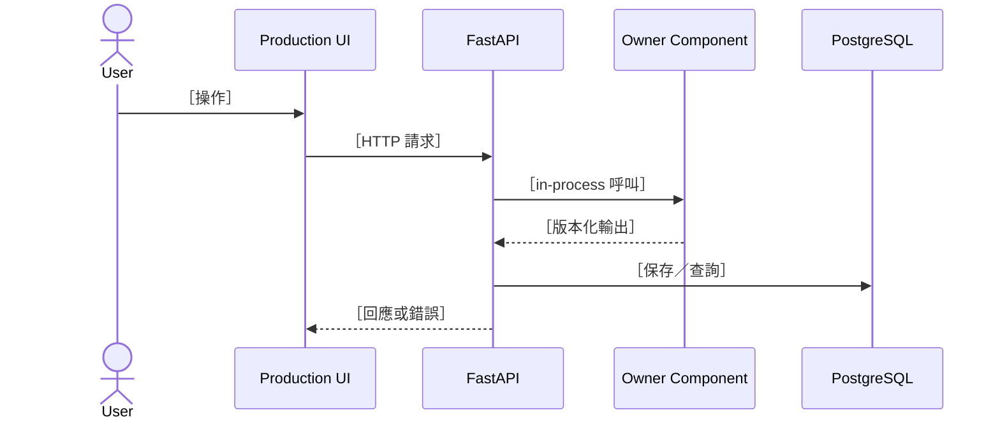

# 05 架構變更說明：［變更名稱］

## 基本資料與輸入／輸出

| 項目 | 內容 |
|---|---|
| 主要 owner／協作 owner | ［Bella／領域 owner］／［owner］ |
| 對應 PRD／ADR | ［連結］ |
| 輸入 | ［使用者操作、資料、外部服務］ |
| 輸出 | ［API、`layout_json`、`scene_json`、報告］ |
| 影響路徑／契約 | ［路徑］／［`docs/contracts/...`］ |

## 現況架構

RoomPilot 預設是模組化單體：瀏覽器載入 `backend/server/static/`，FastAPI process 內協調各 owner component，PostgreSQL 保存正式資料；CloudFront、AI provider 或 remote render 依實際配置列為外部系統。不要把 `backend/*` package 虛構成可獨立部署的微服務。

| C4 元素 | 現行實體／路徑 | Owner | Protocol／呼叫方式 |
|---|---|---|---|
| Browser UI | `backend/server/static/` | Bella | HTTP + JavaScript/Three.js |
| FastAPI runtime | `backend/server/` 與 in-process modules | Bella + 各 owner | HTTP／in-process |
| Database | PostgreSQL | Bella/Kai | SQL |
| 外部系統 | ［CloudFront／AI provider／其他］ | ［owner］ | HTTPS |

## 元件與責任變更

| 元件／路徑 | 變更前責任 | 變更後責任 | 禁止重複的他 owner 邏輯 |
|---|---|---|---|
| ［路徑］ | ［責任］ | ［責任］ | ［邊界］ |

## 關鍵動態流程

## 契約 Gate

- [ ] `layout_json` producer 是 Cody；Django enrichment 不建立第二套 layout truth。
- [ ] `scene_json` 保存方案；Ancai Engine 是位置、碰撞、淨空與合法性的唯一裁決者。
- [ ] 跨模組幾何為 cm，新欄位 `_cm`，面積 `_m2`。
- [ ] RAG 只檢索／排序／提供證據，不產生結構或合法座標。
- [ ] 正式 catalog、inactive/quarantine、家電邊界未被繞過。
- [ ] Production frontend 未被 `frontend3d/` 或新 app 取代。

## 保存、失敗與相容性

- 保存實體／交易邊界：［project/workflow/render/catalog］
- revision／idempotency：［行為］
- 舊資料與 reload：［策略］
- 外部依賴失敗：［timeout、明確錯誤、不得靜默 fallback］

## 驗證

- Owner 測試：［命令］
- Producer／consumer contract 測試：［命令］
- API／保存測試：［命令］
- Browser／運維驗證：［步驟］

