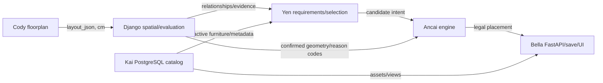

# 09 依賴關係圖：［功能／資料流］

## 基本資料

| 項目 | 內容 |
|---|---|
| 主要 owner／協作 owner | ［owner］／［owner］ |
| 輸入 | ［資料、API、檔案、事件］ |
| 輸出 | ［資料、API、保存狀態］ |
| 契約／schema | ［文件、版本、單位］ |

## Producer／Consumer 清單

| Producer | 輸出契約 | 傳遞方式 | Consumer | 失敗行為 |
|---|---|---|---|---|
| ［owner/path］ | ［schema］ | ［in-process/HTTP/SQL/file/HTTPS］ | ［owner/path］ | ［error/fallback］ |

## RoomPilot 正式依賴方向

依任務刪減節點；不要把圖中的 data flow 誤作所有模組的 import 關係。

## 依賴規則與風險

- [ ] API/UI adapter 依賴領域輸出，不複製領域演算法。
- [ ] Yen、Django 或 RAG 不可依賴 UI 狀態來裁決家具合法性。
- [ ] Engine 可讀確認後幾何與 catalog 尺寸，不依賴 LLM 文案。
- [ ] Catalog consumer 不改寫官方 item identity、URL、active/quarantine。
- [ ] 正式 provider 失敗有明確錯誤，不由 consumer 私自改資料來源。
- [ ] 無雙向 import；共享 schema 放正式 contract／model 邊界。

## 保存與版本流

- 原始 truth：［`layout_json`／catalog／其他］
- 衍生資料：［spatial evaluation／`scene_json`／其他］
- 保存 owner／位置：［Bella/project JSONB、Kai/PostgreSQL、其他］
- revision／schema evolution：［規則］

## 測試與驗證

| 邊 | Producer test | Consumer test | 整合／API test |
|---|---|---|---|
| ［A→B］ | ［命令］ | ［命令］ | ［命令］ |
