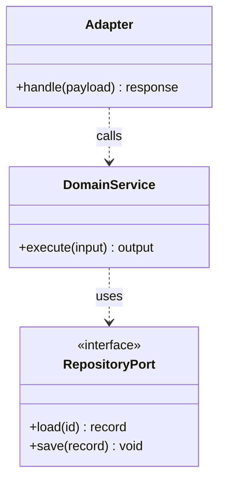

# 10 元件與介面關係：［模組名稱］

## 基本資料

| 項目 | 內容 |
|---|---|
| 主要 owner／協作 owner | ［owner］／［owner］ |
| 程式路徑 | ［repo 相對路徑］ |
| 輸入／輸出 | ［型別、schema、單位］ |
| 正式契約 | ［`docs/contracts/...`］ |

## 元件責任

| 元件／函式／類別 | 單一責任 | 輸入 | 輸出 | 依賴 | Owner |
|---|---|---|---|---|---|
| ［名稱］ | ［責任］ | ［型別］ | ［型別/error］ | ［抽象／adapter］ | ［owner］ |

## 關係圖

按現有實作替換；若模組是函式或資料導向，不要為符合模板而強迫 class 化。

## 介面契約

| 介面／方法 | 前置條件 | 後置條件 | 錯誤／reason code | 副作用 |
|---|---|---|---|---|
| ［名稱］ | ［條件］ | ［條件］ | ［錯誤］ | ［保存／無］ |

## RoomPilot 邊界檢查

- [ ] Cody/Django/Yen/Kai/Ancai 的領域責任沒有被 Bella adapter 或前端重做。
- [ ] `layout_json` 與 `scene_json` 的 model／adapter 方向清楚。
- [ ] 幾何 Value Object 使用 cm／`_cm`，面積使用 `_m2`。
- [ ] RAG component 只回傳候選、排名與證據；Engine component 回傳合法性。
- [ ] Repository 不繞過 PostgreSQL active/quarantine 或 project revision 規則。

## 狀態與保存

- 無狀態／有狀態：［說明］
- 保存 port 與實作：［路徑］
- transaction／revision：［行為］
- reload／相容性：［行為］

## 測試

- 純領域／介面測試：［命令］
- Repository／adapter 測試：［命令］
- Producer／consumer contract 測試：［命令］

