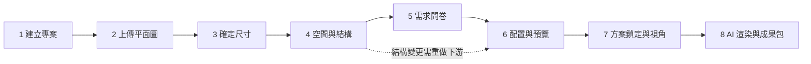

# 商業需求文件 (Business Requirements Document) - RoomPilot

> **版本:** v1.0 ｜ **更新:** 2026-08-12 ｜ **狀態:** 草稿（全部需求決策待產品 owner 核准）
> **Owner:** 產品 owner（需求決策與 Gate 簽核）；撰寫者為架構師（合成自現行程式碼與既有契約）
> **語域:** L1（業務）
> **實例:** 單例（整個 RoomPilot 專案一份）
> **佐證基準**：分支 `yen`、HEAD `8f378b24`、2026-08-12 工作樹。本文件為 L1 業務語域、不引程式碼行號；範圍與現況主張以該版工作樹為準，衝突時以原始碼與 ①需求決策的核准結果為準。

本文件回答：RoomPilot 為誰解決什麼問題、Pilot 階段要達成什麼商業結果、範圍納入什麼與明確排除什麼、誰是利害關係人、以及哪些商業決策必須由產品 owner 拍板。
本文件**不含**：功能敘述與畫面行為（見 [`./prd.md`](./prd.md)）、可測的系統需求與介面契約（見 [`./srs.md`](./srs.md)）、任何技術端點、資料結構、模組名稱與程式碼位置（見 [`../03_architecture/sad.md`](../03_architecture/sad.md)）。
決策的**核准結果**不在本文件，權威在 [`./requirements_tracker.xlsx`](./requirements_tracker.xlsx) ①需求決策與 ③Gate。

## 目錄

- [1. 商業背景 (Business Context)](#1-商業背景-business-context)
- [2. 現行流程 (As-Is)](#2-現行流程-as-is)
- [3. 未來流程 (To-Be)](#3-未來流程-to-be)
- [4. Pilot 商業目標與成功指標](#4-pilot-商業目標與成功指標)
- [5. 範圍納入與排除](#5-範圍納入與排除)
- [6. 利害關係人 (Stakeholders)](#6-利害關係人-stakeholders)
- [7. 需求決策清單 (DEC-001..DEC-019)](#7-需求決策清單-dec-001dec-019)
- [8. 業務規則 (Business Rules)](#8-業務規則-business-rules)
- [9. 商業風險與阻擋](#9-商業風險與阻擋)
- [10. 本文件不適用的章節](#10-本文件不適用的章節)
- [11. 追溯](#11-追溯)

---

## 1. 商業背景 (Business Context)

| 項目 | 內容 |
| :--- | :--- |
| **業務單位與利害關係人** | 產品 owner（拍板範圍、優先序、驗收）；六位模組 owner（Bella、Cody、Django、Kai、Yen、Ancai）；Pilot 客戶（屋主／設計提案的收受方，**具體對象待 owner 指定**）。詳見 §6 |
| **驅動因素** | 屋主手上有一張平面圖（手機照片、掃描圖或 DXF），但從「這張圖」到「一份可以拿去討論的成套設計提案」之間沒有可交付的路徑：量尺寸、判房間、選家具、驗證擺得下、產出效果圖與提案文件，每一段都需要不同專業的人接力，且中間狀態無法保存與回訪 |
| **預期效益** | 把上述接力壓縮成一條使用者自己走得完的八步路徑，且每一步的結果都可保存、可回訪、可重做（DEC-001、DEC-002）。**可量化效益（省時幅度、成案率、每案成本）待 owner 於 DEC-019 定義基準線後才可宣稱** |
| **本階段定位** | Pilot＝單一客戶／單一場域的驗證，不是公開上市產品。因此無市場定位、無定價模型、無多租戶需求 |

**證據邊界**：本節的「驅動因素」由現行產品流程與既有契約反推（八步流程定義於 `README.md` 與團隊八步架構描述文件）。**尚無訪談逐字稿或客訴數據佐證**，所有痛點量化描述一律標為假設，待 owner 於 ①需求決策確認。

---

## 2. 現行流程 (As-Is)

| 步驟 | 執行者 | 痛點 | 佐證狀態 |
| :--- | :--- | :--- | :--- |
| 拿到平面圖 | 屋主 | 圖上尺寸標註不齊、比例不明，屋主無法自行判讀 | 假設（辨識流程確實保留「比例待確認」與人工兩點標定的必要性，可間接佐證） |
| 丈量與重繪 | 設計方 | 需重新到場丈量與重畫，屋主等待期長 | 假設（待 owner 確認） |
| 選家具比尺寸 | 設計方 | 「擺不擺得下」靠經驗判斷，事後才發現走道不足或門打不開 | 部分佐證（現行系統把門前、窗前、櫃體正面淨空列為硬性阻擋條件） |
| 效果圖與提案 | 設計方 | 產出成本高，屋主難以在定案前看到多個版本 | 假設（待 owner 確認） |
| 報價 | 設計方 | 未現場丈量前的價格容易被誤解為承諾 | 已確認產品決策（既有契約明定：參考案例與渲染結果須標示為效果示意，不得偽裝為真實案例或正式報價） |

**Pilot 系統本身的現況（可佐證）**：八步流程已可從建立專案走到成果包，但**尚未宣告安全邊界**（OPEN-02）、**尚未指定唯一正式交付物**（OPEN-10）、**尚無資料保存與備份政策**（OPEN-13）。這三項是商業層的未完成事項，見 §9。

---

## 3. 未來流程 (To-Be)

- **與 As-Is 的關鍵差異**：屋主自己就能走完「一張圖 → 成套成果」，中途離開可回到同一步繼續（DEC-001、DEC-002）；「擺不擺得下」由系統以固定規則判定並以看得懂的中文說明原因，不再依賴個人經驗（DEC-008）。
- **人仍在迴圈裡**：電腦看圖的結果必須由人逐項確認過才能往下做設計；沒確認尺寸與空間就不能進入設計階段（DEC-004）。這是刻意保留的商業信任機制，不是待自動化的殘留步驟。
- **可比較性**：同一空間提供 A／B 兩套配置供屋主比較，兩套通過同樣的合法性檢查（DEC-009）。
- **誠實邊界**：外部服務（家具型錄資料庫、生圖、文件排版）不可用時，系統誠實中止並說明，不以假資料或假成功充數（DEC-017）。
- **過渡期並行策略**：不適用（Pilot 無被取代的既有系統，非新舊並行切換案）。

---

## 4. Pilot 商業目標與成功指標

| 目標 | 一句話 | 對應決策 | 成功指標 |
| :--- | :--- | :--- | :--- |
| G1 交付路徑成立 | 屋主用一張既有平面圖走完八步就能拿到成套設計成果 | DEC-001、DEC-003 | **待 owner 核准**（DEC-019：要跑哪些真實案例、幾間房、什麼算通過） |
| G2 進度不遺失 | 關瀏覽器、換裝置或中途離開都能回到同一步繼續 | DEC-002 | **待 owner 核准** |
| G3 人審把關 | 尺寸與空間未經人確認，不得進入設計階段 | DEC-004、DEC-018 | **待 owner 核准** |
| G4 方案可比較 | 每個空間有兩套通過同一套規則檢查的配置可比 | DEC-009 | **待 owner 核准** |
| G5 誠實交付 | 費用只給概算並明講需現場丈量；外部服務失效時誠實中止 | DEC-013、DEC-017 | **待 owner 核准** |
| G6 資料可託付 | 客戶案件資料的存放、備份、保留與交還有明文政策 | DEC-015 | **待 owner 核准**（現況為空白，見 §9） |

**指標數值一律缺席，且不得由 AI 代填。** 現況無端到端驗收樣本、無效能實測基準、無備份頻率定義；候選的量測維度（完成率、複核退回次數、生圖成功率、端到端耗時、每案成本）需 owner 先於 DEC-019 拍板基準線，才會下放到 [`../05_qa/UAT_RoomPilot_Pilot_內部_2026-08-12.md`](../05_qa/UAT_RoomPilot_Pilot_內部_2026-08-12.md) 成為可驗收對象。

---

## 5. 範圍納入與排除

### 5.1 納入（Pilot 承諾交付）

| # | 納入項 | 對應決策 |
| :--- | :--- | :--- |
| IN-1 | 從建立專案到成果包的完整八步路徑，單一入口、不另開第二條交付路徑 | DEC-001 |
| IN-2 | 用屋主手上的照片或 DXF 開案，不必重畫圖 | DEC-003 |
| IN-3 | 人工確認尺寸與空間的複核關卡 | DEC-004 |
| IN-4 | 全屋＋逐房需求問卷，使用者不必懂專業術語 | DEC-005 |
| IN-5 | 家具一律來自已驗證的正式型錄，且必須真的放得下、走得過去 | DEC-007、DEC-008 |
| IN-6 | 同一空間的 A／B 兩套配置比較 | DEC-009 |
| IN-7 | 鎖定視角、代表房色卡定調、逐房效果圖與有限次修改 | DEC-010、DEC-011 |
| IN-8 | 一份對客戶的正式交付主件 | DEC-012 |
| IN-9 | 公開行情的費用概算，附「需現場丈量與正式報價」的明確說明 | DEC-013 |

### 5.2 排除（Pilot 明確不做）

| # | 排除項 | 理由與對應決策 |
| :--- | :--- | :--- |
| OUT-1 | **不做公開上網服務** | Pilot 是單一客戶驗證，服務邊界限於受控環境；邊界的正式宣告待 DEC-014 核准（阻擋項 OPEN-02） |
| OUT-2 | **不做帳號系統**（註冊、登入、權限分級、多租戶隔離） | 同上：以部署隔離替代身分機制；此取捨必須由 owner 明文追認，不得默認為已完成（DEC-014） |
| OUT-3 | **不做施工圖** | 交付定位是設計提案與效果示意，不是可施工的圖說（DEC-012；既有產品決策已明定渲染成果須標示為效果示意） |
| OUT-4 | **不做正式報價，只給概算** | 系統不臆造價格；查無公開費率或單位不符者一律標「待報價」，不猜總價（DEC-013） |
| OUT-5 | 不把家電納入平面與立體擺設 | 冰箱、洗衣機這類家電只影響最終效果圖的畫面呈現（DEC-006） |
| OUT-6 | 不讓 AI 決定家具擺在哪裡 | AI 檢索只負責把既有的正式家具候選排前面，不新增、不替換、不決定位置（DEC-016） |
| OUT-7 | 不使用未驗證或隔離區的家具資料 | 給客戶看的家具一律來自已驗證的正式型錄（DEC-007） |
| OUT-8 | 不做市場競品分析與財務模型 | 不適用（Pilot 為單一客戶驗證，無市場定位需求），見 §10 |

---

## 6. 利害關係人 (Stakeholders)

| 角色 | 具體對象 | 在本專案的決策權 | 對本文件的關切 |
| :--- | :--- | :--- | :--- |
| 產品 owner | **待具名** | 範圍、優先序、里程碑、業務驗收、Gate 簽核；DEC-001..DEC-019 唯一拍板者 | 全文，特別是 §5、§7、§9 |
| 整合與正式介面 owner | Bella | 八步流程與正式介面的整合驗證門檻 | G1、G2、IN-1 |
| 平面圖辨識 owner | Cody | 看圖結果的品質與可複核性 | G3、IN-2、IN-3 |
| 空間資料與檢索 owner | Django | 空間關係與候選排序的邊界 | OUT-6、IN-4 |
| 家具資料 owner | Kai | 正式型錄的身分、可用性與隔離邊界 | IN-5、OUT-7 |
| 需求與選件 owner | Yen | 需求結構化與選件規則 | IN-4、IN-5 |
| 幾何合法性 owner | Ancai | 「擺得下、走得過」的判定規則 | G4、IN-5、IN-6 |
| 辨識品質協作 | Ben | 辨識測資與品質評估（與 Cody 共同維護） | G3 |
| Pilot 客戶 | **待 owner 指定** | 無決策權，但其驗收回饋決定 DEC-019 的基準線是否成立 | §4 全部指標 |

Owner 責任的權威定義在 [`../../AGENTS.md`](../../AGENTS.md) 與 `docs/TEAM_AI_OWNERSHIP.md`；**不得只依 Git 提交者推論 owner**。

---

## 7. 需求決策清單 (DEC-001..DEC-019)

> **狀態一律「待 owner 核准」。** 優先序、範圍、里程碑、業務驗收不由 AI 拍板；核准結果記於 [`./requirements_tracker.xlsx`](./requirements_tracker.xlsx) ①需求決策，理由記於 ②決策沿革。

| ID | 決策一句話（L1） | 涉及步驟 | 狀態 |
| :--- | :--- | :--- | :--- |
| DEC-001 | 屋主用一張既有平面圖走完八個步驟就能拿到成套設計成果，不另開第二條交付路徑 | 1–8 | 待 owner 核准 |
| DEC-002 | 每個案子有可保存、可恢復的身分；關瀏覽器、換裝置或中途離開都不遺失進度 | 1、跨步 | 待 owner 核准 |
| DEC-003 | 使用者用手上的照片或 DXF 就能開案，不必重畫圖 | 2 | 待 owner 核准 |
| DEC-004 | 電腦看圖的結果必須由人確認過才算數：沒確認尺寸與空間就不能往下做設計 | 3–4 | 待 owner 核准 |
| DEC-005 | 需求用問卷收集（全屋＋逐房），使用者不必懂專業術語也能表達 | 5 | 待 owner 核准 |
| DEC-006 | 冰箱、洗衣機這類家電只影響最終效果圖，不進平面與立體擺設 | 5、8 | 待 owner 核准 |
| DEC-007 | 給客戶看的家具一律來自已驗證的正式型錄；隔離區與未匹配資料不得出現 | 6 | 待 owner 核准 |
| DEC-008 | 擺出來的家具必須真的放得下、走得過去，放不下時要用看得懂的中文說明原因 | 6 | 待 owner 核准 |
| DEC-009 | 同一個空間提供 A／B 兩套配置供業主比較，兩套通過同樣的合法性檢查 | 6 | 待 owner 核准 |
| DEC-010 | 生圖前先鎖定視角；代表房先出色卡比較圖再定調，每個案子只做一次以控成本 | 7 | 待 owner 核准 |
| DEC-011 | 每個房間出一張效果圖（客廳另加夜景），對圖不滿意可有限次修改 | 8 | 待 owner 核准 |
| DEC-012 | 對客戶的正式交付物只能有一份主件（成果包／交付提案／設計手冊擇一） | 8 | 待 owner 核准（阻擋於 OPEN-10） |
| DEC-013 | 費用只給公開行情概算並明講需現場丈量與正式報價，系統不臆造價格 | 8 | 待 owner 核准 |
| DEC-014 | Pilot 的服務邊界（僅本機／內網展示、是否需要帳號）由 owner 明文界定 | 跨步 | 待 owner 核准（阻擋於 OPEN-02） |
| DEC-015 | 客戶案件資料存哪裡、誰備份、保留多久、結案後怎麼交還或刪除 | 跨步 | 待 owner 核准（阻擋於 OPEN-13） |
| DEC-016 | AI 檢索只負責把既有的正式家具候選排前面，不新增、不替換、更不決定放哪裡 | 5 | 待 owner 核准 |
| DEC-017 | 外部服務壞掉時要誠實中止並說明，不得以假資料充數 | 6–8 | 待 owner 核准 |
| DEC-018 | 第 4 步之後的結構變更會讓既有配置與生圖失效，必須讓使用者知道要重做哪些步驟 | 4、跨步 | 待 owner 核准 |
| DEC-019 | Pilot 驗收要跑哪些真實案例、幾間房、什麼算通過、綠燈基準線是什麼 | 跨步 | 待 owner 核准（§4 全部指標受阻於此） |

---

## 8. 業務規則 (Business Rules)

本專案**不另立 `BR-*` 前綴**：所有業務層規則已由 §7 的 `DEC-*` 承載，另開一套 ID 會造成同一條規則兩處維護、日後互相打臉。下游文件（[`./srs.md`](./srs.md)、[`../05_qa/test_plan.md`](../05_qa/test_plan.md)）一律引用 `DEC-*`，不重述內容。

三條具業務約束力、且已被多份既有契約重複確認的規則，在此點名以利閱讀（細節與可測條件見 srs）：

| 規則 | 例外情境 | 來源決策 |
| :--- | :--- | :--- |
| 家電只影響效果圖畫面，永不進入平面與立體擺設 | 無例外 | DEC-006 |
| 隔離區與未匹配的家具資料不得出現在任何客戶可見畫面 | 無例外；通過審查者須先移入正式型錄，不得就地標為可用 | DEC-007 |
| 外部服務不可用時誠實中止並說明，不回假結果 | 無例外 | DEC-017 |

---

## 9. 商業風險與阻擋

| 風險 | 商業影響 | 阻擋項 | 解除條件 |
| :--- | :--- | :--- | :--- |
| **安全邊界未宣告** | Pilot 現況沒有身分驗證機制，唯一邊界是部署位置。若在未宣告的情況下對外展示，客戶案件資料的可及範圍不可控，責任歸屬不明 | **OPEN-02** | owner 核准 DEC-014：明文界定「僅本機／內網展示」或「需要帳號」，並記入 [`../06_ops/deployment_and_operations.md`](../06_ops/deployment_and_operations.md) 與 [`../03_architecture/adr/ADR-012-pilot-loopback-deployment.md`](../03_architecture/adr/ADR-012-pilot-loopback-deployment.md) |
| **正式交付物未定** | 目前有三種成果同時存在（成果包、交付提案、設計手冊），對客戶承諾「哪一份才是正式交付物」尚未拍板；不拍板則驗收無對象、業務也無法對外說明交付內容 | **OPEN-10** | owner 核准 DEC-012：指定唯一主件，其餘降為附件或退役，並反映到 [`./prd.md`](./prd.md) 與 UAT 計畫 |
| **資料保存政策空白** | 客戶案件資料無備份、無保留期限、無結案交還或刪除程序，也無責任人。這是對客戶的承諾缺口，不是技術待辦 | **OPEN-13** | owner 核准 DEC-015：定義備份頻率、保留天數、配額告警與責任人，落地於 [`../06_ops/deployment_and_operations.md`](../06_ops/deployment_and_operations.md) |
| 驗收基準線缺席 | 無「什麼算通過」，Pilot 無法宣告成功或失敗 | DEC-019 | owner 拍板案例清單與綠燈基準線 |

前三項是**商業層阻擋**：在 owner 核准前，Pilot 不應對外進行正式客戶展示或交付承諾。此判斷本身亦待 owner 追認。

---

## 10. 本文件不適用的章節

| 常見章節 | 判定 |
| :--- | :--- |
| 市場與競品分析 | 不適用（Pilot 為單一客戶驗證，無市場定位需求） |
| 財務模型與定價策略 | 不適用（Pilot 為單一客戶驗證，無市場定位需求；費用面僅涉及 DEC-013 的概算揭露義務） |
| 法規遵循與稽核要求 | 不適用於本階段（無外部法規來源可佐證；個資面的最低限度已落在 DEC-015 與 OPEN-13，趨向正式服務時須重評） |
| 組織變革與教育訓練計畫 | 不適用（無被取代的既有系統，非流程改造案） |
| 新舊系統並行切換 | 不適用（見 §3） |

---

## 11. 追溯

- **上游**：`AGENTS.md`（不可違反的契約）、`README.md`（八步流程官方定義）、`docs/TEAM_AI_OWNERSHIP.md`（owner 責任矩陣）、`docs/contracts/`（已協議的跨模組契約）、[`../00-registry.md`](../00-registry.md)（ID 總索引）。
- **需求決策權威**：[`./requirements_tracker.xlsx`](./requirements_tracker.xlsx) ①需求決策（DEC-* 拍板）與 ③Gate（簽核）。本文件只登記決策題目與「待 owner 核准」狀態，不代表已核准。
- **下游**：[`./prd.md`](./prd.md)（DEC-* → 產品功能與畫面承諾）、[`./srs.md`](./srs.md)（DEC-* → FR-*／NFR-* 可測需求）、[`../02_ux_ui/ux_research_and_journey.md`](../02_ux_ui/ux_research_and_journey.md)（使用者旅程）、[`../05_qa/UAT_RoomPilot_Pilot_內部_2026-08-12.md`](../05_qa/UAT_RoomPilot_Pilot_內部_2026-08-12.md)（業務驗收）、[`../06_ops/deployment_and_operations.md`](../06_ops/deployment_and_operations.md)（DEC-014／DEC-015 的落地面）。
- **未解項**：OPEN-02、OPEN-10、OPEN-13 三項於本文件 §9 承接；其餘 OPEN-* 屬工程層，由 srs、sad 與 lld 承接。
