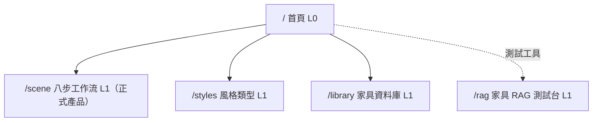

# 資訊架構 (IA) - RoomPilot

> **版本:** 0.1 | **更新:** 2026-08-11 | **狀態:** 草稿
> **Owner:** Bella（`backend/server/` 與 `backend/server/static/` 目錄責任，AGENTS.md:32-46）
> **語域:** L2（橋接）
> **實例:** 單例（全站一份）
> **生成:** AI 由程式碼與文件衍生｜來源版本 git yen@8863a36c
>
> **MECE 邊界**：本文件只談**全站結構**——頁面總覽、導航、URL 路由、跨頁資料載體。
> 使用者旅程歸 [`ux_research_and_journey.md`](./ux_research_and_journey.md)；`/scene` 單頁八步規格歸 [`ui_spec-scene.md`](./ui_spec-scene.md)（登錄簿 [`../00-registry.md`](../00-registry.md) §6 檔案計畫）。

設計原則（實況）：正式產品是**單頁八步精靈 `/scene`**（ADR-006），其餘頁面是入口與輔助工具；導航深度實際 ≤ 2 層（首頁 → 各頁）。

---

## 目錄

- [1. 頁面總覽](#1-頁面總覽)
- [2. 導航結構](#2-導航結構)
- [3. URL 結構與路由表](#3-url-結構與路由表)
- [4. 跨頁資料模型](#4-跨頁資料模型)
- [5. 檢查清單](#5-檢查清單)
- [6. 待確認](#6-待確認)
- [7. 追溯](#7-追溯)

## 1. 頁面總覽

| # | 路由 | 頁面（檔案） | 主要職責（單一） | 使用者目標 | 層級 |
| :--- | :--- | :--- | :--- | :--- | :--- |
| 0 | `/` | 首頁（`index.html`＋`home.js`） | 產品入口「AI 室內配置與 3D 預覽」，導向 /scene（index.html:6、:23） | 了解功能、開始設計 | L0 |
| 1 | `/scene` | 八步工作流（`scene.html`，1219 行，只載 `scene_v2.js`＋`site.css`，scene.html:7、:1217） | 建案→上傳→尺寸→結構→問卷→配置→視角→生圖交付的**唯一正式工作頁**（REQ-001~012） | 完成整個設計專案 | L1 |
| 2 | `/styles` | 風格類型（`styles.html`＋`styles.js`） | 風格類型展示（styles.html:6） | 瀏覽 6 種風格 | L1 |
| 3 | `/library` | 家具資料庫（`library.html`＋`library.js`） | 8,675 件官方 catalog 瀏覽（REQ-013） | 瀏覽家具 | L1 |
| 4 | `/rag` | 家具 RAG 測試台（`rag.html`＋`rag.js`，rag_api.py:159-161） | 向量檢索測試；**不接管第 6 步候選家具**（docs/TEAM_AI_OWNERSHIP.md:55） | 開發／驗證檢索 | L1（工具） |

**總計:** 5 頁。`/scene` 是單頁應用：8 顆導覽鈕（`scene.html:23-30`，`data-step`）對映內部 11 步狀態機（`scene_workflow.js:4-16 WORKFLOW_STEPS`）與 panel 表（`scene_workflow.js:18-30 WORKFLOW_PANEL_BY_STEP`）；第 6 步一顆鈕涵蓋 `layout_2d`＋`white_model_3d`＋`realistic_3d` 三個內部步。細節見 `ui_spec-scene.md`。

---

## 2. 導航結構

| 項目 | 連結 | 顯示條件 |
| :--- | :--- | :--- |
| 探索功能／風格類型／家具資料庫／3D 場景展示 | `/`、`/styles`、`/library`、`/scene` | `index/styles/library/rag.html` 共用 topbar（各檔 :18-21）；永遠顯示 |
| 開始設計（CTA） | `/scene` | 首頁與 styles/library topbar（index.html:23） |
| 離開專案返回首頁 | `/`（`#exit-project`，scene.html:11） | `/scene` 內；scene 頁**不放**全站導航，只有品牌連結返回 |

- `/scene` 頁內導航＝八步進度列（`nav.rp-progress`，`data-workflow-count="8"`，scene.html:22）；步驟狀態與指引帶 `#current-step-number`／`#step-instruction`（scene.html:33-38）。
- 步序阻擋：未處理的家具碰撞、淨空、超界會阻擋下一步；改結構強制回第 4 步（README.md:154-155，ACPT-004、ACPT-007）。
- 麵包屑：無（深度 ≤ 2，不需要）。返回機制：瀏覽器 back（跨頁）＋ `#exit-project`（離開工作流）。

---

## 3. URL 結構與路由表

頁面路由由 FastAPI 直接回 `FileResponse`（`main.py:1645-1669`；`/rag` 在 `rag_api.py:159-161`）；`/scene` 帶 `Cache-Control: no-store`（main.py:1666-1669）。另有靜態掛載 `/static`、`/docs-assets`（main.py:216-217）。

| 路由 | 頁面 | 認證 | 載入策略 |
| :--- | :--- | :--- | :--- |
| `/` | index.html | 無（見 §6） | FileResponse（main.py:1649-1651） |
| `/styles` | styles.html | 無 | FileResponse（main.py:1654-1656） |
| `/library` | library.html | 無 | FileResponse（main.py:1659-1661） |
| `/scene` | scene.html | 無 | FileResponse＋no-store（main.py:1664-1669）；JS 模組以 `?v=sha256-<12 碼>` cache key 鎖版（scene_v2.js:1-121） |
| `/scene?project_id=<id>` | 同上，還原既有專案 | 無 | 前端讀 query 後 `GET /api/projects/{id}` 恢復到 `current_step`（scene_v2.js:160、main.py:1800，ACPT-001） |
| `/rag` | rag.html | 無 | FileResponse＋no-store（rag_api.py:159-161） |

- 命名一律小寫單詞，無巢狀資源頁；八步進度**不上 URL**（切步驟不改網址，狀態在 workflow 狀態機與伺服器快照，見 §4）。
- API 面（`/api/*`）不屬本文件；端點清單見 `../04_design/api_spec.md`（登錄簿 §6）。

---

## 4. 跨頁資料模型

| 來源 | 目標 | 載體 | 資料內容 | 為何選此載體 |
| :--- | :--- | :--- | :--- | :--- |
| 首頁／外部連結 | `/scene` | URL query `?project_id=` | 專案 ID（scene_v2.js:160） | 可分享／可書籤，重開瀏覽器可恢復（SCN-001） |
| `/scene` 工作階段之間 | `/scene` | 伺服器 workflow JSON 單一快照 | 八步全狀態（校正、layout_json、問卷、scene_json、視角），深合併保存 `PUT /api/projects/{id}/workflow`（main.py:1806、project_store.py:18），≤2MB（NFR-002） | 跨裝置可恢復的唯一權威（FR-001） |
| 多分頁並行 | 伺服器 | `revision` 樂觀鎖 | 落後的保存回 409 `project_revision_conflict`（project_store.py:28-33，ACPT-014） | 防多分頁互踩（SCN-009） |
| `/scene` 頁內重整 | `/scene` | localStorage `roompilot.workflow.v2` | 步驟狀態機持久化（scene_workflow.js:2） | 本機過渡狀態，不可分享、不進 URL |
| 第 7 步色卡 | 第 8 步／頁內 | 記憶體 `state.paletteRenderImages` | base64 色卡圖，不進 jobs／持久化（scene_v2.js:16759 附註解） | 一次性大 payload，重生受 409 限制（ACPT-009） |

載體原則（實況）：可恢復的正式狀態一律進伺服器 workflow JSON（單一真相源）；URL 只帶專案 ID；localStorage 與記憶體只放本機過渡狀態。

---

## 5. 檢查清單

- [x] 每頁在 §1 有單一職責；`/scene` 對應 `ui_spec-scene.md`（其餘輔助頁未列 ui_spec，見 §6）
- [ ] 每個路由的認證/角色已明確——目前全站無認證（§6 待確認是否為 Pilot 既定範圍）
- [x] 導航深度 ≤ 2 層，無需麵包屑
- [x] URL 語義化、`project_id` 可分享、不含機密
- [x] 跨頁資料載體符合 §4 原則（正式狀態進伺服器快照）
- [x] 專案不存在時 API 回 404「找不到這個專案，請返回專案列表重新選擇」（main.py:1676-1682）

---

## 6. 待確認

1. 全站頁面路由**皆無認證／角色守衛**（main.py:1645-1669 直接回 FileResponse）；這是 Pilot 階段的既定範圍還是缺口，待 owner 於 `requirements_tracker.xlsx` ①需求決策確認。
2. `scene.js`（3128 行）與 `viewer.js` 未被任何 HTML 引用（grep 驗證 2026-08-11），疑為遺留碼；是否移除待 Bella 確認。
3. `/rag` 是否對末端使用者曝光（目前無任何頁面 topbar 連到它，僅 rag_api.py 路由存在），待確認。
4. `/styles`、`/library`、`/rag`、首頁是否需要各自的 ui_spec 實例，待文件範圍決策（登錄簿 §6 目前只計畫 `ui_spec-scene.md`）。

---

## 7. 追溯

| 項目 | ID／位置 |
| :--- | :--- |
| 對應需求 | REQ-001～REQ-012（`/scene` 八步）、REQ-013（`/library` catalog）——[`../00-registry.md`](../00-registry.md) §2.1 |
| 對應 FR | FR-001（保存/恢復）、FR-013（家具查詢）——登錄簿 §2.2 |
| 對應 ADR | ADR-006（static 單頁八步為正式前端）、ADR-007（workflow JSON 單一快照）——登錄簿 §3 |
| 對應旅程 | [`ux_research_and_journey.md`](./ux_research_and_journey.md) |
| 下游 | [`ui_spec-scene.md`](./ui_spec-scene.md)（單頁規格）、`../04_design/api_spec.md`（API 面） |
