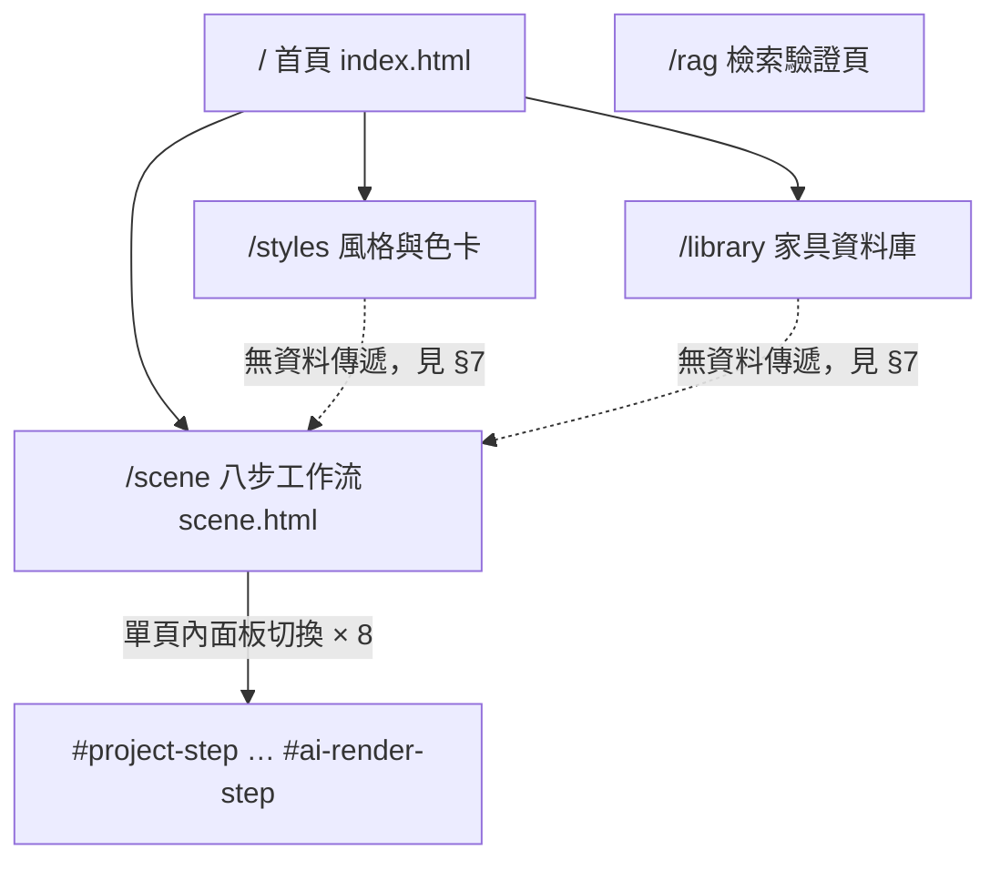

# 資訊架構 (Information Architecture) - RoomPilot

> **版本:** v1.0 ｜ **更新:** 2026-08-12 ｜ **狀態:** 草稿（待 owner 核准）
> **Owner:** 產品＋設計（頁面與導覽決策）；MOD-WEB owner（Bella）審閱 DOM 契約欄位
> **語域:** L2（橋接）——業務步名與 `data-step`／`data-panel`／DOM id 並列
> **實例:** 單例（整個 RoomPilot 一份）
>
> **本文件回答**：正式前端由哪幾個頁面組成、URL 怎麼走、內部 11 步狀態機如何折疊成對外 8 步導覽、步驟之間靠什麼載體傳資料。
> **本文件不含**：使用者旅程與痛點（見 [`ux_research_and_journey.md`](./ux_research_and_journey.md)）、單一步驟的欄位與互動細節（見 `ui_spec-step1..8`）、端點契約（見 [`api_spec.md`](../04_design/api_spec.md)）、幾何與擺位規則（見 [`lld.md`](../04_design/lld.md)）。
> **佐證基準**：分支 `yen`、HEAD `8f378b24`、2026-08-12 工作樹。DOM id 與 `data-*` 屬性以 `backend/server/static/` 實檔為準；行號隨程式碼演進，衝突時以原始碼為準。

設計原則（AS-IS 觀察）：正式產品是**單頁多面板**而非多路由；同一時間只有一個 `.rp-step-panel` 可見；頁面層導航深度為 1（首頁 → 功能頁），步驟層深度為 1（面板切換），不使用巢狀路由。

---

## 目錄

- [1. 頁面總覽](#1-頁面總覽)
- [2. 導航結構](#2-導航結構)
- [3. URL 結構與路由表](#3-url-結構與路由表)
- [4. 內部 11 步 ↔ 對外 8 步折疊對照](#4-內部-11-步--對外-8-步折疊對照)
- [5. 步驟前進條件與下游作廢傳播](#5-步驟前進條件與下游作廢傳播)
- [6. 單頁內的次級導覽](#6-單頁內的次級導覽)
- [7. 跨頁與跨步資料載體](#7-跨頁與跨步資料載體)
- [8. ui_spec 涵蓋範圍決策](#8-ui_spec-涵蓋範圍決策)
- [9. 待確認](#9-待確認)
- [10. 檢查清單](#10-檢查清單)
- [11. 追溯](#11-追溯)

## 1. 頁面總覽

| # | 路由 | 頁面檔 | 入口腳本 | 主要職責（單一） | 層級 | 在 Pilot 驗收範圍 |
| :--- | :--- | :--- | :--- | :--- | :--- | :--- |
| 0 | `/` | `index.html` | `home.js` | 行銷首頁：`fetchHomeData()` 顯示家具總數，五張流程卡由 JS 生成 | L0 | 否（僅入口） |
| 1 | `/styles` | `styles.html` | `styles.js` | 6 風格 × 色卡瀏覽，選中寫入 `localStorage["roompilot:selectedStyleCard"]` | L1 | 否 |
| 2 | `/library` | `library.html` | `library.js` | 家具資料庫分頁搜尋與單件 GLB 檢視 | L1 | 否 |
| 3 | **`/scene`** | `scene.html` | `scene_v2.js` | **八步工作流正式產品**：唯一承載 S1–S8 的頁面 | L1 | **是** |
| 4 | `/rag` | `rag.html` | `rag.js` | MOD-RAG 檢索驗證頁，輪詢 `/api/rag/search/jobs/{job_id}` | L1 | 否 |

**總計 5 頁**（`main.py:1649-1670` 四條 ＋ `rag_api.py:159`）。只有 `/scene` 進 Pilot 驗收範圍，理由三條：

1. DEC-001 承諾的交付路徑就是八步走完拿到成套成果，該路徑的權威實作只有 `scene_v2.js` 一份（ADR-010）。
2. ACPT-056 的安裝到啟動驗收，唯一要求可開啟的頁面是 `/scene`。
3. `/styles`、`/library` 的輸出對 `/scene` 沒有任何消費端（§7 逐鍵驗證）；`/rag` 是 FR-046／FR-048 的驗證面，不是交付面。

`frontend3d/`（React Three Fiber 打包產物）與 `panorama/` 沒有頁面路由，只能經 `/static` 靜態掛載開啟（`main.py:216`；移植路由註記於 `main.py:4049-4051`），不屬本 IA 範圍。

---

## 2. 導航結構

| 層 | 項目 | 連結／控制項 | 顯示條件 |
| :--- | :--- | :--- | :--- |
| 頁面層 | 探索功能／風格類型／家具資料庫／3D 場景展示 | `/`、`/styles`、`/library`、`/scene`（`index.html:18-21`） | 永遠顯示（`/scene` 自身的 topbar 不含這組連結） |
| 頁面層 | 離開專案 | `#exit-project` → `/`（`scene.html:11`） | 只在 `/scene`；離開前強制等待存檔完成，未完成擋住導航 |
| 步驟層 | 8 顆步驟按鈕 | `nav.rp-progress[data-workflow-count="8"]`，`[data-step]`（`scene.html:22-30`） | 只在 `/scene`；`is-active`／`is-complete` 由 `showStep()` 依 `PUBLIC_WORKFLOW_STEPS` 索引計算 |
| 步驟層 | 指示帶 | `#current-step-number` ＋ `#step-instruction`（`scene.html:35-36`） | 隨面板切換由 `instructions` 常數寫入 |

- 麵包屑：**不適用**——頁面層深度僅 1 層，步驟層以進度列取代麵包屑。
- 返回機制：步驟層靠點按進度列按鈕（受 §5 前進條件限制），不依賴瀏覽器 back；`/scene` 內的面板切換不寫入 History。
- 導航深度：頁面 1 層 ＋ 面板 1 層 ＋ 面板內次級 tab 1 層（§6）＝ 最深 3 層，符合設計原則。

---

## 3. URL 結構與路由表

| 路由 | 方法 | 處理函式 | 查詢參數 | 認證／角色 | 載入策略 |
| :--- | :--- | :--- | :--- | :--- | :--- |
| `/` | GET | `home()`（`main.py:1649`） | — | 無 | `FileResponse` 直出 |
| `/styles` | GET | `styles_page()`（`main.py:1654`） | — | 無 | `FileResponse` 直出 |
| `/library` | GET | `library_page()`（`main.py:1659`） | — | 無 | `FileResponse` 直出 |
| `/scene` | GET | `scene_page()`（`main.py:1664`） | `project_id`（`scene_v2.js:160`） | 無 | `FileResponse` ＋ `Cache-Control: no-store` |
| `/rag` | GET | `rag_page()`（`rag_api.py:159`） | — | 無 | `FileResponse` ＋ `Cache-Control: no-store` |
| `/static/*` | GET | `StaticFiles`（`main.py:216`） | 資產帶 `?v=sha256-<前 12 碼>` | 無 | 靜態；雜湊鏈由 `tests/test_scene_v2_contract.py:20` 強制 |

- **全站無認證、無角色、無 CORS、無 rate limit**：`app` 只掛 `GZipMiddleware`（`main.py:196-197`）。這是 Pilot 現況（NFR-019），是否為既定範圍待 DEC-014 核准，決策記於 [ADR-012](../03_architecture/adr/ADR-012-pilot-loopback-deployment.md)。
- URL 不含 token；`project_id` 是內部識別字但可分享——這是刻意取捨：重整與換分頁都要能還原同一專案（FR-022）。
- 命名現況：頁面路徑皆為單層小寫英文名詞，無巢狀資源路徑，也無過濾／排序查詢參數（清單與篩選都在 `/library` 內以 JS 狀態處理）。

---

## 4. 內部 11 步 ↔ 對外 8 步折疊對照

對外導覽恆為 8 顆按鈕；後端 `WORKFLOW_STEPS` 白名單與前端 `WORKFLOW_STEPS` 皆為 11 個 key（`main.py:164-176`、`scene_workflow.js:4-16`）。折疊規則只有兩條（`scene_v2.js:322-326` `publicWorkflowStep()`）：`calibration → recognition`、`white_model_3d | realistic_3d → layout_2d`。決策記於 [ADR-010](../03_architecture/adr/ADR-010-static-frontend-and-eight-step-collapse.md)，需求為 FR-020、驗收為 ACPT-018。

| 對外步 | `data-step` | 內部 step（11） | `data-panel` | section id | 主要 stage／viewer id |
| :--- | :--- | :--- | :--- | :--- | :--- |
| 1 建立專案 | `project` | `project` | `project` | `#project-step`（`scene.html:41`） | `#project-form` |
| 2 上傳平面圖 | `upload` | `upload` | `upload` | `#upload-step`（`:75`） | `.rp-drop-zone`、`#upload-floorplan-preview` |
| 3 確定尺寸 | `recognition` | `recognition`、`calibration` | `scale` | `#scale-step`（`:111`） | `#floorplan-calibration-stage` / `-image` / `-overlay` |
| 4 空間與結構 | `space_confirmation` | `space_confirmation` | `space` | `#space-step`（`:168`） | `#space-plan-stage` / `#space-plan-image` / `#space-plan-overlay`；尺寸複核 `#dimensioned-plan-stage` |
| 5 需求問卷 | `requirements` | `requirements` | `requirements` | `#requirements-step`（`:410`） | `#questionnaire-plan-image` ＋ `#questionnaire-plan-overlay` |
| 6 配置與預覽 | `layout_2d` | `layout_2d` | `layout-2d` | `#layout-2d-step`（`:606`） | `#layout-plan-stage` / `#layout-plan-image` / `#layout-room-overlay` / `#layout-furniture-layer` |
| 6 配置與預覽 | `layout_2d` | `white_model_3d` | `white-model-3d` | `#white-model-3d-step`（`:663`） | `#white-model-viewer` ＋ 側欄 `#configuration-plan-image` |
| 6 配置與預覽 | `layout_2d` | `realistic_3d` | `white-model-3d`（共用） | `#realistic-3d-step`（`:859`）**永不顯示** | `#realistic-viewer`（實例仍建立於 `scene_v2.js:606`） |
| 7 方案鎖定與視角 | `proposal_review` | `proposal_review` | `proposal-review` | `#proposal-review-step`（`:902`） | `#proposal-review-viewer` ＋ 疊層 `#proposal-review-image-stage` |
| 8 AI 渲染與成果包 | `ai_render` | `ai_render` | `ai-render` | `#ai-render-step`（`:950`） | `#ai-render-viewer` ＋ 疊層 `#ai-render-image-stage`（`single`／`gallery` 兩模式，FR-025） |

- 面板解析：`activePanelName(step)` 直接查 `WORKFLOW_PANEL_BY_STEP`（`scene_v2.js:1538-1540`、`scene_workflow.js:18-30`）；`panels` Map 由 `$$(".rp-step-panel")` 依 `dataset.panel` 建（`scene_v2.js:293`）。
- `realistic_3d` 因映射到 `white-model-3d`，`#realistic-3d-step`（`data-panel="realistic-3d"`）不會被 `showStep()` 選中；`realistic_3d` 與 `white_model_3d` 靠側欄 tab 區分（`realistic_3d` → `surfaces`、`white_model_3d` → `plan`，並隱藏 `#confirm-white-model`，`scene_v2.js:1580-1592`）。此 section 的去留見 [OPEN-50](#9-待確認)。
- 文案層也做同一折疊：`instructions` 對 11 個 key 各給一組「步驟 N／一句指示」，`recognition` 與 `calibration` 都寫「步驟 3」，`layout_2d`／`white_model_3d`／`realistic_3d` 都寫「步驟 6」（`scene_v2.js:297-309`）。

---

## 5. 步驟前進條件與下游作廢傳播

需求為 FR-021，驗收為 ACPT-019，場景 SCN-011／SCN-038，測試 TC-019（`tests/test_scene_workflow.py`）。

- **前進條件**：`REQUIRED_COMPLETIONS` 要求進入某步時，其**前面所有內部步驟**都已完成；`canEnter()` 逐項比對 `state.completed`（`scene_workflow.js:43-101,164-168`）。因為條件表以內部 11 步表述，對外第 6 步實際要跨 `layout_2d → white_model_3d → realistic_3d` 三道 gate 才能進第 7 步。
- **完成條件** `validCompletion(step, data)`（`scene_workflow.js:127-161`）：

| 內部 step | 完成判定 |
| :--- | :--- |
| `project` | `name` 去空白後非空 |
| `upload` | `filename` 去空白後非空 |
| `recognition` | `engine === "cody"` 或 `"dxf"` |
| `calibration` | `distanceCm > 0` |
| `space_confirmation` | `roomsConfirmed && structureConfirmed && proportionsConfirmed` |
| `requirements` | `basicConfirmed && roomsResolved` |
| `layout_2d` | `confirmed === true` |
| `white_model_3d` | `confirmed === true` 且（`expectedFurnitureCount === 0` 或 `visibleFurnitureCount > 0`，來源 `getDiagnostics()`，FR-024） |
| `realistic_3d` | `confirmed === true` |
| `proposal_review` | `confirmed === true` 且 `masterView.camera` 具 3 元素 `position_cm`、3 元素 `target_cm`、`fov_deg > 0`（FR-055） |
| `ai_render` | `confirmed === true` |

- **下游作廢**：`complete(step)` 觸發 `markDownstreamStale()`——以 `WORKFLOW_STEPS` 索引為序，移除所有索引更大的已完成步、設 `staleFrom = step`、`delete state.data[item]`（`scene_workflow.js:169-187`）。
- **前端額外清理**：`invalidateDownstreamFrom(step)` 另清 `state.proposalReview`、`selectedRenderRoomId`；`step === "space_confirmation"` 時再清 `confirmedStructureSnapshot`、`sceneData`、`surfaceState`、`activeStylePackId`、`materialBoundary` 並把各方案配置標記為 stale（`scene_v2.js:1381-1400`）。
- **伺服器端的同一條規則**：重跑第 3 步辨識時，後端把 `confirmed_floorplan`／`calibration`／`space_confirmation`／`requirements`／`layout_2d`／`white_model_3d`／`realistic_3d` 七個節點設為 null（FR-016，`main.py:3036-3063`）。第 4 步結構變更會讓下游配置與生圖失效，是 DEC-018 的業務承諾。

---

## 6. 單頁內的次級導覽

### 6.1 第 5 步：三層 stage ＋ 逐房五 section

| # | `data-questionnaire-stage` | 標籤 | 對應面板（`data-questionnaire-panel`） | 初始狀態 |
| :--- | :--- | :--- | :--- | :--- |
| 1 | `profile` | 全屋設定與風格 | `#whole-house-questionnaire`（`scene.html:431`） | 可用、`is-active` |
| 2 | `rooms` | 逐房需求與材質 | `#visual-questionnaire`（`:451`） | `disabled` |
| 3 | `summary` | 確認方案 | `#questionnaire-summary`（`:581`） | `disabled` |

逐房編輯器再分 5 個 section（`QUESTIONNAIRE_ROOM_SECTIONS`，`scene_v2.js:8099-8105`；委派屬性 `[data-questionnaire-room-section]`）：

| # | section id 值 | 標籤 | 摘要來源 |
| :--- | :--- | :--- | :--- |
| 1 | `usage` | 房間用途 | 已選用途標籤串接，未選顯示「待設定」 |
| 2 | `furniture` | 家具配置 | 已選家具件數 |
| 3 | `surfaces` | 牆面與地板 | 牆面預設與地板 `materialId` 皆有 → 「已選搭配」 |
| 4 | `ceiling` | 天花與照明 | 天花 `styleId` 與 `lightingId` 皆有 → 「已選搭配」 |
| 5 | `review` | 檢查並確認 | `room.confirmed` → 「本房已確認」 |

這五個 section 的導覽列 `#questionnaire-room-section-nav`、標題、存檔狀態與上下區按鈕皆由 JS 注入 `.rp-room-questionnaire-editor`，HTML 內只有靜態骨架（`scene_v2.js:8108-8129`）。撰寫 [`ui_spec-step5-requirements.md`](./ui_spec-step5-requirements.md) 時以**執行期 DOM** 為準。

### 6.2 第 6 步：側欄三 tab

容器 `aside.rp-control-pane.rp-3d-sidebar[data-scene-sidebar-mode]`（`scene.html:701`），tab 列 `role="tablist"`。

| `data-scene-sidebar-tab` | 標籤 | 對應面板 | 附註 |
| :--- | :--- | :--- | :--- |
| `plan` | 同步平面 | `#configuration-plan-panel`（`scene.html:708`，無 `data-scene-sidebar-panel`，靠 `[data-scene-sidebar-mode]` 控制） | 切入時 `requestAnimationFrame(renderConfigurationPlan)` |
| `issues` | 待處理 | `section.rp-configuration-pending[data-scene-sidebar-panel="issues"]`（`:725`） | 未處理數顯示於 `#scene-sidebar-issue-badge` |
| `surfaces` | 牆面與地面 | `[data-scene-sidebar-panel="surfaces"]`（`:753`） | 同步顯示 `#white-model-surface-entry` |

切換由 `setSceneSidebarTab(tab)` 寫 `sidebar.dataset.sceneSidebarMode` 並同步 `aria-selected`；非白名單值一律回退 `plan`（`scene_v2.js:1032-1045`）。

---

## 7. 跨頁與跨步資料載體

| 來源 | 目標 | 載體 | 資料內容 | 為何選此載體 |
| :--- | :--- | :--- | :--- | :--- |
| 任一入口 | `/scene` | URL query `?project_id=` | `project_id`（`scene_v2.js:160`） | 可書籤、可分享、重整即還原（FR-022） |
| `/scene` 各步 | 伺服器 | `PUT /api/projects/{id}/workflow` 單一快照 | `recognition`…`proposal_review` 九段，由 `workflowPayload()` 依「該步是否 live」逐段組出（`scene_v2.js:1171-1281`） | 跨裝置恢復；單快照＋樂觀鎖見 [ADR-004](../03_architecture/adr/ADR-004-single-workflow-snapshot-sqlite.md) |
| `/scene` 各步 | `/scene`（本機） | `localStorage["roompilot.workflow.v2:<projectId>"]` | 步驟狀態機：`completed`／`staleFrom`／`data`（`scene_workflow.js:107`） | 面板切換即時、不必等網路 |
| 存檔中斷 | 下次載入 | `localStorage["roompilot.pending-save.<projectId>"]` | 未送出快照 ＋ `base_updated_at`；相符才重放，409 則丟棄 | 斷線不掉資料（FR-022） |
| `/styles` | **無讀取端** | `localStorage["roompilot:selectedStyleCard"]` | 選中色卡 id | 唯一讀取端是 `scene.js`，該檔未被任何頁面載入 |
| `/library` | **無讀取端** | `localStorage["roompilot:sceneProposal"]` 等 3 鍵 | 方案與收藏清單 | 同上 |

- 載體選擇原則落地：可分享的只有 `project_id`（進 URL）；步驟狀態不可分享故進 localStorage；跨裝置需保存的進伺服器快照。
- **刻意不進任何載體**：`state.paletteRenderImages`（第 7 步色卡 base64），避免撐爆快照 2 MB 上限（NFR-001，`scene_v2.js:243-246`）；非作用中方案的 `sceneData` 亦只留記憶體。
- §7 最後兩列證實 `/styles`、`/library` 與八步流程之間**沒有實際的資料流**，是 §1 只把 `/scene` 列入驗收範圍的直接依據。

---

## 8. ui_spec 涵蓋範圍決策

- **開 8 份 ui_spec**：`ui_spec-step1-project` … `ui_spec-step8-ai-render`，一份對一顆對外步驟按鈕。分支 key 是**頁面／步驟面板**這個穩定錨點，不是功能。
- **第 6 步一份涵蓋三個內部 step**：`layout_2d`、`white_model_3d`、`realistic_3d` 對使用者是同一顆按鈕、同一段任務，拆三份會讓共享的 `sceneData`、側欄 tab 與 `getDiagnostics()` 硬閘在三份文件裡各寫一次而互相打臉。
- **不為 `/styles`、`/library`、`/rag` 開 ui_spec**，理由：
  1. 三者都不在 DEC-001 的八步交付路徑上，也不是任一 ACPT 的驗收對象。
  2. 三者對 `/scene` 沒有資料流（§7），改動它們不會改變八步的任何輸入或輸出契約。
  3. `/rag` 的可觀察行為已由 FR-046（具名 blocker）、FR-048（佇列與 TTL）與 [ADR-008](../03_architecture/adr/ADR-008-rag-retrieval-only-offline-models.md) 規範，UI 只是這些契約的顯示面；`/library`、`/styles` 的資料契約在 FR-039、FR-040。
  4. 這三頁若日後要進交付範圍，屬需求決策，須由產品 owner 於需求追蹤簿拍板後才補文件。

---

## 9. 待確認

| OPEN | 內容 | 對本文件的影響 |
| :--- | :--- | :--- |
| OPEN-04 | 11 步 ↔ 8 步折疊規則目前只寫在 `scene_v2.js:311-326`；是否視為正式契約、由誰擁有，尚未拍板 | §4 對照表現階段是 AS-IS 記錄；一旦定為契約，欄位 owner 與變更程序須寫進 ADR-010 |
| OPEN-09 | 步號三套並存：UI 八步、後端 11 個 `WORKFLOW_STEPS` key、舊契約十步（`render-jobs` 錯誤訊息仍寫「第 9 步」）。新文件統一用哪一套未定 | 本文件一律以「對外 8 步＋內部 step key」表述；若 owner 決定改採其他編號，§4、§5 與 8 份 ui_spec 需同批修訂 |
| OPEN-50 | `#realistic-3d-step`（`scene.html:859`）永不被 `showStep()` 顯示，`realisticViewer` 仍被建立並載入場景；此 section 與 `scene.js`(3,128 行) 是否正式退役可刪 | §4 最後一列標「永不顯示」；若確認退役，該列與對應 viewer 描述應刪除而非保留 |

---

## 10. 檢查清單

- [x] 每頁在 §1 有單一職責；進驗收範圍的 `/scene` 對應 8 份 ui_spec，其餘三頁的排除理由寫在 §8
- [x] 每個路由的認證／角色狀態已明確（§3：全站無認證，屬 NFR-019／ADR-012，待 DEC-014 核准）
- [x] 導航深度 ≤ 3 層（頁面／面板／次級 tab）；以進度列取代麵包屑並說明理由
- [x] URL 語義化、不含 token；唯一查詢參數 `project_id` 的可分享性是刻意取捨
- [x] 跨頁／跨步載體逐條列出，並標示兩個**無讀取端**的 localStorage 鍵
- [ ] 404／空狀態的返回 CTA：`main.py` 未註冊自訂 404 頁，`/scene` 找不到專案時由 `project_not_found` 錯誤訊息引導——**尚未有統一的空狀態規格**，待 ui_spec 逐步補齊

---

## 11. 追溯

| 方向 | 內容 |
| :--- | :--- |
| 上游需求 | DEC-001、DEC-018；FR-020（11→8 折疊）、FR-021（前進條件與作廢）、FR-022（雙寫持久化）、FR-023（2D 疊層）、FR-024（viewer 硬閘）、FR-025（生圖疊層）、FR-055（相機三元組）、NFR-019（無認證邊界）、NFR-021（資產快取鍵） |
| 上游決策 | [ADR-010](../03_architecture/adr/ADR-010-static-frontend-and-eight-step-collapse.md)（正式前端與八步折疊）、[ADR-004](../03_architecture/adr/ADR-004-single-workflow-snapshot-sqlite.md)（單快照）、[ADR-012](../03_architecture/adr/ADR-012-pilot-loopback-deployment.md)（部署形態與安全邊界）、[ADR-008](../03_architecture/adr/ADR-008-rag-retrieval-only-offline-models.md)（RAG 只做檢索） |
| 驗收與場景 | ACPT-018（導覽恆 8 顆、11 步皆可映射）、ACPT-019（前進條件與下游作廢）、ACPT-021、ACPT-023、ACPT-047；SCN-011、SCN-038、SCN-039、SCN-037 |
| 測試 | TC-018（`tests/test_scene_workflow.py`、`tests/test_scene_v2_contract.py`）、TC-019、TC-021、TC-023 |
| 上游文件 | [`srs.md`](../01_requirements/srs.md)、[`prd.md`](../01_requirements/prd.md)、[`ux_research_and_journey.md`](./ux_research_and_journey.md) |
| 下游文件 | `ui_spec-step1-project.md` … [`ui_spec-step8-ai-render.md`](./ui_spec-step8-ai-render.md)（各步欄位與互動）、[`sad.md`](../03_architecture/sad.md)（MOD-WEB 容器）、[`api_spec.md`](../04_design/api_spec.md)（端點契約）、[`test_plan.md`](../05_qa/test_plan.md)、[`UAT_RoomPilot_Pilot_內部_2026-08-12.md`](../05_qa/UAT_RoomPilot_Pilot_內部_2026-08-12.md) |
| 決策權威 | 頁面納入／排除、Pilot 驗收範圍屬產品 owner 權責，記於需求追蹤簿 ①需求決策；本文件只記錄 AS-IS 與待確認項，**狀態為待 owner 核准** |
