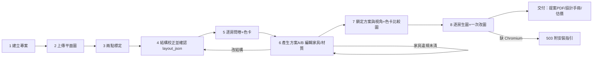

# UX 研究與使用者旅程 (UX Research & Journey) - RoomPilot

> **版本:** 0.1 | **更新:** 2026-08-11 | **狀態:** 草稿
> **Owner:** Bella（`backend/server/static/` 八步 UI 的目錄 owner，AGENTS.md:32-46）
> **語域:** L1/L2（業務為主，關鍵處並列工程詞與穩定 ID）
> **實例:** 單例（整個產品一份）
> **定位宣告:** 本文件回答「使用者在什麼情境下、用什麼順序完成八步設計流程？哪裡會卡住？」。全站頁面層級與導航歸 [`information_architecture.md`](./information_architecture.md)；單頁細節歸 [`ui_spec-scene.md`](./ui_spec-scene.md)；需求本文歸 [`../01_requirements/prd.md`](../01_requirements/prd.md)。
> 生成：AI 由程式碼與文件衍生｜來源版本 git yen@8863a36c

---

## 目錄

- [1. 研究計畫 (Research Plan)](#1-研究計畫-research-plan)
- [2. 研究發現 (Research Report)](#2-研究發現-research-report)
- [3. Persona](#3-persona)
- [4. 使用者旅程 (Journey Map)](#4-使用者旅程-journey-map)
- [5. User Flow / Task Flow](#5-user-flow--task-flow)
- [6. 可用性測試 (Usability Testing)](#6-可用性測試-usability-testing)
- [7. 待確認](#7-待確認)
- [8. 追溯](#8-追溯)

## 1. 研究計畫 (Research Plan)

repo 內沒有正式的使用者研究計畫、訪談逐字稿或問卷資料——本節整表為**待確認**（見 §7-1）。目前唯一接近「研究」的既有機制是產品內建的需求收集本身：

| 項目 | 內容 |
| :--- | :--- |
| **研究目標** | 待確認（建議：驗證非專業使用者能否獨立走完八步並取得可用交付包） |
| **對象與招募** | 待確認 |
| **方法** | 待確認；現況替代品：第 5 步逐房問卷＋Agent intake 訪談（`POST /api/agent/intake/start|answer`，main.py:3336、3343）在產品內結構化收集每個使用者的需求 |
| **訪談題綱** | 待確認；問卷視覺題庫見 `GET /api/questionnaire/visual-catalog`（main.py:3195） |

---

## 2. 研究發現 (Research Report)

無訪談證據（SRC-* 來源登錄不存在），不虛構。以下是從程式碼與 README 可證的**產品已回應的使用行為假設**——即系統為了哪些預期卡點而內建了機制；這些假設本身尚未經真人研究驗證（§7-2）：

| 產品已內建的回應 | 證據（程式碼座標） | 隱含的使用行為假設 |
| :--- | :--- | :--- |
| 八步進度可跨瀏覽器工作階段恢復（REQ-001） | workflow JSON 單一快照＋`GET /api/projects/{id}` 還原 current_step（project_store.py:12、main.py:1800） | 使用者會中途離開、隔天回來繼續（SCN-001） |
| 辨識結果須人工校正並確認才鎖定（REQ-004） | `POST /api/floorplan/confirm`（main.py:4149）；改結構強制回第 4 步（scene.html:742-750） | 自動辨識不可全信，使用者需要修正權 |
| 家具違規即時阻擋並給理由（REQ-007） | 碰撞/淨空/超界阻擋下一步（README.md:154-155）；門前 75cm 淨空拒放（ACPT-007） | 使用者會把家具拖到不合法位置，需要被擋且被說明 |
| 多分頁互踩以 409 保護（ACPT-014） | revision 樂觀鎖（project_store.py:28-33） | 使用者會開多個分頁編輯同一專案（SCN-009） |
| 色卡/改圖有嚴格額度（ACPT-009、ACPT-010） | 色卡每專案一次、改圖每房一次，超過 409（main.py:2135-2140、2224） | 生圖成本高，使用者會反覆重生，需要額度節流 |

---

## 3. Persona

repo 未含經研究驗證的 persona；以下兩個角色由 README 的產品定位推導（README.md:3-5、157-191），視為 TO-BE 假設（§7-3）：

| 項目 | Persona A：一般屋主（假設） | Persona B：室內設計師（假設） |
| :--- | :--- | :--- |
| **角色** | 拿到新屋平面圖、無設計背景的屋主 | 用工具加速提案的設計師 |
| **目標** | 從平面圖走到「看得懂的寫實圖＋估價」 | 快速產出方案 A/B、鎖定後取得工程文件與交付提案 PDF（README.md:157-191） |
| **痛點** | 不懂比例尺與圖面符號；不知道家具擺哪合法 | 反覆改圖與交付文件產製耗時 |
| **使用情境／裝置** | 桌面瀏覽器（Three.js 3D 檢視，scene.html:7） | 桌面瀏覽器；設計師鎖定 D-revision 後生成工程文件（README.md:165-169） |

---

## 4. 使用者旅程 (Journey Map)

骨架＝正式產品的八步工作流（README.md:139-152；facts 01-product §2）。「情緒」欄為推測性假設、未經研究驗證（§7-2）；「轉換率目標」全欄待確認（§7-4），repo 無事件追蹤或漏斗數據。

| 階段（步） | 使用者行為 | 情緒（假設） | 已知卡點（有程式碼證據） | 產品機制回應 |
| :--- | :--- | :--- | :--- | :--- |
| 1 建立專案 | 命名、建案 | 期待 | — | `POST /api/projects`（main.py:1784），revision 隨建立 |
| 2 上傳平面圖 | 上傳 PNG/JPG/DXF，等待辨識 | 不確定（辨識準嗎） | 辨識信心度不足時需人工介入 | analyze 回 analysis＋layout_json＋信心度（main.py:2981） |
| 3 確定尺寸 | 點兩點、輸入實際距離 | 專注 | 標定錯會讓下游全部尺寸錯 | 兩點標定換算公分制（scene_calibration.js；NFR-001） |
| 4 空間與結構 | 校正牆/門/窗/樑/柱後確認 | 謹慎 | 確認後結構鎖定；想改要回頭重驗家具（scene.html:742-750） | 鎖定 layout_json（main.py:4149；ACPT-004） |
| 5 需求問卷 | 逐房問卷、家電需求、選三張風格色卡 | 投入 | 題量多；家電不會出現在擺設，易誤解（REQ-014） | intake 訪談＋視覺題庫（main.py:3336、3195）；家電只進 render_context（scene_service.py:3058-3062） |
| 6 配置與預覽 | 看方案 A/B、2D/3D 同步編輯家具、選材質、走動預覽 | 掌控感／偶爾挫折 | 拖到門前淨空/超界被拒（ACPT-007）；違規未清就不能下一步（README.md:154-155）；DB 不可用時家具清單失敗（SCN-006） | 引擎裁決＋分流訊息（main.py:3647-3709、3998）；`/api/catalog/status` 可見失敗（NFR-003） |
| 7 方案鎖定與視角 | 鎖定方案、逐房調視角、生色卡比較圖 | 期待成果 | 色卡每專案只能成功一次，二次 409（ACPT-009） | 鎖定視角＋截圖上傳（main.py:1937、scene.html:943） |
| 8 AI 渲染與成果包 | 逐房生圖、一次改圖、下載 PDF 與估價 | 收穫／若失敗則挫折 | 每房改圖僅一次額度（ACPT-010）；缺 Playwright Chromium 提案回 503（ACPT-011） | ai-renders＋客廳夜間圖＋交付 PDF＋`POST /api/cost/estimate`（main.py:2070、2384、4162） |

---

## 5. User Flow / Task Flow

主流程（happy path＝SCN-002＋SCN-007）與兩條已實作的例外路徑：

- 入口：`/static/scene.html` 單頁八步精靈（scene.html:23-30 的 8 顆導覽鈕；內部狀態機 11 步，scene_workflow.js:4-16）。
- 決策點：第 6 步逐房 A/B 選擇並合成回單一方案（SCN-003，scene_v2.js:4115、4583-4590）。
- 例外：結構變更強制回第 4 步（README.md:154-155）；多分頁落後方收 409 重載（SCN-009）。
- 完成的可觀察結果：逐房渲染 PNG、delivery-proposal PDF、工程報告與估價（facts 01-product §2 步 8）。
- 頁面層級與路由歸 [`information_architecture.md`](./information_architecture.md)；各步 DOM 與狀態歸 [`ui_spec-scene.md`](./ui_spec-scene.md)。

---

## 6. 可用性測試 (Usability Testing)

repo 內無可用性測試紀錄（無任務完成率、無側錄、無測試報告）——整節待確認（§7-5）。既有的自動化測試（pytest、scene_v2 契約測試）驗證的是程式行為，不是使用者可用性，不得混充。

| 任務 | 完成率 | 卡點 | 改善項目 |
| :--- | :--- | :--- | :--- |
| 待確認 | 待確認 | 待確認 | 待確認 |

---

## 7. 待確認

1. 研究計畫全部項目（目標、對象、方法、題綱）：repo 無任何使用者研究產出物。
2. §2 的「使用行為假設」與 §4 的「情緒」欄均為由產品機制反推的推測，未經訪談或觀察驗證。
3. §3 兩個 persona 為 README 產品定位的推導（TO-BE），未經真人研究。
4. §4 轉換率目標：repo 無事件追蹤、埋點或漏斗數據。
5. 可用性測試：未曾執行或未曾入 repo。
6. 需求優先序尚未經 `requirements_tracker.xlsx` ①需求決策 owner 核准（同 ../00-registry.md §7）。

---

## 8. 追溯

- 上游：[`../00-registry.md`](../00-registry.md) 的 REQ-001～REQ-014、ACPT-004/007/009/010/011/014、SCN-001～SCN-009；事實檔 `01-product.md` §1-§2、`04-frontend.md` §4-§8（git yen@8863a36c）。
- 洞察 → 需求：未來研究發現以 `SRC-*` 進入 `/intake` 來源登錄，不直接改寫 [`../01_requirements/prd.md`](../01_requirements/prd.md)。
- 流程 → 畫面：§5 每個節點對應 [`ui_spec-scene.md`](./ui_spec-scene.md) 的步驟面板（scene.html `data-step`）；頁面層級見 [`information_architecture.md`](./information_architecture.md)。
