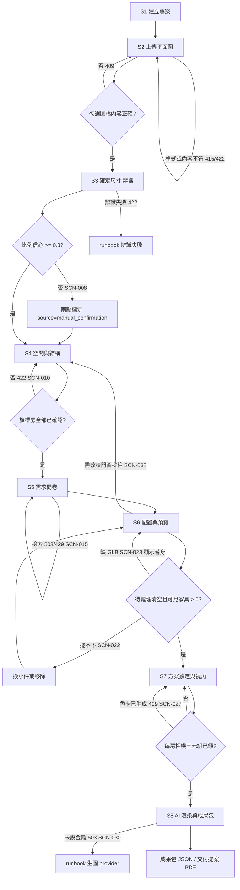

# UX 研究與使用者旅程 (UX Research and Journey) - RoomPilot

> **版本:** v1.0 ｜ **更新:** 2026-08-12 ｜ **狀態:** 草稿（旅程結論待 owner 核准）
> **Owner:** 產品 owner（旅程與優先序）／Bella（第 4–8 步 UI 現況）
> **語域:** L2（橋接）——業務行為與工程失效面並列，跨層以穩定 ID 綁定
> **實例:** 單例（整個 RoomPilot 產品一份）
> **回答的問題:** 使用者用什麼順序走完八步、每一步系統給什麼回饋、在哪裡會卡住、卡住後怎麼回到可前進的狀態。
> **不含:** 單頁的欄位、元件與互動細節（見 `ui_spec-step1..8`）、頁面層級導航與路由（見 [`information_architecture.md`](./information_architecture.md)）、需求優先序與業務承諾（見 [`../01_requirements/prd.md`](../01_requirements/prd.md)）、維運處置步驟（見 `../06_ops/runbook-*.md`）。
> **佐證基準**：分支 `yen`、HEAD `8f378b24`、2026-08-12 工作樹。本文件的發現由失效面反推而非使用者訪談（見 §1 方法限制）；行號隨程式碼演進，衝突時以原始碼為準。

## 目錄

- [1. 研究計畫與方法限制](#1-研究計畫與方法限制)
- [2. 研究發現（由失效面反推）](#2-研究發現由失效面反推)
- [3. 使用者角色](#3-使用者角色)
- [4. 八步使用者旅程](#4-八步使用者旅程)
- [5. 六個關鍵卡點與復原路徑](#5-六個關鍵卡點與復原路徑)
- [6. 回退路徑：第 6 步改結構回第 4 步](#6-回退路徑第-6-步改結構回第-4-步)
- [7. 跨步體驗：存檔與還原](#7-跨步體驗存檔與還原)
- [8. Task Flow](#8-task-flow)
- [9. 可用性測試現況](#9-可用性測試現況)
- [10. 待確認](#10-待確認)
- [11. 追溯](#11-追溯)

---

## 1. 研究計畫與方法限制

| 項目 | 內容 |
| :--- | :--- |
| **研究目標** | 判定八步流程中哪些卡點會讓使用者停在半路、以及每個卡點是否存在使用者自己走得出來的復原路徑 |
| **對象與招募** | **無**。repo 內無訪談紀錄、無招募名單、無逐字稿 |
| **實際方法** | 由現行 UI（`backend/server/static/scene.html`、`scene_v2.js`）與**真實失效面**（HTTP 錯誤碼、閘門條件、`placement.failed`、狀態端點 blocker）反推旅程 |
| **訪談題綱** | 不適用（未執行訪談） |

**方法限制（必讀）**：本文件**沒有任何使用者訪談或觀察資料可引用**，因此不建立以訪談為依據的 persona，也不填寫模板的「情緒」與「轉換率目標」欄——前者需受測者自陳、後者需事件埋點，而 `scene.html` 與 `scene_v2.js` 內無任何分析或埋點腳本。本文件所有「卡點」皆為**程式可觸發的阻擋條件**，不是觀察到的使用者困惑；兩者不可混為一談。真實可用性資料要等 [`../05_qa/UAT_RoomPilot_Pilot_內部_2026-08-12.md`](../05_qa/UAT_RoomPilot_Pilot_內部_2026-08-12.md) 執行後才有。

---

## 2. 研究發現（由失效面反推）

| 發現 | 證據（程式碼座標） | 對產品的意義 |
| :--- | :--- | :--- |
| 阻擋一律發生在「宣告完成」的那一刻，不是編輯當下 | `scene_workflow.js:127-161`（`validCompletion`）、`main.py:1737-1781`（第 4 步 422） | 使用者可能已經做了很多操作才被擋；錯誤訊息必須指回**哪一房／哪一件**，而不只說「未完成」 |
| 系統對外部服務不可用一律誠實中止，不給假結果 | `main.py:2108-2116`（503）、`AGENTS.md:57` | 使用者看到的是「服務未設定」而非壞圖；代價是第 8 步會整段停住，需要維運介入而非使用者自救（DEC-017） |
| 兩種額度是伺服器強制、且不可逆 | 色卡每專案一次 `main.py:2152`；改圖每房一次 `main.py:2247` | 這是流程中唯一「用掉就沒有」的資源，UI 必須在點擊前把不可逆性講清楚（ADR-009） |
| 幾何合法性完全外包後端，前端只呈現理由 | `AGENTS.md:54`；`scene_v2.js:11765`、`:13957` | 使用者拖不動家具時看到的是引擎回的繁體中文原因（FR-034），不是前端自行猜測的訊息 |
| 下游作廢是自動的、且會刪資料 | `scene_workflow.js:175-187`（`markDownstreamStale` 刪 `state.data[step]`） | 回頭改結構的代價是真實的資料損失，不是只換一個標記；必須在回退前告知（DEC-018） |
| 缺件降級不阻斷，缺**確認**才阻斷 | GLB 缺席只給替身（`scene_viewer.js:4224-4277`）；旗標房未確認直接 422 | 產品把「資料不完整」與「人未確認」分成兩種嚴重度，UX 也應該用兩種強度呈現 |

---

## 3. 使用者角色

**不建立訪談型 persona。** 沒有訪談就寫出的角色、目標與痛點屬於虛構，違反來源優先原則。以下只登記**由 UI 與契約可佐證的操作者類型**，人物特徵、動機與熟練度一律「待確認」。

| 項目 | 操作者 A | 操作者 B |
| :--- | :--- | :--- |
| **角色** | 走完八步、對成果負責的案件承辦者（`/scene` 單頁的唯一操作者） | 維運／整合者（處理狀態端點與 runbook，`main.py:2028,2064,3144` 等七個 `/status`） |
| **可佐證的目標** | 從一張既有平面圖產出可交付的成果包／提案 PDF（DEC-001） | 讓外部相依（型錄 DB、生圖 provider、排版引擎）恢復可用（DEC-017） |
| **可佐證的操作邊界** | 不能改幾何規則、不能繞過額度、不能取得金鑰（ADR-002、ADR-009） | 不參與設計決策 |
| **使用情境／裝置** | **待確認**——UI 為桌面寬版三欄配置且大量使用 pointer 拖曳（`scene_v2.js:17755-17835`），但目標裝置與現場情境無來源可證 |
| **熟練度／專業背景** | **待確認**——問卷以白話題目設計（DEC-005）暗示非專業使用者，但無使用者資料佐證 |

---

## 4. 八步使用者旅程

八步為對外導覽（`scene.html:22-30`，`data-workflow-count="8"`）；後端 `WORKFLOW_STEPS` 實為 11 個 key，`calibration` 併入第 3 步、`white_model_3d`／`realistic_3d` 併入第 6 步（`scene_v2.js:311-322`，FR-020／ADR-010）。

| 步 | 使用者目標 | 系統回饋（可觀察） | 主要卡點 | 復原路徑 |
| :--- | :--- | :--- | :--- | :--- |
| S1 建立專案 | 取得一個之後回得來的案子 | 回 `project_id`、`revision=0`、`current_step="project"`；`#project-save-status` 顯示存檔狀態 | 空名稱被拒（422 `project_name_required`） | 補名稱重送；SCN-001 |
| S2 上傳平面圖 | 用手邊的圖開案，不重畫 | 只收 `.dxf/.png/.jpg/.jpeg`，成功後預覽原圖 | 格式不符 415、空檔或壞圖 422（SCN-004）；未勾「圖檔內容正確」按辨識 → 409 `floorplan_confirmation_required`（SCN-006） | 換檔重傳，或回到勾選處補勾 |
| S3 確定尺寸 | 讓圖上的像素變成公分 | 產出 `layout_json`（公分、左下原點）與 `spatial_report`；標示辨識引擎 | **比例信心不足要求兩點標定（SCN-008）**；辨識整體失敗 422 `cody_recognition_failed`／`dxf_parse_failed` | 手動兩點標定（§5.1）；辨識失敗見 [`../06_ops/runbook-recognition-failed-or-review-blocked.md`](../06_ops/runbook-recognition-failed-or-review-blocked.md) |
| S4 空間與結構 | 把房、牆、門、窗、樑、柱改成對的 | 輸出 `floorplan_editor`（`coordinate_unit:"cm"`）；3D 白模出現對應牆體與單一門洞 | **旗標房未逐一確認即宣告完成 → 422 `recognition_review_unresolved`（SCN-010）** | 依回應的 `focus`／`rooms` 跳到該房確認（§5.2） |
| S5 需求問卷 | 不懂術語也能講清楚要什麼 | 三個 stage（`profile`／`rooms`／`summary`）＋逐房五段；家電只寫入 `render_context`（ADR-006） | 檢索不可用（503／具名 blocker，SCN-015）、檢索佇列滿載 429（SCN-016） | **不阻塞**：候選改用型錄預設排序，問卷照常完成（FR-049） |
| S6 配置與預覽 | 看到真的放得下的家具，並就地調整 | `scene_json` 由引擎產座標；側欄 `issues` 分頁與 `#scene-sidebar-issue-badge` 顯示待處理數 | **家具擺不下（SCN-022）**；**缺 GLB 顯示白模替身（SCN-023）**；拖到門前淨空內被拒（SCN-021） | §5.3、§5.4；淨空被拒時就地換位置，理由為繁中字串（FR-034） |
| S7 方案鎖定與視角 | 決定風格、鎖好每房要出圖的視角 | 逐房相機三元組＋`fov_deg>0` 齊備才能完成（`scene_workflow.js:150-157`） | **色卡每專案只能成功產生一次（SCN-027）**；相機未鎖齊無法前進 | 全部失敗時不鎖定、可重試（SCN-028）；相機逐房補鎖（SCN-026） |
| S8 AI 渲染與成果包 | 拿到逐房效果圖與可交付檔案 | 各房並行生圖、客廳另加夜景；成功後自動放大疊層（`scene_v2.js:17064-17066`） | **未設金鑰 → 503（SCN-030）**；改圖第二次 409 `ai_edit_budget_exhausted`（SCN-031）；PDF 排版引擎缺席 503（SCN-032） | §5.6；provider 類問題屬維運，見 [`../06_ops/runbook-genpic-provider-failure.md`](../06_ops/runbook-genpic-provider-failure.md) |

> 模板的「情緒」與「轉換率目標」兩欄不填：情緒需受測者自陳（無訪談）、轉換率需事件埋點（前端無埋點）。填上等於捏造。

---

## 5. 六個關鍵卡點與復原路徑

### 5.1 S3 比例信心不足，要求兩點標定（SCN-008 → ACPT-011 → FR-013）

自動比例來源有三種；當自動信心 `< 0.8` 時系統加入 issue `scale_confirmation_required` 並把 `requires_confirmation` 設為 true（`backend/floorplan/vision/analysis.py:36,501-502,543-544,655-666`）。**使用者可自救**：在校準疊層上點兩點給定已知距離，`scale.source` 變為 `manual_confirmation`、confidence 1.0（`analysis.py:476-486`），之後尺寸一律以公分呈現。此路徑是設計上的主要出口，不是例外分支。

### 5.2 S4 旗標房未確認被擋（SCN-010 → ACPT-006 → FR-007）

`spatial_report.review_items` 有四種 reason（標籤與圖示證據衝突、不規則房需細部幾何、房界未解、幾何信心過低，`vision/spatial_report.py:170-199`）。宣告 `space_confirmation` 完成時伺服器比對 `review_items` 與 `rooms[].confirmed`，任一未確認回 422 `recognition_review_unresolved` 並附 `focus`／`rooms`（`main.py:1737-1781,1815-1827`）。**復原＝逐房確認**，不能整批略過。

**但這個閘門目前可能形同虛設**：前端 `confirmAllRooms` 不排除旗標房，意味正常操作下 422 不會被觸發（`tests/test_recognition_review_wiring.py:63-88` 自述為已知缺口）。是否接受屬 **OPEN-32，待確認**——在確認前，本節的「復原路徑」只能宣告為伺服器端能力，不能宣稱是使用者實際會遇到的體驗。

### 5.3 S6 家具擺不下（SCN-022 → ACPT-034 → FR-037）

擺不下的品項**必須被回報而非靜默丟棄**：`placement.failed[]`、`placement.unavailable_types[]`、`placement_resolution_report[]`（`scene_service.py:2951-2983`）。系統會先自動嘗試第二輪 `resolve_placements`（換小件或移除），但**不會動使用者鎖定的品項**（`user_specified`／`user_required`／`position_locked`，`agent/place.py:155-308`）。使用者復原路徑：側欄 `issues` 分頁逐項換小件或移除。**第 6 步待處理未清空不得進第 7 步**，這是刻意的硬閘（`scene_workflow.js:141-148`）。維運視角見 [`../06_ops/runbook-placement-blocked.md`](../06_ops/runbook-placement-blocked.md)。

### 5.4 S6 缺 GLB 的白模替身（SCN-023 → ACPT-038 → FR-042）

型錄品項沒有可載入的模型時，3D 以 fallback proxy 方塊呈現並附中文原因（`scene_viewer.js:4224-4277`），計入 `getDiagnostics().fallbackFurnitureCount`。**這不阻斷流程**——`white_model_3d` 的完成條件只要求 `visibleFurnitureCount > 0`（`scene_workflow.js:141-148`），替身也算可見。使用者若不接受替身，復原路徑是換一件有模型的家具；大量替身屬資產面問題，見 [`../06_ops/runbook-glb-asset-missing.md`](../06_ops/runbook-glb-asset-missing.md)。

### 5.5 S7 色卡只能生一次（SCN-027 → ACPT-048 → FR-056）

代表房色卡比較圖**每專案僅能成功一次**，再次呼叫回 409 `palette_already_generated`（`main.py:2135-2221`）。若整批全部失敗則不鎖定額度、可重試（SCN-028）。「只能一次」的依據（成本控管或產品定案）在程式與 UI 皆未載明，屬 **OPEN-17，待確認**。

另有一個使用者會直接撞上的落差：色卡圖存在記憶體 `state.paletteRenderImages`、**刻意不進存檔**（避免撐爆 2 MB 快照上限，`scene_v2.js:243-246`），但伺服器的「已產生」旗標仍在。**重整頁面後看不到已生成的色卡圖、也不能重生**。是否為預期行為屬 **OPEN-18，待確認**。

### 5.6 S8 未設金鑰（SCN-030 → ACPT-050／ACPT-060 → FR-058）

未設定 `OPENROUTER_API_KEY` 時第 8 步回 503 `openrouter_api_key_not_configured`，訊息為「尚未連接 OpenRouter 生圖服務」（`main.py:2108-2116`；`ai_render_service.py:343,442,506`）。**系統不回假圖、不靜默降級**（NFR-014、ADR-009）。使用者端**沒有自救路徑**——這是本旅程唯一需要離開產品、由維運處理的死路。UX 上必須把它呈現為「服務未就緒」而非「你操作錯了」。

---

## 6. 回退路徑：第 6 步改結構回第 4 步

第 4 步是**唯一**能改結構的流程；第 6 步發現牆／門／窗／樑／柱要動時，使用者必須回到第 4 步（SCN-038、DEC-018）。

機制上是兩段：`goTo("space_confirmation")` 可以直接回去（前置步驟都已完成，`scene_workflow.js:163-167,282-287`）；真正的代價發生在**重新宣告第 4 步完成的那一刻**——`complete()` 內的 `markDownstreamStale()` 把所有下游已完成步驟從 `completed` 移除，並**刪掉 `state.data[step]`**（`scene_workflow.js:175-187`）；前端另有 `invalidateDownstreamFrom()` 一併清 `proposalReview`、`sceneData`、`surfaceState`（`scene_v2.js:1376-1400`）。

| 回退動作 | 立即失效的下游 | 使用者要重做什麼 |
| :--- | :--- | :--- |
| 第 4 步結構改動後重新完成 | 第 5 步需求、第 6 步配置與材質、第 7 步鎖定與色卡選擇、第 8 步生圖與成果包 | 從第 5 步起全部重走 |
| 第 3 步重跑辨識（換圖） | 後端把 `confirmed_floorplan`／`calibration`／`space_confirmation`／`requirements`／`layout_2d`／`white_model_3d`／`realistic_3d` 七個節點全部重設為 null（`main.py:3036-3063`，FR-016） | 從第 4 步起全部重走 |

**UX 要求（TO-BE，待 owner 核准）**：回退前必須讓使用者知道要重做哪些步驟（DEC-018）。已生成、已用掉額度的成果（色卡一次、逐房改圖一次）**不會因為回退而回補**，這點在現行 UI 是否有明示，需 owner 於 UAT 檢視。

---

## 7. 跨步體驗：存檔與還原

| 場景 | 使用者感受到什麼 | 機制 | 現況風險 |
| :--- | :--- | :--- | :--- |
| SCN-001 關掉瀏覽器再回來 | 停在同一步、資料完整 | 每次寫入即存 `localStorage["roompilot.workflow.v2:<projectId>"]`，並串行 `PUT /api/projects/{id}/workflow`（重試 3 次、180ms×n 退避）；`restoreProject()` 先 `GET`，本機有 pending 且 `base_updated_at` 相符才重播（`scene_v2.js:1285-1375,19255-19294`） | 離開專案前若存檔未完成，導航會被攔住（`scene_v2.js:1358-1375`）——這是刻意的，但對使用者是一個沒得選的等待 |
| SCN-002 兩個分頁同時編輯 | 後送出的過期存檔應被安全拒絕而非覆蓋 | 伺服器支援 `expected_revision` → 409 `project_revision_conflict` 並回傳最新 project（`main.py:1848-1858`） | **正式前端一般存檔不帶 `expected_revision`**，等同 last-write-wins（`scene_v2.js:1294-1338`，NFR-003）。因此 SCN-002 目前只在 `replay_pending`＋`base_updated_at` 這條重播路徑成立。是取捨還是遺漏屬 **OPEN-14，待確認** |
| SCN-003 場景資料異常膨脹 | 存檔被拒，但上一版完好 | 快照序列化 >2 MB 在交易內拋出、整筆不落地（413 `workflow_too_large`，`project_store.py:11,223-225`） | 現場 728 筆最大 1,224,258 bytes（上限 58%）——尚有餘裕但無告警。處置見 [`../06_ops/runbook-workflow-save-conflict-or-oversize.md`](../06_ops/runbook-workflow-save-conflict-or-oversize.md) |

刻意不進存檔的狀態有兩類：第 7 步色卡圖 base64（§5.5）與非作用中方案的 `sceneData`（`scene_v2.js:4453-4456`）。前者造成 OPEN-18 的體驗落差。

---

## 8. Task Flow

- 入口：`/scene?project_id=<id>`（`scene_v2.js:160`）。決策點皆為伺服器或狀態機強制，非 UI 建議。
- `S6 --> S4` 是唯一的結構回退邊，代價見 §6。
- 每個節點對應的畫面與狀態見 `ui_spec-step1..8`；頁面層級導航見 [`information_architecture.md`](./information_architecture.md)。

---

## 9. 可用性測試現況

**尚未執行任何可用性測試。** repo 內無測試腳本、無受測者紀錄、無完成率數據；前端亦無事件埋點可回推任務完成率。因此模板的「任務／完成率／卡點／改善項目」表在本版一律為未量測，不填假值。

已具備的替代訊號只有兩類，且**不能當可用性結論**：一是自動化測試（`pytest -q` 實測 947 收集／35 failed／905 passed／7 skipped，QTM-001，基準線待 DEC-019 核准）；二是本文件 §5 由程式反推的阻擋點。第一輪真實使用者資料由 [`../05_qa/UAT_RoomPilot_Pilot_內部_2026-08-12.md`](../05_qa/UAT_RoomPilot_Pilot_內部_2026-08-12.md) 產生。

---

## 10. 待確認

| ID | 一句話 | 影響本文件哪一段 |
| :--- | :--- | :--- |
| OPEN-32 | 前端 `confirmAllRooms` 不排除旗標房，使第 4 步 422 閘門在正常流程不會被觸發，是否接受 | §5.2 的復原路徑是否為真實體驗 |
| OPEN-18 | 色卡圖重整後消失但「已產生」旗標仍在，是否為預期行為 | §5.5、§7 的存檔體驗 |
| OPEN-17 | 色卡「每專案只能一次」的依據（成本控管或產品定案）程式與 UI 皆未載明 | §5.5 的不可逆性如何對使用者解釋 |
| OPEN-14 | 正式前端一般存檔不帶 `expected_revision`（last-write-wins）是取捨還是遺漏 | §7 的 SCN-002 是否成立 |
| OPEN-16 | 改圖額度：契約寫「整批一次」、程式是「逐房一次」，哪份權威 | §4 S8 的卡點描述 |
| OPEN-10 | 成果包 JSON／交付提案 PDF／設計手冊 PDF 三者誰是對客戶的正式交付物 | §8 的終點節點 `OUT` |

以上皆須產品 owner 於 `requirements_tracker.xlsx` ②決策沿革留一列後才可寫成既成事實。

---

## 11. 追溯

- **上游**：DEC-001（單一交付路徑）、DEC-004（人必須確認辨識結果）、DEC-005（問卷收需求）、DEC-008（放得下且說得出原因）、DEC-010（先鎖視角、色卡一次）、DEC-011（逐房生圖與有限改圖）、DEC-017（外部服務誠實中止）、DEC-018（結構變更使下游失效）——狀態全部**待 owner 核准**。
- **本文件承接的場景**：SCN-001、SCN-002、SCN-003、SCN-004、SCN-006、SCN-008、SCN-010、SCN-015、SCN-016、SCN-021、SCN-022、SCN-023、SCN-026、SCN-027、SCN-028、SCN-030、SCN-031、SCN-032、SCN-038。
- **本文件承接的驗收條件**：ACPT-006、ACPT-011、ACPT-020、ACPT-034、ACPT-038、ACPT-047、ACPT-048、ACPT-050、ACPT-060。
- **相關功能需求**：FR-007、FR-011、FR-013、FR-016、FR-020、FR-021、FR-022、FR-034、FR-037、FR-042、FR-049、FR-056、FR-058、FR-060；非功能 NFR-001、NFR-003、NFR-014。
- **相關架構決策**：[`ADR-002`](../03_architecture/adr/ADR-002-engine-sole-geometry-authority.md)（幾何合法性只由引擎判定）、[`ADR-006`](../03_architecture/adr/ADR-006-appliances-render-context-only.md)（家電只進 `render_context`）、[`ADR-009`](../03_architecture/adr/ADR-009-server-governed-ai-generation.md)（誠實失敗與伺服器強制額度）、[`ADR-010`](../03_architecture/adr/ADR-010-static-frontend-and-eight-step-collapse.md)（11 步折疊為 8 步）。
- **下游**：`ui_spec-step1..8`（每個旅程節點的畫面與狀態）、[`information_architecture.md`](./information_architecture.md)（節點與路由的對應）、[`../05_qa/UAT_RoomPilot_Pilot_內部_2026-08-12.md`](../05_qa/UAT_RoomPilot_Pilot_內部_2026-08-12.md)（用 §5 的六個卡點當受測任務）、`../06_ops/runbook-*.md`（使用者自救不了時的維運處置）。
