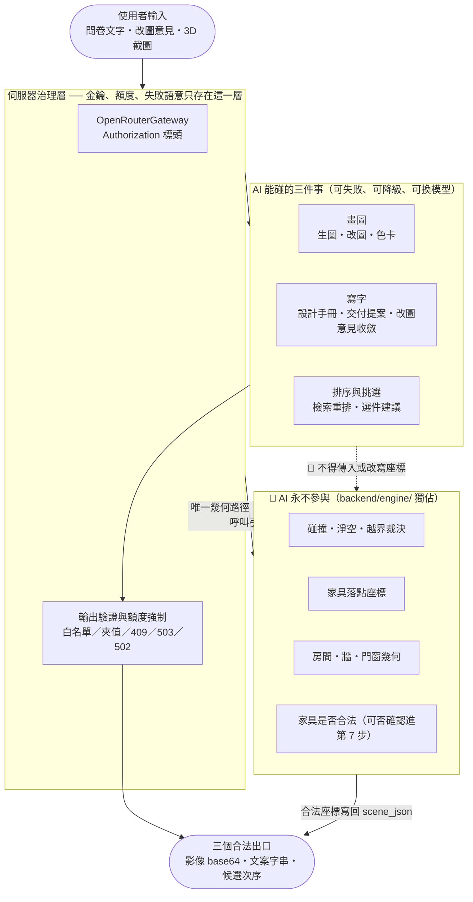

# AI 邊界紅線圖 (AI Guardrails Boundary) - RoomPilot

> **版本:** v1.0 ｜ **更新:** 2026-08-12 ｜ **狀態:** 草稿（待 owner 核准）
> **Owner:** 架構師；生成點實作屬 MOD-SRV-RENDER（Bella）與 MOD-AGT（Yen），檢索屬 MOD-RAG（Django）；對外可承諾的紅線措辭屬產品 owner
> **語域:** L2（橋接）——業務承諾（「AI 不會亂搬家具」）與強制點（`backend/engine/`、驗證函式、狀態碼）並列
> **實例:** 單例（整個 RoomPilot 一張；未落地的護欄一律標 `🔜` 或列入 §7，不與現況同權重）
>
> **本文件回答**：RoomPilot 的 AI 能碰什麼、永不能碰什麼；哪些使用者資料會離開這台機器、進到哪一顆模型；每條紅線由哪一行程式碼強制；越界或失敗時的唯一出口是什麼。
> **本文件不含**：每個生成點的決策理由（去 [`../adr/ADR-009-server-governed-ai-generation.md`](../adr/ADR-009-server-governed-ai-generation.md)、[`ADR-008`](../adr/ADR-008-rag-retrieval-only-offline-models.md)、[`ADR-002`](../adr/ADR-002-engine-sole-geometry-authority.md)）、端點欄位契約（去 [`../../04_design/api_spec.md`](../../04_design/api_spec.md)）、八步資料流（去 [`solution_overview.md`](./solution_overview.md)）、畫面文案（去 `../../02_ux_ui/ui_spec-step8-ai-render.md`）、事故處置（去 [`../../06_ops/runbook-genpic-provider-failure.md`](../../06_ops/runbook-genpic-provider-failure.md)）。
> **佐證基準**：分支 `yen`、HEAD `8f378b24`、2026-08-12 工作樹。本圖每一條紅線都對到一行可執行的強制點；沒有強制點的一律列入 §7 缺口，不寫成承諾。

## 目錄

- [1. 圖面資訊](#1-圖面資訊)
- [2. 邊界圖](#2-邊界圖)
- [3. AI 觸點清單](#3-ai-觸點清單)
- [4. 紅線卡](#4-紅線卡)
- [5. 什麼資料會離開這台機器](#5-什麼資料會離開這台機器)
- [6. 失敗時的唯一出口](#6-失敗時的唯一出口)
- [7. 護欄缺口與待確認](#7-護欄缺口與待確認)
- [8. 約束與檢查](#8-約束與檢查)
- [9. 追溯](#9-追溯)

## 1. 圖面資訊

| 欄位 | 值 |
| :--- | :--- |
| 受眾／回答的問題 | 產品 owner、稽核、跨 owner 對接；AI 在本產品能做什麼、永不做什麼、越界時往哪走 |
| 正典來源 | [`../adr/ADR-002-engine-sole-geometry-authority.md`](../adr/ADR-002-engine-sole-geometry-authority.md)、[`ADR-006`](../adr/ADR-006-appliances-render-context-only.md)、[`ADR-008`](../adr/ADR-008-rag-retrieval-only-offline-models.md)、[`ADR-009`](../adr/ADR-009-server-governed-ai-generation.md)、[`ADR-011`](../adr/ADR-011-agent-pipeline-flag-isolation.md)；[`AGENTS.md`](../../../AGENTS.md) §不可違反的契約 |
| 抽象層級／載體 | L2 能力區塊與強制點，不畫 prompt 全文、不畫模型內部；本圖以 mermaid 承載（可 diff、隨程式碼行號走）。drawio 管線存在（[`_tools/drawio_kit.py`](../../../VibeCoding_Workflow_Templates/03_architecture/diagrams/_tools/drawio_kit.py)、[`analyze_layout.py`](../../../VibeCoding_Workflow_Templates/03_architecture/diagrams/_tools/analyze_layout.py)，同批已用於 [`solution_overview.drawio`](./solution_overview.drawio)、[`deployment_topology.drawio`](./deployment_topology.drawio)），**本視圖選擇不產 drawio** |
| 最後校驗 | 2026-08-12（逐觸點回查原始碼行號；`grep` 全樹確認呼叫端存在與否） |

## 2. 邊界圖

**圖例**：實線＝現況已落地的呼叫；虛線＋🚫＝**被禁止且無程式路徑**的關係（畫出來是為了讓稽核看見它不存在）。`NEVER` 區的四件事在本 repo 沒有任何一條 LLM 或檢索的輸入通道——`EngineValidateTool` 的檔頭即寫明「LLM 不參與這裡的任何判斷」（`backend/agent/tools/engine_validate.py:1-5`），Furniture Agent 檔頭寫「座標與合法性一律由 engine 決定」（`furniture_agent.py:4`），驗證 skill 的 `hard_violations` 直接取自引擎、LLM 只寫 `summary`（`skills/validation/__init__.py:54,58`）。

## 3. AI 觸點清單

「經手資料」欄只列**實際進入 prompt** 的欄位；`reasoning` 欄空白＝呼叫端未帶該參數。

**欄位 owner（本表持有）**：「AI 觸點 × 模型（預設 id）× 進 prompt 資料」的單一 owner 是本表。模型 id 可被 env 覆蓋，**現行值**一律以 `/api/ai-render/status` 為準（查法見 [`../../06_ops/runbook-genpic-provider-failure.md`](../../06_ops/runbook-genpic-provider-failure.md) §4）。[`ADR-009`](../adr/ADR-009-server-governed-ai-generation.md) §1「模型決定處」欄與該 runbook §3 原因 5 目前仍各留一份 id 複本——與本表不一致時以本表為準，複本收斂屬該兩檔 owner，不由本圖代改。

| # | 用途（步） | 模型（預設） | reasoning | 進 prompt 的資料 | 佐證 |
| :--- | :--- | :--- | :--- | :--- | :--- |
| 1 | S7 代表房色卡比較圖 | `google/gemini-3-pro-image-preview`，失敗回 `gemini-3.1-flash-image` | — | 風格標籤、色卡 60/30/10 色、家具名稱／類型／材質、家電 context ＋該房 3D 截圖 ＋**逐房 note（使用者原文）**：生圖 brief 的 `user_notes` 經 `room.note` 送入 | `ai_render_service.py:58,289-294,440-441`；note 路徑 `scene_v2.js:16731` → `ai_render_service.py:299-306` → `genpic_info.py:236-237`；端點 `main.py:2135` |
| 2 | S8 逐房生圖（客廳另出夜景） | `google/gemini-3.1-flash-image`，fallback `gemini-2.5-flash-image` | — | 同上；**逐房 note（使用者原文）**在此另含逐房補充需求 ＋ `user_notes` ＋ 確認詞彙三段串接；夜景只換光影提示字串 | `llm.py:38-39,135-142`；`ai_render_service.py:331-347,395-413`；note 路徑 `scene_v2.js:16967-16971`（另 `constraints.notes`：`:16932-16935` → `ai_render_service.py:243-247`）；端點 `main.py:2070` |
| 3 | S8 改圖──意見收斂（文字） | `text_model`，預設 `openrouter/auto` | — | 使用者輸入的修改意見原文 | `llm.py:84-94`；`skills/editpic/__init__.py:28-34` |
| 4 | S8 改圖──影像編輯 | 同 #2 | — | 鎖定清單 ＋ 收斂後指令 ＋ 上一張圖 | `skills/editpic/__init__.py:37-45`；`genpic_agent.py:109-129`；端點 `main.py:2224` |
| 5 | S8 設計手冊文案 | `openai/gpt-5.6-luna`（硬編，不隨環境漂移） | `{"enabled": True}` | 風格清單、房名、預算總額、擺放件數、每房選件理由 | `llm.py:41-43`；`skills/report/__init__.py:105-120,163-177`；端點 `main.py:2300` |
| 6 | S8 交付提案文案 | 同 #5 | `{"enabled": True}` | 房名、房尺寸、家具名／類型／件數／尺寸／材質（每房最多 8 件） | `skills/delivery/__init__.py:190-219`；端點 `main.py:2384` |
| 7 | S6 場景規劃（**預設關閉**） | `OPENROUTER_MODELS` 首項，預設 `qwen/qwen3-32b:free`；逾時 8 秒 | — | 問卷 JSON ＋風格摘要 | `scene_service.py:51-53,73-86,351-403`；旗標 `OPENROUTER_SCENE_PLANNING_ENABLED != "1"` 即回 `None`（`:377-378`） |
| 8 | S6 選件閘門 | **伺服器不自行呼叫模型**；LLM 選擇由請求 payload 的 `llm_selection` 帶入 | — | （不適用） | `main.py:3440-3473`；驗證 `select.py:181-268` |
| 9 | S5 家具檢索（live） | 本機 embedding ＋ reranker，`local_files_only=True` | — | 問卷組出的房層級偏好字串（用途、選件名稱、偏好標籤、風格、面材） | `scene_v2.js:816-833,871-875`（`fast:true`）；`service.py:364-370`；`model_runtime.py:116-128` |
| 10 | `/rag` 獨立頁的查詢解析 | `gpt-5.6-sol`（provider 預設 `openai`）；`store=False` | `{"effort": "low"}` | 使用者在該頁輸入的自然語言 | `settings.py:61,71,76,86`；`openai_parser.py:86-107`；`rag.js:335-338`（未帶 `fast`） |
| 11 | Agent 並存管線（旗標關閉時 404） | 沿用 #2／#5 的 gateway | 同上 | 同上 | `agent_pipeline_service.py:32,42-51`；`main.py:3510-3515` |
| 12 | 平面圖開口 VLM 仲裁 | `gemma-4-26b:free` 等免費視覺模型 | — | **使用者上傳平面圖的局部裁圖** | `vlm_judge.py:37-41,131-156`；**全樹無任何 import**，見 §7 |

`/api/agent/intake/*` 另有一條 OpenRouter 路徑（`intake_service.py:136-138,162`），需 `OPENROUTER_INTAKE_ENABLED=1`；生產頁 `scene.html:1217` 只載入 `scene_v2.js`，該端點僅 `scene.js` 呼叫，故八步流程走不到——但端點本身可直接打，見 §7。

## 4. 紅線卡

每張卡一句話、可驗證；「強制點」欄是拿掉它紅線就失效的那一行。

| 紅線卡 | 內容 | 強制點（file:line） | 上游 |
| :--- | :--- | :--- | :--- |
| **幾何唯一裁決者** | 碰撞、淨空、越界與落點座標全部由 `backend/engine/` 計算，LLM 與檢索都不得參與、不得覆寫 | `tools/engine_validate.py:5,9`（直呼 `check_placement_with_clearance`）；`skills/validation/__init__.py:54,58`；`furniture_agent.py:4` | ADR-002、[`AGENTS.md`](../../../AGENTS.md) `:52-53` |
| **檢索只排序** | 檢索輸出不新增、不替換候選、無座標欄位；服務自報 `boundary:"retrieval_only_no_geometry_legality"` | `rag/service.py:129,499`；前端只把命中 id 排前面（`scene_v2.js:881-888`） | ADR-008、DEC-016 |
| **家電只進畫面** | 家電需求只寫 `scene_json.render_context.appliance_requirements`，只影響生圖描述，不進 2D/3D 擺設與家具 API | 寫入 `scene_service.py:3058-3062`；讀取 `ai_render_service.py:200-220` | ADR-006 |
| **提示詞不含數值與座標** | 生圖提示詞由程式 deterministic 組裝（無文字 LLM），尺寸規格被正則剝除，只留名稱／類型／材質／外觀描述 | `skills/genpic/__init__.py:1,24-53`；`tools/genpic_info.py:42-51,80-93,101-104`；`ai_render_service.py:130-146` | FR-059 |
| **模型輸出必須過白名單** | 選件結果逐項比對候選白名單：未知 `furniture_id` 丟棄、`count` 夾 1–6、每房上限 8 件、同族系一款；全數無效即拋錯降級 | `select.py:187-189,234-250,266-267`；降級 `main.py:3474-3479` | FR-050、DEC-007 |
| **重試次數由程式決定** | 主模型最多 3 次 → fallback 模型再 3 次 → 拋 `GenPicFailure`；模型無權自行決定要不要再試 | `genpic_agent.py:29-31,144-190` | NFR-012 |
| **額度存在伺服器** | 色卡每案僅能成功一次（第二次 409）、改圖逐房一次（用完 409）；前端改 JS 或重整都繞不過 | `main.py:2147-2155,2244-2248,2199-2214` | DEC-010、DEC-011 |
| **金鑰不下放瀏覽器** | 金鑰只用於伺服器端 `Authorization` 標頭；狀態端點只回布林與模型 id；靜態前端全樹查無 `OPENROUTER`／`api_key` 字樣 | `llm.py:133,167-183`；`ai_render_service.py:65-74`；`grep` `backend/server/static/` 命中數 0（2026-08-12 實跑） | ADR-009 |
| **不假成功** | 未設金鑰一律 503 且不回任何影像；上游明確拒絕 502；單房失敗只標 `failed`，夜景失敗只附 `night_notices` | `ai_render_service.py:61-63,341-343,376-385,412-413`；`main.py:2109-2116,2270-2274` | NFR-014、DEC-017 |
| **文案 LLM 是受控例外** | LLM 不可用時回 `None` 走 deterministic 底稿照樣出 PDF，不偽造 AI 文案；缺欄位先重試一次再降級 | `design_manual_service.py:206-208`；`skills/base.py:130-147`；`skills/report/__init__.py:121-122,184-189` | FR-061 |
| **並存管線預設關閉** | `ROOMPILOT_AGENT_PIPELINE` 未設＝空字串＝關；四支路由 404，`/status` 永遠可查且不改動 live 第 6 步 | `agent_pipeline_service.py:32,42-51`；`main.py:3510-3515` | ADR-011、FR-053 |
| **部署閘門** | **本 repo 不存在**——無禁區題庫 Eval、無紅隊測試、無任何阻擋部署的 AI 行為門檻 | 見 §7 缺口 G4 | 🔜 待建立 |
| **可追溯** | **本 repo 不存在**——AI 呼叫無稽核紀錄（模型、prompt、token、成本皆不落地） | 見 §7 缺口 G1 | 🔜 待建立 |

## 5. 什麼資料會離開這台機器

| 資料 | 會不會送出 | 佐證 |
| :--- | :--- | :--- |
| 使用者上傳的原始平面圖（`uploads/`） | **不會**（live 路徑）。DXF 走本機解析、影像走本機 Cody ＋本機 PaddleOCR（未安裝即安靜降級） | `main.py:2995-3034`；`main.py:156-160`；`vision/ocr.py:74-89` |
| 平面圖局部裁圖 | **目前不會**，但 `vlm_judge.py` 具備此能力且全樹無呼叫端；一旦接回，其預設是「有金鑰就開」 | `vlm_judge.py:66-70,131-156`；缺口 G6 |
| 逐房 3D 截圖（瀏覽器自畫的場景，非原始平面圖） | **會**，作為 img2img 的視角鎖定輸入 | `llm.py:249-255`；`main.py:2102-2106`（必填且須為 PNG data URL） |
| 使用者自由文字：逐房補充需求 ＋ 生圖 brief 的 `user_notes` ＋ 確認詞彙 | **會**——第 7／8 步由前端串成 `room.note` 隨房送出，後端原文併進生圖提示詞（另一份 `user_notes` 走 `scene.requirement.constraints.notes`） | `scene_v2.js:16967-16971`（S8）、`:16731`（S7）、`:16932-16935`（`constraints.notes`）→ `ai_render_service.py:299-306`（`_viewpoint`）、`:243-247` → `genpic_info.py:236-237` |
| 問卷 `personal_notes` 欄 | **走不到**（生產頁）：`scene_v2.js` 送 `/api/scene/generate` 的 payload 無此鍵（`:12684-12723`），只有非生產入口 `scene.js:2274` 帶；live 讀到恆為空字串，故其衍生的 `layout_rules`／`personal_requirements` 均為空。**上一列才是真正離機的自由文字** | 接收 `main.py:3611`；消費 `scene_service.py:449,323,3015`；唯一送出端 `scene.js:2274`（`scene.html:1217` 只載 `scene_v2.js`） |
| 改圖意見原文 | **會**（先送文字模型收斂，再嵌入影像提示） | `main.py:2249-2253`；`skills/editpic/__init__.py:28-39` |
| 房名、家具名／尺寸／材質、預算總額 | **會**（設計手冊與交付提案文案） | `skills/report/__init__.py:108-116`；`skills/delivery/__init__.py:190-212` |
| 住戶組成（大人／小孩／長輩／寵物） | **僅在** `/api/agent/intake/answer` ＋ `OPENROUTER_INTAKE_ENABLED=1` 時；八步流程走不到 | `intake_service.py:131-138,162`；缺口 G5 |
| 金鑰、token、伺服器檔案佈局 | **不會**：狀態端點只回布林與模型 id，檢索狀態刻意 `pop("cache_dir")` | `ai_render_service.py:65-74`；`rag/service.py:66`（NFR-020） |
| 個資欄位（email／phone／address／姓名） | **成果包輸出**與**遠端渲染商路徑**有脫敏；**OpenRouter 四個生成點沒有等效脫敏** | 脫敏 `main.py:2475-2491,2733-2742`；`render_service.py:12-22,52-61,120-121`；缺口 G3 |

## 6. 失敗時的唯一出口

狀態碼與 error key 的權威在 [`../../04_design/api_spec.md`](../../04_design/api_spec.md) §3、對外介面失敗語意在 [`../../01_requirements/srs.md`](../../01_requirements/srs.md) §5，**本節不重述**（同 §9 對 test_plan 的作法）。此處只答本圖的問題：失敗時由哪條紅線兜底、人的閘門在哪。

| 情境 | 兜底的紅線（§4） | 人的閘門 |
| :--- | :--- | :--- |
| 金鑰未設、上游拒絕或重試次數用盡（生圖／改圖） | 不假成功；重試次數由程式決定 | 無人工介入路徑：失敗逐房可見，是否重生由使用者決定（單房重生的已驗證副作用見 [`../../06_ops/runbook-genpic-provider-failure.md`](../../06_ops/runbook-genpic-provider-failure.md) §2） |
| 一次性額度用罄（色卡每案一次、改圖逐房一次） | 額度存在伺服器 | 解鎖屬成本政策，需 owner 同意後由維運改旗標（同 runbook §5 末列） |
| 模型輸出不合契約（選件白名單／文案 schema） | 模型輸出必須過白名單；文案 LLM 是受控例外 | 降級結果仍須經第 6 步 `validate_only` 整屋確認才能進第 7 步；文案降級走 deterministic 底稿照樣出 PDF |
| 檢索不可用或權重未快取 | 檢索只排序（缺席不影響幾何與合法性） | 第 5 步問卷不阻塞，使用者照原順序選件（`scene_v2.js:895-899`） |
| **AI 越界（例如模型回了座標）** | — | **無此出口**——因為沒有任何路徑讓模型輸出流向幾何；模板所指的「人工審核佇列」在本產品不適用。人的閘門有三：第 6 步整屋確認送 `validate_only`（只驗不排、座標照舊，`main.py:3707` → `scene_service.py:2169,2339`）、第 6 步逐件拖曳落點驗證（`POST /api/scene/validate`，`main.py:3998`）、第 7 步鎖視角（ADR-002） |

## 7. 護欄缺口與待確認

編號規則沿用 [`../../00-registry.md`](../../00-registry.md) §2.2：**不自創 OPEN 號**，以下標「建議新增」者僅為佔位，實際發號待 owner 於需求追蹤簿收錄。

| 缺口 | 事實（佐證） | 影響 | 登記 |
| :--- | :--- | :--- | :--- |
| **G1 無 AI 稽核紀錄** | `ai_render_service.py`、`agent/llm.py`、`genpic_agent.py`、`design_manual_service.py` 四檔 `logger`／`logging` 命中數皆為 0（2026-08-12 實跑）；workflow 只存 `lock_manifest` 與狀態（`main.py:2117-2126`），prompt 只活在請求記憶體（`genpic_agent.py:170-182`） | 事後無法回答「這張圖是哪顆模型、用什麼提示詞、花多少 token 產的」；模板要求的「可追溯」紅線無載體 | 建議新增 OPEN-51（待 owner 收錄） |
| **G2 進 prompt 的自由文字無任何過濾** | 改圖意見只做 `strip()`（`main.py:2249-2253`）即送文字模型並嵌入影像提示（`skills/editpic/__init__.py:28-39`）；逐房補充需求與 brief `user_notes` 同樣原文串成 `room.note` 進生圖提示詞（`scene_v2.js:16967-16971` → `ai_render_service.py:302` → `genpic_info.py:236-237`），前端只做 `trim()`。全樹無 prompt injection 攔截或關鍵詞過濾 | 影響面限於影像與文案（模型輸出碰不到幾何、資料庫與檔案系統），但「防護機制」紅線目前是空的 | 建議新增 OPEN-52（待 owner 收錄） |
| **G3 送外部前無 PII 脫敏** | `DELIVERY_SENSITIVE_KEYS` 只作用於成果包輸出（`main.py:2733-2742,2779-2810`）；`_strip_private_fields` 只作用於遠端渲染商路徑（`render_service.py:120-121`），而該路徑預設未設定。四個 OpenRouter 生成點無對應處理 | 使用者若把姓名、電話寫進問卷備註或改圖意見，會原文送到模型供應商 | 沿用 OPEN-13（資料保存政策空白，[`../../01_requirements/brd.md`](../../01_requirements/brd.md) §9） |
| **G4 無部署閘門** | 無禁區題庫、無紅隊測試、無 AI 行為門檻可阻擋部署；[`../../05_qa/test_plan.md`](../../05_qa/test_plan.md) GAP-05 已記「維運面完全無自動化測試」。現有相關測試只到 TC-051（提示詞剝尺寸）與 TC-044（選件白名單） | 紅線靠 code review 維持，沒有任何自動化會在紅線被拆掉時失敗 | 建議新增 OPEN-53（待 owner 收錄） |
| **G5 intake 的 LLM 路徑未被文件承認** | [`../../04_design/api_spec.md`](../../04_design/api_spec.md) `:167` 記為「不呼叫 LLM 的骨架」，但 `advance_intake` 在 `OPENROUTER_INTAKE_ENABLED=1` 時會呼叫 OpenRouter 並送出住戶組成（`intake_service.py:136-138,162`）。生產頁不呼叫它（`scene.html:1217` 只載 `scene_v2.js`），但 Pilot 無認證（NFR-019），端點可直接打 | 文件與程式不一致；AI 觸點盤點會漏掉這一條 | 建議新增 OPEN-54（待 owner 收錄）；端點去留屬既有 OPEN-03 |
| **G6 `vlm_judge.py` 的預設是「送出去」** | 該模組會把使用者平面圖裁圖送免費視覺模型（`vlm_judge.py:131-156`），`vlm_enabled()` 預設 `"auto"`＝有金鑰即開（`:66-70`），與 `backend/floorplan/README.md`「`FP2DXF_VLM=1` 選配」的敘述相反。全樹無 import，README 記載 2026-07-13 實測後棄用 | 現況安全（無呼叫端），但只要有人接回一行 import，預設行為就是把平面圖送出去 | 建議新增 OPEN-55（待 owner 收錄） |
| **G7 無配額與速率限制** | 全 app 無認證、無 CORS、無 rate limit（NFR-019，`main.py:195-197`）；任何能連上服務埠的人都能消耗金鑰額度 | 成本面無護欄；本圖不重述，僅指出它使上述所有伺服器端額度只防「誤用」不防「濫用」 | 沿用 OPEN-02（安全邊界未宣告）；理由見 ADR-009 §4.2 |

**不由本圖決定**：紅線對外要怎麼措辭、要不要對客戶承諾「不使用您的資料訓練模型」（供應商條款未在 repo 內留存證據，屬**待確認**）、G1–G6 的優先序與里程碑——全部屬產品 owner，記於 [`../../01_requirements/requirements_tracker.xlsx`](../../01_requirements/requirements_tracker.xlsx) ①需求決策（該簿已於 2026-08-12 實例化，DEC-001..019 骨架列齊備；優先序、範圍、里程碑、核准五欄留白待 owner 填寫，發號規則見 [`../../00-registry.md`](../../00-registry.md) §2.2）。

## 8. 約束與檢查

- [x] 每張紅線卡一句話、可驗證，且指到一行強制點；無「盡量」「原則上」。沒有強制點的兩張卡（部署閘門、可追溯）已明寫 **本 repo 不存在** 並落到 §7，不以 `🔜` 混充現況。
- [x] 門檻數字全部來自程式碼（3 次重試、6 次上限、1–6 件、每房 8 件、每案一次、逐房一次、8 秒／120 秒逾時），非本圖自訂；耗時與成本上限無實測數據，沿用 NFR-025「目標值未定義」，不編造。
- [x] metadata banner 已附（本圖對外溝通，過期比沒有更糟）；§2 附圖例，僅列本圖實際用到的兩種線型語意。
- [x] 未虛構護欄：`store=False`（`openai_parser.py:94`）、`local_files_only=True`（`model_runtime.py:120,127`）、`boundary` 自報欄位（`rag/service.py:129`）皆為實讀；靜態前端無金鑰是 `grep` 命中數 0 的實跑結果，非推論。
- [ ] 模板 [`README.md`](../../../VibeCoding_Workflow_Templates/03_architecture/diagrams/README.md) §1–§2 規定本視圖企業級才畫、且以 drawio 為正典；本圖只以 mermaid 承載。**偏離理由是「選擇不畫 drawio」，不是「沒有管線」**——管線存在且同批已用於 `solution_overview.drawio`、`deployment_topology.drawio`（見 §1 載體欄）；本圖的內容是逐行程式碼強制點、隨 HEAD 變動，雙載體會 drift，故只留可 diff 的 mermaid。**此偏離待文件 owner 追認**。註：[`solution_overview.md`](./solution_overview.md) 與 [`deployment_topology.md`](./deployment_topology.md) 已於 2026-08-12 完成收斂（修行號 → 重生成 drawio → draw.io Desktop 匯出 SVG → 刪 mermaid），**該兩檔已無偏離**；本圖的偏離性質不同（選擇不產 drawio），不再互為引用。

## 9. 追溯

- **上游需求**：DEC-006、DEC-007、DEC-010、DEC-011、DEC-012、DEC-014、DEC-016、DEC-017；FR-046–FR-050、FR-053、FR-055、FR-056、FR-058–FR-063、FR-067；NFR-009–NFR-012、NFR-014、NFR-019、NFR-020、NFR-025（[`../../01_requirements/srs.md`](../../01_requirements/srs.md) §2.6–§2.8、§3）。
- **上游決策**：[ADR-002](../adr/ADR-002-engine-sole-geometry-authority.md)（幾何唯一裁決者，本圖主角）、[ADR-006](../adr/ADR-006-appliances-render-context-only.md)、[ADR-008](../adr/ADR-008-rag-retrieval-only-offline-models.md)、[ADR-009](../adr/ADR-009-server-governed-ai-generation.md)、[ADR-011](../adr/ADR-011-agent-pipeline-flag-isolation.md)、[ADR-012](../adr/ADR-012-pilot-loopback-deployment.md)；契約 [`AI_RENDER_OPENROUTER_CONTRACT.md`](../../../docs/contracts/AI_RENDER_OPENROUTER_CONTRACT.md)、[`AGENTS.md`](../../../AGENTS.md) §不可違反的契約。
- **上游文件**：[`../sad.md`](../sad.md)、[`solution_overview.md`](./solution_overview.md)、[`c4_container.md`](./c4_container.md)；**下游文件**：[`../../04_design/api_spec.md`](../../04_design/api_spec.md)、[`../../05_qa/test_plan.md`](../../05_qa/test_plan.md)、[`../../06_ops/deployment_and_operations.md`](../../06_ops/deployment_and_operations.md)、[`../../06_ops/runbook-genpic-provider-failure.md`](../../06_ops/runbook-genpic-provider-failure.md)、[`../../06_ops/runbook-rag-model-cache-missing.md`](../../06_ops/runbook-rag-model-cache-missing.md)。
- **驗收與測試**：ACPT-041–ACPT-044、ACPT-050–ACPT-056、ACPT-060；SCN-030、SCN-031、SCN-032；TC-041–TC-044、TC-046、TC-048、TC-050–TC-054、TC-056（狀態以 [`../../05_qa/test_plan.md`](../../05_qa/test_plan.md) §3 為準，本圖不重述）。
- **本圖不決定**：紅線的對外措辭與承諾範圍、G1–G6 的優先序與里程碑、`/api/agent/intake/*` 與 `vlm_judge.py` 的去留——屬產品 owner 與各 MOD owner；本圖只記 AS-IS 與缺口，狀態為待 owner 核准。
