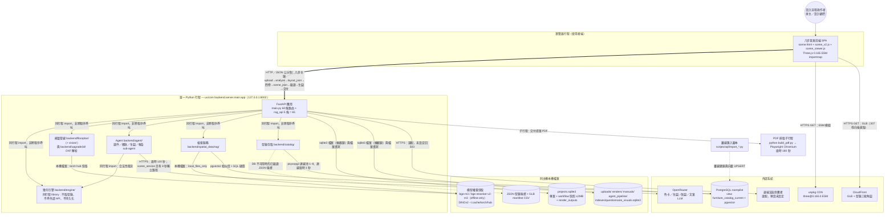

# 容器圖 (C4 Container) - RoomPilot

> **版本:** v1.0 ｜ **更新:** 2026-08-12 ｜ **狀態:** 草稿（待 owner 核准）
> **Owner:** 架構師（合成）；`backend/server/` 實作 owner 為 Bella，跨模組連線由受影響 owner 共同確認（[`AGENTS.md`](../../../AGENTS.md) §目錄責任與資料邊界）
> **語域:** L2（橋接）——圖面供跨團隊對接，每個節點綁 MOD-* 與實際程式碼路徑
> **實例:** 單例（整個 RoomPilot 一張；多環境差異以註記承載，不另開檔）
>
> **本文件回答**：RoomPilot 由哪些**可獨立執行的 runtime** 組成、哪些其實同屬一個 Python 行程、彼此用什麼協定連、每個節點對應哪段程式碼。
> **本文件不含**：系統與外部角色的邊界（去 [`c4_context.md`](./c4_context.md)）、行程內部元件切分與時序（去 [`../sad.md`](../sad.md) §1.3／§5）、實體部署與環境參數（去 [`deployment_topology.md`](./deployment_topology.md)）、外部介面的失敗語意（由 [`../../01_requirements/srs.md`](../../01_requirements/srs.md) §5 單一維護）、端點欄位契約（去 [`../../04_design/api_spec.md`](../../04_design/api_spec.md)）。
> **佐證基準**：分支 `yen`、HEAD `8f378b24`、2026-08-12 工作樹。行號隨程式碼演進，衝突時以原始碼為準。

## 目錄

- [1. 圖面資訊](#1-圖面資訊)
- [2. 容器圖 (C4 Level 2)](#2-容器圖-c4-level-2)
- [3. 元素對照表](#3-元素對照表)
- [4. 約束與檢查](#4-約束與檢查)
- [5. 待確認](#5-待確認)
- [6. 追溯](#6-追溯)

## 1. 圖面資訊

| 欄位 | 值 |
| :--- | :--- |
| 受眾 | 跨團隊對接（Bella／Cody／Ancai／Kai／Django／Yen）、新進工程師 |
| 回答的問題 | 有哪些可獨立執行的 runtime？哪些只是同一行程內的模組（不是容器）？八步資料怎麼流？ |
| 正典來源 | 本檔（mermaid，可 diff）；[`../sad.md`](../sad.md) §1.2 引用本圖，**不得雙軌維護**；drawio 溝通版尚未產出 |
| 最後校驗 | 2026-08-12（HEAD `8f378b24`） |
| 階段 | Pilot |

## 2. 容器圖 (C4 Level 2)

**圖例**：粗實線＝八步主鏈；細實線＝同步呼叫；虛線＝後援或離線批次；圓柱＝資料儲存；`PROC` 框內全部是**同一個 Python 行程的模組，不是獨立容器**。跨邊界連線的失敗語意（503／502／409）不在此重複，見 [`../../01_requirements/srs.md`](../../01_requirements/srs.md) §5。

## 3. 元素對照表

| 節點 | 程式碼路徑 | MOD-* | 佐證 file:line |
| :--- | :--- | :--- | :--- |
| SPA | `backend/server/static/`（`scene.html`、19,583 行 `scene_v2.js`、5,886 行 `scene_viewer.js`），由 FastAPI 掛載供檔；`importmap` 直指 unpkg，無離線後援 | MOD-WEB | `main.py:216-217,1664-1669`；`scene.html:1209-1217` |
| API | `backend/server/main.py` 單一 `FastAPI` 實例（唯一 `include_router` 是 `rag_api`）＋`project_store.py`／`scene_service.py`／`ai_render_service.py`／`design_manual_service.py` | MOD-SRV-API、MOD-SRV-STORE、MOD-SRV-SCENE、MOD-SRV-RENDER | `main.py:195,197`（60＋5＝65 條路由） |
| ENG | `backend/engine/`（`clearance.py`／`placement.py`／`raster.py`／`obb.py`…），由 `scene_service` 與 `agent` 直接 import；模組契約明文禁止取型錄、呼外部 API、持久化 | MOD-ENG | `scene_service.py:27-37,1383-1389,1597`；`agent/adjust.py:18-21`；`backend/engine/AGENTS.md:5-6,10` |
| FP | `backend/floorplan/` ＋ `vision/`（17 模組，DINOv2 房型層需 `torch`）；DXF 走 `backend/upgrade3d/dxf_parser.py` | MOD-FP、MOD-U3D | `main.py:33-39`；`vision/analysis.py:14-27`；`vision/cody_semantic.py:14,29` |
| AGT | `backend/agent/`（`select.py`／`place.py`／`subagents/`／`skills/`）；並存管線由 `ROOMPILOT_AGENT_PIPELINE` 旗標保護，側寫寫 `.runtime/agent_pipeline/`（刻意不進 workflow blob） | MOD-AGT | `main.py:24-26`；`agent_pipeline_service.py:1-11,19-20` |
| RAG | `backend/spatial_data/rag/`（**不在** `backend/rag/`）；FastAPI 轉接層 `backend/server/rag_api.py` 在模組載入時就建服務實例與 router | MOD-RAG | `rag_api.py:14-21,26-27`；`main.py:105` |
| CAT | `backend/catalog/postgres_repository.py`（view 常數與 provider 決策）、`rag_repository.py`（pgvector 查詢） | MOD-CAT | `main.py:31,106`；`postgres_repository.py:20,199-204,232-243`；`rag_repository.py:53-87,131` |
| PDF | `agent/skills/delivery/` 以 `subprocess.run(sys.executable, build_pdf.py)` 起子行程，內部才叫 Playwright Chromium；**設計手冊 PDF 不走此路**（Pillow 逐頁點陣，同行程） | MOD-SRV-RENDER | `agent/skills/delivery/__init__.py:40-41,276-293`；`skills/roompilot-delivery-pdf/scripts/build_pdf.py:331,340-341`；`agent/tools/render_pdf.py:1-8` |
| SQLITE／FILES | `.runtime/`（可由 `ROOMPILOT_RUNTIME_DIR` 覆寫，預設 repo 根 `.runtime`）；問卷影像索引可重建 | MOD-SRV-STORE | `runtime_paths.py:20-25`；`project_store.py:82-84,89-90`；`main.py:147,207-211` |
| WEIGHTS／JSONCAT | 檢索模型 `local_files_only=True`、DINOv2 快取 `~/.cache/torch/hub`；JSON 後援＝`JSON/furniture/furniture_official_catagory.json`（49.6 MB）＋`JSON/manifests/glb_upload_all_result.csv`（11.1 MB），路徑可由環境變數覆寫 | MOD-RAG、MOD-FP、MOD-CAT | `rag/model_runtime.py:14-15,102-127`；`vision/cody_semantic.py:14,29`；`main.py:130-140` |
| PG／IMP | schema `roompilot`：view `furniture_catalog_current` ＋ `furniture_embeddings`；本機供應走 `pgvector/pgvector:pg17` container；資料由離線腳本一次性建置，不在請求路徑上 | MOD-SQL | `postgres_repository.py:20`；`rag_repository.py:61-64`；`docker_postgresql/docker-compose.yml:5-27`；`import_official_catalog_to_postgres.py:310-466` |
| OR／CF／CDN／RR | OpenRouter `https://openrouter.ai/api/v1/chat/completions`（agent 逾時 120 秒；`scene_service` 另有 8 秒獨立呼叫碼）；CloudFront 預設 base URL＋`/model` 307；unpkg ESM；遠端渲染供應者由 `ROOMPILOT_RENDER_PROVIDER_URL` 決定 | — | `agent/llm.py:31,148`；`scene_service.py:351-360`；`services/cloud_models.py:32,47,51-52`；`main.py:4012-4017`；`render_service.py:8,40-47,141` |

## 4. 約束與檢查

- [x] **無 module 當容器**：`engine/`、`floorplan/`、`agent/`、`spatial_data/rag/`、`catalog/` 全部是同一行程的 import，圖上以 `PROC` 框標明（`main.py:24-39,105-106`；`scene_service.py:27-37`）。
- [x] **未畫 repo 不存在的元件**：無訊息佇列、無快取層、無反向代理、無 API gateway、無 CI（`.github/` 不存在，NFR-024）。`backend/server/` 下的 `routes/`、`auth/`、`engineering/`、`storage/` 只有 `__pycache__`、`git ls-files` 零命中，屬他分支殘留，**不入圖**；`frontend3d/` 為次要原型（`AGENTS.md:58`），同不入圖。
- [x] 每條跨邊界連線在圖上標協定與用途；主鏈粗實線、後援與離線批次虛線。L3 揭露：`PROC` ✅ 由 [`../sad.md`](../sad.md) §1.3 展開，其餘節點表代圖（§3）。
- [x] 無 `🔜` 元件：Agent 並存管線雖受旗標保護，程式已落地（FR-053），屬當前圖。
- [ ] **環境拓撲不對稱未收斂**：本機／內網以外的部署形態在 repo 內無證據（見 §5）。

## 5. 待確認

| 項目 | 內容 | 承接 |
| :--- | :--- | :--- |
| OPEN-02 | 圖上刻意沒有反向代理、認證或速率限制層——現況唯一邊界是 `--host 127.0.0.1`（`README.md:49`）。**這是既定範圍還是缺件，待 DEC-014 核准**；`SPA → unpkg CDN` 這條出網連線與「僅本機／內網」的宣稱是否相容，須一併裁決 | [`../sad.md`](../sad.md)、[`../../06_ops/deployment_and_operations.md`](../../06_ops/deployment_and_operations.md) |
| OPEN-06 | `CAT → PG` 的健康判定：`main.py:917-921` 要求 `len(items) == OFFICIAL_CATALOG_COUNT`（`cloud_catalog.py:18` ＝ 8,675），否則**靜默**改用 JSON 後援；與健康 view 實際 8,076 不一致，且契約承諾的 503 `postgres_catalog_unavailable` 是否曾實作待查 | [`../adr/ADR-005-postgres-catalog-source-of-truth.md`](../adr/ADR-005-postgres-catalog-source-of-truth.md)、[`../../06_ops/runbook-catalog-db-unavailable.md`](../../06_ops/runbook-catalog-db-unavailable.md) |
| 本檔新增 | `docs/contracts/POSTGRESQL_PROJECT_STORE_PHASE3.md` 稱專案儲存有 PostgreSQL runtime path，但本分支 `project_store.py:82-90` 只有 SQLite；正式拓撲以何者為準待 owner 拍板 | [`../adr/ADR-004-single-workflow-snapshot-sqlite.md`](../adr/ADR-004-single-workflow-snapshot-sqlite.md) |
| 本檔新增 | `.runtime/` 現存 `auth_secret.key` 與 `engineering/`，本分支無任何程式碼讀取；是否為他分支殘留、可否清理待確認 | [`../../06_ops/runbook-runtime-storage-growth.md`](../../06_ops/runbook-runtime-storage-growth.md) |
| 本檔新增 | MOD-* 定義權威在 [`../sad.md`](../sad.md)；本檔沿用 [`../../01_requirements/srs.md`](../../01_requirements/srs.md) §9.2 的代號，sad 定稿後須回查對齊 | [`../sad.md`](../sad.md)、[`../engineering_tracker.xlsx`](../engineering_tracker.xlsx) |

## 6. 追溯

- **上游**：[`../../01_requirements/srs.md`](../../01_requirements/srs.md) FR-001–067／NFR-001–025／§9.2 MOD 矩陣；DEC-001、DEC-007、DEC-014、DEC-016、DEC-017。
- **平行**：[`c4_context.md`](./c4_context.md)（L1 邊界）、[`solution_overview.md`](./solution_overview.md)、[`../sad.md`](../sad.md) §1.2／§1.3。
- **決策依據**：[`ADR-002`](../adr/ADR-002-engine-sole-geometry-authority.md)（ENG 同行程且唯一幾何權威）、[`ADR-004`](../adr/ADR-004-single-workflow-snapshot-sqlite.md)（SQLITE）、[`ADR-005`](../adr/ADR-005-postgres-catalog-source-of-truth.md)（PG／JSONCAT）、[`ADR-008`](../adr/ADR-008-rag-retrieval-only-offline-models.md)（RAG／WEIGHTS）、[`ADR-009`](../adr/ADR-009-server-governed-ai-generation.md)（OR）、[`ADR-010`](../adr/ADR-010-static-frontend-and-eight-step-collapse.md)（SPA）、[`ADR-011`](../adr/ADR-011-agent-pipeline-flag-isolation.md)（AGT 旗標）、[`ADR-012`](../adr/ADR-012-pilot-loopback-deployment.md)（PROC 綁 127.0.0.1）。
- **下游**：[`deployment_topology.md`](./deployment_topology.md)、[`../../04_design/lld.md`](../../04_design/lld.md)、[`../../04_design/db_design.md`](../../04_design/db_design.md)、[`../../06_ops/deployment_and_operations.md`](../../06_ops/deployment_and_operations.md)、[`../../05_qa/test_plan.md`](../../05_qa/test_plan.md)、[`../../00-registry.md`](../../00-registry.md)。
