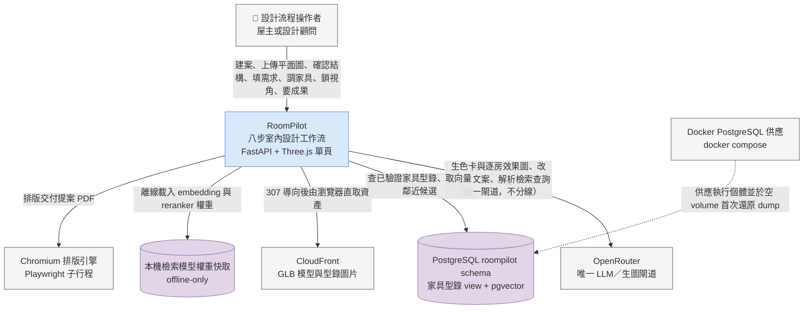

# 系統情境圖 (C4 System Context) - RoomPilot

> **版本:** v1.0 ｜ **更新:** 2026-08-12 ｜ **狀態:** 草稿（待 owner 核准）
> **Owner:** 架構師；外部系統清單與 [`../sad.md`](../sad.md) §1 共用單一 owner，衝突時以 `sad.md` 為準
> **語域:** L2（橋接）——業務動詞與程式碼路徑並列
> **實例:** 單例（整個 RoomPilot 一張；本 repo 只有一套部署形態，不分環境）
>
> **本文件回答**：誰在用 RoomPilot、系統對外依賴哪些外部系統、每條依賴的互動語意與失效時的對外表現。
> **本文件不含**：系統內部容器切分（見 [`c4_container.md`](./c4_container.md)）、部署節點與埠（見 [`deployment_topology.md`](./deployment_topology.md)）、模組責任表與架構取捨（見 [`../sad.md`](../sad.md) 與 `../adr/`）、端點欄位契約（見 [`../../04_design/api_spec.md`](../../04_design/api_spec.md)）。
> **佐證基準**：分支 `yen`、HEAD `8f378b24`、2026-08-12 工作樹。行號隨程式碼演進，衝突時以原始碼為準。

## 目錄

- [1. 圖面資訊](#1-圖面資訊)
- [2. 前置盤點](#2-前置盤點)
- [3. 系統情境圖](#3-系統情境圖)
- [4. 元素對照表](#4-元素對照表)
- [5. 約束與檢查](#5-約束與檢查)
- [6. 待確認](#6-待確認)
- [7. 追溯](#7-追溯)

## 1. 圖面資訊

| 欄位 | 值 |
| :--- | :--- |
| 受眾 | 所有人（最通用、變動最慢的一張圖） |
| 回答的問題 | 誰在用 RoomPilot？它與哪些外部系統互動？ |
| 正典來源 | [`../sad.md`](../sad.md) §1；本圖以 mermaid 為載體，**不另出 drawio**（模板 README §1「二擇一，不得雙軌維護」） |
| 最後校驗 | 2026-08-12（逐節點回查原始碼） |
| 階段 | Pilot |

## 2. 前置盤點

盤點後**不入圖**者一併列出，避免下游誤讀為「repo 沒有」：

| 類別 | 入圖 | 盤點到但不入圖（附理由） |
| :--- | :--- | :--- |
| Actor | 設計流程操作者（屋主或設計顧問）×1 | 營運人員／管理員：本 repo 無認證、無後台、無角色機制（`main.py:195-197` 全 app 只掛 GZip 與 rag router，無 auth／CORS 中介層） |
| 外部系統 | OpenRouter、PostgreSQL `roompilot`、CloudFront、本機檢索模型權重、Chromium 排版引擎、Docker PostgreSQL 供應 | 遠端渲染供應者（未設定即停用，且 `srs.md` §5 未列，見 §6）；設計手冊 PDF 走本機 Pillow 非外部引擎（`backend/agent/tools/render_pdf.py:1-8,17`）；`frontend3d/` 為次要原型（ADR-010） |
| 基礎設施 | 無 | 訊息佇列、快取層、反向代理、CI 一律**本 repo 無此機制**（無 `.github/` 目錄；`main.py:195-197`） |

## 3. 系統情境圖

**圖例**：藍圓角＝本系統（單一邊界，內部不展開）｜灰＝actor 與外部系統｜紫圓柱＝外部資料儲存｜實線＝同步呼叫｜虛線＝供應／佈建關係。

## 4. 元素對照表

| 圖上節點 | 類型 | 責任與互動語意（領域動詞） | 失效時系統對外表現 | 程式碼佐證 file:line | MOD-* |
| :--- | :--- | :--- | :--- | :--- | :--- |
| 設計流程操作者 | Actor | 走完八步：建案 → 上傳 → 辨識確認 → 空間結構 → 需求問卷 → 配置預覽 → 鎖視角 → 生圖與交付 | 由各端點 4xx／5xx 語意承接（NFR-014） | `main.py:1664-1670`（`/scene` 單頁入口）；UC-001–003 Actor 欄 | — |
| RoomPilot | 本系統 | 單一 FastAPI app ＋ `static/` 單頁前端；內部 11 步狀態機對外折疊為 8 步 | — | `main.py:195-197,216,1664-1670` | 全部 MOD-*（切分見 [`../sad.md`](../sad.md)） |
| OpenRouter | 外部系統 | 文字 LLM 與生圖模型的**唯一**出口（單一 `OPENROUTER_API_KEY`）：色卡、逐房生圖、改圖、手冊與提案文案、檢索查詢解析 | 未設金鑰 503；上游拒絕 502；主模型 3 次＋fallback 3 次後拋 `GenPicFailure` | `backend/agent/llm.py:31,130-148`；`ai_render_service.py:1-20`；`rag/service.py:80-83`；`main.py:2064,2109-2116`；`genpic_agent.py:29-31` | MOD-SRV-RENDER、MOD-AGT、MOD-RAG |
| PostgreSQL `roompilot` schema | 外部資料儲存 | 唯讀消費家具型錄 view `roompilot.furniture_catalog_current` 與 pgvector 向量表 | `/api/catalog/status` 回 `available=false` ＋ reason，服務不整體停擺；缺驅動 `postgres_driver_unavailable` | `backend/catalog/postgres_repository.py:18-20,199-204,233-243,842-850`；`main.py:3095-3110` | MOD-CAT、MOD-SQL、MOD-RAG |
| CloudFront | 外部系統 | 交付家具 GLB 與型錄圖片；預設投遞模式即 `cloudfront` | `/model` 307 導向；`model.gltf`／`buffer.bin`／`images/{i}` 在 cloudfront 模式回 410 | `backend/server/services/cloud_models.py:32,45-52`；`main.py:4012-4018,4021-4024` | MOD-CAT、MOD-WEB |
| 本機檢索模型權重快取 | 外部資料儲存 | 提供 embedding／reranker 權重，`local_files_only=True`，不在請求路徑下載 | 未快取 → `RagDependencyError` → 503，`/api/rag/status` 回具名 blocker | `backend/spatial_data/rag/model_runtime.py:104-105,113-127`；`rag/service.py:84-89` | MOD-RAG |
| Chromium 排版引擎 | 外部系統 | 以子行程呼叫打包 skill 的 `build_pdf.py` 排版交付提案 PDF | 未安裝 503 `delivery_engine_not_configured`（附安裝指令）；逾時 180 秒；失敗 502 | `backend/agent/skills/delivery/__init__.py:41,50-56,273-296`；`main.py:2399-2406` | MOD-AGT、MOD-SRV-RENDER |
| Docker PostgreSQL 供應 | 外部系統 | 供應 `pgvector/pgvector:pg17` 執行個體；compose 宣告「空 volume 首次自動還原 dump」，但**掛載路徑與實體 dump 位置對不上，首次自動還原在本分支不成立**（`docker-compose.yml:19` 掛 `./scripts/sql/roompilot_db_dump.sql.gz`，實檔在 `docker_postgresql/roompilot_db_dump.sql.gz`；`docker_postgresql/scripts/` 不存在）——見 [`../sad.md`](../sad.md) §9、[`deployment_topology.md`](deployment_topology.md) §5 第 3 項 | healthcheck 未過即不對外服務；本系統只看到「DB 不可用」 | `docker_postgresql/docker-compose.yml:5-27` | MOD-OPS |

## 5. 約束與檢查

- [x] 方塊只有三種語意：actor ×1、本系統 ×1（單一邊界，內部不展開）、外部系統與儲存 ×6
- [x] 無內部模組、無開發工具（無 CI 可畫；`pytest` 與安裝腳本屬本機工具，不入圖）
- [x] 每條連線標互動語意（§4 領域動詞欄），協定與埠留給 [`c4_container.md`](./c4_container.md) 與 [`deployment_topology.md`](./deployment_topology.md)
- [x] LLM 與生圖經 OpenRouter 統一閘道，畫成一條線並在標籤註明，不拆多條直連
- [x] 圖例只列本圖實際用到的配色與線型；metadata banner 已附
- [ ] 與 [`../sad.md`](../sad.md) §1 外部系統清單對齊——`sad.md` 產出後須回查（見 §6）

## 6. 待確認

1. **遠端渲染供應者是否為正式外部依賴**：`srs.md` §5 未列，但正式前端確有呼叫。事實：`render_service.py:41-42` 以 `ROOMPILOT_RENDER_PROVIDER_URL` 判定，未設即 `configured=false`；`main.py:2033-2057` 回 503／502；`scene_v2.js:16115,16431,16788` 有呼叫。承接：[`../sad.md`](../sad.md)、[`../../04_design/api_spec.md`](../../04_design/api_spec.md)，並列於 OPEN-03。
2. **PostgreSQL 部署位置與備份責任**：repo 只證明「可用 `docker compose` 起本機實例」，無備份腳本（NFR-022）。承接：OPEN-02（DEC-014 服務邊界）、DEC-015、[`../../06_ops/deployment_and_operations.md`](../../06_ops/deployment_and_operations.md)。
3. **屋主與設計顧問是否應拆成兩個 actor**：本 repo 無身分或角色機制可區分兩者（`main.py:195-197`）。承接：[`../../01_requirements/prd.md`](../../01_requirements/prd.md)、[`../../02_ux_ui/ux_research_and_journey.md`](../../02_ux_ui/ux_research_and_journey.md)。

## 7. 追溯

- **上游**：[`../../01_requirements/srs.md`](../../01_requirements/srs.md) §5 外部介面、UC-001–003（actor 定義）、NFR-008、NFR-010、NFR-012、NFR-013、NFR-014、NFR-019；[`../sad.md`](../sad.md) §1（外部系統正典，待產出）。
- **決策依據**：[`ADR-005`](../adr/ADR-005-postgres-catalog-source-of-truth.md)、[`ADR-008`](../adr/ADR-008-rag-retrieval-only-offline-models.md)、[`ADR-009`](../adr/ADR-009-server-governed-ai-generation.md)、[`ADR-010`](../adr/ADR-010-static-frontend-and-eight-step-collapse.md)、[`ADR-012`](../adr/ADR-012-pilot-loopback-deployment.md)。
- **下游**：[`c4_container.md`](./c4_container.md)、[`solution_overview.md`](./solution_overview.md)、[`deployment_topology.md`](./deployment_topology.md)、[`../../06_ops/deployment_and_operations.md`](../../06_ops/deployment_and_operations.md) 與 RB-001、RB-002、RB-004、RB-005、RB-008。
