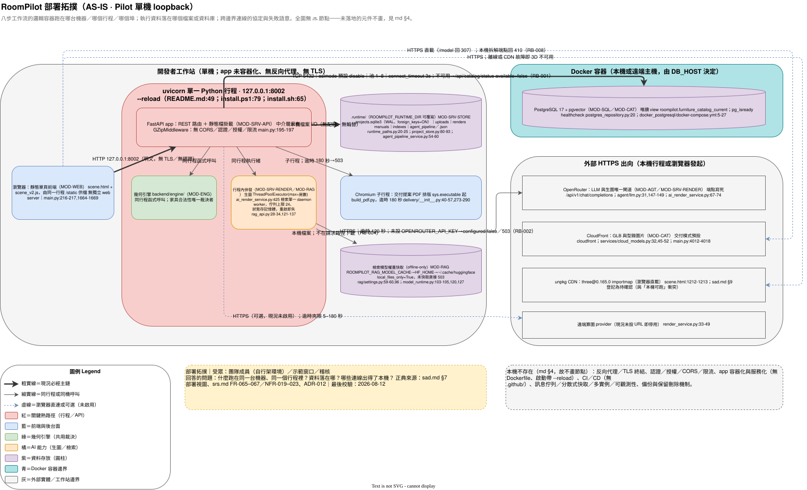

# 部署拓撲圖 (Deployment Topology) - RoomPilot

> **版本:** v1.0 ｜ **更新:** 2026-08-12 ｜ **狀態:** 草稿（待 owner 核准）
> **Owner:** 架構師；安裝腳本與環境變數由 MOD-OPS owner（Bella）維護
> **語域:** L2（橋接）——邏輯容器名與實際行程、埠、檔案路徑並列
> **實例:** 單例（整個 RoomPilot 一份；Pilot 現況只有一種環境，repo 內無 dev／stage／prod 分歧設定）
>
> **本文件回答**：八步工作流的邏輯容器目前跑在哪台機器、哪個行程、哪個埠，執行資料落在哪個檔案或資料庫，跨邊界連線各是什麼協定與失敗語意。
> **本文件不含**：容器責任分工（見 [`c4_container.md`](./c4_container.md)）、系統邊界與外部角色（見 [`c4_context.md`](./c4_context.md)）、架構取捨理由（見 [`../sad.md`](../sad.md) 與 `../adr/`）、安裝與日常維運步驟（見 [`deployment_and_operations.md`](../../06_ops/deployment_and_operations.md)）、故障處置（見 `runbook-*`）。
> **佐證基準**：分支 `yen`、HEAD `8f378b24`、2026-08-12 工作樹。行號隨程式碼演進，衝突時以原始碼為準。

## 目錄

- [1. 圖面資訊](#1-圖面資訊)
- [2. 部署拓撲圖](#2-部署拓撲圖)
- [3. 元素對照表](#3-元素對照表)
- [4. 本 repo 不存在的部署元件](#4-本-repo-不存在的部署元件)
- [5. 待確認](#5-待確認)
- [6. 追溯](#6-追溯)

## 1. 圖面資訊

| 欄位 | 值 |
| :--- | :--- |
| 受眾 | 團隊成員（自行架環境）、示範窗口、稽核 |
| 回答的問題 | 什麼跑在同一台機器、同一個行程裡？資料落在哪？哪些連線出得了本機？ |
| 正典來源 | [`../sad.md`](../sad.md) 部署視圖、[`srs.md`](../../01_requirements/srs.md) FR-065–067／NFR-019–023 |
| 最後校驗／階段 | 2026-08-12 對照 `yen@8f378b24` 逐項驗證；Pilot 現況 AS-IS，本圖不含任何 TO-BE 節點 |

## 2. 部署拓撲圖

> 下圖是正典載體 [`deployment_topology.drawio`](./deployment_topology.drawio) 的 SVG 匯出（draw.io Desktop 於 2026-08-12 產出），**不是另一套手繪圖**。

**圖例**（圖左下角同步標示）：粗實線＝現況必經主鏈；細實線＝同行程或同機呼叫；虛線＝瀏覽器直連或可選（未啟用）；圓柱＝資料存放；外框＝實體邊界（工作站／Docker 容器／外網）。全圖無 `🔜` 節點——未落地的元件一律不畫，改列於 §4。

**正典載體與重生成**：`.drawio` 由宣告式 spec [`deployment_topology.py`](./deployment_topology.py) 生成（`analyze_layout.py` 量測 cross=0／pierce=0；**絕不手改生成物**）；匯出指令 `"C:\Program Files\draw.io\draw.io.exe" --export --format svg --embed-svg-fonts=false --output deployment_topology.svg deployment_topology.drawio`。改圖一律改 `.py`——`.drawio` 與 `.svg` 皆為生成物，本檔無第二套圖形載體（README §1 不得雙軌維護，已收斂）｜最後校驗 2026-08-12。

## 3. 元素對照表

| 圖上節點 | 實體、屬性與失敗語意 | 佐證 file:line | MOD |
| :--- | :--- | :--- | :--- |
| WEB | 由同一個 uvicorn 行程掛載 `/static` 與 `/docs-assets`，`scene.html` 以 `FileResponse` 直供；**無獨立 web server** | `main.py:216-217,1646,1667` | MOD-WEB |
| PROC | 單行程 `uvicorn backend.server.main:app --host 127.0.0.1 --port 8002 --reload`；8002 被占用時改埠；安裝腳本釘 Python 3.12（實測虛擬環境 3.13.5，見 NFR-023） | `README.md:49,66,68`；`install.ps1:44,47,79`；`install.sh:35,65`；`pyproject.toml:5` | MOD-OPS |
| API | app 只掛 `GZipMiddleware`；**無 CORS、無認證、無授權、無限流中介層**（NFR-019） | `main.py:195-197` | MOD-SRV-API |
| ENG | 家具合法位置只由 `backend/engine/` 在同行程計算，不經任何外部服務 | [`AGENTS.md`](../../../AGENTS.md) §不可違反的契約；`engine/clearance.py:118-143` | MOD-ENG |
| CONC | 生圖／色卡走 `ThreadPoolExecutor`（`max_workers` ＝房數）；檢索走單一 daemon worker，佇列上限 24、完成後保留 3600 秒，狀態存行程記憶體，重啟即失 | `ai_render_service.py:423-429`；`rag_api.py:28-32,121-137` | MOD-SRV-RENDER、MOD-RAG |
| RT | 預設 repo 根 `.runtime/`，`ROOMPILOT_RUNTIME_DIR` 可覆寫；含 `uploads/`、`renders/`、`projects.sqlite3`（WAL、`foreign_keys=ON`）、`manuals/<project_id>/`、`indexes/questionnaire_visuals.sqlite3`、`agent_pipeline/<project_id>.json`。2026-08-12 實測 `uploads/` 118 MB、`projects.sqlite3` 67 MB、`manuals/` 45 MB，無配額與輪替（NFR-022、RB-009） | `runtime_paths.py:20-25`；`project_store.py:80-93`；`main.py:206-214,2291`；`agent_pipeline_service.py:54-60`；`du -sh .runtime/*` | MOD-SRV-STORE |
| PDF | 以 `sys.executable` 起子行程跑打包 skill 的 `build_pdf.py`，逾時 180 秒；未安裝 playwright 回 503 並附安裝指令（RB-005） | `agent/skills/delivery/__init__.py:40-57,275-300` | MOD-SRV-RENDER |
| CACHE | 目錄取 `ROOMPILOT_RAG_MODEL_CACHE`，否則 `HF_HOME` 或 `~/.cache/huggingface`；embedding 與 reranker 皆 `local_files_only=True`，未快取直接 `RagDependencyError` → 503（RB-004） | `rag/settings.py:59-60,96-97`；`model_runtime.py:104-127` | MOD-RAG |
| PG | `pgvector/pgvector:pg17`，埠 `${DB_PORT:-5432}`，`pg_isready` healthcheck，空 volume 首次自動還原 dump；用戶端預設 `localhost:5432/roompilot_db`、池 1–8、連線逾時 3 秒、`DB_SSLMODE` 預設 `disable`；第 6 步讀 view `roompilot.furniture_catalog_current`，不可用時 `/api/catalog/status` 回 `available=false`（RB-001） | `docker_postgresql/docker-compose.yml:5-27`；`postgres_repository.py:20,194-196,211-224,226-245` | MOD-SQL、MOD-CAT |
| OR | 端點寫死 `https://openrouter.ai/api/v1/chat/completions`，逾時 `ROOMPILOT_AGENT_LLM_TIMEOUT` 預設 120 秒；未設 `OPENROUTER_API_KEY` 時狀態端點回 `configured:false`、呼叫回 503（RB-002） | `agent/llm.py:31,143-149`；`ai_render_service.py:67-74` | MOD-SRV-RENDER、MOD-AGT |
| CF | 交付模式預設 `cloudfront`，base `https://ddgsm1yg3xikc.cloudfront.net`；`/model` 回 307 由瀏覽器直載，`model.gltf`／`buffer.bin`／`images/{i}` 回 410（RB-008） | `services/cloud_models.py:32,45-52`；`main.py:4012-4018,4021-4048` | MOD-CAT |
| RP | `ROOMPILOT_RENDER_PROVIDER_URL` 未設即 `configured:false`（現況預設未啟用）；逾時夾限 5–180 秒、預設 60 秒；有 token 才加 `Authorization`；上游拒絕／連不上分別回 `render_provider_http_<code>`／`render_provider_unreachable` | `render_service.py:33-51,136-149` | MOD-SRV-RENDER |

## 4. 本 repo 不存在的部署元件

| 元件 | 現況 | 佐證 |
| :--- | :--- | :--- |
| 反向代理／TLS 終結 | 無 nginx／Caddy／Traefik 設定與憑證檔；對外只有明文 HTTP loopback | `rg -i "nginx\|traefik\|caddy\|letsencrypt"` 無命中；`README.md:49` |
| 認證／授權／CORS／限流 | app 只掛 GZip 一個中介層，唯一節流是檢索佇列上限 24；`.runtime/auth_secret.key` 存在但**全 repo 無程式碼引用**（殘留檔） | `main.py:195-197`；`rag_api.py:28-32`；`rg "auth_secret"` 無命中 |
| app 容器化／服務化 | 無 Dockerfile、無 app compose（`docker_postgresql/` 只含資料庫）、無 systemd／supervisord；啟動指令帶 `--reload`（開發伺服器即展示環境） | 根目錄無 `Dockerfile`；`install.ps1:79` |
| CI／CD | 無 `.github/` 目錄與任何 pipeline 設定；驗證靠本機 `pytest -q`（NFR-024） | `.github` 不存在；[`AGENTS.md`](../../../AGENTS.md) §驗證矩陣 |
| 訊息佇列／分散式快取／多實例／可觀測性 | 依賴清單無 redis／celery／rabbitmq／kafka，無 sentry／opentelemetry／prometheus 與 logging 設定；併發只有行程內執行緒與單一全域鎖 | `requirements.txt`、`pyproject.toml` 無命中；`agent_pipeline_service.py:28-30` |
| 備份／保留／刪除機制 | 無備份腳本、無 TTL、無專案刪除 API（NFR-022；DEC-015 未核准） | [`srs.md`](../../01_requirements/srs.md) §4 資料需求、NFR-022 |

## 5. 待確認

| # | 待確認內容 | 掛的 OPEN／DEC | 目前可驗證的事實 | 承接處 |
| :--- | :--- | :--- | :--- | :--- |
| 1 | 「僅本機 loopback、無認證」是既定 Pilot 範圍還是待補缺口；若要開放內網共用，反向代理／TLS／認證需一次補齊 | OPEN-02（DEC-014、NFR-019） | `main.py:195-197` 無認證與 CORS 中介層；唯一邊界是 `--host 127.0.0.1` | [`../sad.md`](../sad.md)、[`deployment_and_operations.md`](../../06_ops/deployment_and_operations.md) |
| 2 | 備份頻率、保留天數、結案刪除與工作站最低配備（檢索常駐約 4.6 GB）——**目標值未定義**，無法由程式碼推導 | DEC-015、NFR-025 | repo 無備份腳本、無配額設定、無硬體規格文件 | [`deployment_and_operations.md`](../../06_ops/deployment_and_operations.md)、[`runbook-runtime-storage-growth.md`](../../06_ops/runbook-runtime-storage-growth.md) |
| 3 | PostgreSQL 正式部署形態（Docker vs 原生安裝）未拍板，且 Docker 首次自動還原的掛載路徑對不上實體檔位置，一鍵還原是否成立需實跑驗證 | 本文件新增（無既有 OPEN） | `docker_postgresql/DOCKER_ONECLICK.md:40-41` 保留原生安裝路徑；`docker-compose.yml:19` 綁 `./scripts/sql/roompilot_db_dump.sql.gz`（相對 compose 檔所在的 `docker_postgresql/`），但 dump 實體在 `docker_postgresql/roompilot_db_dump.sql.gz`（57,498,367 bytes），`docker_postgresql/scripts/` 不存在、`scripts/sql/` 亦無 `.gz` | [`runbook-catalog-db-unavailable.md`](../../06_ops/runbook-catalog-db-unavailable.md)、[`deployment_and_operations.md`](../../06_ops/deployment_and_operations.md) |
| 4 | 環境設定優先序**兩套並存**：型錄模組以 process env 優先於 `.env`，檢索模組以 `.env` 優先於 process env；同一部署可能讀到不同設定 | 本文件新增（無既有 OPEN） | `postgres_repository.py:194-196` 為 `os.getenv(name, file_values.get(...))`；`rag/settings.py:23-28` 為 `file_values.get(name, os.getenv(...))` | [`deployment_and_operations.md`](../../06_ops/deployment_and_operations.md)、[`lld.md`](../../04_design/lld.md) |

## 6. 追溯

- **上游**：DEC-014、DEC-015、DEC-017；FR-065、FR-066、FR-067；NFR-007、NFR-010、NFR-013、NFR-014、NFR-018、NFR-019、NFR-022、NFR-023、NFR-024、NFR-025（[`srs.md`](../../01_requirements/srs.md)）；[`../sad.md`](../sad.md) 部署視圖與 MOD-* 目錄；[`c4_container.md`](./c4_container.md) 的邏輯容器。
- **決策依據**：[`ADR-012`](../adr/ADR-012-pilot-loopback-deployment.md)、[`ADR-010`](../adr/ADR-010-static-frontend-and-eight-step-collapse.md)、[`ADR-004`](../adr/ADR-004-single-workflow-snapshot-sqlite.md)、[`ADR-005`](../adr/ADR-005-postgres-catalog-source-of-truth.md)、[`ADR-008`](../adr/ADR-008-rag-retrieval-only-offline-models.md)、[`ADR-009`](../adr/ADR-009-server-governed-ai-generation.md)、[`ADR-011`](../adr/ADR-011-agent-pipeline-flag-isolation.md)。
- **下游**：[`deployment_and_operations.md`](../../06_ops/deployment_and_operations.md)；RB-001、RB-002、RB-004、RB-005、RB-008、RB-009；[`test_plan.md`](../../05_qa/test_plan.md) 的 TC-056–059；[`engineering_tracker.xlsx`](../engineering_tracker.xlsx) ①規格追溯。
