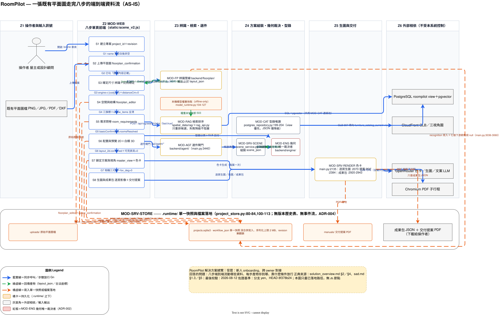

# 解決方案總覽圖 (Solution Overview) - RoomPilot

> **版本:** v1.0 ｜ **更新:** 2026-08-12 ｜ **狀態:** 草稿（待 owner 核准）
> **Owner:** 架構師（`backend/server/` 整合 owner Bella 審閱）；步驟納入／排除屬產品 owner
> **語域:** L2（橋接）——業務步名與模組代號 MOD-*、實際檔案路徑並列
> **實例:** 單例（整個 RoomPilot 一張；future state 不另開檔，以 `🔜` 標於同圖）
>
> **本文件回答**：一張既有平面圖從上傳到交付，八步之間流動什麼資料、每步產出什麼、存到哪、下一步靠什麼條件才放行。
> **本文件不含**：容器與元件責任目錄（見 [`../sad.md`](../sad.md) §1）、系統邊界與外部角色（見 [`c4_context.md`](./c4_context.md)）、容器內部拆解（見 [`c4_container.md`](./c4_container.md)）、部署形態（見 [`deployment_topology.md`](./deployment_topology.md)）、端點欄位契約（見 [`../../04_design/api_spec.md`](../../04_design/api_spec.md)）、頁面與面板結構（見 [`../../02_ux_ui/information_architecture.md`](../../02_ux_ui/information_architecture.md)）。
> **佐證基準**：分支 `yen`、HEAD `8f378b24`、2026-08-12 工作樹。行號隨程式碼演進，衝突時以原始碼為準。

## 目錄

- [1. 圖面資訊](#1-圖面資訊)
- [2. 端到端資料流](#2-端到端資料流)
- [3. 元素對照表](#3-元素對照表)
- [4. 逐步產物與守門條件](#4-逐步產物與守門條件)
- [5. 約束與檢查](#5-約束與檢查)
- [6. 待確認](#6-待確認)
- [7. 追溯](#7-追溯)

## 1. 圖面資訊

| 欄位 | 值 |
| :--- | :--- |
| 受眾／回答的問題 | 新人 onboarding、跨 owner 對接；八步端到端流動哪些資料、每步產物與放行條件是什麼 |
| 正典來源 | [`../sad.md`](../sad.md)、[`../../01_requirements/srs.md`](../../01_requirements/srs.md) §9.2 |
| 抽象層級／載體 | L2 模組＋步驟產物，不畫 class、function、DOM id、資料表欄位；**正典載體為 drawio**（[README](../../../VibeCoding_Workflow_Templates/03_architecture/diagrams/README.md) §1），§2 嵌入其 SVG 匯出，**無第二套圖形載體** |
| 最後校驗 | 2026-08-12（逐節點回查原始碼行號） |

> **正典載體**：[`solution_overview.drawio`](./solution_overview.drawio)，由宣告式 spec [`solution_overview.py`](./solution_overview.py) 生成（**勿手改生成物**）；`_tools/drawio_kit.py`＋`analyze_layout.py` 管線於 2026-08-12 實跑，量測 edges=33／cross=0／pierce=0。
>
> **重生成與匯出**：`python solution_overview.py` 產生 `.drawio`，再 `"C:\Program Files\draw.io\draw.io.exe" --export --format svg --embed-svg-fonts=false --output solution_overview.svg solution_overview.drawio` 產生 §2 的 SVG。改圖一律改 `.py`，`.drawio` 與 `.svg` 都是生成物。

## 2. 端到端資料流

> 下圖是 §1 `.drawio` 的 SVG 匯出（draw.io Desktop 於 2026-08-12 產出），**不是另一套手繪圖**。圖例、節點樣式與連線語意由 `.drawio` 承載；圖上標註的行號以本文件 §4 為準。

圖例在圖左下角（藍實線＝同步呼叫與步驟放行、綠虛線＝回傳產物、橘虛線＝落地寫入）。**圖上沒有的東西在本 repo 就不存在**：無訊息佇列、無快取層、無反向代理、無 CI、無 WebSocket、無第二個服務行程——六個伺服器端模組全掛在同一個 FastAPI app 上（`main.py:195-197`），只另外 `include_router(rag_router)`。

## 3. 元素對照表

| 圖上節點 | MOD-* | 實際程式碼與佐證 |
| :--- | :--- | :--- |
| WEB／S1–S8 | MOD-WEB | `backend/server/static/scene_v2.js`；內部 11 步 key 與對外 8 步折疊見 `scene_workflow.js:4-16` |
| SRV | MOD-SRV-API | `backend/server/main.py`：單一 app ＋ GZip ＋ `rag_router`（`main.py:195-197`） |
| FP | MOD-FP | `backend/floorplan/`，DXF／影像雙分流（`main.py:2996-3021`）；`layout_json` 出口 `main.py:3064-3069`、`main.py:4099-4103` |
| SCN／ENG | MOD-SRV-SCENE／MOD-ENG | `scene_service.py:2888` 組裝 `scene_json`；座標一律由 `backend/engine/` 裁決（`main.py:3647-3660`、`main.py:3998`），契約見 [`AGENTS.md`](../../../AGENTS.md) §不可違反的契約 |
| AGT | MOD-AGT | `backend/agent/` 選件閘門，端點 `main.py:3440`；前端呼叫 `scene_v2.js:10606-10627` |
| RAGS | MOD-RAG | `backend/spatial_data/rag/`（**不在** `backend/rag/`），HTTP 轉接層 `backend/server/rag_api.py`；第 5 步只重排既有候選次序，失敗降級不阻塞（`scene_v2.js:871-879`） |
| CAT | MOD-CAT／MOD-SQL | `postgres_repository.py:199-204` 以 view 為優先來源；分頁 `main.py:3229`、GLB 交付 `main.py:4012-4048` |
| RND | MOD-SRV-RENDER | 色卡 `main.py:2135`、逐房生圖 `main.py:2070`、提案 PDF `main.py:2384`、成果包 `main.py:2920-2943` |
| SNAP／UP／MAN | MOD-SRV-STORE | `.runtime/` 下 `projects.sqlite3`、`uploads/`、`manuals/`（`project_store.py:80-84`、`main.py:2290-2291`）；快照寫入 `main.py:1806-1867` |
| PG／MDL／OR／PDFE／CF | 外部相依 | PostgreSQL `roompilot`、offline 模型快取（`model_runtime.py:104-127`）、OpenRouter／Chromium 子行程（503／502 語意 `main.py:2107-2116,2400-2405`）、CloudFront |

## 4. 逐步產物與守門條件

| 步 | 主要產物（寫入位置） | 守門條件（放行下一步） | 擋下時的表現 | FR |
| :--- | :--- | :--- | :--- | :--- |
| S1 建立專案 | `project_id`＋`revision`（SQLite 列） | **G1** `name` 去空白後非空（`scene_workflow.js:128`） | 422 `project_name_required` | FR-001 |
| S2 上傳平面圖 | 原始檔進 `uploads/`；`floorplan_confirmation` 進快照 | **G2** `filename` 非空（`:129`）＋辨識前須勾「圖檔內容正確」（`main.py:2985-2993`） | 415／422；未勾選 409 `floorplan_confirmation_required` | FR-005、FR-011 |
| S3 確定尺寸 | `layout_json`＋`recognition.spatial_report`（`main.py:3064-3069`） | **G3** `engine ∈ {cody,dxf}`（`:130`）且 `distanceCm > 0`（`:131`） | 422 `dxf_parse_failed`／`cody_recognition_failed`；重跑辨識把七個下游節點寫 null（`main.py:3036-3060`） | FR-010、FR-012、FR-016 |
| S4 空間與結構 | `floorplan_editor`（`scene_v2.js:2216-2245`）＋`space_confirmation`（`:1218-1227`） | **G4** 房間／結構／比例三旗標皆 true（`:132-137`）＋伺服器比對 `review_items` 全數已確認（`main.py:1737-1781`） | 422 `recognition_review_unresolved` 並回傳待處理房清單（`main.py:1815-1827`） | FR-007、FR-018 |
| S5 需求問卷 | `requirements.roomRequirementModel`（`scene_v2.js:1228-1240`）；家電只進 `render_context`（`scene_service.py:3058-3062`） | **G5** `basicConfirmed && roomsResolved`（`:138-140`） | 檢索不可用只降級 `unavailable`，不阻塞問卷 | FR-027、FR-028、FR-049 |
| S6 配置與預覽 | `scene_json`（`main.py:3641-3644`）→ 快照 `layout_2d`＋`white_model_3d`（`scene_v2.js:1240-1263`） | **G6** `layout_2d.confirmed`；`white_model_3d` 另需 `visibleFurnitureCount > 0`（`:141-149`）；前端再擋 GLB 載入失敗與 `validate_only:true` 最終驗證（`scene_v2.js:13944-13980`） | 不合法家具退回 2D 待處理清單，座標不被搬動 | FR-024、FR-029、FR-032 |
| S7 鎖定方案與視角 | `proposal_review.masterView`（`scene_v2.js:15215-15221`）＋`palette_render` 旗標（`main.py:2199-2213`） | **G7** `confirmed` 且相機 `position_cm`／`target_cm` 各 3 元素、`fov_deg > 0`（`:151-159`） | 色卡第二次呼叫 409 `palette_already_generated`（`main.py:2148-2155`）；全失敗不鎖定可重試 | FR-055、FR-056 |
| S8 生圖與成果包 | 逐房影像 base64 ＋`ai_render` 鎖定清單（`main.py:2116-2125`）；六章成果包 JSON（`main.py:2933-2942`）；提案 PDF 進 `manuals/` | 終點步；`ai_render.confirmed`（`:160`） | 未設金鑰 503；單房失敗只標 `failed`；PDF 引擎缺席 503 附安裝指引 | FR-058、FR-062、FR-063 |

第 6 步對外一顆按鈕、內部要跨 `layout_2d → white_model_3d → realistic_3d` 三道 gate（`scene_workflow.js:43-101`）；任一步 `complete()` 會作廢所有索引更大的已完成步並刪其 data（`scene_workflow.js:175-187`）。

## 5. 約束與檢查

- [x] 邊界鐵律標於圖上：辨識止於 `layout_json`（[ADR-001](../adr/ADR-001-layout-json-scene-json-boundary.md)）、家具合法性只由 `backend/engine/` 裁決（[ADR-002](../adr/ADR-002-engine-sole-geometry-authority.md)）、家電只進 `render_context`（[ADR-006](../adr/ADR-006-appliances-render-context-only.md)）、單一快照（[ADR-004](../adr/ADR-004-single-workflow-snapshot-sqlite.md)）；外部整合皆經明確 adapter，無元件直連他人資料儲存。
- [x] 未虛構不存在的能力；圖上每個節點在 §3 對到實際檔案；無 `🔜` 節點——本圖只畫已落地路徑。`frontend3d/` 為次要原型，未入主鏈（[ADR-010](../adr/ADR-010-static-frontend-and-eight-step-collapse.md)）。
- [ ] 模板 [`README.md`](../../../VibeCoding_Workflow_Templates/03_architecture/diagrams/README.md) §2 規定本視圖企業級才畫，本專案處 Pilot 已提前繪製——**待文件 owner 追認**。
- [x] README §1 的**不得雙軌維護**已收斂（2026-08-12 三步全數完成）：① `solution_overview.py` 兩處行號修正為 `main.py:2981`、`main.py:3036-3060`（實讀確認 `:2980` 為空行、`:3034` 為 `geometry_engine = "cody"`），drawio 重新生成，`analyze_layout.py` 覆測 edges=33／cross=0／pierce=0；② draw.io Desktop（`C:\Program Files\draw.io\draw.io.exe`）匯出 `solution_overview.svg`，帶 `--embed-svg-fonts=false`（內嵌字型會使檔案由 1.79 MB 膨脹為不必要體積，關閉後 111 KB）；③ §2 mermaid 區塊刪除、改嵌該 SVG。**本檔現只有一套圖形載體**：`.py` 是唯一手改點，`.drawio` 與 `.svg` 皆為生成物；§3 元素對照表為文字表，不受此規則管轄。
- [x] [`deployment_topology.md`](./deployment_topology.md) 同屬 README §1 的 drawio 正典視圖，已於同日以同一管線收斂（其 spec 首次生成即 cross=0／pierce=0，無行號漂移待修）。

## 6. 待確認

| OPEN | 內容 | 對本圖的影響 |
| :--- | :--- | :--- |
| OPEN-03 | `POST /api/projects/{id}/renders`（`main.py:1937`）、`/api/scene/decorate`（`main.py:3799`）、`/api/projects/{id}/design-manual`（`main.py:2300`）在 `backend/server/static/` 全域搜尋無呼叫端，僅測試使用 | 三者未畫入主鏈；確認退役則刪端點，確認要用則本圖補流向 |
| OPEN-10 ＋ 本文件新增 | 三份交付物誰是正式主件未定；且第 8 步生圖影像只以 base64 回應（`ai_render_service.py:386-392`），`renders/` 與 `render_outputs` 表的唯一寫入端正是上列無呼叫端的 `POST /renders`——**生圖成果實際上未落地保存**，是刻意或缺口未定 | `OUT` 只列成果包 JSON 與提案 PDF；圖上未畫「生圖 → renders/」這條線 |

## 7. 追溯

- **上游需求**：DEC-001、DEC-004、DEC-008、DEC-010、DEC-011、DEC-012；FR-005、FR-007、FR-010、FR-012、FR-016、FR-018、FR-024、FR-027、FR-028、FR-029、FR-032、FR-049、FR-055、FR-056、FR-058、FR-062、FR-063；NFR-001、NFR-014、NFR-017。
- **上游決策**：[ADR-001](../adr/ADR-001-layout-json-scene-json-boundary.md)、[ADR-002](../adr/ADR-002-engine-sole-geometry-authority.md)、[ADR-004](../adr/ADR-004-single-workflow-snapshot-sqlite.md)、[ADR-005](../adr/ADR-005-postgres-catalog-source-of-truth.md)、[ADR-006](../adr/ADR-006-appliances-render-context-only.md)、[ADR-009](../adr/ADR-009-server-governed-ai-generation.md)、[ADR-010](../adr/ADR-010-static-frontend-and-eight-step-collapse.md)。
- **上游文件**：[`../sad.md`](../sad.md)、[`../../01_requirements/srs.md`](../../01_requirements/srs.md) §9.2、[`../../02_ux_ui/information_architecture.md`](../../02_ux_ui/information_architecture.md) §4–§5；**下游文件**：[`c4_context.md`](./c4_context.md)、[`c4_container.md`](./c4_container.md)、[`deployment_topology.md`](./deployment_topology.md)、[`../../04_design/lld.md`](../../04_design/lld.md)、[`../../05_qa/test_plan.md`](../../05_qa/test_plan.md)、[`../../06_ops/deployment_and_operations.md`](../../06_ops/deployment_and_operations.md)。
- **驗收與決策權威**：ACPT-006、ACPT-009、ACPT-014、ACPT-019、ACPT-027、ACPT-047、ACPT-048、ACPT-050、ACPT-053；SCN-011、SCN-038。步驟納入／排除與交付主件屬產品 owner，記於 [`../../01_requirements/requirements_tracker.xlsx`](../../01_requirements/requirements_tracker.xlsx) ①需求決策；本圖只記 AS-IS，狀態為待 owner 核准。
