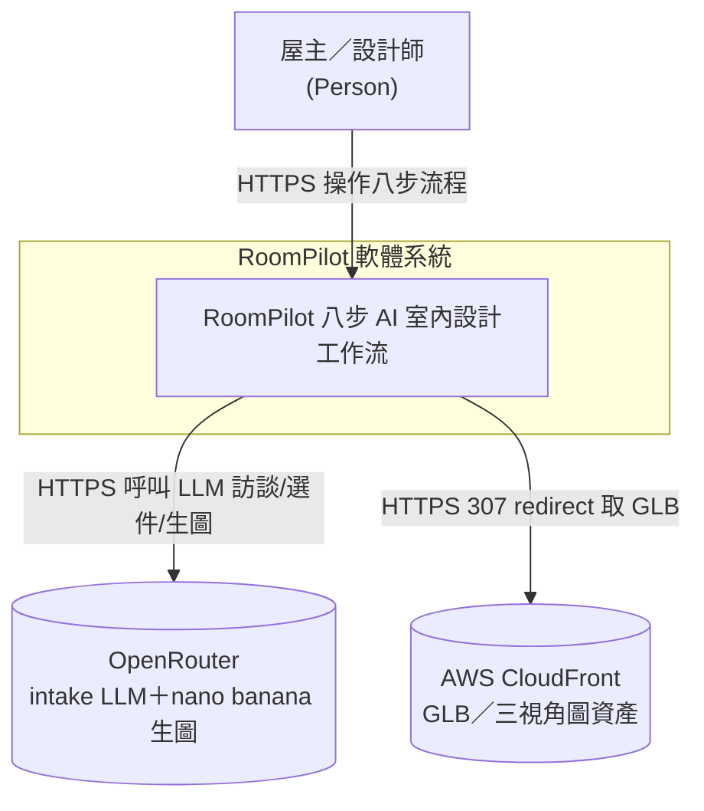
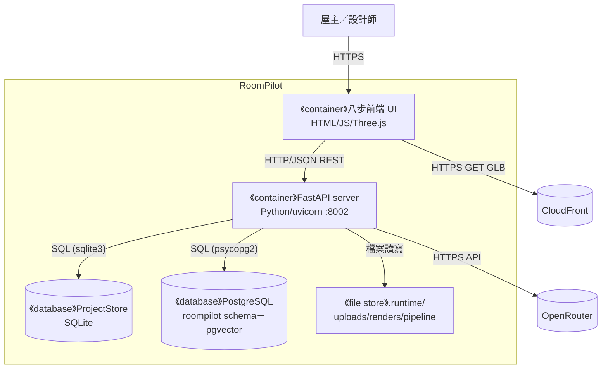
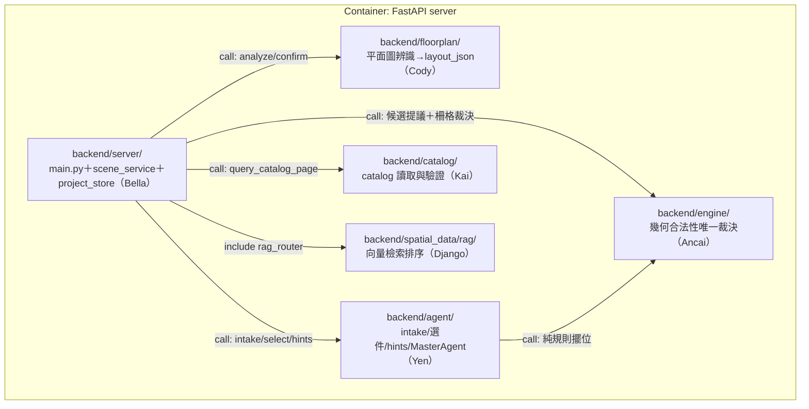
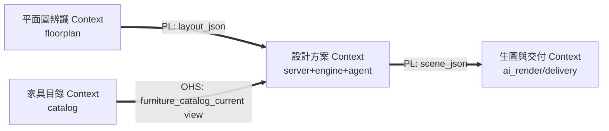
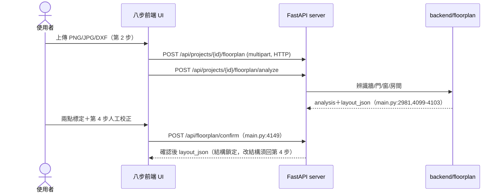
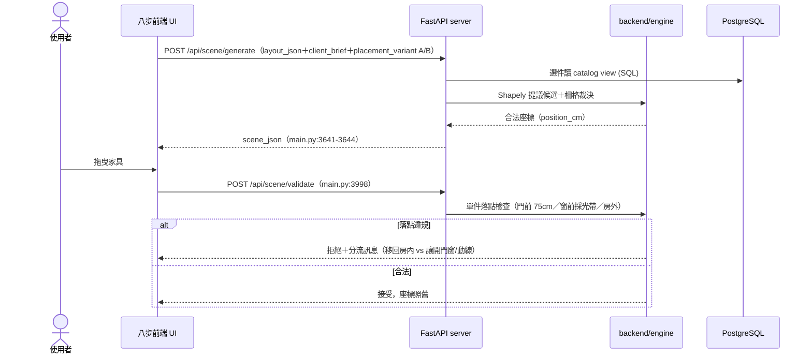
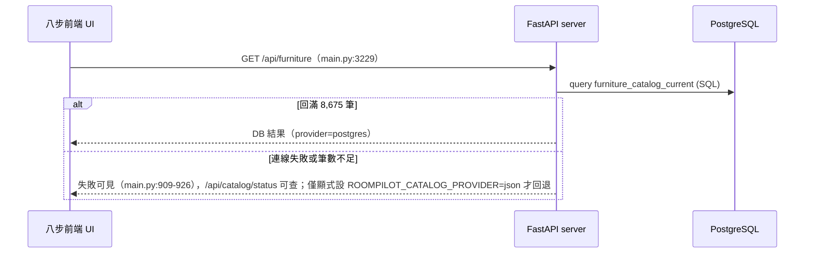
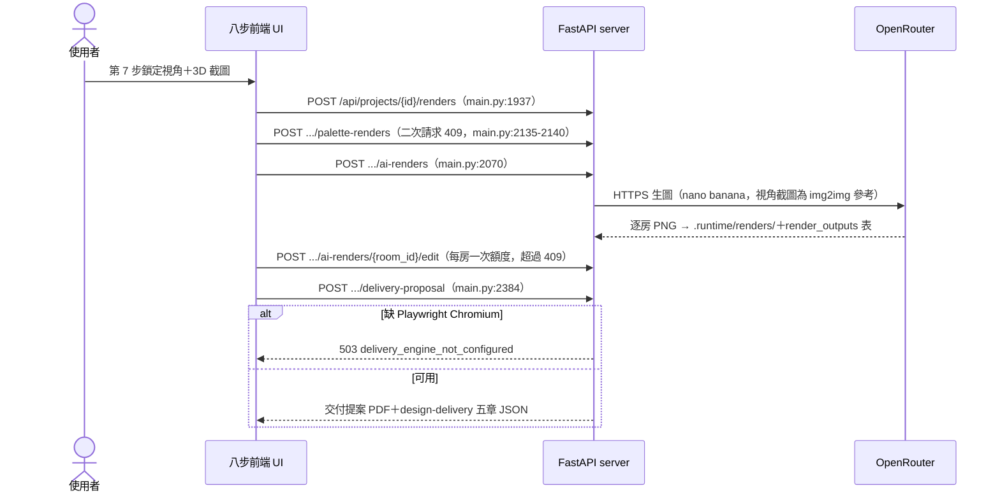
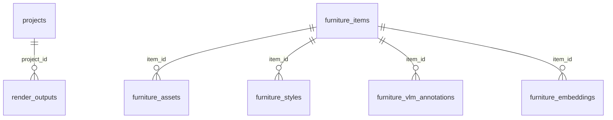
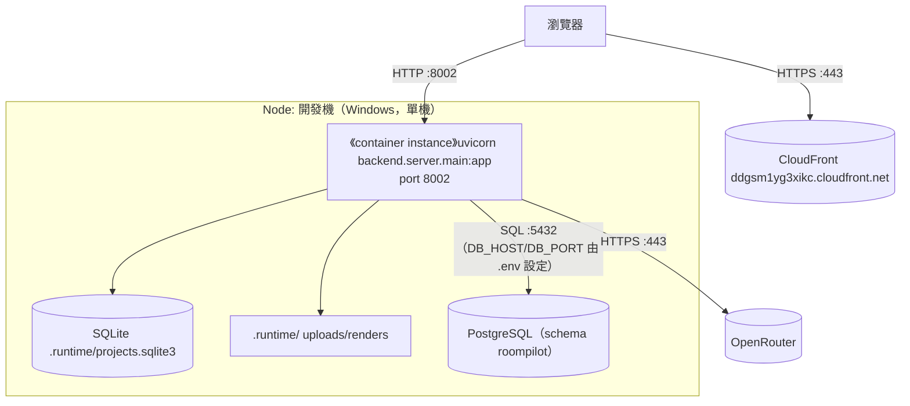

# 軟體架構文件 (SAD) - RoomPilot

> **版本:** 0.1 | **更新:** 2026-08-11 | **狀態:** 草稿
> **Owner:** Bella（跨模組整合；各 Container/模組依 `AGENTS.md:32-46` 目錄責任分屬 Cody/Django/Kai/Yen/Ancai）
> **語域:** L3（工程）
> **實例:** 單例（系統架構契約只有一份）
> **定位宣告**：系統級架構的單一真實來源——C4 L1–L3、DDD 邊界、資料與部署視圖。Code 層歸 [`../04_design/lld.md`](../04_design/lld.md)；API／資料契約歸 [`../04_design/api_spec.md`](../04_design/api_spec.md) 與 [`../04_design/db_design.md`](../04_design/db_design.md)；決策理由歸 [`adr/`](./adr/) 八份 ADR；穩定 ID 與術語歸 [`../00-registry.md`](../00-registry.md)。
> 生成：AI 由程式碼與文件衍生｜來源版本 git yen@8863a36c

## 目錄

- [1. C4 架構視圖](#1-c4-架構視圖)
- [2. DDD 邊界與分層](#2-ddd-邊界與分層)
- [3. 技術選型](#3-技術選型)
- [4. 需求摘要](#4-需求摘要)
- [5. 關鍵使用者旅程](#5-關鍵使用者旅程)
- [6. 資料架構](#6-資料架構)
- [7. 部署視圖](#7-部署視圖)
- [8. 跨領域考量](#8-跨領域考量)
- [9. 風險與演進](#9-風險與演進)
- [10. 架構審查清單](#10-架構審查清單)
- [11. 待確認](#11-待確認)
- [12. 追溯](#12-追溯)

## 1. C4 架構視圖

### 1.1 L1 — System Context

外部系統五類盤點：資料源＝CloudFront（`backend/server/main.py:4012` 307 redirect）；雲端服務＝OpenRouter（`main.py:2064,3331`）；交易、推送、備份三類依現有證據＝無（見 §11 待確認）。

### 1.2 L2 — Container

| Container | 類型 | 技術 | 何時啟用 | L3 揭露 |
| :--- | :--- | :--- | :---: | :---: |
| 八步前端 UI | UI（瀏覽器） | 原生 HTML/JS/Three.js（`backend/server/static/scene.html`） | 現在 | 略（單頁精靈，頁面結構歸 `../02_ux_ui/ui_spec-scene.md`） |
| FastAPI server | process | Python/FastAPI 單一 app（`main.py:195`），uvicorn :8002（`README.md:49,63`） | 現在 | ✅ §1.3 |
| ProjectStore | DB（檔案） | SQLite `.runtime/projects.sqlite3`（`project_store.py:77-84`） | 現在 | 表代圖 → §6 |
| PostgreSQL | DB | schema `roompilot`＋pgvector（`scripts/sql/roompilot_postgresql_schema.sql:386-471`） | 現在 | 表代圖 → §6 |
| .runtime 檔案儲存 | 檔案 | uploads／renders／agent_pipeline JSON（`runtime_paths.py:20-25`、`agent_pipeline_service.py:8-10`） | 現在 | 略（純檔案，無內部結構） |
| OpenRouter | 外部系統 | LLM＋生圖 API | 現在（缺金鑰時 503，`main.py:2070-2076`） | 略（第三方） |
| CloudFront | 外部系統 | GLB/圖片 CDN | 現在 | 略（第三方） |

frontend3d/ 與 frontend/ 是次要原型、不是 Container（[ADR-006](./adr/ADR-006-static-frontend-as-production.md)）。無 milestone 規劃中的新 Container，故無 future state 圖。

### 1.3 L3 — Component（FastAPI server Container）

箭頭語意＝Python import/呼叫。正式 step6 路徑：`scene_service.generate_layout()`（`scene_service.py:2155-2705`）以 Shapely 提議候選、5cm 柵格為碰撞唯一權威（`scene_service.py:2228-2230,2269-2286`；[ADR-008](./adr/ADR-008-hybrid-shapely-raster-engine.md)）。RAG 只供 `/rag` 驗證頁，不接第 6 步（`docs/contracts/POSTGRESQL_FURNITURE_RAG_RUNTIME.md`）。

## 2. DDD 邊界與分層

通用語言（術語表）單一定義來源在 [`../00-registry.md`](../00-registry.md) §5，本文件不重複。

### 2.1 Context Map

`layout_json` 與 `scene_json` 是唯二的跨 Context 公開語言（[ADR-001](./adr/ADR-001-layout-json-scene-json-boundary.md)；`docs/contracts/LAYOUT_SCENE_BOUNDARY_CONTRACT.md`）。

### 2.2 戰術元素對應

| DDD 元素 | 程式碼位置 | 備註 |
| :--- | :--- | :--- |
| Aggregate Root：Project（workflow JSON 單一快照） | `project_store.py:96-113` | revision 樂觀鎖為一致性邊界（[ADR-007](./adr/ADR-007-workflow-json-single-snapshot-store.md)） |
| Entity：家具項（`furniture_id`） | view 欄位 `postgres_repository.py:322-422` | |
| Value Object：`position_cm`／`rotation_y_deg` | `scene_service.py:2193-2195` | 房間中心原點、公分、度數 |
| Domain Service：`generate_layout`／淨空規則 | `scene_service.py:2155`、`engine/constraints.py:21-23` | 幾何唯一裁決（[ADR-002](./adr/ADR-002-geometry-legality-engine-only.md)） |
| Repository：catalog／ProjectStore | `postgres_repository.py:590-637`、`project_store.py` | |
| ACL：`layout_bridge`（族系對照、原點換算） | `engine/layout_bridge.py:20-55,178-188` | server↔engine 防腐層 |
| Domain Event | 缺席 | 同步呼叫架構，無事件匯流排 |

### 2.3 Clean Architecture 分層

| 層 | 程式碼位置 | 職責 |
| :--- | :--- | :--- |
| Domain | `backend/engine/`（rules/constraints/raster/clearance） | 擺位、碰撞、淨空核心規則 |
| Application | `backend/server/scene_service.py`、`backend/agent/`（select/place/furnish） | Use case 編排：選件、擺設、修復迴圈 |
| Infrastructure | `backend/server/main.py`（HTTP）、`project_store.py`、`backend/catalog/postgres_repository.py`、`ai_render_service.py` | API、持久化、外部服務 client |

## 3. 技術選型

| 分類 | 選用 | 理由（證據） | ADR |
| :--- | :--- | :--- | :--- |
| 後端框架 | FastAPI 單一 app | 所有路由集中 `main.py`，禁第二套 FastAPI（`AGENTS.md`、`README.md:393-403`） | — |
| 前端 | 原生 JS＋Three.js（`static/`） | frontend3d/ 僅原型 | [ADR-006](./adr/ADR-006-static-frontend-as-production.md) |
| 專案保存 | SQLite＋workflow JSON 快照（≤2MB）＋revision 樂觀鎖 | `project_store.py:12,18,28-33` | [ADR-007](./adr/ADR-007-workflow-json-single-snapshot-store.md) |
| 家具目錄 | PostgreSQL view 優先、失敗可見、顯式才回退 JSON | `main.py:909-926`、`README.md:299-304` | [ADR-003](./adr/ADR-003-catalog-postgres-first-json-fallback.md) |
| 幾何引擎 | Shapely 提議＋5cm 柵格裁決 | `raster.py:18-20`、`scene_service.py:2269-2286` | [ADR-008](./adr/ADR-008-hybrid-shapely-raster-engine.md) |
| 家電處理 | 只進 `render_context`，不進擺設 | `scene_service.py:715-740,3058-3062` | [ADR-004](./adr/ADR-004-appliances-render-context-only.md) |
| Agent 管線 | `ROOMPILOT_AGENT_PIPELINE` flag 並存、可回退 | `agent_pipeline_service.py:1-11` | [ADR-005](./adr/ADR-005-agent-pipeline-parallel-flag.md) |
| 生圖 | OpenRouter nano banana（img2img，第 7 步視角截圖參考） | `docs/contracts/AI_RENDER_OPENROUTER_CONTRACT.md` | — |
| PDF | Playwright Chromium（缺件回 503，不產殘缺 PDF） | `README.md:111-117`、`main.py:2384` | — |
| RAG | BGE-M3（1024 維）＋pgvector＋bge-reranker | `model_runtime.py:14-16`、`roompilot_furniture_embeddings_schema.sql` | — |

## 4. 需求摘要

功能與非功能需求以 [`../00-registry.md`](../00-registry.md) §2 為單一來源（REQ-001～014、FR-001～015、NFR-001～006），此處不重複列舉。對本架構最具形塑力的四條：

- NFR-001 公分制契約（跨模組 `_cm`＋`coordinate_unit: "cm"`）→ §2.2 Value Object 與 ACL。
- NFR-003 catalog PostgreSQL 優先、失敗可見 → §1.2 PostgreSQL Container 與 §5.3。
- NFR-004 幾何合法性單一權威 `backend/engine/` → §1.3、§2.3 Domain 層。
- NFR-002 可恢復保存＋樂觀鎖 → §2.2 Aggregate 與 §6 一致性策略。

## 5. 關鍵使用者旅程

### 5.1 SCN-002：上傳 → 辨識 → 確認 layout_json

### 5.2 SCN-003/004：第 6 步方案生成與拖曳驗證

確認白模走 `/api/scene/layout` 帶 `validate_only=true`：座標照舊、絕不重排（`scene_service.py:2188-2191`）。

### 5.3 SCN-006：catalog PostgreSQL 失敗可見

### 5.4 SCN-007：第 7/8 步生圖與交付

## 6. 資料架構

- SQLite（ProjectStore）：`projects`（`project_id, current_step, workflow_json, revision, upload_*`）＋`render_outputs`（`project_store.py:96-113,122-140`）。
- PostgreSQL：`roompilot.furniture_items` 及關聯表（`roompilot_postgresql_schema.sql:30-328`）；唯一正式讀取面是 view `furniture_catalog_current`（`:386-471`，`WHERE is_active`，8,675 件）；pgvector `furniture_embeddings`（8,076 筆，599 件 inactive 不進檢索）。欄位細節歸 [`../04_design/db_design.md`](../04_design/db_design.md)。
- 一致性策略：單一 workflow JSON 快照強一致（單寫入點）＋revision 樂觀鎖，落後回 409 `project_revision_conflict`（`project_store.py:28-33`）；catalog 為唯讀 read model，無跨庫交易。
- 資料隔離：quarantine（1,514＋1,509 筆）執行期不得載入（`backend/catalog/AGENTS.md:6-8`）；`.env`／`.runtime`／大型 GLB 不進 Git（`README.md:393-403`）。正式 PII 政策見 §11 待確認。

## 7. 部署視圖

| 環境 | Deployment 模式 | 高可用／Backup／監控 |
| :--- | :--- | :--- |
| Dev（唯一有證據的環境） | 單機 uvicorn :8002（`README.md:49,63`）＋本機/遠端 PostgreSQL（連線由 `.env` `DB_*` 設定，`postgres_repository.py:211-245`） | 無 HA；無自動備份與監控證據（§11） |
| Staging／Production | 無證據 | 見 §11 待確認 |

無 future state Container（§1.2），故無目標環境部署圖。CI/CD 與成本歸 [`../06_ops/deployment_and_operations.md`](../06_ops/deployment_and_operations.md)。

## 8. 跨領域考量

| 維度 | 方案 | 狀態 |
| :--- | :--- | :--- |
| 健康檢查 | 狀態端點：`/api/catalog/status`、`/api/rag/status`、`/api/ai-render/status`、`/api/delivery-proposal/status`、`/api/agent/pipeline/status`（status 永遠可查，`main.py:3504`） | 現行 |
| 日誌／指標（SLI/SLO）／追蹤／告警 | 無正式方案證據 | 待確認（§11） |
| 機密管理 | `.env` 不提交；AI render status 不外洩 token（`main.py:2064`）；DB 密碼走 `DB_PASSWORD` env | 現行 |
| 輸入防護 | 選件 offers 白名單＋count 夾 1..6（`select.py:38-39,133-136`）；render-jobs payload `project_id` 不一致回 422（`main.py:2033-2039`）；workflow >2MB 回 413 | 現行 |
| 測試紀律 | 預設決定論、離線；外部資產/DB/網路顯式 opt-in 或安全 skip（`tests/AGENTS.md`，NFR-006） | 現行 |

## 9. 風險與演進

| 風險 | 可能性 | 影響 | 緩解 |
| :--- | :--- | :--- | :--- |
| 契約與實作漂移：Phase 3 契約稱 project store 在 PostgreSQL，本分支實為 SQLite，且缺 migration 腳本（`01-product` §5、`POSTGRESQL_PROJECT_STORE_PHASE3.md:7-12`） | 高 | 新環境無法重建 Phase 3/4 | 以本分支程式為準記載；遷移前補齊腳本 |
| PostgreSQL 不可用時第 6 步家具清單失效 | 中 | 第 6 步阻斷 | 失敗可見＋顯式 JSON 回退（ADR-003）；runbook [`../06_ops/runbook-catalog-db-unavailable.md`](../06_ops/runbook-catalog-db-unavailable.md) |
| 缺 Playwright Chromium 時交付提案 503 | 中 | 第 8 步交付阻斷 | 503 附安裝指引（ACPT-011）；runbook [`../06_ops/runbook-delivery-proposal-503.md`](../06_ops/runbook-delivery-proposal-503.md) |
| Agent 並存管線與 step6 不等價（輸入轉接與輸出對帳未做，`agent_pipeline_service.py:22-26`） | 中 | 兩路徑結果分歧 | flag 預設關閉、可回退（ADR-005）；`/api/agent/pipeline/reconcile` 對帳 |
| 兩套幾何引擎並存的規則分歧（Shapely 淨空 vs 柵格遮罩） | 中 | 合法性判定不一致 | 柵格為碰撞唯一權威（ADR-008）；規則數值集中 `constraints.py`/`rules.py` |

演進路線：現況 Pilot（SQLite ProjectStore＋PostgreSQL catalog read）→ PostgreSQL Phase 3/4/5（project store／runtime catalog／strict single source，契約已立、缺重建腳本）→ Agent 管線等價化後擇一。時程無證據（§11）。

## 10. 架構審查清單

- [x] L1–L3 各至少一張圖；每個 L2 Container 有 L3 或明確跳過理由（§1.2 表）
- [x] L1 外部系統五類盤點（三類標無，§11 待確認）；無 milestone Container 故無 future state 圖
- [x] 跨 Container／跨 Node 箭頭標 protocol＋動詞
- [x] C4 全稱用語；Context Map 箭頭為 Strategic Relationship（PL/OHS）
- [x] 四張 Sequence Diagram（§5）；Deployment 圖含 Node 與 port
- [ ] 架構變動同步 `lld`／`deployment_and_operations`（持續義務）

## 11. 待確認

1. ProjectStore 實際為 SQLite，`README.md:312` 與 Phase 3 契約稱已搬 PostgreSQL JSONB；`scripts/project_store/` migration 工具不在目前工具樹——以本分支程式（SQLite）為準。
2. Staging／Production 部署環境、HA、備份、日誌／指標／告警：repo 內無證據。
3. L1 外部系統的交易、推送、備份三類：未見證據，暫標「無」。
4. 正式 PII／資料保留政策：問卷含入住人數等輕度個資，未見成文政策。
5. `docs/contracts/README.md:27` 引用的 `POSTGRESQL_CATALOG_CRUD_PHASE2.md` 不在 `docs/contracts/` 目錄。
6. PostgreSQL 實際運行版本：僅見安裝指南檔名「17.10」，runtime 版本未驗證。
7. 演進路線（Phase 3/4/5、管線擇一）的時程與優先序：未經 `requirements_tracker.xlsx` ①需求決策核准。

## 12. 追溯

| 項目 | ID／連結 |
| :--- | :--- |
| 上游 | REQ-001～014、FR-001～015、NFR-001～006（[`../00-registry.md`](../00-registry.md) §2；[`../01_requirements/prd.md`](../01_requirements/prd.md)、[`../01_requirements/srs.md`](../01_requirements/srs.md)） |
| 決策 | [ADR-001](./adr/ADR-001-layout-json-scene-json-boundary.md)～[ADR-008](./adr/ADR-008-hybrid-shapely-raster-engine.md)（`../00-registry.md` §3，全數為既成決策引用） |
| 下游 | [`../04_design/lld.md`](../04_design/lld.md)（Code 層）、[`../04_design/api_spec.md`](../04_design/api_spec.md)／[`../04_design/openapi-roompilot-v1.yaml`](../04_design/openapi-roompilot-v1.yaml)／[`../04_design/db_design.md`](../04_design/db_design.md)（契約）、[`../06_ops/deployment_and_operations.md`](../06_ops/deployment_and_operations.md) |

**鐵律**：本文件是架構契約——任何模組在此沒出現，等於不存在；其他文件提到而本文件沒提到，是本文件的 bug。

| 版本 | 日期 | 變更 |
| :--- | :--- | :--- |
| 0.1 | 2026-08-11 | 首版：AI 由 git yen@8863a36c 程式碼與事實檔（01-product/02-api/03-engine/05-data）衍生，人工核准前為 TO-BE |
