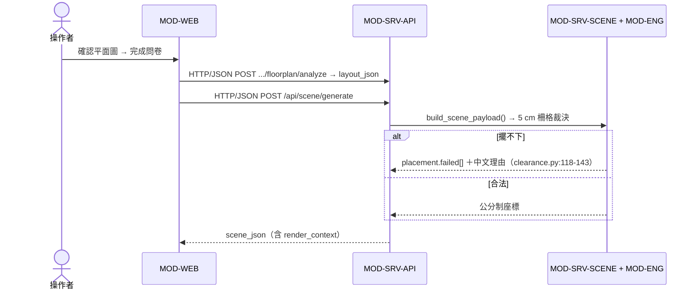

# 軟體架構文件 (Software Architecture Document) - RoomPilot

> **版本:** v1.0 ｜ **更新:** 2026-08-12 ｜ **狀態:** 草稿（待 owner 核准）
> **Owner:** 架構師（合成）；每個 MOD-* 的實作 owner 見 §1.3，跨目錄公開契約由 Bella 整合（`AGENTS.md:46`）
> **語域:** L2（橋接）——業務詞與工程詞並列，跨層一律用穩定 ID ｜ **實例:** 單例（系統架構契約只有一份）
>
> **本文件回答**：RoomPilot 由哪些 runtime 容器與 MOD-* 模組組成、責任邊界畫在哪、`layout_json`／`scene_json`／`workflow_json`／`render_context` 如何流動、每條 NFR 由哪個結構承接、哪些決策已寫成 ADR。
> **本文件不含**：業務動機（去 [`brd.md`](../01_requirements/brd.md)）、需求條文與逐條佐證（去 [`srs.md`](../01_requirements/srs.md)）、驗收內文（去 [`prd.md`](../01_requirements/prd.md)）、決策理由與替代方案（去 [`adr/`](./adr/ADR-001-layout-json-scene-json-boundary.md)）、類別與函式層（去 [`lld.md`](../04_design/lld.md)）、欄位級端點契約（去 [`api_spec.md`](../04_design/api_spec.md) 與 `openapi-*`）、資料表 DDL（去 [`db_design.md`](../04_design/db_design.md)）、部署步驟與事故處置（去 [`deployment_and_operations.md`](../06_ops/deployment_and_operations.md) 與 `runbook-*`）、對外溝通級大圖（去 [`diagrams/`](./diagrams/solution_overview.md)）。
> **佐證基準**：分支 `yen`、HEAD `8f378b24`、工作樹日期 2026-08-12。行號隨程式碼演進，衝突時以原始碼為準。

## 目錄

- [1. C4 架構視圖](#1-c4-架構視圖)
- [2. DDD 邊界與分層](#2-ddd-邊界與分層)
- [3. 技術選型與架構決策](#3-技術選型與架構決策)
- [4. 需求摘要](#4-需求摘要)
- [5. 關鍵資料流](#5-關鍵資料流)
- [6. 資料架構](#6-資料架構)
- [7. 部署視圖](#7-部署視圖)
- [8. 跨領域考量](#8-跨領域考量)
- [9. 風險、架構債與待確認](#9-風險架構債與待確認)
- [10. 架構審查清單](#10-架構審查清單)
- [11. 追溯](#11-追溯)

## 1. C4 架構視圖

### 1.1 L1 — System Context

> **載體分工**：L1、L2、部署與方案總覽四張正典圖維護在 [`diagrams/`](./diagrams/solution_overview.md)，本文件**不重畫**，只留表格、邊界規則與唯一一張跨容器 sequence（§5）——同一視圖不雙軌維護。

正典圖 [`c4_context.md`](./diagrams/c4_context.md)。使用者只有一種角色（設計流程操作者，srs UC-001..003）。外部系統五類盤點：

| 類別 | 外部系統 | 佐證 |
| :--- | :--- | :--- |
| 資料源 | PostgreSQL `roompilot` schema（型錄 view＋pgvector）、CloudFront（GLB／三視角圖） | `postgres_repository.py:20`；`main.py:4012-4018`（`/model` 307 導向） |
| 雲端服務 | OpenRouter（色卡／生圖／改圖／文案 LLM）、unpkg CDN（Three.js ESM，見 §9） | `main.py:2064-2066,2114,3332-3333`；`scene.html:1212-1213` |
| 交易／推送／備份 | **三類皆無**——65 條路由沒有任何外部系統消費（無 webhook、無訊息佇列）；其中至少 3 條連自家前端也沒有呼叫端（`main.py:1937` POST `/renders`、`:2300` `/design-manual`、`:3799` `/api/scene/decorate`），見 OPEN-03；repo 內無備份腳本、`.runtime/` 無輪替，政策待 DEC-015 | `main.py` 60 條 `@app.*`＋`rag_api.py:159-221` 5 條；見 §9 |

### 1.2 L2 — Container

正典圖 [`c4_container.md`](./diagrams/c4_container.md)。無規劃中的新 Container，故無 future state 圖；`frontend3d/`、`frontend/` 是次要原型、不是 Container（[ADR-010](./adr/ADR-010-static-frontend-and-eight-step-collapse.md)）。

| Container | 類型／協議 | 技術 | 佐證 | L3 |
| :--- | :--- | :--- | :--- | :--- |
| 靜態單頁前端 | UI（HTTP/JSON→app） | 原生 ES module＋Three.js 0.165.0（CDN importmap） | `scene.html:1209-1217`；`main.py:216` | MOD-WEB |
| FastAPI app | process | Python ≥3.12／FastAPI 單一 app＋GZip；uvicorn `127.0.0.1:8002` | `main.py:195-197`；`pyproject.toml:5`；`README.md:49` | 其餘 MOD-* |
| ProjectStore | DB（sqlite3 檔案） | SQLite WAL＋`foreign_keys=ON`，`projects`＋`render_outputs` | `project_store.py:92-93,100-113,125-139` | 表代圖 §6 |
| PostgreSQL | DB（TCP/5432） | PG 17＋pgvector；唯讀 view，連線池 1–8、逾時 3 秒 | `postgres_repository.py:20,230-246` | 表代圖 §6 |
| `.runtime/` 檔案儲存 | 檔案 | uploads／renders／manuals／agent_pipeline／indexes | `runtime_paths.py:20-25`；`agent_pipeline_service.py:8-11` | 略（無內部結構） |

### 1.3 L3 — Component：MOD-* 模組總表

FastAPI app ＋ 前端兩個 Container 的內部拆分。owner 依 `AGENTS.md:34-46` 與 [`TEAM_AI_OWNERSHIP.md`](../../docs/TEAM_AI_OWNERSHIP.md)`:19-34`。**模組在此沒出現，等於不存在。**

| MOD | 職責 | 程式碼路徑與佐證 | Owner | FR |
| :--- | :--- | :--- | :--- | :--- |
| MOD-SRV-API | HTTP 邊界與跨模組調度；模組相依只在此收斂 | `main.py:195-197,216-217`；import 邊界 `:24-106` | Bella | FR-001、002、005–007、009、026、067 |
| MOD-SRV-STORE | 專案身分、`workflow_json` 單一快照（深合併／2 MB／樂觀鎖）、上傳與 render 落地、legacy runtime 合流 | `project_store.py:11,18-25,92-141`；`runtime_paths.py:20-25`；`main.py:147-149` | Bella | FR-003、004、008 |
| MOD-SRV-SCENE | 由問卷＋幾何產出 `scene_json`、逐房擺位調度、A／B variant、軟裝 | `scene_service.py:1981,2111,2158,2888`；`main.py:3591-3644` | Bella | FR-028–032、037、038 |
| MOD-SRV-RENDER | 色卡、逐房生圖、改圖、設計手冊／交付提案／成果包、工程概算 | `ai_render_service.py:331,432,491`；`main.py:2064-2066`；`design_manual_service.py`、`render_service.py`、`cost_estimation.py` | Bella | FR-055–064 |
| MOD-FP | 影像／DXF 辨識管線，輸出**止於** `layout_json` 與 `spatial_report` | `backend/floorplan/vision/`（`analysis.py`、`units.py`、`spatial_report.py`）；入口 `main.py:33-38,3020-3034` | Cody | FR-010–016 |
| MOD-U3D | 已確認 DXF → 3D 可用牆體與門窗開口幾何 | `backend/upgrade3d/dxf_parser.py`、`wall_openings.py`；入口 `main.py:39` | Cody | FR-017 |
| MOD-WEB | 正式八步單頁 UI、2D 疊層、Three.js 場景、雙寫持久化 | `backend/server/static/`（`scene.html`、`scene_v2.js` 19,583 行＋40 餘個 `scene_*.js`） | Bella | FR-018–025、027、049 |
| MOD-ENG | 幾何合法性**唯一裁決者**：擺位、碰撞、淨空、移動與旋轉 | `backend/engine/clearance.py:118-143`、`constraints.py`、`raster.py`、`obb.py`、`rules.py`；紀律 `backend/engine/AGENTS.md:5-10` | Ancai | FR-033–036 |
| MOD-CAT | 型錄唯讀讀取、provider 決策、連線池、隔離區阻斷、面材與色卡 | `backend/catalog/postgres_repository.py:20,199-205,230-246`；`cloud_catalog.py`、`style_db.py` | Kai | FR-039–042、045 |
| MOD-SQL | schema、dump 與交易式匯入驗證（家具與向量） | `scripts/sql/`（`roompilot_postgresql_schema.sql`、`import_official_catalog_to_postgres.py`、`import_furniture_embeddings_to_postgres.py`） | Kai | FR-043、044 |
| MOD-RAG | 需求解析、向量檢索與決定性重排；**只排序既有候選** | `backend/spatial_data/rag/`（`service.py:62-80`、`ranking.py`、`model_runtime.py`）；HTTP 面 `rag_api.py:159-221`；SQL 面共用 MOD-CAT 連線池（`rag_repository.py:9,12`） | Django | FR-046–049 |
| MOD-AGT | 選件閘門與潛規則、擺位提示、生圖提示詞、並存 MasterAgent 管線與對帳 | `backend/agent/`（`select.py`、`place.py`、`knowledge.py`、`subagents/`、`tools/genpic_info.py`）；`agent_pipeline_service.py:1-11`、`agent_reconcile_service.py` | Yen | FR-050–054、059 |
| MOD-OPS | 一鍵安裝／啟動、Docker PostgreSQL 供應、執行資料目錄約定 | `install.ps1:79`、`install.sh:65`、`README.md:49`、`docker_postgresql/docker-compose.yml:5-27`、`runtime_paths.py:20-25` | Bella（整合） | FR-065、066 |
| MOD-TEST | 契約與回歸測試 | `tests/`（82 檔）、`backend/server/tests/`＋`backend/agent/tests/`（合計 16 檔）；`pyproject.toml:63-64` | 各 MOD owner；Bella 維護端到端門檻 | NFR-024 |

## 2. DDD 邊界與分層

術語表單一來源在 [`00-registry.md`](../00-registry.md)，業務詞↔工程詞對照在 srs §1.2，本文件不重複。

**Context Map**（箭頭＝Strategic Relationship，非 data flow）：辨識 Context（MOD-FP／U3D）以 **PL `layout_json`** 上游於設計方案 Context（MOD-SRV-SCENE＋ENG＋AGT，`AGENTS.md:52`、[ADR-001](./adr/ADR-001-layout-json-scene-json-boundary.md)）；型錄 Context（MOD-CAT／SQL）以 **OHS**（`roompilot.furniture_catalog_current` view，`postgres_repository.py:20`、[ADR-005](./adr/ADR-005-postgres-catalog-source-of-truth.md)）供應；檢索 Context（MOD-RAG）為 **CF**——只重排候選、不增不刪（`AGENTS.md:53`、[ADR-008](./adr/ADR-008-rag-retrieval-only-offline-models.md)）；設計方案以 **PL `scene_json`**（含 `render_context`，`scene_service.py:3058-3062`、[ADR-006](./adr/ADR-006-appliances-render-context-only.md)）上游於生圖交付 Context（MOD-SRV-RENDER）。

| DDD／分層元素 | 程式碼位置 | 備註 |
| :--- | :--- | :--- |
| Aggregate Root：Project | `project_store.py:100-113` | `revision` 樂觀鎖即一致性邊界（[ADR-004](./adr/ADR-004-single-workflow-snapshot-sqlite.md)） |
| Value Object：Placement／Room／Obb | `engine/models.py`、`engine/obb.py`、`engine/layout_model.py` | 公分制不可變資料（[ADR-007](./adr/ADR-007-centimeter-unit-contract.md)） |
| Clean Arch 三層（邏輯分層，不等於 §1.2 的物理 runtime） | Domain＝`backend/engine/`＋`agent/knowledge.py`；Application＝`scene_service.py`、`ai_render_service.py`、`agent_pipeline_service.py`；Infrastructure＝`main.py`（HTTP）、`project_store.py`（SQLite）、`postgres_repository.py`（PG）、`static/`（UI） | 分層的實際強制點是 `backend/engine/AGENTS.md:10`（引擎內禁止取型錄、呼外部 API 或落地專案），非框架機制 |
| Domain Event／ACL／Saga | **本 repo 無此機制** | 無事件流、無防腐層抽象；跨模組靠 Python import 直呼（`main.py:24-106`） |

## 3. 技術選型與架構決策

### 3.1 技術選型

| 分類 | 選用 | 佐證 | ADR |
| :--- | :--- | :--- | :--- |
| 後端框架 | FastAPI 單一 app＋GZip middleware（Python ≥3.12） | `main.py:195-196`；`pyproject.toml:5,15-22` | ADR-010、012 |
| 前端 | 無框架 ES module＋Three.js 0.165.0（CDN importmap） | `scene.html:1209-1217` | ADR-010 |
| 專案狀態 | SQLite（WAL）單欄 JSON 快照，無版本歷史表 | `project_store.py:92-93,105` | ADR-004 |
| 型錄與向量 | PostgreSQL 17＋pgvector（Docker 供應），驅動 `psycopg2-binary` 宣告在 `catalog` extra 而非 `server`（見 §9） | `postgres_repository.py:20,232-234`；`docker-compose.yml:8`；`pyproject.toml:51` | ADR-005、008 |
| 幾何運算 | Shapely 2.1＋NumPy（解析幾何）＋自建 5 cm 布林柵格（裁決權） | `pyproject.toml:6-11`；`scene_service.py:27-37,1383-1389` | ADR-002、003 |
| AI 與檢索 | OpenRouter（金鑰只在伺服器行程）；BAAI/bge-m3 embedding＋reranker，offline-only | `main.py:2064-2066,2114,3332-3333`；`rag_repository.py:12`；`spatial_data/rag/model_runtime.py` | ADR-008、009 |
| 測試 | pytest；**無 CI、無 lint／type-check**（repo 無 `.github/`） | `pyproject.toml:60,63-64` | — |

### 3.2 ADR-001..012 索引

| ADR | 標題 | 影響的 MOD | 狀態 |
| :--- | :--- | :--- | :--- |
| [ADR-001](./adr/ADR-001-layout-json-scene-json-boundary.md) | `layout_json` 與 `scene_json` 的產物邊界 | FP、SRV-SCENE、SRV-STORE、WEB、ENG、AGT | 已接受（現況追認，待核准） |
| [ADR-002](./adr/ADR-002-engine-sole-geometry-authority.md) | 幾何合法性唯一裁決者是 `backend/engine/` | ENG、SRV-SCENE、AGT、RAG、WEB | 已接受（現況追認，待核准） |
| [ADR-003](./adr/ADR-003-dual-path-shapely-raster-engine.md) | Shapely 與 raster 雙路徑並存的碰撞引擎 | ENG、SRV-SCENE、AGT | 已接受（現況追認，待核准） |
| [ADR-004](./adr/ADR-004-single-workflow-snapshot-sqlite.md) | 單一 `workflow_json` 快照存 SQLite，不做事件流 | SRV-STORE、SRV-API、WEB | 已接受（現況追認，待核准） |
| [ADR-005](./adr/ADR-005-postgres-catalog-source-of-truth.md) | PostgreSQL view 為型錄唯一權威，JSON 只是降級路徑 | CAT、SQL、SRV-SCENE | 已接受（現況追認，待核准） |
| [ADR-006](./adr/ADR-006-appliances-render-context-only.md) | 家電只寫入 `render_context`，不進 2D／3D 擺設 | WEB、SRV-SCENE、SRV-RENDER、AGT、CAT、ENG | 已接受（現況追認，待核准） |
| [ADR-007](./adr/ADR-007-centimeter-unit-contract.md) | 跨模組一律公分制的單位契約 | FP、U3D、ENG、SRV-SCENE、SRV-API、WEB、AGT、CAT | 已接受（現況追認，待核准） |
| [ADR-008](./adr/ADR-008-rag-retrieval-only-offline-models.md) | 檢索只做排序、模型 offline-only | RAG、WEB、SRV-API、CAT | 已接受（現況追認，待核准） |
| [ADR-009](./adr/ADR-009-server-governed-ai-generation.md) | AI 生成一律由伺服器治理，前端不持金鑰 | SRV-RENDER、AGT、WEB | 已接受（現況追認，待核准） |
| [ADR-010](./adr/ADR-010-static-frontend-and-eight-step-collapse.md) | 靜態單頁前端即正式產品，11 步內部狀態折疊為 8 步 | WEB、SRV-API、SRV-STORE | 已接受（現況追認，待核准） |
| [ADR-011](./adr/ADR-011-agent-pipeline-flag-isolation.md) | Agent 並存管線以環境旗標隔離，不動 live 路徑 | AGT、SRV-SCENE、ENG、RAG | 已接受（現況追認，待核准） |
| [ADR-012](./adr/ADR-012-pilot-loopback-deployment.md) | Pilot 只綁 `127.0.0.1`，不做認證與 CORS | OPS、SRV-API、WEB | 已接受（現況追認，待核准） |

## 4. 需求摘要

FR-001–009 專案與檔案生命週期（MOD-SRV-API／STORE）｜FR-010–017 辨識與 3D 幾何（MOD-FP／U3D）｜FR-018–025 單頁工作流與 3D viewer（MOD-WEB）｜FR-026–038 問卷、`scene_json` 與擺位（MOD-SRV-SCENE＋ENG）｜FR-039–045 型錄與匯入驗證（MOD-CAT／SQL）｜FR-046–049 檢索排序（MOD-RAG）｜FR-050–054 選件與並存管線（MOD-AGT）｜FR-055–064 生圖與交付（MOD-SRV-RENDER）｜FR-065–067 安裝與狀態端點（MOD-OPS）。逐條定義與佐證只在 [srs §2](../01_requirements/srs.md)。

NFR **數值來源不在本文件**（只在 srs §3 維護）；本表只回答「靠哪個結構成立」：

| NFR | 架構承接點 | 佐證 |
| :--- | :--- | :--- |
| 001–005 | MOD-SRV-STORE 的寫入邊界：超量在交易內拋出、整筆不落地；`revision` 樂觀鎖＋`BEGIN IMMEDIATE`＋WAL，**但前端一般存檔未帶 `expected_revision`**（OPEN-14） | `project_store.py:11,92-93`；`main.py:163`；ADR-004 |
| 006–010 | MOD-CAT 的分頁夾擠、連線池（1–8／逾時 3 秒）與 `available=false` 誠實回報；MOD-RAG 單 worker 佇列＋offline-only 權重（未快取直接 503） | `postgres_repository.py:230-246`；`rag_api.py:159-221`；`spatial_data/rag/model_runtime.py` |
| 011–014 | 外部相依失敗一律映射 HTTP 狀態碼（503／502／409），禁止假成功與靜默降級 | ADR-009；`main.py:2114` |
| 015–017 | 幾何精度、決定性與公分契約全落在 MOD-ENG 與其呼叫層 | `engine/clearance.py:118-143`；ADR-003、007 |
| 018、021 | 三套併發模型並存（生圖執行緒池／檢索單 worker／agent 全域鎖）；前端 LRU 與 `?v=sha256-` 快取鍵 | `agent_pipeline_service.py:1-11`；`scene.html:1217` |
| 019、020、022–025 | 安全邊界只有 loopback（ADR-012）；`.runtime/` 無配額與輪替；備份、保留與效能目標值未定義；MOD-TEST 是唯一驗證面且無 CI 閘門 | `README.md:49`；`runtime_paths.py:20-25`；`pyproject.toml:63-64` |

## 5. 關鍵資料流

**`layout_json` → `scene_json` 單向邊界**：辨識結果經 `_layout_json_from_analysis()`（`main.py:4099-4103`，取 `analysis.floorplan`，否則整包 passthrough）成為 `layout_json` 並與 `analysis` 一併回傳（`main.py:3064-3069`）；生成方案時 `layout_json` 只是 `/api/scene/generate` 的一個可選輸入欄位（`main.py:3622`），輸出 `scene_json`（`:3641-3644`）。**`scene_json` 不回寫 `layout_json`**；重跑辨識時七個下游節點被顯式寫 `null`（`main.py:3036-3063`）是**伺服器端唯一**的作廢機制；前端另有 `scene_workflow.js:175-187` 的 `markDownstreamStale()`，任一步 `complete()`（`:290`）會把索引更大的已完成步移出 `state.completed` 並刪除其 `state.data`。

**`workflow_json` 單一快照**：八步狀態全部存進 `projects.workflow_json` 單一 TEXT 欄（`project_store.py:100-113`），遞迴深合併寫入（`:18-25`），序列化超過 2 MB（`:11`）整筆拒收。內部 11 個 step key（`main.py:164-176`）對外折疊為 8 顆導覽（ADR-010）。無版本歷史表、無事件流；`.runtime/agent_pipeline/<project_id>.json` 是**刻意**放在快照外的側寫（`agent_pipeline_service.py:8-11`）。**`render_context` 分流**：家電需求不進 `scene_objects`、不進家具 API，只寫入 `scene_json.render_context.appliance_requirements`（`scene_service.py:3058-3062`）供第 8 步 MOD-SRV-RENDER 組裝提示詞（ADR-006）；幾何模組完全看不到這條分支。

## 6. 資料架構

| 儲存體 | 內容 | 本系統權限 | 佐證 |
| :--- | :--- | :--- | :--- |
| SQLite `projects` ／ `render_outputs` | 前者：`project_id` PK、`workflow_json`（單一快照 ≤2 MB）、`revision`、`current_step`、上傳中繼（讀寫）；後者：`render_id` PK、`project_id` FK、版本三元組、`file_path`（僅追加） | 讀寫／僅追加 | `project_store.py:100-113,125-139` |
| PostgreSQL `roompilot` | 型錄 view＋pgvector 向量表 | **唯讀**（寫入由 MOD-SQL 匯入器負責） | `postgres_repository.py:20` |
| `.runtime/` 檔案 | uploads／renders／manuals／agent_pipeline／indexes | 讀寫，無配額與輪替 | `runtime_paths.py:20-25` |

DDL、索引與 PostgreSQL view 欄位歸 [`db_design.md`](../04_design/db_design.md)。一致性：專案寫入為單機強一致（WAL＋`BEGIN IMMEDIATE`＋`revision` 比對，`project_store.py:92-93`）；型錄採 process-lifetime `lru_cache`（`main.py:909,924-926`），資料更新後需重啟行程才生效——最終一致且**無自動失效**。合規：個資只在遠端渲染請求與成果包輸出兩處剝除（srs §4）；加密、保留期與刪除政策**待 DEC-015**。

## 7. 部署視圖

正典圖 [`deployment_topology.md`](./diagrams/deployment_topology.md)。單一 Node，所有 Container 同機共存：FastAPI app（uvicorn `127.0.0.1:8002`，`README.md:49`）→ SQLite 檔案；→ TCP/5432 psycopg2 pool 1–8 至 Docker `pgvector/pgvector:pg17`（`docker-compose.yml:8,14-15`）；→ HTTPS 至 OpenRouter／CloudFront／unpkg。

| 環境 | Deployment 模式 | 高可用／Backup／監控 |
| :--- | :--- | :--- |
| Dev＝Pilot（唯一存在） | `install.ps1`／`install.sh` 建 venv 後手動啟 uvicorn（`install.ps1:79`）；DB 由 `docker compose up -d`（`docker-compose.yml:5-27`） | **皆無**：無副本、無備份腳本、無指標或告警 |
| Staging／Production | **不存在**；CI／CD 與成本歸 [`deployment_and_operations.md`](../06_ops/deployment_and_operations.md)，本 repo 無 CI（無 `.github/`） | 上內網前的前置條件見 [ADR-012](./adr/ADR-012-pilot-loopback-deployment.md) |

## 8. 跨領域考量

| 維度 | 現況方案 | 狀態 |
| :--- | :--- | :--- |
| 日誌／指標／SLI／SLO／追蹤／告警 | 僅 `print()`（例：`main.py:3327` 快取暖機失敗）與 uvicorn 存取日誌，無結構化欄位、無集中收容；指標與告警**本 repo 無此機制**，狀態端點群（`main.py:2064,3332`、`rag_api.py:164`）是唯一健康檢查替代 | 缺口（NFR-025） |
| 認證授權／機密管理／威脅模型 | 全 app 無認證、無 CORS、無 rate limit（檢索佇列上限除外），唯一邊界為 loopback；`.env`＋環境變數，金鑰只在伺服器行程、狀態端點只回布林；威脅模型**未撰寫** | ADR-009、ADR-012，待 DEC-014 |

## 9. 風險、架構債與待確認

| 風險／債 | 影響 | 承接 |
| :--- | :--- | :--- |
| 前端 Three.js 由 unpkg CDN 取得（`scene.html:1212-1213`），與「本機可跑」的部署宣稱衝突 | 離線或 CDN 故障時 3D 全步驟不可用；srs §5 外部介面表未登記此相依 | **新增待確認**（無既有 OPEN 編號）→ ADR-010、deployment_and_operations |
| `psycopg2-binary` 只宣告在 `catalog` optional extra（`pyproject.toml:51`），但 postgres 是預設 provider（`postgres_repository.py:199-205`） | 只裝 `server` extra 者啟動即 `postgres_driver_unavailable`（`:234`） | **新增待確認** → RB-001、安裝腳本 |
| Docker 一鍵還原路徑不成立：`docker-compose.yml:19` 掛 `./scripts/sql/roompilot_db_dump.sql.gz`，實檔在 `docker_postgresql/roompilot_db_dump.sql.gz`；`docker_postgresql/scripts/` 不存在、repo 根 `scripts/sql/` 無 `.gz` | FR-066／ACPT-057 的「首次自動還原」在本分支無法成立 | **新增待確認** → deployment_and_operations |
| 型錄 `lru_cache` 無失效機制（`main.py:909,924-926`）；無指標、無備份、無資料保留與刪除路徑 | 型錄更新後需重啟行程；交付與稽核無證據面 | ADR-005；OPEN-02（**本文件 §8 承接**）、NFR-022／025 |

**待確認索引**（內文不重寫，只記編號與主責文件）：OPEN-02（Pilot 安全邊界是否為既定範圍 → 本文件 §8、ADR-012）｜OPEN-06（型錄筆數閘門與 503 是否實作 → ADR-005、RB-001）｜OPEN-14（前端未帶 `expected_revision` → ADR-004）｜OPEN-16（改圖額度整批 vs 逐房 → api_spec）｜OPEN-21、OPEN-22（正面朝向慣例相反、淨空常數表分歧 → ADR-003、lld）｜OPEN-39（選件規則兩套並存 → lld、ADR-011）｜OPEN-43（檢索是否該接入八步、向量筆數不一致 → ADR-008、db_design）｜OPEN-03（無前端呼叫的端點是否退役 → api_spec）｜OPEN-10（正式交付主件是誰 → prd、UAT）。

## 10. 架構審查清單

本輪自審結果；「跳過」一律附理由，不留空勾。

| # | 檢查項 | 結果 | 依據 |
| :--- | :--- | :--- | :--- |
| 1 | L1–L3 各至少一張圖、一圖一層級 | ✅ | L1 [`c4_context.md`](./diagrams/c4_context.md)、L2 [`c4_container.md`](./diagrams/c4_container.md)、L3 §1.3 MOD-* 模組總表 |
| 2 | 每個 L2 Container 有 L3 或明確跳過理由 | ✅ | ProjectStore／PostgreSQL 以 §6 表代圖；`.runtime/` 無內部結構故略（§1.2 逐列已註） |
| 3 | L1 外部系統五類完整 | ✅ | §1.1 逐類盤點；交易／推送／備份三類明寫「皆無」並附佐證，非留空 |
| 4 | L2 含所有規劃中 Container；有 future state 圖 | ⏭️ 跳過（附理由） | §1.2：無規劃中的新 Container，故無 future state 圖；`frontend3d/`／`frontend/` 是次要原型不是 Container（[ADR-010](./adr/ADR-010-static-frontend-and-eight-step-collapse.md)） |
| 5 | 跨 Container／跨 Node 箭頭標 protocol＋動詞 | ✅ | 協定載於 §1.2「類型／協議」欄與 [`deployment_topology.md`](./diagrams/deployment_topology.md) 的跨邊界連線表 |
| 6 | 無 C4 與業務層級名稱混用 | ✅ | §2 明分「Clean Arch 三層＝邏輯分層，不等於 §1.2 的物理 runtime」 |
| 7 | Context Map 箭頭是 Strategic Relationship | ✅ | §2 逐條標 PL／OHS／CF，非 data flow |
| 8 | 至少一張 Sequence Diagram | ✅ | §5 唯一一張跨容器 sequence（載體分工見 §1.1 註） |
| 9 | Deployment 圖含 Node 屬性 | ✅ | [`deployment_topology.md`](./diagrams/deployment_topology.md) 載行程、埠、檔案路徑與失敗語意 |
| 10 | 拆新 process 先改 L2 再加 L3；架構變動同步 `lld`／`deployment_and_operations` | 📌 常設約束 | 本輪無新 process；此列為後續變更的規則，不是現況判定 |

**未過關但已登記**：§9 三筆「新增待確認」（unpkg CDN 相依未登記於 srs §5 外部介面表、`psycopg2-binary` extra 宣告與預設 provider 不一致、Docker 還原路徑不成立）在 owner 收編為正式 OPEN-* 前，本清單第 3、5 項的「完整」只涵蓋已登記項。

## 11. 追溯

| 項目 | ID／文件 |
| :--- | :--- |
| 上游 | DEC-001..019（[`brd.md`](../01_requirements/brd.md)）、FR-001..067／NFR-001..025／UC-001..003（[`srs.md`](../01_requirements/srs.md)）、ACPT-001..060／SCN-*（[`prd.md`](../01_requirements/prd.md)）；決策權威 [`requirements_tracker.xlsx`](../01_requirements/requirements_tracker.xlsx) ①需求決策 |
| 本文件產出／決策 | MOD-SRV-API／SRV-STORE／SRV-SCENE／SRV-RENDER／FP／U3D／WEB／ENG／CAT／SQL／RAG／AGT／OPS／TEST 十四個模組代號與其 owner、FR 對應（§1.3）；ADR-001..012 索引（§3.2） |
| 下游 | [`lld.md`](../04_design/lld.md)、[`api_spec.md`](../04_design/api_spec.md)＋`openapi-*`、[`db_design.md`](../04_design/db_design.md)、[`test_plan.md`](../05_qa/test_plan.md)、[`UAT 計畫`](../05_qa/UAT_RoomPilot_Pilot_內部_2026-08-12.md)、[`deployment_and_operations.md`](../06_ops/deployment_and_operations.md)＋RB-001..009、[`engineering_tracker.xlsx`](./engineering_tracker.xlsx) ①規格追溯 |
| 八步 × owner × 失效模式完整矩陣 | 不在此重寫，見 [srs §9.2](../01_requirements/srs.md) |

**鐵律**：本文件是架構契約——任何模組在此沒出現，等於不存在；其他文件提到而本文件沒提到，是本文件的 bug。
