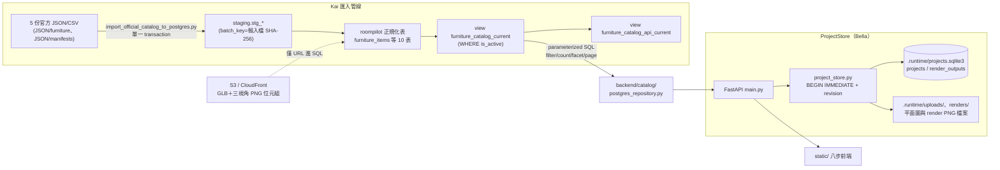
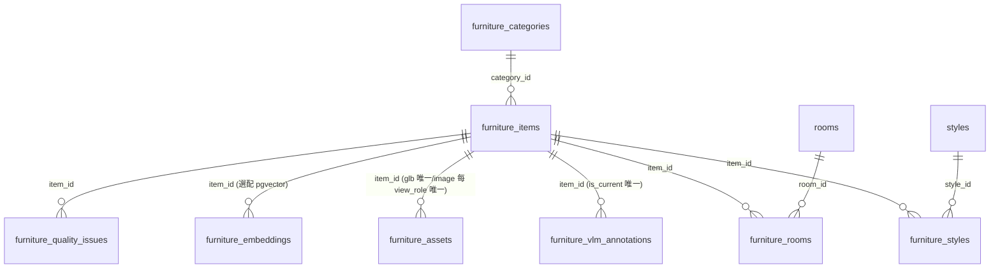
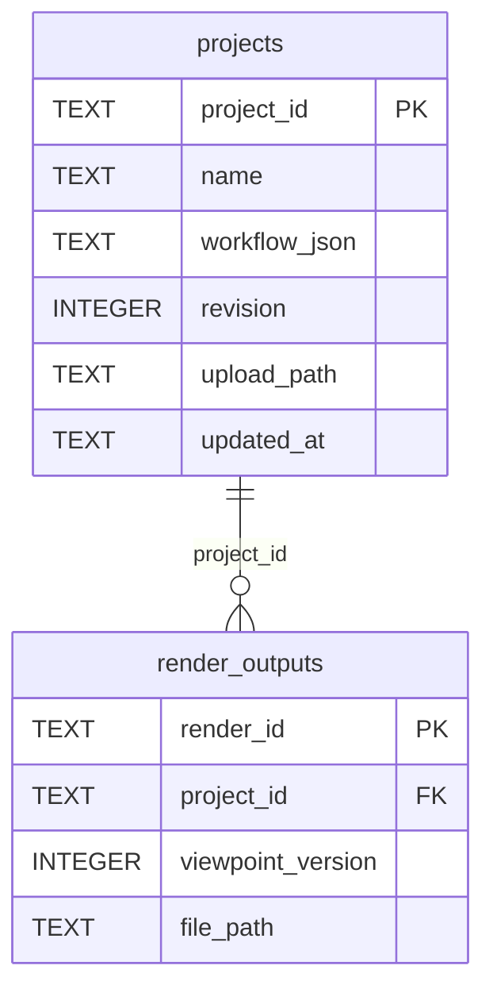

# 資料庫設計 (DB Design) - RoomPilot

> **版本:** 0.1 | **更新:** 2026-08-11 | **狀態:** 草稿
> **Owner:** Kai（PostgreSQL 家具 catalog，POSTGRESQL_CATALOG_READ_PHASE1.md:4）＋ Bella（ProjectStore／FastAPI，POSTGRESQL_PROJECT_STORE_PHASE3.md:4）；AI 衍生，人工核准前為 TO-BE
> **語域:** L3（工程）
> **實例:** 每資料庫一份；本專案兩套持久層（PostgreSQL catalog＋SQLite ProjectStore）合寫一份並明列分工
> **原則:** Schema 是契約。`scripts/sql/roompilot_postgresql_schema.sql` 與 `backend/server/project_store.py` 的 CREATE TABLE 是實作真相，本文件記錄設計意圖與欄位字典。
> **定位宣告:** 本文件回答「RoomPilot 的資料存在哪、表／view 長什麼樣、怎麼查、怎麼設定連線」；不包含 API 契約（見 [api_spec.md](./api_spec.md)）、workflow JSON 內部結構與狀態機（見 [lld.md](./lld.md)）、catalog 優先序決策論述（見 [../03_architecture/adr/ADR-003-catalog-postgres-first-json-fallback.md](../03_architecture/adr/ADR-003-catalog-postgres-first-json-fallback.md)）與快照保存決策（見 [../03_architecture/adr/ADR-007-workflow-json-single-snapshot-store.md](../03_architecture/adr/ADR-007-workflow-json-single-snapshot-store.md)）。
> **生成:** AI 由程式碼與文件衍生｜來源版本 git yen@8863a36c

---

## 目錄

- [1. 儲存架構總覽](#1-儲存架構總覽)
- [2. PostgreSQL 家具 catalog](#2-postgresql-家具-catalog)
- [3. ProjectStore（SQLite）](#3-projectstoresqlite)
- [4. 索引與查詢模式](#4-索引與查詢模式)
- [5. 資料量與保留／遷移政策](#5-資料量與保留遷移政策)
- [6. 連線與設定（環境變數）](#6-連線與設定環境變數)
- [7. 待確認](#7-待確認)
- [8. 追溯](#8-追溯)

## 1. 儲存架構總覽

兩套持久層各管一類資料，互不重疊：

| 持久層 | 引擎 | 管什麼 | 不管什麼 | Owner | 證據 |
| :--- | :--- | :--- | :--- | :--- | :--- |
| 家具 catalog | PostgreSQL（`roompilot`＋`staging` schema） | 8,675 件官方家具 metadata、風格／房間關聯、VLM 標註、S3/CloudFront 資產 URL（REQ-013、FR-013） | GLB／圖片位元組（留在 S3/CloudFront）、專案狀態 | Kai | schema.sql:1-4、POSTGRESQL_CATALOG_READ_PHASE1.md:34 |
| ProjectStore | SQLite 單檔 `projects.sqlite3` | 八步 workflow JSON 快照（≤2MB）、revision 樂觀鎖、上傳與 render metadata（REQ-001、FR-001、NFR-002） | 家具資料；PNG/DXF/JPG 位元組（留在 `.runtime/uploads/`、`.runtime/renders/` 檔案系統） | Bella | project_store.py:11、77-142 |

FastAPI（`backend/server/main.py`）是兩者唯一的 consumer；家具幾何合法性只由 `backend/engine/` 計算，兩套持久層都不存座標裁決結果（NFR-004）。

## 2. PostgreSQL 家具 catalog

Schema 來源：`scripts/sql/roompilot_postgresql_schema.sql`（importer 於同一 transaction 執行，import_official_catalog_to_postgres.py:1341-1344）。`item_id` 是家具、GLB、三視角圖、VLM 標註與 embedding 共用的核心鍵（schema.sql:4）。

### 2.1 表格清單

| 表（roompilot.） | PK | 關鍵欄位／約束 | 說明 | 證據（schema.sql） |
| :--- | :--- | :--- | :--- | :--- |
| `furniture_categories` | `category_id` SERIAL | `category_code`、`name_zh` 各 UNIQUE；自參照 `parent_category_id` | 64 類分類字典 | 30-39 |
| `furniture_items` | `item_id` TEXT | 見 §2.2 欄位字典 | 家具核心主表（8,675 筆） | 42-74 |
| `styles` | `style_id` SERIAL | `style_code` UNIQUE | 6 種正式風格字典 | 77-83 |
| `furniture_styles` | (`item_id`,`style_rank`) | `style_rank IN (1,2)`；`confidence` 0–1；FK CASCADE | 主／次風格（1,039 筆主次相同，故以 rank 為鍵） | 86-96 |
| `rooms` | `room_id` SERIAL | `room_code` UNIQUE | 9 種房間字典 | 99-104 |
| `furniture_rooms` | (`item_id`,`room_id`) | FK CASCADE | 家具可用房間多對多 | 107-112 |
| `furniture_vlm_annotations` | `annotation_id` BIGSERIAL | UNIQUE(`item_id`,`annotation_hash`)；partial UNIQUE：每件家具僅一筆 `is_current` | VLM 分析版本表（object_type_zh、description、rag_text、mood/shape/features/search_keywords 等） | 115-147 |
| `furniture_assets` | `asset_id` BIGSERIAL | `external_id`、`object_key` UNIQUE；CHECK：`glb` 無 `view_role`／`image` 限 front・side・angle-45；partial UNIQUE：每件 1 GLB、每 view_role 1 圖 | S3/CloudFront 資產 metadata（`delivery_url`、`sha256`、`upload_status`、`validation_status`） | 150-202 |
| `furniture_embeddings` | `embedding_id` BIGSERIAL | UNIQUE(`item_id`,`embedding_model`,`text_hash`)；`vector_dims` CHECK | 選配 RAG embedding——僅安裝 pgvector 時以動態 SQL 建立 | 205-238 |
| `furniture_quality_issues` | `issue_id` BIGSERIAL | UNIQUE(`item_id`,`issue_type`,`issue_source`)；`status IN (open,confirmed,fixed,ignored)` | 匯入與人工資料品質問題登記 | 241-261 |
| `furniture_admin_audit` | `event_id` BIGSERIAL | `action IN (create,update,soft_delete)`；不存 Authorization token | Phase 2 管理 API 稽核，與異動同 transaction | 265-276 |
| `staging.stg_furniture_catalog` 等 5 表 | (`batch_key`,`row_number`) | `batch_key` 為五個輸入檔 SHA-256；UNIQUE(batch_key, item_id／image_id) | 每次匯入的原始列，可重跑不混批 | 279-340 |

共用 trigger：`roompilot.set_updated_at()` 於 UPDATE 時刷新 `updated_at`（categories／items／assets／quality_issues，schema.sql:568-600）。

### 2.2 `furniture_items` 欄位字典

| 欄位 | 型態 | 約束 | 業務語意 | 敏感等級 |
| :--- | :--- | :--- | :--- | :--- |
| `item_id` | TEXT | PK | 官方家具唯一 ID，跨 GLB／圖片／VLM／embedding 共用鍵 | 一般 |
| `category_id` | INTEGER | FK categories | 64 類分類 | 一般 |
| `source` / `source_group` / `catalog` / `kind` / `source_type` | VARCHAR | `source` NOT NULL | 來源與品類標記；view 查詢固定 `kind='furniture'` | 一般 |
| `name_en` / `name_zh` | TEXT | `name_en` NOT NULL | 家具名稱 | 一般 |
| `primary_color` / `colors` | TEXT / TEXT[] | `colors` DEFAULT `{}` | 主色與色彩清單（facet 篩選來源） | 一般 |
| `primary_material` / `materials` | TEXT / TEXT[] | 同上 | 主材質與材質清單 | 一般 |
| `width_cm` / `depth_cm` / `height_cm` | NUMERIC(10,2) | CHECK > 0（可 NULL） | 公分制尺寸（NFR-001），引擎擺位輸入 | 一般 |
| `price_twd` | INTEGER | CHECK ≥ 0 | 台幣售價；`price_is_estimated` 標記估價 | 一般 |
| `product_url` | TEXT | | 原廠商品頁 | 一般 |
| `is_active` | BOOLEAN | NOT NULL DEFAULT TRUE | 正式可見性開關；view 以 `WHERE is_active` 排除 599 件 inactive（NFR-005） | 一般 |
| `raw_data` | JSONB | NOT NULL | 匯入原始列（可追溯，Golden Rule 2） | 一般 |
| `created_at` / `updated_at` | TIMESTAMPTZ | NOT NULL DEFAULT NOW() | trigger 維護 `updated_at` | 一般 |

本 schema 無個資欄位；帳密只存 `.env`，不進資料庫（POSTGRESQL_CATALOG_READ_PHASE1.md:107）。

### 2.3 View `roompilot.furniture_catalog_current`（schema.sql:386-471）

API 常用的「目前版」聚合 read model，`WHERE i.is_active` 過濾（471 行）——quarantine 資料（`backend/catalog/data/quarantine/`）根本不匯入，inactive 599 件留在主表供複核但不出現在本 view（NFR-005、backend/catalog/AGENTS.md:8、README.md:282）。

| 欄位群 | 欄位 | 來源與規則 |
| :--- | :--- | :--- |
| 主表直出 | `item_id`、`name_en`、`name_zh`、`source`、`source_group`、`catalog`、`kind`、`source_type`、`primary_color`、`colors`、`primary_material`、`materials`、`width_cm`、`depth_cm`、`height_cm`、`price_twd`、`price_is_estimated`、`product_url` | `furniture_items`（387-407） |
| 分類 | `category_code`、`category_name_zh` | LEFT JOIN `furniture_categories`（431-432） |
| 風格 | `style_codes`、`style_confidences`（皆 ARRAY_AGG ORDER BY style_rank）、`style_confidence`＝`style_confidences[1]` | LATERAL 對 `furniture_styles`×`styles`（433-440、426） |
| 房間 | `room_codes`（ARRAY_AGG ORDER BY room_code） | LATERAL 對 `furniture_rooms`×`rooms`（441-446） |
| VLM 標註 | `object_type_zh`、`description`、`rag_text`、`role`、`visual_weight`、`height_zone`、`size_class`、`pattern`、`mood_tags`、`features`、`search_keywords`、`annotation_confidence`、`style_assignment_source`＝COALESCE(`description_source`,'kai_postgresql_vlm') | LEFT JOIN `furniture_vlm_annotations` 且 `is_current`（447-448、410-428） |
| 資產 URL | `glb_url`、`front_image_url`、`side_image_url`、`angle_45_image_url` | LATERAL 對 `furniture_assets`，僅計入 `upload_status` ∈ {already_exists, complete, completed, skipped_existing, success, uploaded} 且 `validation_status` ∈ {'', ready, success, valid}（449-470） |

### 2.4 View `roompilot.furniture_catalog_api_current`（schema.sql:475-566）

FastAPI 專用穩定 read model＝`furniture_catalog_current` 全欄位＋以下衍生欄位；UI 分類與安全預設集中在 SQL，repository 只查詢（474-475 註解）：

| 衍生欄位 | 規則 |
| :--- | :--- |
| `normalized_type` | `planter`→`flower-pots-planter`，否則 COALESCE(category_code, source_type, 'furniture')（477-481） |
| `taxonomy_group` / `taxonomy_group_zh` | category_code 對映六群（living／dining_kitchen／bedroom／study／storage／soft_decor 及中文名）；無分類時退回 room_codes 推斷，最後 `soft_decor`（482-549） |
| `taxonomy_type_zh`、`category_label` | COALESCE(category_name_zh, category_code, source_type, 'furniture')（550-561） |
| `catalog_scope` | 常數 `'kai_postgresql'`（562） |
| `must_against_wall`＝FALSE、`can_rotate`＝TRUE、`usable_for_moodboard`＝TRUE | 安全預設常數（563-565）；靠牆／旋轉的實際裁決仍在 `backend/engine/`（NFR-004） |

**注意**：runtime repository 目前查的是 `furniture_catalog_current` 而非 `api_current`（postgres_repository.py:18-20，「imported Kai migration currently publishes this compatibility view」），但其 SQL 引用 `normalized_type`／`taxonomy_group` 等只存在於本 repo schema.sql 之 `api_current` 的欄位——live DB 的 view 定義與 schema.sql 是否同步，見 §7 待確認 2。

## 3. ProjectStore（SQLite）

單檔 `projects.sqlite3`，位於共用 runtime 目錄（預設 `<repo 根>/.runtime/`，可用 `ROOMPILOT_RUNTIME_DIR` 覆蓋，runtime_paths.py:20-25）；連線設 `PRAGMA foreign_keys=ON`＋`journal_mode=WAL`（project_store.py:89-94）。FastAPI 啟動時建構並合併舊 worktree 的 legacy runtime（main.py:147-149）。

### 3.1 `projects`（project_store.py:100-114 實讀）

| 欄位 | 型態 | 約束 | 說明 |
| :--- | :--- | :--- | :--- |
| `project_id` | TEXT | PK | `uuid4().hex`（165-166） |
| `name` / `notes` | TEXT | NOT NULL（notes DEFAULT ''） | 專案名稱與備註 |
| `current_step` | TEXT | NOT NULL | 八步進度指標；新專案為 `"project"`（176） |
| `workflow_json` | TEXT | NOT NULL | 八步狀態單一 JSON 快照；深合併更新（`_merge_dict`，18-25）、顯示文字欄位超過 512 字截斷防膨脹（40-74）、序列化後 >2MB 丟 `WorkflowTooLargeError`（11、224-225；NFR-002／ADR-007） |
| `revision` | INTEGER | NOT NULL DEFAULT 0 | 樂觀鎖版本；舊 DB 以 ALTER TABLE 增補（116-123）。`expected_revision`／`expected_updated_at` 不符丟 `ProjectVersionConflict` → API 409 `project_revision_conflict`（209-218；ACPT-014） |
| `upload_filename` / `upload_extension` / `upload_mime` / `upload_path` | TEXT | 可 NULL | 平面圖上傳 metadata；位元組存 `.runtime/uploads/<project_id>/floorplan<ext>`（275-297） |
| `created_at` / `updated_at` | TEXT | NOT NULL | UTC ISO8601 字串（14-15） |

### 3.2 `render_outputs`（project_store.py:124-142 實讀）

| 欄位 | 型態 | 約束 | 說明 |
| :--- | :--- | :--- | :--- |
| `render_id` | TEXT | PK | `uuid4().hex` |
| `project_id` | TEXT | NOT NULL、FK `projects` | 所屬專案 |
| `white_model_version` / `viewpoint_version` / `style_version` | INTEGER | NOT NULL | 第 6/7 步版本戳，保留提案歷史不覆蓋（349 docstring；FR-009） |
| `style_card_id` / `provider` | TEXT | NOT NULL | 色卡 ID 與生圖來源 |
| `mime_type` / `filename` / `file_path` / `byte_size` | TEXT/INTEGER | NOT NULL | PNG 位元組存 `.runtime/renders/<project_id>/`，DB 只存 metadata（350-355）；寫檔後 DB 失敗即刪檔回滾（400-402） |
| `created_at` | TEXT | NOT NULL | UTC ISO8601 |

寫入皆以 `BEGIN IMMEDIATE` 先取寫鎖再比對 revision，使版本檢查與更新原子化（199-243、260-297、357-399）。

## 4. 索引與查詢模式

### 4.1 PostgreSQL 索引（schema.sql:145-202、342-383）

| 索引 | 欄位 | 支撐的查詢 | 依據 |
| :--- | :--- | :--- | :--- |
| `idx_furniture_items_category` / `_source` / `_active` | category_id／source／is_active | view JOIN 與 `is_active` 過濾 | NFR-005 |
| `idx_furniture_items_name_en_trgm` / `_name_zh_trgm` | GIN gin_trgm_ops | 名稱模糊搜尋（pg_trgm，schema.sql:6） | FR-013 |
| `idx_furniture_styles_style`、`idx_furniture_rooms_room` | style_id／room_id | 風格／房間 LATERAL 聚合 | FR-013 |
| `idx_furniture_assets_item`、`_upload_status` | item_id／upload_status | 資產 URL LATERAL＋狀態白名單 | REQ-013 |
| `uq_current_vlm_annotation`（partial） | item_id WHERE is_current | 每家具唯一現行 VLM 標註 | schema.sql:145-147 |
| `uq_furniture_glb`、`uq_furniture_image_role`（partial） | item_id（＋view_role） | 每家具 1 GLB、每視角 1 圖 | schema.sql:196-202 |
| `idx_furniture_quality_open`（partial） | (item_id, severity) WHERE status='open' | 未結案品質問題查詢 | schema.sql:371-373 |
| `idx_furniture_admin_audit_item_created` | (item_id, created_at DESC) | 稽核回查 | schema.sql:374-375 |
| `idx_stg_*_item` ×4 | item_id | staging 對帳 | schema.sql:376-383 |

### 4.2 PostgreSQL 查詢模式（backend/catalog/postgres_repository.py 實讀）

所有查詢固定謂詞 `kind = 'furniture'`（457 行）、parameterized SQL、對 `_VIEW = roompilot.furniture_catalog_current`（20 行）：

| 模式 | SQL 形狀 | 證據 |
| :--- | :--- | :--- |
| 分頁清單（`GET /api/furniture`） | 同一 WHERE 下：`COUNT(*)` → `SELECT * ... ORDER BY item_id LIMIT %s OFFSET %s`（`page_size` 1–80）→ type／group 聚合 → facet 計數 → 前 24 筆 `glb_url` 預載清單 | 590-637 |
| 過濾謂詞 | `style`：`style_codes && ARRAY[...]`（六 UI 風格先映射為來源風格，22-45）；`group`／`type`：對 `taxonomy_group`／`normalized_type` 等值；`q`：CONCAT_WS 多欄位 substring（139-148）；`color`／`material`：中英 alias 正規化後等值；`size`：寬深最長邊 CASE 分 small/medium/large（131-138）；`has_model`：`glb_url` 非空 | 446-485 |
| facet 選項 | `GROUP BY primary_color`／`primary_material` 計數，排除亂碼與「尚未整理」，取前 18 | 501-523 |
| 單筆詳情 | `WHERE kind='furniture' AND item_id = %s`（PK 查詢，不掃 list） | 640-649 |
| 批次取件 | `item_id = ANY(%s::TEXT[])`，避免 N+1 | 652-670 |
| 全量載入（scene／問卷 consumer 相容） | `SELECT * ... ORDER BY item_id`；0 筆丟 `postgres_catalog_empty`；main.py 只在回滿 8,675 筆時採用，否則退回 JSON（NFR-003 相關，見 §7 待確認 3） | 673-683、main.py:910-921 |
| 六風格統計 | `style_map` VALUES CTE＋UNNEST style_codes 後 GROUP BY | 686-745 |
| provider 狀態探測（`/api/catalog/status`） | 筆數＋GLB／三視角完整度 FILTER 計數；失敗回 `available=False`＋例外類型，不洩連線設定 | 748-851；ACPT-012 |

### 4.3 SQLite 查詢模式

無自建索引（僅 PK／FK）；查詢皆以 `project_id` 主鍵定位：單筆 SELECT（project_store.py:180-188）、`BEGIN IMMEDIATE` 讀改寫（199-243）、`list_renders` 以 `ORDER BY created_at DESC, render_id DESC` 列出（405-416）。單機 Pilot 資料量下無效能疑慮。

## 5. 資料量與保留／遷移政策

### 5.1 資料量（現行驗收值）

| 項目 | 數量 | 證據 |
| :--- | :--- | :--- |
| 官方家具主表 | 8,675 筆 | schema.sql:1、cloud_catalog.py:18、POSTGRESQL_CATALOG_READ_PHASE1.md:214 |
| current／api view（active） | 8,076 筆；inactive 599 筆留主表複核（8,076＋599＝8,675） | README.md:282、POSTGRESQL_CATALOG_READ_PHASE1.md:214、NFR-005 |
| 分類／風格／房間字典 | 64 類／6 風格／9 房間 | schema.sql:29、76、98 |
| GLB／三視角圖 | 8,675 個 GLB；26,025 張圖（front/side/angle-45） | POSTGRESQL_CATALOG_READ_PHASE1.md:219-220 |
| 主次風格相同列 | 1,039 筆（故 furniture_styles 以 rank 為鍵） | schema.sql:85 |
| workflow JSON 快照 | 每專案單一快照 ≤2MB | project_store.py:11（NFR-002） |

### 5.2 保留與遷移

| 項目 | 政策 | 證據 |
| :--- | :--- | :--- |
| catalog 匯入 | 交易式：staging＋正規化表＋schema 於同一 transaction；`batch_key`＝五輸入檔 SHA-256，可重跑不混批；`--dry-run` 不連線驗證；`--replace-existing` 整組 DROP 重建（不動 project／runtime tables）；`--skip-schema` 禁與 replace 併用 | import_official_catalog_to_postgres.py:41-70、126、1341-1378；schema.sql:278 |
| catalog 品質問題 | 進 `furniture_quality_issues` 登記複核，不直接刪資料；管理異動走 `furniture_admin_audit`（soft_delete，含前後快照） | schema.sql:240-276 |
| catalog 保留期限 | 無定時清除；inactive 家具留主表複核、不進 API／RAG | README.md:282（NFR-005） |
| SQLite schema 演進 | `CREATE TABLE IF NOT EXISTS`＋additive `ALTER TABLE`（revision 欄位增補），無 migration 工具 | project_store.py:96-123 |
| 舊 worktree 合併 | 啟動時 `import_runtime` 以 `updated_at` 較新者為準 UPSERT 專案與 render，並複製檔案到共用目錄 | project_store.py:433-561、main.py:148-149 |
| 專案／render 保留期限 | 無刪除／歸檔政策（見 §7 待確認 5）；`.runtime`、SQLite、上傳與 render 檔不得提交 Git | POSTGRESQL_PROJECT_STORE_PHASE3.md:53 |
| ProjectStore → PostgreSQL（Phase 3） | **TO-BE**：契約規劃 `roompilot.projects`（workflow_json JSONB）＋一次性 SQLite migration；現況 repo 無 `backend/server/postgres_project_store.py`、無 `scripts/project_store/` migration 腳本，runtime 為純 SQLite（見 §7 待確認 1） | POSTGRESQL_PROJECT_STORE_PHASE3.md:9-31、91-99 |

## 6. 連線與設定（環境變數）

設定讀取順序：程序環境變數優先，其次專案根 `.env`（postgres_repository.py:181-196；不輸出帳密）。

| 變數 | 預設 | 作用 | 證據 |
| :--- | :--- | :--- | :--- |
| `ROOMPILOT_CATALOG_PROVIDER` | `postgres`（strict） | `json`／`local`／`fallback` 視為明確離線 JSON 模式；未設定即 strict PostgreSQL，DB 失敗回 503 不靜默回退（ADR-003、NFR-003） | postgres_repository.py:199-204、POSTGRESQL_CATALOG_READ_PHASE1.md:69-97 |
| `DB_HOST` / `DB_PORT` / `DB_NAME` / `DB_USER` / `DB_PASSWORD` | localhost / 5432 / roompilot_db / postgres /（空） | PostgreSQL 連線；密碼只在 `.env`，不可 commit | postgres_repository.py:211-217 |
| `DB_CONNECT_TIMEOUT` / `DB_SSLMODE` / `DB_APPLICATION_NAME` | 3 / disable / roompilot_catalog_api | 連線逾時、SSL、application_name | postgres_repository.py:218-223 |
| `DB_POOL_MIN` / `DB_POOL_MAX` | 1 / 8 | psycopg2 `ThreadedConnectionPool` 上下限；pool 以設定值為 key 快取、可 `close_catalog_pools()` 收攤 | postgres_repository.py:226-275 |
| `ROOMPILOT_RUNTIME_DIR` | `<repo 根>/.runtime` | ProjectStore SQLite／uploads／renders 的共用 runtime 目錄（worktree 共用） | runtime_paths.py:20-25 |
| `ROOMPILOT_PROJECT_STORE_PROVIDER` | —（**TO-BE**） | Phase 3 契約規劃的 provider 切換；yen@8863a36c 程式碼無讀取點 | POSTGRESQL_PROJECT_STORE_PHASE3.md:60-71 |
| `ROOMPILOT_RUNTIME_CATALOG_PROVIDER` | —（待確認） | README 設定範例出現，backend 無讀取證據 | README.md:296（見 §7 待確認 4） |

## 7. 待確認

1. **ProjectStore 現況 vs Phase 3 契約**：契約稱 `backend/server/postgres_project_store.py` runtime path 存在（POSTGRESQL_PROJECT_STORE_PHASE3.md:9），但 yen@8863a36c 該檔不存在（僅殘留 `__pycache__` .pyc），migration 腳本亦缺；現況為純 SQLite。契約文字已過時，遷移時程與範圍待 owner 於 `requirements_tracker.xlsx` 拍板（登錄簿 §7 已列）。
2. **view 欄位與 repository SQL 的落差**：schema.sql 的 `furniture_catalog_current`（386-471）沒有 `normalized_type`／`taxonomy_group`／`taxonomy_type_zh`／`category_label` 欄位（它們在 `api_current`，475-566），但 repository 對 `furniture_catalog_current` 的 SQL 直接引用這些欄位（postgres_repository.py:128-129、536-538）；程式註解稱 live DB 由「imported Kai migration」發布相容版 view（18-20）。live view 定義與本 repo schema.sql 是否一致，需對 live DB `pg_get_viewdef` 驗證。
3. **8,675 vs 8,076 採用門檻**：全量載入路徑要求回滿 8,675 筆才採用 DB 結果（main.py:918-920、cloud_catalog.py:18），但契約與 README 記 current view 僅提供 8,076 筆 active（POSTGRESQL_CATALOG_READ_PHASE1.md:214）。若 live view 實際回 8,076，該路徑將恆定退回 JSON——與 NFR-003「DB 失敗必須可見」的互動待 live 驗證與 owner 裁決。
4. `ROOMPILOT_RUNTIME_CATALOG_PROVIDER` 出現在 README 設定範例（README.md:296）但 backend 無讀取證據，是文件殘留或待實作，待確認。
5. `.runtime` 專案資料、上傳圖與 render PNG 無保留期限／清理政策；Pilot 內部可接受，正式化前須訂定。
6. `furniture_embeddings`（pgvector）為選配動態建立（schema.sql:205-238）；live DB 是否啟用未在本文件驗證範圍，以 `/api/rag/status` 與 runbook 為準。

## 8. 追溯

| 項目 | ID／來源 |
| :--- | :--- |
| 上游需求 | REQ-001、REQ-013；FR-001、FR-013；NFR-002、NFR-003、NFR-005（[../00-registry.md](../00-registry.md) §2） |
| 上游決策 | [ADR-003](../03_architecture/adr/ADR-003-catalog-postgres-first-json-fallback.md)（catalog PostgreSQL 優先）、[ADR-007](../03_architecture/adr/ADR-007-workflow-json-single-snapshot-store.md)（workflow 單一快照＋樂觀鎖） |
| 上游契約 | `docs/contracts/POSTGRESQL_CATALOG_READ_PHASE1.md`、`docs/contracts/POSTGRESQL_PROJECT_STORE_PHASE3.md` |
| 實作真相 | `scripts/sql/roompilot_postgresql_schema.sql`、`scripts/sql/import_official_catalog_to_postgres.py`、`backend/catalog/postgres_repository.py`、`backend/server/project_store.py`、`backend/server/runtime_paths.py`（git yen@8863a36c） |
| 驗收對齊 | ACPT-012（catalog 失敗可見）、ACPT-014（revision 409）；SCN-006、SCN-009 |
| 下游文件 | [api_spec.md](./api_spec.md) §6 資料模型（欄位命名對齊）、[lld.md](./lld.md)（workflow JSON 內部結構）、[../05_qa/test_plan.md](../05_qa/test_plan.md)、[../06_ops/runbook-catalog-db-unavailable.md](../06_ops/runbook-catalog-db-unavailable.md)、[../06_ops/runbook-workflow-revision-conflict.md](../06_ops/runbook-workflow-revision-conflict.md)、[../06_ops/deployment_and_operations.md](../06_ops/deployment_and_operations.md)（環境變數表） |
