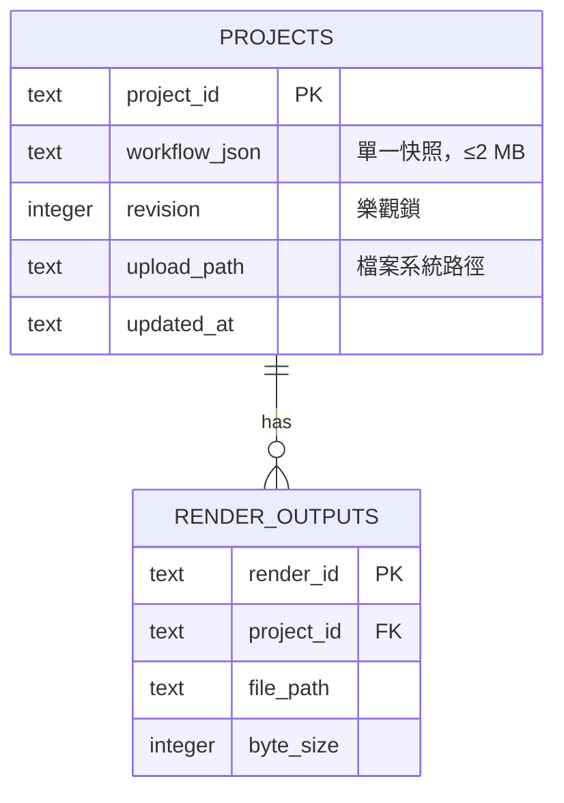
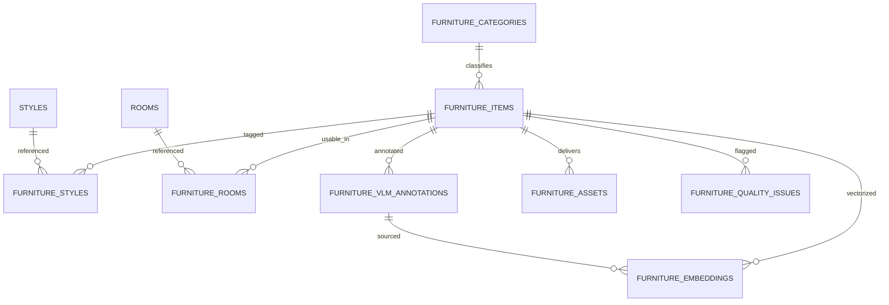

# 資料庫設計 (Database Design) - RoomPilot

> **版本:** v1.0 ｜ **更新:** 2026-08-12 ｜ **狀態:** 草稿（待 owner 核准）
> **Owner:** MOD-SRV-STORE owner（Bella，執行期 SQLite）＋ MOD-SQL owner（Kai，PostgreSQL `roompilot` schema）；保留與備份政策欄位權威為產品 owner（DEC-015）
> **語域:** L3（工程）——直接寫表名、欄位、約束、PRAGMA 與失敗行為
> **實例:** 單例（涵蓋本系統全部三個持久化體，見 §1）
>
> **本文件回答**：資料實際落在哪三個持久化體、每張表與 view 的欄位與約束是什麼、原子性與樂觀鎖如何實作、索引支撐哪些查詢、匯入器用什麼條件拒收資料。
> **本文件不含**：端點請求／回應欄位（去 [`api_spec.md`](./api_spec.md) 與 `openapi-*`）、模組內演算法（去 [`lld.md`](./lld.md)）、儲存選型理由（去 [`ADR-004`](../03_architecture/adr/ADR-004-single-workflow-snapshot-sqlite.md)、[`ADR-005`](../03_architecture/adr/ADR-005-postgres-catalog-source-of-truth.md)、[`ADR-008`](../03_architecture/adr/ADR-008-rag-retrieval-only-offline-models.md)）、維運程序（去 [`deployment_and_operations.md`](../06_ops/deployment_and_operations.md) 與 `runbook-*`）。
> **佐證基準**：分支 `yen`、HEAD `8f378b24`、2026-08-12 工作樹。行號隨程式碼演進，衝突時以原始碼為準。

## 目錄

- [1. 儲存體總覽](#1-儲存體總覽)
- [2. ERD](#2-erd)
- [3. 表格定義](#3-表格定義)
- [4. 資料字典 (Data Dictionary)](#4-資料字典-data-dictionary)
- [5. 索引與效能](#5-索引與效能)
- [6. 資料保留與遷移](#6-資料保留與遷移)
- [7. 假設與待確認](#7-假設與待確認)
- [8. 追溯](#8-追溯)

---

## 1. 儲存體總覽

| 儲存體 | 位置 | Owner | 角色 | DDL 權威 | 佐證 |
| :--- | :--- | :--- | :--- | :--- | :--- |
| 執行期專案庫 | `.runtime/projects.sqlite3` | Bella | 八步工作流唯一快照＋上傳／輸出檔中繼資料，**讀寫** | 程式碼內建表（無 migration 工具） | `project_store.py:96-142`；`main.py:147-149` |
| 問卷影像索引 | `.runtime/indexes/questionnaire_visuals.sqlite3` | Bella | 由版本化 JSON 產生的查詢索引，**可重建** | 程式碼內建表 | `questionnaire_visuals.py:153-178`；`main.py:207-211` |
| 家具型錄與向量庫 | PostgreSQL `roompilot` schema（＋`staging`） | Kai | 正式型錄與 pgvector 檢索來源，Web 端**唯讀**、寫入只由匯入器負責 | `scripts/sql/roompilot_postgresql_schema.sql`、`scripts/sql/roompilot_furniture_embeddings_schema.sql` | `postgres_repository.py:20,673-683`；`rag_repository.py:131-164` |

執行資料根目錄由 `ROOMPILOT_RUNTIME_DIR` 覆寫，否則為 repo 根的 `.runtime/`（`runtime_paths.py:20-25`）。二進位內容（平面圖、PNG、PDF）一律落檔案系統，資料庫只存路徑與中繼資料（`project_store.py:275-278,349-356`；`main.py:2291`）。**本 repo 無 migration 框架、無 seed 腳本、無備份腳本**，SQLite schema 演進只有一處線上補欄（`project_store.py:116-123`）。

## 2. ERD

> `roompilot.furniture_catalog_current` 與 `..._api_current` 是上圖的聚合 view，不是表；`staging.stg_*` 五張批次表不進 ERD（只供匯入追溯，`roompilot_postgresql_schema.sql:279-340`）。

## 3. 表格定義

### 3.1 `.runtime/projects.sqlite3`（Bella；FR-001–009、NFR-001、NFR-003–005）

**`projects`**（`project_store.py:98-115`）

| 欄位 | 型態 | 約束 | 說明 |
| :--- | :--- | :--- | :--- |
| `project_id` | TEXT | PK | `uuid4().hex`（`:166`） |
| `name` / `notes` | TEXT | NOT NULL；`notes` DEFAULT `''` | 空名稱由 API 層擋（FR-001） |
| `current_step` | TEXT | NOT NULL | 值域為 `WORKFLOW_STEPS` 11 個內部步（`main.py:164-176`），對外折疊為 8 步（FR-020） |
| `workflow_json` | TEXT | NOT NULL | **單一快照**：`layout_json`／問卷／`scene_json`／視角／`render_context` 全在此欄，無版本歷史表、無事件流 |
| `revision` | INTEGER | NOT NULL DEFAULT 0 | 每次成功寫入 +1；既有庫以 `ALTER TABLE` 補欄（`:116-123`） |
| `upload_filename` / `upload_extension` / `upload_mime` / `upload_path` | TEXT | 可空 | 原始平面圖中繼資料；實體檔在 `uploads/<project_id>/floorplan<ext>`（`:275-278`） |
| `created_at` / `updated_at` | TEXT | NOT NULL | UTC ISO-8601 字串（`:14-15`），非原生時間型別 |

**`render_outputs`**（`project_store.py:124-142`）：`render_id` PK、`project_id` FK→`projects`、`white_model_version`／`viewpoint_version`／`style_version` INTEGER、`style_card_id`、`provider`（API 層限 `browser_capture`）、`mime_type`（固定寫入 `image/png`，`:385`）、`filename`、`file_path`、`byte_size`、`created_at`，全部 NOT NULL。

**連線與交易語意**

| 項目 | 實作 | 佐證 |
| :--- | :--- | :--- |
| 連線 PRAGMA | `timeout=10`、`foreign_keys=ON`、`journal_mode=WAL` | `project_store.py:89-94` |
| 寫入原子性 | 每次寫入先 `BEGIN IMMEDIATE` 取寫鎖，再讀版本；`UPDATE … WHERE project_id=? AND revision=?` 二次防護 | `:199-243,261,359` |
| 樂觀鎖 | `expected_revision` 或 `expected_updated_at` 任一不符即 `ProjectVersionConflict` | `:209-218,28-33` |
| 寫入合併 | 遞迴深合併（dict 對 dict 才遞迴，其餘直接覆蓋） | `:18-25,220-222` |
| 容量閘 | `json.dumps(ensure_ascii=False)` 後 UTF-8 位元組 >2 MB 即拋 `WorkflowTooLargeError`，交易內拋出、整筆不落地 | `:11,223-225` |
| 顯示字串防爆 | `name/name_en/name_zh/name_zh_raw/label/title` >512 字元時以 `normalized_type`→`furniture_id`→`id`→`未命名項目` 取代 | `:40-74` |
| 檔案回滾 | `save_render` 交易失敗時 `unlink(missing_ok=True)` 刪已寫入 PNG | `:400-402` |

**`import_runtime()` 合流語意**（`project_store.py:433-561`；啟動時對每個 legacy worktree 各跑一次，`main.py:147-149`）：來源與目的同檔或非 SQLite 檔即回 0（`:436-447`）；逐列以 `updated_at` 字串比較決勝，`current["updated_at"] >= row["updated_at"]` 就跳過（`:466`）；上傳檔以 `shutil.copy2` 複製到本庫路徑，來源檔已遺失則**保留目的端現值而非寫入死路徑**（`:474-484`）；專案列用 `ON CONFLICT(project_id) DO UPDATE` 全欄覆蓋（含 `revision`、`created_at`，`:486-520`）；render 列僅在專案存在且來源檔存在時 `INSERT OR IGNORE`（`:523-560`）。

> **殘留表**：現場資料庫另有 `users`(1 列)、`refresh_tokens`(1 列)、`project_members`(386 列) 三張表與 `idx_project_members_user`／`idx_refresh_tokens_user` 兩個索引（2026-08-12 唯讀查詢）。本分支 `ProjectStore._initialize` 不建立也不讀取它們，`backend/server/auth/` 只剩 `__pycache__` 無 `.py` 原始碼；`.runtime/engineering/`（208 KB）同樣無本分支程式碼引用。屬他分支寫入本共用執行資料的殘留，處置待確認（見 §7）。

### 3.2 `.runtime/indexes/questionnaire_visuals.sqlite3`（FR-026）

| 表 | 欄位 | 說明 |
| :--- | :--- | :--- |
| `questionnaire_questions` | `question_id` PK、`space_type`、`sequence`、`ready`（INTEGER 0/1）、`payload_json` | `ready` 為該題所有選項 `generation_status == "ready"` 的合取（`questionnaire_visuals.py:185-188`） |
| `questionnaire_images` | `image_id` PK、`question_id` FK、`option_id`、`generation_status`、`image_path`、`payload_json` | 供 `GET /api/questionnaire/visual-images/{id}` 反查實體圖 |

連線只設 `foreign_keys=ON`，**不設 WAL**（`:147-151`）。`sync()` 每次先 `DELETE` 兩張表再全量重灌（`:180-183`），權威來源是版本化 JSON；此庫可刪除重建。首次被問卷端點使用時才建（`main.py:200-214`）。

### 3.3 PostgreSQL `roompilot`（Kai；FR-039–045、NFR-006–008）

| 表 | 主鍵／唯一鍵 | 關鍵欄位與約束 | 佐證 |
| :--- | :--- | :--- | :--- |
| `furniture_categories` | `category_id`；UK `category_code`、`name_zh` | 自參照 `parent_category_id` | `roompilot_postgresql_schema.sql:30-39` |
| `furniture_items` | `item_id` TEXT | `raw_data` JSONB NOT NULL（含 `chroma_metadata`、`embedded_text`、`text_hash`）；`width_cm`／`depth_cm`／`height_cm` NUMERIC(10,2) CHECK >0；`price_twd` CHECK ≥0；`colors`／`materials` TEXT[]；`is_active` | `:42-74` |
| `styles` / `rooms` | `style_id` / `room_id`；UK code | 字典表 | `:77-83,99-104` |
| `furniture_styles` | PK (`item_id`,`style_rank`) | CHECK `style_rank IN (1,2)`、`confidence` ∈ [0,1]；以 rank 為鍵是為保留主／次風格相同的原始列 | `:86-96` |
| `furniture_rooms` | PK (`item_id`,`room_id`) | 多對多 | `:107-112` |
| `furniture_vlm_annotations` | `annotation_id`；UK (`item_id`,`annotation_hash`) | 部分唯一索引保證每件僅一筆 `is_current`；`mood_tags`／`shape_tags`／`features`／`search_keywords`／`rag_text` 皆 TEXT[] | `:115-147` |
| `furniture_assets` | `asset_id`；UK `external_id`、`object_key` | CHECK：`glb` 不得帶 `view_role`，`image` 的 `view_role ∈ {front, side, angle-45}`；部分唯一索引鎖「每件恰一個 GLB」與「每件每角色恰一張圖」 | `:150-202` |
| `furniture_embeddings` | `embedding_id`；UK (`item_id`,`embedding_model`,`text_hash`) | 僅在 pgvector 可用時以動態 SQL 建立；`embedding VECTOR`（開發階段**不固定維度**）；CHECK `vector_dims(embedding) = embedding_dimension`、`embedding_dimension > 0`、`text_hash ~ '^[0-9a-f]{64}$'` | `:205-238`；`roompilot_furniture_embeddings_schema.sql:7-45` |
| `furniture_quality_issues` | `issue_id`；UK (`item_id`,`issue_type`,`issue_source`) | `severity ∈ {low,medium,high}`、`status ∈ {open,confirmed,fixed,ignored}` | `:241-261` |
| `furniture_admin_audit` | `event_id` | `action ∈ {create,update,soft_delete}`；保留前後快照，**不存 Authorization token** | `:263-276` |
| `staging.stg_*`（5 張） | PK (`batch_key`,`row_number`) | `batch_key` 為五份輸入檔 SHA-256 串接後再取 SHA-256，可重跑不混批 | `:279-340`；`import_official_catalog_to_postgres.py:465-466` |

`updated_at` 由 `roompilot.set_updated_at()` trigger 維護（4 張表，`:568-600`）；`pg_trgm` 必裝、`vector` 為選用（缺席時跳過向量表並保留其餘 schema，`:6-24`）。

### 3.4 消費端 view 與檢索函式

| 物件 | 定義要點 | 消費者 | 佐證 |
| :--- | :--- | :--- | :--- |
| `roompilot.furniture_catalog_current` | `WHERE i.is_active`；風格／房間以 LATERAL `ARRAY_AGG`；資產 URL 從 `furniture_assets` 聚合且只採 `upload_status ∈ {already_exists, complete, completed, skipped_existing, success, uploaded}` 且 `validation_status ∈ {'', ready, success, valid}` 的列 | 第 6 步型錄全部查詢（分頁／facet／單件／狀態） | `roompilot_postgresql_schema.sql:386-471`；`postgres_repository.py:20,590-626` |
| `roompilot.furniture_catalog_api_current` | 在上者之上補 `normalized_type`、`taxonomy_group(_zh)`、`category_label`、`catalog_scope='kai_postgresql'`、`must_against_wall=FALSE`、`can_rotate=TRUE` | 契約驗證與外部查驗；**本分支 runtime 仍固定走 `furniture_catalog_current`** | `:475-566`；`postgres_repository.py:18-20` |
| `roompilot.furniture_embedding_source_current` | 投影 `raw_data->>'embedded_text'`／`text_hash`／`chroma_metadata`＋當前 `annotation_id`；篩 `kind='furniture' AND is_active AND embedded_text<>'' AND text_hash ~ 64 hex` | 向量匯入驗證與檢索 JOIN | `roompilot_furniture_embeddings_schema.sql:52-82` |
| `roompilot.search_furniture_embeddings(...)` | 精確 cosine（`<=>`），以 `(embedding_model, vector_dims)` 為域；`LIMIT LEAST(GREATEST(match_count,1),100)` | 匯入器契約 probe | `:86-116`；`import_furniture_embeddings_to_postgres.py:313-319` |
| `roompilot.search_furniture_embeddings_filtered(...)` | SQL **硬篩** room／category／price／`max_width_cm`／`max_height_cm`／role／size_class（全部讀 `chroma_metadata`），排序仍為 cosine；風格與 mood **刻意留在 Python 做軟排序** | 第 5 步檢索（FR-047） | `:118-196`；`rag_repository.py:131-164` |

檢索模型固定 `BAAI/bge-m3`（`rag_repository.py:12`）。狀態探測回 `current_embeddings`、`embedding_dimension`、`search_function_available`（`rag_repository.py:53-89`），對應具名 blocker `furniture_embeddings_empty`／`filtered_search_function_missing`／`postgresql_unavailable`（`spatial_data/rag/service.py:94,96,106`）。

## 4. 資料字典 (Data Dictionary)

| 欄位／集合 | 業務語意 | 來源 | 敏感等級 |
| :--- | :--- | :--- | :--- |
| `projects.workflow_json` | 使用者走到第幾步、每步填了什麼；恢復進度的唯一依據 | FR-003、FR-022 | **中：可能含業主自填名稱、需求描述、聯絡資訊**；輸出時於兩處脫敏（`main.py:2475-2491`；`render_service.py:52-61`，NFR-020） |
| `projects.revision` | 「別人改過了」的判定基準 | FR-004、NFR-003 | 一般 |
| `projects.upload_path` | 原始平面圖落點 | FR-005 | 中：住宅平面可識別具體物件 |
| `render_outputs.file_path` / `byte_size` | 瀏覽器輸出 PNG 的存證 | FR-009、NFR-002 | 低 |
| `workflow_json.render_context.appliance_requirements` | 家電需求；**只供第 8 步生圖，不進 2D/3D 擺設** | FR-028、[`ADR-006`](../03_architecture/adr/ADR-006-appliances-render-context-only.md) | 低 |
| `furniture_items.width_cm/depth_cm/height_cm` | 家具實體尺寸，引擎碰撞與淨空的輸入 | FR-034、NFR-017（公分契約） | 低 |
| `furniture_assets.delivery_url` | GLB／三視角圖的 CloudFront 交付位址 | FR-042 | 低 |
| `furniture_embeddings.embedding` | 檢索候選排序訊號；**不決定放哪、不新增候選** | FR-047、FR-049、[`ADR-008`](../03_architecture/adr/ADR-008-rag-retrieval-only-offline-models.md) | 低 |
| `furniture_admin_audit.before_data/after_data` | 型錄異動稽核；同交易寫入 | FR-043 | 低（規約禁存 token，`roompilot_postgresql_schema.sql:263-264`） |
| 隔離區集合（不在資料庫內） | `unmatched_cloud_furniture`(1,514)、`sf3d_legacy`(1,509) 以 JSON 保存於 `backend/catalog/data/quarantine/`，**永不進任何家具 API 或場景** | FR-045、DEC-007 | 低（`tests/test_cloud_quarantine.py:22-41`） |

**現場實測（2026-08-12 唯讀查詢／`du`）**：`projects` 741 列、`render_outputs` 0 列；`workflow_json` 最大 1,316,192 bytes（佔 2 MB 上限 63%）、平均 91,046 bytes、最大 `revision` 458；`.runtime` 目錄 `uploads/` 115 MB、`manuals/` 45 MB、`projects.sqlite3` 67 MB、`indexes/` 232 KB、`renders/` 與 `agent_pipeline/` 為空。

## 5. 索引與效能

| 索引／機制 | 欄位 | 支撐的查詢 | 依據 |
| :--- | :--- | :--- | :--- |
| `sqlite_autoindex_projects_1` | `projects.project_id` | 逐案讀寫（全部走 PK） | NFR-004 |
| **（缺）** `render_outputs.project_id` | — | `list_renders` 以 `WHERE project_id=? ORDER BY created_at DESC, render_id DESC` 全表掃描；現況 0 列故無影響 | `project_store.py:405-416`；2026-08-12 實測僅兩個 autoindex |
| `idx_furniture_items_{category,source,active}` | 對應單欄 | 型錄 facet 與硬篩 | `roompilot_postgresql_schema.sql:342-347` |
| `idx_furniture_items_name_{en,zh}_trgm` | GIN + `gin_trgm_ops` | `q=` 關鍵字模糊查詢 | `:348-351` |
| `idx_furniture_{styles_style, rooms_room, assets_item, assets_upload_status}` | 對應單欄 | view 的 LATERAL 聚合與資產健康統計 | `:352-359` |
| `uq_current_vlm_annotation`／`uq_furniture_glb`／`uq_furniture_image_role` | 部分唯一索引 | 保證「一件一 current 標註／一 GLB／每角色一圖」 | `:145-147,196-202` |
| `idx_furniture_embeddings_item_model` | (`item_id`,`embedding_model`) | 向量 UPSERT 與 JOIN；**HNSW 刻意未建**，匯入器偵測到 HNSW 直接拒收 | `roompilot_furniture_embeddings_schema.sql:47-48,84-85`；`import_furniture_embeddings_to_postgres.py:309-311` |
| 連線池 | `DB_POOL_MIN=1`／`DB_POOL_MAX=8`／`DB_CONNECT_TIMEOUT=3` 秒；`autocommit=True`；缺驅動拋 `postgres_driver_unavailable` | 全部型錄與檢索查詢共用同一池 | `postgres_repository.py:211-260`；NFR-007 |
| 分頁上界 | `page ≥ 1`、`page_size` 1–80；`SELECT * … ORDER BY item_id LIMIT/OFFSET`，另取 `glb_url` 前 24 筆預熱 | `GET /api/furniture` | `postgres_repository.py:590-626`；NFR-006 |
| 檢索上界 | 硬篩後 `LIMIT LEAST(GREATEST(match_count,1),100)`，預設 top-50 | 第 5 步檢索 | `roompilot_furniture_embeddings_schema.sql:194-196` |

> SQLite 端唯一的併發保護是 WAL＋`BEGIN IMMEDIATE`；無讀寫分離、無連線池、無查詢層快取。型錄端無 process 級快取的只有 `catalog_summary`（`postgres_repository.py:686-688`），家具 payload 走 `lru_cache`（`main.py:909-926`）。

## 6. 資料保留與遷移

| 項目 | 現況（可由程式碼驗證） | 政策 |
| :--- | :--- | :--- |
| 保留期限 | 無 TTL、無輪替、無配額；無專案刪除 API（`rg "unlink\|rmtree\|DELETE FROM" backend/server/*.py` 僅命中失敗回滾與問卷索引重灌） | **待 DEC-015 核准**（NFR-022、OPEN-06 以外另計，見 §7） |
| 備份 | repo 內無備份腳本、無排程；`.runtime/` 不得進 Git | **待 DEC-015 核准** |
| 結案刪除／交還 | 無實作 | **待 DEC-015 核准** |
| Migration 策略 | **本 repo 無 migration 框架**。SQLite 僅一處 `ALTER TABLE ADD COLUMN revision`（`project_store.py:116-123`）；PostgreSQL 靠 `CREATE … IF NOT EXISTS` ＋ `CREATE OR REPLACE VIEW/FUNCTION` 冪等重跑，view 刻意把新欄位排在最後以免 `CREATE OR REPLACE` 失敗（`roompilot_furniture_embeddings_schema.sql:62-64`） | 待確認：是否引入 migration 工具（無既有 OPEN） |
| 跨 worktree 合流 | `import_runtime()` 以 `updated_at` 決勝合併 legacy `.runtime`，**只增不刪、來源檔遺失時保留現值** | FR-008 |
| 型錄重建（種子） | 匯入器交易式重建：先驗證再寫，`staging` 依 `batch_key` 清舊列（`import_official_catalog_to_postgres.py:938`）、子表依 `item_id` 重寫（`:1050,1062`） | FR-043 |
| 型錄匯入拒收條件 | 總數須為 8,675（`:28,320-324`）；四份 CSV 與 catalog 的 `item_id` 集合須一致（`:383-411`）；每件恰 3 張角色圖 `front/side/angle-45`（`:29,440-453`）；`upload_status` 全 `uploaded`、`validation_status` 全 `ready`（`:455-463`） | FR-043、ACPT-039 |
| 向量匯入拒收條件 | `item_id` 須屬 8,076 筆 active／RAG-indexable（`import_furniture_embeddings_to_postgres.py:35,129,190-195`）；`embedded_text`／`text_hash` 須與官方 JSON 一致且 SHA-256 自洽（`:197-203`）；宣告維度須等於實際長度（`:215-224`）；目標模型向量 L2 norm ∈ [0.98, 1.02]（`:225-228`）；DB 端須有三個 constraint、須有 item/model 索引、**不得有 HNSW**、契約 probe 須回 0 列（`:282-325`）；UPSERT 後回查鍵集合確認（`:379-399`） | FR-044、ACPT-039 |
| 一鍵重建 | `pgvector/pgvector:pg17`＋空 volume 首次自動還原 dump；`pg_isready` healthcheck | FR-066；`docker_postgresql/docker-compose.yml:8-27` |

## 7. 假設與待確認

| 編號 | 待確認內容 | 目前可驗證的事實 | 承接處 |
| :--- | :--- | :--- | :--- |
| DEC-015 | 執行資料的保留期限、備份頻率、結案刪除與交還政策；`.runtime` 現以 227 MB 持續成長且無任何清理路徑 | 2026-08-12 `du` 實測；程式碼無刪除／輪替／備份實作 | [`deployment_and_operations.md`](../06_ops/deployment_and_operations.md)、[`runbook-runtime-storage-growth.md`](../06_ops/runbook-runtime-storage-growth.md)（RB-009） |
| OPEN-06 | 型錄筆數閘門不一致：`main.py:919` 要求 `len(items) == 8,675`（`cloud_catalog.py:18`）才採用 PostgreSQL 結果，但 `load_catalog` 查的 `furniture_catalog_current` 已 `WHERE is_active`，契約記為 8,076 筆 active／599 inactive（`POSTGRESQL_FURNITURE_EMBEDDINGS.md:9`）。條件不成立時 `_furniture_payload_for_provider` 靜默落回 JSON 合併型錄（`main.py:917-921`），與 DEC-007「DB 優先、失敗要可見」相衝 | `postgres_repository.py:673-683`；`main.py:917-921`；`docker_postgresql/DOCKER_ONECLICK.md:25` 的驗收查詢期望值即為 8,076 | [`ADR-005`](../03_architecture/adr/ADR-005-postgres-catalog-source-of-truth.md)、[`runbook-catalog-db-unavailable.md`](../06_ops/runbook-catalog-db-unavailable.md)（RB-001） |
| OPEN-43 | 向量筆數在契約間有 8,076 與 7,958 兩個數字；本 repo 的匯入器與 view 註解一致採 8,076，**未實測 live DB**（本機 PostgreSQL 未啟動） | `import_furniture_embeddings_to_postgres.py:35`；`roompilot_furniture_embeddings_schema.sql:81-82` | [`ADR-008`](../03_architecture/adr/ADR-008-rag-retrieval-only-offline-models.md)、[`test_plan.md`](../05_qa/test_plan.md) |
| 待確認（無既有 OPEN） | 現場 `projects.sqlite3` 含本分支未定義的 `users`／`refresh_tokens`／`project_members` 三表（386 列成員關係）與 `.runtime/engineering/`；是要在本分支恢復認證功能、清除殘留，還是視為他分支共用同一執行資料的既定現象 | 2026-08-12 唯讀查詢；`backend/server/auth/` 僅存 `__pycache__` | [`sad.md`](../03_architecture/sad.md)、[`deployment_and_operations.md`](../06_ops/deployment_and_operations.md) |
| 待確認（無既有 OPEN） | `POSTGRESQL_PROJECT_STORE_PHASE3.md:9` 宣稱 `backend/server/postgres_project_store.py` 與 `roompilot.projects`／`render_outputs` 的 runtime path「仍存在」，**本分支查無此檔**；專案保存是否仍以 PostgreSQL 為目標 | `rg postgres_project_store backend/` 僅命中 `.pyc`；`main.py:147` 直接建立 SQLite `ProjectStore` | [`ADR-004`](../03_architecture/adr/ADR-004-single-workflow-snapshot-sqlite.md) |
| 待確認（無既有 OPEN） | Docker 還原路徑不一致：compose 掛載 `./scripts/sql/roompilot_db_dump.sql.gz`，但 compose 檔位於 `docker_postgresql/`，該相對路徑下無此檔；實際 dump 在 `docker_postgresql/roompilot_db_dump.sql.gz` | `docker_postgresql/docker-compose.yml:19`；`ls` 實測 `scripts/sql/` 無 `.gz` | [`deployment_and_operations.md`](../06_ops/deployment_and_operations.md) |
| 待確認（無既有 OPEN） | SQLite `created_at`／`updated_at` 為 ISO 字串而非時間型別，`import_runtime` 的決勝與 `list_renders` 的排序都依賴字串比較；跨時區或非 UTC 來源列的正確性未經測試 | `project_store.py:14-15,412,466` | [`test_plan.md`](../05_qa/test_plan.md) |

## 8. 追溯

| 項目 | ID／文件 |
| :--- | :--- |
| 上游需求 | FR-003、FR-004、FR-005、FR-008、FR-009、FR-026、FR-039、FR-041、FR-043、FR-044、FR-045、FR-047、FR-066；NFR-001、NFR-003–008、NFR-022；DEC-002、DEC-007、DEC-015、DEC-016（見 [`srs.md`](../01_requirements/srs.md) §2–§4） |
| 設計決策 | ADR-004（單一 workflow 快照）、ADR-005（PostgreSQL 為型錄真相）、ADR-006（家電只入 `render_context`）、ADR-007（公分契約）、ADR-008（檢索唯讀、離線模型）；架構定位見 [`sad.md`](../03_architecture/sad.md) 的 MOD-SRV-STORE、MOD-CAT、MOD-SQL、MOD-RAG |
| 同層對齊 | 欄位命名與端點 payload 對齊 [`api_spec.md`](./api_spec.md)、[`openapi-project-workflow-v1.yaml`](./openapi-project-workflow-v1.yaml)、[`openapi-agent-rag-v1.yaml`](./openapi-agent-rag-v1.yaml)；模組內部流程見 [`lld.md`](./lld.md) |
| 下游驗證 | ACPT-002、ACPT-003、ACPT-007、ACPT-008、ACPT-036、ACPT-037、ACPT-039、ACPT-040、ACPT-042、ACPT-058 → [`test_plan.md`](../05_qa/test_plan.md) 的 TC-002、TC-003、TC-007、TC-008、TC-036、TC-037、TC-039、TC-040、TC-042、TC-058 |
| 失效模式 | RB-001（型錄 DB 不可用）、RB-003（存檔衝突或超限）、RB-004（檢索模型快取缺）、RB-009（執行資料成長）→ [`06_ops/`](../06_ops/deployment_and_operations.md) |
| 決策權威 | 保留、備份與刪除政策（DEC-015）由產品 owner 於 [`requirements_tracker.xlsx`](../01_requirements/requirements_tracker.xlsx) ①需求決策拍板；本文件所有政策欄在核准前一律為「待確認」 |
