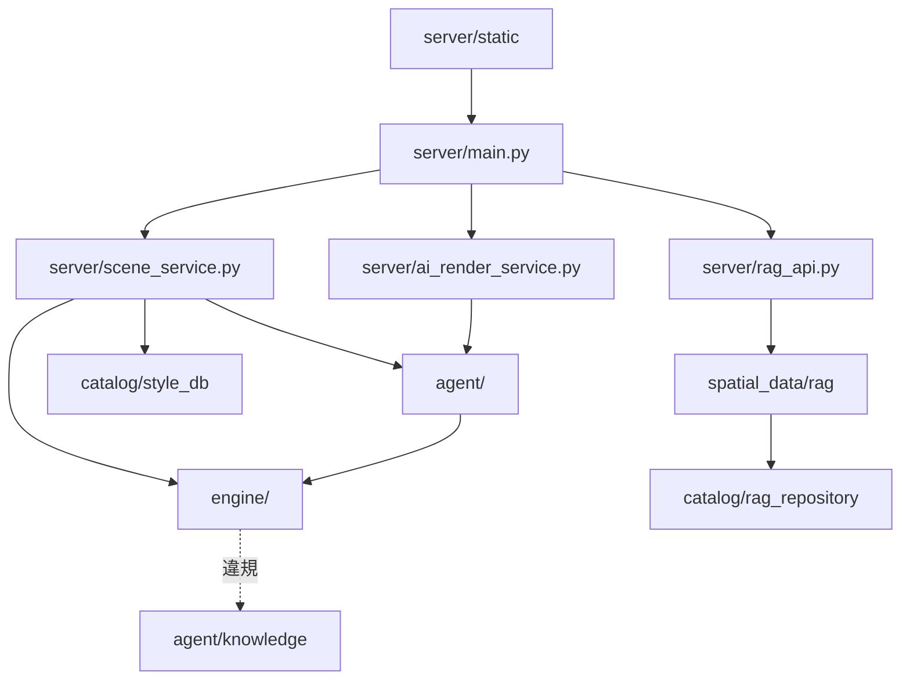
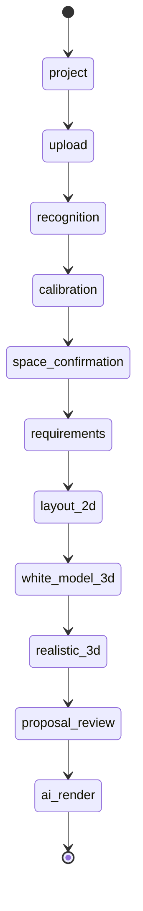

# 低階設計與程式碼地圖 (LLD / Code Map) - RoomPilot

> **版本:** v1.0 ｜ **更新:** 2026-08-12 ｜ **狀態:** 草稿（待 owner 核准）
> **Owner:** 架構師維護 §6 狀態機（人工核准的設計契約）；§2–§5 為 AS-BUILT 生成物，由各 MOD owner（[`AGENTS.md`](../../AGENTS.md) §目錄責任與資料邊界）覆核
> **語域:** L3（工程）——直接寫模組路徑、函式名、常數與失敗行為
> **實例:** 單例（整個 RoomPilot 一份；量大時才拆 `lld-<模組>.md`，目前未拆）
>
> **本文件回答**：codebase 長什麼樣、誰依賴誰，以及七條「看不懂就無法安全改動」的演算法各自吃什麼輸入、在哪裡分岔、吐什麼輸出、壞掉會怎樣。
> **本文件不含**：架構取捨理由（去 [`sad.md`](../03_architecture/sad.md) 與 `adr/`）、端點欄位級契約（去 [`api_spec.md`](./api_spec.md) 與 `openapi-*`）、資料表與 view 定義（去 [`db_design.md`](./db_design.md)）、DOM 與互動規格（去 [`ui_spec-step1-project.md`](../02_ux_ui/ui_spec-step1-project.md)–[`ui_spec-step8-ai-render.md`](../02_ux_ui/ui_spec-step8-ai-render.md)）、需求與驗收（去 [`srs.md`](../01_requirements/srs.md) 與 [`prd.md`](../01_requirements/prd.md)）。
> **佐證基準**：分支 `yen`、HEAD `8f378b24`、2026-08-12 工作樹。行號隨程式碼演進，衝突時以原始碼為準。

## 目錄

- [1. 生成資訊](#1-生成資訊)
- [2. 模組結構](#2-模組結構)
- [3. 模組依賴圖](#3-模組依賴圖)
- [4. 關鍵資料結構](#4-關鍵資料結構)
- [5. 關鍵演算法](#5-關鍵演算法)
- [6. 狀態機（設計契約）](#6-狀態機設計契約)
- [7. 假設與待確認](#7-假設與待確認)
- [8. 追溯](#8-追溯)

## 1. 生成資訊

§2–§5 描述**程式碼現況（AS-BUILT）**，過期即重掃；不得手工改寫後宣稱是現況。

| 項目 | 值 |
| :--- | :--- |
| 生成時間 | 2026-08-12 |
| 對應 commit | `8f378b24`（分支 `yen`） |
| 生成方式 | 人工逐檔閱讀原始碼，每條主張附 `file:line`；未執行靜態依賴工具（repo 內無 `madge`／`pydeps` 設定） |
| 涵蓋範圍 | `backend/` 全部 Python 模組；前端只涵蓋狀態機（`static/scene_workflow.js`），其餘見 `ui_spec-step*.md`。不涵蓋 `frontend3d/`（次要原型）、`scripts/`、`testdata/` |

## 2. 模組結構

```text
backend/
├── server/        # FastAPI 路由、專案保存、場景組裝、生圖與交付（main.py 4,199 行）
│   └── static/    # 正式單頁前端（scene_v2.js 19,583 行）
├── floorplan/     # 影像／DXF 辨識，輸出止於 layout_json
├── engine/        # 幾何合法性唯一權威：柵格、OBB、淨空、靠牆錨定
├── agent/         # 需求結構化、選件潛規則、擺位修復、生圖提示詞
├── catalog/       # PostgreSQL 型錄與向量檢索的資料存取
├── spatial_data/  # 檢索計畫、排序與服務層
└── upgrade3d/     # 已確認 layout → 3D 可用結構
```

| 模組 | 職責（單一） | MOD（owner） |
| :--- | :--- | :--- |
| `server/main.py`、`project_store.py` | HTTP 路由、`workflow_json` 單一快照保存 | MOD-SRV-API／MOD-SRV-STORE（Bella） |
| `server/scene_service.py` | 問卷＋`layout_json` → `scene_json`；逐房擺位編排 | MOD-SRV-SCENE（Bella） |
| `server/ai_render_service.py`、`design_manual_service.py`、`cost_estimation.py` | 色卡／逐房生圖／PDF／概算 | MOD-SRV-RENDER（Bella） |
| `server/static/` | 八步單頁前端與 Three.js viewer | MOD-WEB（Bella） |
| `floorplan/vision/`、`cody_adapter.py`、`floorplan2*.py` | 影像辨識管線與房型語意 | MOD-FP（Cody） |
| `engine/` | 碰撞、淨空、靠牆錨定、移動旋轉合法性 | MOD-ENG（Ancai） |
| `agent/` | 選件潛規則、擺位修復、提示詞組裝、並存管線 | MOD-AGT（Yen） |
| `catalog/` | 型錄 view、pgvector 檢索、隔離區隔離 | MOD-CAT／MOD-SQL（Kai） |
| `spatial_data/rag/` | 檢索計畫、rerank 與加權排序 | MOD-RAG（Django） |
| `upgrade3d/` | layout → 3D 結構轉換 | MOD-U3D（Cody） |

## 3. 模組依賴圖

箭頭語意＝import。分層規則寫在程式碼註解裡：`engine/rules.py:3-4`（引擎層不認得開合淨空，由 agent 層收尾）與 `engine/clearance.py:32`（engine 層不反向 import `agent.knowledge`）。



| 檢查項 | 結果 | 佐證 |
| :--- | :--- | :--- |
| `agent/` → `engine/` 單向 | 是（`agent/clearance.py:14-17` 只 import `engine.obb`／`engine.raster`） | `agent/clearance.py:14-17` |
| **分層違規** | `engine/layout_bridge.py:13` 反向 `from ..agent.knowledge import family_of`，與 `engine/clearance.py:32` 宣告的方向相反 | `engine/layout_bridge.py:13` |
| 違規影響半徑 | 目前為零：`rg "layout_bridge"` 在整個 repo（排除 `.venv`）無任何 import 者，該模組不在 live 路徑上 | 2026-08-12 實搜 |

## 4. 關鍵資料結構

只列「看不懂就無法安全改動」的核心型別。單位一律公分（[`ADR-007`](../03_architecture/adr/ADR-007-centimeter-unit-contract.md)）。

| 型別 | 位置 | 關鍵欄位／不變量 |
| :--- | :--- | :--- |
| `Room`／`Wall`／`PlacedFurniture`／`ClearanceZone`／`FurnitureCatalogItem` | `engine/models.py:18-71` | 公分、X 右 Y 上、原點平面圖左下、position 為中心點；`models.py:38-40` 宣告 `front = +y` |
| `Grid` | `engine/raster.py:28-56` | `occ[iy, ix]` 列優先布林格；`world()` 取格心；格徑見 §5.3 |
| `Obb` | `engine/obb.py:45-52` | 有向包圍盒；`obb.py:3-5` 宣告**正面 f = 本地 −y**（與 `models.py:38-40` 相反，見 OPEN-21） |
| `BlockedMasks` | `engine/constraints.py:28-37` | `low`／`band` 兩層遮罩；`for_height()` 以 `WINDOW_SILL_CM` 90 cm 決定用哪層 |
| `Template`／`Placement`／`Edge`／`RoomContext` | `engine/layout_model.py:20-106` | 柵格擺位脈絡；`RoomContext` 同時持有 `grid`、`masks`、`edges`、已擺 `placed` 畫布 |
| `SelectedItem` | `agent/select.py`（`parse_selections` 回 `{room_id: [SelectedItem]}`） | `item` ＋ `count`；`count` 於 `_clamp_count` 夾 1..6 |
| `LockManifestDoc` | `agent/documents.py:376-392`（建構處 `agent/tools/genpic_info.py:239-246`） | 鎖定房、色卡、視角、家具短標籤與材質，供改圖指令引用 |
| scene 物件 payload | `scene_service.py:2660-2689` | `position_cm{x,z}`（房間中心原點）、`rotation_y_deg`（`% 360`，與引擎旋轉反號）、`placement_failed`／`placement_reason`／`placement_engine` |

## 5. 關鍵演算法

### 5.1 影像辨識 11 步管線與比例尺三來源

| 面向 | 內容 |
| :--- | :--- |
| 入口 | `analyze_floorplan_image(image_bytes, filename, calibration_hint, ocr_observations, ocr_provider, geometry_observations)`（`vision/analysis.py:438-677`） |
| 11 步 | ①解碼與影像側寫 `:449-451` → ②OCR 觀測取得（呼叫端 > 黃金圖 `match_builder_plan_630` > provider，`:452-467`）→ ③尺寸證據與手動標定覆寫 `:469-486` → ④比例尺與幾何分支 `:493-544` → ⑤缺牆檢查 `:545-549` → ⑥OCR 標籤房 `:551-561` → ⑦`infer_rooms_from_walls` 合併去重 `:562-590` → ⑧黃金圖多邊形覆寫 `:591-605` → ⑨圖示證據 `:607-621` → ⑩語意層覆蓋 `:624-632` → ⑪`spatial_report`＋開口關係＋**公分正規化** `:662-677` |
| 關鍵決策點 | 公分轉換是**最後一步**（`units.py:30-52` 的 `canonicalize_analysis_cm`，內部一律公尺）；`MIN_AUTOMATIC_SCALE_CONFIDENCE = 0.8`（`analysis.py:36`）決定是否要求人工標定 |
| 比例尺三來源 | `manual_confirmation` = 1.0（`cody_adapter.py:769-770`）／`dimension_ocr` = OCR 自身分數（`analysis.py:498-499,541-542`）／`cody_config`\|`cody_wall_min` = 0.9（門寬 70–110 cm）\|0.7（`cody_adapter.py:775-776`；門寬僅作交叉檢核，`floorplan2dxf.py:1057-1078`） |
| 輸出 | `layout_json`：`schema_version "1.0"`、`coordinate_system` 公分／左下原點／y 向上、`walls/doors/windows/rooms/scale/issues/spatial_report`（`analysis.py:634-661`） |
| 失敗行為 | OCR provider 例外被吞掉不中斷主流程（`:463-467`）；無牆 → `geometry_missing`；無錨點 → `scale = None` ＋ `scale_anchor_missing`（`:545-549`）；自動信心 <0.8 → `scale_confirmation_required` 並 `requires_scale_confirmation=true`（`:501-502,543-544,655`）；`review_items` 非空 → 追加 `targeted_room_review_required` 並強制人工複核（`:664-670`） |

**OPEN-28（兩套比例邏輯並存）**：`derive_door_scale`（外牆 15 cm 下限 `floorplan2dxf.py:1031,1068-1071`；門寬只回寫 info 作檢核 `:1073-1077`）與 `refine_scale`（單門 85 cm／雙門 175 cm／牆厚 17.5 cm 三段錨，外牆換算落在 10–25 cm 外即回退 `floorplan2room.py:139-141,156-167`）推導方式不同。兩者**都在同一次請求裡跑**：前者供主線 `scale`（`cody_adapter.py:756`），後者只在房型語意管線內生效（`cody_adapter.py:1007`），其結果不回流 `layout_json.scale`。哪一套是規格權威待確認。

### 5.2 房型判定四層證據覆蓋序

| 面向 | 內容 |
| :--- | :--- |
| 入口 | `apply_floorplan2room_labels(rooms, semantics, image_width, image_height, plan_bbox_px, m_per_px, cm_per_px)`（`analysis.py:146-219`） |
| 輸入 | 已帶 `type`／`source` 的 `rooms[]`；`cody_room_semantics`（`recognize_cody_rooms` 產出，`cody_adapter.py:955-1035`） |
| 覆蓋優先序 | 印刷房名（`ocr_room_label`）與七格局啟發式（`layout_heuristic`）**不可被覆蓋** > DINOv2 語意（`dinov2_semantic`）> 圖示待確認（`furniture_icon_inference`）> 面積規則（`area_rules`）。實作是三分支守衛：空位／`default` 一律可填、圖示猜測僅在 `room_label_source == "dinov2_semantic"` 時可更新、其餘 `continue`（`analysis.py:176-194`） |
| 詞彙對照 | `CODY_ROOM_TYPE_MAP`（`analysis.py:65-85`）把 cody 的 `living/bed/bath/entry/storage/outdoor/garage/stair` 映射到主線契約詞彙；`"room"` 映射為 `None` 代表證據太弱、不採用；別名表 `ROOM_LABELS`（`analysis.py:42-58`）比對前去空白並 casefold |
| 空間配對 | 像素空間包含判定：房間中心（`bbox_px` 或多邊形反算，`analysis.py:105-143`）落在哪個語意方塊內就採用；語意層自報的 image 尺寸與原圖不同時以 `scale_x/scale_y` 換算（`:172-174`） |
| 輸出／失敗 | 回傳實際套用筆數，寫入 `cody_room_semantic_labels_applied`（`analysis.py:650`）。語意管線整體失敗回 `None` 並記 warning，行為向下相容退回圖示與面積規則（`cody_adapter.py:1030-1032`）；缺 torch／骨幹時 `room_label_source` 誠實標 `area_rules`（`cody_adapter.py:1022-1026`） |

### 5.3 引擎合法性：七段 Shapely 檢查與柵格遮罩雙路徑

| 面向 | 內容 |
| :--- | :--- |
| 路徑 A（Shapely） | `check_placement_with_clearance(item, room, others)`（`engine/clearance.py:118-142`）＝ `check_placement` 三段（出界→穿牆→本體重疊，`engine/geometry.py:67-76`）＋ `clearance_conflict` 三段（淨空撞牆→淨空撞他人本體→淨空互撞，`clearance.py:85-115`）＋反向一段（本體壓到他人淨空，`:134-141`）。**只回最先命中者**，理由為繁體中文字串 |
| 路徑 B（柵格） | `blocked_masks` 疊 `occ ∪ ¬room_mask ∪ stroke(doors,75) ∪ stroke(passages,75)` 得 `low`，再疊 `stroke(windows,40)` 得 `band`（`engine/constraints.py:54-72`）；`obb_blocked` 在布林網格上一次判定 |
| 兩路徑接線 | live 第 6 步是「**Shapely 提議、柵格裁決**」：引擎回的候選仍須通過 `_raster_accepts` 的網格檢查才算合法（`scene_service.py:2269-2286`），原本分散的三段檢查在此收斂成一次 `obb_blocked`（`scene_service.py:1366-1370`）；取不到房間環時才退回純 Shapely 路徑（`scene_service.py:1373-1382`） |
| 淨空常數 | 門前／通行縫 75 cm、窗前 40 cm、窗台 90 cm（`engine/constraints.py:21-23`）；有櫃家具正面 50 cm（`engine/clearance.py:24`，記號表 `:33-37`）；背牆 5 cm、沙發到茶几 45 cm、椅桌 3 cm（`engine/rules.py:15-19`） |
| 解析度 | 格徑 5 cm、單軸上限 1200 格（超過自動放大格徑）、線段描粗 12 cm（`engine/raster.py:18-21`）；房間環用掃描線半開區間填充保證每列恰交一次（`raster.py:70-96`） |
| 決定性 | `candidate_edges` 以 `(-length, mid.y, mid.x)` 完整 tie-break、取最長 10 邊（`engine/rules.py:49-53,21`）；`anchor_ts` 先試五定點再由中心向外步進 15 cm（`rules.py:23,30-46`）；`facing_deg` 以 `+0.0` 消 IEEE754 負零，避免 −180° 外流（`engine/obb.py:20-27`） |
| 移動與旋轉 | X／Y 軸分離，單軸受阻仍 `success=true` 且該軸不動；兩軸皆阻才回 `success=false` 並重算合併位移的原因（`engine/adjustment.py:11-51`）。旋轉 `% 360` 正規化、不合法即還原（`:54-69`） |
| 失敗行為 | 一律回繁中原因字串而非例外；貪婪不回溯，放不下不是錯誤（`engine/rules.py:63-65`），由呼叫端標 `placement_failed` |

**OPEN-21**：正面朝向慣例相反——`engine/models.py:38-40` 寫 `front = +y`（`clearance.py:46-52` 的 `_SIDE_OFFSETS["front"] = (0, 1)` 依此實作），`engine/obb.py:3-5` 寫正面是本地 **−y**。本體 OBB 對稱故不影響碰撞，只在淨空往哪一側外推時有意義。
**OPEN-22**：兩張淨空表鍵值與數值都不同——`catalog/style_db.py:185-190` 的 `CLEARANCE_BY_TYPE`（`bookcase/sideboard` 40、`wardrobe/desk` 50）以 `normalized_type` 為鍵；`agent/clearance.py:20-25` 的 `CLEARANCE_OF`（`wardrobe` 60、`cabinet_low/dressing_table` 45、`nightstand` 35）以柵格引擎的 `kind` 為鍵。鍵 miss 時該件即完全跳過淨空檢查。

### 5.4 逐房擺位與 A／B variant

| 面向 | 內容 |
| :--- | :--- |
| 入口 | `generate_layout_by_room(...)`（`scene_service.py:1981-2052`）→ 每組呼叫 `generate_layout(...)`（`:2158-2200` 起） |
| 分組鍵 | `placement_room_id` → `auto_decor_room_id` → 由 `knowledge.ROOM_AFFINITY` 路由（`:2016-2023`）；路由結果回寫 `placement_room_id`，否則前端會歸進「未指定空間」（`:2047-2050`） |
| 邊界 | 每組取 `_region_boundary_by_id`，取不到才回退 `_largest_region_boundary`（`:2025,2028`）。全屋共用最大房邊界是舊缺陷：遮罩把其餘房視為房外，13 件全被擠進同一間（`:1995-1999`） |
| 擺放順序 | 鎖定／保留件 → 基礎家具（`ESSENTIAL_FAMILIES`）→ 泛用件 → 副件貼主件 → 自由座椅撿剩餘（`scene_service.py:2175-2186`，順序由 `agent.place.placement_hints` 提供） |
| A／B variant | `placement_variant == "B"` **只反轉類型錨點的嘗試順序**：候選數 >9 時反轉前段、保留末 9 個 3×3 網格散點在最後（整串反轉會讓靠牆件從房間中央開始試而永遠貼不了牆）；否則整串反轉（`scene_service.py:2539-2545`）。B 走完全相同的碰撞與淨空驗證。白模生成必須把 `placement_variant` 一路帶進 `generate_layout_by_room`，漏帶即整場被重排成 A（`scene_service.py:2943-2944`） |
| 輸出 | 順序與輸入 `items` 相同的物件陣列（`:2052`）；每件帶 `placement_failed`／`placement_reason`／`placement_engine`（`:2679-2685`）；彙總為 `placement.failed[]` 與 `unavailable_types[]`（`:3078-3087`） |
| 失敗修復 | 有任何 `placement_failed` 才進第二輪 `resolve_placements`（`scene_service.py:2951-2983`）：`agent/place.py:155-308` 迴圈「換更小同型 → 移除」直到無動作為止；`user_specified`／`user_required`／`position_locked` 只升級回報不動（`place.py:216-228`）；`COMPANION_OF` 副件寧缺勿亂、放不下直接退場不換小（`:231-235`）；`ROOM_ESSENTIALS` 基礎家具無可換時只 escalate 不靜默移除（`:243-255`）；主件已不在清單的副件一併退場（`:270-301`） |
| 收斂性 | 替補 footprint 嚴格遞減、池有限、移除嚴格減件，故必然收斂；`max_rounds` 預設 `None`（`place.py:168-172`） |
| `validate_only` | 進第 7 步前的最終確認：座標一律照舊、**絕不重排**，只回報合法性（`scene_service.py:2188-2191`） |

### 5.5 選件潛規則兩套並存

| 規則 | 多房路徑（`agent/select.py`） | 單房路徑（`server/scene_service.py`） |
| :--- | :--- | :--- |
| 房型基礎家具 | `_add_missing_essentials` 從候選補第一件有模型者（`select.py:271-299`） | `normalized.insert(0, essential)`，沙發床視同床（`scene_service.py:165-174`） |
| 客廳三件 | 由 `ROOM_COMPANION_ESSENTIALS`（`knowledge.py:65-67`）進 required | 同表，缺則 append（`scene_service.py:175-179`） |
| 同房同族一款 | `families_used` 每房每族限一款、先到先贏（`select.py:245-248`） | **無此檢查**；改由 `_merge_exact_and_chosen` 以 `family_of` 折疊防「臥室兩張床」（`scene_service.py:204-222`） |
| 成組副件需主件 | `_apply_conventions` 依存活族系過濾 `COMPANION_OF`（`select.py:165-180`） | 由擺位層的 `resolve_placements` 收尾 |
| 房型白／黑名單 | `affinity_permits`（`knowledge.py:162-173`）＝`ROOM_FAMILY_DENYLIST`（陽台不收收納櫃，`:156-159`）先判，再判 `ROOM_AFFINITY`（`:133-152`） | 同一函式（`scene_service.py:600-604`），單一判準 |
| 戶外品排除 | `is_outdoor_item` 以名稱／分類字串記號判（`knowledge.py:181-199`） | 同（`scene_service.py:616`） |
| 每房上限 | `MAX_ITEMS_PER_ROOM` 8 件（`select.py:38,234`） | 無明文上限 |
| 餐椅張數 | `dining_chair_target`：桌寬 ≥140 cm → 4 張，否則 2 張（`knowledge.py:98-112`）；`_ensure_dining_chair_sets` 補足（`select.py:303-349`） | `_expand_dining_seats`：`min(max(2, 入住人數), 桌子可坐數)`，逐張給 `instance_id#seatN`（`scene_service.py:225-260,243-244`） |
| 隨機性 | 無（LLM 選、本地白名單驗證） | 唯一隨機來源：`random.Random(f"{seed}:{style}:{type}:{index}")` 對 top-14 抽樣（`scene_service.py:623-629`） |
| 使用者精選豁免 | `protected_ids` 一律保留並佔族系名額（`select.py:148-153`） | `exact` 優先入座（`scene_service.py:204-213`） |

**OPEN-39**：兩套規則不對等（同族去重、每房上限、餐椅公式都只在單邊成立），是刻意分工還是歷史殘留待確認。失敗行為：`parse_selections` 驗證後無任何有效項目即 `raise SelectionParseError`（`select.py:267`），呼叫端整批降級 `local_rules`。

### 5.6 檢索排序公式

| 面向 | 內容 |
| :--- | :--- |
| 硬篩 | `roompilot.search_furniture_embeddings_filtered(vector, model, match_count, room_type, categories[], price_min, price_max, max_width_cm, max_height_cm, role, size_class)`，`match_count` 預設 50（`catalog/rag_repository.py:133-164`） |
| 排序 | `final = 0.60*rerank + 0.20*style + 0.10*mood + 0.10*confidence`（`spatial_data/rag/ranking.py:16,114-154`）；rerank 原始分不在 [0,1] 時走 sigmoid 正規化（`ranking.py:105-111`）；mood 為交集比例（`:98-102`）；同分依原順序穩定排序（`:154`） |
| 去重 | 跨 item 以 `item_id` 與 `duplicate_group` 兩層 set 去重，取滿 `top_k` 即停（`spatial_data/rag/service.py:408-426`） |
| 輸出 | 每筆附 `scores{final, rerank, style, mood, confidence, vector_similarity}`，四捨五入位數固定（`ranking.py:138-152`）——決定性可重播 |
| 邊界 | 只排序既有候選，**不新增、不替換、不決定放哪**；第 5 步只把命中 id 排前面（見 [`ADR-008`](../03_architecture/adr/ADR-008-rag-retrieval-only-offline-models.md)） |
| 失敗行為 | catalog hydration 例外一律轉 `RagDatabaseError`（`service.py:431-433`）；模型未快取直接 `RagDependencyError` → 503；不在請求路徑下載權重 |

### 5.7 生圖提示詞 deterministic 組裝

| 面向 | 內容 |
| :--- | :--- |
| 入口 | `GenPicInfoTool.run(requirements, scene, room, stage, palette, viewpoint, lighting)`（`agent/tools/genpic_info.py:177-249`） |
| 組裝順序 | 角色宣告 → 風格配色 → `房間：{name}` → `整體色調比例採(60%, 30%, 10%)：{最多 3 色}` → 地板／牆壁材質 → `家具配置：` 逐行 → `家電：` → 視角備註；最後固定補三行（可加元素／格局不可變動／光影提示）（`:194-248`） |
| 決定性 | 全程字串拼接，無 LLM、無隨機；同輸入必得同輸出。缺資料的段落整段省略（`:193`） |
| 尺寸清洗 | `strip_measurements` 三組正則（帶單位串／數字接單位／無單位乘號串）＋空括號＋孤立分隔符清理（`genpic_info.py:46-93`）；提示詞**不含任何尺寸數字**，理由是比例由 img2img 視角截圖鎖定（`:44-45`）。鎖定清單與設計手冊仍保留規格 |
| 家電 | 只由 `requirements.appliances` 進入畫面描述（`:231-235`），不進 `scene_objects`（[`ADR-006`](../03_architecture/adr/ADR-006-appliances-render-context-only.md)） |
| 光影 | `_LIGHTING_HINTS` 兩鍵：`day`（預設）與 `night`（客廳夜景專用），未知鍵回退 `day`（`:37-42,247-248`） |
| 輸出 | `{prompt, lock_manifest, stage}`；`LockManifestDoc` 存短標籤版家具清單供改圖引用（`:239-249`） |
| 失敗行為 | 本函式不做網路 I／O 也不拋業務例外；上游生圖失敗政策（主模型 3 次 → fallback 3 次 → `GenPicFailure`）在 `genpic_agent.py`，見 NFR-012 |
| 已知殘留 | `:198-201`、`:218-224` 有兩段被三引號註解掉的舊版風格註記與家具配置寫法，`:249` 有一行 `print(prompt)` 直寫 stdout——非結構化輸出，維運時會混進日誌 |

## 6. 狀態機（設計契約）

本節是**人工核准的設計契約**，`db_design`／`api_spec`／`openapi-*` 引用不重複定義。RoomPilot 只有一個 Aggregate：**專案（Project）**，其生命週期即工作流步驟。



| 內部步驟（11） | 對外折疊（8） | 進入條件 | 完成判定 | 副作用 |
| :--- | :--- | :--- | :--- | :--- |
| `project` | 步驟 1 | — | `data.confirmed` | 建立 `project_id`／`revision` |
| `upload` | 步驟 2 | `project` 完成 | `data.confirmed` | 寫 `uploads/<id>/floorplan<ext>` |
| `recognition` | 步驟 3 | 前 2 步完成 | `data.confirmed` | 成功後七個下游節點寫 `null` |
| `calibration` | 併入步驟 3 | 前 3 步完成 | `data.confirmed` | — |
| `space_confirmation` | 步驟 4 | 前 4 步完成 | `data.confirmed` ＋ 伺服器端 `review_items` 全清 | 422 `recognition_review_unresolved` 擋關 |
| `requirements` | 步驟 5 | 前 5 步完成 | `data.confirmed` | 寫 `room_requirements` 與 `render_context` |
| `layout_2d` | 步驟 6 | 前 6 步完成 | `data.confirmed === true` | 產出 `scene_json` |
| `white_model_3d` | 併入步驟 6 | 前 7 步完成 | `confirmed` ＋（`expectedFurnitureCount === 0` 或 `visibleFurnitureCount > 0`） | 3D viewer 診斷硬閘 |
| `realistic_3d` | 併入步驟 6 | 前 8 步完成 | `data.confirmed` | 套材質 |
| `proposal_review` | 步驟 7 | 前 9 步完成 | `confirmed` ＋ `masterView.camera` 三元組齊備且 `fov_deg > 0` | 鎖視角、色卡每案一次 |
| `ai_render` | 步驟 8 | 前 10 步完成 | `data.confirmed` | 逐房生圖、成果包 |

- 合法步驟集合兩端同源：`main.py:164-176` 與 `scene_workflow.js:4-16`（兩份各自維護，未由測試強制一致）。
- 折疊規則：`calibration → recognition`、`white_model_3d`\|`realistic_3d → layout_2d`（`scene_v2.js:311-325`）。
- 前進閘門：`REQUIRED_COMPLETIONS` 逐步累積前置（`scene_workflow.js:43-70`）、`canEnter` 全數滿足才可進（`:163-168`）。
- **回退副作用**：`markDownstreamStale(step)` 把索引大於該步的已完成項全部移出 `completed`、寫 `staleFrom`、並 `delete state.data[item]`（`scene_workflow.js:174-187`）——資料真的被刪除，非只標記。
- 完成判定細則見 `scene_workflow.js:140-160`。

## 7. 假設與待確認

| ID | 待確認內容 | 影響 | 目前可驗證事實 |
| :--- | :--- | :--- | :--- |
| OPEN-21 | 引擎正面朝向慣例相反（+y vs −y） | §4、§5.3；FR-034 | `engine/models.py:38-40` vs `engine/obb.py:3-5` |
| OPEN-22 | `CLEARANCE_BY_TYPE` 與 `CLEARANCE_OF` 鍵值與數值皆不同，鍵 miss 即跳過淨空 | §5.3；FR-035 | `catalog/style_db.py:185-190`；`agent/clearance.py:20-25` |
| OPEN-28 | 兩套比例尺邏輯並存，哪套是規格權威 | §5.1；FR-013 | `floorplan2dxf.py:1057-1078` vs `floorplan2room.py:144-175`；消費端只讀前者（`analysis.py:493-544`） |
| OPEN-39 | 選件潛規則兩套不對等 | §5.5；FR-051、FR-052 | `select.py:139-349` vs `scene_service.py:165-260` |
| 本文件新增 | `engine/layout_bridge.py:13` 反向 import `agent.knowledge`，違反 `engine/clearance.py:32` 宣告的依賴方向；該模組目前無 import 者，屬待決定「修正或刪除」 | §3 | `rg "layout_bridge"` 零命中（2026-08-12） |
| 本文件新增 | `genpic_info.py:248` 的 `print(prompt)` 與兩段三引號註解掉的舊版寫法是否刻意保留 | §5.7 | `genpic_info.py:198-201,218-224,249` |
| 本文件新增 | `main.py:164-176` 與 `scene_workflow.js:4-16` 兩份步驟白名單各自維護，無測試強制一致 | §6 | 兩檔皆列 11 步、目前內容相同 |

## 8. 追溯

| 項目 | ID／文件 |
| :--- | :--- |
| 上游 | [`srs.md`](../01_requirements/srs.md) 的 FR-010、FR-012–014、FR-029–038、FR-047、FR-049、FR-051、FR-052、FR-059、NFR-015–017；[`sad.md`](../03_architecture/sad.md) 的 MOD-ENG、MOD-FP、MOD-AGT、MOD-RAG、MOD-SRV-SCENE、MOD-SRV-RENDER |
| 決策依據 | [`ADR-001`](../03_architecture/adr/ADR-001-layout-json-scene-json-boundary.md)、[`ADR-002`](../03_architecture/adr/ADR-002-engine-sole-geometry-authority.md)、[`ADR-003`](../03_architecture/adr/ADR-003-dual-path-shapely-raster-engine.md)、[`ADR-006`](../03_architecture/adr/ADR-006-appliances-render-context-only.md)、[`ADR-007`](../03_architecture/adr/ADR-007-centimeter-unit-contract.md)、[`ADR-008`](../03_architecture/adr/ADR-008-rag-retrieval-only-offline-models.md)、[`ADR-010`](../03_architecture/adr/ADR-010-static-frontend-and-eight-step-collapse.md) |
| 下游 | [`api_spec.md`](./api_spec.md)（§6 狀態值）、[`db_design.md`](./db_design.md)（`workflow_json` 節點）、[`openapi-scene-v1.yaml`](./openapi-scene-v1.yaml)、[`test_plan.md`](../05_qa/test_plan.md) 的 TC-010–014、TC-027–035、TC-042、TC-045、TC-051；[`engineering_tracker.xlsx`](../03_architecture/engineering_tracker.xlsx) ②模組BOM |
| 失效模式承接 | [`runbook-recognition-failed-or-review-blocked.md`](../06_ops/runbook-recognition-failed-or-review-blocked.md)（RB-006，§5.1／§5.2）、[`runbook-placement-blocked.md`](../06_ops/runbook-placement-blocked.md)（RB-007，§5.3／§5.4）、[`runbook-rag-model-cache-missing.md`](../06_ops/runbook-rag-model-cache-missing.md)（RB-004，§5.6）、[`runbook-genpic-provider-failure.md`](../06_ops/runbook-genpic-provider-failure.md)（RB-002，§5.7）、[`runbook-workflow-save-conflict-or-oversize.md`](../06_ops/runbook-workflow-save-conflict-or-oversize.md)（RB-003，§6） |
| 已知分層違規 | `engine/layout_bridge.py:13`（見 §3、§7），修復任務尚未建立 |
| 待確認 | OPEN-21、OPEN-22、OPEN-28、OPEN-39 ＋ §7 三項本文件新增（登記於 [`requirements_tracker.xlsx`](../../VibeCoding_Workflow_Templates/01_requirements/requirements_tracker.xlsx) ②決策沿革） |
