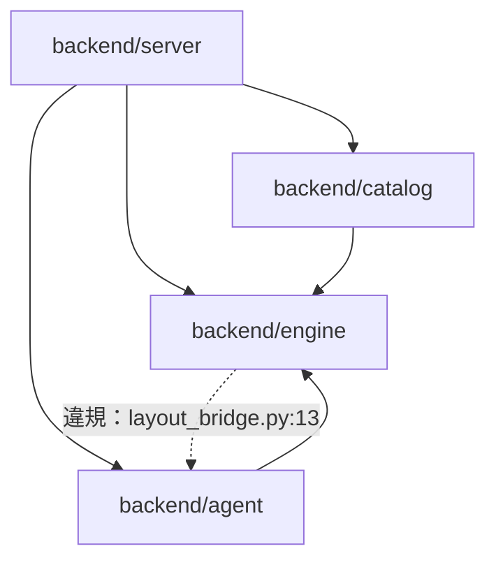
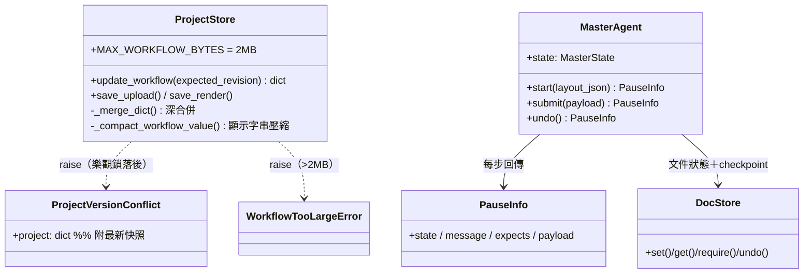
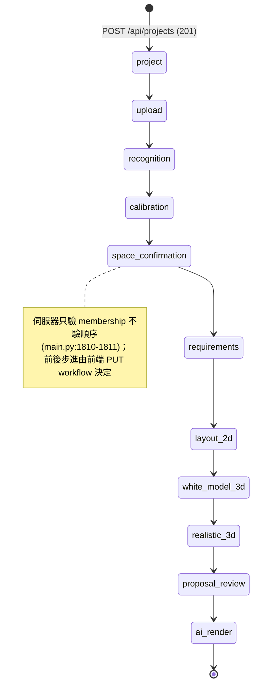
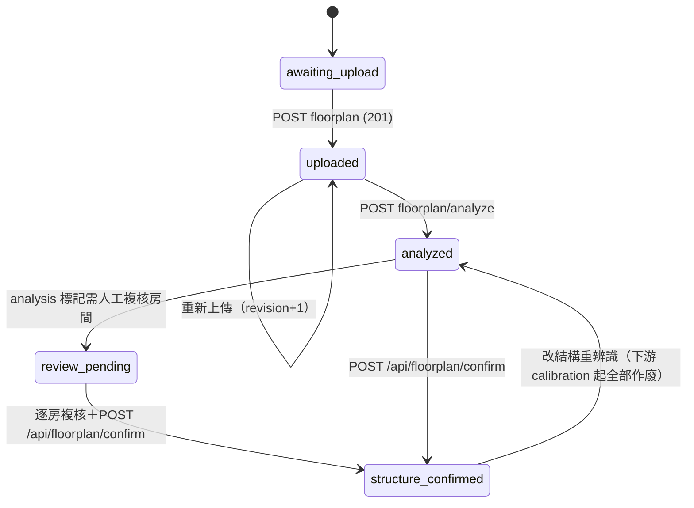
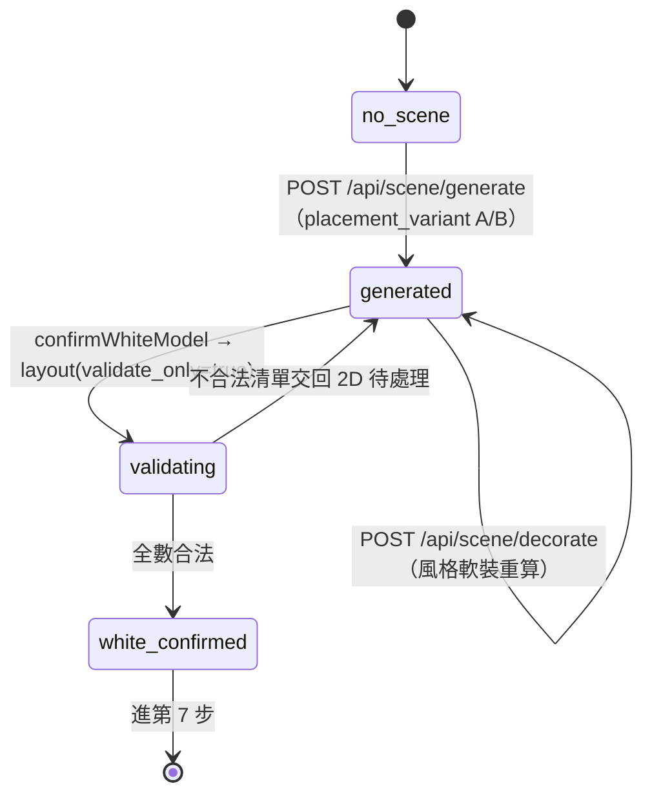
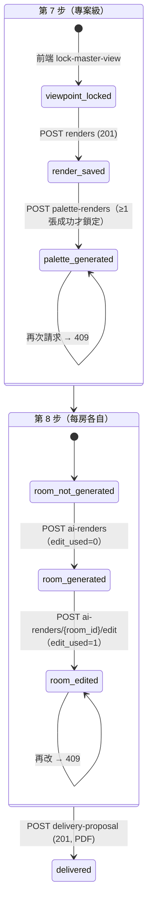
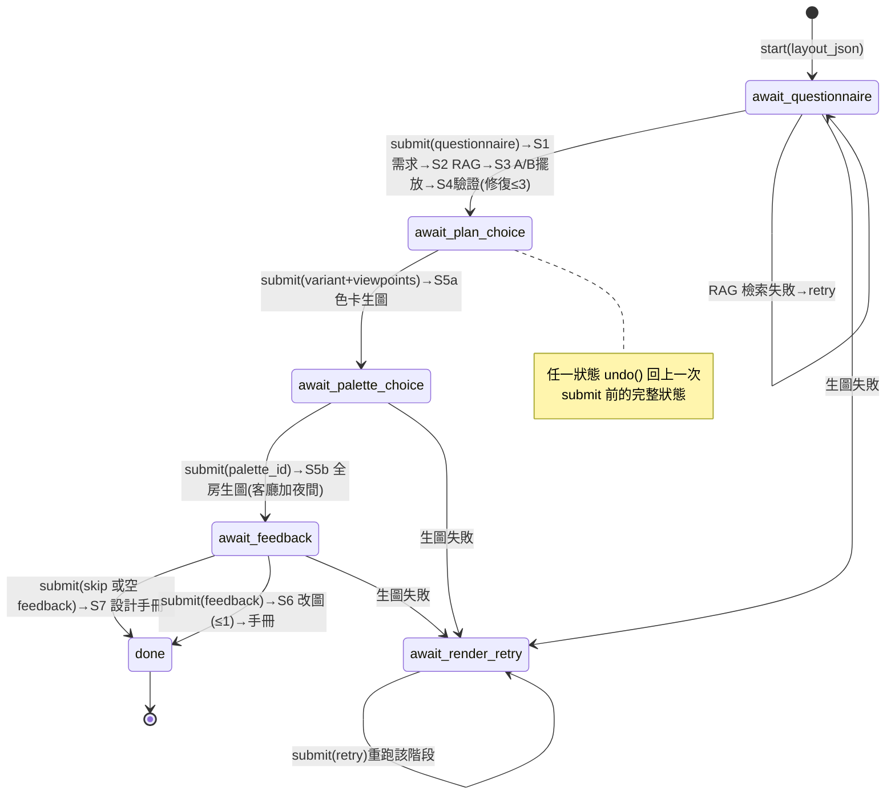

# 低階設計與程式碼地圖 (LLD / Code Map) - RoomPilot

> **版本:** 0.1 | **更新:** 2026-08-11 | **狀態:** 草稿
> **Owner:** Bella（`backend/server/` 整合，AGENTS.md:36）＋各模組 owner：Ancai（engine）、Yen（agent）、Kai（catalog）（AGENTS.md:39-41；AI 衍生，人工核准前為 TO-BE）
> **語域:** L3（工程）
> **實例:** 單例；§5 狀態機依 Aggregate 分節（登錄簿 §6 實例規則），量大時拆 `lld-<aggregate>.md`
> **定位宣告:** 本文件回答「RoomPilot codebase 長什麼樣、誰依賴誰、五個 Aggregate 的狀態機與不變量」；不包含 API 契約（見 [api_spec.md](./api_spec.md)）、資料表設計（見 [db_design.md](./db_design.md)）與系統級架構論述（見 [../03_architecture/sad.md](../03_architecture/sad.md) 與 ADR-*）。
> **生成:** AI 由程式碼與文件衍生｜來源版本 git yen@8863a36c

---

## 目錄

- [1. 生成資訊](#1-生成資訊)
- [2. 模組結構](#2-模組結構)
- [3. 模組依賴圖](#3-模組依賴圖)
- [4. 關鍵類別關係](#4-關鍵類別關係)
- [5. 狀態機（設計契約）](#5-狀態機設計契約)
- [6. 追溯](#6-追溯)

## 1. 生成資訊

§2–§4 描述**程式碼現況（AS-BUILT）**，必須可重新生成，過期即重掃；§5 為設計契約，人工核准後才生效。

| 項目 | 值 |
| :--- | :--- |
| 生成時間 | 2026-08-11 |
| 對應 commit | git `yen`@`8863a36c` |
| 生成方式 | AI 逐檔實讀（Read/Grep）；行號逐一核對 |

## 2. 模組結構

```text
backend/
├── server/     # FastAPI、專案保存、八步 UI 調度、生圖與交付（Bella）
│   ├── main.py                    # 全部 HTTP 路由（單一 app）
│   ├── project_store.py           # SQLite ProjectStore：workflow 快照＋revision 樂觀鎖
│   ├── scene_service.py           # scene_json 組裝、擺放調度（呼叫 engine 裁決）
│   ├── agent_pipeline_service.py  # MasterAgent 併存管線入口（flag 保護）
│   └── static/                    # 正式前端（scene.html／scene_v2.js，ADR-006）
├── engine/     # 幾何單一權威：配置、碰撞、淨空、柵格（Ancai，NFR-004）
├── catalog/    # 官方家具 8,675 件、PostgreSQL view、風格/材質資料（Kai）
└── agent/      # MasterAgent＋4 sub-agent、選件/擺位紀律/生圖/報告（Yen）
```

| 模組 | 職責（單一） | 證據 |
| :--- | :--- | :--- |
| `backend/server/` | HTTP 面與流程編排；不自行判定幾何 | AGENTS.md:36 |
| `backend/engine/` | 家具合法位置唯一裁決者（Shapely 提議、5cm 柵格判定） | AGENTS.md:41、54；scene_service.py:2228-2230 |
| `backend/catalog/` | 正式家具與 CloudFront 資產、PostgreSQL/RAG metadata | AGENTS.md:39 |
| `backend/agent/` | 需求結構化、選件、擺位 hints、生圖/報告 sub-agent；不決定幾何合法性 | AGENTS.md:40、53 |

## 3. 模組依賴圖

箭頭語意＝import。設計上 `engine` 是最底層（幾何權威，NFR-004），任何反向 import 視為分層違規，列入 §6。



| 依賴 | 證據 |
| :--- | :--- |
| server → engine/catalog/agent | scene_service.py:15-37（`..agent.knowledge`、`..catalog.style_db`、`..engine.*`）、agent_pipeline_service.py:19 |
| agent → engine | agent/adjust.py:18-21、agent/clearance.py:15-17、agent/tools/engine_validate.py:9-10 |
| catalog → engine | catalog/style_db.py:10（`engine.models` 的 `ClearanceZone`/`FurnitureCatalogItem`） |
| **engine → agent（違規）** | engine/layout_bridge.py:13（`from ..agent.knowledge import family_of`） |

## 4. 關鍵類別關係

只畫「看不懂就無法安全改動」的核心（保存層＋管線層）；引擎資料類（`Room`/`PlacedFurniture`/`Obb`/柵格 `Grid`）詳見 `backend/engine/` 各檔 docstring。



證據：project_store.py:11、18-25、28-37、51-74、190-248；master.py:47-108、123-156。

## 5. 狀態機（設計契約）

本節是**人工核准的設計契約**：enum 合法值與轉移規則在此定義，[api_spec.md](./api_spec.md) §3 錯誤碼與 [db_design.md](./db_design.md) 引用，不重複定義。每個 Aggregate 一小節。

### 5.1 Project 工作流（Aggregate: Project）

`current_step` 合法值＝`WORKFLOW_STEPS` 11 值（main.py:164-176）：`project → upload → recognition → calibration → space_confirmation → requirements → layout_2d → white_model_3d → realistic_3d → proposal_review → ai_render`，對應 UI 八步（部分步驟含多個內部狀態）。



| 觸發 API／函式 | 行為 | 證據 |
| :--- | :--- | :--- |
| `POST /api/projects` | 建案，`current_step="project"`、`workflow={}`、`revision=0` | main.py:1784-1797、project_store.py:165-178 |
| `PUT /api/projects/{id}/workflow` | `_merge_dict` 深合併＋`current_step` 更新，`revision+1` | main.py:1806-1867、project_store.py:190-248 |
| `GET /api/projects/{id}` | 恢復快照（`Cache-Control: no-store`） | main.py:1800-1803 |
| `ProjectStore.update_workflow` | `BEGIN IMMEDIATE` 使版本比對＋更新為原子操作 | project_store.py:200-228 |

**不變量**

- workflow 是單一 JSON 快照，序列化後 ≤2MB，超過即整筆拒絕（NFR-002；project_store.py:11、224-225）。
- 每次寫入 `revision` 嚴格 +1；帶 `expected_revision` 落後即拒，**絕不深合併衝突雙方**（project_store.py:209-218、228）。
- 深合併只對 dict 遞迴，list 與純量整值覆蓋（project_store.py:18-25）——呼叫端不得依賴 list 內合併。
- 超長顯示字串（name/label/title 等 >512 字元）落庫前壓縮為 fallback 標籤（project_store.py:40-74）。

**失敗路徑**

| 條件 | 結果 | 證據 |
| :--- | :--- | :--- |
| `current_step` 不在 `WORKFLOW_STEPS` | 422 `invalid_workflow_step` | main.py:1810-1811 |
| revision 落後（帶 `expected_revision`） | 409 `project_revision_conflict`，detail 附最新 `project`（ACPT-014） | main.py:1848-1857 |
| 快照 >2MB | 413 `workflow_too_large` | main.py:1859-1866 |
| 辨識複核未解決就標完成 | 422 `recognition_review_unresolved`（見 §5.2） | main.py:1815-1827 |
| `replay_pending` 未帶 `base_updated_at` | 422 `pending_save_base_version_required` | main.py:1836-1839 |

### 5.2 平面圖辨識（Aggregate: FloorplanRecognition）

流程：上傳 → 使用者確認圖檔 → analyze → 人工複核 → confirm 產出鎖定 `layout_json`（ADR-001）；改結構強制回第 4 步重新複核。



| 觸發 API／函式 | 行為 | 證據 |
| :--- | :--- | :--- |
| `POST /api/projects/{id}/floorplan` | 存原圖（DXF/PNG/JPG/JPEG，樂觀鎖） | main.py:1870-1916 |
| `POST /api/projects/{id}/floorplan/analyze` | DXF 走 `parse_floorplan_with_engine`、影像走 `analyze_floorplan_image`；回 `analysis`＋`layout_json` | main.py:2981-3069 |
| `POST /api/floorplan/analyze`（無專案版） | multipart＋calibration/OCR/幾何 JSON → `analysis`＋`layout_json` | main.py:4106-4146 |
| `POST /api/floorplan/confirm` | `confirm_floorplan_analysis(analysis, corrections)` 套用人工修正，回鎖定契約 | main.py:4149-4159 |

**不變量**

- 辨識止於 `layout_json`：只含牆/門/窗/樑/柱/房間/scale，**不含**家具、材質、風格（ADR-001；[api_spec.md](./api_spec.md) §6）。
- analyze 成功即把 `calibration` 起的所有下游狀態清空（`staleFrom: "calibration"`），確認/需求/配置/白模/寫實全部作廢重走（main.py:3036-3062）。
- 未經使用者確認圖檔內容（`floorplan_confirmation.confirmed`，含舊 privacy 契約相容）不得 analyze（main.py:2967-2978）。
- 需人工複核的房間未逐一解決，第 4 步空間確認不得標完成——由 §5.1 的 workflow 保存 422 強制（main.py:1815-1827，訊息即「請回到第 4 步處理」）。

**失敗路徑**

| 條件 | 結果 | 證據 |
| :--- | :--- | :--- |
| 副檔名不支援 | 415 `unsupported_floorplan_type`／`floorplan_image_required` | main.py:1879-1887、4116-4118 |
| 圖檔未確認就 analyze | 409 `floorplan_confirmation_required` | main.py:2985-2993 |
| DXF 無牆體幾何 | 422 `dxf_parse_failed` | main.py:2996-3011 |
| 影像辨識失敗 | 422 `cody_recognition_failed` | main.py:3019-3033 |
| confirm 缺 `analysis` | 422 `analysis_required` | main.py:4152-4155 |

### 5.3 場景／擺設（Aggregate: Scene）

第 5–6 步：generate 產 A/B 白模方案 → 2D/3D 編輯逐次呼叫 layout/decorate → `confirmWhiteModel` 以 `validate_only` 最終確認。



| 觸發 API／函式 | 行為 | 證據 |
| :--- | :--- | :--- |
| `POST /api/scene/generate` | `build_scene_payload(...)`；`placement_variant` 非 A/B 一律正規化為 A | main.py:3591-3644（variant：3630-3639） |
| `POST /api/scene/layout` | `generate_layout` 重算全場座標；`placement_room_id` 單房、`validate_only` 只驗不排 | main.py:3647-3709 |
| `POST /api/scene/decorate` | 依風格重算軟裝（先移除舊軟裝再重算，非累加） | main.py:3799-3838 |
| `confirmWhiteModel()`（前端） | 擋 A/B 未選、不合法家具、GLB 載入失敗；後送 `validate_only: true`＋全件 `position_locked` | scene_v2.js:13924-13981（旗標：13966） |

**不變量**

- 幾何合法性唯一權威是引擎柵格：Shapely 只提議候選，布林網格裁決（NFR-004／ADR-002／ADR-008；scene_service.py:2228-2230、2269-2286）。
- `validate_only=true` 時每件座標**絕不重排**，只回報合法與否（ACPT-008；scene_service.py:2188-2191、main.py:3706-3707）。
- 方案 B 與 A 走完全相同的碰撞/淨空驗證，只反轉「類型錨點」候選嘗試順序（3×3 網格散點保持在最後）（scene_service.py:2539-2545）。
- 單房呼叫不得動別房家具：標了別房 id 的物件原樣 passthrough，不進重排（main.py:3673-3688）。
- 座標契約：`position_cm` 房間中心原點、公分；`rotation_y_deg` 與引擎旋轉互為負號（NFR-001；scene_service.py:2193-2194）。
- `scene_json.render_context.appliance_requirements` 是家電唯一去處，`scene_objects` 不含家電（ADR-004／ACPT-013；scene_service.py:3058-3062）。

**失敗路徑**

| 條件 | 結果 | 證據 |
| :--- | :--- | :--- |
| 成組件貼不上主件 | 標 `placement_failed` 交 `resolve_placements`「寧缺勿亂」，不退泛用亂放 | scene_service.py:2183-2186 |
| 泛用件全候選不合法 | 標 `placement_failed`，彙整進 `placement.failed` 與 `placement_resolution_report` | scene_service.py:2185-2186、3073-3087 |
| 最終確認有不合法件 | 前端列出未通過清單、留在第 6 步（不搬走家具） | scene_v2.js:13974-13981 |
| A/B 未全房選定／GLB 載入失敗 | `confirmWhiteModel` 前端擋下不送 API | scene_v2.js:13926-13954 |

### 5.4 渲染管線（Aggregate: RenderPipeline）

第 7 步：鎖視角 → 3D 截圖入庫 → 色卡比較圖（全專案一次）；第 8 步：逐房 ai-render（每房一次改圖）→ 交付 PDF。



| 觸發 API／函式 | 行為 | 證據 |
| :--- | :--- | :--- |
| `POST /api/projects/{id}/renders` | 存 3D 截圖 PNG（版本欄位 white_model/viewpoint/style_version；樂觀鎖必帶） | main.py:1937-1997、project_store.py:337-403 |
| `POST /api/projects/{id}/palette-renders` | 代表房 × 多色卡併發生圖；成功即寫 `palette_render.generated=true`（base64 不入 workflow） | main.py:2135-2221 |
| `POST /api/projects/{id}/ai-renders` | 逐房寫實生圖（第 7 步截圖為 img2img 參考）；寫入每房 `edit_used: 0`＋`lock_manifest` | main.py:2070-2132 |
| `POST /api/projects/{id}/ai-renders/{room_id}/edit` | 整批一次改圖（鎖定清單外不動）；成功把該房 `edit_used` 設 1 | main.py:2224-2287 |
| `POST /api/projects/{id}/delivery-proposal` | Playwright 排版正式交付 PDF；`design-manual`（八章）保留但 UI 不觸發 | main.py:2384-2418、2300-2331 |

**不變量**

- 色卡比較圖**每專案只能成功一次**；全部失敗不鎖定、允許重試（ACPT-009；main.py:2147-2155、2191-2214）。
- 每房改圖額度一次，由伺服器強制；房間之間額度互不影響（ACPT-010；main.py:2242-2248）。
- 生圖 base64 一律不進 workflow 快照（2MB 上限），只存旗標與各卡/房狀態（main.py:2138-2139、2117-2126）。
- render PNG 上傳必為有效 PNG 且 ≤20MB；DB 寫入失敗即刪已落地檔案，不留孤兒（main.py:1958-1976、project_store.py:400-402）。

**失敗路徑**

| 條件 | 結果 | 證據 |
| :--- | :--- | :--- |
| palette 已生成 | 409 `palette_already_generated` | main.py:2148-2155 |
| 房間未生圖就改圖／無 `lock_manifest` | 409 `room_not_generated` | main.py:2237-2241 |
| 該房額度用完 | 409 `ai_edit_budget_exhausted` | main.py:2244-2248 |
| 未設 `OPENROUTER_API_KEY` | 503（ai-renders／palette／edit 同碼路徑） | main.py:2109-2116、2183-2190、2262-2269 |
| 改圖模型失敗 | 502 `ai_edit_failed`（附 notices） | main.py:2270-2274 |
| 缺 Playwright Chromium | 503 `delivery_engine_not_configured`（ACPT-011） | main.py:2399-2402 |
| revision 落後（renders） | 409 `project_revision_conflict` | main.py:1988-1996 |

### 5.5 Agent 併存管線（Aggregate: AgentPipeline）

`ROOMPILOT_AGENT_PIPELINE` flag 保護的 HITL state machine（ADR-005）；MasterAgent 是程式固定流程、不呼叫 LLM，計數政策（修復 ≤3、改圖 ≤1）全在本層（master.py:1-13、56-62）。



| 觸發 API／函式 | 行為 | 證據 |
| :--- | :--- | :--- |
| `GET /api/agent/pipeline/status` | 開關與 gateway 狀態，**未啟用也永遠可查**（ACPT-015） | main.py:3504-3507、agent_pipeline_service.py:46-51 |
| `POST /api/agent/pipeline/{id}/start` | `MasterAgent.start(layout_json, rules_json)` → `await_questionnaire` | main.py:3518-3534、master.py:110-121 |
| `POST /api/agent/pipeline/{id}/submit` | 目前 HITL 決策點提交並推進；提交前自動 checkpoint | main.py:3537-3546、master.py:123-143 |
| `POST /api/agent/pipeline/{id}/undo` | 回復上一次 submit 前的完整狀態（含 DocStore） | main.py:3549-3556、master.py:145-156 |
| `GET /api/agent/pipeline/{id}` | 查目前 `PauseInfo`（state/message/expects/payload） | main.py:3559-3566 |
| `POST /api/agent/pipeline/reconcile` | step6 擺放 vs 管線擺放 覆蓋率＋合法性對帳（SCN-010） | main.py:3569-3583 |

**不變量**

- 不影響正式 step 6：與 `scene_service` 並存、可隨時回退（ADR-005；agent_pipeline_service.py:1-11）。
- 管線狀態序列化到 `runtime_dir/agent_pipeline/<project_id>.json`，**刻意不入** workflow 快照（含生圖 base64 會爆 2MB、會被顯示字串壓縮改壞）（agent_pipeline_service.py:8-10）。
- 全域單一 `Lock` 序列化所有專案管線操作（驗證入口足夠，agent_pipeline_service.py:28-30）。
- 輸入不合法「不算一動」：handler 丟 `ValueError` 即回復 checkpoint，使用者原地重交（master.py:140-143）。
- sub-agent 無狀態，每次請求重建，狀態一律靠 `restore()`（agent_pipeline_service.py:63-66）。

**失敗路徑**

| 條件 | 結果 | 證據 |
| :--- | :--- | :--- |
| flag 未啟用（status 除外） | 404「設定 `ROOMPILOT_AGENT_PIPELINE=1` 後重啟」 | main.py:3510-3515 |
| 未 start 就 submit/undo | 409 `PipelineNotStarted` 訊息 | main.py:3545-3546、3555-3556 |
| 未 start 就 GET | 404 | main.py:3564-3566 |
| `layout_json` 缺/不合法（如缺 rooms） | 422（`ToolError` 轉可讀訊息） | main.py:3522-3534、agent_pipeline_service.py:87-89 |
| RAG 檢索失敗 | 停在 `await_questionnaire`，expects 帶 `retry` | master.py:172-179 |
| 生圖失敗（主模型＋備援皆重試盡） | 轉 `await_render_retry`，可 retry 或 skip 該階段 | master.py:249-263、452-462 |
| reconcile 缺 `width_cm`/`depth_cm`/`items` | 422 | main.py:3573-3583 |

## 6. 追溯

| 項目 | ID／連結 |
| :--- | :--- |
| 上游 | REQ-001/002/004/006/007/009~012、FR-001/002/004/006/007/009/010/011/012/015、NFR-001/002/004（[../00-registry.md](../00-registry.md) §2）；ADR-001/002/004/005/006/007/008（登錄簿 §3） |
| 對應 ACPT | ACPT-004/006/007/008/009/010/013/014/015（§5 各不變量） |
| 下游 | [api_spec.md](./api_spec.md) §3 錯誤碼、[db_design.md](./db_design.md) 的 `current_step`/`revision` 欄位語意、[../05_qa/test_plan.md](../05_qa/test_plan.md) 狀態轉移案例 |
| 已知分層違規 | `backend/engine/layout_bridge.py:13` import `..agent.knowledge`（engine → agent 反向依賴，違反「engine 為最底層」設計；修復任務待 owner Ancai／Yen 認領） |
