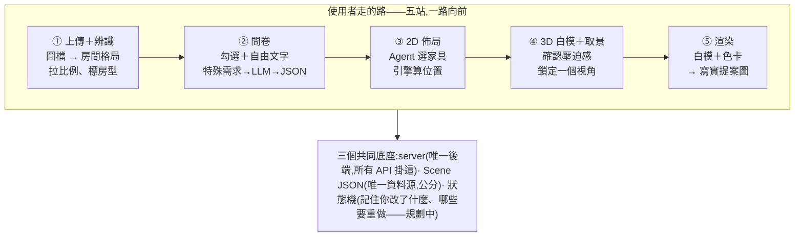
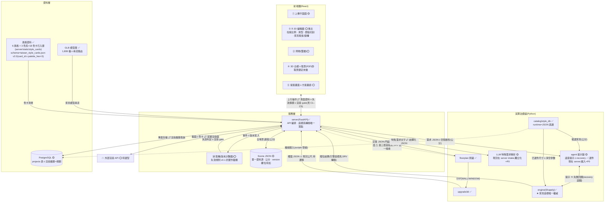
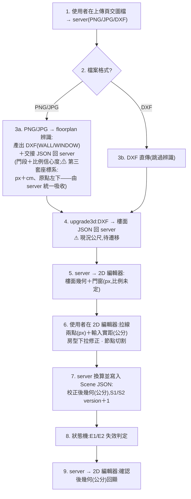
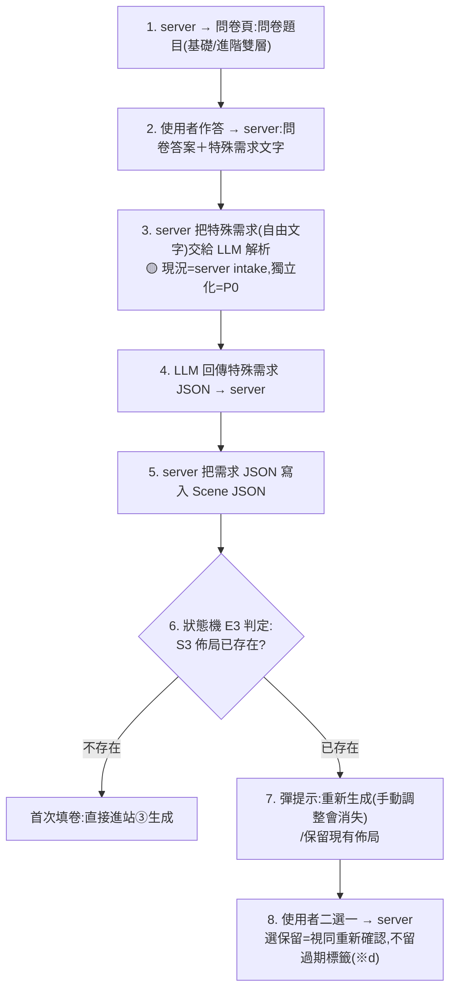
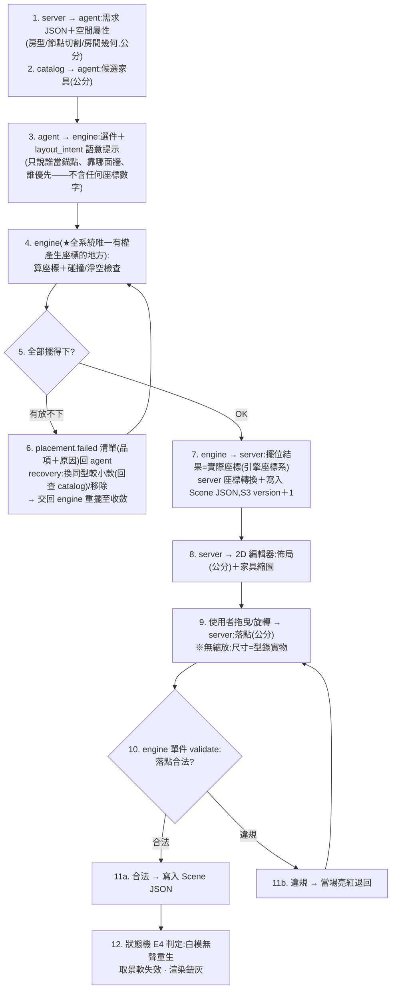
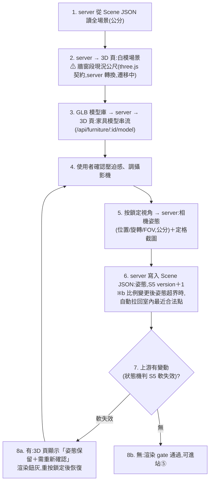
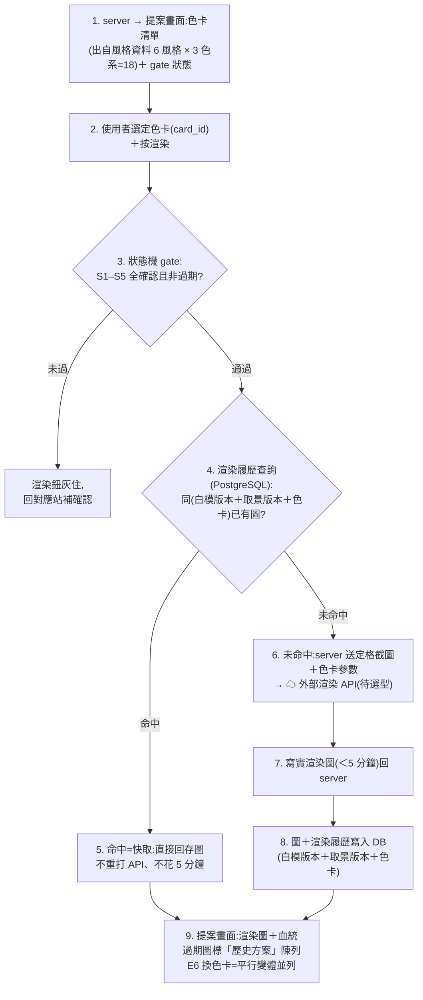

# RoomPilot 系統架構圖(三層制)v1.0

> **狀態**:2026-07-18 組長核可入庫。草稿歷程 v0.1–v0.9 於 7/17–18 與組長逐輪審定,含三視角審查(流程覆蓋/repo 對照/資料流閉環)15 項修正全數落地。
> **前提**:圖 C 系列依 7/16 新五階段流程繪製,該流程**仍待 Sunny 老師批准**——若流程翻案,C 系列隨之修訂,圖 B 模組總覽大體不受影響。
> **三層怎麼讀**:圖 A=Demo/簡報版(組員與評審看這張,現場口語補充);圖 B=模組總覽(框、職責、主資料流,含實作三態標記);圖 C1–C5=分站步驟流,「不省線」的承諾由分站圖兌現。
> **畫法約定**:分站圖一律步驟流——一格=一步、由上往下、判斷用菱形,模組歸屬寫在步驟文字裡;模組之間的正式連線以圖 B 為準。單位契約:全鏈公分,例外處逐一標 ⚠。

---

## 圖 A · Demo 簡報版

## 圖 B · 模組總覽

實作三態:✅=已接線有測試 🟡=部分存在(框內註明現況住哪) ⭕=純規劃。前端與 server 的往來一律走 API(唯一入口)。

## 代號速查(S=狀態、E=事件;正本=《新五階段_狀態失效規則_v0.1.md》)

**S(State,狀態)**=使用者一路確認下來的六個成果,各自帶版本號;「version＋1」=這個狀態改了一版,下游拿版本號一比就知道自己過期沒。**E(Event,事件)**=使用者的七種「回頭改」動作,每個事件觸發一組失效規則。

- **S1** 比例確認 **S2** 房型確認 **S3** 2D 佈局 **S4** 白模 **S5** 取景(鎖定的視角) **S6** 渲染圖
- **E0** 換平面圖 **E1** 重拉比例 **E2** 改房型/節點切割 **E3** 改問卷答案 **E4** 家具增刪移動 **E5** 重新取景 **E6** 換色卡(唯一不失效的事件,產生平行變體)

## 圖 C1 · 站①:上傳＋辨識＋比例＋房型(S1/S2)

## 圖 C2 · 站②:需求問卷＋特殊需求 LLM(輸入事件,非狀態)

## 圖 C3 · 站③:2D 佈局——Agent⟲引擎生成迴圈＋手動微調(S3)

## 圖 C4 · 站④:3D 白模＋取景鎖定(S4/S5)

## 圖 C5 · 站⑤:色卡選擇＋渲染＋方案畫廊(S6)

---

## 繪製決策(7/17–18 組長裁決紀錄)

- **三層制**(7/18):圖 A 簡報/圖 B 模組總覽/圖 C1–C5 分站步驟流;「不省線」由分站圖兌現,圖 B 維持可讀密度。
- **兩份圖制→三層制演進**(7/17→7/18):先裁定 Demo 簡版+內部詳版兩份;審查發現單張詳版補全 15 項缺漏會爆炸,升級為三層。
- **實作三態標記**:✅/🟡/⭕ 統一標在框上,純規劃不再畫得像已存在(狀態機、projects 表、⑤站前端均為 ⭕)。
- **問卷一律過 server 轉手**(7/17),不直連 agent——維持唯一 FastAPI/唯一入口。
- **特殊需求 LLM→JSON 外顯為獨立框**(7/17)——履歷亮點,明著畫。
- **Agent 能力清單不進圖**(7/17),另立文件:`docs/02_復刻研究/Agent能力清單_v0.1.md`。
- **風格定案**(7/18):6 風格(北歐/日式/現代簡約/奶油風/工業風/美式)× 3 色系=18 張色卡,已全套入庫並接線;剩餘工作=palette_hex→渲染 API 參數映射。
- **砍掉:帳號層**——存專案用 projects 表即可;SaaS 預留=auth middleware+owner_id 一句話。
- **砍掉:Redis**——快取=渲染履歷本身(C5 第 5 步)。
- **P1 預留**:RAG 選件檢索與自然語言微調,五站全綠後依序做,不進圖。
- **單位遷移工項(四處)**:① upgrade3d 樓面 JSON(公尺) ② three.js 牆窗段 payload(公尺) ③ agent/layout_intent 內部自行 ×100 ④ floorplan 交接 JSON 第三套座標系(原點左下、y 向上)——全部由 server 統一吸收,公尺與異座標系不外洩到其他模組介面。
- **誠實修正**:DB→型錄改標「離線匯入」(runtime 現況=JSON 直讀);AG 框註明選件現在 server、搬入=P0;FE2D 移除「縮放」(家具尺寸=型錄實物,要更小走 recovery 換款)。
- **規格文件不填人名**(7/18):分工凍結,等架構圖、介面契約、狀態圖、時序圖、WBS+甘特出齊後再整理。

## 審查 15 條 → 修正落點(7/18,三視角審查)

1. ③ 微調上行＋validate 迴路缺 → C3 第 9–12 步。
2. ⑤ 站前端不存在＋DB 無讀取線 → FEP 框＋C5 整張。
3. 站① 迴圈斷＋Scene JSON 牆窗無來源 → C1 第 5、7 步。
4. 狀態機只進不出 → 圖 B 雙向標籤線＋各站 gate 下行。
5. 門資料鏈(交接 JSON)缺 → C1 第 3b 步＋遷移工項④。
6. Agent 選件矛盾群 → C3 第 1–6 步全迴圈＋AG 框三態註記。
7. 中低九條(姿態存讀、E3 彈窗、色卡入口、GLB 線、DB→CAT 方向、三態標記、縮放、px 標籤、圖 A 加 LLM 行)→ 各分站圖與註記逐一落地。

---

同進退文件:《新五階段_狀態失效規則_v0.1.md》《新五階段_測試檢核表_v0.1.md》《Agent能力清單_v0.1.md》(現於 docs/02_復刻研究/,Sunny 批准後升格本資料夾)。
