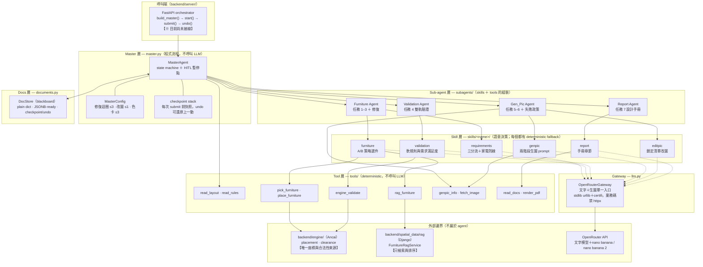
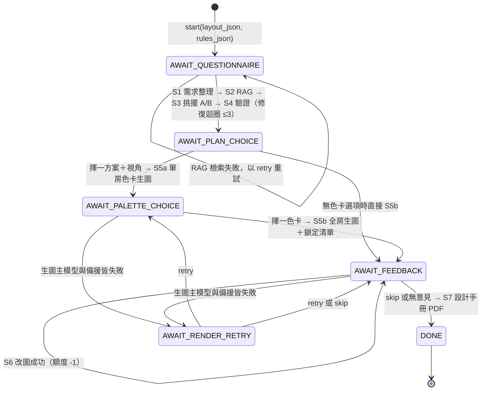
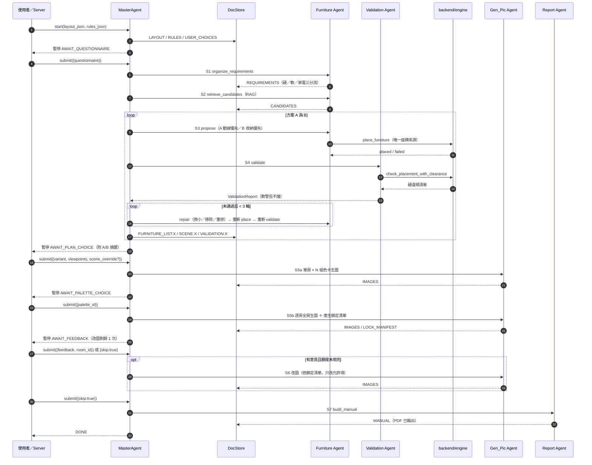
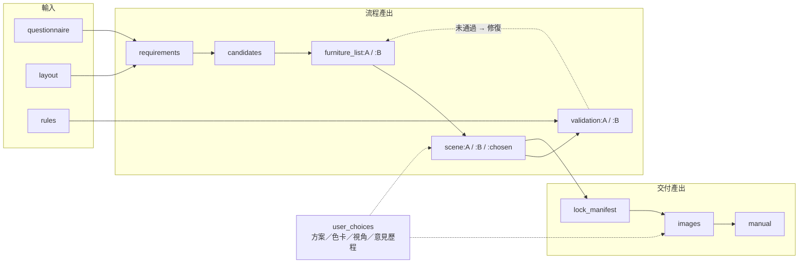
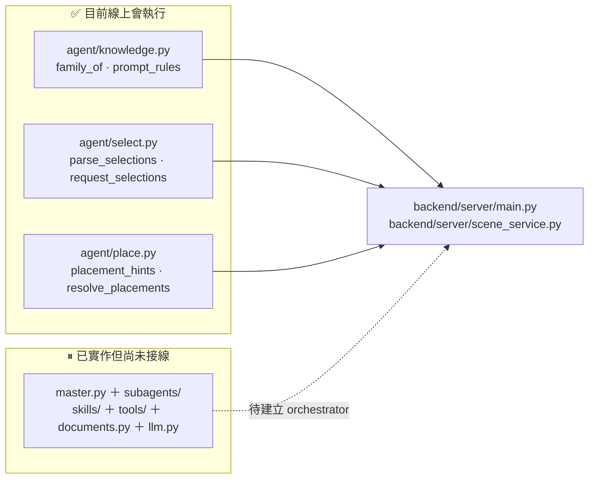

# RoomPilot Agent 架構圖

最後更新：2026-08-01
適用分支：`bella-test1`
權威來源：`backend/agent/AGENTS.md`、`backend/agent/IMPLEMENTATION_REPORT.md` 與 `backend/agent/` 程式碼

> 本文件只畫 **`backend/agent/`（owner: Yen）** 的內部架構。整個產品的系統架構見
> [系統架構圖](系統架構圖.md)；使用者八步操作流程見
> [使用者流程與系統架構圖](使用者流程與系統架構圖.md)。

---

## 0. 一句話定位

Master 是**程式寫死的 state machine**（不呼叫 LLM），負責流程、迴圈上限與人為決策點；
LLM 只在 skill 內做**語意決策**；座標與合法性只由 `backend/engine/` 決定；
所有共享狀態走 `DocStore`（blackboard），可 checkpoint／undo／整包序列化保存。

---

## 1. 分層架構



**讀圖重點**

- 實線＝流程依賴；虛線＝LLM 呼叫（沒有 `OPENROUTER_API_KEY` 時整條虛線斷開，skills 走 deterministic fallback，流程仍可跑完，只有生圖階段會以可讀原因暫停）。
- 只有 `place_furniture` 與 `engine_validate` 兩個 tool 碰得到 engine；skill 與 LLM 一律不產生座標。
- Master 直接持有 `ReadLayoutTool` / `ReadRulesTool`，其餘 tool 都由 skill 呼叫。

---

## 2. Master state machine



**計數器全部在 Master，不交給 LLM 自律**

| 限制 | 數值 | 位置 | 備註 |
|---|---|---|---|
| 驗證失敗修復迴圈 | ≤ 3 輪 | `MasterConfig.repair_max_rounds` | A/B 各自獨立計數 |
| 改圖 | ≤ 1 次 | `MasterConfig.edit_max` | **只有成功才扣額度**，失敗重試不扣 |
| 色卡比對張數 | ≤ 3 組 | `MasterConfig.palette_limit` | 取需求文件的 `palette_options` 前 N 組 |
| 單一模型生圖重試 | 3 次 | `ImagePolicy.max_attempts_per_model` | 達上限 → 記錄原因 → 換備援模型再試 3 次 |
| undo | 無上限 | `checkpoint stack` | 每次 `submit()` 前自動快照 |

輸入不合法（`ValueError`）**不算一動**：Master 會自動 `undo()` 並要求重新提交。

---

## 3. 一次完整流程



---

## 4. Skills 與 Tools

### Skill 層（`skills/<name>/`）

每個 skill 一個資料夾，**兩檔分層**：

- `SKILL.md`＝**宣告層**：frontmatter ＋ 提示詞 ＋ 輸出 schema ＋ 流程說明。**提示詞的唯一來源**，`load_skill_doc()` 於匯入期解析驗證。改提示詞不需動 Python，但要跑 skills 測試。
- `__init__.py`＝**流程層**：呼叫 gateway、驗證輸出、**deterministic fallback**。

| Skill | 職責 | 關鍵約束 |
|---|---|---|
| `requirements` | 問卷 → 硬約束／軟偏好／家電三分流 | `_enforce_contracts()` 是家電防線：冰箱、洗衣機、冷氣、電視只能進 `appliances` |
| `furniture` | A/B 兩套策略選件（白名單＝RAG 候選） | 只輸出語意 `PlacementHint`（free／adjacent／overlay），**不含座標** |
| `validation` | 軟潛規則與需求滿足度（advisory 軌） | 硬規則走 `engine_validate`，LLM 不參與 |
| `genpic` | 兩階段生圖 prompt ＋ 鎖定清單 | 家電只在此進 context |
| `editpic` | 依鎖定清單產生改圖指令 | 明列不可變動元素 |
| `report` | 設計手冊章節統整 | 缺價一律保留待確認，不補猜 |

### Tool 層（`tools/`）

deterministic 函式，**不呼叫 LLM**；每個 tool 的 `contract` 可直接餵給 function calling。

| Tool | 輸出 | 外部依賴 |
|---|---|---|
| `read_layout` | `LayoutDoc` | — |
| `read_rules` | `RulesDoc`（軟潛規則） | — |
| `rag_furniture` | `CandidateListDoc` | `backend/spatial_data/rag`（可注入替換）|
| `pick_furniture` | 白名單過濾與擺放排序 | — |
| `place_furniture` | `SceneDoc`（placed／failed） | **`backend/engine/placement`** |
| `engine_validate` | `HardViolation[]` | **`backend/engine/clearance`** |
| `genpic_info` | 生圖 context 整理 | — |
| `fetch_image` | 取回舊圖供改圖 | — |
| `read_docs` | 讀 DocStore 供出報告 | — |
| `render_pdf` | 設計手冊 PDF | Pillow（點陣排版，文字不可選取） |

> `place_furniture` 採 **engine 能力偵測**：本分支引擎只有 `place_furniture` /
> `place_furniture_batch`，`adjacent` / `overlay` 意圖自動降級為 free 自由擺放並在
> hint note 註記——agent 層**不自行實作幾何補位**。

---

## 5. Docs 層（DocStore blackboard）



- 內部一律存 **plain dict**，dataclass 只是建構／讀取時的型別化外殼。
- 每份文件帶 `schema_version`（`roompilot.agent.*.v1`），以「可直接存進 PostgreSQL JSONB」為設計原則。
- `master.to_dict()` / `restore()` 也是 plain dict，可整包存進專案 storage。

---

## 6. 不可違反的邊界

| 邊界 | 規則 |
|---|---|
| **幾何** | 座標與合法性只由 `backend/engine/` 判定；LLM 與 skills 不得產生或修改座標 |
| **RAG** | 家具向量 RAG 只解析需求、檢索與排序；不可用時回報可讀錯誤，**不得改用未驗證資料** |
| **家電** | 冰箱、洗衣機、冷氣、電視只進需求文件 `appliances` 與生圖 context，**不進 2D/3D 配置** |
| **fallback** | 所有 LLM skill 必須有 deterministic fallback（無金鑰可跑完流程，生圖除外） |
| **提示詞** | 只能寫在各 skill 的 `SKILL.md`；改提示詞不動 Python，但要跑 skills 測試 |
| **迴圈與額度** | 由 Master 程式控制，不交給 LLM 自律 |
| **單位** | 公分制；場景 placed 條目沿用 `backend.engine.schema.placed_to_dict`，由擺家具 tool 附加 `coordinate_unit: "cm"` |
| **re-export** | 套件 `__init__` 的 room_pilot2 re-export 被 `backend/server/` 依賴，**不可移除** |

---

## 7. 現況與缺口（2026-08-01 實測）

### 已接線 vs 未接線



- `main.py:23-24` 與 `scene_service.py:15` 只 import room_pilot2 三模組；`build_master` / `MasterAgent` 在 `backend/agent/` 之外**尚無任何呼叫端**。
- 接線方式已定義：`from backend.agent import build_master` → `master.start(layout_json)` → `master.submit(payload)` → `master.undo()`；`master.to_dict()` 可直接存進 `.runtime/projects.sqlite3` 的專案狀態。

### 範圍註記

Gen_Pic（nano banana 生圖／改圖）與設計手冊 PDF 屬**提案功能**，超出現行五階段 Demo
範圍（現行 Demo 終點是 3D 白模取景＋提案 PNG）。未設 `OPENROUTER_API_KEY` 時 Master
會在生圖階段以可讀原因暫停並可 skip，不影響主線。

### 已知限制

- PDF 為 Pillow 點陣排版（文字不可選取）；換向量排版時替換 `tools/render_pdf.py` 即可，介面不變。
- 生圖「未報錯但品質不佳」的判定尚未定義。
- `FurnitureRagService.search` 的實際回傳欄位需在有 DB 環境實測對齊。

### 驗證指令

```bash
uv run pytest backend/agent/tests -q   # 2026-08-01: 24 passed
uv run pytest tests/ -q                # 2026-08-01: 122 passed, 1 skipped
```

---

## 8. 相關文件

- [系統架構圖](系統架構圖.md)
- [使用者流程與系統架構圖](使用者流程與系統架構圖.md)
- [`backend/agent/AGENTS.md`](../backend/agent/AGENTS.md)
- [`backend/agent/IMPLEMENTATION_REPORT.md`](../backend/agent/IMPLEMENTATION_REPORT.md)
- [Agent 前後端契約](contracts/AGENT_FRONTEND_BACKEND_CONTRACT.md)
