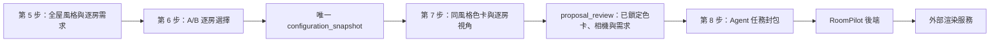
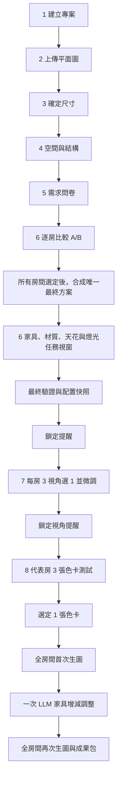

# RoomPilot 第 6-8 步、Agent 與生圖整合規格（歷史 A/B 實作稿）

> 文件狀態：已被取代，保留作決策歷史，不得直接交給 AI 實作。
> 取代日期：2026-08-06。
> 現行唯一執行契約：[`contracts/BELLA_6_8_YEN_AGENT_EXECUTION_AND_VERIFICATION.md`](contracts/BELLA_6_8_YEN_AGENT_EXECUTION_AND_VERIFICATION.md)。
> 現行架構：[`RoomPilot_現行版本總覽.md`](RoomPilot_現行版本總覽.md) 與 [`使用者流程與系統架構圖.md`](使用者流程與系統架構圖.md)。

AI 必須忽略本文後續的公開 A/B、未完成實作與舊 remote render 流程。現行差異如下：

1. 第 6 步只有單一配置工作台，不顯示或要求 A/B；舊欄位只供資料相容。
2. 第 7 步為每房三個 Yen 視角候選，全部鎖定後確認代表房全屋色卡。
3. 第 8 步使用 `/ai-renders` 首次生圖、`/edit` 每房最多一次修圖。
4. 最後由 `/design-delivery` 建立逐房 Web 簡報、工程、資安與預算成果包。
5. 本文以下內容只用來理解早期設計取捨，不可覆蓋上述現行規則。

## 目的與不可變原則

本規格以現行 RoomPilot 八步流程為基礎。第 1-5 步既有功能、問卷資料、儲存與返回能力必須保留；本次只重整第 6-8 步的使用者流程、資料快照與 Agent 生圖串接。

- 第 6 步是單一「2D + 3D 配置與預覽」工作台，不是多個使用者步驟。
- 第 6 步完成前，使用者可回到第 1-5 步修改；後續資料必須標示失效並重新驗證。
- 第 7 步開始後不可返回第 1-6 步。第 7、8 步的每個已確認送出節點不可倒退，只保留歷史版本供查看。
- 每次確認、鎖定、送出遠端任務前，都要顯示影響、風險與不可修改範圍。
- 前端永遠只呼叫 RoomPilot 後端；Agent、LLM 與外部生圖服務的 token 不可暴露給瀏覽器。

## 已驗證實作狀態（2026-08-01）

已在瀏覽器以實際專案完成下列路徑：第 5 步一鍵帶入需求、建立第 6 步 A/B 配置、逐房選擇唯一方案、處理無法放入家具、確認 2D+3D 與寫實場景、第 7 步選擇同風格色卡並鎖定六個房間視角，最後進入第 8 步遠端生圖任務頁。

### 實際資料流



Agent 任務封包必須包含：

- 全屋問卷與選定的唯一全屋風格。
- 每房用途、家具選擇、使用者補充、牆面/地板/天花/照明資料。
- 第 6 步唯一配置快照、家具鎖定狀態與尚未放入家具的處理結果。
- 第 7 步選定的一張同風格色卡，以及每個房間唯一鎖定的相機視角。
- 固定結構與房間邊界，供 Agent 與外部模型遵守，禁止改牆、門、窗、樑、柱或擴張空間。

### 前端門檻與錯誤處理

1. 逐房 A/B 未全部選定時，第 6 步不可進行最後確認，並提供「逐房比較方案」入口。
2. 家具因碰撞、淨空、尺寸或模型問題無法放入時，使用者可定位、替換、重排或明確採用擇優配置；處理結果必須保留在快照中。
3. 第 7 步只能提供全屋主風格的三張色卡；使用者需選一張並勾選內容確認後才可鎖定視角。
4. 逐房問卷已確認時，即使舊資料的視覺題答案尚未重新對應，也可視為問卷完成，避免一鍵帶入後被無聲阻擋。
5. 第 8 步僅在遠端渲染服務 URL 與憑證已設定時可真正送出；未設定時必須明確顯示「尚未連接遠端渲染服務」，不可假裝成功。

## 使用者流程



## 第 1-5 步保留清單

| 步驟 | 必須保留 |
| --- | --- |
| 1 建立專案 | 名稱、備註、`project_id`、自動保存與恢復。 |
| 2 上傳平面圖 | DXF/PNG/JPG、預覽、使用者確認後才辨識。 |
| 3 確定尺寸 | Cody/DXF 辨識摘要、兩點校正、厘米尺度、重設與重新校正。 |
| 4 空間與結構 | 房間命名、補漏、合併/分割、節點編輯、門窗牆樑柱確認、尺寸標註與重驗證。 |
| 5 需求問卷 | 全屋風格與設備、逐房用途/家具/偏好、牆地天花/燈光/冷氣預設、摘要確認。 |

第 5 步的問卷是第 6 步的預設值與 Agent 資料來源；不可被第 6-8 步覆寫或替換。

## 第 6 步：單一配置工作台

### 總覽頁

總覽頁只顯示全屋同步 2D + 3D、房間狀態、必要任務入口與「處理下一個任務」。不要把家具、材質、燈光、問題清單與長表單同時塞在右欄。

固定行動入口：

- 比較/選擇房間方案
- 微調家具
- 調整牆壁/地板
- 調整天花/燈光
- 處理問題家具
- 確認最終配置

細節功能皆使用一次只處理一件事的視窗（wizard/modal）；確認後回總覽頁。每個視窗都具備取消、返回總覽、確認並繼續，且不應有全頁長捲動才能完成的操作。

### A/B 選擇階段

1. 使用者逐房開啟「方案比較」視窗。
2. 視窗同時呈現該房 A/B 的 2D 動線與 3D 構圖，並以簡短文字說明家具位置、淨空、收納與差異。
3. 使用者每房選 A 或 B；未選完所有房間前，所有微調入口都必須鎖定並說明原因。
4. 最後一房確認後，系統合成唯一的最終配置方案，重新執行碰撞、淨空、超界、房間關聯與模型可用性驗證。
5. Agent 只接收此唯一最終方案，絕不接收 A/B 候選或由 Agent 再選方案。

### 微調與問題處理

- 微調視窗僅處理一個房間：3D 為主、同步 2D 為輔，可拖曳、旋轉、新增、替換、刪除與鎖定家具外觀/模型。
- 若存在碰撞、淨空不足、超界、未指定房間或 GLB 缺失，顯示房間與原因；使用者可處理、替換、局部重排或明確暫緩。
- 使用者可以繼續處理其他房間，但有未結案問題時不能確認進第 7 步。
- 結構（門窗牆樑柱）只能回第 4 步修改；回第 6 步後保留可保留的家具並重新驗證。

### 材質、天花與燈光

問卷預設必須先套用。第 6 步以獨立視窗覆寫，並可選全屋、指定多房或單房。

每個選擇視窗提供三條入口，排序如下：

1. 依第 5 步風格色卡推薦。
2. 材質/燈具資料庫篩選與挑選。
3. 使用者自然語言描述，由 LLM/RAG 搜尋候選。

牆地視窗支援牆面、地板、顏色、材質分界與套用範圍。燈光視窗支援天花形式、燈具類型、位置與氛圍。視窗內必須即時預覽，並提示樑、天花淨高、模型缺失或位置衝突。

### 進第 7 步的鎖定

按下「確認最終配置」時必須出現鎖定視窗，列出：各房最終選擇、家具位置/尺寸/鎖定外觀、牆地天花、燈具、風格與所有未結案問題。使用者勾選「理解進第 7 步後不可回第 1-6 步修改」後才可確認。

確認後建立 `configuration_snapshot`；此快照是第 7-8 步、Agent 與成果包的共同版本基準。

## 第 7 步：視角鎖定

- 進入第 7 步即不可返回第 1-6 步。
- 以總覽頁顯示房間的未選/已選視角狀態；點選房間開啟視角視窗。
- 系統按房間幾何、家具與功能自動產生三個候選：全景、主要使用區、特色/收納區。
- 使用者選一個候選後可微調相機；確認後鎖定該房視角。
- 全部房間鎖定前，可在第 7 步內重開該房換候選或微調。全部完成後以確認視窗鎖定所有視角，才進第 8 步。

## 第 8 步：Agent 生圖與成果

### 任務節點

1. 選擇代表房：系統依空間完整度推薦，但使用者可選任一已鎖定視角的房間。
2. 代表房色卡測試：只能使用第 5 步已選風格內的三張色卡，產生三張測試圖。
3. 選定一張色卡：全屋只使用這一張色卡。
4. 全房間首次生圖：每房使用其第 7 步鎖定的視角；逐房顯示 queued/running/completed/failed。
5. 失敗房間可單房重試；或使用者明確接受無圖後，才開啟唯一一次 LLM 調整。
6. 一次 LLM 調整：可描述新增/移除何種家具與位置。不可改格局、既有家具位置、色卡或視角。系統提醒可能造成家具消失、遮擋、誤解或生圖失敗，但不阻擋送出。
7. Agent 理解確認：將原文轉為使用者可讀的結構化變更與風險；使用者可修改原文，確認後才送出，且遠端成功受理才消耗一次機會。
8. 全房間再次生圖：沿用同一色卡與各房視角，逐房回傳與可單房重試。

### 每次生圖前的確認

每次送出遠端任務都要開「本次生圖摘要」視窗，依來源顯示：

- 本次目標、代表房/房間清單、色卡與視角。
- 全屋問卷、逐房需求、使用者補充文字。
- 已鎖定的家具、材質、燈具、格局與相機。
- 本次 LLM 調整及其影響。
- 已知風險與例外。

摘要中的生圖補充文字可改；每次修改後需要再次確認才可送出。對「移動家具」、「拆牆」、「開放式」、「走道放櫃」等可能違反鎖定場景的字句，必須警告可能造成外部模型畫錯，但仍允許送出並標記為使用者覆寫描述。

送出後封存 `render_brief` 版本、鎖定資料與任務 ID；不可回復或撤回，只能在下一個合法節點建立新版本。原第 5 步問卷維持原始紀錄。

## RoomPilot 與 Agent 契約

```text
Browser -> RoomPilot API -> Agent -> external image model
Browser <- RoomPilot API <- Agent task status/output
```

Agent 必須先回傳每房 `job_id`，RoomPilot 後端輪詢 Agent 狀態並對前端提供統一的任務狀態 API。Agent 負責將完整資料包交給 LLM，組合外部模型 prompt/控制資料並呼叫外部生圖服務；RoomPilot 負責工作流、版本、權限、歷史、結果對應與 UI。

### 送給 Agent 的資料包

- `project_id`、`request_id`、`configuration_snapshot_id`、`scene_version`、`render_brief_version`、idempotency key。
- 唯一最終場景：結構、所有鎖定家具、位置尺寸、家具模型與圖片參考、材質、天花與燈具。
- 問卷原始資料、逐房需求、RAG/風格結果、使用者補充與已確認生圖摘要。
- 全屋風格、測試的三張色卡或最後選定的單張色卡。
- 代表房與其鎖定視角；全房任務的 `room_id`、名稱、相機參數與視角參考圖。
- 白模/3D 場景參考圖，必要時為各房提供鎖定家具圖片與角度圖。
- LLM 最終調整原文、確認過的結構化理解、風險標記與調整版本。

### Agent 回傳

每個任務至少提供 `job_id`、`project_id`、`room_id`、`mode`、`status`、`image_url`/輸出檔案、可讀失敗原因、機器錯誤碼、時間與輸入版本。RoomPilot 必須可依 `room_id + scene_version + render_brief_version` 對回正確畫面與成果。

## 成果包

成果頁提供每房圖片、單張下載、完整 ZIP 下載、房間/色卡/視角/版本/時間、任務狀態與失敗原因。

```text
RoomPilot_成果包_<project>_<version>.zip
├─ README.md
├─ manifest.json
├─ render_brief.json
├─ configuration_snapshot.json
├─ rooms/<room>/最終渲染.png
├─ rooms/<room>/鎖定視角.png
└─ adjustments/最後一次LLM調整紀錄.json
```

`README.md` 必須解釋每一個檔案、採用色卡、各房視角、版本來源、成功/失敗狀態與已知限制。

## 驗收條件

1. 第 1-5 步問卷、資料保存與返回能力不回歸。
2. 第 6 步只是一個同步 2D + 3D 使用者工作台，細節以獨立任務視窗處理。
3. 未完成全部房間 A/B 選擇時，家具微調不能開啟且有原因提示。
4. 第 6 步進第 7 步前有鎖定提醒、勾選確認與完整合法性檢查。
5. 第 7 步每房只可選一個鎖定視角；第 7-8 步無法回第 1-6 步。
6. 每次生圖前可檢視與修改整合摘要；確認後資料、任務與輸出可追蹤。
7. Agent 任務能逐房顯示狀態、失敗原因、單房重試，且不暴露 token。
8. 最後一次 LLM 調整只在首次全房結果完成/結案後開放；遠端成功受理才消耗機會。
9. 成果頁與 ZIP 均具完整檔案說明與版本資料。
