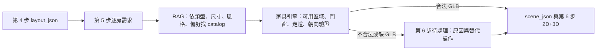

# 家具引擎逐房需求契約

## 目的

本文件定義 RoomPilot 從第 4、5 步取得資料後，交給家具引擎的唯一輸入格式。

家具引擎必須依此契約處理，不可從畫面文字、舊版 `requirements` 欄位或模型名稱猜測使用者需求。

本契約解決四件事：

1. 使用者先選「家具類型與尺寸」，再由 RAG 對應真正的資料庫家具。
2. `slot_id`、`selected_size`、`catalog_item_id` 分開保存，避免衣櫃被當成床等資料錯配。
3. RAG 只推薦已驗證且可載入的 GLB；家具引擎只擺放真實 GLB，不產生白模替代品。
4. 家具引擎在放置前檢查牆、門、窗、走道、方向與尺寸，無法安全放置時回傳原因與替代方案。

## 角色與責任

| 角色 | 必須負責 | 不應負責 |
| --- | --- | --- |
| 第 4 步空間與結構 | 輸出已確認的 `layout_json`、房間、門窗、可用區域與淨空區 | 決定家具品牌或風格 |
| 第 5 步需求問卷 | 收集逐房用途、家具類型、尺寸、數量、偏好與全屋風格 | 計算精準碰撞或直接產生白模 |
| RAG / 資料庫服務 | 依 `slot_id`、尺寸、風格、偏好找出可用 catalog 候選 | 決定最終 3D 座標 |
| 家具引擎 | 驗證候選、選擇合法位置、方向與碰撞，輸出 `scene_json` | 改寫使用者確認的房間用途或尺寸 |
| 第 6 步 2D+3D | 顯示已放置的 GLB、問題原因、替換與微調操作 | 隱藏失敗原因或偷偷換成白模 |

## 流程



逐房確認後可先送 RAG 背景推薦，使用者仍可繼續填下一個房間。第 5 步不得因家具尺寸風險、碰撞風險或缺少 GLB 而停住問卷；這些資料只能記錄為風險，交由第 6 步處理。每個房間狀態只能是：

- `pending_rag`：尚未送出推薦。
- `recommending`：RAG 正在查詢。
- `ready`：已有可用 GLB 候選，等待家具引擎放置。
- `needs_selection`：沒有可用 GLB 或目錄類型不符，需使用者選擇。
- `invalid_fit`：有候選但目前尺寸、門窗或走道規則不允許；第 5 步可繼續，第 6 步必須顯示待處理原因。
- `empty_confirmed`：使用者確認空房；第 6 步不放家具，生圖時可依風格補軟裝。
- `placed`：已成功放入 `scene_json`。
- `placement_failed`：家具引擎已嘗試所有合法候選仍無法放置。

## 家具引擎輸入

完整範例位於 [furniture_engine_room_requirements.example.json](furniture_engine_room_requirements.example.json)。

### 根節點

| 欄位 | 類型 | 說明 |
| --- | --- | --- |
| `schema_version` | string | 固定為 `1.0`。 |
| `project_id` | string | 專案唯一識別碼。 |
| `layout_version_id` | string | 第 4 步已確認格局版本。 |
| `layout_json` | object | 家具引擎必須使用的空間、牆、門窗、樑柱與淨空資料。 |
| `global_defaults` | object | 全屋風格、冷氣與材質繼承規則。 |
| `rooms` | array | 每個房間的用途、偏好及家具 slot。 |
| `engine_rules` | object | 所有引擎都必須遵守的不可違反規則。 |

### `global_defaults`

| 欄位 | 說明 |
| --- | --- |
| `style_palette_id` | 使用者選擇的全屋風格色卡識別碼，也用於篩選家具候選。 |
| `apply_style_to_all_rooms` | 是否先套用全屋風格；房間仍可在第 6 步覆寫。 |
| `air_conditioning` | 預設只套用客廳、臥室、書房。廚房、浴室、陽台必須是 `not_applicable`。 |
| `surface_policy` | 一般空間繼承風格；廚房、浴室、陽台在保持風格語言下改用機能材質。 |

### `rooms[]`

| 欄位 | 說明 |
| --- | --- |
| `room_id` | 必須和 `layout_json.rooms[].room_id` 一致。 |
| `room_type` | 使用標準房型，例如 `bedroom`、`living_room`、`kitchen`。 |
| `usage` | 多選用途，例如 `sleep`、`read_work`、`store`、`rest`。只用於推導家具 slot，不是強制問答。 |
| `furniture_preference` | 使用者輸入的家具特徵，例如淺木色、圓角、可收納；只影響本房新家具。 |
| `furniture_slots` | 此房使用者選擇或預設的家具類型與尺寸。 |
| `allow_empty` | 使用者是否允許空房。走道、浴室、陽台通常為 `true`。 |
| `surface_mode` | `inherit_global_style` 或 `functional_same_style`。 |

### `furniture_slots[]`

| 欄位 | 必填 | 說明 |
| --- | --- | --- |
| `slot_id` | 是 | 家具類型，例如 `bed`、`wardrobe`、`desk`、`office_chair`、`sofa`。 |
| `required` | 是 | 是否為該用途的必要家具。 |
| `quantity` | 是 | 使用者確認的數量，至少為 0。 |
| `selection_mode` | 是 | 目前固定 `size_then_catalog`。 |
| `size_options` | 是 | UI 可提供的尺寸家族，例如單人床、雙人床、加大床。 |
| `selected_size` | 否 | 使用者最後選定的尺寸家族；未選前為 `null`。 |
| `catalog_item_id` | 否 | RAG 或使用者最後選定的目錄品項；未選前為 `null`。 |
| `status` | 是 | 使用上方定義的逐房/slot 狀態。 |
| `placement_preference` | 否 | 例如 `against_wall`、`face_desk`、`avoid_window`。它是偏好，不能推翻安全規則。 |

## RAG 回覆契約

RAG 對每一個 `slot_id` 回傳候選；不得直接寫入座標。

```json
{
  "room_id": "room-1",
  "slot_id": "bed",
  "status": "ready",
  "candidates": [
    {
      "catalog_item_id": "catalog-bed-double-001",
      "catalog_type": "bed",
      "size_family": "double",
      "dimensions_cm": {"width": 164, "depth": 211, "height": 95},
      "glb_url": "https://catalog.example/bed.glb",
      "thumbnail_url": "https://catalog.example/bed.png",
      "style_match": 0.92,
      "preference_match": ["淺木色", "圓角"],
      "verification_status": "verified"
    }
  ]
}
```

### RAG 強制規則

1. `catalog_type` 必須等於 `slot_id` 的標準類型，否則回傳 `needs_selection`。
2. `catalog_item_id` 不可僅因名稱相近而跨類型推薦。
3. `verification_status` 不是 `verified`、沒有 `glb_url` 或無法載入 GLB 的候選，不可標示為可直接配置；第 5 步可保留需求，問題交由第 6 步待處理。
4. 尺寸不合的候選在第 5 步不得阻擋使用者完成問卷；必須附 `fit_risk`，並在第 6 步提供替代或刪除操作。
5. RAG 不可輸出白模、placeholder 或猜測的模型路徑。

### 第 5 步與第 6 步的處理界線

| 情況 | 第 5 步問卷 | 第 6 步 2D+3D |
| --- | --- | --- |
| 房間可能放不下 | 記錄 `fit_risk`，仍允許確認與繼續下一房。 | 列入最上方待處理，顯示尺寸、門窗、走道或碰撞原因。 |
| 候選沒有可用 GLB | 記錄 `missing_glb`，仍允許確認與繼續下一房。 | 不顯示白模；列入待處理，提供同類家具資料庫、替換或刪除。 |
| 已選家具違反精準規則 | 不在問卷要求使用者處理。 | 提供定位、換同類較小尺寸、開資料庫換品項與刪除。 |

第 6 步待處理項目未清空前，不可進入第 7 步。待處理卡片必須能定位到 3D 的實際位置，並顯示可採取的下一步；不可只顯示錯誤文字。

## 家具引擎輸出

家具引擎收到已確認的候選後，輸出 `scene_json.furniture[]`。每一件已放置家具至少包含：

```json
{
  "instance_id": "room-1-bed-1",
  "room_id": "room-1",
  "slot_id": "bed",
  "catalog_item_id": "catalog-bed-double-001",
  "glb_url": "https://catalog.example/bed.glb",
  "position_cm": {"x": 120, "y": 0, "z": 260},
  "rotation_y_deg": 90,
  "dimensions_cm": {"width": 164, "depth": 211, "height": 95},
  "placement_status": "placed",
  "validation": {
    "inside_room": true,
    "no_furniture_collision": true,
    "door_clearance": true,
    "window_clearance": true,
    "walkway_clearance": true,
    "orientation_valid": true
  }
}
```

## 家具引擎不可違反規則

`engine_rules` 至少必須包含下列機器可讀欄位：

```json
{
  "catalog_item_must_match_slot_type": true,
  "show_unfit_items_with_reason": true,
  "suggest_smaller_same_style_alternative": true,
  "place_only_catalog_glb": true,
  "never_fallback_to_white_model": true,
  "validate_door_window_walkway_and_orientation": true
}
```

1. 僅能在第 4 步確認的 `room_polygon` 內放置家具。
2. 家具必須避開門片開啟弧線、門洞、窗戶前方淨空、落地窗、樑柱與主要走道。
3. 可貼牆家具必須優先貼牆，不應留下不必要間隙；但不得遮擋門窗或影響通行。
4. 椅子、沙發、書桌等必須符合方向規則。椅子不可面牆；應面向書桌、桌面、電視或主要活動區。
5. 不能放下時，先嘗試合法旋轉與較小的同類同風格候選；仍失敗才回傳 `invalid_fit`。
6. 不可自行把使用者選擇的雙人床換成衣櫃、白模或未驗證 GLB。
7. 每個 `catalog_item_id`、`slot_id`、`room_id` 的對應都必須保留在輸出，讓第 6 步可以定位、替換、刪除與鎖定。

## 舊資料遷移與防呆

舊版 `requirements.furniture.selected` 可能只保存 `normalized_type` 或以名稱猜測類型。匯入時必須：

1. 以 catalog 真實 `catalog_item_id` 查出 `catalog_type`。
2. 若 `normalized_type` 與 `catalog_type` 不一致，清空 `catalog_item_id`，狀態改為 `needs_selection`。
3. 不得默默把錯配資料放入第 6 步。
4. 舊資料沒有 `slot_id` 時，依 `catalog_type` 建立 slot；無法判斷時交給使用者重新選擇。

## 驗收案例

家具引擎與前端整合前，至少必須通過以下案例：

1. 臥室選「睡眠休息」時，顯示單人、小雙人、標準雙人、加大床等可用尺寸；不是只保留預設雙人床。
2. 臥室選「閱讀／工作」時，必須新增書桌和工作椅 slot。
3. `slot_id: bed` 不可指向 `catalog_type: wardrobe`。
4. 沒有 GLB 的候選不可自動放入 3D，必須顯示原因並導向同類家具選擇。
5. 尺寸不合的家具需保留可見性與原因；第 5 步可以選取並繼續，第 6 步提供較小同類替代、替換或刪除。
6. 家具引擎輸出的每一件家具都必須可在第 6 步 2D 與 3D 同時定位。
7. `empty_confirmed` 房間不得自動塞入大型資料庫家具；AI 生圖可補軟裝，但不能改變第 6 步家具清單。
