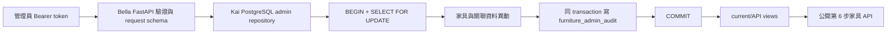

# RoomPilot 家具 PostgreSQL 管理 CRUD（Phase 2）

更新日期：2026-07-27
主要 owner：Kai（Catalog／PostgreSQL）
協作 owner：Bella（FastAPI 接入）

## 目標與邊界

Phase 2 讓授權管理者直接維護正式家具 SQL，提供新增、部分更新、軟刪除、交易、版本衝突檢查與稽核。公開的 `/api/furniture` 保持唯讀。

- 只接受 `kind=furniture`；家電不得透過這組 API 進入第 6 步。
- `DELETE` 只把 `is_active` 設為 `false`，不移除家具、資產或歷史資料。
- GLB 與三視角圖仍由 Kai 的 S3／CloudFront 工具上傳；本 API 不接收二進位檔。
- 新增家具固定先成為 inactive 草稿。資產與 metadata 全部就緒後才能 PATCH 啟用。
- 所有寫入只能在 `ROOMPILOT_CATALOG_PROVIDER=postgres` 使用；JSON／auto 模式一律禁止寫入。
- `raw_data` 與 VLM `raw_response` 預設不回傳，只有管理 API 明確指定 `include_raw_data=true` 才會傳回。

## 資料流與 transaction



任一步驟失敗都會 rollback。PATCH 與 DELETE 可帶 `expected_updated_at`；若與資料庫目前版本不同，回傳 `409 catalog_item_version_conflict`，避免兩位管理者互相覆蓋。

## 啟用門檻

PATCH `is_active=true` 前，資料庫會在同一個 transaction 檢查：

1. `kind` 必須是 `furniture`，英文名稱與公分尺寸完整。
2. 分類存在且啟用。
3. 至少一個風格、一個房間與一筆 current VLM annotation。
4. 一個可用的 CloudFront／HTTPS GLB。
5. `front`、`side`、`angle-45` 三張可用 HTTPS 圖片。
6. 資產的 upload／validation status 必須屬於 schema 認可的 ready 狀態。

未通過時回傳 `422 catalog_item_not_ready_for_activation`，`missing` 會列出缺少項目，整筆 PATCH rollback。

## 權限設定

在專案根目錄 `.env` 設定；實際 token 不得提交 Git：

```dotenv
ROOMPILOT_CATALOG_PROVIDER=postgres
ROOMPILOT_CATALOG_ADMIN_TOKEN=請換成足夠長且隨機的秘密值
```

所有管理請求都帶：

```http
Authorization: Bearer <ROOMPILOT_CATALOG_ADMIN_TOKEN>
X-RoomPilot-Admin-Actor: kai
```

`X-RoomPilot-Admin-Actor` 會存入稽核表但不是驗證憑證；真正權限只由 Bearer token 決定。未設定 token 回傳 503，缺少或錯誤 token 回傳 401，且 token 永遠不寫入 log 或 audit。

## API

### 新增 inactive 草稿

```http
POST /api/admin/furniture
```

```json
{
  "item_id": "kai-chair-001",
  "category_code": "dining-chair",
  "catalog": "roompilot-admin",
  "name_en": "Kai Dining Chair",
  "name_zh": "Kai 餐椅",
  "primary_color": "black",
  "colors": ["black"],
  "primary_material": "wood",
  "materials": ["wood"],
  "width_cm": 45,
  "depth_cm": 52,
  "height_cm": 82,
  "price_twd": 2990,
  "styles": [
    {"style_code": "modern", "confidence": 0.9}
  ],
  "room_codes": ["dining_room"],
  "annotation": {
    "object_type_zh": "餐椅",
    "description": "黑色木質餐椅",
    "rag_text": ["餐椅", "黑色", "木質"],
    "confidence": 0.95,
    "description_source": "kai_admin"
  },
  "raw_data": {"source_note": "Kai 手動建立"}
}
```

成功回傳 `201`，且 `item.is_active=false`。`category_code`、`style_code`、`room_code` 必須已存在於 SQL 對照表，API 不會猜測或自動建立 taxonomy。

### 讀取管理資料

```http
GET /api/admin/furniture/{item_id}
GET /api/admin/furniture/{item_id}?include_raw_data=true
```

這個端點可讀 inactive 資料。預設隱藏 `raw_data`／`raw_response`；公開 `/api/furniture/{item_id}` 仍只讀 active 正式資料。

### 部分更新與啟用

```http
PATCH /api/admin/furniture/{item_id}
```

```json
{
  "name_zh": "Kai 黑色木質餐椅",
  "price_twd": 3290,
  "expected_updated_at": "2026-07-27T12:00:00+00:00"
}
```

關聯欄位 `styles`、`room_codes` 若有送出，會整組取代；未送出則保持不變。`raw_data` 使用 JSON object 淺層合併。明確送出 `annotation: null` 會取消目前 VLM annotation。完成資產上傳後可送：

```json
{
  "is_active": true,
  "expected_updated_at": "2026-07-27T12:05:00+00:00"
}
```

### 軟刪除

```http
DELETE /api/admin/furniture/{item_id}
DELETE /api/admin/furniture/{item_id}?expected_updated_at=2026-07-27T12:10:00%2B00:00
```

成功回傳 `200` 與 `action=soft_deleted`。資料仍可由管理 GET 與 audit 查到，但不再出現在 `furniture_catalog_current`、公開 API、2D 或 3D 場景。

## 狀態碼

| 狀態 | 用途 |
|---|---|
| 201 | 新增 inactive 草稿成功 |
| 200 | 管理讀取、PATCH 或軟刪除成功 |
| 401 | Bearer token 缺少或錯誤 |
| 404 | `item_id` 不存在 |
| 409 | `item_id` 重複或 `expected_updated_at` 衝突 |
| 422 | request、taxonomy reference 或啟用門檻不合法 |
| 503 | 未設定管理 token、非 strict PostgreSQL 模式或資料庫不可用 |

## 稽核與來源資料注意事項

`roompilot.furniture_admin_audit` 保存 action、actor、changed fields、異動前後 JSON 與時間；audit 與實際變更一起 commit。它不保存 Bearer token。

官方 JSON／CSV importer 仍是批次重建與資料交付工具。對既有匯入家具做的 SQL PATCH，日後再次 UPSERT 相同 `item_id` 時可能被來源檔內容覆蓋；需永久保留的修正必須同步回 Kai 的正式來源資料，並重新 dry-run。由管理 API 新增且不與來源重複的 `admin_api` item 不受一般 importer 影響。

## 組員執行與驗證

```powershell
Set-Location 'D:\RoomPilot-Agent'
.\.venv\Scripts\python.exe scripts/sql/import_official_catalog_to_postgres.py --dry-run
.\.venv\Scripts\python.exe -m pytest -q tests/test_postgres_catalog_crud.py tests/test_postgres_catalog_contract.py tests/test_official_catalog_sql.py
.\.venv\Scripts\python.exe -m pytest -q
git diff --check
git status --short
```

實庫 schema／view 檢查：

```sql
SELECT TO_REGCLASS('roompilot.furniture_admin_audit');

SELECT item_id, action, actor, changed_fields, created_at
FROM roompilot.furniture_admin_audit
ORDER BY event_id DESC
LIMIT 20;

SELECT COUNT(*)
FROM roompilot.furniture_catalog_api_current
WHERE kind = 'furniture';
```
