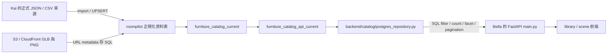

# RoomPilot 家具 PostgreSQL 正式 Read 串接（Phase 1）

更新日期：2026-07-31
主要負責人：Kai（catalog / SQL）
協作負責人：Bella（FastAPI 對外契約）

## 這一階段完成什麼

Phase 1 只處理「正式家具型錄的讀取路徑」：

- `/api/furniture` 的篩選、搜尋、總筆數、facet 與分頁改由 PostgreSQL 執行。
- `/api/furniture/{item_id}` 使用 `item_id` 主鍵查詢，不再掃描 8,675 筆 catalog／8,076 筆 active API 資料的 Python list。
- `/api/furniture/{item_id}/model` 優先由 PostgreSQL 取得 CloudFront GLB URL。
- FastAPI 使用共用的 thread-safe PostgreSQL connection pool。
- SQL row 轉成既有前端 contract，Bella 的 library / scene 不需要改欄位名稱。
- 正式 `postgres` 模式連線失敗時回傳 HTTP 503，不會悄悄混用舊 JSON。
- 仍可明確設定 `ROOMPILOT_CATALOG_PROVIDER=json` 做離線開發。

這一階段**不包含**家具 POST/PATCH/DELETE、`ProjectStore` SQLite 搬遷、問卷／材質／工程單價搬遷，也不改家具擺位合法性。家具座標與碰撞規則仍只有 `backend/engine/` 能決定。

## 資料流



重點：GLB 與圖片位元組仍放 S3／CloudFront；PostgreSQL 保存 item metadata、關聯、狀態與 delivery URL。HTTP request/response 繼續使用 JSON 是正常 API 格式，不代表 runtime 仍把 JSON 檔當資料庫。

## 負責範圍與跨模組契約

| 項目 | Owner | 輸入 | 輸出 / 契約 |
|---|---|---|---|
| 正式 catalog、manifest、匯入與 SQL schema | Kai | 5 份正式 JSON／CSV 資料 | 正規化 tables 與兩個 current views |
| PostgreSQL repository 與 row mapping | Kai | `CatalogQuery` | `CatalogPage`、單筆家具 payload |
| `/api/furniture` 與 HTTP 錯誤 | Bella | Query parameters | 既有 furniture API response shape |
| 家具選擇策略 | Yen | API 家具候選 | Agent selection |
| 擺位、碰撞、淨空 | AnCai / engine | 家具尺寸與場景 | 合法 scene placement |

跨資料夾修改原因：SQL 與 catalog 是 Kai 的 producer，但正式 FastAPI route 是 Bella 的 consumer，因此 Phase 1 同時補 producer contract test 與 consumer API test。

## 主要程式位置

- `backend/catalog/postgres_repository.py`
  - 讀取 `.env`（不輸出帳密）。
  - 建立 `ThreadedConnectionPool`。
  - 將六種 UI 風格映射到資料庫來源風格。
  - 執行 parameterized SQL，處理 filter/count/facet/pagination。
  - 將 SQL row 轉成既有 furniture scene/card contract。
- `scripts/sql/roompilot_postgresql_schema.sql`
  - `roompilot.furniture_catalog_current`：正規化表與資產的目前版聚合。
  - `roompilot.furniture_catalog_api_current`：API taxonomy、安全預設與顯示欄位。
- `backend/server/main.py`
  - 只接收 HTTP query、呼叫 repository、組回既有 API response。
  - 不在 FastAPI 內複製 SQL 或 catalog 演算法。
- `backend/server/postgres_catalog.py`
  - 舊 import path 的相容 shim；新程式應直接引用 `backend.catalog.postgres_repository`。

## Provider 模式

### 正式環境（必須）

```dotenv
ROOMPILOT_CATALOG_PROVIDER=postgres
```

此模式是 strict mode。資料庫、driver 或 `roompilot.furniture_catalog_api_current` 不可用時，家具 API 回傳：

```json
{
  "detail": {
    "code": "postgres_catalog_unavailable",
    "message": "正式家具資料庫目前無法使用；請檢查 PostgreSQL 連線與 catalog view。",
    "reason": "實際例外類型"
  }
}
```

HTTP status 是 `503 Service Unavailable`，不會在正式流量中偷偷讀 JSON。

### 明確離線模式

```dotenv
ROOMPILOT_CATALOG_PROVIDER=json
```

只有本機沒有 PostgreSQL、需要展示或跑離線測試時使用。這是明確選擇的備援，不是正式 source of truth。

### 未設定 provider

Phase 5 起，完全沒有 `.env` 設定時也採 strict PostgreSQL；不再存在 `auto → JSON`。離線開發必須明確設定 `ROOMPILOT_CATALOG_PROVIDER=json`。

## 第一次設定與資料更新

1. 安裝 server、catalog 與測試依賴：

   ```powershell
   uv sync --extra server --extra catalog --group dev
   ```

2. 從 `.env.example` 複製 `.env`，填入本機 PostgreSQL 帳密。帳密不可 commit。

   ```dotenv
   ROOMPILOT_CATALOG_PROVIDER=postgres
   DB_HOST=localhost
   DB_PORT=5432
   DB_NAME=roompilot_db
   DB_USER=postgres
   DB_PASSWORD=你的本機密碼
   DB_SSLMODE=disable
   DB_CONNECT_TIMEOUT=10
   DB_POOL_MIN=1
   DB_POOL_MAX=8
   DB_APPLICATION_NAME=roompilot_catalog_import
   ```

3. 先做不連線、不寫入的資料 dry-run：

   ```powershell
   uv run --extra catalog python scripts/sql/import_official_catalog_to_postgres.py --dry-run
   ```

4. 正式匯入。Importer 會在同一 transaction 執行 schema，因此會建立／更新 Phase 1 API view：

   ```powershell
   uv run --extra catalog python scripts/sql/import_official_catalog_to_postgres.py --create-database
   ```

   資料庫已存在時移除 `--create-database` 即可。不要加 `--skip-schema`，否則新的 API view 不會更新。

5. 啟動唯一正式 FastAPI：

   ```powershell
   uv run --extra server uvicorn backend.server.main:app --port 8002
   ```

## API 使用方式

列表與分頁：

```text
GET /api/furniture?page=1&page_size=24&has_model=true
```

SQL 篩選：

```text
GET /api/furniture?style=scandinavian&group=living&type=sofa&q=木質&color=灰色&material=木材&size=large&page=1&page_size=24&has_model=true
```

參數：

| 參數 | SQL 行為 |
|---|---|
| `style` | `style_codes` array overlap；六種 UI 風格會映射到來源風格 |
| `group` | `taxonomy_group` 等值篩選 |
| `type` | `normalized_type` 等值篩選 |
| `q` | 名稱、ID、分類、色彩、材質、房間、描述與 RAG text 的 substring search |
| `color` / `material` | 中英文 facet alias 正規化後等值篩選 |
| `size` | 寬／深最長邊分成 small、medium、large |
| `has_model` | 是否具有可用的 `glb_url` |
| `page` / `page_size` | SQL `LIMIT` / `OFFSET`，`page_size` 最大 80 |

單筆詳情：

```text
GET /api/furniture/{item_id}
```

模型 URL：

```text
GET /api/furniture/{item_id}/model
```

CloudFront 模式會回傳 `307` 到 SQL 中的正式 delivery URL。

## 驗證方式

Focused tests：

```powershell
uv run --extra server --extra catalog --group dev pytest tests/test_postgres_catalog_contract.py -q
uv run --extra server --extra catalog --group dev pytest tests/test_library_mode1.py tests/test_catalog_six_style_contract.py -q
```

完整 gate：

```powershell
uv run --extra server --extra catalog --group dev pytest -q
git diff --check
```

資料庫驗收 SQL：

```sql
SELECT COUNT(*)
FROM roompilot.furniture_catalog_api_current
WHERE kind = 'furniture';

SELECT item_id, glb_url, front_image_url, side_image_url, angle_45_image_url
FROM roompilot.furniture_catalog_api_current
WHERE kind = 'furniture'
ORDER BY item_id
LIMIT 5;
```

5 份正式匯入來源的家具 ID 皆為 8,675 筆；正式總表應為 8,675 筆，`roompilot.furniture_catalog_current` 與 `roompilot.furniture_catalog_api_current` 則只提供其中 8,076 筆 active／RAG-indexable 家具。另 599 筆 inactive 家具保留在總表供複核，不得進正式 API／RAG。

## Phase 1 驗收清單

- [x] PostgreSQL 總表是 8,675 筆家具；current/API view 是 8,076 筆 active 家具，另有 599 筆 inactive 家具保留複核。
- [x] 8,675 筆 catalog 家具各有 1 個 ready/uploaded GLB URL。
- [x] 8,675 筆 catalog 家具各有 front / side / angle-45 三張 ready/uploaded 圖片 URL（共 26,025 張）。
- [x] `/api/furniture` 不先載入完整 SQL catalog 再由 Python 篩選。
- [x] filter、search、count、facet、pagination 由 repository SQL 執行。
- [x] 家具詳情使用 `item_id` 查詢。
- [x] 正式 PostgreSQL 失效時明確回傳 503。
- [x] JSON 只剩明確指定的離線模式；未設定 provider 仍採 strict PostgreSQL。
- [x] API response 保持 Bella 既有 contract。
- [x] 已用正式 `.env` 完成 live PostgreSQL 與 FastAPI smoke test。

現行資料契約驗收值：正式總表與 GLB 各 8,675 筆、current/API view 8,076 筆、inactive 599 筆、三視角圖片 26,025 張。Live PostgreSQL 驗收必須與 importer dry-run 的這組數量一致；`/api/furniture` 只回傳 active 資料。
