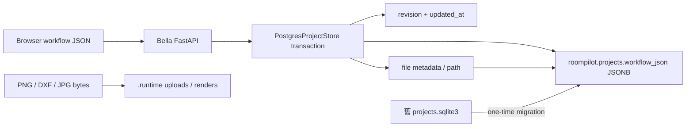

# RoomPilot PostgreSQL 專案保存（Phase 3）

更新日期：2026-07-27
主要 owner：Bella（專案保存／FastAPI）
協作 owner：Kai（PostgreSQL schema／migration）

## 完成範圍

Phase 3 將正式專案與 render metadata 從 SQLite 搬到 PostgreSQL：

- `roompilot.projects`
- `roompilot.render_outputs`
- `roompilot.engineering_snapshots`
- `roompilot.engineering_jobs`
- `roompilot.engineering_packages`
- `roompilot.engineering_documents`
- `workflow_json TEXT` 改為 `workflow_json JSONB`
- 保留 `revision` 與 `updated_at` optimistic concurrency
- 提供只讀 dry-run 與一次性 SQLite → PostgreSQL migration
- PostgreSQL 不可用時回傳明確 `503 project_store_unavailable`，不自動改寫 SQLite

`layout_json`、問卷、`scene_json`、逐房視角與 render context 仍維持原本 workflow response contract，只是底層以 JSONB 保存。FastAPI URL 與前端 payload 不需更改。

## 儲存邊界



- PostgreSQL 是 workflow 與檔案 metadata 的正式來源。
- 工程 Snapshot／job／ReportPayload／文件 metadata 使用相同 provider；SQLite 離線模式
  亦使用同一份 `projects.sqlite3`，不建立前端直連或第二套正式資料庫。
- `engineering_snapshots` 以 `(project_id, design_revision)` 唯一，鎖定後應用層禁止覆寫；
  `snapshot_hash` 串接 package 與三份輸出，確保文件來自同一鎖定 Snapshot。
- PNG、JPG、DXF 與 render PNG 仍是 `.runtime` 檔案，不放入 JSONB。
- `.runtime`、SQLite、上傳檔與 render 檔仍不得提交 Git。
- SQLite 遷移後保留，作為 rollback 證據；migration 不刪除或修改來源檔。

## Provider 設定

正式 `.env`：

```dotenv
ROOMPILOT_PROJECT_STORE_PROVIDER=postgres
DB_PROJECT_APPLICATION_NAME=roompilot_project_store
```

離線開發才明確設定：

```dotenv
ROOMPILOT_PROJECT_STORE_PROVIDER=sqlite
```

沒有設定時為了舊環境相容仍採 SQLite；正式部署必須明確指定 `postgres`。兩種 provider 都實作相同 `ProjectStore` 方法，FastAPI 不做靜默 fallback。

## Transaction 與衝突控制

工作流程更新、上傳 metadata、render metadata 都會：

1. 開啟 PostgreSQL transaction。
2. `SELECT ... FOR UPDATE` 鎖定專案列。
3. 核對 `expected_revision`，pending replay 另核對 `expected_updated_at`。
4. 合併並壓縮 workflow；序列化後仍限制在 2 MB。
5. 更新 JSONB、revision 與 timestamp。
6. transaction 成功才 commit；任何錯誤 rollback。

衝突行為保持原 API 契約：

- revision 衝突：HTTP 409，`project_revision_conflict`
- pending replay timestamp 衝突：HTTP 409，`project_version_conflict`
- workflow 超過 2 MB：HTTP 413，`workflow_too_large`
- PostgreSQL／schema 不可用：HTTP 503，`project_store_unavailable`

## 一次性 migration

遷移前先停止正在寫入專案的 server。Dry-run 只讀 SQLite snapshot，不連 PostgreSQL：

```powershell
Set-Location 'D:\RoomPilot-Agent'
.\.venv\Scripts\python.exe scripts/project_store/migrate_sqlite_projects_to_postgres.py
```

確認錯誤為 0 後套用：

```powershell
.\.venv\Scripts\python.exe scripts/project_store/migrate_sqlite_projects_to_postgres.py --apply
```

工具會在單一 PostgreSQL transaction 中：

1. 套用 `scripts/project_store/roompilot_project_store_schema.sql`。
2. 將 SQLite workflow 解碼為 JSON object。
3. UPSERT 較新 revision／updated_at 的 project。
4. 匯入不重複的 render metadata。
5. 驗證所有來源 project／render ID 都存在。
6. 保留原 `.runtime/projects.sqlite3` 與檔案。

重跑 migration 是 idempotent；PostgreSQL 較新的 revision 不會被舊 SQLite 覆蓋。

2026-07-27 本機正式 migration 結果：47 個 project、0 個 render metadata、0 錯誤、0 遺失檔案，全部驗證成功。這個數量包含當時保存在共用 `.runtime` 的專案；不同組員環境數量可不同。

## Rollback

若 PostgreSQL 專案保存需要暫時停用：

1. 停止 FastAPI。
2. 把 `.env` 明確改為 `ROOMPILOT_PROJECT_STORE_PROVIDER=sqlite`。
3. 確認保留的 `.runtime/projects.sqlite3` 後再啟動。

PostgreSQL 啟用期間的新專案不會自動反向同步到 SQLite，因此 rollback 僅供故障排查；切回前應先匯出或確認資料差異。

## 暫不拆分 scene objects

目前 API 每次以完整 workflow/project ID 讀寫，沒有依家具物件或事件查詢的正式需求，因此 Phase 3 不建立 `project_scene_objects` 或 `scene_object_events`。日後若需要跨專案家具統計、事件回放或局部更新，再以 versioned contract 從 `scene_json` 衍生，不能成為第二套幾何真相。

## 驗證

```powershell
.\.venv\Scripts\python.exe -m pytest -q tests/test_postgres_project_store.py tests/test_project_store_hardening.py tests/test_project_workflow_api.py
$env:ROOMPILOT_TEST_POSTGRES_PROJECTS='1'
.\.venv\Scripts\python.exe -m pytest -q tests/test_postgres_project_store.py::test_live_postgres_project_jsonb_revision_render_and_cleanup
.\.venv\Scripts\python.exe -m pytest -q
git diff --check
git status --short
```

SQL 檢查：

```sql
SELECT COUNT(*) FROM roompilot.projects;
SELECT COUNT(*) FROM roompilot.render_outputs;
SELECT COUNT(*) FROM roompilot.engineering_snapshots;
SELECT COUNT(*) FROM roompilot.engineering_packages;
SELECT COUNT(*) FROM roompilot.engineering_documents;

SELECT project_id, revision, JSONB_TYPEOF(workflow_json), updated_at
FROM roompilot.projects
ORDER BY updated_at DESC
LIMIT 20;
```
