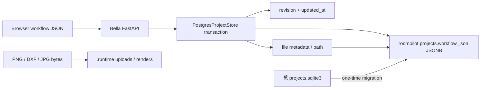

# RoomPilot PostgreSQL 專案保存（Phase 3）

更新日期：2026-07-31
主要 owner：Bella（專案保存／FastAPI）
協作 owner：Kai（PostgreSQL schema／migration）

## 現行可用性（2026-07-31）

- `backend/server/postgres_project_store.py` 與 `roompilot.projects`／`roompilot.render_outputs` 的 runtime path 仍存在。
- `scripts/project_store/` 已不在目前 repository，schema 與 SQLite→PostgreSQL migration 指令不可執行。
- Live PostgreSQL 尚無 `roompilot.engineering_snapshots`、`engineering_jobs`、`engineering_packages`、`engineering_documents`。
- 因此本契約保留 project／revision／provider 邊界；migration 與 engineering PostgreSQL tables 是待恢復項目，不是目前可宣稱完成的操作能力。

## 完成範圍

Phase 3 將正式專案與 render metadata 從 SQLite 搬到 PostgreSQL：

- `roompilot.projects`
- `roompilot.render_outputs`
- `workflow_json TEXT` 改為 `workflow_json JSONB`
- 保留 `revision` 與 `updated_at` optimistic concurrency
- PostgreSQL 不可用時回傳明確 `503 project_store_unavailable`，不自動改寫 SQLite

下列為尚未在目前 repository／live DB 就緒的契約目標：

- `roompilot.engineering_snapshots`
- `roompilot.engineering_jobs`
- `roompilot.engineering_packages`
- `roompilot.engineering_documents`
- 只讀 dry-run 與一次性 SQLite → PostgreSQL migration 工具

`layout_json`、問卷、`scene_json`、逐房視角與 render context 仍維持原本 workflow response contract，只是底層以 JSONB 保存。FastAPI URL 與前端 payload 不需更改。

## 儲存邊界



- PostgreSQL 是 workflow 與檔案 metadata 的正式來源。
- 工程 Snapshot／job／ReportPayload／文件 metadata 的目標是使用相同 provider；目前 PostgreSQL engineering tables 未就緒，不能宣稱已完成此保存邊界。SQLite 離線模式仍使用同一份 `projects.sqlite3`。
- `engineering_snapshots` 以 `(project_id, design_revision)` 唯一，鎖定後應用層禁止覆寫；
  `snapshot_hash` 串接 package 與三份輸出，確保文件來自同一鎖定 Snapshot。
- PNG、JPG、DXF 與 render PNG 仍是 `.runtime` 檔案，不放入 JSONB。
- `.runtime`、SQLite、上傳檔與 render 檔仍不得提交 Git。
- SQLite 遷移後保留，作為 rollback 證據；migration 不刪除或修改來源檔。

## Provider 設定

正式 `.env`：

```dotenv
ROOMPILOT_PROJECT_STORE_PROVIDER=postgres
DB_PROJECT_APPLICATION_NAME=roompilot_project_store
```

離線開發才明確設定：

```dotenv
ROOMPILOT_PROJECT_STORE_PROVIDER=sqlite
```

沒有設定時為了舊環境相容仍採 SQLite；正式部署必須明確指定 `postgres`。兩種 provider 都實作相同 `ProjectStore` 方法，FastAPI 不做靜默 fallback。

## Transaction 與衝突控制

工作流程更新、上傳 metadata、render metadata 都會：

1. 開啟 PostgreSQL transaction。
2. `SELECT ... FOR UPDATE` 鎖定專案列。
3. 核對 `expected_revision`，pending replay 另核對 `expected_updated_at`。
4. 合併並壓縮 workflow；序列化後仍限制在 2 MB。
5. 更新 JSONB、revision 與 timestamp。
6. transaction 成功才 commit；任何錯誤 rollback。

衝突行為保持原 API 契約：

- revision 衝突：HTTP 409，`project_revision_conflict`
- pending replay timestamp 衝突：HTTP 409，`project_version_conflict`
- workflow 超過 2 MB：HTTP 413，`workflow_too_large`
- PostgreSQL／schema 不可用：HTTP 503，`project_store_unavailable`

## 一次性 migration（目前不可執行）

歷史流程預期由下列兩個檔案提供，但目前都不存在：

```text
scripts/project_store/migrate_sqlite_projects_to_postgres.py
scripts/project_store/roompilot_project_store_schema.sql
```

恢復前必須同時補回 schema、dry-run、transactional importer 與測試。預期工具行為為：

1. 套用 project store schema。
2. 將 SQLite workflow 解碼為 JSON object。
3. UPSERT 較新 revision／updated_at 的 project。
4. 匯入不重複的 render metadata。
5. 驗證所有來源 project／render ID 都存在。
6. 保留原 `.runtime/projects.sqlite3` 與檔案。

恢復後的 migration 必須維持 idempotent，且 PostgreSQL 較新的 revision 不得被舊 SQLite 覆蓋。

2026-07-27 的 47 個 project migration 數字只保留作歷史證據，不代表目前 repository 仍能重跑該流程。

## Rollback

若 PostgreSQL 專案保存需要暫時停用：

1. 停止 FastAPI。
2. 把 `.env` 明確改為 `ROOMPILOT_PROJECT_STORE_PROVIDER=sqlite`。
3. 確認保留的 `.runtime/projects.sqlite3` 後再啟動。

PostgreSQL 啟用期間的新專案不會自動反向同步到 SQLite，因此 rollback 僅供故障排查；切回前應先匯出或確認資料差異。

## 暫不拆分 scene objects

目前 API 每次以完整 workflow/project ID 讀寫，沒有依家具物件或事件查詢的正式需求，因此 Phase 3 不建立 `project_scene_objects` 或 `scene_object_events`。日後若需要跨專案家具統計、事件回放或局部更新，再以 versioned contract 從 `scene_json` 衍生，不能成為第二套幾何真相。

## 驗證

目前可執行的 runtime 測試：

```powershell
.\.venv\Scripts\python.exe -m pytest -q tests/test_project_store_hardening.py tests/test_project_workflow_api.py
```

`tests/test_postgres_project_store.py` 與 `tests/test_engineering_snapshot_api.py` 的 PostgreSQL schema 驗證需等 `scripts/project_store/` 恢復後才能作為通過門檻。

SQL 檢查：

```sql
SELECT COUNT(*) FROM roompilot.projects;
SELECT COUNT(*) FROM roompilot.render_outputs;
```

下列 tables 目前應明確回報缺失，直到 schema 恢復並完成 migration：

```sql
SELECT TO_REGCLASS('roompilot.engineering_snapshots');
SELECT TO_REGCLASS('roompilot.engineering_jobs');
SELECT TO_REGCLASS('roompilot.engineering_packages');
SELECT TO_REGCLASS('roompilot.engineering_documents');
```

恢復後才執行：

```sql
SELECT COUNT(*) FROM roompilot.engineering_snapshots;
SELECT COUNT(*) FROM roompilot.engineering_packages;
SELECT COUNT(*) FROM roompilot.engineering_documents;

SELECT project_id, revision, JSONB_TYPEOF(workflow_json), updated_at
FROM roompilot.projects
ORDER BY updated_at DESC
LIMIT 20;
```
