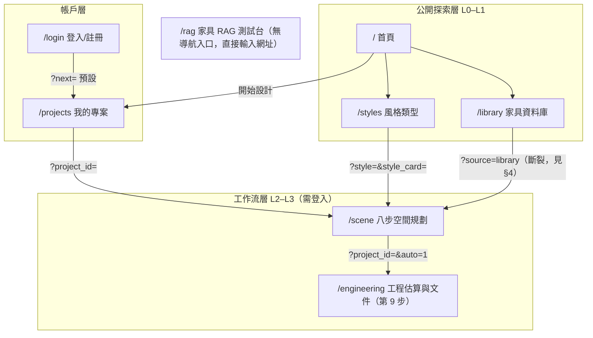

# 資訊架構 (Information Architecture) - RoomPilot

> **版本:** v1.0 | **更新:** 2026-08-07 | **狀態:** 草稿
> **Owner:** Bella（`frontend/` 與 `backend/server/` 頁面路由）
> **語域:** L2（橋接）
>
> **MECE 邊界**：本文件只談**全站結構**——頁面總覽、導航、URL 路由、跨頁資料載體。
> 使用者旅程歸 [`ux_research_and_journey.md`](./ux_research_and_journey.md)；單頁欄位、狀態與互動歸各頁 `ui_spec-<page>.md`；
> 八步產品流程的唯一權威是根目錄 `README.md`「現行八步流程」，本文件不重述其內容。
> **實例:** 單例（全站一份）
> **生成:** 2026-08-07 由 VibeCoding_Workflow_Templates/02_ux_ui/information_architecture.md 導入 | 基準 docs/vibecoding-restructure @ 1268b2b4

設計原則（自現行程式碼歸納，質化）：每頁 1 個主要目標；`/scene` 採線性精靈（同一時間只顯示一個步驟面板）；進階功能漸進揭露（步驟完成才解鎖、`/library` 進階篩選預設隱藏）；導航深度 ≤ 3 層（`/` → `/projects` → `/scene` → `/engineering`）。

---

## 目錄

- [1. 頁面總覽](#1-頁面總覽)
- [2. 導航結構](#2-導航結構)
- [3. URL 結構與路由表](#3-url-結構與路由表)
- [4. 跨頁資料模型](#4-跨頁資料模型)
- [5. 檢查清單](#5-檢查清單)
- [6. 追溯](#6-追溯)

## 1. 頁面總覽

全站共 **8 個 FastAPI 供應的靜態 HTML 頁面**（2026-08-07 以 runtime 路由清單實測；無前端框架、無打包器，原生 ES module + 本機 vendor Three.js）。舊文件描述的獨立 Vite 子專案 `frontend3d/` 已不存在於 repo（實測 `Test-Path` = False）。

| # | 路由 | 頁面檔案（行數） | `<title>` | 主要職責（單一） | 入口 script | 登入 | 層級 |
| :--- | :--- | :--- | :--- | :--- | :--- | :--- | :--- |
| 0 | `/` | `frontend/index.html`（91） | RoomPilot \| AI 室內配置與 3D 預覽 | 行銷落地與功能導覽 | `home.js`（118 行） | 否 | L0 |
| 1 | `/login` | `frontend/login.html`（111） | RoomPilot \| 登入 | 登入／註冊（designer 或 client 身分） | `login.js`（88 行） | 否 | L0 |
| 2 | `/projects` | `frontend/projects.html`（91） | RoomPilot \| 我的專案 | 專案列表、建立、開啟、帳號設定與登出 | `projects.js`（265 行） | 是 | L1 |
| 3 | `/styles` | `frontend/styles.html`（52） | 查看風格類型 | 6 風格 × 3 色卡＝18 組色卡瀏覽與選擇 | `styles.js`（1,255 行） | 否 | L1 |
| 4 | `/library` | `frontend/library.html`（171） | 家具資料庫｜RoomPilot | 家具型錄瀏覽、3D 檢視、方案清單 | `library.js`（760 行） | 否 | L1 |
| 5 | `/scene` | `frontend/scene.html`（1,239） | RoomPilot 空間規劃 | 八步空間規劃精靈（唯一深度頁） | `scene_v2.js`（13,259 行） | 是 | L2 |
| 6 | `/engineering` | `frontend/engineering.html`（122） | RoomPilot 工程估算與文件 | 第 9 步：鎖定 revision 並產生 HTML/XLSX/JSON 成果 | `engineering.js`（597 行） | 是 | L3 |
| 7 | `/rag` | `frontend/rag.html`（130） | 家具 RAG 測試台｜RoomPilot | Django 向量家具檢索的內部驗證台 | `rag.js`（374 行） | 是 | 獨立 |

**總計:** 8 頁。每頁的欄位、狀態、互動細節見各頁 `ui_spec-<page>.md`。

補充事實（實測）：

- `/scene` 的進度列為 **8 顆 UI 步驟按鈕**（scene.html:24 `data-workflow-count="8"`），對應 `frontend/scene_workflow.js:4-16` 的 **11 個內部步驟**——`recognition`＋`calibration` 共用 `scale` 面板、`layout_2d`＋`white_model_3d`＋`realistic_3d` 在 UI 上收成「配置與預覽」一顆按鈕（scene.html:25-32 與 `WORKFLOW_PANEL_BY_STEP`）。舊文件（2026-07-26）的「10 顆按鈕」已不成立。
- `scene_v2.js` 靜態 import **30 個本地模組**（`rg 'from "\./'` 去重實測），舊文件寫 17 個已過時。
- Three.js 改由本機 vendor 供應：importmap 指向 `/static/vendor/three/`（scene.html:1228-1234），不再使用 unpkg CDN。
- 已知內容過時（單頁層級，詳見各 `ui_spec`）：index.html:62 與 home.js:15 仍寫「12 種風格」且流程卡只列 5 步舊流程，與現行 6 風格 18 色卡（styles.html:30）及八步流程不符；rag.html:32 寫「9,349 筆正式家具」，與 DB 實際可選數不一致（多來源不一致，見 [`db_design.md`](../04_design/db_design.md)）。

---

## 2. 導航結構

### 2.1 主導航（topbar，各頁差異為實測現況）

| 頁面 | topnav 項目 | CTA | 備註 |
| :--- | :--- | :--- | :--- |
| `/` | 探索功能、風格類型、家具資料庫、3D 場景展示、我的專案 | 開始設計 → `/projects` | 唯一含「我的專案」的公開頁 |
| `/login` | 探索功能、風格類型、家具資料庫 | 無 | 無 scene 入口 |
| `/projects` | 我的專案、風格類型、家具資料庫、登出（button） | 建立新專案（頁內） | 登入後的 hub；無 `/scene` 直連（一律帶 `project_id` 開啟） |
| `/styles` | 探索功能、風格類型、家具資料庫、3D 場景展示 | 開始設計 → `/scene` | 無「我的專案」 |
| `/library` | 探索功能、**風格模型**、家具資料庫、3D 場景展示 | 開始設計 ✦ → `/scene` | ⚠️ library.html:19 字樣「風格模型」與其他頁「風格類型」不一致（沿用 2026-07-26 版發現，2026-08-07 複核仍存在） |
| `/rag` | 探索功能、風格類型、家具資料庫、3D 場景展示 | 無 | 全站沒有任何頁面連到 `/rag`（`rg 'href="/rag"'` 零命中）——內部測試台，靠直接輸入網址 |
| `/scene` | **無 topnav**：brand（`#exit-project` 離開專案回首頁）＋保存狀態＋工程文件連結（`#engineering-documents-link`，URL 有 `project_id` 才顯示，engineering_link.js:4-13）＋重新開始 | 隨步驟變化 | 設計意圖：工作流中不提供跳頁入口 |
| `/engineering` | 獨立極簡 topbar：brand ＋「返回設計專案」（engineering.js:342 動態改寫為 `/scene?project_id=…`） | 頁內動作 | 唯一不載 `site.css` 的頁（自帶 inline CSS） |

### 2.2 `/scene` 進度列：8 顆 UI 按鈕 ↔ 11 個內部步驟（scene.html:25-32 ↔ scene_workflow.js:4-30）

| UI 按鈕 | 內部 step id | 面板 `data-panel` |
| :--- | :--- | :--- |
| 1 建立專案 | `project` | `project` |
| 2 上傳平面圖 | `upload` | `upload` |
| 3 確定尺寸 | `recognition`＋`calibration` | `scale`（兩步共用） |
| 4 空間與結構 | `space_confirmation` | `space` |
| 5 需求問卷 | `requirements` | `requirements` |
| 6 配置與預覽 | `layout_2d`＋`white_model_3d`＋`realistic_3d` | `layout-2d`／`white-model-3d`／`realistic-3d` |
| 7 方案鎖定與視角 | `proposal_review` | `proposal-review` |
| 8 AI 渲染與成果包 | `ai_render` | `ai-render` |

各步驟的互動與 API 呼叫歸 `ui_spec-scene` 與旅程文件；本表只固定「按鈕 ↔ 內部狀態」的對照，跨文件引用內部步驟時以 step id 為準。

- 麵包屑：無（全站未實作）。
- Footer：無（八頁皆無 footer 導航）。
- 頁內導航：`/scene` 的 `nav.rp-progress` 8 顆步驟按鈕可回到已完成步驟，未完成步驟由前端 `REQUIRED_COMPLETIONS`（scene_workflow.js:43-105）擋下。
- 返回機制：瀏覽器 back ＋ brand 連結。`/scene` 內部步驟切換不寫入 history（只有 `history.replaceState`，scene_v2.js:1537、12818、13202），瀏覽器 back 會直接離開工作流而非回上一步（沿用 2026-07-26 版發現，複核仍成立）。
- 登入導流：受保護頁面在啟動時呼叫 `requireSignedIn()`（auth_client.js:235-241），未登入導向 `/login?next=<原路徑+query>`；`next` 只接受同源相對路徑，預設 `/projects`（login.js:14-19）。

---

## 3. URL 結構與路由表

命名規範（現況歸納）：頁面路由為小寫單字、無巢狀、無資源 ID 路徑；查詢參數 `snake_case`（`project_id`、`style_card`、`auto`、`next`）；靜態資產一律 `/static/*`（main.py:340 唯一 mount，舊文件的 `/docs-assets` 掛載已移除）；JS/CSS 引用附 `?v=<sha256 片段>` 快取破壞參數；URL 不含 token——身分放 `Authorization` header，媒體下載走 blob URL 避免 token 進網址（auth_client.js:209-221）。

### 3.1 頁面路由表（2026-08-07 runtime 實測）

| 路由 | 頁面 | 伺服器認證 | 前端守衛 | 快取 | Query 參數（讀取方） |
| :--- | :--- | :--- | :--- | :--- | :--- |
| `/` | index.html（main.py:947） | 無 | 無 | 預設 | — |
| `/login` | login.html（main.py:952） | 無 | 已登入者自動轉往 `next`（login.js:84-86） | `no-store` | `next`（login.js:15；限同源相對路徑） |
| `/projects` | projects.html（main.py:961） | 無 | `requireSignedIn`（projects.js:260） | `no-store` | — |
| `/styles` | styles.html（main.py:969） | 無 | 無 | 預設 | — |
| `/library` | library.html（main.py:974） | 無 | 無 | 預設 | — |
| `/scene` | scene.html（main.py:979） | 無 | `requireSignedIn`（scene_v2.js:13257） | `no-store` | `project_id`（scene_v2.js:248）；`style`＋`style_card`（scene_v2.js:13227-13249）；`source=library`（**無消費端**，見 §4） |
| `/engineering` | engineering.html（main.py:1135） | 無 | `requireSignedIn`（engineering.js:587） | `no-store` | `project_id`（engineering.js:15）；`auto=1` 自動跑鎖定與產包（engineering.js:588） |
| `/rag` | rag.html（rag_api.py:142） | 無 | `requireSignedIn`（rag.js:371） | `no-store` | — |
| `/static/*` | 靜態資產 mount（main.py:340） | 無 | — | 預設 | — |

> **認證的 IA 決策**：頁面外殼一律公開（「頁面本身公開；授權由 API 端點負責」，main.py:954 註解），資料與行為全靠 API 守衛——`/api/projects/*` 掛 `project_reader`／`project_editor`（projects_api.py:298-602），非成員回 404 不回 403（AGENTS.md 不可違反契約）；`/api/rag/*` 掛 `current_user`（rag_api.py:32；例外：`GET /api/rag/embedding-status` 為免登入健康探針，由 shortlist router 供應，shortlist_api.py:225-231——api_spec §4 列於免登入面）；`/api/v1/*` 工程文件掛 `current_user`（engineering/api.py:353-385）。角色（designer／client／admin、專案成員 editor／viewer）見 README「帳戶端」。

### 3.2 API 路由總量（供跨文件對帳；完整規格 → [`api_spec.md`](../04_design/api_spec.md)）

以 `backend.server.main:app` runtime 展開實測（2026-08-07）：**77 條 APIRoute**＝8 條頁面路由＋69 條 API 路由（62 個唯一 `/api/*` 路徑，部分路徑多方法）；另有 FastAPI 內建 `/docs`、`/redoc`、`/openapi.json` 與 `/static` mount。舊文件的「44 條」已過時。

---

## 4. 跨頁資料模型

### 4.1 跨頁載體總表

| 來源頁面 | 目標頁面 | 載體 | 資料內容 | 現況 |
| :--- | :--- | :--- | :--- | :--- |
| `/projects` | `/scene` | URL query `project_id`（projects.js:88、221） | 專案識別字 | ✅ 主要開啟路徑；可書籤、重開網址即還原 |
| `/scene` | `/scene`（重開） | URL query `project_id`（`history.replaceState` 寫回，scene_v2.js:1537） | 同上 | ✅ |
| `/scene` | `/engineering` | URL query `project_id`（＋`auto=1`）（engineering_link.js:8-21） | 專案識別字＋自動產包旗標 | ✅ 第 8 步「輸出簡報」與「估」icon 兩個入口 |
| `/login` | 原頁面 | URL query `next`（auth_client.js:147-152 寫、login.js:14-19 讀） | 登入後返回目標 | ✅ 限同源相對路徑，防開放轉址 |
| 任何頁 | 任何頁 | `localStorage`：`roompilot.access_token`／`roompilot.refresh_token`／`roompilot.user`（auth_client.js:13-15） | 登入 session | ✅ fetch 攔截器自動附加到同源 `/api/*`；跨網域（CloudFront）絕不附帶（auth_client.js:174-196）。XSS 外洩風險為已知取捨（auth_client.js:7-10），評估歸 security 文件 |
| `/scene` | 伺服器 | `PUT /api/projects/{id}/workflow` | 全部工作流狀態（11 內部步驟完成度＋workflow JSON） | ✅ 真相來源在伺服器；伺服器只驗步驟名（無序 set，projects_api.py:52-64、333），順序由前端 `REQUIRED_COMPLETIONS` 強制 |
| `/scene` | `/scene`（離線/衝突補救） | `localStorage["roompilot.pending-save.<projectId>"]`（scene_v2.js:1099-1171） | 未送達的 workflow payload | ✅ 依 `shouldReplayPendingSave`（scene_workflow.js:32-41）決定重播或丟棄 |
| `/scene` | `/scene` | `localStorage["roompilot.workflow.v2:<projectId>"]`（scene_workflow.js:2、107-108） | 前端 workflow 快照（schema v2） | ✅ 備援快照，非真相來源 |
| `/styles` | `/scene` | URL query `style`＋`style_card`（styles.js:676-677、747-748） | 選定風格與色卡 | ✅ **本輪已接通**：scene_v2.js `applyStyleCardFromQuery()`（13227-13249）讀 query 套用色卡。⚠️ 但儲存備援通道錯接：styles.js 寫 **sessionStorage**`["roompilot:selectedStyleCard"]`（styles.js:22、587），scene_v2.js 卻讀 **localStorage** 同名 key（13231）——直接點連結有 query 沒問題，繞路進 `/scene` 時色卡選擇遺失。待修 |
| `/library` | `/scene` | `sessionStorage["roompilot:sceneProposal"]`＋query `source=library`（library.js:15、368-369） | 本次方案家具清單 | ⚠️ **仍斷裂**：scene_v2.js 無任何讀取（`rg sceneProposal` 僅 library.js 命中）；方案清單傳不進工作流（沿用 2026-07-26 版發現，2026-08-07 複核仍成立） |
| `/library` | `/library`（回訪） | `localStorage["roompilot-mode1-proposal-v1"]`／`["roompilot-mode1-favorites-v1"]`（library.js:13-14） | 方案清單、收藏 | ✅ 頁內持久化 |

### 4.2 載體選擇原則（現況歸納）

- **可書籤的只有 `project_id` 與 `next`**：工作流內容大，全部走伺服器保存，URL 只留鑰匙。
- **localStorage 用於 session 與補救快照**，不是真相來源；工作流真相在伺服器專案儲存，版本衝突以伺服器為準。
- **一次性跨頁交接用 query／sessionStorage**——現況一條已接通（styles→scene 的 query 通道）、一條半斷（storage 備援錯接）、一條全斷（library→scene）。

---

## 5. 檢查清單

- [x] 每頁在 §1 有單一職責，對應 `ui_spec-<page>.md`（本輪僅實例化 2–3 份，其餘待補）
- [x] 每個路由的認證/角色已明確（§3：頁面外殼公開、API 層守衛、404 不洩漏專案存在性）
- [x] 導航深度 ≤ 3 層（`/` → `/projects` → `/scene` → `/engineering`）
- [ ] ⚠️ 麵包屑未實作；`/scene` 以步驟進度列替代回溯，但瀏覽器 back 直接離開工作流（§2）
- [x] URL 語義化、可分享、不含機密（token 走 header 與 blob URL，§3）
- [ ] ⚠️ 跨頁資料載體不全符合 §4 原則：styles→scene storage 備援錯接、library→scene 交接無消費端
- [ ] ⚠️ 無自訂 404 頁：main.py 僅有 ProjectStore／Catalog 兩個 exception handler（main.py:297、317）、`frontend/` 無 404 頁（grep 證實），未知路徑回 FastAPI 預設 JSON，無返回主旅程的 CTA
- [ ] ⚠️ 導航字樣不一致：library.html:19「風格模型」；首頁 CTA 指向 `/projects` 而 styles/library 的 CTA 指向 `/scene`（未登入者點後者會在 `/scene` 被導去登入，動線繞遠，待裁決）

---

## 6. 追溯

| 項目 | ID／來源 |
| :--- | :--- |
| 對應需求（上游） | FR-AUTH-*（登入、角色、`next` 導流）、FR-PROJ-*（專案列表與開啟）、FR-SCENE-*（八步工作流與保存）、FR-CATALOG-*（`/library`、`/styles` 資料）、FR-RAG-*（`/rag` 測試台）、FR-RENDER-*（第 8 步）、FR-REPORT-*（`/engineering`）——編號以 [`../01_requirements/prd.md`](../01_requirements/prd.md) 為準 |
| 對應旅程 | [`ux_research_and_journey.md`](./ux_research_and_journey.md) |
| 下游文件 | 各頁 `ui_spec-<page>.md`（單頁規格）、[`../04_design/api_spec.md`](../04_design/api_spec.md)（API 完整規格與路由數對帳）、[`../03_architecture/sad.md`](../03_architecture/sad.md)（前後端拓撲） |
| 證據基準 | 本文件所有路由與行號為 2026-08-07 於 docs/vibecoding-restructure @ 1268b2b4 實測（runtime 路由展開＋`rg` 逐條核對） |
