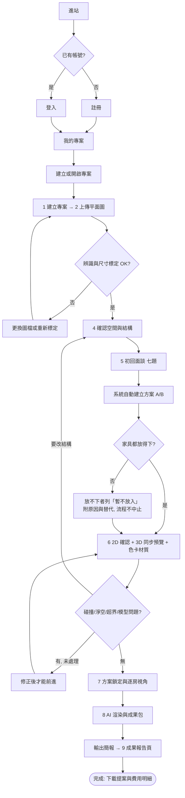

# UX 研究與使用者旅程 (UX Research & Journey) - RoomPilot

> **版本:** v1.0 | **更新:** 2026-08-07 | **狀態:** 草稿
> **Owner:** Bella（`frontend/` 與八步工作流整合負責人）
> **回答的問題:** 使用者在什麼情境下、用什麼順序完成什麼任務？哪裡會卡住？研究與 Persona 目前有什麼、缺什麼？全站頁面層級與導航歸 [information_architecture.md](./information_architecture.md)；單頁細節歸 `ui_spec-<page>.md`。
> **語域:** L1（業務）
> **實例:** 單例（整個產品一份）
> **生成:** 2026-08-07 由 VibeCoding_Workflow_Templates/02_ux_ui/ux_research_and_journey.md 導入 | 基準 docs/vibecoding-restructure @ 1268b2b4

---

## 目錄

- [1. 研究計畫 (Research Plan)](#1-研究計畫-research-plan)
- [2. 研究發現 (Research Report)](#2-研究發現-research-report)
- [3. Persona](#3-persona)
- [4. 使用者旅程 (Journey Map)](#4-使用者旅程-journey-map)
- [5. User Flow / Task Flow](#5-user-flow--task-flow)
- [6. 可用性測試 (Usability Testing)](#6-可用性測試-usability-testing)
- [7. 追溯](#7-追溯)

## 1. 研究計畫 (Research Plan)

**現況（事實陳述）：本專案至今未執行正式使用者研究。** Repo 內查無訪談紀錄、問卷回收資料或研究報告（2026-08-07 檢視）。本節內容全部為 **TO-BE 提案**，供 Pilot 客戶驗證階段排入。

| 項目 | 內容（TO-BE，未經核准） |
| :--- | :--- |
| **研究目標** | 回答三個決策問題：(1) 步驟 5「初回面談」的題目順序與時長，是否符合設計師實際首談節奏？(2) 屋主能否理解「暫不放入」家具與「結構變更需回步驟 4」的原因說明？(3) 成果報告的家具採購明細與工程費用分列方式，是否足以支撐屋主的採購決策？ |
| **對象與招募** | 室內設計師 2–3 位（實際接案者）、近期有裝修需求的屋主 3–5 位；透過團隊人脈招募（TO-BE） |
| **方法** | Pilot 驗證場次旁聽觀察＋事後半結構訪談；不另做大樣本問卷 |
| **訪談題綱** | 待撰寫；完成後以來源登錄進 `/intake`，取得 `SRC-*` 編號 |

## 2. 研究發現 (Research Report)

**無正式研究，故無可登錄的研究發現。** 本節不填造發現；以下改列「產品現行設計中內建的假設」——這些是寫在畫面文案或互動設計裡、但從未經使用者驗證的前提，是未來研究的第一批待驗題。

| 內建假設（全部未驗證） | 出現位置（產品內） | 對產品的意義 |
| :--- | :--- | :--- |
| 初回面談約 8–10 分鐘可完成 | 步驟 5 面談畫面的說明文案 | 若實際更長，會拖累首次會談體驗；影響題目取捨 |
| 設計師與客戶會同席一起操作面談 | 步驟 5 面談畫面的說明文案 | 決定文案口吻與誰持有滑鼠；遠距情境未設計 |
| 使用者能在平面圖上指出一段自己確定的實際長度 | 步驟 3 尺寸標定的前提 | 若屋主手邊沒有任何已知尺寸，步驟 3 會卡住；需要引導素材 |
| 「三項目標」上限能逼出優先序 | 步驟 5 面談的目標題設計 | 選項超過三項時的取捨行為未觀察過 |
| 方案 A／B 兩案比較足以支撐決策 | 步驟 6–7 的雙方案設計 | 是否需要第三案或逐房混搭，無證據 |

## 3. Persona

**全部為假設（未經研究驗證）**，由產品現行的帳號角色設計與畫面文案反推，非訪談產物。

| 項目 | Persona A（假設） | Persona B（假設） |
| :--- | :--- | :--- |
| **角色** | 室內設計師（產品內「設計師」帳號；主要操作者） | 屋主／客戶（產品內「客戶」帳號；檢視被分享的專案） |
| **目標** | 在首次會談中快速把屋主需求變成可看的 3D 方案，縮短溝通回合 | 看懂方案、比較兩案差異、確認費用明細後做決定 |
| **痛點** | 傳統流程從丈量到出圖週期長；需求訪談紀錄零散 | 平面圖與報價單看不懂；不確定「為什麼這件家具放不進去」 |
| **使用情境／裝置** | 事務所或客戶現場，桌機／筆電瀏覽器；與客戶同席操作面談 | 收到分享連結後自行瀏覽，唯讀 |

另有「管理者」帳號負責帳號維運（重設密碼、停用帳號），屬營運角色，不設 Persona。

## 4. 使用者旅程 (Journey Map)

旅程依 2026-08-07 現行產品實況寫成，可由前端程式碼逐段查證（座標見 [§7](#7-追溯)）。主線是：**登入選案 → 八步設計精靈 → 成果報告**。八步在同一個工作頁內以線性精靈完成，每一步完成才解鎖下一步；中途離開後重新開啟專案即從上次進度續作。

> 「情緒」欄為推測（無研究資料）；「轉換率目標」全欄為**無**——產品未定義轉換目標，亦無任何事件追蹤（2026-08-07 複核仍無分析程式碼）。

| 階段 | 使用者行為 | 情緒（假設） | 痛點（現況已知） | 產品機會 |
| :--- | :--- | :--- | :--- | :--- |
| 0 登入與選案 | 註冊或登入 → 進「我的專案」→ 建立或開啟專案 | 中性 | 忘記密碼需請管理者人工重設（無寄信機制，設計如此） | 首次使用引導（TO-BE） |
| 1 建立專案 | 輸入專案名稱與備註 | 期待 | — | — |
| 2 上傳平面圖 | 選 PNG/JPG/DXF 圖檔，勾選「已確認圖檔內容」後開始辨識 | 不確定 | 圖檔品質差時辨識結果需較多手動校正（程度未量測） | 上傳前的圖檔品質提示（TO-BE） |
| 3 確定尺寸 | 在圖上選一段自己確定的長度、輸入實際公分 | 需要思考 | 前提是使用者手邊有一段已知尺寸（§2 假設） | 常見尺寸參考（門寬等）引導（TO-BE） |
| 4 空間與結構 | 逐一確認房間名稱，再確認牆、門、窗、樑、柱；樑柱由使用者手動標定（設計決策，非辨識缺口） | 專注 | 結構確認是後續一切的地基，錯了要回頭 | — |
| 5 需求問卷（初回面談） | 七題面談：居住者、三項目標、優先空間、不可變條件、預算時程、風格方向、面談摘要；設計師與客戶一起操作；確認摘要後系統自動建立方案 A、B | 投入 | 面談時長是否如文案宣稱 8–10 分鐘，未驗證 | 面談結果即需求紀錄，可回放 |
| 6 配置與預覽 | 先確認 2D 平面配置，再進入同步 3D 預覽（自由旋轉／正俯視／室內透視走動）；選色卡即時切換牆面、地板、家具材質；可逐房比較 A/B、更換家具 | 興奮／挑剔 | 放不下的家具列入「暫不放入」並說明原因（不中止流程）；碰撞、淨空、超界或模型問題未處理會擋下一步 | 2D/3D 同畫面同步是核心賣點 |
| 7 方案鎖定與視角 | 確認家具、結構、材質與需求無誤後鎖定方案；逐房挑選並微調生成視角 | 慎重 | 鎖定前置條件多，訊息需一次講清楚 | — |
| 8 AI 渲染與成果包 | 建立色卡比較圖、送出已保存房間的渲染；按「輸出簡報」進成果報告 | 期待成果 | 渲染需等待；等待中的預期管理未研究 | 逐房成果依問卷、家具、材質與視角生成 |
| 9 成果報告 | 檢視設計風格語彙、家具採購明細、工程施工費與初步工期（採購與施工費分列、不合計），下載提案文件 | 收穫 | 查無價格的品項小計留空，不以已知小計冒充總價（誠實設計） | 報告即交付物，直接給屋主 |

**跨階段已知裂縫（已由程式碼證實，狀態：待修復或待裁決）：**

1. **探索頁交接一條半斷裂**：風格頁選好的色卡，經「開始設計」連結帶進工作頁**已可生效**；但若繞路進入工作頁（不經該連結），備援保存的寫入端與讀取端錯接，色卡選擇會遺失。家具庫頁累積的方案清單則**完全帶不進工作頁**（工作頁沒有任何接收端），使用者在家具庫頁的投入會白費。詳細通道現況見 [information_architecture.md](./information_architecture.md) §4。
2. **瀏覽器「上一頁」直接離開工作流**：工作頁內的步驟切換不寫入瀏覽歷史，按上一頁不是回上一步，而是整個離開（進度有保存，但體驗突兀）。
3. **首頁文案與現行流程有落差**：README 對步驟 5 的描述（全屋風格、材質與冷氣範圍→逐房家具）對應的是舊版問卷；現行新專案的步驟 5 是七題初回面談，家具與材質留到系統自動配置。文件與畫面的口徑差待統一。

## 5. User Flow / Task Flow

主流程（含例外路徑；完成的可觀察結果＝可下載的提案與費用明細文件）：

- 每條 flow 的入口、決策點與例外如上；結構變更一律回到步驟 4，系統會重新驗證既有家具。
- 需求確認（步驟 5 送出）後，系統在背景檢索適合的家具候選；檢索失敗不擋流程，會退回基本推薦。
- 全站頁面層級、導航與路由歸 [information_architecture.md](./information_architecture.md)；單頁細節歸 `ui_spec-<page>.md`。

## 6. 可用性測試 (Usability Testing)

**現況：未執行過任何可用性測試**（repo 內無測試紀錄；工程側的瀏覽器 QA 是功能驗證，不是使用者測試）。下表為 Pilot 階段建議任務，**全列 TO-BE**：

| 任務（TO-BE） | 完成率 | 卡點 | 改善項目 |
| :--- | :--- | :--- | :--- |
| 首次使用者從登入走到完成步驟 3 尺寸標定 | 待測 | 預測卡點：找不到「一段確定的長度」 | 待測後對應 UI Spec |
| 設計師＋屋主雙人完成初回面談並送出 | 待測 | 預測卡點：時長超過文案宣稱 | 待測後對應 UI Spec |
| 在步驟 6 理解並處理一件「暫不放入」家具 | 待測 | 預測卡點：原因說明的可理解度 | 待測後對應 UI Spec |
| 從步驟 8 輸出簡報並在報告中找到費用明細 | 待測 | 預測卡點：採購與施工費分列的理解 | 待測後對應 UI Spec |

## 7. 追溯

- **洞察 → 需求**：目前無 `SRC-*` 研究來源；未來研究發現一律以來源登錄進 `/intake` 取得 `SRC-*`，不直接改寫 PRD。本文件 §2 的「內建假設」在被驗證前，不得升級為需求依據。
- **旅程 → 需求領域**：具體 `FR-*` 編號以 [PRD](../01_requirements/prd.md) 為準；旅程階段對應的領域字首如下——階段 0（AUTH、PROJ）、階段 1（PROJ）、階段 2–4（FP、LAYOUT）、階段 5（AGENT、RAG、CATALOG）、階段 6（SCENE、ENGINE、CATALOG）、階段 7（SCENE）、階段 8（RENDER）、階段 9（REPORT）。
- **流程 → 畫面**：User Flow 的每個節點對應 [information_architecture.md](./information_architecture.md) 的頁面與 `ui_spec-<page>.md` 的狀態。
- **問卷資料語意**：步驟 5 與家具檢索、生圖的資料邊界引用 `docs/contracts/` 的三份問卷契約（QUESTIONNAIRE_RAG_HANDOFF、QUESTIONNAIRE_STYLE_MATERIAL_GENERATIVE_SPACE_CONTRACT、QUESTIONNAIRE_TEN_ROOM_FURNITURE_GENERATIVE_CONTRACT），此處不重抄。

**查證附註（L1 正文不放工程細節，查證座標集中於此）：**

| 本文主張 | 查證座標（2026-08-07 實測） |
| :--- | :--- |
| 八步精靈、8 顆進度按鈕 | `frontend/scene.html:24-32`（`data-workflow-count="8"`）；README「現行八步流程」 |
| 內部步驟 11 個、其中 2 步共用尺寸面板、2 步收進步驟 6 按鈕 | `frontend/scene_workflow.js:4-30`；`frontend/scene_v2.js:379` |
| 步驟線性解鎖、續作恢復 | `frontend/scene_workflow.js:43-105`；工作流保存與還原機制 |
| 初回面談七題與時長文案 | `frontend/scene_first_meeting.js:3-11`；`frontend/scene.html:450-452` |
| 面談送出即自動建立方案 A/B、「暫不放入」不中止 | `frontend/scene_v2.js:6397-6477` |
| 舊版三階段問卷仍在頁內但預設隱藏（相容舊專案） | `frontend/scene.html:480`；`frontend/scene_v2.js:10638-10655` |
| 登入保護與過期導回登入頁 | `frontend/auth_client.js:147-196`；README「帳戶端」 |
| 風格頁／家具庫頁交接（一條半斷裂） | styles→scene query 通道已通：`frontend/scene_v2.js:13227-13253` `applyStyleCardFromQuery()` 消費 `/scene?style=&style_card=`；備援錯接：`frontend/styles.js:22,587` 寫 sessionStorage、`scene_v2.js:13231` 讀 localStorage 同名 key；library→scene 全斷：寫入端 `frontend/library.js:15,369`、`scene_v2.js` 無消費端（`rg sceneProposal` 僅 library.js 命中）。口徑同 [information_architecture.md](./information_architecture.md) §4 |
| 「上一頁」直接離開工作流 | `frontend/scene_v2.js:1537,12818,13202` 僅有 history 替換、無 push |
| 6 風格 × 3 色卡 = 18 | `backend/catalog/data/taiwan_style_cards.json`（程式計數證實）；`frontend/styles.html:30` |
| 輸出簡報 → 成果報告頁 | `frontend/engineering_link.js:15-23`；`frontend/scene.html:1108-1110` |
| 成果報告分列不合計、無價格小計留空 | README 第 9 步說明；`AGENTS.md` 不可違反的契約 |
| README 步驟 5 描述與現行面談 UI 落差 | README「現行八步流程」第 5 行 vs 上列面談程式碼（面談於 2026-07-30 上線，commit 614ae3a4，git log 實查） |
