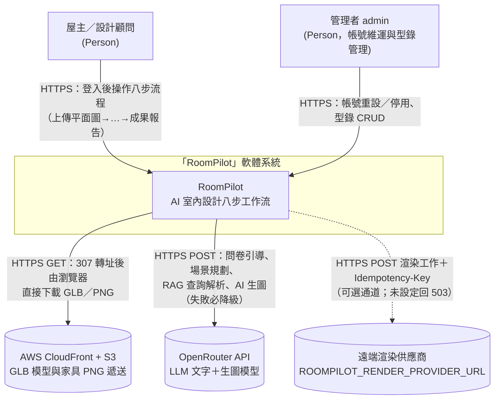
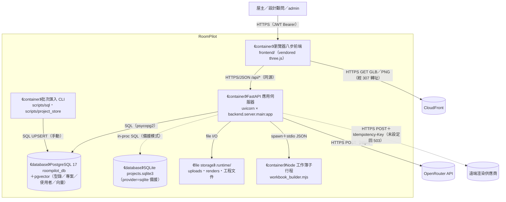
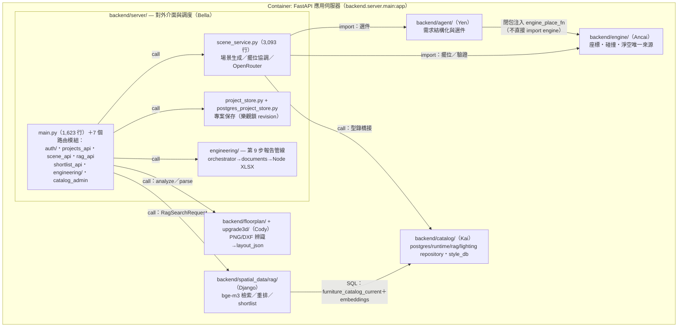
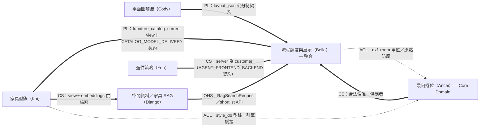
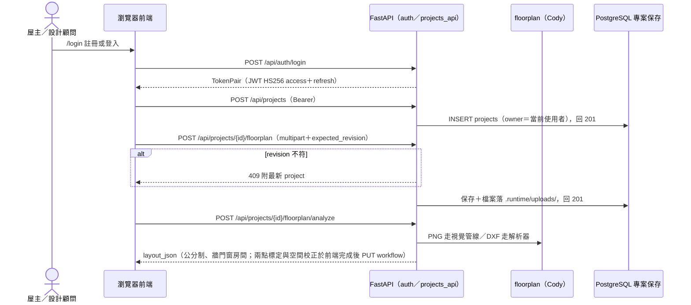
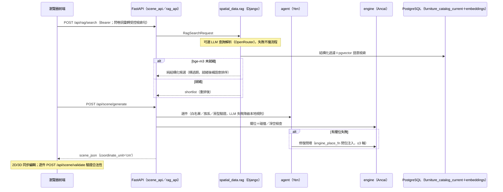
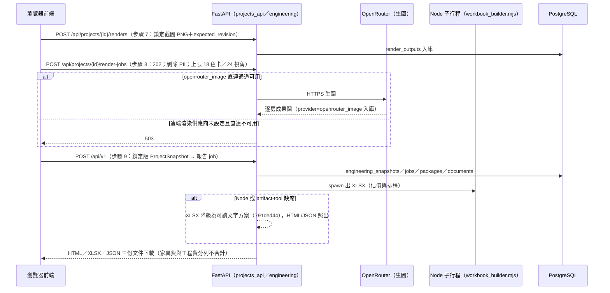
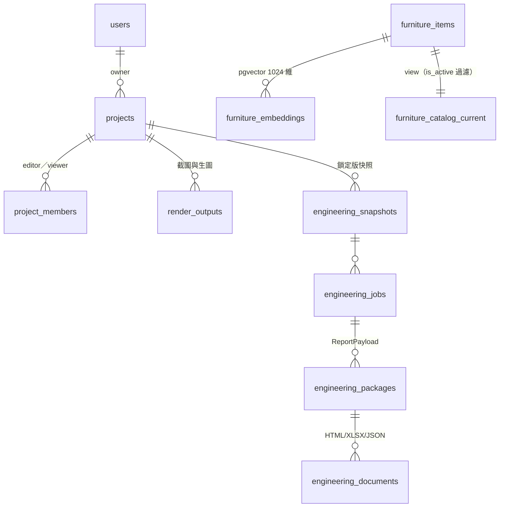
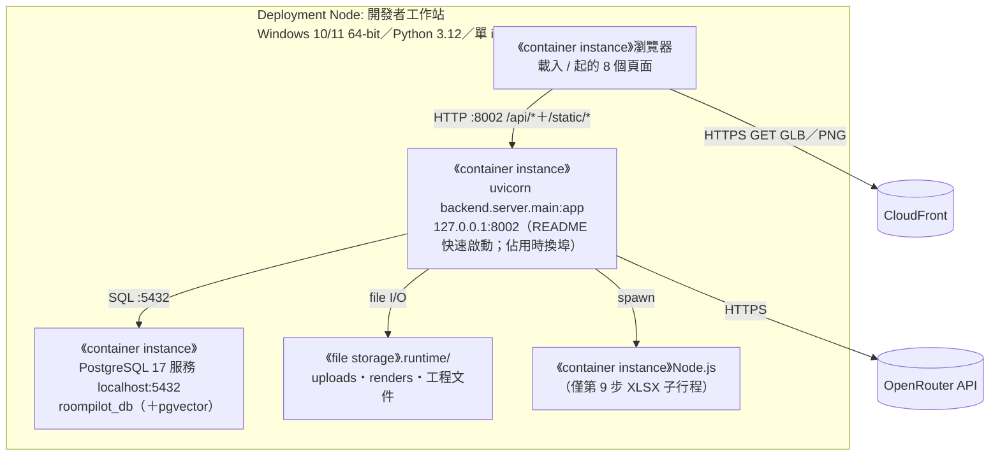

# 軟體架構文件 (SAD) - RoomPilot

> **版本:** v1.0 | **更新:** 2026-08-07 | **狀態:** 草稿
> **Owner:** Bella（整合；各限界上下文 owner 見 §2）
> **語域:** L2（橋接）
>
> **定位**：系統級架構的單一真實來源——C4 L1–L2、DDD 邊界、資料與部署視圖。回答「系統由哪些 runtime 組成、邊界在哪、為什麼」。Code 層歸 [`../04_design/lld.md`](../04_design/lld.md)；API／資料契約歸 `../04_design/` 與 `docs/contracts/`（引用不重抄）；架構決策理由歸同資料夾 `ADR-*`。
> **實例:** 單例（系統架構契約只有一份）
> **生成:** 2026-08-07 由 VibeCoding_Workflow_Templates/03_architecture/sad.md 導入 | 基準 docs/vibecoding-restructure @ 1268b2b4

## 目錄

- [1. C4 架構視圖](#1-c4-架構視圖)
- [2. DDD 邊界與分層](#2-ddd-邊界與分層)
- [3. 技術選型](#3-技術選型)
- [4. 需求摘要](#4-需求摘要)
- [5. 關鍵使用者旅程](#5-關鍵使用者旅程)
- [6. 資料架構](#6-資料架構)
- [7. 部署視圖](#7-部署視圖)
- [8. 跨領域考量](#8-跨領域考量)
- [9. 風險與演進](#9-風險與演進)
- [10. 架構審查清單](#10-架構審查清單)
- [11. 追溯](#11-追溯)

## 1. C4 架構視圖

**命名防呆**：C4 L1–L2 是圖的縮放層級（Context→Container），≠ 產品「八步流程」的步驟編號、≠ DDD 限界上下文。業務步驟一律寫步驟名（如 `layout_2d`），不裸寫數字。產品流程的權威描述在 `README.md`「現行八步流程」（實際列出登入 0 加階段 1–9；前端內部步驟機為 11 步，見 §2 術語表）。

### 1.1 L1 — System Context

外部系統五類核對：資料源＝AWS S3（經 CloudFront 遞送，部署期上傳）；遞送＝CloudFront；交易＝無（無金流）；推送＝無；備份＝離線 GLB 備援 zip（本地檔案，非外部服務；IKEA 地端備援尚未完成，README 首節）；雲端 IaaS＝AWS（僅 S3＋CloudFront，帳務未查證）。bge-m3 模型權重為**佈建期**下載（`backend/spatial_data/rag/model_runtime.py` 自述 offline-only，執行期只讀本地快取、缺快取直接報錯），不列為執行期外部系統。前端 three.js 已 vendor 進 `frontend/vendor/three/`（scene.html:1231），不再依賴 unpkg CDN。

### 1.2 L2 — Container

| Container | 類型 | 技術 | 何時啟用 | L3 揭露 |
| :--- | :--- | :--- | :---: | :---: |
| 瀏覽器八步前端 | UI（瀏覽器 runtime） | 原生 ES module＋vendored three.js／draco；`frontend/` 8 個 HTML 頁 | 現在 | 表代圖（§1.3 表） |
| FastAPI 應用伺服器 | Web process | uvicorn × `backend.server.main:app`，77 條 APIRoute（44 GET／28 POST／2 PUT／2 DELETE／1 PATCH，含 8 條 HTML 頁路由） | 現在 | ✅ §1.3 |
| PostgreSQL `roompilot_db` | DB | PostgreSQL 17（本機實測 17.10）＋pgvector 0.8.2；schema `roompilot`：型錄、專案保存、使用者、向量 | 現在（三個 provider 預設／已切 postgres） | 表代圖 → §6 |
| SQLite 備援保存 | DB（內嵌檔案） | `.runtime/projects.sqlite3`；`ROOMPILOT_PROJECT_STORE_PROVIDER` 程式碼預設 `sqlite`（project_store.py:655），本機 `.env` 已切 postgres | 備援／舊機 | 略（同 §6 專案 ER） |
| bge-m3 嵌入／重排 runtime | in-process 模型執行緒 | `BAAI/bge-m3`（1024 維）＋`BAAI/bge-reranker-v2-m3`，啟動即背景預載（main.py:294 `PRELOADER.start`；冷載約 34 秒，未就緒退純結構化過濾） | 現在（`ROOMPILOT_RAG_ENABLED` 預設 false，settings.py:80） | 略（單模組） |
| Node.js 工作簿子行程 | 短命 subprocess | `engineering/workbook_builder.mjs`；XLSX 需 Node（documents.py:154），缺席時報告降級為可讀文字方案 | 第 9 步觸發時 | 略（單腳本） |
| 型錄／保存批次 CLI | 批次 process | `scripts/sql/import_official_catalog_to_postgres.py`（dry-run／UPSERT）、`scripts/project_store/migrate_sqlite_projects_to_postgres.py` | 手動執行 | 略（腳本） |
| `.runtime/` 檔案儲存 | 檔案系統 | uploads／renders／engineering 產物；不進 git | 現在 | 略 |

無獨立 future-state 圖：Docker 化已於 2026-08-06 整套移除（commit 09891216，Ben 裁定達標後再容器化），PostgreSQL 已接入執行期，repo 內查無其他已裁決的容器拓撲變更。

### 1.3 L3 — Component（Container: FastAPI 應用伺服器）

方塊＝`backend/` 套件（對應 AGENTS.md 目錄責任表）；箭頭語意標 import／call。

其他 Container 的 L3：前端以頁為單位（8 頁：`/`、`/login`、`/projects`、`/scene`、`/styles`、`/library`、`/rag`、`/engineering`；`scene_v2.js` 13,259 行為八步主控），單頁細節歸 `../02_ux_ui/ui_spec-*.md`；DB 表代圖見 §6；CLI 與 Node 腳本為單檔，略。

## 2. DDD 邊界與分層

限界上下文＝AGENTS.md 目錄責任表的六人分工；全部活在同一個 FastAPI process，邊界靠 import 紀律與契約維持。

| 術語 | 定義 |
| :--- | :--- |
| 八步流程 | 產品流程名（README「現行八步流程」，列登入 0＋階段 1–9）；前端內部步驟機為 11 步（`scene_workflow.js:4-16` `WORKFLOW_STEPS`，權威有序來源） |
| `layout_json` | 平面圖辨識的唯一輸出；辨識止於此（AGENTS.md 不可違反契約） |
| `scene_json` | 方案生成與編輯的唯一輸出；`render_context` 攜帶家電等生圖上下文 |
| 公分制 | 跨模組幾何一律 cm；新欄位 `_cm`／面積 `_m2`；舊欄位須帶 `coordinate_unit: "cm"`＋schema version |
| revision（樂觀鎖） | 專案寫入必帶 `expected_revision`，不符回 409 附最新專案 |
| shortlist | 第 6 步家具候選集：結構化過濾＋bge-m3 語意排序；模型未就緒退純過濾並標過期 |
| `furniture_catalog_current` | Kai PostgreSQL view（`roompilot` schema），第 6 步正式家具優先來源；DB 不可用才回退已驗證 JSON |
| 隔離區（quarantine） | 未匹配／未驗證型錄資料，禁入 API 與場景 |
| ProjectSnapshot | 第 9 步鎖定版快照；報告數字只來自快照與工程知識庫；家具費／工程費分列不合計，查無價格 `subtotal=null` |

### 2.1 Context Map（箭頭＝Strategic Relationship，不是 data flow）

正式 PL 文本＝`docs/contracts/`（21 份 `.md` 契約＋JSON schema＋`engineering_openapi.yaml`；本文件用檔名引用，不重抄內容）。

### 2.2 戰術元素對應

| DDD 元素 | 程式碼位置 | 備註 |
| :--- | :--- | :--- |
| Entity／Aggregate Root | 專案（`roompilot.projects` 一列＋render_outputs＋engineering_* 子表＋uploads 檔案）；invariant＝revision 樂觀鎖 | 一致性邊界 |
| Value Object | `engine/models.py` 的 Wall／Room／ClearanceZone 等 dataclass | 以值使用 |
| Domain Service | `engine`（placement／clearance／adjustment）、`agent`（選件與修復）、`spatial_data/rag`（ranking／shortlist） | 不屬單一 Entity |
| Domain Event | **缺席**——狀態以 revision 遞增＋workflow JSON 快照覆寫，單機規模下的取捨 | 缺席理由即此 |
| Repository | `postgres_project_store.py`／`project_store.py`（雙 provider）；`catalog/postgres_repository.py`・`runtime_catalog_repository.py`・`rag_repository.py`・`lighting_repository.py` | provider 由環境變數選 |
| ACL | `engine/dxf_room.py`（單位／原點）、`catalog/style_db.py`（型錄→引擎）、`services/cloud_models.py`（只回 manifest 驗證過的 URL） | 隔離外部 schema |

### 2.3 Clean Architecture 分層（邏輯分層，不等於 L2 runtime）

| 層 | 程式碼位置 | 職責 |
| :--- | :--- | :--- |
| Domain | `backend/engine/`、`backend/agent/` | 幾何合法性、選件規則 |
| Application | `backend/server/scene_service.py`、`engineering/orchestrator.py`、`spatial_data/rag/service.py`、各路由模組 | Use case 編排與驗證 |
| Infrastructure | `postgres_*`／`project_store`、`catalog/*_repository`、httpx（OpenRouter／渲染）、Node 子行程、檔案儲存 | DB／外呼／檔案 |

## 3. 技術選型

| 分類 | 選用 | 理由（一句） | ADR |
| :--- | :--- | :--- | :--- |
| 後端框架 | Python 3.12.13＋FastAPI 0.140.0＋uvicorn 0.51.0；幾何 shapely 2.1.2（README 套件版本節基線值；本機 `.venv` 實測 Python 3.12.10／FastAPI 0.139.0／uvicorn 0.50.0，版本不一致待對齊，見 [deployment §1.4 附註](../06_ops/deployment_and_operations.md#14-環境變數逐一對-envexample讀取端程式碼複核2026-08-07)） | 單 process 承載 77 條路由與靜態前端 | 同資料夾 ADR-*（編號以該檔為準） |
| 主資料庫 | PostgreSQL 17＋pgvector 0.8.2；`ROOMPILOT_CATALOG_PROVIDER` 預設 `postgres`（postgres_repository.py:203）；SQLite 為保存備援 provider（程式碼預設，`.env` 已切 postgres） | 型錄、專案、使用者、向量單庫收斂 | 同上 |
| 檢索模型 | `BAAI/bge-m3`（1024 維）＋`BAAI/bge-reranker-v2-m3`，offline-only 快取 | 中文家具語意檢索；離線可控 | — |
| LLM／生圖 | OpenRouter（問卷、場景規劃、RAG 解析 `ROOMPILOT_RAG_PARSER_PROVIDER`∈{openai, openrouter, anthropic}、第 8 步 `openrouter_image` 生圖） | 失敗必降級本地規則 | — |
| 認證 | PyJWT HS256 access／refresh（auth/tokens.py），角色 designer／client／admin | 單機自簽、無外部 IdP | — |
| 3D 前端 | 原生 ES module＋vendored three.js＋draco；無打包步驟 | 免 Node 建置鏈 | — |
| 部署 | 本機 uvicorn :8002；Docker 已移除（09891216） | 達標後再容器化（Ben 裁定） | 同資料夾 ADR-* |

## 4. 需求摘要

FR 全文與驗收歸 `../01_requirements/`（prd/srs）；此處僅列架構相關骨幹：

- FR-AUTH-01 註冊／登入／角色與專案成員分享（步驟 0）
- FR-PROJ-01 專案建立、恢復與樂觀鎖保存（步驟 1）
- FR-FP-01 PNG/JPG/DXF 上傳與牆門窗房間辨識 → `layout_json`（步驟 2）；FR-FP-02 兩點標定公分尺度（步驟 3）
- FR-LAYOUT-01 空間結構校正（樑柱手繪為設計決策，非缺口）（步驟 4）
- FR-SCENE-01 全屋風格＋逐房需求問卷（6 風格 × 3 色卡＝18，實測 `taiwan_style_cards.json`）（步驟 5）
- FR-RAG-01 家具向量檢索與 shortlist（步驟 5–6）
- FR-AGENT-01 選件與修復意圖（步驟 6）
- FR-ENGINE-01 幾何擺位／碰撞／淨空／移動合法性（步驟 6）
- FR-SCENE-02 2D/3D 同步編輯與走動預覽（步驟 6）
- FR-RENDER-01 視角鎖定與 AI 渲染成果包（步驟 7–8）
- FR-REPORT-01 工程報告 HTML／XLSX／JSON 三份文件（步驟 9，`/engineering`）

NFR ID 權威在 [`../01_requirements/srs.md`](../01_requirements/srs.md) §2，本表引用其 ID 不另造：

| NFR（srs ID） | 需求 | 目標值／依據 |
| :--- | :--- | :--- |
| NFR-可用性-01 | 外部依賴失敗不癱瘓流程：LLM／RAG 失敗必降級本地規則／純結構化過濾；型錄 DB 不可用回 503 顯式受阻（回退 JSON 為人工切換 provider，非自動） | rag_api、intake；srs FR-CATALOG-01 |
| NFR-一致性-01 | 跨模組幾何公分制（`_cm`／`_m2`＋schema version） | AGENTS.md 不可違反契約 |
| （待 srs 定編） | 併發寫入防護 | revision 樂觀鎖，衝突 409 附最新專案；srs 尚無對應 NFR ID，行為驗收見 prd SCN-PROJ-02 |
| NFR-安全-01 | 渲染工作出站前剝除 PII；非成員存取專案回 404 不回 403（存在性不洩漏） | `render_service.py PRIVATE_KEYS`；AGENTS.md 不可違反契約 |
| NFR-資源-01 | 生圖任務上限 | 18 色卡／24 房視角（render_service.py:15-16，2d5111be） |
| NFR-效能-01 | API 延遲 SLO | **TO-BE（srs 同標）**；已知冷啟約 33 秒屬 shader 綁定＋bge-m3 34 秒背景預載 |

## 5. 關鍵使用者旅程

每 use case 一張；失敗分支用 `alt`。步驟名以 `scene_workflow.js` 為準。

### 5.1 SCN-AUTH-01｜登入 → 建案 → 辨識（步驟 0–4）

### 5.2 SCN-SCENE-01｜問卷 → RAG → 選件 → 擺位（步驟 5–6）

### 5.3 SCN-REPORT-01｜鎖定 → AI 渲染 → 工程報告（步驟 7–9）

## 6. 資料架構

實體級 ER（欄位細節、索引與 DDL 歸 [`../04_design/db_design.md`](../04_design/db_design.md)）：

- 兩群表同在 PostgreSQL `roompilot` schema：專案保存群（`scripts/project_store/roompilot_project_store_schema.sql`：users、projects、render_outputs、engineering_snapshots/jobs/packages/documents、refresh_tokens、project_members）；型錄群（`scripts/sql/roompilot_postgresql_schema.sql`：view `furniture_catalog_current` 於 :446，另有 `furniture_embeddings`、`lighting_assets_current` 等，燈具為獨立表）。上傳圖與截圖存 `.runtime/`，DB 只存路徑。
- **一致性策略**：專案寫入走 revision 樂觀鎖（強一致）；型錄匯入為批次單交易 UPSERT；shortlist 語意排序允許「過期標記＋補算」的最終一致。
- **合規**：渲染工作出站前剝 PII；`.env` 與 `.runtime/` 不進 git；靜態資料未加密（單機取捨）。
- 型錄數量**多來源不一致**：README.md:230 寫 8,557（Kai JSON）、JSON 檔名沿用 9350、本機 DB 實際可選 7,958（599 筆被 is_active 擋，2026-08 上旬盤點）——本輪未重新查數，正字以資料庫與 db_design 稽核為準（待確認）。

## 7. 部署視圖

Docker 已於 2026-08-06 整套移除（commit 09891216：刪 Dockerfile／docker-compose.yml／docs/DOCKER.md，Ben 裁定達標後再容器化）。現行唯一部署形態＝本機 uvicorn：

| 環境 | Deployment 模式 | 高可用／Backup／監控 |
| :--- | :--- | :--- |
| Dev（唯一現行） | 本機 uvicorn :8002＋本機 PostgreSQL（換機流程見 `docs/NEW_MACHINE_SETUP.md`） | 無 HA；git＋離線 GLB zip；無監控系統 |
| Staging／Production | 未建立；容器化重建條件＝Ben 裁定之達標後（坑位紀錄保留於移除 commit 與 memory） | — |

環境變數注意：終端機的 `ROOMPILOT_*_PROVIDER` 會蓋過 `.env`，驗證前先清（團隊實測教訓）。CI/CD 與成本歸 [`../06_ops/deployment_and_operations.md`](../06_ops/deployment_and_operations.md)。

## 8. 跨領域考量

| 維度 | 方案 | 狀態 |
| :--- | :--- | :--- |
| 日誌／指標（SLI/SLO）／追蹤／告警 | uvicorn stdout；無集中式日誌、無指標、無告警 | 未建立 |
| 健康度端點 | `/api/health`、`/api/rag/status`、`/api/render-provider/status`、`/api/v1/engineering/health`、`/api/catalog/status` | 功能性自我回報，非監控系統 |
| 認證授權 | JWT HS256 access／refresh（金鑰 `ROOMPILOT_AUTH_SECRET`，未設則各節點自產）；角色 designer／client／admin；專案成員 editor／viewer；非成員 404；首註冊帳號自動 admin 並收養無主專案（可 `ROOMPILOT_AUTH_DISABLE_FIRST_ADMIN=1` 關閉）。HTML 頁刻意公開（避免裸 401），資料一律擋在掛 `current_user` 的 api_router（rag_api.py:27-31 設計註解） | 現行 |
| 輸入與供應鏈 | 上傳白名單＋PIL 驗證；LLM 輸出白名單驗證（不信 LLM）；GLB URL 只信 manifest 驗證過的列；隔離區禁載；render-jobs 任務總量上限 | 現行 |
| 開放風險 | Codex 2026-08-04 稽核仍開放項（shortlist 後門、首帳號 admin 風險等），細節歸 `../05_qa/` 與稽核紀錄；威脅模型未正式建立（待補） | 部分開放 |
| 機密管理 | `.env`（gitignore）；不提交密碼、runtime、大型 GLB | 現行 |

## 9. 風險與演進

| 風險 | 可能性 | 影響 | 緩解 |
| :--- | :--- | :--- | :--- |
| 單機單 process、無 HA／備份自動化：工作站故障即服務全停 | 中 | 高 | 發表場景可接受；企業化前補部署與備份策略 |
| 型錄數量多來源不一致（8,557／9,350／7,958，§6） | 已發生 | 中（文件與驗收對不上） | db_design 稽核收斂單一計數來源 |
| OpenRouter 依賴：第 8 步生圖與問卷解析同一供應商 | 中 | 中（生圖無本地降級） | 文字路徑必降級已實作；生圖失敗回 5xx 由 UI 呈現 |
| `scene_v2.js` 13,259 行、`scene_service.py` 3,093 行的單檔肥大 | 已發生 | 中（維護成本） | 路由已拆 7 模組；前端逐步抽 scene_* 子模組（進行中） |
| SQLite／PostgreSQL 保存雙 provider 漂移；其他機器 `.env` 未切 postgres | 中 | 中 | 遷移腳本已就緒；換機清單明定目標狀態 |
| 發表日 2026-08-20（未查證，團隊口述）前遺留 QA：逐房視角、走路實走、第 8 步端到端目視 | 中 | 依 demo 腳本 | `../05_qa/` 追蹤 |

演進路線：Phase 1（現行）單機八步全通、PostgreSQL 單源（contracts PHASE1–5 已入文）→ Phase 2 IKEA 地端 GLB 備援（Kai＋Django，README 首節）、燈具 156 筆分流、擺放規則 Phase 2（垂直佔用帶）→ Phase 3 容器化重建與對外部署（達標後，Ben 裁定）。此排序為現況整理，非已裁決 roadmap（待 Ben 確認）。

## 10. 架構審查清單

- [x] L1–L3 各至少一張圖、一圖一層級；每個 L2 Container 有 L3 或明確跳過理由（§1.2 表）
- [x] L1 外部系統五類完整（§1.1 核對段）；L2 含所有現行 Container；future state 以文字裁決紀錄取代圖（Docker 移除後無已裁決目標拓撲）
- [x] 所有跨 Container／跨 Node 箭頭標 protocol＋動詞
- [x] 無 C4 與業務層級名稱混用（§1 命名防呆）；Context Map 箭頭是 Strategic Relationship
- [x] 三張 Sequence Diagram（§5）；Deployment 圖含 Node 屬性（§7）
- [ ] 拆新 process 先改 L2 再加 L3；架構變動同步 `lld`／`deployment_and_operations`（維護約定，持續項）

## 11. 追溯

| 項目 | ID／連結 |
| :--- | :--- |
| 上游 | FR-AUTH/PROJ/FP/LAYOUT/SCENE/RAG/AGENT/ENGINE/RENDER/REPORT-*、NFR-*（`../01_requirements/prd.md`、`srs.md`）；SCN-AUTH-01、SCN-SCENE-01、SCN-REPORT-01 |
| 決策 | 同資料夾 `ADR-*`（編號以各 ADR 檔為準；Docker 移除、PostgreSQL 單源、bge-m3 offline-only 為主要候選） |
| 下游 | [`../04_design/lld.md`](../04_design/lld.md)（Code 層）、[`../04_design/api_spec.md`](../04_design/api_spec.md)＋`openapi-roompilot-v1.yaml`（77 條路由契約）、[`../04_design/db_design.md`](../04_design/db_design.md)（DDL）、[`../06_ops/deployment_and_operations.md`](../06_ops/deployment_and_operations.md)；正典契約＝`docs/contracts/`（21 份 `.md`：LAYOUT_SCENE_BOUNDARY、AGENT_FRONTEND_BACKEND、CATALOG_MODEL_DELIVERY、POSTGRESQL_* PHASE1–5、REMOTE_RENDER、ENGINEERING_DOCUMENT_MVP 等，以檔名＋節引用不重抄） |

**鐵律**：本文件是架構契約——任何模組在此沒出現，等於不存在；其他文件提到而本文件沒提到，是本文件的 bug。與 repo 既有優先序並用：測試 > 程式 > `docs/contracts/` > 本文件。

| 版本 | 日期 | 變更 |
| :--- | :--- | :--- |
| v1.0 | 2026-08-07 | 由 Pilot 模板導入；77 條路由、PostgreSQL 單源、Docker 移除、RAG／auth／工程報告管線皆對 `docs/vibecoding-restructure`@1268b2b4 實碼複核（2026-07-26 舊導入版僅作參考，其 SQLite 單源／無認證／44 路由敘述已全數過時） |
