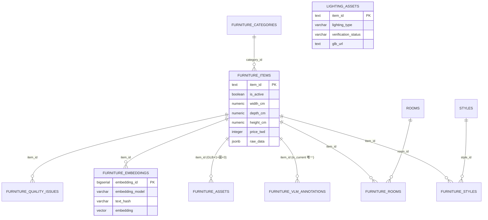
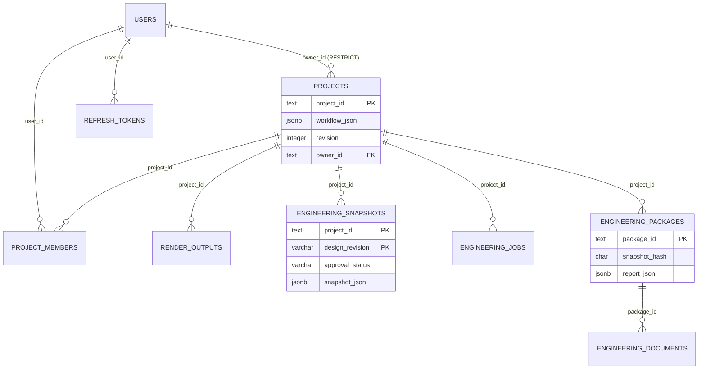

# 資料庫設計 (DB Design) - RoomPilot

> **版本:** v1.0 | **更新:** 2026-08-07 | **狀態:** 草稿
> **Owner:** Kai（家具型錄／向量／runtime catalog schema）、Bella（專案保存與帳戶 schema）
> **原則:** Schema 是契約。四份 schema 檔是實作真相，本文件記錄設計意圖與資料字典；兩者以檔案路徑與更新日期對齊。
> **定位:** 回答「正式資料放在哪張表、誰能寫、view 給誰讀」。API 形狀歸 [`api_spec.md`](./api_spec.md)；各 Phase 契約全文在 `docs/contracts/POSTGRESQL_*.md`（本文件只以檔名＋節引用，不重抄）；模組內部設計歸 [`lld.md`](./lld.md)。
> **語域:** L3（工程）
> **實例:** 單例（單一 PostgreSQL 資料庫 `roompilot_db`，schema `roompilot` ＋ `staging`）
> **生成:** 2026-08-07 由 VibeCoding_Workflow_Templates/04_design/db_design.md 導入 | 基準 docs/vibecoding-restructure @ 1268b2b4

---

## 目錄

- [1. ERD](#1-erd)
- [2. 表格定義](#2-表格定義)
- [3. 資料字典 (Data Dictionary)](#3-資料字典-data-dictionary)
- [4. 索引與效能](#4-索引與效能)
- [5. 資料保留與遷移](#5-資料保留與遷移)
- [6. 數量現況與多來源差異](#6-數量現況與多來源差異)
- [7. 追溯](#7-追溯)

## 1. ERD

正式環境為本機 PostgreSQL 17.10 + pgvector 0.8.2（2026-08-07 實測 `SHOW server_version` / `pg_extension`）。三個 provider（家具型錄、runtime catalog、專案保存）預設均為 strict PostgreSQL；離線檔案模式必須明確設定，規則見 `docs/contracts/POSTGRESQL_SINGLE_SOURCE_PHASE5.md`〈Provider 契約〉。

### 1.1 家具型錄與向量（Kai lane）

`lighting_assets` 刻意**不**與 `furniture_items` 建立關聯（實測兩表 `item_id` 交集為 0）：燈具經 `scene_json.surface_overrides.lighting_ids` 引用，不參與第 6 步家具自動選件與碰撞計算，理由見 `docs/contracts/LIGHTING_CEILING_CATALOG_CONTRACT.md`〈實作現況（2026-08-02）〉。

### 1.2 專案保存與帳戶（Bella lane）

Runtime catalog（style cards／surface materials／裝修單價／隔離區）為互相獨立的表，無外鍵網，見 §2.4。

## 2. 表格定義

四份 schema 檔是實作真相；由對應匯入器／遷移工具在**同一 transaction** 內套用（FastAPI 不自行執行 DDL）：

| Schema 檔（實作真相） | Owner | 套用工具 |
| :--- | :--- | :--- |
| `scripts/sql/roompilot_postgresql_schema.sql` | Kai | `scripts/sql/import_official_catalog_to_postgres.py` |
| `scripts/sql/roompilot_furniture_embeddings_schema.sql` | Kai（schema）／Django（向量產生） | `scripts/sql/import_furniture_embeddings_to_postgres.py` |
| `scripts/runtime_catalog/roompilot_runtime_catalog_schema.sql` | Kai | `scripts/runtime_catalog/import_runtime_catalogs_to_postgres.py` |
| `scripts/project_store/roompilot_project_store_schema.sql` | Bella（Kai 協作） | `scripts/project_store/migrate_sqlite_projects_to_postgres.py` ＋ runtime 首次連線 |

### 2.1 家具型錄與資產（`roompilot` ＋ `staging`）

| 表 | 鍵 | 用途 |
| :--- | :--- | :--- |
| `furniture_categories` | `category_id`；`category_code` UNIQUE | 分類字典（實測 55 類啟用；schema 註解寫 64 類，見 §6） |
| `furniture_items` | `item_id`（TEXT PK） | 家具主表：名稱、色彩／材質陣列、公分尺寸、價格、`is_active`、完整 `raw_data` JSONB |
| `styles` / `furniture_styles` | `style_id`；`(item_id, style_rank)` | 6 種正式風格與主／次風格關聯（rank ∈ {1,2}，confidence 0–1） |
| `rooms` / `furniture_rooms` | `room_id`；`(item_id, room_id)` | 9 種房型與家具適用房間多對多 |
| `furniture_vlm_annotations` | `annotation_id`；`(item_id, annotation_hash)` UNIQUE | VLM 標註版本表；partial unique index 保證每件家具僅一筆 `is_current` |
| `furniture_assets` | `asset_id`；`object_key` UNIQUE | S3／CloudFront 資產 metadata：每件家具 GLB×1（partial unique）＋ `front`/`side`/`angle-45` 圖×3；位元組不入庫 |
| `furniture_embeddings` | `(item_id, embedding_model, text_hash)` UNIQUE | BGE-M3 向量（實測 7,958 筆、1024 維、單一模型）；開發期 `VECTOR` 不固定維度 |
| `furniture_quality_issues` | `(item_id, issue_type, issue_source)` UNIQUE | 匯入與人工品質標記（open/confirmed/fixed/ignored） |
| `furniture_admin_audit` | `event_id` | Phase 2 管理 API 稽核；與異動同 transaction，不存 Bearer token |
| `lighting_assets` | `item_id`；`object_key` UNIQUE | 燈具獨立 lane；`verification_status` ∈ {verified, needs_review} |
| `staging.stg_*`（5 表） | `(batch_key, row_number)` | 每次匯入的原始 JSON/CSV 列；`batch_key` 為五個輸入檔 SHA-256，可重跑不混批 |

管理寫入（POST/PATCH/軟刪除、啟用門檻、版本衝突）契約見 `docs/contracts/POSTGRESQL_CATALOG_CRUD_PHASE2.md`〈API〉〈啟用門檻〉。

### 2.2 家具向量與檢索函式

- `roompilot.furniture_embedding_source_current`（view）：投影 active `kind='furniture'` 的 `embedded_text`／`text_hash`／`chroma_metadata`，是 RAG 的唯一穩定輸入；不另建第二套家具主表（`docs/contracts/POSTGRESQL_FURNITURE_EMBEDDINGS.md`〈責任邊界〉）。
- `roompilot.search_furniture_embeddings(query_embedding, query_model, match_count)`：exact cosine top-N，只命中相同 model／維度且 `text_hash` 仍為 current 的向量。
- `roompilot.search_furniture_embeddings_filtered(...)`：Django RAG runtime 用；房型、類別、價格、寬高上限、role、size class 為 SQL 硬條件，風格／氛圍留在 Python 軟排序；輸出不含 embedding（`docs/contracts/POSTGRESQL_FURNITURE_RAG_RUNTIME.md`〈PostgreSQL 介面〉）。

### 2.3 專案保存與帳戶

| 表 | 鍵 | 用途 |
| :--- | :--- | :--- |
| `users` | `user_id`；`email` UNIQUE（強制小寫） | 帳戶；`password_hash` 只存 pbkdf2_sha256；`role` ∈ {admin, designer, client} |
| `projects` | `project_id` | 八步 workflow 唯一保存點：`workflow_json` JSONB（含 `layout_json`、問卷、`scene_json`、render context）、`revision` 樂觀鎖、上傳檔 metadata 四欄同生共死（CHECK） |
| `project_members` | `(project_id, user_id)` | 專案授權唯一來源；`project_role` ∈ {owner, editor, viewer} |
| `refresh_tokens` | `jti` | Refresh token 白名單；登出／換發即刪，JWT 撤銷能力只來自這張表 |
| `render_outputs` | `render_id` | 第 8 步生圖 metadata（版本三元組、style_card_id、檔案路徑、`prompt_text`／`design_context_json` 逐圖理念；瀏覽器截圖為 NULL） |
| `engineering_snapshots` | `(project_id, design_revision)` | 設計師確認的鎖定版快照；`designer_confirmed` 必附 `locked_by`/`locked_at`（CHECK），鎖定後應用層禁止覆寫 |
| `engineering_jobs` | `job_id` | 工程報告工作狀態 JSONB |
| `engineering_packages` | `package_id`；`snapshot_hash` CHAR(64) | ReportPayload；`snapshot_hash` 串接三份輸出文件，確保同一快照來源 |
| `engineering_documents` | `document_id` | 成果文件 metadata；`document_type` ∈ {report_json, report_html, estimate_xlsx}，位元組在 `.runtime` |

transaction／`SELECT FOR UPDATE`／409／413／503 行為見 `docs/contracts/POSTGRESQL_PROJECT_STORE_PHASE3.md`〈Transaction 與衝突控制〉。

### 2.4 Runtime catalog（風格、材質、單價、隔離）

| 表 | 鍵 | 用途 |
| :--- | :--- | :--- |
| `runtime_catalog_imports` | `catalog_key` | 各來源檔的 SHA-256、版本、筆數與匯入時間 |
| `style_cards` | `card_id`；`(style_id, card_order)` UNIQUE | 18 張風格色卡（6 風格 × 3 色卡）＋ RAG text |
| `design_style_profiles` | `style_id` | 6 種正式 UI 風格 payload |
| `surface_materials` | `surface_id` | 571 筆牆面／地板材質 |
| `style_surface_profiles` | `style_id` | 各風格牆地材質候選 |
| `renovation_cost_sources` / `renovation_cost_rates` | `source_id` / `work_code` | 4 個公開行情來源、6 筆 low≤base≤high 單價（CHECK） |
| `external_import_quarantine` | `(source_kind, record_id)` | 外部／未匹配／legacy 隔離區；`eligible_for_api` 與 `eligible_for_rag` 以 CHECK **恆為 FALSE**，通過審查必須移植到正式表，不得原地放行 |

### 2.5 View 層（read model 契約）

| View | 消費者 | 語意 |
| :--- | :--- | :--- |
| **`roompilot.furniture_catalog_current`** | 全系統核心 read model | active 家具 ＋ 分類／風格／房間／current VLM ／ready 資產 URL 聚合；`AGENTS.md`〈不可違反的契約〉指名的第 6 步優先資料來源 |
| `roompilot.furniture_catalog_api_current` | `backend/catalog/postgres_repository.py`（`_VIEW`，第 18 行） | 在 current view 上加 `normalized_type`、六大 `taxonomy_group`（中英）、安全預設欄；分類改名唯一入口是匯入層 `CATEGORY_CODE_OVERRIDES`，view 不得二次改名 |
| `roompilot.lighting_assets_current` | `backend/catalog/lighting_repository.py` | 只含 `verified` 且六種正式 `lighting_type` 的燈具 |
| `roompilot.furniture_embedding_source_current` | Django RAG | RAG 文字／hash／metadata 唯一輸入 |
| `roompilot.style_cards_current` 等 `*_current` 四個 | FastAPI styles／cost | Phase 4 `is_active` 過濾 |
| `roompilot.runtime_catalog_rag_documents` | `runtime_catalog_repository.search_runtime_rag_documents()` | 僅 style_card／surface_material／renovation_cost 三類證據；隔離區刻意排除 |

## 3. 資料字典 (Data Dictionary)

僅列跨表、跨 owner 的關鍵欄位；單表細節以 schema 檔為準。

| 欄位 | 業務語意 | 來源 | 敏感等級 |
| :--- | :--- | :--- | :--- |
| `item_id` | 家具、GLB、三視角圖、VLM 標註、embedding 共用的穩定 ID；跨 lane 追溯主鍵 | FR-CATALOG-01 | 一般 |
| `furniture_items.is_active` | 「第 6 步使用者實際可選」的開關；軟刪除唯一機制，FALSE 即從所有 current view、公開 API、2D/3D 場景消失 | FR-CATALOG-01/02 | 一般 |
| `furniture_items.kind` | `furniture` 以外（如家電）不得進入家具 API 與自動配置 | FR-CATALOG-03 | 一般 |
| `width_cm` / `depth_cm` / `height_cm` | 跨模組幾何一律公分（NUMERIC(10,2)，CHECK > 0） | NFR-一致性-01 | 一般 |
| `price_twd` ＋ `price_is_estimated` | 台幣價格與估價旗標；查無價格為 NULL，報告端不得以已知小計冒充總價 | FR-REPORT-02 | 一般 |
| `furniture_assets.delivery_url` | CloudFront 正式交付 URL；位元組永在 S3/CloudFront，DB 只存 metadata | FR-CATALOG-01 | 一般 |
| `lighting_assets.verification_status` | `needs_review` 不得被 RAG 或第 6 步自動配置使用（view 已過濾） | FR-CATALOG-04 | 一般 |
| `text_hash` / `embedding` | 向量與官方 RAG 文字的 SHA-256 綁定；hash 過期的向量不再被檢索命中 | FR-RAG-02 | 一般 |
| `projects.workflow_json` | 八步流程完整狀態（≤2 MB）；PostgreSQL 是唯一正式來源 | FR-PROJ-01 | 中（含使用者平面圖與需求） |
| `projects.revision` | 樂觀併發計數器；不符回 409，與 `design_revision`（鎖定版語意版本）刻意分離 | FR-PROJ-01 | 一般 |
| `engineering_snapshots.approval_status` | `designer_confirmed` 後快照不可變，是所有估價／報告文件的唯一輸入 | FR-REPORT-01 | 一般 |
| `engineering_packages.snapshot_hash` | 三份輸出文件與鎖定快照的一致性證明 | FR-REPORT-01 | 一般 |
| `users.email` / `users.password_hash` | 登入身分；**PII**——僅存 pbkdf2_sha256 雜湊，無明文、無可逆值 | FR-AUTH-01 | **高（PII）** |
| `refresh_tokens.jti` | session 撤銷白名單；洩漏即可冒用，不得寫入 log | FR-AUTH-03 | 高 |
| `furniture_admin_audit.actor` | 管理操作行為人（自報 header，非驗證憑證）；audit 不存 Bearer token | FR-CATALOG 管理面 | 中 |
| `external_import_quarantine.review_status` | 隔離資料審查狀態；無論狀態為何都進不了 API/RAG（CHECK 擋死） | FR-CATALOG-02 | 一般 |
| `raw_data` / `raw_response`（JSONB） | 來源原始 payload；管理 API 預設不回傳，公開 API 永不回傳 | FR-CATALOG-01 | 中 |

## 4. 索引與效能

| 索引／機制 | 欄位 | 支撐的查詢 | 依據 |
| :--- | :--- | :--- | :--- |
| `idx_furniture_items_name_en_trgm` / `_zh_trgm`（GIN, pg_trgm） | `name_en` / `name_zh` | `/api/furniture?q=` substring search | FR-CATALOG-01 |
| `uq_current_vlm_annotation`（partial unique） | `item_id WHERE is_current` | 「每件家具恰一筆 current 標註」的資料庫級保證 | FR-CATALOG-01 |
| `uq_furniture_glb` / `uq_furniture_image_role`（partial unique） | `item_id`（GLB）／`(item_id, view_role)`（圖） | 每件家具 GLB×1＋三視角圖各一的完整性 | FR-CATALOG-01 |
| `idx_furniture_embeddings_item_model` | `(item_id, embedding_model)` | 向量 UPSERT 與 hash 對帳 | FR-RAG-02 |
| **無 HNSW（刻意）** | — | 開發期 `VECTOR` 不固定維度、exact cosine scan；7,958 筆 top-50 為秒級，瓶頸在 CPU 模型載入而非 SQL。模型／維度凍結後才 migration 至 `VECTOR(1024)` ＋ cosine HNSW | `docs/contracts/POSTGRESQL_FURNITURE_RAG_RUNTIME.md`〈效能邊界〉 |
| `idx_style_cards_rag_trgm` 等 GIN（partial `WHERE is_active`） | `rag_text` / `usage` / `suitable_styles` | runtime catalog 關鍵字／trigram 檢索 | FR-RAG-01 |
| `idx_projects_owner`、`idx_project_members_user` | `(owner_id, updated_at DESC)`／`(user_id, project_id)` | 「我的專案」列表與授權查詢 | FR-PROJ-01/02 |
| `idx_render_outputs_project_created` | `(project_id, created_at DESC, render_id DESC)` | 專案渲染歷史列表 | FR-RENDER-01 |
| Connection pool | `ThreadedConnectionPool`，`DB_POOL_MIN`/`DB_POOL_MAX` 程式預設 1／24（`backend/catalog/postgres_repository.py:254-255`；契約範例 `.env` 寫 8，以程式預設為準） | 多人並發查詢 | NFR-效能-01（門檻 TO-BE） |
| Read-through、無 process cache | 正式 SQL 分支不用 process-lifetime cache；重匯入後下一請求即讀到新資料，離線 JSON 分支可保留記憶體 cache | 資料更新不重啟 Uvicorn | `docs/contracts/POSTGRESQL_SINGLE_SOURCE_PHASE5.md`〈Hot refresh〉 |

## 5. 資料保留與遷移

| 項目 | 政策 |
| :--- | :--- |
| **保留期限** | **待補**——repo 內查無任何資料保留年限決議（與 [`srs.md`](../01_requirements/srs.md) §3 一致） |
| **刪除策略** | 家具：只軟刪除（`is_active=false`），不移除資料、資產或歷史（`POSTGRESQL_CATALOG_CRUD_PHASE2.md`〈目標與邊界〉）。隔離區：來源消失標非 current，不刪列。專案：`project_id` 級聯刪除 render／engineering 子表（`ON DELETE CASCADE`）；user 對 projects 為 RESTRICT，不得刪除仍持有專案的帳號 |
| **Migration 策略** | 無獨立 migration 工具鏈；匯入器在同一 transaction 內套用 schema（`CREATE ... IF NOT EXISTS` ＋ 補欄 `ALTER ... ADD COLUMN IF NOT EXISTS`），idempotent 可重跑。SQLite→PostgreSQL 為一次性遷移，dry-run 先行、來源檔保留作 rollback 證據（`POSTGRESQL_PROJECT_STORE_PHASE3.md`〈一次性 migration〉〈Rollback〉） |
| **資料 rollback** | 以 Git 上一版 JSON/CSV 來源重跑匯入器；**不得**在正式環境把 provider 切成 JSON 遮蔽問題（`POSTGRESQL_SINGLE_SOURCE_PHASE5.md`〈Rollback〉） |
| **種子資料** | 版控 JSON/CSV（`JSON/`、`backend/catalog/data/`）只作匯入來源與離線開發；匯入器保存 source path、SHA-256、版本與筆數（staging `batch_key`） |
| **不入庫的資料** | GLB／PNG 位元組（S3/CloudFront）、上傳檔與 render 檔（`.runtime`）、`.env` 帳密與 token（不 commit、不寫 log、不入 audit） |
| **管理修改的持久性** | 對匯入家具的 SQL PATCH 可能被下次相同 `item_id` UPSERT 覆蓋；永久修正必須同步回 Kai 來源檔再 dry-run（`POSTGRESQL_CATALOG_CRUD_PHASE2.md`〈稽核與來源資料注意事項〉） |

## 6. 數量現況與多來源差異

2026-08-07 以唯讀 psycopg2 直查本機 `roompilot_db` 實測（連線設定取自 `.env`，未輸出帳密）：

| 物件 | 實測 | 文件宣稱 | 差異說明 |
| :--- | ---: | :--- | :--- |
| `furniture_items` 總數 | 8,557 | schema 檔頭同為 8,557；Phase 1／embeddings 契約（2026-07-27）寫 9,349 | 契約值是分表前口徑：9,349−8,557=792，與燈具獨立表 793 筆幾乎吻合（燈具於 2026-08-02 拆出；逐筆對帳未做，**此歸因為推測**）。最新 staging batch 8,557 列、載入於 2026-07-31 |
| `furniture_catalog_current`（可選家具） | **7,958** | 舊文件流傳 9,349／9,350 | 599 筆被 `is_active=false` 擋下；`furniture_catalog_api_current WHERE kind='furniture'` 同為 7,958 |
| 停用（`is_active=false`） | 599 | 未記載 | 其中 252 筆帶品質標記（`missing_object_type_zh` 136、`missing_primary_color` 96、`name_category_conflict` 70、`duplicate_group` 7、`dimension_review` 1；單筆可多標記）；其餘 347 筆 DB 內查無停用原因紀錄——停用決策在 Kai 匯入層來源（未查證） |
| GLB／三視角完整性 | 7,958 筆 current 全數有 GLB 與三張圖 | 契約驗收同構（數字為 9,349 舊口徑） | 完整性成立，基數已變 |
| `furniture_embeddings` | 7,958（單一 `BAAI/bge-m3`、1024 維） | embeddings 契約寫 9,349 已匯入 | 隨 active 集合同步縮減 |
| `furniture_categories` | 55（active） | schema 註解寫「64 類」 | **多來源不一致**；以實測為準 |
| `styles` ／ `rooms` | 6 ／ 9 | 契約同 | 一致 |
| `lighting_assets` ／ `_current` ／ needs_review | 793 ／ **637** ／ 156 | 契約未載數量 | 637 可被 API/RAG 使用；156 待 Kai 分流 |
| style cards ／ style profiles ／ surface materials | 18 ／ 6 ／ 571 | Phase 4 契約同 | 一致 |
| cost rates ／ cost sources | 6 ／ 4 | Phase 4 契約同 | 一致 |
| `external_import_quarantine` | 10,518（external 7,495＋unmatched 1,514＋sf3d 1,509） | Phase 4 契約同 | 一致；`eligible_for_api`/`eligible_for_rag` 恆 0（CHECK） |
| `runtime_catalog_rag_documents` | 595 | Phase 4 契約同 | 一致（18+571+6） |
| `projects` ／ `users` ／ `render_outputs` ／ `engineering_snapshots` | 27 ／ 5 ／ 19 ／ 4 | — | 本機使用量，各組員環境本就不同，不作為契約值 |

結論：**談第 6 步可選家具數一律用 7,958**；9,349／9,350 是燈具分表前的舊口徑，8,557 是目前官方來源總數。契約檔（2026-07-27 版）的 9,349 尚未更新為分表後數字——屬文件落後，非資料缺失。

## 7. 追溯

- 資料需求來源：[`../01_requirements/srs.md`](../01_requirements/srs.md) §3（資料需求）、§1.4 FR-CATALOG-01～04、§1.1 FR-AUTH-01～03／FR-PROJ-01～02、§1.5 FR-RAG-01～02、§1.6 FR-RENDER-01～02／FR-REPORT-01～03、§2 NFR-一致性-01／NFR-安全-01
- API 資料模型對齊：[`api_spec.md`](./api_spec.md) §6（欄位命名不得各自為政；view 欄位 → API payload 映射在 repository 層）
- 架構決策：[`../03_architecture/sad.md`](../03_architecture/sad.md) 資料段；PostgreSQL 單一真相源與燈具分表如有對應 ADR 以該編號為準（見 `../03_architecture/`）
- 上游契約（檔名＋節引用，不重抄）：`docs/contracts/POSTGRESQL_CATALOG_READ_PHASE1.md`、`POSTGRESQL_CATALOG_CRUD_PHASE2.md`、`POSTGRESQL_PROJECT_STORE_PHASE3.md`、`POSTGRESQL_RUNTIME_CATALOG_PHASE4.md`、`POSTGRESQL_SINGLE_SOURCE_PHASE5.md`、`POSTGRESQL_FURNITURE_EMBEDDINGS.md`、`POSTGRESQL_FURNITURE_RAG_RUNTIME.md`、`LIGHTING_CEILING_CATALOG_CONTRACT.md`
- 驗證證據（測試檔）：`tests/test_postgres_catalog_contract.py`、`tests/test_postgres_catalog_crud.py`、`tests/test_official_catalog_sql.py`、`tests/test_postgres_project_store.py`、`tests/test_runtime_catalog_phase4.py`、`tests/test_postgres_single_source_phase5.py`、`tests/test_furniture_embeddings_sql.py`
- Schema 變更觸發：SAD 資料段與追溯矩陣同步（見 `.claude/rules/git-workflow.md` 觸發表）
