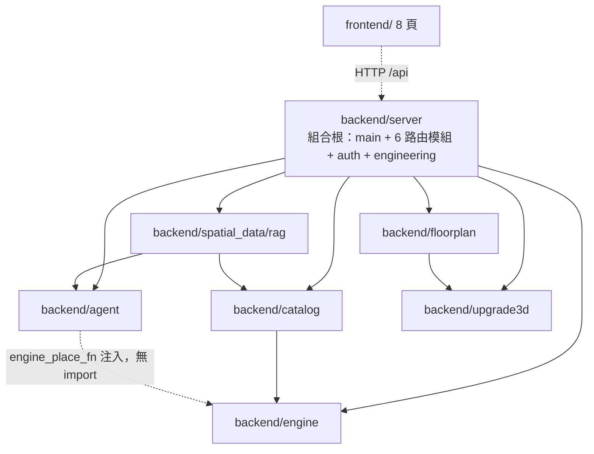
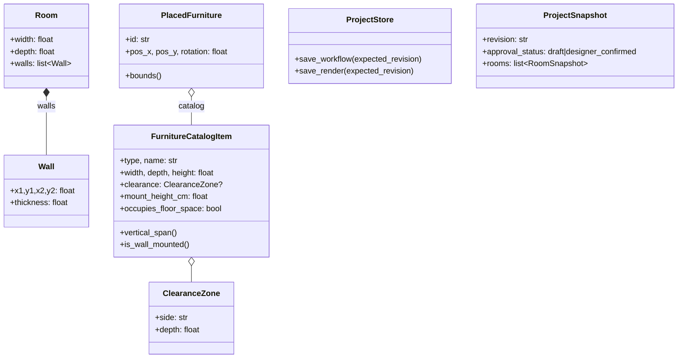
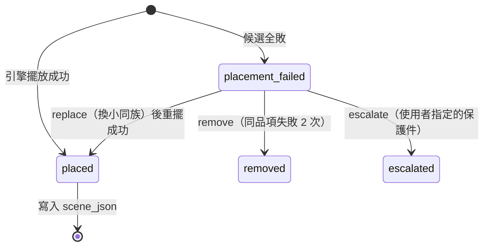
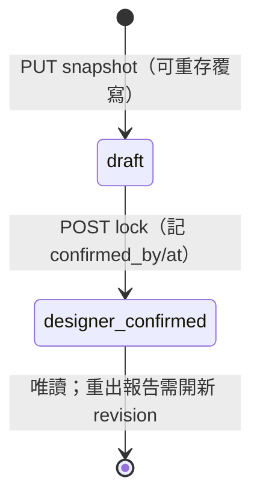
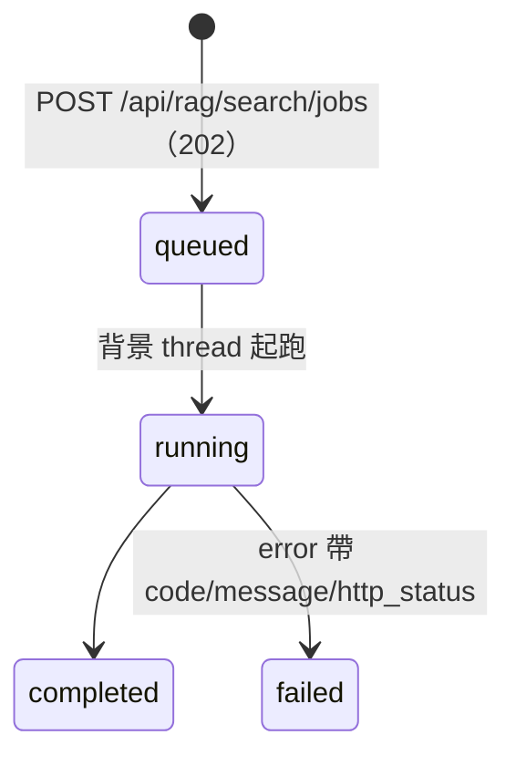

# 低階設計與程式碼地圖 (LLD / Code Map) - RoomPilot-Agent

> **版本:** v1.0 | **更新:** 2026-08-07 | **狀態:** 草稿
> **Owner:** Bella（§5 狀態機設計契約與整合）；§2–§4 為 AS-BUILT 生成物，各模組事實由目錄 owner（Cody／Django／Kai／Yen／Ancai）確認
> **語域:** L3（工程）
>
> **定位**：C4 Code 層——模組結構、檔案依賴、關鍵類別、狀態機。回答「codebase 長什麼樣、誰依賴誰」。
> 系統級架構歸 [`../03_architecture/sad.md`](../03_architecture/sad.md)；API 契約歸 [`api_spec.md`](./api_spec.md)；資料 schema 歸 [`db_design.md`](./db_design.md)。
> **實例:** 單檔；§5 狀態機每個 Aggregate 一節（本輪四個主要 Aggregate 未超量，不拆 `lld-<aggregate>.md`）
> **生成:** 2026-08-07 由 VibeCoding_Workflow_Templates/04_design/lld.md 導入 | 基準 docs/vibecoding-restructure @ 1268b2b4

## 目錄

- [1. 生成資訊](#1-生成資訊)
- [2. 模組結構](#2-模組結構)
- [3. 模組依賴圖](#3-模組依賴圖)
- [4. 關鍵類別關係](#4-關鍵類別關係)
- [5. 狀態機（設計契約）](#5-狀態機設計契約)
- [6. 追溯](#6-追溯)

## 1. 生成資訊

§2–§4 描述**程式碼現況（AS-BUILT）**，必須可重新生成，過期即重掃；不得手工修圖後宣稱是現況。

| 項目 | 值 |
| :--- | :--- |
| 生成時間 | 2026-08-07 |
| 對應 commit | `1268b2b4`（branch `docs/vibecoding-restructure`） |
| 生成方式 | AI 掃 code：import 邊逐條 grep 查證、路由裝飾器計數、`pytest --collect-only` 實跑 |
| 前身文件 | `docs/vibecoding/04_design/` 三份 LLD＋模組規格（2026-07-26 基準）為參考草稿；本檔逐項對現行程式碼複核後收斂，過期敘述（44 條路由單檔、9,350 件型錄、frontend3d 子專案等）不再沿用 |

## 2. 模組結構

本專案不採 Clean Architecture 目錄分層，以「負責人模組＋引擎／策略分離」組織（分工權威：`AGENTS.md` 目錄責任表）：

```text
backend/
├── paths.py          # 磁碟路徑單一來源：STATIC_DIR 指向 repo 根 frontend/
├── engine/           # 幾何擺放引擎：座標、碰撞、淨空、垂直佔用帶（公分制，8 檔）
├── agent/            # 選件驗證與擺位失敗修復策略；不算座標（knowledge/select/place）
├── catalog/          # 家具型錄：PostgreSQL repository、雲端 JSON 備援、燈具 lane、擺放面分類（11 檔）
├── floorplan/        # PNG/DXF 平面辨識：cody_adapter＋vision/ 15 檔管線、房型分類
├── spatial_data/rag/ # 家具向量 RAG：需求解析（LLM parser）、檢索、排序、shortlist（14 檔）
├── upgrade3d/        # DXF → 3D 結構解析（dxf_parser.py 單檔）
└── server/           # FastAPI 組合根：main.py＋六個路由模組＋auth/＋engineering/
frontend/             # 正式前端：8 頁 HTML＋50 支頂層 JS（原生 ES module，無打包）
tests/                # 113 個 test_*.py＋conftest.py（扁平）；tests/static/ 3 個 node --test .mjs
```

| 模組 | 職責（單一） | Owner | 對應 SAD 元件 |
| :--- | :--- | :--- | :--- |
| `backend/server/` | HTTP 路由、專案保存、`scene_json` 調度、渲染代理 | Bella | MOD-PROJ／MOD-SCENE／MOD-RENDER |
| `backend/server/auth/` | 帳戶、JWT、系統與專案角色授權（非成員回 404） | Bella | MOD-AUTH |
| `backend/server/engineering/` | 第 9 步工程文件：快照鎖版、估價、HTML/XLSX/JSON 產出 | Bella | MOD-REPORT |
| `backend/engine/` | 家具座標、碰撞、淨空、垂直佔用帶的唯一合法性判定 | Ancai | MOD-ENGINE |
| `backend/agent/` | 需求結構化、LLM 選件白名單閘、擺位失敗修復決策 | Yen | MOD-AGENT |
| `backend/catalog/` | 正式家具資料（PostgreSQL 優先、JSON 備援）、CloudFront 交付 | Kai | MOD-CATALOG |
| `backend/floorplan/` | 影像/DXF 辨識 → `layout_json` | Cody | MOD-FP |
| `backend/spatial_data/rag/` | 家具需求解析、向量檢索與排序（不決定幾何） | Django | MOD-RAG |
| `backend/upgrade3d/` | 已確認 layout 轉 3D 可用結構 | Cody | MOD-LAYOUT |
| `frontend/` | 登入、我的專案、八步 UI 與 Three.js 檢視器 | Bella | MOD-FRONTEND |

MOD-* 為本檔與 `sad.md` 共用的模組錨點命名（依共同簡報 AREA 字首收斂）；若 `sad.md` 元件表另有出入，以整合稽核後的 `sad.md` 為準。

規模參考（2026-08-07 `wc -l` 實測，僅列閱讀成本最高者）：

| 檔案 | 行數 | 說明 |
| :--- | ---: | :--- |
| `frontend/scene_v2.js` | 13,259 | `/scene` 八步流程頁主程式 |
| `backend/server/scene_service.py` | 3,093 | 場景生成、擺位編排、修復迴圈注入 |
| `backend/server/main.py` | 1,623 | 組合根：23 條路由＋7 個 include_router（舊版 2,796 行單檔已拆） |
| `backend/server/auth/user_store.py` | 683 | 使用者與專案成員儲存 |
| `backend/spatial_data/rag/shortlist.py` | 736 | 候選集結構化過濾＋語意排序 |
| `backend/catalog/postgres_repository.py` | 927 | PostgreSQL 型錄 provider |

## 3. 模組依賴圖

箭頭語意＝import（實線）或 HTTP／注入（虛線）；違反方向（領域模組 import `backend.server`）視為缺陷，列入 §6。



跨模組 import 邊（2026-08-07 grep 逐條查證）：

| 來源 | 目標 | 代表匯入點 |
| :--- | :--- | :--- |
| `server` → `agent` | 選件與修復 | `scene_api.py:20-21`、`scene_service.py:16` |
| `server` → `engine` | 幾何檢查與擺放 | `scene_service.py:19-23` |
| `server` → `catalog` | 型錄 provider 與擺放面 | `main.py:19-21,65,77`、`catalog_admin.py:13` |
| `server` → `floorplan` | 辨識與 OCR | `projects_api.py:24`、`main.py:22` |
| `server` → `upgrade3d` | DXF 解析 | `main.py:23`、`scene_service.py:28` |
| `server` → `spatial_data.rag` | RAG 服務與預載 | `rag_api.py:14-21`、`shortlist_api.py:19-20`、`main.py:43` |
| `spatial_data.rag` → `catalog` | 檢索資料存取 | `rag/service.py:11-12`、`rag/shortlist.py:26` |
| `spatial_data.rag` → `agent` | 族系知識表 | `rag/shortlist.py:25`（`FAMILY_OF`／`family_of`） |
| `catalog` → `engine` | 只取 dataclass | `style_db.py:10`（`ClearanceZone`, `FurnitureCatalogItem`） |
| `floorplan` → `upgrade3d` | DXF round-trip 驗證 | `vision/confirmation.py:11` |

**規則（現況歸納）**：

1. `backend/server` 是唯一組合根，單向 import 六個領域模組；反向零 import（grep 僅 `agent/__init__.py:9` docstring 文字，非程式依賴）。現況為 DAG，無循環依賴。
2. `agent`、`engine`、`upgrade3d` 是葉層；`agent` 不 import `engine`，座標一律經注入的 `engine_place_fn`（`place.py:135`，注入點 `scene_service.py:2945`）。
3. 路由已拆模組：`main.py` 23、`projects_api.py` 14、`auth/api.py` 12、`scene_api.py` 8、`engineering/api.py` 8、`rag_api.py` 5、`catalog_admin.py` 4、`shortlist_api.py` 3，共 **77 條路由裝飾器**（2026-08-07 grep 實測；路由表歸 [`api_spec.md`](./api_spec.md)）。
4. 資料 provider 三開關：`ROOMPILOT_CATALOG_PROVIDER`（預設 postgres，`catalog/postgres_repository.py:203`）、`ROOMPILOT_PROJECT_STORE_PROVIDER`（程式預設 sqlite，`server/project_store.py:654`）、`ROOMPILOT_RUNTIME_CATALOG_PROVIDER`（未設時跟隨 catalog provider，`catalog/runtime_catalog_repository.py:49`）。測試 conftest 強制 sqlite＋json 保持離線確定性（`tests/conftest.py`）。
5. 前端磁碟位置只由 `backend/paths.py:25` 的 `STATIC_DIR` 決定（AGENTS.md 契約）；`main.py:340` 掛載 `/static`。

## 4. 關鍵類別關係

只畫「看不懂就無法安全改動」的核心（≤10）。本 repo 的領域模組以「dataclass＋模組函式」為主，業務類別集中在 server 層。



| 類別 | 定義位置 | 複核備註（對 2026-07-26 草稿的差異） |
| :--- | :--- | :--- |
| `Wall`／`Room` | `backend/engine/models.py:18,28` | 不變；單位公分、左下原點、position=中心 |
| `ClearanceZone` | `backend/engine/models.py:36` | 不變；side ∈ front/back/left/right |
| `FurnitureCatalogItem` | `backend/engine/models.py:48` | **新增垂直佔用帶欄位**：`mount_height_cm`、`occupies_floor_space`、`overlap_allowed_types`（擺放規則 Phase 2）；搭配 `geometry.py:65 may_share_floor_space`、`geometry.py:96 rests_within_host` |
| `PlacedFurniture` | `backend/engine/models.py:81` | 不變 |
| `SelectionParseError`／`SelectionUnavailableError` | `backend/agent/select.py:42,46` | 行號更新；語意不變（LLM 選件降級信號） |
| `ProjectStore` 例外族 | `backend/server/project_store.py:31-47` | 新增 `ProjectStoreUnavailable`／`ProjectStoreBusy`（PostgreSQL provider 降級信號）；`ProjectVersionConflict`、`WorkflowTooLargeError` 沿用 |
| `ProjectSnapshot`／`JobStatus` | `backend/server/engineering/models.py:131,519` | 新增（第 9 步工程文件子系統，Pydantic StrictModel） |
| 擺放面分類 | `backend/catalog/placement_surface.py:11-50` | 新增：`floor`／`tabletop`／`wall`／`floor_covering` 四值，決定 2D/3D 是否佔地 |

## 5. 狀態機（設計契約）

本節是**人工核准的設計契約**：enum 合法值與轉移規則在此定義，`db_design`／`api_spec` 引用不重複定義。每個 Aggregate 一小節。

### 5.1 專案工作流（Workflow Aggregate）

步驟順序的唯一有序權威是 `frontend/scene_workflow.js:4-16` 的 `WORKFLOW_STEPS`（11 個內部步驟；伺服器端 `projects_api.py:52-64` 同名 set 只驗步驟名不驗順序）。產品文案的「八步流程」是 README 的使用者視角編號，內部步驟以本表為準：

```text
project → upload → recognition → calibration → space_confirmation
→ requirements → layout_2d → white_model_3d → realistic_3d
→ proposal_review → ai_render
```

| 目前狀態 | 事件 | 下一狀態 | 副作用 |
| :--- | :--- | :--- | :--- |
| 任一步 | `complete(step)`（通過 `validCompletion` 欄位檢查） | step 加入 `completed`，`currentStep=step` | `markDownstreamStale`：下游已完成步驟全部失效並清資料，`staleFrom=step`（`scene_workflow.js:207-219`） |
| 任一步 | `goTo(step)` | 僅當 `REQUIRED_COMPLETIONS[step]` 全部完成才允許進入（`scene_workflow.js:43,196-199`） | 無 |
| 任一步 | `invalidateFrom(step)`（結構變更回到第 4 步） | step 起（含）全部已完成狀態失效 | 系統重新驗證目前家具（`scene_workflow.js:329-343`） |

伺服器側併發契約（與前端狀態機共同構成 Aggregate）：`PUT /api/projects/{id}/workflow` 帶 `expected_revision`，revision 不符回 409 `project_revision_conflict`（`projects_api.py:376,426,509`；樂觀鎖實作 `project_store.py:234-279`、`postgres_project_store.py:263-341`）；workflow payload 超限回 413 `workflow_too_large`（`projects_api.py:386`）。revision 為單調遞增整數，每次成功寫入 +1。

### 5.2 場景擺位（Scene Aggregate）

場景物件的擺位生命週期。座標只由 `backend/engine/` 產生；agent 只做決策（AGENTS.md 契約）。



| 目前狀態 | 事件 | 下一狀態 | 副作用 |
| :--- | :--- | :--- | :--- |
| `placement_failed` | agent 選出較小同族替代品 | 重擺（`engine_place_fn`） | report 記 `action: "replace"`（`place.py:240`） |
| `placement_failed` | 同品項已失敗 2 次或無替代品 | `removed` | report 記 `action: "remove"`（`place.py:170`） |
| `placement_failed` 且在 `protected_ids` | 保護件不自動替換 | `escalated`（留給人工） | report 記 `action: "escalate"`（`place.py:191`） |

迴圈上限 `max_rounds=3`（`place.py:137`）；修復報告 `placement_resolution_report` 隨場景 payload 回傳，action 詞彙與 `docs/contracts/AGENT_FRONTEND_BACKEND_CONTRACT.md` 一致。單件拖曳驗證走 `POST /api/scene/validate`（`scene_api.py:703`）同一套 `check_placement_with_clearance` 判定。

### 5.3 工程快照與報告（Engineering Snapshot／Report Aggregate）

第 9 步 `/engineering` 的鎖版與產出。兩個 enum 都定義於 `backend/server/engineering/models.py`。

`approval_status`（`models.py:9`）：



| 目前狀態 | 事件 | 下一狀態 | 守衛與副作用 |
| :--- | :--- | :--- | :--- |
| （無） | `PUT /api/v1/projects/{id}/revisions/{rev}/snapshot` | `draft` | 只收 `draft`；已鎖定的 revision 拒絕覆寫（`repository.py:128-144`） |
| `draft` | `POST …/revisions/{rev}/lock` | `designer_confirmed` | 專案 revision 已前進則 409 `SNAPSHOT_SOURCE_REVISION_STALE`（`api.py:419-447`） |
| `draft` | `POST …/engineering-packages` | — | 409 `REVISION_NOT_LOCKED`：未鎖定不得產文件（`api.py:270-277`） |

產出任務 `JobState`（`models.py:11-17`）：`queued → processing → completed | completed_with_warnings | failed`。`POST /api/v1/projects/{id}/engineering-packages` 回 202＋job_id，背景產 HTML／XLSX／JSON 三份文件（`documents.py`；本機缺 XLSX artifact 工具時走相容層，不拖垮整包——commit `791ded44`、`3f479c6b`）。

### 5.4 RAG 檢索任務（RAG Search Job）

`backend/server/rag_api.py:160-202`。in-memory 佇列，容量守衛防灌爆。



| 目前狀態 | 事件 | 下一狀態 | 守衛與副作用 |
| :--- | :--- | :--- | :--- |
| — | 建立 job，active（queued＋running）已達上限 | 拒絕 | 429 `rag_job_capacity_reached`（`rag_api.py:167-173`） |
| `queued` | thread 起跑 | `running` | `stage="starting"`，progress 回報（`rag_api.py:84-95`） |
| `running` | 檢索完成／失敗 | `completed`／`failed` | 終態 job 逾時清理（`rag_api.py:66`）；查詢不到回 404 `rag_job_not_found` |

### 5.5 其他小型生命週期（設計上刻意退化）

| Aggregate | 狀態 | 說明 |
| :--- | :--- | :--- |
| AI 渲染任務 | 每任務 `completed`／`failed`（無中間態） | 同步生成即入庫（`render_providers.py:484-576`）；單房失敗不中止整批，全部失敗才拋原始錯誤，失敗卡可單獨重試 |
| 帳戶 | `is_active: true ⇄ false` | admin `set-active` 停用即生效、token 全失效、不能停自己（`auth/models.py:88`、README 帳戶端）；系統角色 `admin/designer/client`、專案角色 `owner/editor/viewer`（`auth/models.py:42,46`）為授權維度，非狀態機 |
| 存取憑證 | 簽發 → 過期／撤銷 | access 30 分、refresh 14 天（`auth/tokens.py:27-28`，env 可調）；改密碼撤銷所有 session |

## 6. 追溯

| 項目 | ID／連結 |
| :--- | :--- |
| 上游 | [`../03_architecture/sad.md`](../03_architecture/sad.md) 元件（MOD-*，§2 對照表）；需求映射待 `srs.md` 的 `FR-PROJ-*`／`FR-SCENE-*`／`FR-ENGINE-*`／`FR-RAG-*`／`FR-REPORT-*` 定稿後由索引對齊（本檔不預填未定稿 ID） |
| 下游 | [`db_design.md`](./db_design.md)（revision／approval_status 欄位）與 [`api_spec.md`](./api_spec.md)／[`openapi-roompilot-v1.yaml`](./openapi-roompilot-v1.yaml)（狀態 enum 與錯誤碼引用 §5，不重複定義）；[`../05_qa/test_plan.md`](../05_qa/test_plan.md)（狀態轉移測試對照） |
| 契約引用 | `docs/contracts/AGENT_FRONTEND_BACKEND_CONTRACT.md`（§5.2 action 詞彙）、`docs/contracts/LAYOUT_SCENE_BOUNDARY_CONTRACT.md`（layout_json ↔ scene_json 邊界）、AGENTS.md 不可違反契約（公分制、engine 唯一合法性判定） |
| 已知分層違規 | 無（2026-08-07 grep 複核：import DAG 無循環、領域模組零反向依賴）。既知殘留：`engine/schema.py` 的 LLM tool 常數與 `engine/adjustment.py` 在 `backend/server` 仍零呼叫點（2026-08-07 grep 複核），屬死碼候選、去留待 Ancai 裁決；依賴方向無 CI 自動守門，靠人工 review |
| 驗證證據 | `pytest --collect-only -q` 收集 **1,053** 個測試（2026-08-07 實跑；未全量執行，通過率不在本檔宣告範圍）；node 側 `tests/static/` 3 個 `.test.mjs` |
