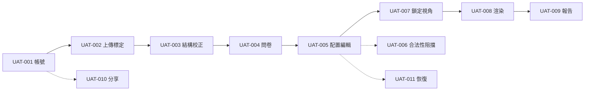

# 使用者驗收測試計畫 (UAT Plan) - RoomPilot

> **版本:** v0.1 | **更新:** 2026-08-07 | **狀態:** 草稿（本輪全部情境未執行，無任何簽核）
> **Owner:** Ben（驗收主導：辨識資料 QA、評估與版本證據，見 `AGENTS.md`／README 團隊責任表）；Bella（端到端整合支援）。簽核授權：**待指派**——repo 內無簽核授權紀錄。
> **原則:** UAT 驗的是「符不符合真實業務流程」，不是重跑 QA 測試；Demo 不等於驗收。
> **語域:** L1（業務）——正文不出現工程細節；必要的工程座標退到各節「工程附註」與連結。
> **定位:** 本文件回答「本輪驗收什麼、誰來驗、怎麼算通過」。QA 測試策略與自動化測試歸 [test_plan.md](test_plan.md)；工程驗證指令歸 [`AGENTS.md`](../../../AGENTS.md) 驗證矩陣與 [部署與維運文件](../06_ops/deployment_and_operations.md)。
> **實例:** 每輪驗收一份（模板命名 `UAT_<專案>_<階段>_<客戶>_<日期>`；本專案無外部客戶，客戶欄省略）。本檔為輪次 **UAT_RoomPilot_Pilot_20260820**——錨定 2026-08-20 成果發表（**未查證，團隊口述**，repo 內無任何紀錄）。計畫檔名維持 `uat_plan.md`（單一計畫檔便於連結穩定）；輪次代號用於執行紀錄與證據檔命名（見 §4 證據欄），新一輪驗收時更新本欄輪次並歸檔前輪證據。
> **生成:** 2026-08-07 由 VibeCoding_Workflow_Templates/05_qa/uat_plan.md 導入 | 基準 docs/vibecoding-restructure @ 1268b2b4

---

## 目錄

- [1. 驗收範圍與參與者](#1-驗收範圍與參與者)
- [2. 驗收情境](#2-驗收情境)
- [3. 問題分級與處理](#3-問題分級與處理)
- [4. 簽核 (Sign-off)](#4-簽核-sign-off)
- [5. 追溯](#5-追溯)

## 1. 驗收範圍與參與者

| 項目 | 內容 |
| :--- | :--- |
| **驗收範圍** | 從註冊登入到成果報告的完整住宅設計旅程：登入並選擇專案 → 八步設計工作流（建立專案、上傳平面圖、確定尺寸、空間與結構校正、需求問卷、配置與 2D/3D 預覽、方案鎖定與視角、AI 渲染成果包）→ 成果報告與明細頁。旅程定義以 [README「現行八步流程」](../../../README.md) 為準。對應 REQ/DEC ID：**待補**——需求決策由 owner 於需求決策追蹤簿拍板後回填；本輪三本追蹤簿未實例化，AI 不得代填。 |
| **參與者** | 本專案為課程專案（AIPE03 第四組），無外部客戶。驗收執行：組內成員互驗，操作角色見 §2；驗收方＝成果發表評審與組內拍板者（**未查證，團隊口述**）。誰有簽核權：**待指派**。 |
| **環境與資料** | 本機開發環境啟動的網站，瀏覽器實機操作（啟動方式見 [README 快速啟動](../../../README.md)）。家具資料以團隊資料庫為優先來源；資料庫不可用時系統會明確回報並暫停家具選件，不會自行改用其他資料。如需離線演示，須事前由技術人員切換備援模式，並在執行紀錄註記資料來源。發表當日環境形態（本機 demo 或雲端）**待團隊裁決**；多人跨機連線驗收的操作方式**待定**（兩項均沿 2026-07-26 版[待人工確認清單](../../vibecoding/INDEX.md) A-6、A-9，本輪未查得新事證）。 |
| **時程** | 錨定 2026-08-20 成果發表（**未查證，團隊口述**）。UAT 起訖日期與每日安排：**待排定**。 |

> **工程附註**（L1 正文不展開）：本機服務連接埠 8002（README 快速啟動）；基準走查平面圖 `testdata/png/floor01.png`（已確認存在）；成果報告頁為獨立頁面（`frontend/engineering.html`）。第 6 步瀏覽器驗收須以真人滑鼠實機操作，既有錄放工具在此畫面不可靠——限制紀錄見 [`docs/backlog/BELLA_TEST1_STEP567_INTEGRATION.md`](../../backlog/BELLA_TEST1_STEP567_INTEGRATION.md) §8。

---

## 2. 驗收情境

以真實業務流程為單位，不以功能為單位。情境自 README 八步旅程與現行頁面實查推導；「對應 SCN」已對齊 [test_plan](test_plan.md) §2 現版的 TC→SCN 對照，SCN 定義的最終權威在 prd／srs，定稿若有出入以該處為準並回改本表。全部情境**未執行**，不存在任何已驗收結果。

### 2.1 執行前準備

| 準備項 | 內容 | 狀態 |
| :--- | :--- | :--- |
| 測試帳號 | 三組：設計師（主要操作者）、受分享唯讀者、未受邀者。注意：全新環境**第一個註冊的帳號會自動成為管理員**（README 帳戶端），請先建妥管理員再開放測試註冊 | 待建立 |
| 基準平面圖 | 一張已知至少一段牆實際長度的平面圖，供 UAT-002 標定比對（建議用團隊既有基準走查圖，見 §1 工程附註） | 已有候選 |
| 家具資料來源 | 確認團隊家具資料庫連線正常。資料庫不可用時系統會明確回報並暫停家具選件——這是正常防護行為，不是缺陷；如需離線演示，須**事前**由技術人員切換備援模式（候選家具內容可能與正式資料庫不同），執行紀錄**必須註記當時實際使用的資料來源** | 待確認 |
| 外部生圖服務 | UAT-008 的前置條件；可達性無法由 repo 內驗證 | 待確認 |
| 驗收環境形態 | 本機 demo 或雲端，待團隊裁決（§1） | 待裁決 |

### 2.2 情境總表

| ID | 業務情境 | 操作角色 | 通過準則（可觀察） | 對應 SCN | 狀態 |
| :--- | :--- | :--- | :--- | :--- | :--- |
| UAT-001 | 註冊帳號、登入、進入「我的專案」，建立新專案後能再次開啟 | 設計師（組員扮演） | 未登入無法進入設計流程；註冊後可登入；建立的專案出現在「我的專案」並可重新開啟 | SCN-AUTH-01 | 未執行 |
| UAT-002 | 上傳平面圖（PNG/JPG/DXF），以兩點標定確認全屋公分尺度 | 設計師 | 上傳後看得到辨識結果；標定後以一段已知長度的牆比對，全屋尺寸與屋主認知一致 | SCN-FP-01、SCN-FP-02 | 未執行 |
| UAT-003 | 校正空間、牆、門、窗，手繪標定樑與柱；逐一確認系統點名「需人工複核」的房間 | 設計師 | 被點名的房間看得到提醒與理由，可就地改名或調整；樑柱以手繪完成（辨識不出樑柱是設計決策，不算缺陷）；全部確認後才能進下一步 | SCN-FP-03 | 未執行 |
| UAT-004 | 先選全屋風格、材質與冷氣範圍，再逐房填用途、家具類型、尺寸與數量；家電需求（如冰箱、洗衣機）記入問卷 | 設計師 | 問卷送出後每個房間得到家具候選建議；家電不出現在後續自動擺設，但反映在 AI 渲染情境中 | SCN-AGENT-01、SCN-RAG-01、SCN-CATALOG-03 | 未執行 |
| UAT-005 | 產生配置，在同一畫面同步編輯 2D/3D 家具並走動預覽 | 設計師 | 移動家具時 2D 與 3D 一致；牆體為連續牆面、門片嵌在門洞內（目視）；走動預覽可穿過門洞 | SCN-SCENE-02、SCN-ENGINE-01 | 未執行 |
| UAT-006 | 刻意製造不合法擺放（碰撞、淨空不足、超出邊界），再修改結構觸發重新驗證 | 設計師 | 不合法擺放被擋下並說明原因，無法進下一步；結構變更會回到第 4 步，既有家具被重新驗證 | SCN-ENGINE-01、SCN-SCENE-03 | 未執行 |
| UAT-007 | 鎖定方案，逐一為每個空間挑選並微調生成視角 | 設計師 | 鎖定後配置不再被誤改；每個空間至少能保存一個視角 | SCN-RENDER-01 | 未執行 |
| UAT-008 | 依問卷、家具、材質、色卡與視角產生逐房 AI 渲染成果 | 設計師 | 每個選定空間拿到成果圖；圖面反映問卷寫明的不可變條件與家電情境。前置條件：外部生圖服務可用（**待確認**——服務可達性無法由 repo 內驗證） | SCN-RENDER-02 | 未執行 |
| UAT-009 | 開啟成果報告與明細：設計風格語彙、家具採購明細、工程施工費與初步工期 | 設計師＋驗收方 | 家具採購與工程施工費分開列示、不合計；查無價格的品項不以已知小計冒充總價；設計語彙如實標示為團隊編纂（信心中等） | SCN-REPORT-01、SCN-REPORT-02、SCN-REPORT-03 | 未執行 |
| UAT-010 | 設計師把專案分享給另一個帳號；受分享者以唯讀身分檢視；未受邀者嘗試存取 | 設計師＋客戶角色（組員扮演） | 受分享的唯讀成員只能看、不能改；未受邀者完全看不出該專案存在 | SCN-AUTH-02 | 未執行 |
| UAT-011 | 中途關閉瀏覽器或登出，重新登入後開啟同一專案 | 設計師 | 回到離開時的步驟與內容，已確認的結構、問卷與配置不遺失 | SCN-PROJ-01 | 未執行 |

> **工程附註**：UAT-003 的「需人工複核」提醒為 2026-08-03 已接線的功能（背景見 [`docs/backlog/RECOGNITION_REVIEW_ITEMS_UNWIRED.md`](../../backlog/RECOGNITION_REVIEW_ITEMS_UNWIRED.md)）；UAT-005 的牆體顯示路線於 2026-08-06 改版後**尚未完成瀏覽器目視驗收**（見 [`docs/backlog/WALL_GEOMETRY_BROKEN_IN_3D.md`](../../backlog/WALL_GEOMETRY_BROKEN_IN_3D.md)），本情境執行時即為該目視驗收的正式場合。

### 2.3 逐情境走查要點

情境有先後依賴：UAT-001 到 UAT-009 依旅程順序走（同一個專案一路走到底最省時）；UAT-006 可在 UAT-005 完成後隨時插入；UAT-010、UAT-011 只需 UAT-001 完成後任一時點執行。

執行者依下列要點走查；每一點都是可觀察的業務行為，不含工程操作。

- **UAT-001**：註冊 → 登出 → 重新登入 → 建立專案 → 回「我的專案」重新開啟。另以未登入狀態直接開設計頁面，應被帶回登入。
- **UAT-002**：上傳 → 等辨識完成 → 兩點標定並輸入已知牆長 → 確認。抽查另外兩段牆的長度是否與認知相符；記下系統點名待複核的房間數，銜接 UAT-003。
- **UAT-003**：逐一點開被點名的房間，就地改名或調整範圍；手繪至少一處樑或柱；「整批確認」不能替被點名的房間背書——被點名者仍須逐間確認後才能過關。
- **UAT-004**：全屋風格／材質／冷氣範圍 → 逐房用途、家具類型、尺寸與數量 → 在任一房寫入家電需求與**一條不可變條件**（自由文字，供 UAT-008 對圖）→ 送出。確認每房出現候選家具，且家電不在候選清單內。
- **UAT-005**：產生配置 → 在 2D 移動一件家具、看 3D 是否同步 → 環視牆面與門片 → 走動預覽實際穿過一扇門。地板與牆面應反映問卷所選材質。
- **UAT-006**：刻意把家具推成重疊、貼牆過近、推出房外三種狀態，每種都應被擋下並說明原因；回第 4 步改動一面牆後返回，既有家具應被重新驗證。
- **UAT-007**：鎖定方案 → 每個空間選視角並微調 → 保存。鎖定後的配置不應因後續操作而改變。
- **UAT-008**：送出逐房渲染並等待成果。逐圖核對 UAT-004 寫入的不可變條件與家電情境是否反映在畫面中。
- **UAT-009**：以鎖定版開啟成果報告，核對：家具採購與工程施工費**分開列示、不合計**；查無價格的品項不得以已知小計冒充總價；設計語彙標示為團隊編纂（信心中等）。
- **UAT-010**：設計師分享唯讀權限給第二帳號 → 唯讀者登入檢視（不能改）→ 第三個未受邀帳號嘗試開啟，應看不出該專案存在的任何跡象。
- **UAT-011**：在第 6 步中途直接關閉瀏覽器 → 重新登入開啟同一專案，應回到離開時的步驟，結構、問卷與配置皆不遺失。

### 2.4 本輪不驗（邊界）

| 不納入項 | 去處 |
| :--- | :--- |
| 效能、資安、自動化回歸、契約測試 | QA 範疇，歸 [test_plan](test_plan.md)；UAT 不重跑 QA 測試 |
| 家具資料庫維運、匯入正確性 | 工程驗證，歸 `AGENTS.md` 驗證矩陣 |
| 多人**同時**編輯同一專案 | README 未宣稱此能力；如有此需求，走 `/intake` 進需求候選 |
| 手機／平板瀏覽器 | README 未宣稱支援範圍；本輪僅桌面瀏覽器（**假設**，待 owner 確認） |
| 無障礙（鍵盤導航、螢幕閱讀器） | 未列本輪驗收目標（沿 2026-07-26 版待確認清單 C-5，該項系統性驗證從未執行） |

---

## 3. 問題分級與處理

| 等級 | 定義 | 處理 |
| :--- | :--- | :--- |
| A－阻擋 | 業務流程走不下去（如：無法進下一步、成果圖產不出來） | 修復後重驗，UAT 不通過 |
| B－重要 | 有替代做法但影響效率（如：需重整頁面才能繼續） | 修復或列入下版，需驗收方同意 |
| C－建議 | 體驗改善 | 進需求候選（`/intake`） |

每筆問題記錄至少包含：情境 ID（UAT-*）、發生步驟（旅程第幾步）、實際看到的行為與預期差異、截圖或錄影、當時的資料來源註記（§2.1）。問題單去處：**待定**——本輪追蹤簿未實例化，暫記於執行紀錄檔（§4 證據欄），由 owner 事後移入 `qa_tracker.xlsx`。

---

## 4. 簽核 (Sign-off)

本輪判定規則（草案，簽核人可於執行前調整）：11 個情境全數執行且 A 級問題為零 → 「通過」；存在未修復 B 級但驗收方同意處理方式 → 「條件式通過（附條件）」；任一 A 級未修復或有情境未執行完 → 「不通過」。

| 項目 | 內容 |
| :--- | :--- |
| **結果** | **未執行**——本輪尚未開始，無「通過／條件式通過／不通過」任何結果 |
| **未解決項目** | 不適用（未執行）。執行前已知的前置風險：UAT-008 外部生圖服務可達性待確認、UAT-005 牆體目視驗收未完成（見 §2 工程附註） |
| **簽核人／日期** | 待指派 ／ — |
| **證據** | 執行後以輪次代號留存執行紀錄（如 `UAT_RoomPilot_Pilot_20260820.xlsx`，存放位置待定）；目前**無任何證據檔** |

> 簽核結果回寫 `requirements_tracker.xlsx` ③Gate；證據依穩定 ID 進 `qa_tracker.xlsx` ②執行證據（不得被生成覆寫）。本輪三本追蹤簿未實例化，回寫一律由 owner 親自執行，AI 不得代填（依 [workflow_manual](../../../VibeCoding_Workflow_Templates/_meta/workflow_manual.md) §8）。

## 5. 追溯

| 項目 | ID |
| :--- | :--- |
| 上游 | DEC-*：待 owner 於需求決策追蹤簿①拍板（本輪未填）；SCN-*（ACPT）：本檔 §2.2 已對齊 [test_plan](test_plan.md) §2 現版 TC→SCN 對照，最終權威在 prd／[srs](../01_requirements/srs.md)，定稿有出入時以該處為準回改 |
| 同層分工 | [test_plan.md](test_plan.md)（QA 測試策略與自動化；UAT 不重跑 QA 測試） |
| 簽核回寫 | `requirements_tracker.xlsx` ③Gate（未實例化，owner 執行） |
| 證據 | `qa_tracker.xlsx` ②執行證據（UAT-001～UAT-011，全部未執行） |
| 本檔來源座標 | 旅程：`README.md`「現行八步流程」；步驟按鈕實查：`frontend/scene.html`（恰 8 顆步驟按鈕）；已知風險：`docs/backlog/`；待確認事項沿用：`docs/vibecoding/INDEX.md` 待人工確認清單（2026-07-26 版，逐項標註是否複核） |
