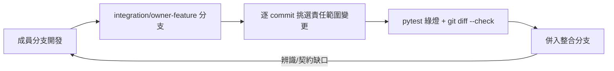
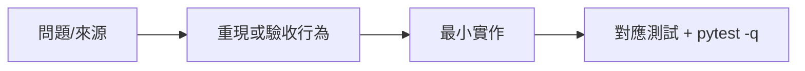

# RoomPilot-Agent 產品開發流程使用說明書

> 本文件由 VibeCoding v5.0 模板 00_meta/workflow_manual.md 導入 RoomPilot-Agent | 基準：分支 django-skill、commit a2179f7e、日期 2026-08-04

> **版本：** v1.0（v5 導入版）| **更新：** 2026-08-04 | **狀態：** 活躍
>
> 取代舊導入版 `docs/vibecoding/01_workflow_manual.md`（2026-07-26 對舊分支填寫，44 條路由／10 顆步驟按鈕年代的數字均已過期）。本版所有數字對 2026-08-04 工作樹實查；查不到的標「(未查證)」。

## 1. 使用原則

- **用問題管理文件：** RoomPilot 的文件層級是為了降低跨 owner 誤解。衝突優先序為「自動化測試 > 可執行程式 > 正式契約（`docs/contracts/`，現有 22 個檔案：17 個 .md、1 個 .yaml、3 個 .schema.json、1 個 example.json）> 總覽文件」。不能減少下一次返工的文件就別寫。
- **決策分兩類：**
  - **需求決策**（範圍、步驟流程、發表目標）由團隊拍板，落點是 `README.md`（現行八步流程、整合規則）與 `docs/TEAM_AI_OWNERSHIP.md`（責任邊界）。本專案沒有模板要求的 Excel B 區與 `18 需求決策紀錄`——課程專題單團隊 7 人，需求決策以 README 段落與 commit 訊息承載。
  - **工程決策**（架構、契約、測試設計）落在 `docs/contracts/` 與各目錄最近的 `AGENTS.md`。硬邊界的實例：家具合法位置只由 `backend/engine/` 判定、幾何決策不得移進 Graph RAG／瀏覽器／LLM（根目錄 `AGENTS.md` 不可違反契約清單，:50-60）。
- **來源先行：** 動手前依 `AGENTS.md`（:7-12，節標題在 :5）六步：README → `docs/TEAM_AI_OWNERSHIP.md` + owner profile → 最近的 AGENTS.md 與 contracts → `git status --short` 保留他人變更 → 追查輸入/輸出/座標單位/保存邊界/測試 → 修改前說明檔案與驗證指令。
- **欄位級 SSOT：** 同一資訊只有一個維護來源。實例：官方雲端型錄母集合是 8,557 筆（`backend/catalog/cloud_catalog.py`:15 `OFFICIAL_CATALOG_COUNT`，載入期硬驗證；`docs/TEAM_AI_OWNERSHIP.md`:57 與該檔 docstring 同數），由 `JSON/furniture/furniture_official_catagory.json`（count=8557）＋`JSON/manifests/glb_upload_all_result.csv`（8,557 筆資料列）一對一決定（`main.py:137-146`）；`backend/catalog/data/README.md`（:3-11）宣告的另一組兩檔（`furniture_catalog_cloud_9350.json` 與 `manifests/glb_upload_all_result.csv`，同為 9,350 個唯一 id）是舊 fallback 來源、程式碼未引用，該 README 已與程式碼漂移——9,350（舊 fallback 來源檔 count）、8,557（官方母集合）、9,349（`rag/` 向量索引筆數，已排除 1 筆非家具）是三個不同數字，不可互代；步驟順序唯一有序來源是 `backend/server/static/scene_workflow.js` 的 `WORKFLOW_STEPS`（:4-16）。
- **風險裁剪：** 課程專題不填滿模板；只維護協作真正需要的契約（見第 9 節）。
- **小步交付：** 成員在各自分支開發，整合走 `integration/<owner>-<feature>` 分支逐 commit 挑選，只移植責任範圍內、符合現行契約的 commit（`README.md`「版本控制與整合」段）。
- **狀態分離：** Requirement（README/contracts）、Code reality（工作樹）、Verification（pytest 綠燈）、Release（無正式發布軸，成果＝結業發表 Demo）不共用一個狀態。
- **降認知負載／思考模式：** 模板連結的 `.claude/rules/thinking-boundary.md` 在本 repo 實際存在（`.claude/rules/` 另有 git-workflow.md、golden-rules.md、language-register.md），速通/深思邊界依該檔。模板另一連結 `docs/document-system/workbook-guide.md` 在 repo 不存在，註「(未查證：來源不在 repo)」。

**角色表（取代模板的 Business/PM/… 縮寫）**——依 `docs/TEAM_AI_OWNERSHIP.md`（:19-34 目錄責任表；:3 明示 Git author 不能單獨視為 owner）：

| 負責人 | 主要目錄 | 職責 |
| :--- | :--- | :--- |
| Bella | `backend/server/`、`backend/server/static/`、`frontend3d/`、`docs/contracts/`（整合） | FastAPI、八步工作流、正式 UI、契約整合 |
| Cody | `backend/floorplan/`、`backend/upgrade3d/` | PNG/DXF、牆門窗房間辨識、DXF→3D 幾何 |
| Django | `backend/spatial_data/`（含 `rag/`） | 房間推論、空間資料、家具 RAG runtime |
| Kai | `backend/catalog/` | 家具型錄、AWS manifest、PostgreSQL 五階段 |
| Yen | `backend/agent/` | 需求結構化、LLM 選件與擺位紀律 |
| Ancai | `backend/engine/` | 幾何配置、碰撞與淨空——幾何與規則的唯一裁決者 |
| Ben | 辨識 QA / evaluation | 辨識品質評估 |

資料流方向（`docs/TEAM_AI_OWNERSHIP.md`:40-51）：floorplan(Cody) → spatial_data(Django) → `layout_json` → agent(Yen) → catalog(Kai) → engine(Ancai) → `scene_json` → server(Bella)。

## 2. 工作入口

模板的 `/intake → /specify → /deliver → /verify` 四個 Action，在本 repo `.claude/skills/` 有同名 skill 目錄（intake/specify/deliver/verify，各含 SKILL.md，皆 `disable-model-invocation: true`），但**未進版控**（`git ls-files .claude/skills/` 只列四支 roompilot-* 的 14 個檔案），且 intake skill 以 Excel workbook 為輸入——本專案沒有 Excel 需求活頁簿，此四支屬模板包附帶、非現行流程。RoomPilot 實際的工作入口是：



| 入口 | 目的 | 人類控制點 |
|---|---|---|
| 成員分支 | 各 owner 在自己目錄開發（遠端分支 17 條：`git branch -r` 實數 18 行扣除 `origin/HEAD -> origin/main` 別名；`git branch -a` 為 21 行，含 3 條本機分支） | owner 自審 |
| `integration/<owner>-<feature>` | `git diff --name-status bella...origin/<owner-branch>` + `git log --oneline bella..origin/<owner-branch>` 逐 commit 檢視 | 整合者只挑責任範圍內 commit |
| 專案 skill（已進版控的四支） | roompilot-security（資安稽核）、roompilot-furniture-query（口語→RAG 檢索句）、roompilot-proposal（ReportPayload→屋主提案）、roompilot-budget（ReportPayload→工程估價） | 使用者顯式呼叫 |
| 驗證 | `AGENTS.md` 驗證矩陣（見第 8 節） | 綠燈才併 |

無 GitHub PR 自動化：repo 無 `.github/`、無 CI（2026-08-04 `ls -d .github` 實測不存在）。

## 3. Profile 選擇

| 條件 | Fast | Product | Governed | RoomPilot 現況 |
|---|:---:|:---:|:---:|---|
| 單一 bug、小功能、可逆實驗 | ✓ | | | 多數日常 commit（如 `ffd38968` refactor(scene)：僅 `backend/server/scene_service.py`＋1 支對應測試） |
| 一般產品功能、跨模組 | | ✓ | | 跨 owner 目錄的功能（如 `e813e9ee` fix(catalog) 跨 `backend/catalog/`＋`backend/server/`＋`static/`；`6e9ace0c` 門弧淨空跨 `backend/server/`＋`scripts/runtime_catalog/`，未動 `backend/catalog/`） |
| 多團隊、外部契約、正式 UAT | | | ✓ | 不適用：單團隊 7 人 |
| 個資、法規、安全或不可逆遷移 | | | ✓ | 局部觸發：PostgreSQL 遷移（Phase 3 專案保存）與遠端渲染個資剝除按 Governed 精神留契約與測試 |
| 正式 on-call、高可用、稽核 | | | ✓ | 不適用：單機 uvicorn + 本機 `.runtime/` |

**判定：整體採 Fast/Product 混合**——單目錄修正走 Fast，跨 owner 修改走 Product（強制 `AGENTS.md`:20-28 的跨資料夾六欄記錄：主要 owner／協作 owner／修改檔案／改變的資料契約或流程／為何不能只在單一目錄完成／兩端驗證測試）。高風險子範圍不因整體是課程專題就省略：PostgreSQL 五階段每階段都有獨立契約（`docs/contracts/POSTGRESQL_*.md` 共 7 份，含 embeddings 與 RAG runtime），公分制 payload 改動必須更新兩端測試（專案 CLAUDE.md 禁止事項）。

**升級觸發**（任一成立即重新評估）：接入真實客戶資料、對外營運、加入金流、多團隊協作。現況無金流——`POST /api/cost/estimate`（`backend/server/main.py`:3658，實作 `backend/server/cost_estimation.py`）只以 runtime 行情資料做概算，無交易收款。

## 4. Fast Track（單目錄修正）



最低集合：

- 問題、影響、來源座標（檔案＋行號）或 bug 重現。
- 一個可觀察的驗收行為（新測試或既有測試轉綠）。
- diff 只落在自己的責任目錄與對應測試。
- 實際執行 `AGENTS.md` 驗證矩陣對應列（第 8 節）。

重大取捨才留決策記錄：本專案無獨立 ADR 目錄，決策沿革寫入對應契約檔的更新段或 commit 訊息（舊導入版 `docs/vibecoding/04_architecture_decision_record_template.md` 有 5 則既成決策可參考，事實已過期）。

## 5. Product Track（跨 owner 功能）

| 階段 | 必要產出 | Gate | RoomPilot 對應 |
|---|---|---|---|
| Intake | 跨資料夾六欄記錄（`AGENTS.md`:20-28） | 主要/協作 owner 確認 | 修改前說明目標 owner、檔案、輸入/輸出契約與測試（專案 CLAUDE.md） |
| Specify | 受影響契約更新 | 契約先於實作 | `docs/contracts/` 對應檔；公分制欄位以 `_cm`/`_m2` 命名、payload 帶 `coordinate_unit: "cm"` 與 `schema_version` |
| Deliver | 一個垂直切片＋兩端測試 | 沒有偷改核准範圍 | 例：engineering MVP 的 snapshot→lock→packages→jobs→documents 全鏈路（`backend/server/engineering/api.py` 8 條路由）與 7 支 `tests/test_engineering_*.py` 同批交付 |
| Verify | 適用驗證證據 | 綠燈才併 | `pytest -q`＋`git diff --check`＋`git status --short`（`AGENTS.md` 最終整合指令） |

## 6. Governed 精神的子範圍（非全專案 Track）

本專案不跑完整 Governed Track，但以下子範圍按治理強度處理：

- **PostgreSQL 五階段**：Phase 1 Read（`POSTGRESQL_CATALOG_READ_PHASE1.md`）→ Phase 2 管理 CRUD（`POSTGRESQL_CATALOG_CRUD_PHASE2.md`，實作 `backend/server/catalog_admin.py` 4 條路由，prefix `/api/admin/furniture`，交易式寫入含 activation gate、樂觀併發與 audit record）→ Phase 3 專案保存（`POSTGRESQL_PROJECT_STORE_PHASE3.md`，遷移腳本 `scripts/project_store/migrate_sqlite_projects_to_postgres.py`）→ Phase 4 runtime catalog（`POSTGRESQL_RUNTIME_CATALOG_PHASE4.md`，strict 模式不靜默回退掃 JSON）→ Phase 5 單一事實來源（`POSTGRESQL_SINGLE_SOURCE_PHASE5.md`）。每階段契約＋匯入腳本（`scripts/sql/`、`scripts/runtime_catalog/`）＋對應測試。
- **工程文件 MVP**（`docs/contracts/ENGINEERING_DOCUMENT_MVP.md`＋`engineering_openapi.yaml`＋3 份 .schema.json）：鎖版才可產包——POST engineering-packages 先驗 `approval_status == "designer_confirmed"`，否則 409 REVISION_NOT_LOCKED（`backend/server/engineering/api.py`:191-198；路由本體自 :172 起）；文件下載限制在 `<PROJECT_DIR>/.runtime/engineering` 之下（path.is_relative_to 防護，api.py:295-303）。
- **個資與上傳邊界**：遠端渲染 payload 送出前剝除 `PRIVATE_KEYS` 欄位（`backend/server/render_service.py`:12,60）；平面圖副檔名白名單 `FLOORPLAN_EXTENSIONS = (.dxf, .png, .jpg, .jpeg)`（main.py:164）；渲染上傳上限 `MAX_RENDER_BYTES = 20MB`（main.py:177）。
- **隔離資料**：`backend/catalog/data/quarantine/`（sf3d_legacy、unmatched_cloud_furniture）不得被網頁/Agent/3D 使用。
- **已知缺口**（roompilot-security skill SKILL.md 自述）：全端點無認證/授權、外部抓取無 SSRF 防護、DB 預設明文連線——2026-08-04 實測認證缺口範圍為 59/63 條（`/api/admin/furniture` 4 條已有 Bearer token，catalog_admin.py:170-195）；上線前必須補，現階段以 skill 稽核（audit.sh）追蹤。

## 7. Excel 與工程文件（模板 B/E/G/D 的對應）

本專案**沒有** Excel 需求活頁簿；模板的 B/E/G/D 欄位所有權 pattern 對應如下：

| 模板區域 | RoomPilot 對應 | 行為 |
|---|---|---|
| B — Business-owned | `README.md` 八步流程與整合規則、`docs/TEAM_AI_OWNERSHIP.md` | 人工維護，生成不得覆寫 |
| E — Evidence-owned | pytest 結果、`testdata/` 辨識基準、`scripts/runtime_catalog/runtime_catalog_import_validation.json` 匯入驗證輸出（舊導入版引用的 `scripts/verify_ikea_offline_backup.py` 已不在 2026-08-04 工作樹，該檔在 `e1e22ddf` 之後移除，不可再引） | 只有實跑產生 |
| G — Generated contract | 工程文件 MVP 產出物：`.runtime/engineering/` 下的 .json/.html/.xlsx（XLSX 經 Node adapter `engineering/workbook_builder.mjs`，node 路徑由 `ROOMPILOT_ARTIFACT_NODE` 指定） | 由 snapshot 重建，是**輸出交付物不是 SSOT** |
| D — Derived | roompilot-proposal／roompilot-budget skill 產出的提案與估價文件（數字由腳本從 ReportPayload 取出，verify 腳本擋編造） | 唯讀、可重算 |

注意：工程 xlsx 是給客戶/廠商的交付物，不是需求決策載體；需求決策仍在 README 與 contracts。模板連結的 `docs/document-system/architecture.md`、`artifact-map.md` 與 `software_development_documentation_guide_zh_tw.docx` 均不在 repo 內，註「(未查證：來源不在 repo)」。

## 8. Gate 判定

不用固定完成度百分比；每個 Gate 回答模板五問（範圍內項目、驗證命令、四狀態軸、證據位置、未執行/接受風險項）。RoomPilot 的 Gate 落在「併入整合分支」與「發表前」兩個節點：

| Gate | 工具/指令 | 通過標準與現況證據 |
|---|---|---|
| 測試 | `pytest -q`（Windows：`.\.venv\Scripts\python.exe -m pytest -q`；macOS 本機：`.venv/bin/python -m pytest tests/ -q`） | 2026-08-04 實跑：**821 條收集、811 通過、1 失敗、9 skip**（68.62s）。唯一失敗＝`tests/test_scene_v2_contract.py::test_scene_entrypoint_cache_key_matches_bundle_content`（scene.html 的 `?v=sha256-` 快取鍵與 bundle 實算雜湊不符，雜湊為手動維護、由此測試守約——併版前必須修復） |
| 工作區乾淨 | `git diff --check`、`git status --short` | 無空白錯誤、無未預期檔案。現況（2026-08-04 於 `django-skill`／`a2179f7e` 實查）：34 行未提交（1 行 `M .gitignore`＋33 行未追蹤，多為 `.claude/` 社群 skill 與模板包目錄） |
| Code review | `git diff --name-status bella...origin/<owner-branch>`＋`git log --oneline bella..origin/<owner-branch>` | 整合者建 `integration/<owner>-<feature>` 逐 commit 檢視；禁止整支 merge、整份 ours/theirs 覆蓋、第二套 FastAPI、完整舊前端、大型模型 |
| 目錄責任 | 人工檢視 diff 範圍 | 每人只改主要目錄與對應測試；跨資料夾修改填六欄記錄；家具座標只能由 `backend/engine/` 計算 |
| 資料契約 | 契約測試＋人工比對 | 跨模組幾何一律公分、新欄位 `_cm`/`_m2`、payload 帶 `coordinate_unit: "cm"` 與 `schema_version`；quarantine 不得被載入；第 6 步家具以 PostgreSQL view `roompilot.furniture_catalog_current` 優先 |
| 驗證矩陣 | `AGENTS.md`:62-72 七類 | Python 領域模組→對應測試＋`pytest -q`；FastAPI/保存→API 測試；靜態前端→JS 語法＋契約測試＋瀏覽器 QA；平面圖辨識→`testdata/` vision/evaluation 測試；Catalog/SQL→dry-run＋契約測試＋PostgreSQL view 檢查；React 原型→`npm ci`＋`npm run build`；文件→連結與指令可用性 |

**可量測指標現況**：pytest 收集/通過數（上表）；tests/ 共 99 支 `test_*.py`＋`tests/static/` 3 支 `.test.mjs`；HTTP 路由 63 條（main.py 46＋rag_api.py 5＋catalog_admin.py 4＋engineering/api.py 8）。模板列的需求穩定度、缺陷密度、Lead Time、SLO、MTTR 均未建立。可觀測性端點：`GET /api/health`（main.py:2533）、`GET /api/catalog/status`（:2528）、`GET /api/render-provider/status`（:2262）、`GET /api/scene/provider-status`（:2837）、`GET /api/rag/status`（rag_api.py:141）、`GET /api/v1/engineering/health`（engineering/api.py:77）。

只有證據支持的 Gate 才能標 PASS。

## 9. 文件選用矩陣

以「團隊現在缺什麼共識」對應要補的文件；RoomPilot 現況：

| 情境/缺口 | 最低必要（現有落點） | 建議補充 | 先不做 |
|---|---|---|---|
| 八步工作流行為 | `README.md` 八步流程段＋`AGENT_FRONTEND_BACKEND_CONTRACT.md`（主契約，最後更新 2026-08-02） | BDD 邊界場景（v5 模板 01_requirements/bdd_guide） | 完整 SRS |
| 前後端分工 | `LAYOUT_SCENE_BOUNDARY_CONTRACT.md`、`STYLEPACK_RENDERING_CONTRACT.md`、`CATALOG_MODEL_DELIVERY_CONTRACT.md` | v5 模板 02_ux_ui 兩份 | Design System 全套 |
| 資料層遷移 | POSTGRESQL 五階段契約＋`POSTGRESQL_FURNITURE_EMBEDDINGS.md`＋`POSTGRESQL_FURNITURE_RAG_RUNTIME.md` | DB 設計文件 | — |
| 工程文件 MVP | `ENGINEERING_DOCUMENT_MVP.md`＋`engineering_openapi.yaml`＋3 份 schema.json | — | — |
| 引擎輸入 | `FURNITURE_ENGINE_ROOM_REQUIREMENTS_CONTRACT.md`＋example.json、`FURNITURE_ENGINEERING_RULES.md`、`LAYOUT_EVALUATION_SCHEMA.md` | — | — |
| 渲染 | `REMOTE_RENDER_CONTRACT.md`、`LIGHTING_CEILING_CATALOG_CONTRACT.md`（草案） | — | — |
| 安全/上線 | roompilot-security skill 基線 | v5 模板 05_qa/security_and_readiness | 正式 SIT/UAT |
| 債務追蹤 | `docs/backlog/`（現 1 筆：FLOORPLAN_DATASET_TUNING.md） | 整併總覽「尚未接入」段 | — |

三階段文件組合（MVP ≈ 9 份等）的參照 `artifact-map.md` 不在 repo，「(未查證：來源不在 repo)」；本專案以 22 個契約檔＋README＋TEAM_AI_OWNERSHIP＋各目錄 AGENTS.md 為實際文件面。

## 10. 命名規範

repo 實際慣例（比模板範例更貼近現況）：

```
docs/contracts/POSTGRESQL_CATALOG_READ_PHASE1.md    # 大寫蛇形 + PHASE 序號
docs/contracts/ENGINEERING_DOCUMENT_MVP.md          # 契約：大寫蛇形 .md
docs/contracts/report_payload.schema.json           # schema：小寫蛇形 .schema.json
integration/<owner>-<feature>                        # 整合分支
job_<uuid4 hex 12 碼>                                # 工程 job id（engineering/api.py）
新幾何欄位一律 _cm / _m2；payload 帶 coordinate_unit: "cm" 與 schema_version
```

- 正式契約檔名不可重用；階段契約以 PHASE1–5 排序時序。
- 前端快取鍵 `?v=sha256-<12 hex>`（scene 系）——手動維護、pytest 守約；index/styles 頁仍用日期版本 token，非全站統一。
- 不得提交：`.env`、`.runtime/`、`.tmp/`、大型 GLB/圖片包/模型權重、未驗證 catalog（README 禁提交清單；`.gitignore` 對 GLB/GLTF/BIN/KTX2/HDR/EXR 全擋，僅 `backend/server/static/pbr_assets/**` 例外）。

## 11. 反模式與完成度檢查

| 表面現象 | 真正問題 | 修正 |
|---|---|---|
| 直接把成員分支整支 merge | 未逐 commit 檢視責任範圍 | 走 `integration/<owner>-<feature>` 挑 commit |
| 幾何判斷寫進前端或 LLM prompt | 越過 engine 唯一裁決權 | 回 `backend/engine/`；agent 只選件不出座標（`backend/agent/select.py` docstring） |
| 改公分制 payload 只更新一端測試 | 契約破壞 | 兩端測試同批更新（專案 CLAUDE.md 禁止事項） |
| quarantine 資料被當正式家具載入 | 資料邊界失守 | 依 `backend/catalog/data/README.md` 兩檔一對一集合 |
| 文件數字沿用舊導入版（44 條路由、10 顆步驟按鈕年代敘述；port 8002 仍是現況，`README.md`:30/46，不屬過期項） | 事實過期 | 對現行工作樹重查（本版數法見第 8 節） |
| 快取鍵改了 bundle 沒改 hash | 守約測試紅燈 | 重算 sha256 前 12 碼更新 HTML/import（現行即有 1 例紅燈，見第 8 節） |
| Git author 當 owner 依據 | 整合分支上 author≠owner | 依 `docs/TEAM_AI_OWNERSHIP.md` 責任表 |

完成度檢查（每次併版）：

- [ ] 跨 owner 修改已填六欄記錄，主要/協作 owner 知情。
- [ ] `pytest -q` 綠燈（現行基準 821 收集；紅燈需修復或明確記錄接受）。
- [ ] `git diff --check`、`git status --short` 乾淨，未覆蓋他人未提交變更。
- [ ] 契約同步：欄位/行為變更已更新 `docs/contracts/` 對應檔與兩端測試。
- [ ] 安全底線：`.env` 未入庫、上傳白名單與 20MB 上限未繞過、渲染 payload 已剝除 PRIVATE_KEYS、quarantine 未被載入。
- [ ] Demo 驗收：`uv sync --extra server --extra vision --extra catalog --group dev` 後以 `uv run uvicorn backend.server.main:app --host 127.0.0.1 --port 8002 --reload` 啟動（README:44-46；8002 被占用改 8023，README:35）；scene 頁 8 顆步驟按鈕（內部 11 步，`recognition` 與 `calibration` 共用 scale 面板）可完整走完。
- [ ] LLM 降級可用：未設 `OPENROUTER_API_KEY`＋`OPENROUTER_INTAKE_ENABLED=1`（intake_service.py:52,138）或 `OPENROUTER_SCENE_PLANNING_ENABLED=1`（scene_service.py:82,89）時，需求引導與場景規劃走本地 fallback 不得白屏。

## 12. 模板選用

完整清單與 profile 對照見 `VibeCoding_Workflow_Templates/INDEX.md`（v5.0 階段式結構 00_meta～07_governance）。使用時只複製必要章節到 `docs/vibecoding-v5/` 對應層；模板中的範例值不是專案政策。本文件是 00_meta 層的導入起點；與本主題相關的新子系統（工程文件 MVP、家具 RAG runtime、PostgreSQL 五階段、cost_estimation/catalog_admin/render_providers/questionnaire_visuals/style_cards 五支新 server 檔、四支 roompilot-* skill）已於第 2/6/7/8/9 節涵蓋，後續各層文件應以本節基準數字為準。
