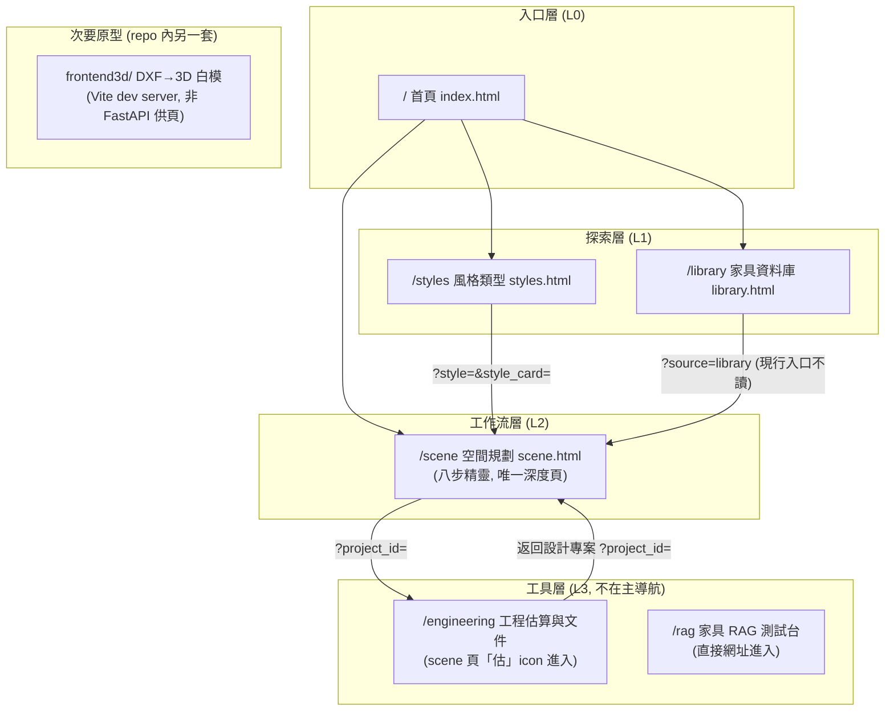
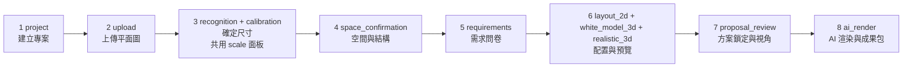

# 前端資訊架構規範 - RoomPilot-Agent

> 本文件由 VibeCoding v5.0 模板 02_ux_ui/frontend_information_architecture.md 導入 RoomPilot-Agent | 基準：分支 django-skill、commit a2179f7e、日期 2026-08-04

> **版本:** v2.0（依 v5.0 模板 MECE 重切）| **更新:** 2026-08-04 | **狀態:** 已發布（依現行程式碼逐條核對）
> **相關文檔:** [PRD](../01_requirements/project_brief_and_prd.md) | [前端架構](./frontend_architecture_spec.md) | [API 設計](../04_design/api_design.md)
> **先行素材:** 舊導入版 `docs/vibecoding/17_frontend_information_architecture_template.md`（2026-07-26，對舊分支填寫；其「4 頁、10 顆步驟按鈕、44 條路由、CDN Three.js」等事實已過期，本檔全部重查）。
>
> **MECE 邊界**：本文件**只談使用者/內容視角**（旅程、導航、頁面職責、URL、跨頁資料模型）。
> 技術視角（框架、效能數字、a11y 標準、檔案組織）全部在 **frontend_architecture_spec**。
>
> | 你想找的 | 看這份 |
> |---|---|
> | 哪些頁面存在、頁面層級結構 | 本檔 §3 |
> | 設計原則、認知負荷、架構模式 | 本檔 §2 |
> | 使用者旅程（八步工作流對應面板與 API） | 本檔 §4 |
> | 主導航、輔助導航、返回機制 | 本檔 §5 |
> | 單頁職責、CTA、導航入口/出口 | 本檔 §6 |
> | URL 命名規則、路由表（含認證需求） | 本檔 §7 |
> | 跨頁資料模型（URL params / localStorage / sessionStorage / 伺服器保存） | 本檔 §8 |
> | 後端 API 端點完整規格（全站 63 條 HTTP 路由的數法與清單） | **04_design/api_design** |
> | 用什麼框架、效能數字、a11y 標準、元件分層 | **frontend_architecture_spec** |

**現況說明**：RoomPilot 的正式 UI 是 `backend/server/static/` 下由 FastAPI 直接供應的 **6 個靜態 HTML 頁面**（無前端框架、無打包器，原生 ES module；Three.js 以 importmap 指向 repo 內 `/static/vendor/three/`，**無 CDN 依賴**，scene.html:1058-1065）。相較舊導入版（4 頁），本期新增兩個工具頁：`/rag`（家具 RAG 測試台，掛在 `backend/server/rag_api.py`）與 `/engineering`（工程估算與文件生成，對接 `backend/server/engineering/` 的 snapshot→lock→packages→jobs→documents 流程）。另有次要原型 `frontend3d/`（Vite + React Three Fiber，DXF→3D 白模），依 `frontend3d/AGENTS.md` 明定為 secondary prototype（Owner: Bella、協作 Ancai），不由 FastAPI 供頁。

---

## 1. 目的與範圍

**目的**: 定義 RoomPilot-Agent 前端的完整資訊架構，作為「頁面與旅程」的單一真實來源（SSOT）。頁面名稱一律以檔案為準；主流程步驟順序一律以 `backend/server/static/scene_workflow.js` 的 `WORKFLOW_STEPS` 為準（程式碼權威，不沿用舊文件的十步口徑）。

| 範圍 | 說明 |
| :--- | :--- |
| **包含** | 頁面職責、使用者旅程（八步 UI／11 內部步驟）、導航設計、URL 規範、跨頁資料模型 |
| **不包含** | 視覺設計細節、元件實作、效能數字、後端 API 完整規格（→ 04_design/api_design）、後端演算法 |

---

## 2. 設計原則（質化）

**核心價值主張:** 首頁 hero 文案（index.html:37-38）：「匯入平面圖、選擇風格與家具需求，RoomPilot 會整合材質、家具資料庫與配置規則，產生可以即時瀏覽的 3D 室內提案，協助設計溝通更快聚焦。」

### 資訊架構原則（自現行程式碼歸納）

| 原則 | 說明 |
| :--- | :--- |
| 簡化 | 保留: 4 個主線頁（首頁/風格/家具庫/場景工作流）＋ 2 個工具頁（/rag、/engineering）/ 移除: 舊 `/scene` 入口 scene.js 已於 commit 7a799770 刪檔（`backend/server/static/scene.js` 現已不存在）/ 專注: 全部深度功能集中在 `/scene` 單頁 |
| 認知負荷 | `/scene` 採線性精靈（wizard）模式：同一時間只顯示一個步驟面板，頂部 8 顆步驟進度列（`data-workflow-count="8"`，scene.html:24）＋引導帶（`rp-guidance-band`，aria-live） |
| 一致性 | `/`、`/styles`、`/library`、`/rag` 四頁共用同一 topbar 結構（brand + topnav；前三頁另有「開始設計」CTA，`/rag` 無）；`/scene` 刻意拿掉 topnav 防止中途跳頁；`/engineering` 用極簡 topbar（brand + 返回設計專案）（見 §5） |
| 架構模式 | 混合：入口三頁扁平化（hub），`/scene` 內部為嚴格線性層級（11 個內部步驟，前置依賴由 scene_workflow.js:43 `REQUIRED_COMPLETIONS` 強制）；工具頁為 hub 外掛節點 |
| 漸進揭露 | `/scene` 每步完成才解鎖下一步（validCompletion，scene_workflow.js:159-193）；上游變更時下游步驟標記 stale（markDownstreamStale，scene_workflow.js:207-219）；`/engineering` 入口「估」icon 建案前 `hidden`（scene.html:17-18）；/rag、/engineering 不進主導航 |

> 量化 UX 指標（LCP、a11y 對比度）→ frontend_architecture_spec；本工作樹 grep 無任何 analytics/web-vitals 程式碼（見 §4 轉換率）。

---

## 3. 資訊架構總覽

### 系統層次結構



### 頁面總覽（頁面名稱以檔案為準；行數 `wc -l` 實測）

| # | 路由 | 頁面檔案 | `<title>` | 主要職責 | 入口 script（行數） | 層級 |
| :--- | :--- | :--- | :--- | :--- | :--- | :--- |
| 0 | `/` | index.html（90 行） | RoomPilot \| AI 室內配置與 3D 預覽 | 行銷落地頁 + 功能導覽 | home.js（118） | L0 |
| 1 | `/styles` | styles.html（52 行） | 查看風格類型 | 6 風格 × 3 色系共 18 色卡瀏覽與選擇 | styles.js（1,255） | L1 |
| 2 | `/library` | library.html（171 行） | 家具資料庫｜RoomPilot | 家具型錄瀏覽 + 3D 檢視 + 方案清單 | library.js（760，另 import viewer.js 256 行 GLB 預覽器） | L1 |
| 3 | `/scene` | scene.html（1,069 行） | RoomPilot 空間規劃（scene.html:6） | 八步空間規劃主工作流 | scene_v2.js（13,803；再靜態 import 23 支 scene_* 模組，含 scene_viewer.js 5,555） | L2 |
| 4 | `/engineering` | engineering.html（113 行） | RoomPilot 工程估算與文件 | 鎖定 revision → 生成 HTML/XLSX/JSON 工程文件 | engineering.js（465） | L3 |
| 5 | `/rag` | rag.html（130 行） | 家具 RAG 測試台｜RoomPilot | 一句需求驗證向量家具檢索（h1，rag.html:29） | rag.js（367）＋ rag.css | L3 |
| — | （Vite dev，proxy 8002） | frontend3d/index.html | DXF → 3D 白模 | DXF 解析結果 R3F 檢視 + 家具手動擺放 | src/main.jsx → App.jsx | 原型 |

**總計:** FastAPI 供應 6 頁（5 條頁面路由在 main.py:1883-1902、2565-2570，`/rag` 在 rag_api.py:136-138）＋ 1 個獨立 Vite SPA 原型。

補充事實：`static/` 共 1,031 個檔案（頂層 JS 42 支，其中 scene_*.js 33 支；vendor/ 24 檔含 three.module.js 與 draco wasm）；scene_delivery.js、scene_guidance.js、scene_space_change_report.js、scene_texture_uv.js 未被任何 html/js 引用，僅由 tests/ 以 Node 方式測試。

> 每頁的詳細規格（資料、CTA、導航入出口）→ §6。

---

## 4. 核心使用者旅程

### 主旅程（八步工作流，`/scene` 單頁內完成）

程式碼權威順序 = `scene_workflow.js:4-16` 的 `WORKFLOW_STEPS`，共 **11 個內部步驟**（schema v2，`WORKFLOW_SCHEMA_VERSION = 2`，scene_workflow.js:1）；其中 `recognition` 與 `calibration` 共用 `scale` 面板，`white_model_3d`、`realistic_3d` 各有面板但**無獨立進度按鈕**（`WORKFLOW_PANEL_BY_STEP`，scene_workflow.js:18-30），因此 UI 進度列只有 **8 顆按鈕**（scene.html:25-32）。



### 旅程映射表（UI 步 → 內部 step → 面板 → 主要 API；行號為 2026-08-04 實測）

| UI 步 | 內部 step id | 面板 `data-panel` | 使用者要做的事 | 主要 API（scene_v2.js 行號） |
| :--- | :--- | :--- | :--- | :--- |
| 1 建立專案 | `project` | `project` | 輸入專案名稱與備註 | `POST /api/projects`（1324） |
| 2 上傳平面圖 | `upload` | `upload` | 選 DXF/PNG/JPG 圖檔並確認 | `POST …/floorplan`、`POST …/floorplan/analyze`（1439） |
| 3 確定尺寸 | `recognition`＋`calibration` | `scale` | 在圖上拉兩點、輸入實際公分 | `GET …/floorplan/source`（1738）、`POST /api/floorplan/analyze` 附校正（1745） |
| 4 空間與結構 | `space_confirmation` | `space` | 逐一確認房間名稱與牆、門、窗、樑、柱 | （前端幾何編輯為主，經 `PUT …/workflow` 保存） |
| 5 需求問卷 | `requirements` | `requirements` | 逐房需求、材質與全屋資料；家電需求留在問卷、寫入 `scene_json.render_context` 協助第 8 步生圖（CLAUDE.md 產品邊界） | `GET /api/questionnaire/visual-catalog`（5898） |
| 6 配置與預覽 | `layout_2d`（＋`white_model_3d`、`realistic_3d` 面板） | `layout-2d` / `white-model-3d` / `realistic-3d` | 檢視/調整俯視家具、3D 白模走動、色卡即時 PBR | `POST /api/scene/generate`（9980）、`POST /api/agent/furniture/select`（8218）、`POST /api/scene/layout`（8296 等多處）、`POST /api/scene/validate`（9276、10602）、`POST /api/scene/decorate`（10996）、`GET /api/furniture`（家具更換抽屜） |
| 7 方案鎖定與視角 | `proposal_review` | `proposal-review` | 核對方案、鎖定與保存視角 | （前端鎖定；經 workflow 保存） |
| 8 AI 渲染與成果包 | `ai_render` | `ai-render` | 建立色卡比較與逐房渲染任務、輪詢結果 | `GET /api/render-provider/status`（11925）、`POST …/render-jobs`（11828、12005、12042） |

步驟前置依賴由前端 `REQUIRED_COMPLETIONS`（scene_workflow.js:43）強制；每步完成條件由 `validCompletion()`（scene_workflow.js:159-193）判定。

### 次旅程 A：工程文件（`/scene` → `/engineering`）

1. `/scene` 建案後，topbar「估」icon 顯示（scene.html:17-18；engineering_link.js:4-8 依 `project_id` 組出 `/engineering?project_id=<id>`）。
2. `/engineering` 頁要求網址帶 `project_id`，缺少即報錯「網址缺少 project_id，請先從設計專案進入。」（engineering.js:319）。
3. 頁內狀態機依契約 `docs/contracts/ENGINEERING_DOCUMENT_MVP.md` 走 snapshot → lock → packages → jobs → documents：`PUT /api/v1/projects/{id}/revisions/{rev}/snapshot` → `POST …/lock` → `POST …/engineering-packages`（202）→ `GET /api/v1/jobs/{job_id}` 輪詢 → `GET /api/v1/packages/{package_id}` 與 `GET /api/v1/documents/{document_id}/download`（engineering/api.py:107-334；health 端點 `GET /api/v1/engineering/health`）。
4. 「返回設計專案」連結帶回 `/scene?project_id=<id>`（engineering.js:328）。

### 次旅程 B：家具 RAG 測試台（`/rag`，獨立工具旅程）

`/rag` 不在主流程內：輸入一句口語需求 → `GET /api/rag/status` 檢查就緒 → `POST /api/rag/search/jobs`（202）→ `GET /api/rag/search/jobs/{job_id}` 輪詢（rag_api.py:141-187；rag.js 367 行）。受控詞彙轉譯規則見專案 skill `roompilot-furniture-query`（.claude/skills/）。

### 轉換率目標

無。全部前端程式碼 grep 無任何事件追蹤/分析套件（gtag、mixpanel、posthog 等零命中，2026-08-04 實測）；專案未定義轉換率目標，待補。

---

## 5. 導航結構

### 主導航（topbar，`/`、`/styles`、`/library`、`/rag` 四頁共用）

| 項目 | 連結 | 顯示條件 | 備註 |
| :--- | :--- | :--- | :--- |
| RoomPilot（brand） | `/` | 永遠顯示 | |
| 探索功能 | `/` | 永遠顯示 | |
| 風格類型 | `/styles` | 永遠顯示 | ⚠️ library.html:19 字樣是「風格模型」，與 index/styles/rag 三頁的「風格類型」不一致 |
| 家具資料庫 | `/library` | 永遠顯示 | |
| 3D 場景展示 | `/scene` | 永遠顯示 | |
| 開始設計（CTA） | `/scene` | 僅 `/`、`/styles`、`/library` 三頁（`/rag` 無此 CTA，grep `topbar-cta` 零命中） | library.html:23 版本文案為「開始設計 ✦」 |

**注意**：`/rag` 與 `/engineering` 沒有出現在任何 topnav（index/styles/library/rag 四頁的 topnav 皆只列上表四個連結：探索功能/風格類型/家具資料庫/3D 場景展示，grep 實測）。到達方式：`/rag` 靠直接網址（工具定位）；`/engineering` 靠 `/scene` 頁的「估」icon（§4 次旅程 A）。是否要進主導航屬 IA 待裁決（§9）。

### `/scene` 頁的導航（刻意不同）

- **無 topnav**：topbar 只剩 brand（`#exit-project`，「離開專案並返回首頁」）、專案保存狀態 `#project-save-status`、「估」icon（建案前 hidden）與重新開始按鈕（scene.html:10-21）。設計意圖：工作流中不提供跳往其他頁的入口。
- **步驟進度列**：`nav.rp-progress` 8 顆步驟按鈕即頁內導航；可回到已完成步驟，未完成的後續步驟由前端依 `REQUIRED_COMPLETIONS` 擋下。

### `/engineering` 頁的導航

- 極簡 topbar：brand 回 `/` ＋「返回設計專案」回 `/scene?project_id=<id>`（engineering.html:49-52、engineering.js:328）。無 topnav。

### 輔助導航

- 麵包屑：無（全站未實作）。
- Footer 導航：無（六頁皆無 footer）。
- 側邊欄：`/library` 右側家具 3D 檢視面板、`/scene` 各面板內 `rp-control-pane`——皆屬頁內佈局，非跨頁導航。
- 返回機制：瀏覽器 back ＋ brand 連結回首頁；`/scene` 內部步驟切換不寫入 history（只有 `history.replaceState`，scene_v2.js:1333、13389、13749，無任何 pushState），故瀏覽器 back 會直接離開 `/scene` 而非回上一步。

---

## 6. 頁面規格

> **本節是各頁面的單一真實來源**。頁面名稱以檔案為準。

### 6.1 頁面: index.html（首頁）

| 項目 | 內容 |
| :--- | :--- |
| **路由** | `GET /`（main.py:1883-1885） |
| **職責** | 行銷落地：hero、功能卡、互動式流程導覽 |
| **使用者目標** | 了解產品並進入 `/scene` 開始設計 |
| **資料需求** | `GET /api/home-data`（common.js:48 `fetchHomeData`）填家具數指標 |
| **主要 CTA** | 「開始設計」→ `/scene`（hero index.html:43 與 topbar:23 各一） |
| **次要行動** | 「查看風格」→ `/styles` |
| **導航入口** | 直接進站、各頁 brand 連結 |
| **導航出口** | `/styles`、`/library`、`/scene` |
| **空 / 錯誤狀態** | 家具數載入失敗顯示替代字元（home.js） |
| **⚠️ 內容過時** | index.html:61「12 種風格條件」、home.js:15「12 種室內風格」仍是舊口徑；現行為 6 風格 × 3 色系 = 18 色卡（styles.html:30 h1「6 種風格，18 組生活色卡」）。home.js:7-33 的流程卡也只列 5 步舊流程，與 `/scene` 八步不一致。待修正 |

### 6.2 頁面: styles.html（風格類型）

| 項目 | 內容 |
| :--- | :--- |
| **路由** | `GET /styles`（main.py:1888-1890） |
| **職責** | 呈現 6 種台灣住宅風格 × 3 色系（共 18 組色卡），讓使用者先選色調方向 |
| **使用者目標** | 選定一組色卡並帶入 `/scene` 工作流 |
| **資料需求** | `GET /api/styles`（404 時退回 `GET /api/site-data`，common.js:56） |
| **主要 CTA** | 色卡上的進場動作 → `/scene?style=<scene_style_id>&style_card=<card_id>`（styles.js:676-677、747-748） |
| **次要行動** | 「選擇這組色調」只記錄選擇不跳頁（styles.js:585-599 寫 sessionStorage） |
| **導航入口** | 首頁「查看風格」、topnav |
| **導航出口** | `/scene`（帶 query）、topnav 各頁 |
| **空 / 錯誤狀態** | styles.js 頂層 await 無整頁錯誤 UI；404 時退回 `/api/site-data` 為唯一兜底 |
| **✅ 交接已修（半條）** | scene_v2.js 已新增 `applyStyleCardFromQuery()`（scene_v2.js:13774-13796）：讀 `style_card`/`style` query 與 `localStorage["roompilot:selectedStyleCard"]` 兜底，選卡可套進工作流的 style pack。⚠️ 但 styles.js 寫的是 **sessionStorage**（styles.js:22、587），scene_v2.js 兜底讀的是 **localStorage**（scene_v2.js:13778）——query 路徑有效，storage 兜底兩端不同倉，屬殘留缺口（§9 待辦） |

### 6.3 頁面: library.html（家具資料庫）

| 項目 | 內容 |
| :--- | :--- |
| **路由** | `GET /library`（main.py:1893-1895） |
| **職責** | 「先選空間，再找對的家具」：選空間 → 選類型 → 篩選 → 分頁瀏覽 → 右欄 Three.js 3D 檢視 → 累積「本次方案清單」 |
| **使用者目標** | 挑出想用的家具並帶進 3D 場景 |
| **資料需求** | `GET /api/furniture`（分頁 + 篩選）；GLB 經 `/api/furniture/{id}/model` 或 CloudFront 直連（模型交付路由 main.py:3508-3536） |
| **主要 CTA** | 「帶著這些家具進入 3D 場景」（library.html:121）→ `/scene?source=library`（library.js:369） |
| **次要行動** | 加入本次方案清單、加入並進入 3D 場景（library.html:150）、清空清單、重設視角 |
| **導航入口** | 首頁、topnav |
| **導航出口** | `/scene`、topnav 各頁 |
| **空 / 錯誤狀態** | 「只列出已確認可載入的 3D 模型」（library.html:31）；未加家具時進場按鈕 disabled |
| **⚠️ 交接斷點（仍在）** | 進場前把方案清單寫入 `sessionStorage["roompilot:sceneProposal"]`（library.js:15、368），但 scene_v2.js **完全不讀**該 key 也不讀 `source` query（grep 零命中，2026-08-04 實測）；方案清單仍傳不進場景工作流，待裁決/修復 |

### 6.4 頁面: scene.html（空間規劃，主工作流）

| 項目 | 內容 |
| :--- | :--- |
| **路由** | `GET /scene`，回應帶 `Cache-Control: no-store`（main.py:1898-1902） |
| **職責** | 承載八步（11 內部步驟）空間規劃精靈；單頁內以面板切換 |
| **使用者目標** | 從建專案到 AI 渲染成果包的完整設計流程 |
| **資料需求** | 見 §4 旅程映射表；Three.js 以 importmap 載入 `/static/vendor/three/`（scene.html:1058-1065，無 CDN）；入口 script 為 engineering_link.js（scene.html:1066）與 scene_v2.js（scene.html:1067，module） |
| **主要 CTA** | 隨步驟變化，每面板一個 primary-action（§4 表） |
| **次要行動** | 步驟進度列回跳、`#reset-project` 重新開始、「估」icon 進 `/engineering`、家具更換抽屜 |
| **導航入口** | 首頁/topnav/`/styles` 色卡（query 有效）/`/library` 方案清單（query 斷裂）；重開 `/scene?project_id=<id>` 續作 |
| **導航出口** | brand 連結回 `/`（`#exit-project`）、「估」icon → `/engineering?project_id=<id>` |
| **空 / 錯誤狀態** | 引導帶（aria-live）＋各面板欄位錯誤；保存失敗/離線走 pending-save 補救（§8）；ProjectStore 忙碌時後端回 503＋Retry-After（main.py:226-243） |

### 6.5 頁面: engineering.html（工程估算與文件，新增）

| 項目 | 內容 |
| :--- | :--- |
| **路由** | `GET /engineering`，回應帶 `Cache-Control: no-store`（main.py:2565-2570） |
| **職責** | 「從現有專案 state 建立不可覆寫的鎖定 revision，再由同一份 ProjectSnapshot 產生 HTML、XLSX 與 JSON」（engineering.html:58） |
| **使用者目標** | 把已鎖定的設計案轉成可交付的工程估價文件包 |
| **資料需求** | `/api/v1/engineering/health`、`/api/v1/projects/*`（snapshot/lock/packages）、`/api/v1/jobs/*`、`/api/v1/packages/*`、`/api/v1/documents/*/download`（engineering.js 呼叫；後端 engineering/api.py 共 8 條路由） |
| **主要 CTA** | 「生成工程文件」（engineering.html:91 區塊；先鎖 revision 再送 202 非同步 job） |
| **次要行動** | 「重新讀取目前專案」（engineering.html:60）、下載/預覽產出文件 |
| **導航入口** | 僅 `/scene` topbar「估」icon（engineering_link.js） |
| **導航出口** | brand 回 `/`、「返回設計專案」回 `/scene?project_id=<id>` |
| **空 / 錯誤狀態** | 缺 `project_id` 時明確報錯（engineering.js:319）；revision 未鎖回 409 REVISION_NOT_LOCKED、job 失敗分 XLSX_ADAPTER_UNAVAILABLE / ENGINEERING_PACKAGE_FAILED（engineering/api.py:180-268） |
| **延伸產出** | ReportPayload 可再交給專案 skill `roompilot-proposal`（屋主提案）與 `roompilot-budget`（工程預算書）產文件（.claude/skills/，數字由腳本核對） |

### 6.6 頁面: rag.html（家具 RAG 測試台，新增）

| 項目 | 內容 |
| :--- | :--- |
| **路由** | `GET /rag`，回應帶 `Cache-Control: no-store`（rag_api.py:136-138；路由掛在 rag_api.py 的 APIRouter，經 main.py:217 include） |
| **職責** | 「用一句需求，驗證真正的向量家具檢索」（rag.html:29）：驗證 backend/spatial_data/rag/ 的 LLM parser → pgvector → reranker 管線 |
| **使用者目標** | 工程/內部人員驗證檢索品質與就緒狀態 |
| **資料需求** | `GET /api/rag/status`（就緒守門：embedding model cache、pgvector 表資料）；`POST /api/rag/search/jobs`（202，上限 RAG_JOB_MAX_ACTIVE，超過回 429）→ `GET /api/rag/search/jobs/{job_id}` 輪詢 |
| **主要 CTA** | 送出檢索句（產生非同步 job） |
| **次要行動** | 查看 status、重試 |
| **導航入口** | 直接網址（不在任何 topnav；六頁 HTML/JS grep `href="/rag` 零命中） |
| **導航出口** | topnav 四連結（探索功能/風格類型/家具資料庫/3D 場景展示，rag.html:17-22）；無「開始設計」CTA |
| **空 / 錯誤狀態** | RAG 停用/依賴缺失/DB 不可用時由 typed errors 轉服務錯誤（rag_api.py:146 附近）；429 rag_job_capacity_reached、404 rag_job_not_found |

### 6.7 頁面: frontend3d（獨立 Vite SPA，次要原型）

| 項目 | 內容 |
| :--- | :--- |
| **路由** | 無 FastAPI 路由；`npm run dev` 啟動 Vite，`/api` 代理到 `http://localhost:8002`（vite.config.js:8） |
| **職責** | 選擇/上傳 DXF → 後端解析 → R3F 呈現牆/窗/門/地板 → 手動擺放 GLB 家具 |
| **資料需求** | `GET /api/plans`、`GET /api/furniture`、`POST /api/upload`、`GET /api/plan`（App.jsx:26-56；對口路由存活於 main.py:3551（`/api/plans`）、3556（`/api/plan`）、3572（`/api/upload`）與 2707（`/api/furniture`）） |
| **現況註記** | frontend3d/AGENTS.md 明定 secondary prototype（Owner: Bella、協作 Ancai），驗證門檻 `npm ci && npm run build`（frontend3d/AGENTS.md:14）；frontend3d/README.md:15、22 範例 port 8000 與 vite proxy 8002 不一致（文件過時；根目錄 README.md 全篇為 8002，無 8000）。舊導入版記錄的「npm install ERESOLVE 失敗」為 2026-07-26 舊分支實測，本工作樹未重測 (未查證) |

---

## 7. URL 結構與路由（IA 真相）

> 全站無前端 router：6 頁皆為伺服器路由直接回傳靜態 HTML；頁內狀態（如 `/scene` 目前步驟）**不進 URL**。

### 命名規範（現況歸納）

- 頁面路由：小寫單字（`/styles`、`/library`、`/scene`、`/engineering`、`/rag`），無巢狀、無資源 ID 路徑。
- 查詢參數：`snake_case`（`project_id`、`style_card`、`source`）。
- 靜態資產：`/static/*` 與 `/docs-assets/*` 兩個 StaticFiles 掛載（main.py:285-286）。
- 資產快取破壞：JS/CSS 引用附 `?v=sha256-<內容雜湊前 12 碼>`、`?v=sha256-<完整 64 碼>`（rag.html:9、128）或日期 token（機制不全站統一；index/styles 仍用日期版本，rag.html 的 site.css 亦為日期 token）。⚠️ 現行工作樹 scene.html 的 scene_v2.js（宣告 `27f24b6bede3`／實算 `7d938e1fdc28`）與 site.css（宣告 `5693fe5d95c5`／實算 `e362900c8195`）、library.html 的 library.js（宣告 `d3c2bcee981f`／實算 `1c9375c972ad`）與 site.css（宣告 `81cfac0a8730`／實算 `e362900c8195`）雜湊**與實算內容不符**；engineering.js、engineering_link.js、rag.css、rag.js 則相符。守約測試 tests/test_scene_v2_contract.py:20-28 實測紅燈（2026-08-04 `pytest -q tests` = 811 passed / 1 failed / 9 skipped，該 failed 即此測試）。
- URL 不含機密：無 token；`project_id` 為伺服器產生的識別字（但前端消費的路由全無認證，見下）。

### 路由表

| 路由 | 頁面/資源 | 認證 | 快取 | Query 參數（讀取方） |
| :--- | :--- | :--- | :--- | :--- |
| `/` | index.html | 無 | 預設 | — |
| `/styles` | styles.html | 無 | 預設 | — |
| `/library` | library.html | 無 | 預設 | — |
| `/scene` | scene.html | 無 | `no-store` | `project_id`（scene_v2.js:182，續作）；`style`＋`style_card`（scene_v2.js:13782-13783，✅ 現行入口已讀）；`source=library`（library.js 寫入，**現行入口不讀**） |
| `/engineering` | engineering.html | 無 | `no-store` | `project_id`（engineering.js:4，必填，缺少即報錯） |
| `/rag` | rag.html | 無 | `no-store` | — |
| `/static/*` | 靜態資產掛載 | 無 | 預設 | — |
| `/docs-assets/*` | moodboard 資產掛載 | 無 | 預設 | — |
| `/api/*`、`/api/v1/*` | API 共 57 條（全站 HTTP 路由 63 條 − 6 條頁面路由；main.py 46 ＋ rag_api.py 5 ＋ catalog_admin.py 4 ＋ engineering/api.py 8，→ 04_design/api_design） | 除 `/api/admin/furniture` 4 條需 Bearer token 外，其餘 53 條無 | — | — |

- **認證/角色**：全站無登入、無角色；63 條路由中 59 條任何人可存取，唯一例外是 `/api/admin/furniture` 管理 CRUD 4 條需 `Authorization: Bearer <ROOMPILOT_CATALOG_ADMIN_TOKEN>`（`catalog_admin.py:170-195`，失敗回 401），該 4 條不由瀏覽器前端呼叫；資安基線見專案 skill `roompilot-security` 的風險清單。
- **載入策略**：無 lazy loading；每頁一支入口 module script，scene_v2.js 再靜態 import 23 支 scene_* 模組。
- `/scene` 的 `project_id` 由 scene_v2.js 在建案/還原後以 `history.replaceState` 寫回 URL（scene_v2.js:1333），重新開始時清成 `/scene`（13389、13749）。
- Port 基準：README 啟動指令 `uvicorn backend.server.main:app --port 8002`（README.md:30、46；8002 被占用時改 8023，README.md:35）。

---

## 8. 跨頁資料模型（狀態與資料流）

### 8.1 跨頁載體總表

| 來源頁面 | 目標頁面 | 載體 | 資料內容 | 現況 |
| :--- | :--- | :--- | :--- | :--- |
| `/scene` | `/scene`（重開/分享） | URL query `project_id` | 專案識別字 | ✅ 重開網址即從伺服器還原專案（可書籤） |
| `/scene` | 伺服器（project store，`build_project_store` main.py:154；保存層契約 → docs/contracts/POSTGRESQL_PROJECT_STORE_PHASE3.md） | `PUT /api/projects/{id}/workflow` | 全部工作流狀態（current_step + workflow JSON；大小上限與 revision 規則本檔未重查 (未查證)，→ 04_design/api_design） | ✅ 主要持久化路徑 |
| `/scene` | `/scene`（離線/衝突補救） | `localStorage["roompilot.pending-save.<projectId>"]`（scene_v2.js:917） | 未成功送達的 workflow payload | ✅ 保存失敗時暫存，重進頁面依 `shouldReplayPendingSave`（scene_workflow.js:32 起）決定重播或丟棄 |
| `/scene` | `/scene` | `localStorage`，key 基底 `roompilot.workflow.v2`（`WORKFLOW_STORAGE_KEY`，scene_workflow.js:2） | 前端 workflow 快照（schema v2） | ✅ 頁內還原用 |
| `/styles` | `/scene` | URL query `style`＋`style_card`；兜底 storage `roompilot:selectedStyleCard` | 選定的風格與色卡 | ✅ query 路徑有效（scene_v2.js:13774-13796 已消費）；⚠️ 兜底兩端不同倉：styles.js 寫 sessionStorage（:587）、scene_v2.js 讀 localStorage（:13778） |
| `/library` | `/scene` | `sessionStorage["roompilot:sceneProposal"]`（library.js:368）＋ URL query `source=library` | 本次方案家具清單 | ⚠️ **斷裂**：scene_v2.js 不讀該 key 也不讀 `source`（grep 零命中，2026-08-04） |
| `/library` | `/library`（回訪） | `localStorage["roompilot-mode1-proposal-v1"]`、`localStorage["roompilot-mode1-favorites-v1"]`（library.js:13-14） | 方案清單、收藏 | ✅ 頁內持久化 |
| `/scene` | `/engineering` | URL query `project_id`（engineering_link.js:4-8） | 專案識別字 | ✅ 現行有效；`/engineering` 端必填檢查（engineering.js:319） |
| `/engineering` | `/scene` | URL query `project_id`（engineering.js:328「返回設計專案」） | 專案識別字 | ✅ 雙向以 URL 為唯一載體，工程資料全在伺服器（snapshot/packages/documents） |

### 8.2 `/scene` 頁內狀態與資料流（單頁全域 state）

scene_v2.js 以單一模組層 `state` 物件集中管理（`projectId` 於 scene_v2.js:182 初始化自 URL），無狀態庫。資料流方向：

```
使用者操作 → state 變更 → 面板重繪
          → workflow.complete(step, data)（scene_workflow.js）
          → 保存 → PUT /api/projects/{id}/workflow
              成功 → revision 前進
              失敗/離線 → localStorage pending-save → 下次載入重播
重開 /scene?project_id= → GET /api/projects/{id} → restoreWorkflow → 跳到 current_step 面板
上游步驟變更 → markDownstreamStale → 下游步驟標記需重做
```

### 8.3 載體選擇原則（現況歸納）

- **可書籤的只有 `project_id`**：工作流內容大，全部走伺服器保存，URL 只留鑰匙；`/engineering` 沿用同一把鑰匙。
- **localStorage 用於補救與快照**，不是真相來源；真相在伺服器 project store，衝突時以伺服器版本為準。
- **sessionStorage 用於一次性跨頁交接**——library→scene 這條的消費端仍缺（§8.1），styles→scene 已改以 URL query 為主通道。

---

## 9. IA / 可用性檢查清單

> 依模板清單逐項核對現況；✅=已符合、⚠️=有缺口、❌=未實作。

### 資訊架構

- [x] 所有頁面已定義單一職責與使用者目標（§6，含新增 /rag、/engineering）
- [ ] ⚠️ 核心使用者旅程無轉換率目標與事件追蹤（§4，grep 證實無 analytics 程式碼）
- [ ] ⚠️ 導航結構大致一致，但 library.html:19 topnav 字樣「風格模型」與其他頁「風格類型」不一致；/rag、/engineering 不在主導航（是否要進入待裁決）
- [x] URL 結構語義化（§7；無 SEO 需求聲明）
- [ ] ⚠️ 跨頁資料載體仍有缺口：library→scene 方案清單交接斷裂；styles→scene 兜底 storage 兩端不同倉（§8.1）
- [x] 每個路由的認證/角色已明確：63 條中 59 條無認證、任何人可存取（含工程文件下載），僅 admin CRUD 4 條有 Bearer token（§7；風險基線 → roompilot-security skill）

### 可用性（質化）

- [x] 導航深度 ≤ 3 層（L0→L1→L2→L3 工具頁；`/scene` 內部步驟為線性面板非巢狀頁面）
- [x] 每個工作流面板一個 primary-action（§4）
- [ ] ❌ 無麵包屑（§5；`/scene` 以步驟進度列替代回溯）
- [ ] ⚠️ 無自訂 404 頁面：main.py 僅有 ProjectStoreUnavailable / RuntimeCatalogUnavailable 兩個 exception handler（main.py:226、246），未知路徑回 FastAPI 預設 JSON，無引導返回主旅程
- [x] 空狀態有下一步引導（`/library` 空清單提示、`/scene` 引導帶、`/engineering` 缺 project_id 明確報錯）
- [x] 漸進揭露：`/scene` 步驟解鎖與 stale 標記、「估」icon 建案後才顯示（§2）

### 本檔盤點出的待辦（依據皆在上文）

1. **修復 library→scene 交接**：`sessionStorage["roompilot:sceneProposal"]`＋`?source=library` 無消費端（§6.3、§8.1）；需在 scene_v2.js 補讀取或移除寫入端 UI。
2. **統一 styles→scene 兜底儲存**：styles.js 寫 sessionStorage、scene_v2.js 讀 localStorage（§6.2）；query 主通道已通，兜底應二選一。
3. **首頁內容過時**：index.html:61 與 home.js:15 的「12 種風格」舊口徑，與現行 6 風格 18 色卡不符。
4. **topnav 字樣統一**：library.html:19「風格模型」。
5. **cache-busting 雜湊漂移**：scene.html（scene_v2.js、site.css）與 library.html（library.js、site.css）的 `?v=sha256-` 與實算內容不符，守約測試預期紅燈；且無自動重算腳本，維護方式待定（§7）。
6. **/rag、/engineering 的導航定位**：目前為隱藏工具頁；是否進主導航或明文標註內部工具，待裁決。
7. **`/scene` back 行為**：步驟切換只 replaceState，瀏覽器 back 直接離開工作流；是否攔截或提示，待裁決。
8. **frontend3d 定位**：AGENTS.md 已明定 secondary prototype，但 README port 口徑過時、可否啟動未重測（§6.7）。
