# 架構與設計文件 - RoomPilot-Agent

> 本文件由 VibeCoding v5.0 模板 03_architecture/architecture_and_design.md 導入 RoomPilot-Agent | 基準：分支 django-skill、commit a2179f7e、日期 2026-08-04

> **版本:** v2.0 | **更新:** 2026-08-04 | **狀態:** 草稿
>
> 先行素材：`docs/vibecoding/05_architecture_and_design_document.md`（2026-07-26 對舊分支 bella-local-20260726 填寫）。該版事實已過期（44 條路由年代），本文件所有數字、路徑、行號均對現行工作樹重查；查不到的寫「(未查證)」。
>
> 衝突時優先序（沿用專案慣例）：自動化測試 > 可執行程式 > 正式契約（`docs/contracts/`）> 本文件。本文件任何敘述與程式碼不符時，以程式碼為準並回報修訂。

---

## ⚠️ 使用前須讀：常見地雷

新手套用本模板最常踩的坑（按嚴重程度排序，已代入 RoomPilot 實況）：

1. **C4 L1–L4 與業務 layer 撞名** — RoomPilot 的業務流程叫「八步工作流」（UI 8 顆按鈕、內部 11 個步驟），與 C4 縮放層級 L1–L4 是兩套編號。**解法**：見 §1.1.0 命名防呆表
2. **L2 把 Python 檔當 Container** — `scene_service.py`、`rag_api.py` 不是 Container。**Container = runtime / process，不是 module**
3. **L3 跨 Container** — 一張 L3 圖只准畫一個 L2 Container 的內部
4. **Partial Disclosure** — L1 缺 OpenAI/Anthropic（RAG 解析器）、OpenRouter 生圖、遠端渲染供應商等「不是主流程但會用到」的外部系統
5. **DDD 限界上下文圖箭頭畫成 data flow** — Context Map 箭頭應是 Strategic Relationship（PL / CS / ACL / CF / SK / OHS）
6. **缺 Sequence Diagram** — 文字流程不算 Dynamic Diagram（本文件 §3.4 有四張）
7. **Deployment 與 L2 混用** — Deployment 是 L2 的「實體化」，要含 Node 屬性與 instance 標記
8. **箭頭無 protocol 標籤** — 看不出是 HTTPS / SQL / file I/O / subprocess
9. **跨文件不一致** — 本文件與 `docs/contracts/`（22 檔）互相打臉時，依上方優先序處理
10. **沒有 future state** — 只畫當前，看不出 PostgreSQL Phase 5 單一事實來源等 milestone 終點
11. **把開發工具畫進 C4** — `.claude/skills/` 四支專案 skill 是開發/交付輔助工具，**不出現在任何 C4 圖**（見 §1.4 附註）

---

## 第 1 部分：架構總覽

### 1.1 C4 模型（嚴格版）

#### 1.1.0 命名防呆（必填）

| 術語 | 指什麼 | 勿混淆 |
| :--- | :--- | :--- |
| **C4 L1–L4** | 架構圖縮放層級（情境 → 容器 → 元件 → 程式碼） | ≠ RoomPilot 業務「八步工作流」 |
| **C4 Context（L1）** | RoomPilot-Agent 整體相對外界 | ≠ DDD「限界上下文」（§1.2 的模組分工） |
| **C4 Container（L2）** | 可獨立執行的 runtime（uvicorn process、瀏覽器頁面、PostgreSQL、SQLite 檔、Node 子行程） | ≠ Python package（`backend/agent/` 等是 L3 Component） |
| **C4 Component（L3）** | **單一** L2 容器內的模組（對應 repo 路徑） | 禁止跨容器畫在同一張 L3 |
| **業務「步驟」** | UI 的 8 顆步驟按鈕（scene.html:25-32）；內部 11 個步驟（scene_workflow.js:4-16） | ≠ C4 任何層級；本文件寫步驟一律用步驟名（如 `layout_2d`），不裸寫數字 |
| **RAG** | 兩套不同東西：家具 RAG（`backend/spatial_data/rag/`，pgvector 檢索）與工程 AdvancedRAGService（`backend/server/engineering/advanced_rag.py`，知識庫檢核） | 文中一律加限定詞「家具 RAG」/「工程 RAG」 |

> **規則**：本文件 C4 章節提到層級一律寫全稱（`System Context` / `Container` / `Component`），業務流程一律寫步驟名。

#### 1.1.1 層級規則

| 層級 | 英文名 | 一張圖只回答 | 方塊必須是 | 禁止 |
| :---: | :--- | :--- | :--- | :--- |
| **L1** | System Context | 誰在用系統？與哪些外部系統互動？ | 人、本軟體系統（**一個**邊界）、外部系統 | 內部模組、檔名、GitHub/IDE 等開發工具 |
| **L2** | Container | 系統內有哪些 **runtime**？ | Process、DB、檔案儲存、排程服務、UI | 把 module 當容器；用抽象「資料平面」當 C4 元素 |
| **L3** | Component | **某一個** L2 容器內部怎麼拆？ | 模組 / package（對應 repo 路徑） | 跨容器 zoom；一張圖混多容器內部 |
| **L4** | Code | 類別 / 函式（可選） | class、function | 小專案可省略，改連結 `../04_design/class_relationships.md` |

**層級關係**：樹狀 zoom-in（父 → 子），**不是**執行序列。

#### 1.1.2 Container 清單（必填）

| Container | 類型 | 技術 | 何時啟用 | L3 圖 |
| :--- | :--- | :--- | :---: | :---: |
| FastAPI 應用伺服器 | Web 應用 process | Python 3.12.13 baseline、fastapi==0.140.0、uvicorn==0.51.0（requirements.txt:9-10）；入口 `backend.server.main:app`（main.py:214），全站 **63 條路由**（main.py 46 + rag_api.py 5 + catalog_admin.py 4 + engineering/api.py 8） | 現行 | ✅ §L3-A |
| 瀏覽器八步前端 | 瀏覽器內 runtime | 原生 ES module + 自帶（vendored）three.js（`/static/vendor/three/`，scene.html:1058-1065 importmap，無 CDN 依賴）；6 個 HTML 頁 + 頂層 42 支 JS（scene_*.js 33 支），入口 bundle scene_v2.js 13,803 行 + scene_viewer.js 5,555 行 | 現行 | ✅ §L3-B |
| PostgreSQL `roompilot_db` | 資料庫 process | PostgreSQL（`scripts/sql/` 記載 17.10 安裝指南）；schema 檔 `scripts/sql/roompilot_postgresql_schema.sql`、`roompilot_furniture_embeddings_schema.sql`（pgvector）、`scripts/project_store/roompilot_project_store_schema.sql`、`scripts/runtime_catalog/roompilot_runtime_catalog_schema.sql`；連線設定 DB_HOST/DB_PORT/DB_NAME=roompilot_db 等（postgres_repository.py:209-221） | 現行（型錄 provider 預設即 `postgres`，postgres_repository.py:199） | 表代圖 → §4.1 |
| 專案保存 SQLite | 內嵌資料庫（同 process 檔案） | SQLite；`.runtime/projects.sqlite3`（project_store.py:97）；`ROOMPILOT_PROJECT_STORE_PROVIDER` 預設 `sqlite`，設 `postgres` 改走 PostgresProjectStore（project_store.py:601-620）；工程文件四張表也寫進同一個專案庫（engineering/repository.py:29,65-96,131） | 現行（預設 provider） | 表代圖 → §4.1 |
| 問卷視覺索引 SQLite | 內嵌查詢索引 | SQLite；`.runtime/indexes/questionnaire_visuals.sqlite3`（main.py:276-279，**延遲建立**：第一次用到問卷才建，`_questionnaire_visual_store()` docstring）；資料真源為版控 JSON（`backend/server/data/questionnaire_visual_catalog.json`），`store.sync()` 每次重建索引表，可刪除重建 | 現行 | 略（純索引） |
| 檔案儲存 `.runtime/` | 檔案系統 | uploads/（平面圖）、renders/（截圖與生圖 PNG）、engineering/（工程產物，engineering/api.py:55） | 現行 | 略（無 internal component） |
| Node 工作簿子行程 | 短命 subprocess | `backend/server/engineering/workbook_builder.mjs`（237 行）；node 執行檔由 `ROOMPILOT_ARTIFACT_NODE` 指定（engineering/api.py:98-104 health 回報） | 產 XLSX 時由 FastAPI 喚起；node 不可用回 error_code `XLSX_ADAPTER_UNAVAILABLE` | 略（單一腳本） |
| 批次匯入 CLI | 手動 CLI process | `scripts/sql/import_official_catalog_to_postgres.py`、`scripts/sql/import_furniture_embeddings_to_postgres.py`、`scripts/project_store/migrate_sqlite_projects_to_postgres.py`、`scripts/runtime_catalog/import_runtime_catalogs_to_postgres.py` | 手動執行（對應 PostgreSQL Phase 1–5） | 略（腳本，流程見 `scripts/sql/README.md`） |
| frontend3d DXF 檢視器 | 開發用前端 runtime（Vite dev server + 瀏覽器 R3F 應用） | Vite + React 18 + @react-three/fiber ^8.17.10 + three ^0.160.1（frontend3d/package.json）；proxy `/api` → `http://localhost:8002`（vite.config.js:8） | 次要原型（frontend3d/AGENTS.md 明定 secondary prototype；Owner Bella） | 表代圖，見 §L3-X |

**外部系統清單**（獨立列出，避免 partial disclosure；五類逐一核對）：

| 類別 | 外部系統 | 依據 |
| :--- | :--- | :--- |
| 資料源（3D 模型原始儲存） | AWS S3（GLB 上傳來源；上傳工具 `scripts/roompilot_glb_downloader.py`、`scripts/roompilot_s3_glb_uploader.py`、`scripts/roompilot_s3_image_uploader.py`） | 執行期 manifest 為 `JSON/manifests/glb_upload_all_result.csv`（main.py:146、cloud_models.py:26-31；`backend/catalog/data/manifests/` 下另有未被執行期引用的副本）；bucket 名與帳務 (未查證) |
| 遞送 CDN | AWS CloudFront `https://ddgsm1yg3xikc.cloudfront.net`（`ROOMPILOT_CLOUDFRONT_BASE_URL` 可覆寫；模式預設 `cloudfront`） | services/cloud_models.py:32,47 |
| LLM（問卷/場景規劃/第 8 步生圖） | OpenRouter API：intake 與場景規劃雙開關（`OPENROUTER_API_KEY` + `OPENROUTER_INTAKE_ENABLED=1` 等，intake_service.py:138,157）；第 8 步內建生圖供應者，模型預設 `google/gemini-2.5-flash-image`（render_providers.py:39 DEFAULT_IMAGE_MODEL，可用 `ROOMPILOT_RENDER_IMAGE_MODEL` 覆蓋，:61） | intake_service.py、scene_service.py、render_providers.py |
| LLM（家具 RAG 查詢解析） | OpenAI 或 Anthropic Structured Outputs：`ROOMPILOT_RAG_PARSER_PROVIDER` 預設 `openai`（模型預設 `gpt-5.6-sol`），設 `anthropic` 用 `claude-sonnet-4-6`（spatial_data/rag/settings.py:55-59） | rag/openai_parser.py、rag/anthropic_parser.py |
| 遠端渲染供應商 | `ROOMPILOT_RENDER_PROVIDER_URL` 指定之 HTTP 服務；有值時**優先於**內建 OpenRouter 生圖（render_providers.py docstring） | render_service.py、`docs/contracts/REMOTE_RENDER_CONTRACT.md` |
| 交易 | 無（無金流；成本概算 `/api/cost/estimate` 用版控內台灣行情種子 + Phase 4 runtime catalog，不外呼） | cost_estimation.py:1-20 |
| 推送 | 無（無推播/通知服務） | 全 backend/server/ 路由清單無此類端點 |
| 備份 | 無外部備份服務；`.runtime/` 與 PostgreSQL 的備份策略 (未查證) | — |
| 雲端 IaaS | AWS（僅 S3 + CloudFront，無自管運算資源）(未查證：AWS 帳務與其他資源) | manifest CSV、cloud_models.py |

> 對比舊導入版：**unpkg CDN 已退場**——three.js 現以 `/static/vendor/three/` 自帶（vendor/ 共 24 檔含 draco wasm），前端零 CDN 依賴。

#### 1.1.2.5 Future State（必填）

已知 milestone（依 `docs/contracts/POSTGRESQL_SINGLE_SOURCE_PHASE5.md` 與現況差距整理）：

1. **PostgreSQL 單一事實來源（Phase 5）全面收斂** — 現行型錄 provider 預設已是 `postgres`（postgres_repository.py:199），但專案保存預設仍 `sqlite`（project_store.py:605），JSON fallback 路徑仍保留（catalog_provider_mode == "json" 時啟動預熱記憶體，main.py:2821-2828）
2. **遠端渲染供應商正式接通** — 現以內建 OpenRouter 同步生圖頂上（render_providers.py）；`ROOMPILOT_RENDER_PROVIDER_URL` 的非同步供應商仍未設定
3. **工程文件 MVP 脫離 demo mode** — `ROOMPILOT_DEMO_MODE` 環境變數控制（engineering/api.py:40-44,58）；工程 RAG 現用 `NoopEngineeringSemanticRetriever`（engineering/api.py:56-75），語意檢索為佔位
4. **家具 RAG 就緒條件常備化** — service 就緒守門檢查 embedding model cache 與 pgvector 表非空（rag/service.py:82-90），`ROOMPILOT_RAG_ENABLED` 預設 `false`（rag/settings.py:65）

Future state 的 L2 圖見下方「L2 — Container（Target / Future State）」。

#### L1 — System Context

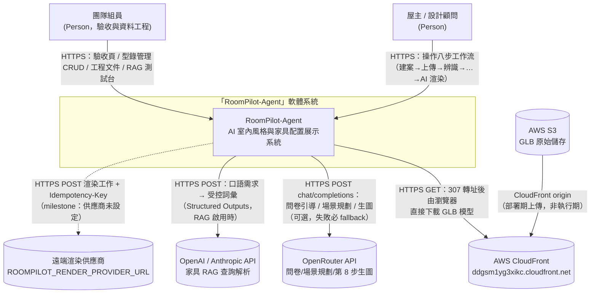

**L1 檢查清單**：
- [x] 邊界內**僅一個**系統節點
- [x] 無 GitHub / IDE / CI runner（`.claude/skills/` 四支 skill 屬開發工具，不入圖）
- [x] 所有箭頭標協議 + 動詞 + 目的
- [x] 虛線 = 尚未啟用 milestone（遠端渲染供應商）
- [x] 外部系統覆蓋五類：資料源（S3）、交易（無，已註明）、推送（無，已註明）、備份（無，已註明）、雲端 IaaS（AWS）

#### L2 — Container（Current）

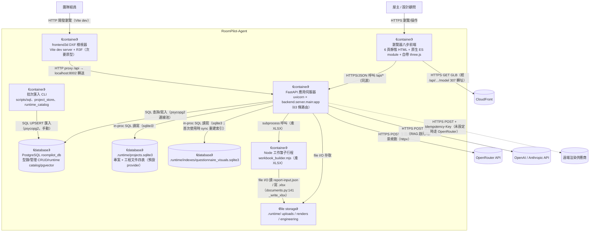

**L2 檢查清單**：
- [x] 邊界內所有 runtime container 都呈現
- [x] 跨 Container 箭頭都標 protocol + 動詞
- [x] Clean Architecture 分層不在 L2 subgraph 中（寫 §1.3）
- [x] 不出現 module 名（`backend/agent/` 等留給 L3）

補充事實（現行工作樹 grep 實證）：`backend/server/` 唯一 middleware 是 `GZipMiddleware(minimum_size=1024)`（main.py:215），無 CORS 設定；瀏覽器前端與 API 同源（靜態頁由 FastAPI 掛載 `/static` 與 `/docs-assets`，main.py:285-286）。例外處理器兩枚：`ProjectStoreUnavailable`→503（busy 附 Retry-After:2）、`RuntimeCatalogUnavailable`→503（main.py:226-266）。

#### L2 — Container（Target / Future State）

所有 milestone 完成後（全部實線；Phase 5 單一事實來源）：

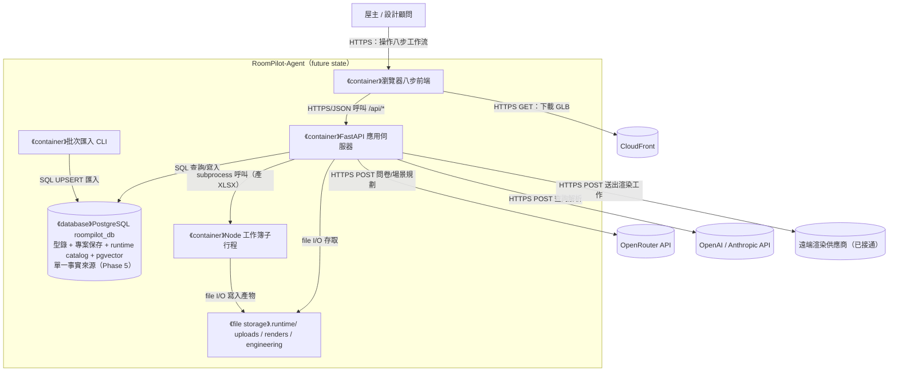

（future state 中 SQLite 與問卷索引收斂進 PostgreSQL 與否、frontend3d 去留，均未裁決——`ROOMPILOT_PROJECT_STORE_PROVIDER=postgres` 路徑已實作（project_store.py:616-619），圖中以 Phase 5 契約方向呈現；裁決後回填。）

#### L3-A — Component（zoom: FastAPI 應用伺服器）

Component = `backend/` 下的 Python 套件（行數以 `wc -l` 實測，排除 `__pycache__`）：floorplan 9,313、catalog 3,199、spatial_data 1,236、agent 1,045、engine 717、upgrade3d 305（六模組合計 15,815），另 server 本身含 main.py 3,695、scene_service.py 2,445、engineering/ 3,111（.py）。

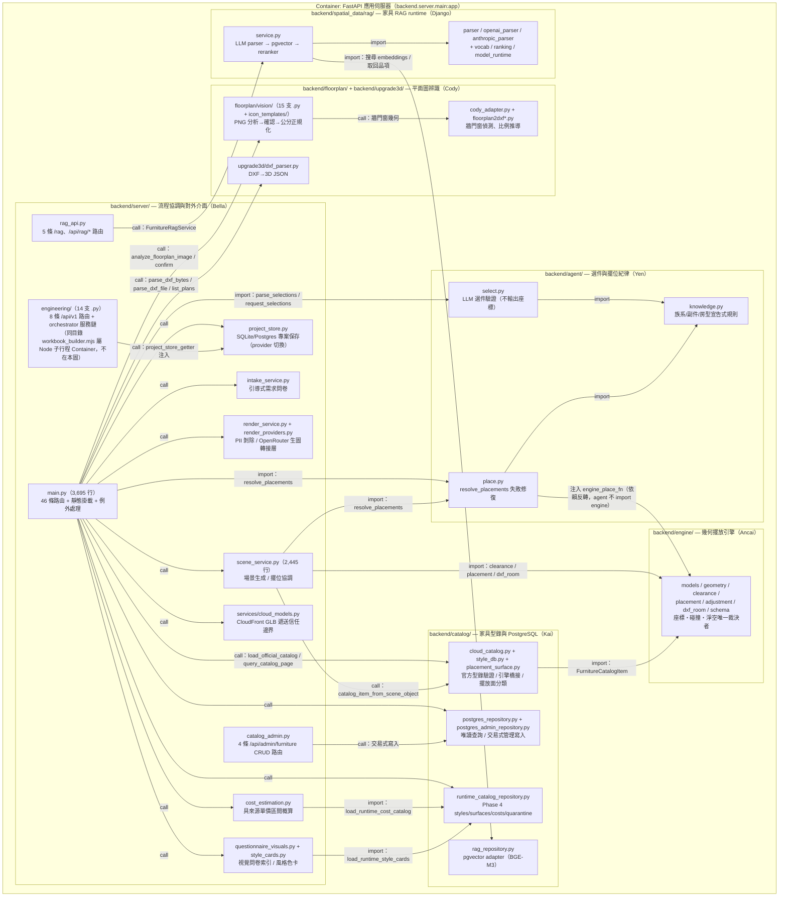

**L3-A 檢查清單**：
- [x] 標題含父 Container
- [x] 不出現其他 Container 的內部（DB schema 在 §4.1）
- [x] 箭頭語意明說（import / call / 注入）
- 依賴方向要點（grep 實證）：`backend/agent/` 不 import engine/server，引擎重擺函式由 scene_service 以 `engine_place_fn` 閉包注入 `resolve_placements`（place.py docstring）；`backend/spatial_data/rag/` 經 Kai 的 `catalog/rag_repository.py` 存取 PostgreSQL，不自行連 DB；`backend/server/postgres_catalog.py` 只是相容 shim，實體在 `backend/catalog/postgres_repository.py`（server/postgres_catalog.py:1-5）。

#### L3-B — Component（zoom: 瀏覽器八步前端）

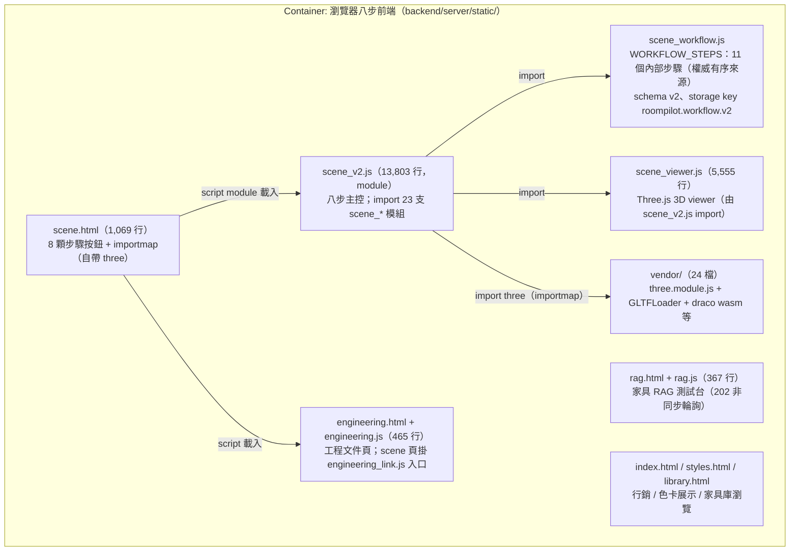

補充事實：步驟順序唯一有序來源是 `scene_workflow.js:4-16` 的 11 步（`project → upload → recognition → calibration → space_confirmation → requirements → layout_2d → white_model_3d → realistic_3d → proposal_review → ai_render`）；UI 只有 8 顆按鈕（scene.html:25-32），`calibration` 與 `recognition` 共用 `scale` 面板、`white_model_3d`/`realistic_3d` 有面板無獨立按鈕（WORKFLOW_PANEL_BY_STEP，scene_workflow.js:18-30）。每步完成條件由 `validCompletion()` 定義（:159-193），上游變更時下游標 stale（markDownstreamStale，:207-216）。快取破壞採 `?v=sha256-<前 12 hex>` 內容雜湊，由 `tests/test_scene_v2_contract.py:20-28` 守約（現行工作樹 scene_v2.js 與 library.js 雜湊已知不符，見 §7.1）。

#### L3-X — 其他 Container 的揭露

| Container | L3 處理 | 理由 |
| :--- | :--- | :--- |
| PostgreSQL `roompilot_db` | 表代圖 → §4.1 | DB 的 components = tables/views；runtime API view = `roompilot.furniture_catalog_api_current`（postgres_repository.py:18），底層 view = `roompilot.furniture_catalog_current`（roompilot_postgresql_schema.sql:386） |
| 專案保存 SQLite | 表代圖 → §4.1 | projects + render_outputs + engineering_* 四表 |
| 問卷視覺索引 SQLite | 略 | 可重建索引，資料真源是版控 JSON |
| 檔案儲存 `.runtime/` | 略 | 無 internal component |
| Node 工作簿子行程 | 略 | 單一腳本 workbook_builder.mjs（237 行） |
| 批次匯入 CLI | 略 | 各自單一腳本，流程見 `scripts/sql/README.md` 等 |
| frontend3d DXF 檢視器 | 表代圖 | 僅 6 個 src 檔：main.jsx 6 行（掛載入口）→ App.jsx 209 行（狀態與 fetch）→ Scene.jsx 236 行 → Furniture.jsx 304 行 → snap.js 137 行，另 styles.css |

#### L3-Y — Container 的跨文件同步狀態（依附錄一致性檢查表逐一核對）

§1.1.2 的 9 個 Container 逐一對照四份下游文件；「不在範圍」是**明示的跳過理由**，不是遺漏。

| Container | `03_architecture/project_structure.md` | `04_design/file_dependencies.md` | `04_design/class_relationships.md` | `06_ops/deployment_and_operations.md` |
| :--- | :--- | :--- | :--- | :--- |
| FastAPI 應用伺服器 | ✅ `backend/server/` 段 | ✅ SRV 節點 | ✅ 模組依賴圖 | ✅ 第 1 節拓撲 |
| 瀏覽器八步前端 | ✅ `static/` 六頁 | ✅ STATIC 節點 | 不在範圍（本文件僅盤點 Python 類別，前端無類別層） | ✅ `/static` 直出 |
| PostgreSQL `roompilot_db` | ✅ `scripts/` 五階段 | ✅ PG 節點 | ✅ repository 群 | ✅ 基礎設施元件表 |
| 專案保存 SQLite | ✅ `.runtime/` 段 | ✅ SQLITE 節點 | ✅ `ProjectStore`/`PostgresProjectStore` | ✅ 基礎設施元件表 |
| 問卷視覺索引 SQLite | ✅（本輪補：`.runtime/indexes/`） | ✅ SQLITE 節點 + 基礎設施層列 | ✅ `QuestionnaireVisualStore` | ✅（本輪補：基礎設施元件表一列） |
| 檔案儲存 `.runtime/` | ✅ `.runtime/` 段 | ✅ 關鍵依賴路徑場景二 | 不在範圍（檔案系統無類別） | ✅ 備份現況表 |
| Node 工作簿子行程 | ✅ `workbook_builder.mjs` | ✅ NODE 節點 | ✅ 轉接器模式列 | ✅ 文件產生列 |
| 批次匯入 CLI | ✅ `scripts/` 三子目錄 | ✅（本輪補：依賴規則第 8 條） | 不在範圍（匯入腳本無業務類別） | ✅ 備份/遷移列 |
| frontend3d DXF 檢視器 | ✅ 頂層結構 + 負責人表 | ✅ FE3D 節點 | 不在範圍（JSX 元件，非 Python 類別） | ✅（本輪補：基礎設施元件表一列） |

#### L4 — Code

省略。類別／函式層級請讀 `backend/engine/schema.py`（對外介面定義 v0.1、公分制 docstring）與 `docs/contracts/`（22 檔）；類別關係文件見 `../04_design/class_relationships.md`（v5 導入版，如尚未產出則暫缺）。

#### 1.1.3 C4 審查 Checklist（PR / milestone gate）

**結構**：
- [x] L1–L3 各至少一張圖，一圖一層級
- [x] L3 每張圖對應且僅對應一個 L2 Container
- [x] 每個 L2 Container 都有對應 L3 或明確跳過理由（§L3-X）
- [x] 至少一張 Sequence Diagram（§3.4，四張）
- [x] Deployment Diagram 含 Node 屬性（§5.1）

**完整性（避免 Partial Disclosure）**：
- [x] L1 含所有外部系統（五類逐一核對，含 RAG 解析用 OpenAI/Anthropic）
- [x] L2 含所有規劃中的 Container
- [x] 有獨立 future state 圖
- [x] 所有 L2 Container 對應 §1.1.2 Container 表（雙向核對）

**命名與語意**：
- [x] 無 C4 層級與業務層級名稱混用（§1.1.0）
- [x] DDD Context Map 箭頭採 Strategic Relationship（§1.2）
- [x] DDD 戰術元素對應表（§1.2.5）

**箭頭規範**：
- [x] 跨 Container / 跨 Node 箭頭標 protocol + 動詞
- [x] L3 內部箭頭明說語意（import / call）

**演進規則**：
- [ ] 新增模組：先決定屬哪個 Container → 再畫進對應 L3
- [ ] 拆出新 process → 先改 L2，再新增 L3
- [ ] 架構變動 → 同步更新 `../03_architecture/project_structure.md`、`../04_design/file_dependencies.md`、`../04_design/class_relationships.md`、`../06_ops/deployment_and_operations.md`（v5 目錄結構）；逐 Container 的現行同步狀態與明示跳過理由見 **§L3-Y**

---

### 1.2 DDD 戰略設計

> DDD **限界上下文** ≠ C4 **System Context（L1）**。RoomPilot 的限界上下文以 `docs/TEAM_AI_OWNERSHIP.md:19-34` 目錄責任表為準（Git author 不可單獨視為 owner，:3）。

#### C4 Container ↔ DDD 限界上下文對應

| DDD 限界上下文（負責人） | 主要落在 C4 Container | 備註 |
| :--- | :--- | :--- |
| 平面圖辨識（Cody：`backend/floorplan/` + `backend/upgrade3d/`） | FastAPI 應用伺服器 | PNG 視覺管線（cody 引擎）與 DXF 解析兩路，出口統一公分制 layout_json；房型詞彙 bed/bath/living → bedroom/bathroom/living_room 映射在 vision/analysis.py:57-62（CODY_ROOM_TYPE_MAP，:62 起）|
| 空間資料與家具 RAG（Django：`backend/spatial_data/`） | FastAPI 應用伺服器 + PostgreSQL（pgvector） | 現行主體是 rag/ 子套件（LLM parser → pgvector → reranker）；HTTP 面經 `rag_api.py` 曝露 |
| 家具型錄與 PostgreSQL（Kai：`backend/catalog/`） | FastAPI 應用伺服器 + PostgreSQL + CloudFront/S3 + 批次匯入 CLI | 官方 JSON catalog 8,557 筆（JSON/furniture/furniture_official_catagory.json count=8557 實測；docs/TEAM_AI_OWNERSHIP.md:57 一致）；五階段契約 `docs/contracts/POSTGRESQL_*.md` |
| 選件與擺位紀律（Yen：`backend/agent/`） | FastAPI 應用伺服器 | 只決定選件與修復意圖，**不輸出合法座標**（select.py docstring） |
| 幾何擺位（Ancai：`backend/engine/`） | FastAPI 應用伺服器 | 座標、碰撞、淨空的唯一裁決者（docs/TEAM_AI_OWNERSHIP.md:53） |
| 流程協調與展示（Bella：`backend/server/` + `frontend3d/`） | FastAPI 應用伺服器 + 瀏覽器八步前端 + frontend3d | 八步工作流、專案保存、對外 API、靜態頁 |
| 工程文件（Bella：`backend/server/engineering/`） | FastAPI 應用伺服器 + Node 工作簿子行程 + 檔案儲存 | snapshot→lock→packages→jobs→documents；契約 `docs/contracts/ENGINEERING_DOCUMENT_MVP.md` |

#### 通用語言（術語詞彙表，必填）

| 術語 | 定義 |
| :--- | :--- |
| 八步工作流 | UI 的 8 顆步驟按鈕（scene.html:25-32）；內部 11 個步驟，權威序列在 scene_workflow.js:4-16 |
| layout_json | 辨識階段的終點產物：牆/門/窗/房間 + 公分制；辨識止於 layout_json（CLAUDE.md 產品邊界） |
| scene_json | 方案與編輯的資料載體；`render_context` 攜帶家電需求協助第 8 步生圖，不列入 2D/3D 擺設 |
| 公分制 | 跨模組幾何一律公分 cm，新欄位 `_cm`/`_m2`（AGENTS.md 契約；engine/schema.py docstring） |
| revision（樂觀鎖） | 專案版本號；寫入帶 `expected_revision`，衝突 409 |
| 官方型錄 | 現行 8,557 筆（JSON 實測）；第 6 步以 PostgreSQL view 優先，DB 不可用才用已驗證 JSON（CLAUDE.md） |
| quarantine | `backend/catalog/data/quarantine/`（sf3d_legacy、unmatched_cloud_furniture）；不得視為正式家具 |
| snapshot / lock | 工程文件 MVP：設計方案凍結（snapshot）→ 設計師確認鎖定（approval_status=designer_confirmed）後才可產工程包 |
| ReportPayload | 工程包產出物 JSON（schema `docs/contracts/report_payload.schema.json`）；roompilot-proposal / roompilot-budget skill 的輸入 |
| 家具 RAG | 口語需求 → LLM 解析受控詞彙 → pgvector 檢索 → reranker；受控詞彙 6 風格、24 氛圍詞、19 家具群組（rag/data/taxonomy.json、category_groups.json 實測） |
| Phase 1–5 | PostgreSQL 五階段：Read 串接 → 管理 CRUD → 專案保存 → runtime catalog → 單一事實來源（docs/contracts/POSTGRESQL_*.md） |
| browser_capture / openrouter_image | render_outputs 的兩種 provider：瀏覽器截圖與內建 OpenRouter 生圖（render_providers.py） |

#### 限界上下文圖（Strategic Context Map）

> 箭頭為 DDD Strategic Relationship，不是 data flow / import。

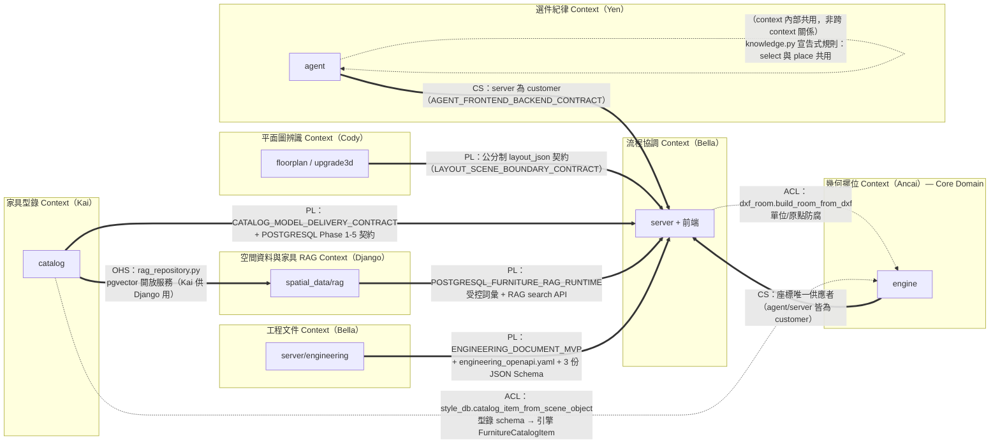

**標記縮寫**：**PL** = Published Language、**CS** = Customer-Supplier、**ACL** = Anti-Corruption Layer、**CF** = Conformist、**SK** = Shared Kernel、**OHS** = Open Host Service。

> **自環註記（鐵律修正）**：`AG → AG` 那條是**同一個限界上下文內部**的模組共用（`agent/knowledge.py` 同時餵 `select.py:17` 與 `place.py:13`），不是 DDD Strategic Relationship——Strategic Relationship 只存在於**兩個不同**限界上下文之間。先前版本標為 `SK`（Shared Kernel）屬誤用，已改為虛線並標明「非跨 context 關係」；保留該邊是為了不遺漏「兩支模組共用同一份宣告式知識表」這個事實（見 §1.2.5 Specification 列與 commit ffd38968）。

正式 PL 文本即 `docs/contracts/` **22 個檔案**（17 個 .md + engineering_openapi.yaml + 3 個 .schema.json + 1 個 example.json，`ls docs/contracts/ | wc -l` 實測）。

#### 1.2.5 DDD 戰術設計（必填）

| DDD 元素 | 程式碼位置 | 說明 |
| :--- | :--- | :--- |
| **Entity** | 專案（project_store.py：project_id + 可變 workflow_json/revision）；`engine/models.py PlacedFurniture:62`（id + 可變座標）；工程 JobStatus（job_id + progress/stage 演進，engineering/api.py:199-268） | mutable state + identity |
| **Value Object** | `engine/models.py` 的 Wall:18、Room:28、ClearanceZone:36、FurnitureCatalogItem:48（dataclass 以值使用）；`spatial_data/rag/models.py` Pydantic 契約 | immutable 使用慣例 |
| **Aggregate Root** | 專案（projects 一列 + render_outputs + uploads + engineering_* 四表以 project_id 收束）；invariant = revision 樂觀鎖；工程側鎖定版本不可覆寫（409 LOCKED_REVISION_CANNOT_BE_OVERWRITTEN） | 一致性邊界 |
| **Domain Service** | engine：check_placement_with_clearance:89、place_furniture:10、adjust_furniture:72；agent：parse_selections:439、resolve_placements:130；engineering：QuantityService/CostService/ScheduleService 等服務鏈（api.py:56-75） | 不屬單一 Entity 的純邏輯 |
| **Domain Event** | **缺席**。狀態以 revision 遞增 + workflow JSON 快照覆寫；工程 jobs 以輪詢回讀而非事件流。單機規模下屬合理取捨 | 缺席理由（本欄即是） |
| **Repository** | project_store.py ProjectStore / postgres_project_store.py PostgresProjectStore（provider 切換，project_store.py:614-620）；catalog/postgres_repository.py（唯讀）與 postgres_admin_repository.py（交易式寫入）；engineering/repository.py（SQLite/Postgres 雙模，:131 起）；catalog/rag_repository.py（pgvector） | Aggregate 持久化抽象 |
| **Anti-Corruption Layer** | engine/dxf_room.py（單位/原點防腐）；catalog/style_db.py（型錄→引擎橋接）；catalog/placement_surface.py（擺放面分類，「只做分類不做幾何決策」）；services/cloud_models.py（只回 manifest 驗證過的 URL）；server/postgres_catalog.py（相容 shim） | 隔離外部/舊 schema 變動 |
| **Specification** | agent/knowledge.py 的 ROOM_AFFINITY、COMPANION_OF、FAMILY_OF；spatial_data/rag/vocab.py（版本化受控詞彙）；engineering/rules.py（ExistingEngineRuleService） | 集中的業務規則判斷 |

---

### 1.3 分層架構（Clean Architecture）

Repo 未按 Clean Architecture 目錄命名，以下為模組邊界到邏輯分層的**近似對應**（依 import 方向實證）：

| 層 | 程式碼位置 | 職責 |
| :--- | :--- | :--- |
| **Domain Layer** | `backend/engine/`（座標/碰撞/淨空；schema.py 對外介面 v0.1）、`backend/agent/`（選件與修復紀律，不觸網路與座標） | 核心業務規則 |
| **Application Layer** | `backend/server/scene_service.py`（場景 use case）、`intake_service.py`、`cost_estimation.py`、`engineering/orchestrator.py` 與服務鏈、`spatial_data/rag/service.py`（檢索編排）、`main.py`/`rag_api.py`/`catalog_admin.py`/`engineering/api.py` 路由層 | 應用程式邏輯 |
| **Infrastructure Layer** | `project_store.py`/`postgres_project_store.py`（保存）、`catalog/postgres_repository.py`/`postgres_admin_repository.py`/`runtime_catalog_repository.py`/`rag_repository.py`（PostgreSQL）、`services/cloud_models.py`（CloudFront）、`render_providers.py`（OpenRouter httpx）、`rag/model_runtime.py`（BGE-M3 離線載入）、`engineering/workbook_builder.mjs`（XLSX adapter）、floorplan 的 OpenCV/ezdxf 實作 | 外部互動實現 |

**關係與 C4**：Clean Arch 是**邏輯分層**，C4 Container 是**物理 runtime**——後端模組全部活在同一個 FastAPI process 內（Node 子行程與批次 CLI 除外），分層靠 import 紀律維持（agent 不 import engine/server；engine 不 import server）。

### 1.4 技術選型

| 分類 | 選用技術 | 選擇理由 | 備選方案 | ADR |
| :--- | :--- | :--- | :--- | :--- |
| 後端框架 | fastapi==0.140.0 + uvicorn==0.51.0（requirements.txt:9-10；team baseline 2026-07-27、Python 3.12.13） | 單 process 承載 63 條路由 + 靜態頁 | （未記錄） | 無正式 ADR；決策散見 `docs/contracts/` 與 git log（ADR 模板見 `./adr.md`） |
| 幾何運算 | shapely==2.1.2 | 多邊形碰撞/淨空 | （未記錄） | 同上 |
| 主資料庫 | PostgreSQL roompilot_db（psycopg2-binary==2.9.12、SQLAlchemy==2.0.51；型錄 provider 預設 `postgres`） | 型錄查詢/CRUD/runtime catalog/pgvector 五階段 | JSON fallback（DB 不可用時，CLAUDE.md 邊界） | `docs/contracts/POSTGRESQL_*PHASE*.md` 五份為近似決策記錄（同前綴另有向量兩份，`POSTGRESQL_*.md` 共 7 檔）|
| 專案保存 | SQLite（預設）/ PostgreSQL（`ROOMPILOT_PROJECT_STORE_PROVIDER=postgres`） | 單機 demo 零部署成本；遷移腳本已備 | — | `docs/contracts/POSTGRESQL_PROJECT_STORE_PHASE3.md` |
| 向量檢索 | pgvector + BAAI/bge-m3（rag_repository.py:12；離線 thread-safe lazy 載入） | 家具語意檢索；embedding 本地算不出站 | — | `docs/contracts/POSTGRESQL_FURNITURE_EMBEDDINGS.md`、`POSTGRESQL_FURNITURE_RAG_RUNTIME.md` |
| DXF 解析 | ezdxf==1.4.4 | DXF 實體攤平 | — | 無 |
| 影像辨識 | numpy==2.5.1 + opencv-python==4.13.0.92（註明需鎖 <5）、rapidocr-onnxruntime==1.4.4；選配 torch==2.13.0（DINOv2 房型分類，缺則房型準確度 90.3%→幾何猜測） | 牆門窗偵測與房型語意 | paddleocr（選配另裝） | requirements.txt 註解為近似決策記錄 |
| 3D 前端（主線） | 自帶 three.js（/static/vendor/three/，24 檔含 draco），原生 ES module | 免建置工具鏈、**零 CDN 依賴**（demo 現場離線可用） | React Three Fiber（frontend3d 次要原型） | 無 |
| LLM（問卷/場景/生圖） | OpenRouter；生圖預設 `google/gemini-2.5-flash-image`；失敗必 fallback 本地規則 | 沿用單一 OPENROUTER_API_KEY | — | `docs/contracts/AGENT_FRONTEND_BACKEND_CONTRACT.md`、`REMOTE_RENDER_CONTRACT.md` |
| LLM（RAG 解析） | OpenAI（預設，gpt-5.6-sol）或 Anthropic（claude-sonnet-4-6），Structured Outputs | 受控詞彙結構化輸出 | 兩家互為備選（provider 切換） | `docs/contracts/POSTGRESQL_FURNITURE_RAG_RUNTIME.md` |
| XLSX 產出 | Node adapter（workbook_builder.mjs，ROOMPILOT_ARTIFACT_NODE） | Python 端零 xlsx 依賴 | — | `docs/contracts/ENGINEERING_DOCUMENT_MVP.md` |
| 套件管理 | requirements.txt team baseline（21 個 pin、5 個 owner 分組）；repo 另有 pyproject.toml + uv.lock | 全隊 Windows/macOS 重現 | — | 無 |
| 快取 | 無獨立快取服務；startup 僅在型錄 provider=json 時預熱記憶體（main.py:2821-2828）；GZipMiddleware | — | — | 無 |
| 訊息佇列 | 無；非同步靠 FastAPI BackgroundTasks（工程 jobs）與 daemon Thread（RAG jobs，上限 RAG_JOB_MAX_ACTIVE，超過 429） | 單機同步為主 | — | 無 |
| 容器編排 | 無（未容器化） | — | — | 無 |
| 可觀測性 | 無（見 §6.1） | — | — | 無 |
| CI/CD | 無（`.github/` 不存在，實測）；手動 pytest（tests/ 99 支 + tests/static/ 3 支 mjs + training/tests/ 11 支） | — | — | 無 |

> **開發輔助（不入 C4）**：`.claude/skills/` 四支專案 skill（roompilot-security / roompilot-furniture-query / roompilot-proposal / roompilot-budget，git 追蹤 14 檔）是開發與交付期工具——security 做攻擊面稽核、furniture-query 做口語→受控詞彙轉譯、proposal/budget 把 ReportPayload 排版成提案與估價文件並以腳本核數。它們消費系統的 API 與 payload，但不是系統 runtime 的一部分。

---

## 第 2 部分：需求摘要

### 功能性需求

對應八步工作流（步驟名以 scene_workflow.js 為準）與周邊能力：

- FR-1 `project`：建立/續作專案，revision 樂觀鎖（POST `/api/projects`、PUT `/api/projects/{id}/workflow`）
- FR-2 `upload`：上傳平面圖（POST `/api/projects/{id}/floorplan`，201）
- FR-3 `recognition`+`calibration`：牆門窗辨識與尺度確認（POST `/api/projects/{id}/floorplan/analyze`）
- FR-4 `space_confirmation`：空間與結構確認（confirm_floorplan_analysis 人工閘門）
- FR-5 `requirements`：視覺問卷（GET `/api/questionnaire/visual-catalog`）+ 引導式 intake（POST `/api/agent/intake/start|answer`）；家電需求留在問卷與 `scene_json.render_context`，不入 2D/3D 擺設
- FR-6 `layout_2d`：選件（POST `/api/agent/furniture/select`，型錄以 PostgreSQL view 優先）+ 場景生成/配置/驗證/軟裝（POST `/api/scene/generate|layout|validate|decorate`）
- FR-7 `white_model_3d`/`realistic_3d`：3D 白模與 6 風格 18 色卡即時寫實（GLB 經 CloudFront 307）
- FR-8 `proposal_review`：截圖鎖定（POST `/api/projects/{id}/renders`，provider=browser_capture）
- FR-9 `ai_render`：AI 渲染（POST `/api/projects/{id}/render-jobs`，202；內建 OpenRouter 生圖或遠端供應商）
- FR-10 家具 RAG：口語檢索（POST `/api/rag/search`、非同步 `/api/rag/search/jobs`，202）
- FR-11 工程文件：snapshot→lock→packages→jobs→documents（`/api/v1/*` 8 條路由）
- FR-12 型錄管理：CRUD（`/api/admin/furniture` 4 條路由，交易式寫入 + activation gate + 樂觀併發）
- FR-13 成本概算：POST `/api/cost/estimate`（具來源單價區間，Phase 4 runtime catalog）

### 非功能性需求

| 分類 | 需求描述 | 目標值 | 依據 |
| :--- | :--- | :--- | :--- |
| 性能 | API 延遲目標 | **未定義**（無 SLO 文件） | — |
| 可用性 | LLM 失敗不得擋流程 | 本地 deterministic fallback（intake mode=guided_fallback） | intake_service.py:157-162 |
| 可用性 | DB 瞬時滿載 | 503 + Retry-After:2（busy），與「未匯入」區分 | main.py:226-266、postgres_repository.py:224-225 |
| 一致性 | 併發寫入防護 | revision 樂觀鎖，衝突 409 | project_store.py |
| 一致性 | 工程鎖定 | 鎖定版本覆寫 409 LOCKED_REVISION_CANNOT_BE_OVERWRITTEN；未鎖定產包 409 REVISION_NOT_LOCKED | engineering/api.py:114-198 |
| 容量 | RAG 非同步任務上限 | RAG_JOB_MAX_ACTIVE = 1（rag_api.py:30），超過 429 rag_job_capacity_reached | rag_api.py:30,163-166 |
| 隱私 | 渲染工作送出前剝除 PII | PRIVATE_KEYS 欄位過濾 | render_service.py:12,60 |
| 安全 | 檔案下載邊界 | 工程文件僅允許 `.runtime/engineering` 下實檔（path.is_relative_to 防護） | engineering/api.py:295-303 |
| 安全性 | 認證授權 | **幾乎無**（63 條中 59 條匿名可呼叫；僅 `/api/admin/furniture` 4 條有 Bearer token，catalog_admin.py:170-195；風險見 §7.1） | grep 實證僅 GZip middleware；認證僅 catalog_admin 的 `Depends(_admin_principal)` |

---

## 第 3 部分：系統設計

### 3.1 架構模式

- **模式**: 模組化單體（modular monolith）+ 伺服器直出靜態前端 + 手動批次資料管線
- **選擇理由**: 單一 uvicorn process 承載 63 條路由；相比舊版（44 條全塞 main.py），現已拆出三個 APIRouter（rag_api、catalog_admin、engineering/api）；六個領域模組以 import 紀律劃界。取捨：main.py 仍達 3,695 行、scene_v2.js 13,803 行（§7.1）。

### 3.2 系統元件圖

引用 §1.1 的 C4 圖，不重複貼。

### 3.3 元件職責

| 元件 | 核心職責 | 技術 | 依賴 |
| :--- | :--- | :--- | :--- |
| `backend/server/main.py` | 46 條路由、驗證、錯誤碼、靜態掛載、例外處理 | FastAPI | 其餘模組 + server 內服務 |
| `backend/server/rag_api.py` | 5 條家具 RAG 路由（含 202 非同步 job） | APIRouter + daemon Thread | spatial_data/rag |
| `backend/server/catalog_admin.py` | 4 條型錄管理 CRUD 路由 | APIRouter | catalog/postgres_admin_repository |
| `backend/server/engineering/` | 8 條工程文件路由 + orchestrator（Quantity/工程 RAG/Rule/Cost/Schedule/Narrative/Document 服務鏈） | APIRouter + BackgroundTasks + Node subprocess | project_store（getter 注入）、catalog/data/engineering 知識庫 |
| `backend/server/scene_service.py` | 場景 payload 組裝、擺位協調、修復閉環、OpenRouter 場景規劃 | Python + httpx | agent.place、engine、catalog.style_db |
| `backend/server/project_store.py` | 專案/渲染輸出保存、provider 切換（sqlite/postgres）、樂觀鎖 | SQLite / psycopg2 | runtime_paths、postgres_project_store |
| `backend/server/render_service.py` + `render_providers.py` | 渲染驗證、PII 剝除；OpenRouter 同步生圖轉接層（prompt 組裝、回圖入庫、provider=openrouter_image） | httpx | PROJECT_STORE、env |
| `backend/server/cost_estimation.py` | 具來源單價區間概算（來源與 inclusions/exclusions 缺失即 raise） | — | catalog/runtime_catalog_repository |
| `backend/server/questionnaire_visuals.py` + `style_cards.py` | 視覺問卷 SQLite 索引、風格色卡（Phase 4 provider） | SQLite | runtime_catalog_repository |
| `backend/server/services/cloud_models.py` | GLB 遞送模式（cloudfront/local）、manifest 驗證 URL | — | manifest CSV |
| `backend/floorplan/`（含 vision/） | PNG 分析→確認→公分正規化；房型分類（DINOv2 選配） | OpenCV、numpy、(torch) | upgrade3d |
| `backend/upgrade3d/dxf_parser.py` | DXF→3D JSON | ezdxf、shapely | — |
| `backend/agent/` | LLM 選件驗證與擺位失敗修復（不出座標） | 純 stdlib | knowledge.py |
| `backend/engine/` | 座標/碰撞/淨空唯一裁決；公分制 schema v0.1 | shapely | — |
| `backend/catalog/` | PostgreSQL 唯讀查詢/管理寫入/runtime catalog/pgvector adapter、官方型錄驗證、引擎橋接、擺放面分類 | psycopg2 | engine.models |
| `backend/spatial_data/rag/` | LLM parser → pgvector → reranker；受控詞彙；離線 BGE-M3 | httpx、pgvector | catalog/rag_repository |
| 前端 `scene_v2.js` + `scene_workflow.js` + `scene_viewer.js` | 八步狀態機、前置依賴、3D 場景、截圖 | 自帶 three.js | `/api/*` |
| `frontend3d/` | DXF 白模檢視（次要原型） | Vite + R3F | `/api/plans`、`/api/plan`、`/api/upload`、`/api/furniture` |

### 3.4 關鍵使用者旅程（Dynamic Diagrams，必填）

> 主流程步驟順序以 `scene_workflow.js:4-16` 為準。以下按 Container 邊界拆四張 sequence 圖；失敗分支用 `alt`。

#### 3.4.1 八步主流程核心（project → … → layout_2d）

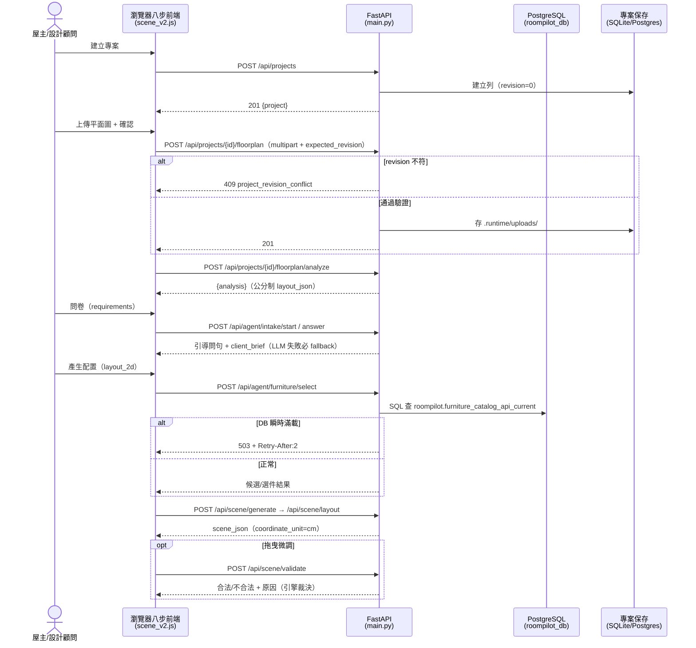

#### 3.4.2 第 8 步 AI 渲染（ai_render，內建 OpenRouter 生圖）

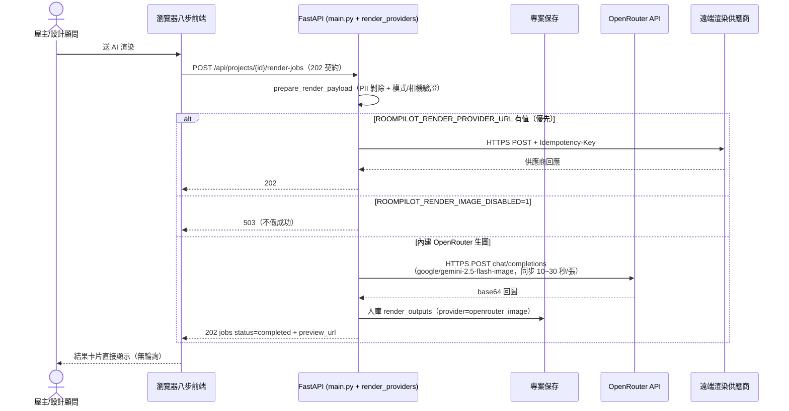

#### 3.4.3 工程文件 MVP（snapshot → lock → packages → jobs → documents）

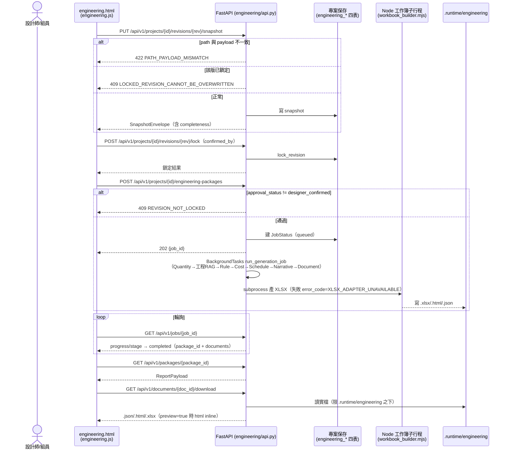

#### 3.4.4 家具 RAG 檢索（口語需求 → 受控詞彙 → pgvector）

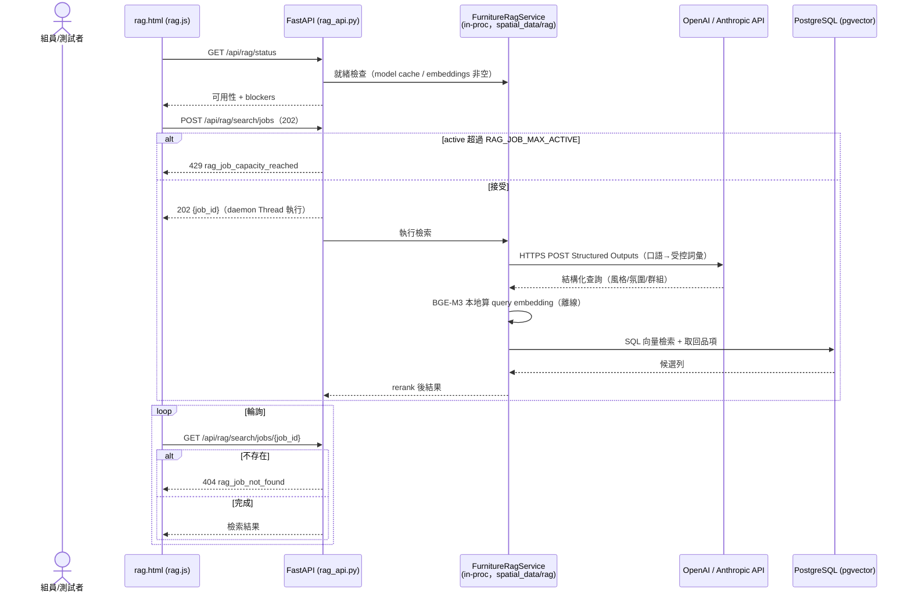

**規則核對**：每個 use case 一張圖；protocol 已標；async（202 + BackgroundTasks/Thread）與 sync 已區分；失敗分支用 `alt`。

---

## 第 4 部分：資料架構

### 4.1 資料模型（ER 圖）

#### 專案保存（SQLite `.runtime/projects.sqlite3`，或 Postgres 同構；project_store.py:121-163、engineering/repository.py:65-96 實碼）

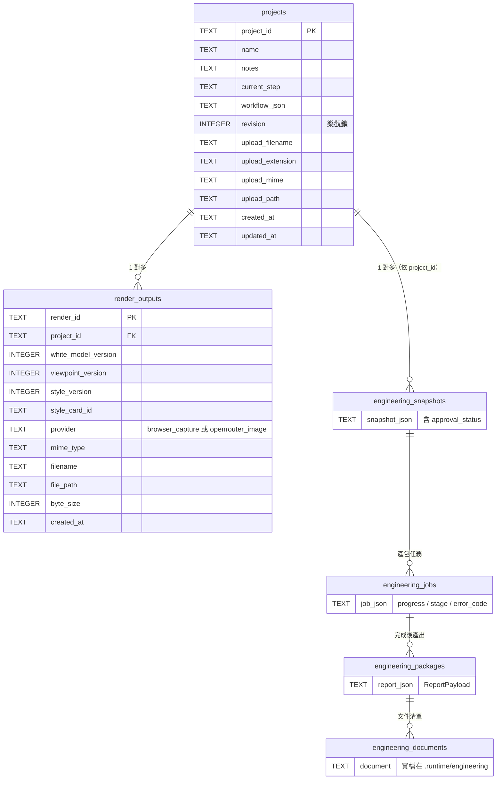

（engineering_* 四表欄位以 `backend/server/engineering/repository.py:65-110` 的 CREATE TABLE / CREATE INDEX 為準，此處僅標關鍵欄位；Postgres 模式下同 repository 以 `postgres_query` 對應版本操作，repository.py:131,357,413。）

#### PostgreSQL `roompilot_db`（表代圖；schema 以 scripts/ 下四份 .sql 為準）

| Schema 檔 | 內容 | 對應 Phase |
| :--- | :--- | :--- |
| `scripts/sql/roompilot_postgresql_schema.sql` | 家具型錄表 + view `roompilot.furniture_catalog_current`（:386）；runtime API 讀 `roompilot.furniture_catalog_api_current`（postgres_repository.py:18） | Phase 1/2/5 |
| `scripts/sql/roompilot_furniture_embeddings_schema.sql` | 家具向量表（pgvector，BAAI/bge-m3；正式來源 `JSON/furniture/furniture_official_catagory.json`） | 向量契約 |
| `scripts/project_store/roompilot_project_store_schema.sql` | `roompilot.projects` 等專案保存表 | Phase 3 |
| `scripts/runtime_catalog/roompilot_runtime_catalog_schema.sql` | styles / surfaces / costs / quarantine runtime catalog | Phase 4 |

**重要**：DB 內部 table 細節只放這裡，L3 不重複。執行期讀寫邊界：公開型錄唯讀（postgres_repository），管理寫入走交易式 admin repository（參照驗證 + activation gate + 樂觀併發 + audit record）；strict PostgreSQL 模式下 runtime catalog **不靜默回退**掃 JSON（runtime_catalog_repository.py:1-6）。

### 4.2 一致性策略

- **強一致**: 專案讀寫——單庫交易 + revision 樂觀鎖（衝突 409 附最新 project 供前端重放）
- **強一致（工程側）**: 鎖定版本不可覆寫（409）；未鎖定不可產包（409 REVISION_NOT_LOCKED）；文件下載限定 `.runtime/engineering` 實體邊界
- **強一致（型錄管理）**: 交易式寫入 + 樂觀併發檢查 + audit record（postgres_admin_repository.py:1-6）
- **批次一致**: 五階段匯入腳本手動執行；匯入驗證檔 `scripts/runtime_catalog/runtime_catalog_import_validation.json`
- **最終一致**: 無分散式元件；工程 jobs 與 RAG jobs 以輪詢收斂（202 → GET 狀態）

### 4.3 資料分類與合規

- **PII**：渲染工作送出前剝除 PRIVATE_KEYS（render_service.py:12,60）；問卷 client_brief 與專案資料留在本機/自管 DB
- **加密**：SQLite/檔案系統靜態未加密；PostgreSQL 連線預設 `sslmode=disable`（postgres_repository.py:217，明文連線——已在 roompilot-security skill 基線列為風險）
- **保留策略**：未定義（待補）；`.runtime/` 不進 git
- **機密管理**：API key 一律環境變數／`.env`（gitignore；`.mcp.json` 因含 key 亦被 ignore）
- **隔離資料**：quarantine（sf3d_legacy、unmatched_cloud_furniture）不得視為正式家具（CLAUDE.md 禁令）

---

## 第 5 部分：部署與基礎設施

### 5.1 部署視圖（C4 Deployment Diagram）

> Deployment Diagram = L2 Container 的**物理實體化**，含 Node 屬性與 instance 標記。

#### 5.1.1 當前環境（單機開發/驗收）Deployment

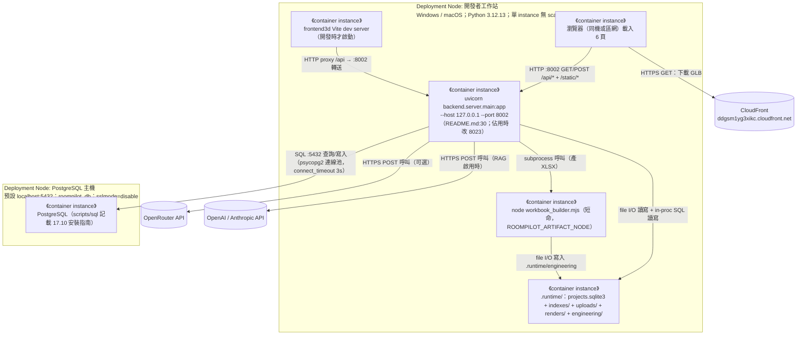

| 屬性 | 值 |
| :--- | :--- |
| Deployment 模式 | 單機單 process（`uvicorn backend.server.main:app --host 127.0.0.1 --port 8002 --reload`，README.md:30,46） |
| 高可用 | 無 |
| Backup | git 版控；`.runtime/` 與 PostgreSQL 無自動備份 (未查證) |
| 監控 | 無 |
| 前端離線性 | three.js 自帶（vendor/），demo 現場無 CDN 依賴；GLB 仍需連 CloudFront |

#### 5.1.2 目標環境 Deployment

未定義。已知方向（對應 §1.1.2.5 future state）：專案保存切 `ROOMPILOT_PROJECT_STORE_PROVIDER=postgres` 收斂單庫、遠端渲染供應商接通；目標主機/雲端規格無文件記載——**待補，需團隊裁決** (未查證)。

#### 5.1.3 環境策略

| 環境 | Deployment | 用途 |
| :--- | :--- | :--- |
| Dev | 本機 uvicorn :8002 + `.runtime/` + 本機/區網 PostgreSQL | 開發與組員驗收 |
| Staging | 未建立 | — |
| Production | 未建立 (未查證：是否另有發表部署計畫) | — |

### 5.2 CI/CD 流程

| 階段 | 步驟 |
| :--- | :--- |
| Build | 無自動化（`.github/` 不存在，實測）；環境以 requirements.txt（21 pin）重現，另有 pyproject.toml + uv.lock |
| Test | 手動：`pytest -q`（tests/ 99 支 test_*.py + conftest）、前端 JS 測試 tests/static/ 3 支 .test.mjs、訓練側 training/tests/ 11 支；AGENTS.md:64-72 驗證矩陣 7 類；最終整合 3 條指令（pytest -q、git diff --check、git status --short） |
| Deploy | 手動啟動 uvicorn；無部署管線 |

### 5.3 成本估算

| 項目 | 月成本 | 備註 |
| :--- | :---: | :--- |
| AWS S3 + CloudFront（GLB 儲存與流量） | (未查證) | 帳務資訊不在 repo |
| OpenRouter（問卷/場景/生圖） | (未查證) | 生圖模型 google/gemini-2.5-flash-image 非免費層級，用量計費資訊不在 repo |
| OpenAI / Anthropic（RAG 解析） | (未查證) | ROOMPILOT_RAG_ENABLED 預設 false，未啟用時零成本 |
| PostgreSQL | 0（自架） | 本機/區網自管 |

---

## 第 6 部分：跨領域考量

### 6.1 可觀測性

| 維度 | 工具 | 狀態 |
| :--- | :--- | :--- |
| 日誌 | uvicorn stdout（startup 預熱失敗僅 print 警告，main.py:2827-2828） | 無集中式日誌 |
| 指標（SLI/SLO） | 無 | 未建立 |
| 追蹤 | 無 | 未建立 |
| 告警 | 無 | 未建立 |
| 健康度端點 | GET `/api/health`、`/api/catalog/status`、`/api/scene/provider-status`、`/api/render-provider/status`、`/api/rag/status`、`/api/v1/engineering/health`（回報 snapshot_store provider、demo_mode、knowledge counts、xlsx adapter） | 功能性自我回報，非監控系統 |

### 6.2 安全性

- **認證授權**：幾乎無。63 條路由中 59 條匿名可呼叫（含工程文件下載）；唯一有認證的是 `/api/admin/furniture` 型錄管理 CRUD 4 條，走 `Depends(_admin_principal)` Bearer token（`secrets.compare_digest`，catalog_admin.py:170-195，失敗回 401）；唯一 middleware 是 GZip。roompilot-security skill 的 SKILL.md 明言「全端點無認證/授權、外部抓取無 SSRF 防護、DB 預設明文連線」（該句寫於 catalog_admin 認證落地前，2026-08-04 實測範圍已縮小為 59/63）——公開部署前必補（§7.1 第一條）
- **輸入驗證**：上傳副檔名白名單 + 影像驗證；workflow JSON 上限；LLM 回覆經 parse_selections 白名單驗證（信任邊界在伺服器端）；工程 snapshot path/payload 一致性 422 檢查
- **檔案邊界**：工程文件下載限 `.runtime/engineering` 之下實檔（path.is_relative_to 防護，engineering/api.py:295-303）
- **供應鏈信任邊界**：GLB URL 只信 manifest 驗證過的列（cloud_models.py）；quarantine 資料執行期禁用；型錄標記錯誤在讀取邊界攔下（commit e813e9ee）
- **機密管理**：環境變數 + `.env`（gitignore）；OpenRouter 需 key + `*_ENABLED=1` 雙開關；RAG 需 `ROOMPILOT_RAG_ENABLED=true` + 對應 provider key
- **隱私**：渲染工作剝除 PII 後才出站（render_service.py）
- **威脅模型**：無正式文件；實務基線由 `.claude/skills/roompilot-security/`（audit.sh 靜態稽核 + references/remediation.md）承接——涵蓋八步工作流、專案保存、SSRF、家具模型交付、PostgreSQL catalog 攻擊面

---

## 第 7 部分：風險與演進

### 7.1 風險登記

| 風險 | 可能性 | 影響 | 緩解策略 |
| :--- | :--- | :--- | :--- |
| 無認證授權：可連上 :8002 的人可讀寫所有專案與下載工程文件（59/63 條無認證；型錄 CRUD 4 條已有 Bearer token 不在此列） | 高（公開部署時必發生） | 高 | 公開部署前加認證；現階段限單機/區網 demo；依 roompilot-security 基線補強，以 `_admin_principal` 為推廣範式 |
| PostgreSQL 預設 `sslmode=disable` 明文連線 | 中 | 中 | 跨主機部署時開 TLS；同機部署接受 |
| cache-busting 雜湊失守：scene.html 引 `scene_v2.js?v=sha256-27f24b6bede3` 但實算 7d938e1fdc28、`site.css?v=sha256-5693fe5d95c5` 實算 e362900c8195（這兩項正是契約測試的斷言對象）、library.js 亦不符 → `tests/test_scene_v2_contract.py` 預期紅燈，且使用者可能拿到舊快取 | 高（現況已不符） | 中 | 重算雜湊提交；長期補自動重算腳本（現無，grep 實證） |
| 雜湊機制不統一：index/styles 頁與部分模組仍用日期 token（如 `?v=20260719-actual-palettes`），非真 sha256 | 已發生 | 低 | 收斂為單一機制 |
| 渲染同步生圖阻塞：POST render-jobs 等 OpenRouter 回圖（每張 10~30 秒），單 worker 下長請求佔用 | 中 | 中 | 觀察 demo 負載；必要時改真非同步 |
| RAG 就緒條件脆弱：embedding model cache 缺或 pgvector 表空即 blocker（service.py:82-90）；torch/BGE-M3 資產約 2GB 是否全隊必裝未拍板 | 中 | 中（RAG 頁不可用） | status 端點已回報 blockers；環境準備寫入 onboarding |
| Node adapter 缺席：ROOMPILOT_ARTIFACT_NODE 未設或 node 不可用，XLSX 產出失敗（error_code=XLSX_ADAPTER_UNAVAILABLE） | 中 | 中（工程包缺 xlsx） | health 端點回報 adapter 狀態；json/html 產出不受影響 |
| 型錄雙軌殘留：型錄 provider 預設 postgres，但 JSON fallback 與記憶體預熱路徑仍在（main.py:2821-2828），兩邊可能漂移 | 中 | 中 | Phase 5 收斂單源；匯入驗證擋大錯 |
| 文件與遠端現況漂移：TEAM_AI_OWNERSHIP 寫 `origin/kai-with-bellatest1` 但遠端無此分支 | 已發生 | 低 | 修文件 |
| `main.py` 3,695 行、scene_v2.js 13,803 行 | 已發生 | 中（維護成本） | rag/admin/engineering 已拆 router，持續拆分 |
| `@app.on_event` 為 FastAPI 已棄用 API（main.py:2821,2831） | 低 | 低 | 改 lifespan handler |

### 7.2 演進路線

| Phase | 範圍與目標 |
| :--- | :--- |
| Phase 1（現行） | 八步工作流全通：辨識→問卷→選件（PostgreSQL view 優先）→配置→白模→色卡→截圖→內建 OpenRouter 生圖；工程文件 MVP；家具 RAG 測試台 |
| Phase 2 | PostgreSQL Phase 5 單一事實來源收斂（專案保存預設切 postgres、JSON fallback 退場）；遠端渲染供應商接通；cache-busting 雜湊自動化 |
| Phase 3 | 工程 RAG 語意檢索（替換 Noop retriever）；認證授權與 TLS（公開部署前提）；監控/SLO 建立 |

（Phase 2/3 排序為本文件依契約與現況差距之整理，非團隊已裁決之 roadmap——以團隊會議為準。）

---

## 第 8 部分：模組詳細設計

詳見 `../04_design/module_spec_and_tests.md`（v5 導入版）。各模組權威規格：

- 引擎與擺位紀律：`docs/contracts/FURNITURE_ENGINEERING_RULES.md`、`backend/engine/schema.py`（介面 v0.1）
- Agent 介面與 fallback：`docs/contracts/AGENT_FRONTEND_BACKEND_CONTRACT.md`（2026-08-02 更新）
- 型錄與 PostgreSQL：`docs/contracts/CATALOG_MODEL_DELIVERY_CONTRACT.md`、`POSTGRESQL_*.md` 五階段 + 向量兩份
- 工程文件：`docs/contracts/ENGINEERING_DOCUMENT_MVP.md`、`engineering_openapi.yaml`、三份 `.schema.json`
- 家具 RAG：`docs/contracts/POSTGRESQL_FURNITURE_RAG_RUNTIME.md`
- 渲染：`docs/contracts/REMOTE_RENDER_CONTRACT.md`、`STYLEPACK_RENDERING_CONTRACT.md`

### NFR 實現

- 性能: 無明確目標值；PostgreSQL 端 filter/count/facet/paginate 下推（「FastAPI 不得為了 filter 載入完整型錄」，postgres_repository.py:1-5）；GZip 壓縮；連線池 + 借用逾時
- 安全: 輸入驗證 + 信任邊界（LLM 輸出白名單、manifest 驗證 URL、工程檔案路徑防護）+ PII 剝除；認證缺席為已登記風險
- 可擴展: 單機單 process；資料層已達 Phase 4，Phase 5 收斂路徑已鋪

---

## 變更紀錄

| 版本 | 日期 | 變更 |
| :--- | :--- | :--- |
| v1.0 | 2026-07-26 | 舊導入版（`docs/vibecoding/05_architecture_and_design_document.md`）對 bella-local-20260726 填寫 |
| v2.0 | 2026-08-04 | 依 v5.0 模板重導入；對 django-skill@a2179f7e 全面重查：63 條路由、三個新 APIRouter、工程文件 MVP、家具 RAG runtime、PostgreSQL 五階段、內建 OpenRouter 生圖、three.js 自帶（unpkg 退場）、八步 UI |

---

## 附錄：跨文件一致性檢查表

本文件變更後，**強制**檢查以下文件是否同步（路徑 = `docs/vibecoding-v5/` 的 v5 目錄結構）：

| 異動類型 | 應同步更新 |
| :--- | :--- |
| 新增 Container | `03_architecture/project_structure.md`、`04_design/file_dependencies.md`、`06_ops/deployment_and_operations.md` |
| 新增 module | `04_design/module_spec_and_tests.md`、`03_architecture/project_structure.md`、`04_design/file_dependencies.md`、`04_design/class_relationships.md` |
| 新增外部系統 | `04_design/api_design.md`、`05_qa/security_and_readiness.md`、`06_ops/deployment_and_operations.md` |
| 變更 protocol | `04_design/api_design.md`、`05_qa/security_and_readiness.md`、`06_ops/deployment_and_operations.md`；並同步 `docs/contracts/` 對應契約 |
| 變更 DDD 限界上下文 | `01_requirements/project_brief_and_prd.md`、`04_design/module_spec_and_tests.md`；並同步 `docs/TEAM_AI_OWNERSHIP.md` 目錄責任表 |

**鐵律**：本文件是架構契約——任何模組在本文件沒出現，等於不存在。若其他文件提到、本文件沒提到 → **本文件有 bug，不是其他文件多寫**。（與 repo 既有優先序並用：測試 > 程式 > `docs/contracts/` > 本文件。）

> 模板原始出處註記：INDEX.md 引用的 `software_development_documentation_guide_zh_tw.docx` 與 `docs/document-system/` (未查證：來源不在 repo)。
