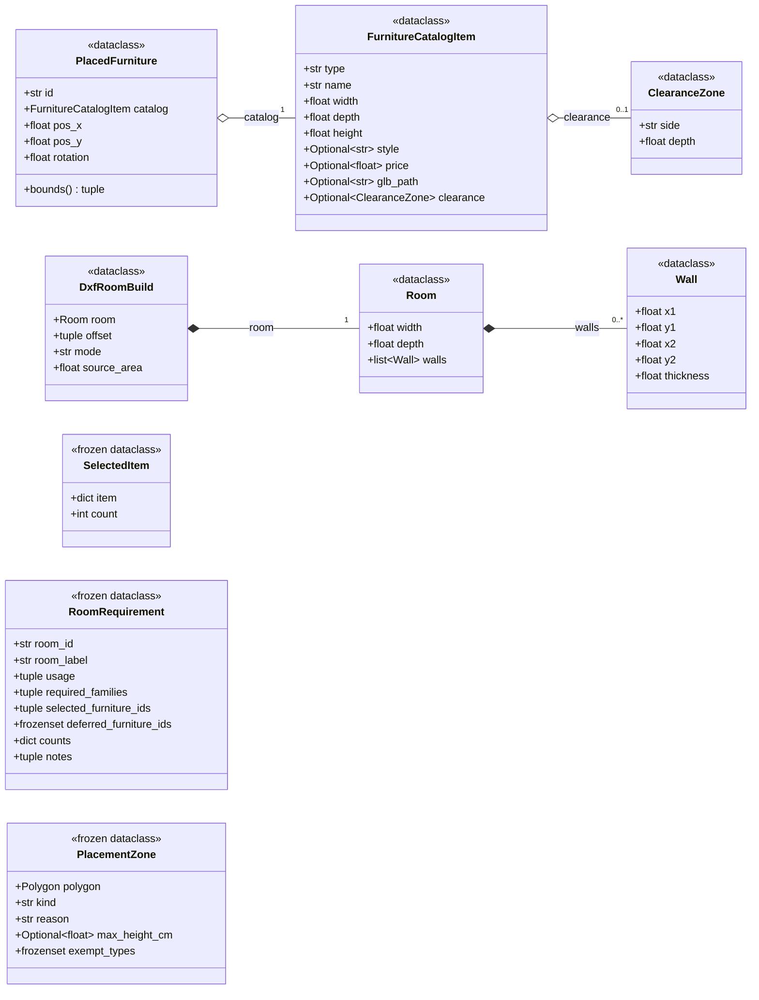
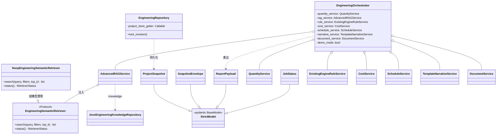
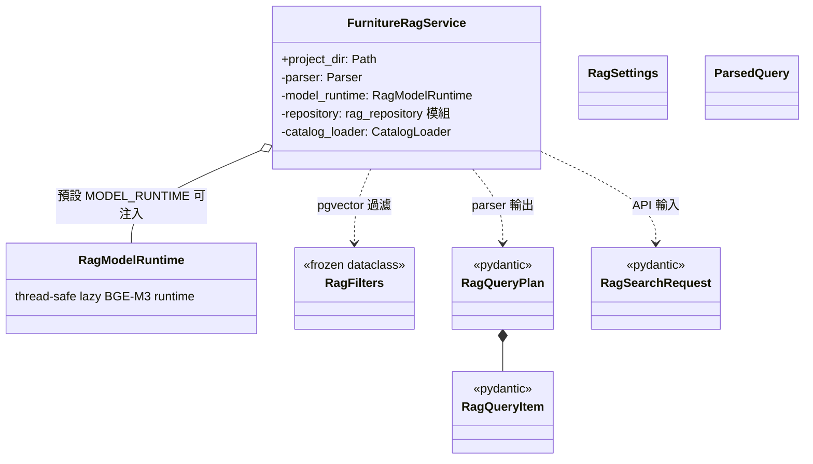
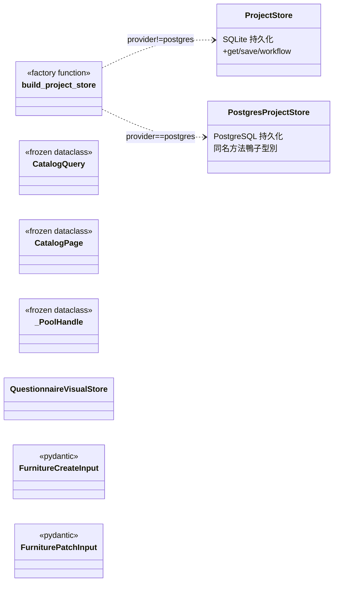

# 類別/元件關係文件 - RoomPilot-Agent

> 本文件由 VibeCoding v5.0 模板 04_design/class_relationships.md 導入 RoomPilot-Agent | 基準：分支 django-skill、commit a2179f7e、日期 2026-08-04

> **版本:** v1.0 | **更新:** 2026-08-04 | **狀態:** 草稿

**範圍與讀法**：本文件盤點 RoomPilot 現行工作樹的類別與模組關係。repo 現在同時存在兩種風格：

1. **舊核心（`backend/engine/`、`backend/agent/`、`backend/catalog/` 轉接層）**：類別只當資料結構（dataclass）與例外用，行為都在模組層函式；介面以 `Callable` 型別別名表達。
2. **新一代子系統（2026-07 底之後）**：`backend/server/engineering/`（工程文件 MVP）出現 Pydantic 模型層、服務類與 repo 第一個正式 `Protocol`；`backend/spatial_data/rag/`（家具 RAG runtime）與 `backend/catalog/` PostgreSQL repository 群、`backend/server/` 保存層（`ProjectStore`/`PostgresProjectStore`）都以類別承載狀態與連線。

**範圍界線（與 `../03_architecture/architecture_and_design.md` §L3-Y 同步）**：本文件只盤點 **Python 類別與模組**。架構文件 §1.1.2 的 9 個 Container 中，「瀏覽器八步前端」「frontend3d DXF 檢視器」（JS/JSX，無 Python 類別）、「檔案儲存 `.runtime/`」（檔案系統）、「批次匯入 CLI」（`scripts/` 匯入腳本無業務類別）四者**明示不在本文件範圍**；其餘五個 Container 的類別皆已收錄（FastAPI 應用伺服器、PostgreSQL repository 群、`ProjectStore`/`PostgresProjectStore`、`QuestionnaireVisualStore`、Node XLSX adapter 見「設計模式」轉接器列）。

因此本文件分層畫：先畫舊核心的 dataclass 與例外，再畫新子系統的服務/模型類別，最後以「模組」為節點畫依賴關係。所有類別、行號、數字均對 2026-08-04 工作樹逐檔查證；先行導入版（`docs/vibecoding/10_class_relationships_template.md`，2026-07-26）的數字已過期（如官方型錄件數、select.py 行號、路由數），本文一律以現行實查為準。

---

## 核心類別圖

### 1. engine / agent 資料結構（dataclass，單位一律公分）

出處（逐一查證，2026-08-04）：

| 類別 | 定義位置 | 備註 |
| :--- | :--- | :--- |
| `Wall` | `backend/engine/models.py:18` | `thickness` 有預設值（牆厚公分） |
| `Room` | `backend/engine/models.py:28` | `walls` 清單；原點在左下角、座標全正 |
| `ClearanceZone` | `backend/engine/models.py:36` | 家具某一面的開合淨空需求 |
| `FurnitureCatalogItem` | `backend/engine/models.py:48` | 型錄屬性，不含座標；`clearance=None` 表示無淨空需求 |
| `PlacedFurniture` | `backend/engine/models.py:62` | 唯一帶方法的 engine dataclass：`bounds()` |
| `DxfRoomBuild` | `backend/engine/dxf_room.py:77` | `build_room_from_dxf()`（`dxf_room.py:85`）的回傳結果 |
| `SelectedItem` | `backend/agent/select.py:51` | `frozen=True`；`item` 是型錄 dict |
| `RoomRequirement` | `backend/agent/select.py:57` | **新增**：逐房問卷收斂出的選件約束，「只描述需求，不含座標或幾何」（docstring）；`required_families` 是擺位族系而非型錄類型 |
| `PlacementZone` | `backend/server/scene_service.py:1071` | **新增**：`@dataclass(frozen=True)` 擺放禁區（門弧、窗前）；`max_height_cm=None` 任何高度都不准進，有值只擋高過它的家具（窗台高度規則）；另有 `kind`/`reason`/`exempt_types` 三欄 |

關係判讀依據：

- `Room *-- Wall`：組合，`Wall` 清單隨 `Room` 一起建立、生命週期綁定。
- `PlacedFurniture o-- FurnitureCatalogItem`：聚合，型錄物件可獨立於擺放結果存在（由 `catalog/style_db.catalog_item_from_scene_object()` 另行建立）。
- `FurnitureCatalogItem o-- ClearanceZone`：聚合，`CLEARANCE_BY_TYPE`（`backend/catalog/style_db.py:185`，現行只給 4 類：bookcase/sideboard 前方 40 cm、wardrobe/desk 前方 50 cm）是模組層共享實例，多件家具共用同一個 `ClearanceZone` 物件。
- `DxfRoomBuild *-- Room`：組合，`Room` 在 `build_room_from_dxf()` 內建立並隨結果回傳。

### 2. 例外類別階層（比先行導入版大幅擴張）

舊核心仍維持「業務邏輯零繼承、只有例外繼承內建例外」；新子系統則長出多層例外樹（RAG 四型錯誤、catalog admin 四型錯誤、保存層 busy 子類）。

```mermaid
classDiagram
    direction TB

    class ValueError { <<builtin>> }
    class RuntimeError { <<builtin>> }

    SelectionParseError --|> ValueError
    SelectionUnavailableError --|> RuntimeError
    WorkflowTooLargeError --|> ValueError
    QuestionnaireCatalogError --|> ValueError
    SurfaceMaterialProcessingError --|> ValueError

    ProjectVersionConflict --|> RuntimeError
    ProjectStoreUnavailable --|> RuntimeError
    ProjectStoreBusy --|> ProjectStoreUnavailable
    RuntimeCatalogUnavailable --|> RuntimeError
    CatalogPoolTimeout --|> RuntimeError
    RenderProviderUnavailable --|> RuntimeError
    RenderProviderRejected --|> RuntimeError

    CatalogAdminError --|> RuntimeError
    CatalogAdminNotFound --|> CatalogAdminError
    CatalogAdminConflict --|> CatalogAdminError
    CatalogAdminReferenceError --|> CatalogAdminError
    CatalogAdminActivationError --|> CatalogAdminError

    RagError --|> RuntimeError
    RagDisabledError --|> RagError
    RagDependencyError --|> RagError
    RagDatabaseError --|> RagError
    RagUpstreamError --|> RagError

    WorkbookGenerationUnavailable --|> RuntimeError
    LockedRevisionError --|> RuntimeError
    SnapshotSourceConflict --|> RuntimeError
```

出處：

| 例外 | 定義位置 | HTTP 對映（如有） |
| :--- | :--- | :--- |
| `SelectionParseError` / `SelectionUnavailableError` | `backend/agent/select.py:42,46` | 觸發選件降級鏈（`main.py` 選件端點） |
| `ProjectVersionConflict` / `WorkflowTooLargeError` / `ProjectStoreUnavailable` / `ProjectStoreBusy` | `backend/server/project_store.py:30,38,42,46` | `ProjectStoreUnavailable`→503（busy 時附 `Retry-After: 2`，`main.py:226-243`） |
| `RuntimeCatalogUnavailable` | `backend/catalog/runtime_catalog_repository.py:25` | →503，區分 catalog_pool_busy / runtime_catalog_unavailable（`main.py:246-266`） |
| `CatalogPoolTimeout` | `backend/catalog/postgres_repository.py:224` | 連線池取用逾時 |
| `CatalogAdminError` 家族 | `backend/catalog/postgres_admin_repository.py:37,51,55,59,63` | NotFound/Conflict/Reference/Activation 由 `catalog_admin.py` 端點轉 HTTP 錯誤 |
| `RagError` 家族 | `backend/spatial_data/rag/errors.py:4,8,12,16,20` | Disabled/Dependency/Database/Upstream 由 `rag_api.py:146` 轉服務錯誤 |
| `QuestionnaireCatalogError` | `backend/server/questionnaire_visuals.py:16` | 問卷視覺型錄讀取錯誤 |
| `RenderProviderUnavailable` / `RenderProviderRejected` | `backend/server/render_service.py:25,29` | 第 8 步生圖供應者失敗 |
| `SurfaceMaterialProcessingError` | `backend/catalog/surface_material_processing.py:31` | 表面材質影像處理 |
| `WorkbookGenerationUnavailable` | `backend/server/engineering/documents.py:15` | jobs 失敗 error_code=XLSX_ADAPTER_UNAVAILABLE（`engineering/api.py:216-268`） |
| `LockedRevisionError` / `SnapshotSourceConflict` | `backend/server/engineering/repository.py:18,22` | →409 LOCKED_REVISION_CANNOT_BE_OVERWRITTEN / SNAPSHOT_SOURCE_REVISION_STALE |

### 3. 工程文件 MVP（`backend/server/engineering/`，新子系統）

repo 內第一個「類別為主」的子系統：Pydantic 模型層（`models.py` 421 行、`StrictModel` 基底＋33 個子類）＋七個服務類＋orchestrator＋repository，並出現全 repo 第一個正式 `Protocol`。契約：`docs/contracts/ENGINEERING_DOCUMENT_MVP.md`。

出處：`StrictModel`（`models.py:20`）與 33 個子類（`PointCm:24` … `JobStatus:383`，含 `ProjectSnapshot:121`、`SnapshotEnvelope:157`、`ReportPayload:361`）；`EngineeringSemanticRetriever(Protocol)`（`advanced_rag.py:32`）、`NoopEngineeringSemanticRetriever`（`advanced_rag.py:40`，docstring 自述「Explicit Mock/Noop adapter; this is not vector retrieval」）、`AdvancedRAGService`（`advanced_rag.py:71`）；`QuantityService`（`quantity.py:25`）、`ExistingEngineRuleService`（`rules.py:70`）、`CostService`（`cost.py:13`）、`ScheduleService`（`schedule.py:21`）、`TemplateNarrativeService`（`narrative.py:14`）、`DocumentService`（`documents.py:19`）、`EngineeringOrchestrator`（`orchestrator.py:22`，八個具名 keyword-only 建構參數）、`EngineeringRepository`（`repository.py:28`，以 `project_store_getter` callable 注入保存層）、`JsonEngineeringKnowledgeRepository`（`knowledge.py:8`，指向 `backend/catalog/data/engineering/`，`api.py:52-54`）。

組裝點：`build_engineering_router(project_store_getter=lambda: PROJECT_STORE, project_dir=PROJECT_DIR)`（`main.py:218-223`）→ router prefix `/api/v1`（`engineering/api.py:50`）、orchestrator 組裝在 `api.py:57-75`（`build_orchestrator()`）；XLSX 產生走 Node adapter `workbook_builder.mjs`。

### 4. 家具 RAG runtime（`backend/spatial_data/rag/` + `backend/catalog/`，新子系統）

出處：`FurnitureRagService`（`service.py:40`，docstring「End-to-end LLM parser -> PostgreSQL pgvector -> Django reranker service」，`service.py:1`；建構子四個 keyword-only 注入點：`parser`/`model_runtime`/`repository`/`catalog_loader`，`service.py:41-49`；`project_dir` 為必填位置參數，不是注入點）；`CatalogLoader`/`ProgressReporter` 型別別名（`service.py:36-37`）；`RagModelRuntime`（`model_runtime.py:50`）；`RagSettings`（`settings.py:33`）；Pydantic 契約 `RagQueryItem:36`/`RagQueryPlan:54`/`RagSearchRequest:80`（`models.py`）；`ParsedQuery`（`openai_parser.py:15`）；`RagFilters`（`backend/catalog/rag_repository.py:16`，`@dataclass(frozen=True)`；`EMBEDDING_MODEL = "BAAI/bge-m3"`，`rag_repository.py:12`）。

跨套件依賴：`service.py:11-12` import `backend/catalog/rag_repository`（Kai-owned PostgreSQL adapter）與 `backend/catalog/postgres_repository.get_catalog_items_by_ids`（`postgres_repository.py:682`）——RAG runtime 是 Django owner、DB adapter 是 Kai owner，跨 owner 邊界以 import 明示。HTTP 曝露經 `backend/server/rag_api.py`（APIRouter，5 條路由：`GET /rag:136`、`GET /api/rag/status:141`、`POST /api/rag/search:146`、`POST /api/rag/search/jobs:155`（202）、`GET /api/rag/search/jobs/{job_id}:187`）。

### 5. 保存層與 PostgreSQL 型錄 repository（新）

出處：`ProjectStore`（`project_store.py:87`）、`PostgresProjectStore`（`postgres_project_store.py:33`）、工廠 `build_project_store()`（`project_store.py:614`，「explicitly configured project store without silent fallback」——兩個 store **沒有共同基底類別或 Protocol**，靠同名方法鴨子型別互換）；`CatalogQuery:150`/`CatalogPage:164`/`_PoolHandle:229`（`postgres_repository.py`，皆 frozen dataclass；模組 docstring 宣告「FastAPI 不得為了 filter/count/facet/paginate 而載入完整型錄」）；`QuestionnaireVisualStore`（`questionnaire_visuals.py:139`）；catalog admin 輸入模型 `_StrictModel:35`/`StyleAssignmentInput:39`/`AnnotationInput:48`/`FurnitureCreateInput:69`/`FurniturePatchInput:112`（`backend/server/catalog_admin.py`，router prefix `/api/admin/furniture`，`catalog_admin.py:29`）。

`postgres_admin_repository.py`（764 行）與 `runtime_catalog_repository.py`（431 行）除例外類別外**無業務類別**，走模組函式（交易式寫入、activation gate、樂觀併發；Phase 4 runtime catalogs strict 模式不靜默回退掃 JSON）。

### 6. 模組依賴圖（行為層；節點是模組不是類別）

```mermaid
classDiagram
    direction TB

    class agent_knowledge { <<module>> FAMILY_OF / COMPANION_OF / ROOM_AFFINITY }
    class agent_select { <<module>> parse_selections / request_selections / requirements_from_context }
    class agent_place { <<module>> resolve_placements / pick_smaller_model }
    class catalog_style_db { <<module>> sanitize_size_cm / catalog_item_from_scene_object }
    class catalog_cloud_catalog { <<module>> build_official_catalog / load_official_catalog }
    class catalog_placement_surface { <<module>> placement_surface_for / FLOOR / WALL }
    class catalog_postgres_repository { <<module>> CatalogQuery / get_catalog_items_by_ids }
    class catalog_rag_repository { <<module>> RagFilters / pgvector 查詢 }
    class engine_models { <<module>> Wall / Room / PlacedFurniture }
    class engine_geometry { <<module>> check_placement }
    class engine_clearance { <<module>> check_placement_with_clearance }
    class engine_placement { <<module>> place_furniture 系列 }
    class engine_dxf_room { <<module>> build_room_from_dxf }
    class spatial_rag_service { <<module>> FurnitureRagService }
    class server_scene_service { <<module>> generate_layout / build_scene_payload }
    class server_main { <<module>> FastAPI 46 條路由 + 3 個 router }
    class server_rag_api { <<module>> 5 條 /api/rag 路由 }
    class server_catalog_admin { <<module>> 4 條 /api/admin/furniture 路由 }
    class server_engineering_api { <<module>> 8 條 /api/v1 路由 }
    class server_project_store { <<module>> ProjectStore / build_project_store }
    class upgrade3d_dxf_parser { <<module>> parse_dxf_bytes }
    class floorplan_vision { <<module>> analyze_floorplan_image 等 4 函式 }

    agent_select ..> agent_knowledge
    agent_place ..> agent_knowledge
    engine_geometry ..> engine_models
    engine_clearance ..> engine_geometry
    engine_placement ..> engine_clearance
    engine_dxf_room ..> engine_models
    catalog_style_db ..> engine_models : 建立 FurnitureCatalogItem
    spatial_rag_service ..> catalog_rag_repository
    spatial_rag_service ..> catalog_postgres_repository
    server_scene_service ..> agent_place
    server_scene_service ..> catalog_style_db
    server_scene_service ..> catalog_placement_surface
    server_scene_service ..> engine_clearance
    server_scene_service ..> engine_dxf_room
    server_scene_service ..> engine_placement
    server_scene_service ..> upgrade3d_dxf_parser
    server_rag_api ..> spatial_rag_service
    server_engineering_api ..> server_project_store : project_store_getter 注入
    server_main ..> agent_place
    server_main ..> agent_select
    server_main ..> catalog_style_db
    server_main ..> catalog_cloud_catalog
    server_main ..> catalog_placement_surface
    server_main ..> floorplan_vision
    server_main ..> upgrade3d_dxf_parser
    server_main ..> server_scene_service
    server_main ..> server_rag_api : include_router
    server_main ..> server_catalog_admin : include_router
    server_main ..> server_engineering_api : include_router
    server_main ..> server_project_store
```

依賴邊全部取自各檔案 import 陳述（`scene_service.py:16-29`、`main.py` import 區、`rag_api.py:13-20`、`service.py:11-12`），逐條核對過。全站 HTTP 路由 63 條 = main.py 46 + rag_api.py 5 + catalog_admin.py 4 + engineering/api.py 8；服務 port 由啟動指令決定，README 基準 8002。

三個關鍵的「刻意不依賴」（現行仍成立）：

1. **`agent` 套件不 import `engine`**：引擎重擺透過呼叫端注入的 `engine_place_fn` 進行（`place.py:16` 型別別名、`place.py:130` 參數；正式流程注入 `scene_service` 的 `replace_and_place` 閉包，`scene_service.py:2309`，呼叫點 `scene_service.py:2319-2325`）。
2. **`engine/dxf_room.py` 不 import ezdxf/shapely**：engine 內 shapely 只有 `geometry.py`/`clearance.py` 使用。
3. **`agent_select` 的 LLM 呼叫器是注入的 `Complete` callable**（`select.py:31`），agent 層零網路依賴。

新增一條同型紀律：**`backend/spatial_data/rag/` 不自己開 DB 連線**——pgvector 存取全部經 Kai 的 `catalog/rag_repository` 與 `catalog/postgres_repository`，且 `FurnitureRagService` 建構子允許整組替換（測試注入假 repository）。

---

## 類別職責

### 類別（dataclass / Pydantic / 服務類）

| 類別/元件 | 核心職責 | 協作者 | 所屬層 |
| :--- | :--- | :--- | :--- |
| `Wall` / `Room` / `ClearanceZone` / `FurnitureCatalogItem` / `PlacedFurniture` | 幾何裁決的資料結構（公分制） | engine 運算模組 | Domain（engine） |
| `DxfRoomBuild` | DXF 解析結果轉 Room 的完整轉換結果（公尺→公分） | Room | Domain（engine） |
| `SelectedItem` | 驗證通過的一筆選件（型錄 dict＋數量），frozen | `parse_selections` | Application（agent） |
| `RoomRequirement` | 逐房問卷收斂的選件約束（族系、指定家具、數量），不含幾何 | `requirements_from_context` / `preselected_from_requirements` | Application（agent） |
| `PlacementZone` | 門弧/窗前擺放禁區＋容許高度（窗台規則） | scene_service 擺位與拖曳驗證 | Application（server） |
| `StrictModel` 及 33 個子類 | 工程文件 MVP 全部資料契約（snapshot/quantity/retrieval/risk/estimate/schedule/report/job） | 工程服務類、`docs/contracts/*.schema.json` | Application（engineering） |
| `EngineeringOrchestrator` | 串工程文件產生管線：quantity→RAG→rules→cost→schedule→narrative→documents | 七個注入的服務類 | Application（engineering） |
| `EngineeringRepository` | snapshot/lock/package 持久化，經 `project_store_getter` 借用主保存層 | ProjectStore/PostgresProjectStore | Infrastructure（engineering） |
| `AdvancedRAGService` + `EngineeringSemanticRetriever`(Protocol) + `NoopEngineeringSemanticRetriever` | 工項語意檢索；Protocol 定義 search/status，Noop 為顯式假實作 | `JsonEngineeringKnowledgeRepository` | Application（engineering） |
| `FurnitureRagService` | 家具 RAG 端到端：LLM parser → pgvector → reranker；就緒守門（模型快取、embeddings 表非空） | `RagModelRuntime`、catalog repository 模組 | Application（spatial_data/rag） |
| `RagModelRuntime` | thread-safe lazy offline-only BGE-M3 embed/rerank runtime | FurnitureRagService | Infrastructure（spatial_data/rag） |
| `ProjectStore` / `PostgresProjectStore` | 專案與八步 workflow 持久化（SQLite / PostgreSQL，鴨子型別互換） | `build_project_store` 工廠 | Infrastructure（server） |
| `CatalogQuery` / `CatalogPage` | PostgreSQL 型錄查詢參數與分頁結果（frozen dataclass） | postgres_repository 模組函式 | Infrastructure（catalog） |
| `QuestionnaireVisualStore` | 第 5 步問卷視覺素材型錄 | main.py 問卷端點 | Application（server） |
| `FurnitureCreateInput` / `FurniturePatchInput` 等 | 型錄管理 CRUD 的輸入驗證模型 | postgres_admin_repository | Presentation（server） |

### 行為模組（無類別，函式即介面；行號現行實查）

| 模組 | 核心職責 | 關鍵知識/常數（實數） |
| :--- | :--- | :--- |
| `agent/knowledge.py`（132 行） | 選件與擺位共用的宣告式知識；`family_of:34`、`prompt_rules:115` | `FAMILY_OF`、`COMPANION_OF`、`ROOM_AFFINITY`、`ANCHOR_FAMILIES`、`GROUP_OF`、`FAMILY_ZH` |
| `agent/select.py`（617 行） | LLM 選件邊界：白名單驗證、數量夾限、族系唯一、必要主件；問卷需求鏈 `requirements_from_context:215` → `preselected_from_requirements:277`；本地規則 `local_selection_raw:308` | `MAX_ITEMS_PER_ROOM=8`（:32）、`COUNT_MAX=6`（:33）、`REQUIRED_FAMILIES_BY_ROOM`（:34） |
| `agent/place.py`（285 行） | 擺位失敗修復迴圈；「主件先行、副件成組、放不下寧缺勿亂」，絕不計算座標 | `resolve_placements:130`（`max_rounds=3`）、`pick_smaller_model:76` |
| `catalog/style_db.py`（208 行） | 型錄 dict → 引擎 `FurnitureCatalogItem` 轉接；尺寸修補 | `_SIZE_RULES`（:23）、`sanitize_size_cm:119`、`CLEARANCE_BY_TYPE`（:185，4 類）、`catalog_item_from_scene_object:193` |
| `catalog/cloud_catalog.py`（270 行） | 官方型錄建立與強制驗證（數量/ID 唯一/上傳狀態/HTTPS） | `OFFICIAL_CATALOG_COUNT = 8_557`（:15；**先行導入版寫 9,350 已過期**）、`build_official_catalog:87`、`load_official_catalog:247` |
| `catalog/placement_surface.py`（114 行） | 擺放面分類 floor/tabletop/wall/floor_covering，「只做分類，不做任何幾何決策」 | `placement_surface_for`、`FLOOR`/`WALL`/`FLOOR_COVERING` |
| `engine/geometry.py`（76 行） | Shapely 碰撞：出界/穿牆/重疊 | `check_placement:67`，回 `None`=合法否則繁中原因 |
| `engine/clearance.py`（113 行） | 淨空區運算與衝突總入口 | `clearance_polygon:29`、`clearance_conflict:56`、`check_placement_with_clearance:89` |
| `engine/placement.py`（135 行） | 自動擺放與覆蓋物/貼鄰/批次 | `place_furniture:10`、`place_overlay_on_furniture:50`、`place_adjacent_to_furniture:72`、`place_furniture_batch:115` |
| `engine/adjustment.py`（91 行） | 結構化 move/rotate 指令 | `move_furniture:11`、`rotate_furniture:54`、`adjust_furniture:72`；正式伺服器流程仍無呼叫點（grep `backend/server/` 無命中） |
| `engine/dxf_room.py`（127 行） | 公尺→公分的唯一單位邊界 | `DEFAULT_WALL_SEG_THICKNESS=6.0`（:36）、`build_room_from_dxf:85`、`room_from_dxf:124` |
| `engine/schema.py`（99 行） | 序列化與 LLM tool 定義 v0.1 | `placed_to_dict:18`、`catalog_from_dict:35`、`placed_from_dict:47`；`backend/server/` 無引用（grep 實查） |
| `catalog/postgres_repository.py`（891 行） | PostgreSQL 唯讀 repository（filter/count/facet/paginate 下推 DB） | `get_catalog_items_by_ids:682` |
| `catalog/postgres_admin_repository.py`（764 行） | 交易式管理寫入：參照驗證、activation gate、樂觀併發、audit | 由 `server/catalog_admin.py:13` 消費 |
| `catalog/runtime_catalog_repository.py`（431 行） | Phase 4 SQL runtime catalogs（styles/surfaces/costs/quarantine） | 消費端 `cost_estimation.py:9`、`style_cards.py:6`、`main.py:111` |
| `server/render_providers.py` | 第 8 步內建生圖供應者：prompt 組裝（`build_render_prompt:207`）、家具身分鎖定（`locked_furniture:123`）、OpenRouter 同步生成回圖入庫；無類別 | `direct_image_provider_available:51` / `direct_image_provider_status:60` |
| `server/cost_estimation.py` | 造價估算（runtime cost catalog 驅動） | `load_default_cost_catalog:17`、`estimate_project_cost:35` |
| `server/style_cards.py` | 台灣風格色卡讀取 | `load_taiwan_style_cards:13`、`find_taiwan_style_card:21` |

---

## 關係說明

| 關係類型 | UML 符號 | 本 repo 實例 |
| :--- | :--- | :--- |
| 繼承 | `--\|>` | 例外樹（見第 2 節，5 個家族）；Pydantic 模型繼承 `StrictModel`/`BaseModel`（engineering 33 個、catalog_admin 4 個、rag 3 個）。舊核心業務類別仍零繼承 |
| 實現 | `..\|>` | **現行有一例**：`NoopEngineeringSemanticRetriever` 結構型實現 `EngineeringSemanticRetriever(Protocol)`（`advanced_rag.py:32,40`）。先行導入版「無 ABC/Protocol」的敘述已過期 |
| 組合 | `*--` | `Room *-- Wall`、`DxfRoomBuild *-- Room`、`RagQueryPlan *-- RagQueryItem` |
| 聚合 | `o--` | `PlacedFurniture o-- FurnitureCatalogItem`、`FurnitureCatalogItem o-- ClearanceZone`（共享實例）、`EngineeringOrchestrator o-- 七個服務`（建構注入、生命週期獨立） |
| 依賴 | `..>` | 模組依賴圖全部邊（取自 import）；`EngineeringRepository ..> ProjectStore`（經 getter callable，非直接 import 實例） |

跨層資料流（擺位閉環，行號現行實查）：

1. `scene_service.generate_layout()`（`scene_service.py:1746`）以 `catalog_item_from_scene_object()` 把場景 dict 轉引擎型錄物件，逐件用 `check_placement_with_clearance` 驗證；`PlacementZone`（:1071）承載門弧/窗前禁區，拖曳驗證與自動擺放共用同一份。
2. 有 `placement_failed` 時，`scene_service.py:2319` 呼叫 agent 的 `resolve_placements()`，傳入 `replace_and_place` 閉包（:2309，內部重呼 `generate_layout`）作為 `engine_place_fn`——「agent 決策、引擎重算座標」，座標永遠只由引擎產生。
3. 座標契約：前端 position 為房間中心原點，引擎為角落原點；`_scene_object_to_placed()`（`scene_service.py:1475`）負責平移與旋轉方向換算。
4. 工程文件閉環（新）：`PUT snapshot`（設計師鎖定的 `ProjectSnapshot`）→ `POST lock` → `POST engineering-packages`（檢查 `approval_status == "designer_confirmed"`，否則 409 REVISION_NOT_LOCKED）→ BackgroundTasks 執行 → `JobStatus` 輪詢 → `ReportPayload`/檔案下載（下載端點以 `path.is_relative_to(root)` 防護，`engineering/api.py:295-303`）。

---

## 設計模式

| 模式 | 應用場景 | 目的 |
| :--- | :--- | :--- |
| 依賴注入 | `Complete` 注入 `request_selections()`（`select.py:31,585`）；`engine_place_fn` 注入 `resolve_placements()`（`place.py:16,130`）；`FurnitureRagService` 建構子四個注入點（`service.py:41-49`）；`EngineeringOrchestrator` 八參數建構（`orchestrator.py:22`）；`EngineeringRepository(project_store_getter)`（`repository.py:31`）；router 工廠 `build_engineering_router(project_store_getter=lambda: PROJECT_STORE)`（`main.py:218-223`） | 領域層不碰網路/DB；測試可整組替換 |
| 工廠 | `build_project_store()`（`project_store.py:614`）依 provider 回 SQLite 或 PostgreSQL store，「不靜默 fallback」 | 保存後端切換集中一點，啟動即失敗優於執行期驚喜 |
| 轉接器（Adapter） | `catalog_item_from_scene_object()`（`style_db.py:193`）、`build_room_from_dxf()`（`dxf_room.py:85`）、`_scene_object_to_placed()`（`scene_service.py:1475`）、RAG 的 `openai_parser`/`anthropic_parser` 兩家 Structured Outputs adapter、engineering 的 Node `workbook_builder.mjs` XLSX adapter | 在單一邊界解決資料形狀、單位（公尺↔公分）、座標系與供應商差異 |
| 外觀（Facade） | `check_placement()`（`geometry.py:67`）、`check_placement_with_clearance()`（`clearance.py:89`）、`EngineeringOrchestrator`（收攏七段工程管線） | 呼叫端只面對一個入口與一致回傳約定 |
| 空物件（Null Object） | `NoopEngineeringSemanticRetriever`（`advanced_rag.py:40`） | 語意檢索缺席時管線照走，health 端點如實回報 retriever 狀態 |
| 降級鏈 | `POST /api/agent/furniture/select`（`main.py:2948`）：LLM 選擇驗證 → 本地規則（`local_selection_raw:308`）→ 未驗證候選；失敗以 `SelectionParseError`/`SelectionUnavailableError` 明確傳遞 | LLM 失敗不擋主流程，不靜默 |
| Repository | `postgres_repository`/`postgres_admin_repository`/`runtime_catalog_repository`（模組函式形態）、`EngineeringRepository`/`JsonEngineeringKnowledgeRepository`（類別形態） | 資料存取與業務規則分離；查詢/分頁下推 DB |
| 單一事實來源（宣告式知識表） | `knowledge.py` 的 FAMILY_OF/COMPANION_OF/ROOM_AFFINITY 同時餵 select 與 place；`placement_surface.py` 收斂擺放面分類（commit ffd38968「不再維護第二份型別名單」） | 規則不會各養一份表而互相漂移 |

---

## SOLID 原則檢核

- [x] **S** 單一職責：engine 七模組、agent 三模組分工同先行版；新子系統延續此紀律——engineering 每個服務類一段管線（quantity/rag/rules/cost/schedule/narrative/documents 各一檔）、rag 套件 parser/vocab/ranking/model_runtime/settings/errors 各一檔。
- [x] **O** 開放封閉：擴充靠改宣告表不改邏輯（`FAMILY_OF`、`_SIZE_RULES`、`CLEARANCE_BY_TYPE`）；engineering 的 retriever 可換實作不改 `AdvancedRAGService`（Protocol 注入）。`resolve_placements` 的修復策略仍寫死三種 action。
- [x] **L** 里氏替換：可檢核處為例外家族（`CatalogAdminError` 四子類、`RagError` 四子類、`ProjectStoreBusy`）——皆只加語意不改父類行為，端點以父類 handler 統一接（`main.py:226-266`）。`ProjectStore`/`PostgresProjectStore` 無共同父類，屬鴨子型別互換，不在 LSP 範圍。
- [x] **I** 介面隔離：事實上的介面都很小——`Complete` 一個 callable、`EnginePlaceFn` 一個 callable、`EngineeringSemanticRetriever` 只有 `search`/`status` 兩方法、引擎檢查函式統一 `str | None` 回傳。
- [ ] **D** 依賴反轉：分佈不均——agent 層與 engineering 層完全依賴抽象（注入 callable/Protocol）；但 `server/scene_service.py` 直接 import engine 具體函式（`scene_service.py:16-29`）、`spatial_data/rag/service.py` 直接 import catalog 具體模組（`service.py:11-12`，雖可經建構子替換）。server→engine 之間沒有抽象層；是否需要屬設計裁決，本文件僅記錄現狀。

---

## 介面契約

repo 內正式介面只有一個 `Protocol`；其餘是「事實上的介面」：型別別名、注入點與回傳約定。

### Complete（LLM 呼叫器，`backend/agent/select.py:31`）

型別：`Callable[[list[dict[str, str]]], Optional[tuple[str, dict[str, Any]]]]`

| 方法 | 前置條件 | 後置條件 |
| :--- | :--- | :--- |
| `complete(messages)` | messages 為 chat 格式（role/content） | 成功回 `(model_id, 解析後 JSON dict)`；未啟用或失敗回 `None`（由 `request_selections` 轉拋 `SelectionUnavailableError`） |

### EnginePlaceFn（擺位引擎注入點，`backend/agent/place.py:16`）

型別：`Callable[[list[dict[str, Any]]], list[dict[str, Any]]]`

| 方法 | 前置條件 | 後置條件 |
| :--- | :--- | :--- |
| `engine_place_fn(working_items)` | working_items 為型錄 dict 清單（公分尺寸） | 回傳含座標與 `placement_failed` 標記的場景物件清單；正式流程注入 `scene_service.replace_and_place` 閉包（`scene_service.py:2309`） |

### EngineeringSemanticRetriever（`backend/server/engineering/advanced_rag.py:32`，全 repo 唯一正式 Protocol）

| 方法 | 前置條件 | 後置條件 |
| :--- | :--- | :--- |
| `search(query, filters, top_k=10)` | filters 為 dict | 回工項候選清單（Noop 實作回空/固定內容） |
| `status()` | - | 回 `RetrieverStatus`（`models.py:245`），health 端點如實轉發 |

### 引擎檢查函式（`backend/engine/`）

| 方法 | 前置條件 | 後置條件 |
| :--- | :--- | :--- |
| `check_placement(item, room, others)`（`geometry.py:67`） | 皆為 engine dataclass，單位公分 | `None`=合法；否則繁中原因字串 |
| `check_placement_with_clearance(item, room, others)`（`clearance.py:89`） | 同上 | 本體＋淨空＋反向淨空全過才回 `None` |
| `place_furniture(room, catalog_item, item_id, existing)`（`placement.py:10`） | catalog_item 尺寸為公分 | 回 `{"success", "placed", "reason"}` dict |
| `build_room_from_dxf(parsed, mode, wall_seg_thickness)`（`dxf_room.py:85`） | parsed 含公尺制 `wall_polys`/`bbox` | 回公分制 `DxfRoomBuild`；無封閉房間自動退 plan 模式 |

### Agent 選件與修復（`backend/agent/`）

| 方法 | 前置條件 | 後置條件 |
| :--- | :--- | :--- |
| `requirements_from_context(context)`（`select.py:215`） | context 為問卷 payload（可 None） | 回 `dict[str, RoomRequirement]`；問卷勾選轉擺位族系需求 |
| `parse_selections(raw, rooms, offers, preselected, requirements)`（`select.py:439`） | raw 為 LLM 輸出 dict | 強制白名單/數量 1..6/每房 8 種/族系唯一/房型適配；必要主件缺席拋 `SelectionParseError` |
| `request_selections(...)`（`select.py:585`） | offers 為各房候選白名單 | complete 缺席/失敗拋 `SelectionUnavailableError`；成功回驗證後選件與 model_id |
| `resolve_placements(objects, items, pool, *, engine_place_fn, protected_ids, max_rounds=3)`（`place.py:130`） | objects 含 `placement_failed` 標記 | 回 `(engine_objects, final_items, report)`；action 只會是 `replace`/`remove`/`escalate`；保護件只 escalate |

### 保存層鴨子介面（`build_project_store`，`project_store.py:614`）

| 約定 | 內容 |
| :--- | :--- |
| 互換條件 | `ProjectStore`（SQLite）與 `PostgresProjectStore` 提供同名方法；provider 設定決定實作，「without silent fallback」 |
| 失敗語意 | 不可用拋 `ProjectStoreUnavailable`（busy 子類附 Retry-After）；版本衝突拋 `ProjectVersionConflict`；workflow 過大拋 `WorkflowTooLargeError` |
| 借用者 | `EngineeringRepository` 經 `project_store_getter` callable 共用同一持久層（`repository.py:31`） |

### 型錄載入（`backend/catalog/cloud_catalog.py`）

| 方法 | 前置條件 | 後置條件 |
| :--- | :--- | :--- |
| `build_official_catalog(...)`（`cloud_catalog.py:87`） | items 恰 `OFFICIAL_CATALOG_COUNT = 8_557`（:15）、ID 唯一、與 manifest 一致、upload_status 白名單、HTTPS URL | 違反任一條件 raise `ValueError`；舊型錄只 enrichment 不新增家具 |

### RAG 檢索（`backend/spatial_data/rag/service.py`）

| 方法 | 前置條件 | 後置條件 |
| :--- | :--- | :--- |
| `FurnitureRagService` 檢索 | `RagSearchRequest`（`models.py:80`）合法；就緒守門通過（模型快取存在、pgvector embeddings 表非空，`service.py:82-90`） | 失敗以 `RagError` 子類分型（Disabled/Dependency/Database/Upstream），由 `rag_api.py` 轉服務錯誤；非同步走 202 job（active 上限 `RAG_JOB_MAX_ACTIVE`，超過 429） |

---

## 附註：已知落差與待辦

- `engine/schema.py` 的 tool 定義仍為 v0.1 草案、`backend/server/` 無引用；`engine/adjustment.py` 正式伺服器流程仍無呼叫點（兩者 grep 現行樹再確認）。F6 拖曳驗證走 `scene_service` 直呼 `check_placement_with_clearance` 並共用 `PlacementZone` 禁區（commit 6e9ace0c「門弧淨空與窗種分流，拖曳驗證改用同一份禁區」的收斂結果）。
- 先行導入版三個已過期數字，本版已更正：官方型錄 9,350 → **`OFFICIAL_CATALOG_COUNT = 8_557`**（8,557 的載入來源檔是 `JSON/furniture/furniture_official_catagory.json`，count=8557 實測，與 `docs/TEAM_AI_OWNERSHIP.md:57` 一致；同名不同檔的 `backend/catalog/data/furniture_catalog_cloud_9350.json` count=9350 是另一份舊 fallback 來源，非 8,557 的前身）；路由 44 → **63 條**；`select.py` 例外行號 34/38 → **42/46**。
- `ProjectStore`/`PostgresProjectStore` 缺共同 Protocol，介面一致性目前靠測試與人工紀律維持；若再增加第三種 provider，建議補 Protocol（待設計裁決）。
- `.claude/skills/` 的 `roompilot-proposal` 與 `roompilot-budget` 兩支 skill 以 `ReportPayload`（`engineering/models.py:361`、`docs/contracts/report_payload.schema.json`）為輸入契約產出對外文件——修改 `ReportPayload` 欄位時，除 `engineering/` 測試外也會影響這兩支 skill 的取數腳本。
- 測試面：`tests/` 共 99 支 `test_*.py`（含 agent/engine/engineering/rag/postgres 各群組）；2026-08-04 實跑 `pytest -q tests` = 811 passed / 1 failed / 9 skipped（共 821），唯一紅燈為 `tests/test_scene_v2_contract.py` 的 cache-busting 雜湊守約。
- 模板原指向的 `software_development_documentation_guide_zh_tw.docx` 與 `docs/document-system/` 於本 repo 不存在（(未查證：來源不在 repo)）。
