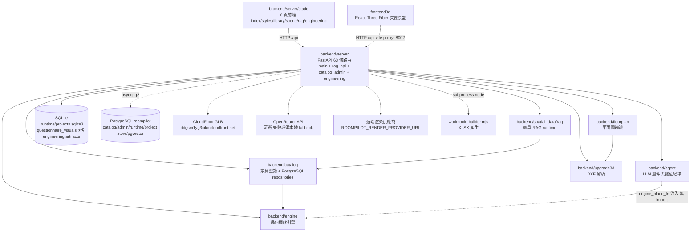

# 模組依賴關係分析 - RoomPilot-Agent

> 本文件由 VibeCoding v5.0 模板 04_design/file_dependencies.md 導入 RoomPilot-Agent | 基準：分支 django-skill、commit a2179f7e、日期 2026-08-04

> **版本:** v1.0 | **更新:** 2026-08-04 | **狀態:** 草稿

本文件所有 import 邊、行號與行數皆於基準工作樹以 grep／wc 實查；先行素材 `docs/vibecoding/09_file_dependencies_template.md`（2026-07-26，44 條路由年代）的事實已全數重查，不沿用。

---

## 依賴原則

| 原則 | 要點 | RoomPilot 實況（grep 逐檔查證） |
| :--- | :--- | :--- |
| **依賴倒置 (DIP)** | 高層依賴抽象，不依賴低層實現 | `backend/agent` 不 import `backend/engine`；座標重算以 `engine_place_fn` callable 由呼叫端注入（`backend/agent/place.py:135` 參數、`place.py:283` 呼叫；注入點 `backend/server/scene_service.py:2323` 的 `engine_place_fn=replace_and_place`）。`place.py:5` docstring 明言「每次重擺都必須經由呼叫端注入的 engine_place_fn」 |
| **無循環依賴 (ADP)** | 依賴關係形成 DAG，禁止雙向 import | 現況為 DAG，**未發現模組級循環**（全 backend 跨模組 import 逐條列於下方邊清單）。唯一的潛在環——`backend/server/engineering/export_contracts.py:38` import `backend.server.main`——是函式內延遲 import（`_engineering_openapi` 內），與 `main.py:67 → engineering.api` 不構成模組載入循環 |
| **穩定依賴 (SDP)** | 依賴方向朝向更穩定的模組 | 依賴匯聚於葉模組：`backend/engine/models.py`（純 dataclass，engine 內 6 檔與 `backend/catalog/style_db.py:10` 都指向它）、`backend/upgrade3d/dxf_parser.py`（server 與 floorplan.vision 都指向它）、`backend/agent/knowledge.py`（agent 內 `place.py:13`、`select.py:17` 指向它） |

---

## 架構分層依賴圖

實線＝實際 Python import（檔名:行號見「模組間 import 邊清單」）；虛線＝HTTP 或外部服務／資料庫呼叫。

**規則（現況歸納，非事後設計）：**

1. `backend/server` 是唯一組合根：單向 import 其餘六個 backend 模組（agent、engine、catalog、floorplan、upgrade3d、spatial_data.rag）；反方向除 `spatial_data.rag → catalog` 外零跨模組 import，且無任何領域模組 import `backend.server`（`grep -rnE "^\s*(from|import)\s+backend[.\s]" backend/` 於 `backend/` 樹僅命中 engine 內部與 `backend/server/engineering/` 兩檔；`tests/` 以絕對路徑 import `backend.*` 屬測試入口，不列入模組依賴）。
2. `backend/catalog → backend/engine` 只取 dataclass（`style_db.py:10` import `ClearanceZone`、`FurnitureCatalogItem`），不呼叫引擎演算法。
3. `backend/spatial_data/rag → backend/catalog` 是本輪新增的跨模組邊（`rag/service.py:11-12` import `rag_repository` 與 `postgres_repository.get_catalog_items_by_ids`）：RAG runtime 的向量與型錄讀取全部走 Kai 的 PostgreSQL adapter，自己不開連線。
4. `backend/floorplan → backend/upgrade3d` 只有一條邊（`vision/confirmation.py:11` import `parse_dxf_bytes`，確認後 DXF round-trip 驗證）。
5. `backend/agent`、`backend/engine`、`backend/upgrade3d` 互相之間、對其他 backend 模組均零 import，是依賴圖的葉層（agent 內部只 import `.knowledge`）。
6. 路由已部分拆出 APIRouter：`main.py:65-67` import、`main.py:216-223` include `catalog_admin`（prefix `/api/admin/furniture`，`catalog_admin.py:29`）、`rag_api`（無 prefix，`rag_api.py:26`）、`engineering.api`（prefix `/api/v1`，`engineering/api.py:50`）三支 router；有路由裝飾器的檔案僅此四檔（main 46 + rag_api 5 + catalog_admin 4 + engineering/api 8 ＝ 63 條）。
7. 前端零 Python import：`backend/server/static/` 六頁與 `frontend3d/` 純靠 HTTP `/api`（frontend3d vite proxy 至 `http://localhost:8002`，`frontend3d/vite.config.js:8`）。主前端 Three.js 自 `/static/vendor/three/` 載入，無 CDN 依賴（scene.html grep unpkg/cdn 零命中）。
8. **批次匯入 CLI（獨立 process，不在伺服器執行期依賴圖內）**：`scripts/sql/import_official_catalog_to_postgres.py`、`import_furniture_embeddings_to_postgres.py`、`scripts/runtime_catalog/import_runtime_catalogs_to_postgres.py` 手動執行、直連 PostgreSQL，對 `backend/` 零 import（grep 實證）；唯一例外是 `scripts/project_store/migrate_sqlite_projects_to_postgres.py:28` import `backend.server.project_store.MAX_WORKFLOW_BYTES`（借用同一份 workflow 大小上限常數，單向、僅遷移期）。因此這些 CLI 與 FastAPI process 之間只有「共用同一個 PostgreSQL / SQLite 資料庫」的耦合，不構成模組級依賴邊。

### 模組間 import 邊清單（grep 實證，2026-08-04）

| 來源檔:行號 | 目標模組 | 匯入符號 |
| :--- | :--- | :--- |
| `backend/server/main.py:23-24` | `backend.agent`（place、select） | `resolve_placements`、`SelectionParseError` 等選件介面 |
| `backend/server/main.py:37-39` | `backend.catalog`（placement_surface、style_db、cloud_catalog） | `FLOOR`、`placement_surface_for`、`sanitize_size_cm`、`load_official_catalog` |
| `backend/server/main.py:40,45` | `backend.floorplan.vision`（含 `.ocr`） | `analyze_floorplan_image` 等辨識介面、`default_ocr_provider` |
| `backend/server/main.py:46` | `backend.upgrade3d.dxf_parser` | `list_plans`、`parse_dxf_bytes`、`parse_dxf_file` |
| `backend/server/main.py:99,111` | `backend.catalog`（postgres_repository、runtime_catalog_repository） | PostgreSQL 讀取與 runtime catalog 介面 |
| `backend/server/scene_service.py:16-18` | `backend.agent.place`、`backend.catalog`（placement_surface、style_db） | `resolve_placements`、`FLOOR_COVERING`、`WALL`、`catalog_item_from_scene_object` |
| `backend/server/scene_service.py:19-23` | `backend.engine`（clearance、dxf_room、geometry、models、placement） | `check_placement_with_clearance`、`build_room_from_dxf`、`furniture_polygon`、`PlacedFurniture`、`Room`、`Wall`、`place_furniture` 等 |
| `backend/server/scene_service.py:28` | `backend.upgrade3d.dxf_parser` | `parse_dxf_bytes` |
| `backend/server/rag_api.py:13,19,20` | `backend.spatial_data.rag`（errors、models、service） | `RagSearchRequest`、`FurnitureRagService`、typed errors |
| `backend/server/catalog_admin.py:13` | `backend.catalog.postgres_admin_repository` | 管理 CRUD 交易介面 |
| `backend/server/cost_estimation.py:9` | `backend.catalog.runtime_catalog_repository` | `load_runtime_cost_catalog` |
| `backend/server/style_cards.py:6` | `backend.catalog.runtime_catalog_repository` | `load_runtime_style_cards` |
| `backend/server/postgres_catalog.py:7` | `backend.catalog.postgres_repository` | PostgreSQL 讀取介面 |
| `backend/catalog/style_db.py:10` | `backend.engine.models` | `ClearanceZone`、`FurnitureCatalogItem` |
| `backend/floorplan/vision/confirmation.py:11` | `backend.upgrade3d.dxf_parser` | `parse_dxf_bytes` |
| `backend/spatial_data/rag/service.py:11-12` | `backend.catalog`（rag_repository、postgres_repository） | `rag_repository`（pgvector adapter）、`get_catalog_items_by_ids` |

server 套件內部（非跨模組，但屬關鍵佈線）：

- `backend/server/engineering/rules.py:9` → `backend.server.scene_service` 的 `validate_single_placement`（工程規則沿用場景合法性檢查，不另寫第二套幾何）。
- `backend/server/engineering/export_contracts.py:38` → `backend.server.main`（函式內延遲 import，供 `tests/test_engineering_contract_exports.py` 匯出 OpenAPI 契約）。
- `backend/server/engineering/api.py:12-37` 只 import engineering 套件內部（advanced_rag、cost、documents、knowledge、models、narrative、orchestrator、quantity、repository、rules、schedule）。
- `backend/catalog` 內部：`rag_repository.py:9` 與 `runtime_catalog_repository.py:15` 都指向 `postgres_repository`（連線池單一入口）。

---

## 層級職責

| 層級 | 職責 | 程式碼路徑（行數 wc -l 實測） |
| :--- | :--- | :--- |
| 介面層 | HTTP 路由 63 條分四檔：main.py 46 條（3,695 行）、`rag_api.py` 5 條（197 行）、`catalog_admin.py` 4 條（316 行）、`engineering/api.py` 8 條；靜態掛載 `/static`、`/docs-assets`（main.py:285-286）；例外處理器 `ProjectStoreUnavailable`／`RuntimeCatalogUnavailable` → 503（main.py:226-266） | `backend/server/main.py`、`rag_api.py`、`catalog_admin.py`、`engineering/api.py` |
| 應用層 | 場景生成編排（選件→擺位→失敗修復，`scene_service.py` 2,445 行）、引導式 intake（171 行）、成本概算（109 行）、遠端渲染代理（`render_service.py` 158 行＋`render_providers.py` 444 行）、風格色卡（27 行）、工程文件編排（`engineering/orchestrator.py` 等，套件 14 檔共 3,111 行） | `backend/server/scene_service.py`、`intake_service.py`、`cost_estimation.py`、`render_service.py`、`render_providers.py`、`style_cards.py`、`engineering/` |
| 領域層 | 選件/修復決策（agent 1,045 行）、幾何碰撞與淨空（engine 717 行）、平面辨識（floorplan 9,313 行）、DXF 解析（upgrade3d 305 行）、型錄合併與 PostgreSQL repositories（catalog 3,199 行）、家具 RAG runtime（spatial_data 1,236 行；`rag/service.py` 496 行自述「End-to-end LLM parser -> PostgreSQL pgvector -> Django reranker service」） | `backend/agent/`、`backend/engine/`、`backend/floorplan/`、`backend/upgrade3d/`、`backend/catalog/`、`backend/spatial_data/rag/` |
| 基礎設施層 | SQLite/PostgreSQL 專案持久化（`project_store.py` 620 行＋`postgres_project_store.py` 475 行，provider 由 `ROOMPILOT_PROJECT_STORE_PROVIDER` 切換，project_store.py:603）、問卷視覺 SQLite 索引（`questionnaire_visuals.py:147-149`）、工程 artifacts SQLite（`engineering/repository.py:40-43` 共用 project store 的 database_path）、CloudFront GLB 信任邊界（`services/cloud_models.py` 214 行）、雲端圖片（`services/cloud_images.py` 174 行）、runtime 路徑（`runtime_paths.py` 53 行） | `backend/server/project_store.py`、`postgres_project_store.py`、`questionnaire_visuals.py`、`runtime_paths.py`、`services/`、`engineering/repository.py` |

注意：本專案的「基礎設施層」檔案實際放在 `backend/server/` 之下，與應用層同目錄；分層是職責上的，不是目錄上的。`backend/server` 套件共 32 個 .py、12,493 行。

`.claude/skills/` 的四支 roompilot-* skill（security／furniture-query／proposal／budget，git 追蹤 14 檔）是 agent 工作流工具：只消費 HTTP API（如 `POST /api/rag/search`）與 ReportPayload 資料，對 backend 零 Python import，不進入本依賴圖。

---

## 關鍵依賴路徑

**場景一：`POST /api/scene/generate`（問卷 → 完整場景 payload，貫穿五個領域模組）**

1. `backend/server/main.py:3033` — 路由接收請求，呼叫 `build_scene_payload`（main.py:3071）。
2. `backend/server/scene_service.py:2233 build_scene_payload`（應用層）— 編排選件、擺位、風格。
3. `scene_service.py:2103 parse_floorplan_with_engine` → `backend/upgrade3d/dxf_parser.parse_dxf_bytes`（DXF→公尺幾何）→ `backend/engine/dxf_room.build_room_from_dxf`（公尺→公分、取封閉房間）。
4. `scene_service.py:1746 generate_layout` — 候選錨點逐一經 `backend/engine/clearance.check_placement_with_clearance` 驗證；型錄品項經 `backend/catalog/style_db.catalog_item_from_scene_object` 橋接為引擎 dataclass。
5. 若有物件標記擺放失敗 → 呼叫 `backend/agent/place.resolve_placements`，`engine_place_fn=replace_and_place` 閉包注入（`scene_service.py:2309` 定義、`:2323` 注入）— agent 決定換小/移除/升級人工，引擎重算座標。
6. 回傳含 `scene_objects` 與擺放修復報告的場景 payload。

**場景二：工程文件 MVP（snapshot → lock → packages → jobs → documents，契約 `docs/contracts/ENGINEERING_DOCUMENT_MVP.md`）**

1. `PUT /api/v1/projects/{id}/revisions/{rev}/snapshot`（`engineering/api.py:107`）— path/payload 不一致回 422，鎖定版本覆寫回 409。
2. `POST .../revisions/{rev}/lock`（api.py:325）— repository.lock_revision。
3. `POST .../engineering-packages`（202，api.py:172）— 檢查 `approval_status == "designer_confirmed"` 否則 409 REVISION_NOT_LOCKED，建 JobStatus 後交 BackgroundTasks。
4. `run_generation_job`（api.py:216-269）— Orchestrator 串 QuantityService → AdvancedRAGService → ExistingEngineRuleService（`rules.py:9` 借用 `scene_service.validate_single_placement`）→ CostService → ScheduleService → TemplateNarrativeService → DocumentService；XLSX 經 subprocess 呼叫 Node 執行 `engineering/workbook_builder.mjs`（`documents.py:142-157`，node 路徑由 `ROOMPILOT_ARTIFACT_NODE` 指定）。
5. `GET /api/v1/documents/{id}/download`（api.py:294）— 僅允許 `.runtime/engineering` 之下的實檔（path.is_relative_to 防護）。

**場景三：家具 RAG 檢索（`POST /api/rag/search`，契約 `docs/contracts/POSTGRESQL_FURNITURE_RAG_RUNTIME.md`）**

1. `backend/server/rag_api.py:146` — 路由（另有 202 非同步 `POST /api/rag/search/jobs`，rag_api.py:155）。
2. `backend/spatial_data/rag/service.py:351 search` — LLM parser（openai/anthropic adapter）→ 受控詞彙（`vocab.py`＋`data/taxonomy.json`：6 風格、24 氛圍詞；`data/category_groups.json`：19 家具群組）→ pgvector 檢索 → reranker。
3. 向量與型錄讀取經 `backend/catalog/rag_repository`（BGE-M3，`rag_repository.py:12`）與 `postgres_repository.get_catalog_items_by_ids`（service.py:11-12）— RAG runtime 不自行連 DB。
4. 就緒守門：embedding model cache 缺失或 pgvector 表無資料即回報 blocker（service.py:82-90）。

---

## 依賴風險管理

| 風險 | 解決策略 / 現況 |
| :--- | :--- |
| 循環依賴 | 現況無模組級循環（上方邊清單構成 DAG）。維持手段：agent↔engine 以 callable 注入取代互相 import；共用 dataclass 集中在 `engine/models.py`；`export_contracts.py:38` 對 main 的 import 收在函式內。無 CI 工具強制檢查（無 `.importlinter`/`setup.cfg`/`tox.ini`/`.github/`，ls 實測），依賴人工 review——待補自動檢查 |
| 不穩定外部依賴 | OpenRouter：`intake_service.py`（`OPENROUTER_INTAKE_ENABLED`:138、`OPENROUTER_API_KEY`:52）與 `scene_service.py`（`OPENROUTER_SELECTION_ENABLED`:106）各有開關，失敗一律降級本地規則。CloudFront：`services/cloud_models.py:32` 預設 `https://ddgsm1yg3xikc.cloudfront.net`，`ROOMPILOT_MODEL_DELIVERY_MODE`（:47）切 local/cloudfront。遠端渲染：`ROOMPILOT_RENDER_PROVIDER_URL` 等 6 個環境變數（render_providers.py／render_service.py grep），未設定即明確回錯不假成功 |
| PostgreSQL 可用性 | 型錄讀取預設 strict postgres（`postgres_repository.py:199 catalog_provider_mode` 預設 `postgres`，需明示 `ROOMPILOT_CATALOG_PROVIDER=json` 才走離線 JSON）；runtime catalog Phase 4 在 strict 模式下不靜默回退掃 JSON（`runtime_catalog_repository.py` 檔頭宣告）；不可用時由 `RuntimeCatalogUnavailable`／`ProjectStoreUnavailable` 例外處理器回 503＋Retry-After（main.py:226-266）。連線參數 `DB_HOST/DB_PORT/DB_NAME/DB_USER/DB_PASSWORD`（`postgres_repository.py:209 _database_config`，環境變數優先於 `.env`） |
| Node 執行環境 | 工程 XLSX 依賴外部 Node 執行 `workbook_builder.mjs`；找不到 node（`documents.py:142-145`）時 job 以 `XLSX_ADAPTER_UNAVAILABLE` 失敗，不影響 JSON/HTML 文件產出 |
| RAG runtime 就緒 | 離線 BGE-M3 模型快取缺失（`ROOMPILOT_RAG_MODEL_CACHE`，`rag/settings.py:54`）或 pgvector 表無資料即回報 blocker（`rag/service.py:82-90`）；非同步 job 上限 `RAG_JOB_MAX_ACTIVE`（模組常數，`rag_api.py:30` 值為 1）超過回 429（rag_api.py:163-165） |
| 路由單檔膨脹 | main.py 3,695 行、46 條路由仍集中一檔；但相對舊導入版（44 條全在 main.py）已把 admin/RAG/engineering 共 17 條拆進三支 APIRouter，膨脹趨勢受控。main.py 是否續拆屬裁決事項，本文件只記錄現況 |
| 雙套依賴清單漂移 | `pyproject.toml`（extras 分組）與 `requirements.txt`（team baseline，58 行、21 個 `==` pin）並存，版本語意不同（範圍 vs 鎖定）；兩邊同步靠人工——待補一致性檢查 |

---

## 外部依賴清單

依 `pyproject.toml`（行號實測）與 `requirements.txt`（team baseline，2026-07-27 於 Windows + Python 3.12.13 驗證，標頭 :1-3）整理；requirements.txt 依 owner 分 5 組共 21 個 pin。

### Python

| 依賴 | pyproject 範圍 | requirements pin | 用途（消費模組） | 風險 |
| :--- | :--- | :--- | :--- | :--- |
| shapely | >=2.1.2（pyproject:7） | 2.1.2 | 唯一核心必裝：engine/scene_service/dxf_parser 與 `engineering/rules.py:6-7` 的多邊形運算 | 低 |
| fastapi | >=0.115（:13） | 0.140.0 | 四支路由檔的框架 | 中 |
| uvicorn | >=0.30（:14） | 0.51.0 | ASGI 伺服器；啟動 `--port 8002`（README.md:30,46；8002 被占改 8023，README.md:35） | 低 |
| pillow | >=10（:15） | 12.3.0 | 上傳影像驗證、材質影像處理 | 低 |
| ezdxf | >=1.3（:16,24） | 1.4.4 | DXF 讀寫（upgrade3d、floorplan） | 中 |
| python-multipart | >=0.0.9（:17） | 0.0.32 | multipart 上傳 | 低 |
| httpx | >=0.28（:18,60） | 0.28.1 | 遠端渲染供應商呼叫；測試客戶端 | 低 |
| numpy / opencv-python | >=2.0 / >=4.10,<5（:22-23） | 2.5.1 / 4.13.0.92 | floorplan 視覺演算法；requirements 註解明言 OpenCV 5 會壞門偵測，須鎖 <5 | 中 |
| paddleocr / paddlepaddle | >=3.0,<4（:33-34，extra） | 選配不入 baseline | OCR 供應商；`default_ocr_provider` 已由 main.py:45 接線（tests/test_ocr_wiring.py 守護） | 中 |
| sqlalchemy / psycopg2-binary | >=2.0 / >=2.9（:53-54） | 2.0.51 / 2.9.12 | PostgreSQL 五階段（catalog 讀寫、project store、runtime catalog、pgvector） | 中 |
| python-dotenv | >=1.2（:55） | pin 見 requirements | `.env` 讀取（cloud_models try-import） | 低 |
| pytest | >=9.1.1（:61） | 9.1.1 | tests/ 99 支 test_*.py＋training/tests 11 支 | 低 |
| torch（選配） | >=2.0（:43，`semantic` extra；同組 opencv-python-headless >=4.10,<5 於 :44） | 未進 baseline，註解註明另裝 `torch==2.13.0`（約 2GB） | 房型 DINOv2 語意層；缺它房型準確度由 90.3% 退回幾何猜測（requirements.txt:46-57 註解） | 高（未拍板是否全隊必裝） |
| rapidocr-onnxruntime / svgpathtools / selenium 等 | >=1.4（:29）／>=1.6（:26）／>=4.45（:49） | 1.4.4 / 1.7.1 / 4.46.0，見 requirements 分組 | rapidocr、svgpathtools 屬 `vision` extra 的辨識推論期依賴；selenium 屬 `catalog` extra 的爬取管線（scripts/，非伺服器執行期） | 低 |

### JavaScript / Node

| 依賴 | 版本 | 用途 | 風險 |
| :--- | :--- | :--- | :--- |
| Three.js（vendored） | `backend/server/static/vendor/three/`（`build/three.module.js` 53,479 行＋`examples/jsm/` 下 GLTFLoader 4,724 行、DRACOLoader 613 行等 19 檔）；draco 解碼器另置於 `backend/server/static/vendor/draco/`（draco_decoder.wasm/.js、draco_wasm_wrapper.js） | 主前端 3D，無 CDN | 低 |
| three（frontend3d） | ^0.160.1（package.json） | 次要原型渲染 | 低 |
| @react-three/fiber / drei | ^8.17.10 / ^9.114.0（package.json） | React 綁定 | 低 |
| react / react-dom | ^18.3.1 | 原型 UI | 低 |
| vite / @vitejs/plugin-react | ^8.1.0 / ^4.3.4（devDependencies） | 建置與 dev proxy（:8002） | 中（lock 解析相容性未於本輪重測=(未查證)） |
| Node.js runtime | 版本未鎖（(未查證)：repo 無 .nvmrc／engines 宣告） | `engineering/workbook_builder.mjs` XLSX 產生（subprocess） | 中 |

### 外部服務

| 服務 | 進入點 | 設定 |
| :--- | :--- | :--- |
| PostgreSQL（roompilot schema，含 pgvector） | `backend/catalog/postgres_repository.py`（連線池單一入口；admin/runtime/rag repository 皆經它） | `DB_HOST/DB_PORT/DB_NAME/DB_USER/DB_PASSWORD`；schema 與匯入腳本在 `scripts/sql/`、`scripts/project_store/`、`scripts/runtime_catalog/`（對應 Phase 1/2/5、3、4，契約 `docs/contracts/POSTGRESQL_*.md`） |
| CloudFront GLB | `backend/server/services/cloud_models.py` | `ROOMPILOT_MODEL_DELIVERY_MODE`（預設 cloudfront） |
| OpenRouter | `intake_service.py`、`scene_service.py` | `OPENROUTER_API_KEY/MODEL/MODELS/INTAKE_ENABLED/SELECTION_ENABLED/SITE_URL` |
| 遠端渲染供應商 | `render_service.py`、`render_providers.py` | `ROOMPILOT_RENDER_PROVIDER_URL/NAME/TOKEN/TIMEOUT_SECONDS`、`ROOMPILOT_RENDER_IMAGE_MODEL/DISABLED` |
| RAG LLM parser | `spatial_data/rag/settings.py` | `ROOMPILOT_RAG_ENABLED/PARSER_PROVIDER/PARSER_MODEL/MODEL_CACHE/DEVICE/TIMEOUT_SECONDS` 等（前綴為 `ROOMPILOT_RAG_`，非 `RAG_`；settings.py:54-85） |

**更新策略**：Python 以 `uv.lock` 鎖定（repo 根實測存在）＋ `requirements.txt` team baseline 人工維護；JS 以 `frontend3d/package-lock.json` 鎖定。repo 無 `.github/`（ls 實測），故無 dependabot/renovate 自動掃描——更新策略待補。

---

## 待辦

- [ ] 待補：依賴方向的自動化守門（import-linter 或 CI grep 規則），目前僅人工維持。
- [ ] 待補：外部依賴自動掃描與 `pyproject.toml`↔`requirements.txt` 一致性檢查。
- [ ] 待補：`workbook_builder.mjs` 的 Node 版本宣告（engines/.nvmrc）。
- [ ] 裁決事項：main.py 46 條路由是否續拆 APIRouter；frontend3d 是否仍為現役入口（AGENTS.md 已定位 secondary prototype）。
- [x] 已重查：舊導入版「`default_ocr_provider` 全 repo 無呼叫者」已失效——現行 `main.py:45` 已接線並有 `tests/test_ocr_wiring.py`；舊版其餘死碼清單未逐一重查=(未查證)。
