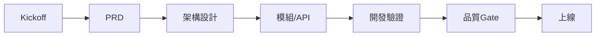
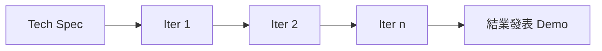

# RoomPilot-Agent 產品開發流程使用說明書

> 本文件由 VibeCoding 模板 01_workflow_manual.md 導入 RoomPilot-Agent 生成 | 基準分支 bella-local-20260726 | 2026-07-26

> **版本:** v2.0 | **更新:** 2026-07-26 | **狀態:** 活躍

---

## 1. 使用原則

- **以文檔為契約**: RoomPilot 的衝突優先序為「自動化測試 > 可執行程式 > 正式契約(`docs/contracts/`) > 總覽文件」(出處:`docs/RoomPilot_現行版本總覽.md` 開頭)。`README.md` 負責安裝與啟動,總覽負責跨模組協作。
- **小步快跑**: 成員在各自分支開發,整合時只挑責任範圍內的 commit,不整支 merge(出處:`README.md`「合併方式」)。
- **風險前置**: 合併前必過測試、工作區檢查與整合者逐 commit 檢視(見第 6 節 Gate)。
- **模式可升降級**: 本專案現行為模式 B(MVP 快速迭代,見第 2 節);若未來轉為對外營運服務,依升級觸發改走模式 A。

**角色表(取代模板的 RACI 縮寫)**——沿用 `README.md` 的目錄負責人制,每人一個唯一主要目錄:

| 負責人 | 唯一主要目錄 | 功能 |
| :--- | :--- | :--- |
| Cody | `backend/floorplan/`、`backend/upgrade3d/` | PNG、DXF、牆與門窗辨識 |
| Kai | `backend/catalog/` | 家具型錄、AWS Manifest、CloudFront 與隔離資料 |
| Django | `backend/spatial_data/` | 房間長寬、面積、比例及尺寸標註 |
| Yen | `backend/agent/` | 家具選件與擺放失敗修復策略 |
| AN | `backend/engine/` | 家具座標、碰撞與淨空檢查 |
| Bella | `backend/server/`、`frontend3d/` | FastAPI、1–10 流程、2D/3D UI |

補充現況:`backend/spatial_data/` 目前僅有 `.gitkeep` 佔位,無程式碼(實測);`frontend3d/` 為 React Three Fiber 子專案,現行主前端為 `frontend/` 靜態頁。

---

## 2. 模式選擇

| 條件 | 完整流程 | MVP 快速迭代 | RoomPilot 現況 |
| :--- | :--- | :--- | :--- |
| 金流/法遵/隱私資料 | V | | 無金流:僅 `POST /api/cost/estimate` 以版控內行情做概算(`backend/server/cost_estimation.py`),無交易收款 |
| 高可用與規模化 | V | | 單機 uvicorn + 本機 SQLite(`.runtime/projects.sqlite3`),無高可用需求 |
| 跨 3+ 團隊協作 | V | | 單一團隊 6 個目錄負責人 |
| 快速驗證價值假設 | | V | 驗證「平面圖 → 需求 → 3D 提案」流程可行性 |
| 時間/預算有限 | | V | 課程專題,時程固定(成果發表日 8/20,未查證,依團隊口述) |

**判定:本專案採模式 B(MVP 快速迭代)。** 理由:

1. RoomPilot 是 AIPE03 第四組的課程專題(出處:`README.md` 專案描述),交付目標是結業發表與求職作品,非營運服務。
2. 無金流、無法遵負擔;唯一個資觸點是遠端渲染 payload,後端送出前已剝除姓名、電話、Email、地址等欄位(`backend/server/render_service.py` `PRIVATE_KEYS`,實測第 12–22 行)。
3. 單一團隊、固定短時程,重點在迭代速度與可展示的完整流程。

**升級觸發**(任一成立即重新評估模式):接入真實客戶或廠商資料、對外營運、加入金流、多團隊協作。

---

## 3. 模式 A: 完整流程(本專案不採用,保留為升級參考)

| 階段 | 目標 | 產出 | Gate | RoomPilot 對應現況 |
| :--- | :--- | :--- | :--- | :--- |
| A0 啟動 | 對齊目標、邊界、風險 | 啟動簡報、里程碑 | 利益相關者共識 | 以 `README.md` 開頭的團隊目錄與合併規則代替 |
| A1 PRD | 定義問題、受眾、範圍、KPI | `02_prd.md` | PRD 簽核、KPI 可量測 | `docs/vibecoding/02_project_brief_and_prd.md` 已產出(v1.0 草稿) |
| A2 架構 | 系統邊界、技術選型、NFR | `05_architecture.md` + `04_adr.md` | ADR 齊備、NFR 可驗證 | `docs/RoomPilot_現行版本總覽.md` 已有;ADR 已產出(`docs/vibecoding/04_architecture_decision_record_template.md`,含 5 則既成決策) |
| A3 詳細設計 | 可實作規格與契約 | `07_module.md` + `06_api.md` + `08_structure.md` | 契約穩定、測試策略完整 | `docs/contracts/` 6 份正式契約已有(見第 5 節) |
| A4 開發 | 增量交付 | 程式碼、測試、建置產物 | 測試綠燈、覆蓋率達標 | `uv run pytest tests/ -q`;無覆蓋率門檻 |
| A5 品質 | 消除高風險弱點 | `13_security.md` | 高/中風險已整改 | 安全檢查清單已產出(`docs/vibecoding/13_security_and_readiness_checklists.md`,尚未經人工安全審查) |
| A6 上線 | 可靠性、可觀測性就緒 | Go/No-Go 簽核 | SLO/Alert 就緒、回滾演練通過 | 無上線流程;repo 無 `.github/`、無 CI(2026-07-26 實測) |

**跨階段**: 變更需更新契約與相依文檔;欄位或行為變更須同步 `docs/contracts/` 對應契約。

---

## 4. 模式 B: MVP 快速迭代(RoomPilot 現行模式)

### B0 Sprint 0: Tech Spec

模板要求一份輕量文件合併 PRD/SA/SDD/API 最小集合;RoomPilot 不另寫合併文件,由既有文件分擔:

- 問題/目標用戶/成功指標 → `README.md` 專案描述與「現行流程」段
- 高層設計 + 元件圖 → `docs/RoomPilot_現行版本總覽.md`
- 必要 API 契約 → `docs/contracts/` 6 份(見第 5 節);API 實體為 `backend/server/main.py` 44 條路由(grep `@app.get/post/put` 實數)
- 資料 Schema → `backend/catalog/data/README.md`(9,350 件正式家具集合規則)、`scripts/sql/roompilot_postgresql_schema.sql`(PostgreSQL 匯入用)
- 風險與手動替代方案 → LLM 為可選能力,必須本地 fallback:需求引導須 `OPENROUTER_API_KEY` + `OPENROUTER_INTAKE_ENABLED=1`(`backend/server/intake_service.py`),場景規劃須 `OPENROUTER_SCENE_PLANNING_ENABLED=1`(`backend/server/scene_service.py`);未設定或失敗時走 deterministic fallback / 本地規則

### 主流程(程式碼權威序)

步驟順序一律以 backend/server 程式碼為準:`frontend/scene_workflow.js` 的 `WORKFLOW_STEPS`(唯一有序來源)定義 11 個內部步驟;其中 `recognition` 與 `calibration` 共用同一 `scale` 面板(`WORKFLOW_PANEL_BY_STEP`),因此 `/scene` 頁面(`scene.html`)只顯示 10 顆步驟按鈕。伺服器端 `backend/server/main.py` 的 `WORKFLOW_STEPS` 是同名集合(set),只驗證步驟名稱、不強制順序;步驟前置依賴僅由前端強制。

| 內部步驟(有序) | UI 按鈕 | 名稱 |
| :--- | :--- | :--- |
| 1 `project` | 1 | 建立專案 |
| 2 `upload` | 2 | 上傳平面圖 |
| 3 `recognition` | 3 | 確定尺寸 |
| 4 `calibration` | (與 3 共用 scale 面板) | 兩點公分尺度校正 |
| 5 `space_confirmation` | 4 | 空間與結構 |
| 6 `requirements` | 5 | 需求問卷(Test2,題庫 55 組) |
| 7 `layout_2d` | 6 | 2D 家具配置 |
| 8 `white_model_3d` | 7 | 3D 白模 |
| 9 `realistic_3d` | 8 | 即時寫實(6 風格 × 3 色卡 = 18 張) |
| 10 `proposal_review` | 9 | 方案鎖定 |
| 11 `ai_render` | 10 | AI 渲染(遠端) |

前一步資料改動時,依賴它的後續步驟必須失效並重新確認(出處:`docs/RoomPilot_現行版本總覽.md`)。注意:總覽文件內文有「目前固定為八個步驟」字樣,但同檔表格與程式碼均為 10 顆按鈕/11 個內部步驟——以程式碼為準,「八」為舊殘留,待修正。

### B1–Bn 迭代循環

- 每次交付:可運行版本(`uv run uvicorn backend.server.main:app --port 8002`)+ 測試綠燈 + 契約同步。
- 最低限度安全檢查(對應到實際機制):
  - Secrets:`.env` 不入版控(`.gitignore` 第 1 行);金鑰全走環境變數(`OPENROUTER_API_KEY`、`ROOMPILOT_RENDER_PROVIDER_URL/TOKEN/NAME/TIMEOUT_SECONDS`)
  - 輸入驗證:平面圖副檔名白名單 `FLOORPLAN_EXTENSIONS = (.dxf, .png, .jpg, .jpeg)`、渲染上傳上限 `MAX_RENDER_BYTES = 20MB`(均在 `backend/server/main.py`)
  - 個資:遠端渲染 payload 送出前剝除 `PRIVATE_KEYS` 欄位(`render_service.py`)
- 最低限度可觀測性:狀態端點 `GET /api/catalog/status`、`GET /api/render-provider/status`、`GET /api/scene/provider-status`(均在 `main.py`,實測行 1933/1751/2111);無獨立 health check 端點與外部監控。

### MVP 上線 Gate(本專案語境 = 發表前 Gate)

- [ ] 最小可運營 Runbook:`README.md` 已有安裝/啟動/組員驗收段(`uv sync --extra server` → `uv run uvicorn backend.server.main:app --port 8002`;驗收基準:同版程式上傳 `floor04.png` 應辨識出 19 面牆、5 扇門、5 扇窗、7 個房間);部署與運維指南已產出(`docs/vibecoding/14_deployment_and_operations_guide.md`)
- [ ] 資料備份:專案資料在各機本地 `.runtime/projects.sqlite3`(`project_store.py`),無備份機制,待辦;家具 GLB 離線備援 zip 已有驗證流程(`scripts/verify_ikea_offline_backup.py`,SHA-256 驗證,1,517 GLB/1,508 件可用)
- [ ] 風險與債務列入 Backlog:`docs/backlog/` 現有 1 筆(`FLOORPLAN_DATASET_TUNING.md`);其餘已知債務記於總覽「尚未接入」段,待整併

---

## 5. 文檔產出對照

| 階段 | 完整流程 | MVP | RoomPilot 現況 |
| :--- | :--- | :--- | :--- |
| 規劃 | `02_prd.md` | Tech Spec PRD 區塊 | `README.md` 產品描述;`docs/vibecoding/02_project_brief_and_prd.md` 已產出(v1.0 草稿) |
| 架構 | `05_architecture.md` + `04_adr.md` | Tech Spec SA/ADR 區塊 | `docs/RoomPilot_現行版本總覽.md`;`docs/vibecoding/05_architecture_and_design_document.md` 與 ADR(`docs/vibecoding/04_architecture_decision_record_template.md`)已產出 |
| 規格 | `07_module.md` + `06_api.md` | Tech Spec SDD/API 區塊 | `docs/contracts/` 6 份:`AGENT_FRONTEND_BACKEND_CONTRACT.md`、`CATALOG_MODEL_DELIVERY_CONTRACT.md`、`FURNITURE_ENGINEERING_RULES.md`、`LAYOUT_EVALUATION_SCHEMA.md`、`REMOTE_RENDER_CONTRACT.md`、`STYLEPACK_RENDERING_CONTRACT.md`(ls 實數) |
| 品質 | `13_security.md` | 簡化安全檢查 | `tests/` 47 個測試檔、pytest 392 條(2026-07-26 實跑:389 通過、2 失敗、1 skip);安全檢查清單已產出(`docs/vibecoding/13_security_and_readiness_checklists.md`) |
| 結構 | `08_structure.md` | Tech Spec 結構區塊 | `README.md` 目錄負責人表與路徑規則;`docs/vibecoding/08_project_structure_guide.md` 已產出 |

---

## 6. Gate 度量(對應實際工具)

RoomPilot 的 Gate 全部落在「合併進 Bella 整合分支」這個節點(出處:`README.md`「合併方式」與「共同規則」):

| Gate | 工具/指令 | 通過標準 |
| :--- | :--- | :--- |
| 測試 | `uv run pytest tests/ -q` | 綠燈;合併前必跑(47 檔、392 條;2026-07-26 實跑 389 通過、2 失敗、1 skip;2 失敗均為 `tests/test_scene_v2_contract.py` 前端快取鍵比對) |
| 工作區乾淨 | `git diff --check`、`git status --short` | 無空白錯誤、無未預期檔案;合併前必跑 |
| Code review | `git diff --name-status bella...origin/<member-branch>`、`git log --oneline bella..origin/<member-branch>` | 整合者先建 `integration/<name>-into-bella` 分支,逐 commit 檢視,只挑組員責任範圍內的變更;無 GitHub PR 自動化(repo 無 `.github/`、無 CI,實測) |
| 分支合併規則 | git 手動流程 | 不得把舊分支整支 merge 進 Bella;衝突不得整份 ours/theirs 覆蓋;不得帶入第二套 FastAPI、重複前端或整包大型模型 |
| 目錄責任 | 人工檢視 diff 範圍 | 每位成員只修改自己的主要目錄與對應測試;Bella 可在 `backend/server/` 串接但不複製他人演算法;家具座標只能由 `backend/engine/` 計算 |
| 資料契約 | 人工檢視 + 對應測試 | 跨模組幾何一律公分,新欄位以 `_cm` 命名,payload 帶 `coordinate_unit: "cm"` 與 `schema_version`;隔離區 `backend/catalog/data/quarantine/unmatched_cloud_furniture/` 不得被網頁/Agent/3D 使用 |

**共同度量**:模板原列需求穩定度、缺陷密度、Lead Time、SLO、MTTR——本專案均未建立。現行可量測的指標只有 pytest 收集數/通過數,以及型錄載入時的強制驗證數字(正式家具恰為 9,350 件、manifest 與 catalog ID 完全一致,`backend/catalog/cloud_catalog.py` 驗證失敗即 raise)。

---

## 7. 附錄: 檢查清單

- **合併前**: `uv run pytest tests/ -q` 綠燈? `git diff --check` 乾淨? diff 只落在自己的責任目錄與對應測試?
- **契約**: 欄位或行為變更是否同步 `docs/contracts/` 對應契約?幾何輸出是否公分制(`coordinate_unit: "cm"` + `schema_version`)?
- **安全**: `.env` 未入庫?金鑰只走環境變數?上傳副檔名白名單與 20MB 上限未被繞過?渲染 payload 已剝除私人欄位?隔離區資料未被載入?
- **驗收/Demo**: 停舊 uvicorn、`git pull --ff-only` 後以 `uv run uvicorn backend.server.main:app --port 8002` 重啟?`floor04.png` 辨識基準(19 牆/5 門/5 窗/7 房)符合?demo 樣張端點 `GET /api/floorplan/sample/630` 可用?
- **發表前**: `.runtime/` 資料備份?已知風險與債務已入 `docs/backlog/`?
