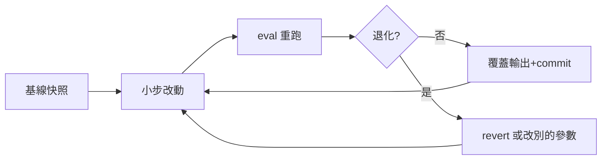

# RoomPilot-Agent 產品開發流程使用說明書

> **版本:** v1.0 | **更新:** 2026-07-25 | **狀態:** 草稿

> 本文件把通用模板（`VibeCoding_Workflow_Templates/01_workflow_manual.md`）實例化為 RoomPilot-Agent 的實際開發流程。RoomPilot-Agent 是**研究型純 Python CLI 管線**（平面圖 PNG → DXF 向量化＋房型辨識），無 Web 後端、無資料庫、無 REST API；流程的核心不是「上線部署」，而是「**指標不退化的管線迭代**」。既有規範一律引用 `.claude/rules/`，本文件不另發明流程。

---

## 1. 使用原則

- **以文檔為契約 (SSOT)**：`Readme.md` 版本紀錄（現行 v2.16）＋ `docs/HANDOVER_finetune_v5.md`（訓練交接）＋ `scripts/README.md`（腳本說明）是本專案的單一事實來源；每輪版本變更（v2.x）在 `Readme.md` 留下完整決策紀錄，等同輕量 ADR。
- **小步快跑**：一次改一個管線環節（例：只調彩窗召回的牆段配對 gap），改動前後各跑一次 eval，數字進版控報表（`json/eval_rooms/*.json`）留痕。
- **風險前置 = 評測守門 Gate**：任何會影響 `chk/`、`dxf_scale/` 輸出的邏輯改動，**改動前必先跑 eval 對 `Identify_ans/pngans/` 評分建立基線，改動後不得退化才可覆蓋輸出**（見 §6）。這是本專案取代「審查 Gate」的機制，記錄於使用者記憶與 `.claude/rules/` 精神一致。
- **模式可升降級**：日常調參走模式 B（研究迭代）；一旦觸及「換權重接管預設」「新增容器級模組」「授權/商用」等重大決策，升級為模式 A（見 §2 升級觸發）。

**角色縮寫 (RACI) — N/A＋本專案對應：** 本專案為內部小團隊、多機協作，無 PM/TL/ARCH/QA/SRE/SEC/OPS 分工。對應物：
- **決策者**＝使用者本人（例：v5 權重是否接管預設、目標域定為 own 風格，皆由使用者裁決）
- **DEV**＝各機器上的 Claude Code agent＋人工把關（分支即機器，見 §5）
- **QA**＝eval 守門 harness（`scripts/eval_*.py`）＋人工逐張驗收（標注修復流程）
- **SEC**＝`.claude/rules/security.md` 每次 commit 前必檢清單（GITHUB_TOKEN 等秘密管理）

---

## 2. 模式選擇

| 條件 | 模式 A（完整流程） | 模式 B（研究迭代） |
| :--- | :--- | :--- |
| 換預設權重／訓練新一輪微調（v6…） | V | |
| 授權與商用相關（去 CubiCasa 路線、floortrans 自寫替換） | V | |
| 新增容器級模組（新管線、新評測尺、GT 建集） | V | |
| 調參修 bug（彩窗召回、門位精準率、切割收尾） | | V |
| 標注修復／資料集擴充（既有工作流內） | | V |

**升級觸發（本專案實況）：**
- 改動會**更換 `floorplan2room.py` 的預設權重**（`CC_WEIGHTS`）→ 必須走模式 A 的訓練輪流程（GPU 換機＋雙尺評測＋使用者裁決），前例：v5 own 尺 0.788 首勝基線後接管預設。
- 觸及 **CC BY-NC 授權邊界**（CubiCasa5k repo 為 CC BY-NC 4.0、資料集 CC BY-NC-SA 4.0，官方權重與微調 v1~v5 全繼承禁商用）→ 商用部署前必須替換，屬架構級決策。
- 需要**新的 GT 資料集或評測尺**（例：彩色管線門位/切割/命名三層目前無 GT）→ 先走模式 A 的 GT 建集規劃，再回到模式 B 迭代。
- 動到**凍結檔案** `scripts/floorplan2dxf.py`（灰階管線已凍結，不再修改）→ 停止並向使用者確認，不得自行升級處理。

---

## 3. 模式 A：完整流程（重大決策／訓練輪／新模組）


| 階段 | 目標 | 產出（本專案實例） | Gate |
| :--- | :--- | :--- | :--- |
| A0 啟動 | 對齊目標、邊界、風險 | `git branch --show-current`＋`git status` 確認分支（`.claude/rules/development-workflow.md` 鐵律）；在 `main` 上一律停止並詢問 | 在正確機器分支且工作區乾淨 |
| A1 需求 | 定義問題與可量測門檻 | 明確數字門檻，例：微調權重須過 CubiCasa 尺 0.838 或由使用者裁決目標域（v5 案例：CC 尺 0.797 未過，但 own 尺 0.788 大勝基線 0.273，使用者裁決目標域＝own 而接管）→ 詳見 [`02_prd.md`](./02_project_brief_and_prd.md) | 門檻寫成 eval 腳本可輸出的指標 |
| A2 路線決策 | 技術選型與取捨留痕 | `Readme.md` 版本紀錄段落（如 v2.15「去 CubiCasa 路線確立」）＋ [`04_adr.md`](./04_architecture_decision_record_template.md)；架構全貌見 [`05_architecture.md`](./05_architecture_and_design_document.md) | 授權、GPU 依賴、資料來源三項風險已登記 |
| A3 資料與契約 | 可實作的規格與資料就緒 | 訓練輪：`scripts/pack_finetune_data.py` 打包 `training/finetune_data.zip`＋`scripts/apply_cubicasa_patches.py` 補丁；GT 建集：`Identify_ans/` 三區結構（pngans/own_dataset/own_eval）；模組介面見 [`06_api.md`](./06_api_design_specification.md)、[`07_module.md`](./07_module_specification_and_tests.md) | own_eval 12 題保留集**永不進訓練**；標注經人工逐張驗收 |
| A4 實作/訓練 | 增量交付 | 本機（Cody，WSL2 無 GPU）只做 CPU 可行部分；訓練帶 zip 換 GPU 機（RTX 3060 / GTX 1650）依 `docs/HANDOVER_finetune_v5.md` 執行（注意：官方 44 類權重須 `--weights`＋`--new-hyperparams`，誤用 `--furukawa-weights` 即 size mismatch） | pytest 綠燈（`tests/` 現有 6 檔）；TDD 見 `.claude/rules/testing.md` |
| A5 品質 Gate | 消除退化風險 | 雙尺評測：`scripts/eval_rooms_cc.py`（CubiCasa 尺）＋`--own-eval [--gt-seg]`（own 尺，主尺）；報表 `json/eval_rooms/report_own*.json`；安全檢查依 `.claude/rules/security.md`＋[`13_security.md`](./13_security_and_readiness_checklists.md) | own 尺不退化；八類 recall 無倒退（v5 驗收標準）；秘密不進版控 |
| A6 接管與交接 | 新狀態可靠可復現 | 權重掛 GitHub Release（如 tag `weights-v5`，SHA-256 `b7a280d2…f4cf`）；`_ensure_cc_weights` 缺檔自動下載＋校驗；`cubicasa/room/` 語意快取全量重算（v5 為 137 檔）；四報表＋`recognition_report.html` 同步；`Readme.md` 寫入 v2.x 變更紀錄 | 部署機僅需設 `GITHUB_TOKEN` 即全自動；PR 匯流回 `main`（`.claude/rules/git-workflow.md`） |

**跨階段**：重大變更需回寫 `Readme.md` 版本紀錄與相依文件（HANDOVER、scripts/README.md）；待辦優先序在每輪版本定案時重排（現行 v2.16 定案：彩窗召回 38% 為最大真實破口）。

---

## 4. 模式 B：研究型管線迭代（日常主模式）



### B0 迭代前置：基線快照（等同 Tech Spec 最小集）

開始任何調參／修 bug 前：

1. **分支確認**（`.claude/rules/development-workflow.md`）：`git branch --show-current`——本機應在 `cody`，其他機器在各自分支（見 §5）。
2. **基線評分**：改動涉及哪層，就先跑哪支 eval 記下數字：

```bash
# 窗/牆像素層（預設 Identify_ans/pngans/gray/ vs training/chk/gray/）
python3 scripts/eval_windows.py
python3 scripts/eval_color_walls.py          # 彩色牆
# 房型/切割層（own 尺為主尺）
python3 scripts/eval_rooms_cc.py --own-eval [--gt-seg]
# 門位層
python3 scripts/eval_doors.py / eval_door_match.py
```

3. **問題定義最小集**（一段話即可，寫在 commit body 的 WHY）：現況數字、目標數字、動哪個參數/函式。範例：彩窗 P62/R38 → 調 `floorplan2dxf_color.py` 牆段配對 gap 與 covered 門檻的線寬適配。

### B1-Bn 迭代循環

- 每次交付＝**可跑的管線＋前後指標對照＋一個邏輯 commit**（WHY/WHAT/IMPACT body，見 `.claude/rules/git-workflow.md`）。
- 遇 bug 先載入 sunnydata-debugging skill 再修（`.claude/rules/performance.md`）；先寫測試再修實作（`.claude/rules/testing.md`，pytest）。
- **保守原則**：窗偵測曾因 density-based 重寫誤報過多而全數回退——寧可小改可回退，不做大重寫。
- 灰階/彩色管線嚴格隔離：只改 `floorplan2dxf_color.py`（輸出進 `training/chk/color/`、`dxf_scale/color/` 等 color 子目錄），`floorplan2dxf.py` 凍結不動。

### 迭代收尾 Gate（每個 commit 前）

- [ ] eval 數字不退化（退化即不得覆蓋 `chk/`、`dxf_scale/`，先 revert）
- [ ] pytest 綠燈（`tests/` 6 檔）
- [ ] `.claude/rules/security.md` commit 前必檢（無硬編碼秘密——尤其 GITHUB_TOKEN）
- [ ] commit message 具 WHY/WHAT/IMPACT；一個 commit 做一件事
- [ ] 若產生值得留存的結論，回寫 `Readme.md` 版本紀錄或待辦清單

---

## 5. 分支與協作模型：分支即機器

**N/A 於模板原意的「跨團隊分支策略」——本專案的對應物是「一台機器一條長駐分支」**：

| 分支 | 角色 |
| :--- | :--- |
| `main` | 匯流保護分支，禁止直接 commit，一律走 PR（`.claude/rules/git-workflow.md`） |
| `cody` | 本機（WSL2、**無 GPU**、torch CPU 版）——標注、評測、CPU 端開發 |
| `bella` / `ben` / `ancai` / `django` / `kai-dev` | 其他機器各自分支；GPU 訓練機（RTX 3060 / GTX 1650）承接 `training/finetune_data.zip` 換機訓練 |

規則：
- 每台機器只在自己的分支工作，透過 PR 匯流回 `main`；PR 前置條件與 body 結構依 `.claude/rules/git-workflow.md`（Background/Changes/Impact/Test Plan）。
- 功能分支（`feat/xxx`、`fix/yyy`）仍可從機器分支再開，遵循同一套命名慣例；禁止 `git stash` 作為工作流、禁止在一個分支混做不相關任務。
- 大型產物不走 git：權重（200MB）走 GitHub Release（100MB 硬限）；`training/` 本機自管不 push；換機靠 zip 打包。

---

## 6. Gate 度量（本專案版）

模板的「準入/準出」在本專案具體化為**評測守門鐵律**：

- **準入**：改動前已建立基線分數（對應 eval 腳本已跑過、數字已記錄）；在正確分支且工作區乾淨；風險已知（授權、凍結檔、GPU 依賴）。
- **準出**：改動後重跑同一支 eval **不退化**；pytest 綠燈；commit/PR 符合 `.claude/rules/git-workflow.md`。
- **共同度量（現況基線，2026-07-25 v2.16）**：

| 層級 | 指標 | 現值 | 守門腳本 |
| :--- | :--- | :--- | :--- |
| 灰牆/灰窗 | F1 / P/R | 0.99 / 96%/96% | `scripts/eval_windows.py` |
| 彩牆 | P/R (IoU) | 87.7/94.9 (83.8) | `scripts/eval_color_walls.py` |
| 彩窗 | P/R | **62/38（全系統最低）** | `scripts/eval_windows.py`（color） |
| 切割 | 命中 (配對 IoU) | 72.6%＝53/73 (0.829)；端對端 76.4% (0.875) | `scripts/eval_rooms_cc.py --own-eval` |
| 房型命名 | own 尺具名命中 / macro-F1 | **0.788**（52/66）/ 0.473 | 同上（報表 `json/eval_rooms/report_own*.json`） |
| 門 | 過濾 / fused P/R | 100% / 0.576/0.868 | `scripts/eval_doors.py`、`eval_door_match.py` |
| CC mask | 品質 | 灰牆 CC mask F1 0.89（低於管線 0.99） | `scripts/eval_cc_masks.py` |

模板中的 SLO/MTTR/Lead Time：**N/A**（無線上服務）。對應物＝上表指標的版本間趨勢，逐版記錄於 `Readme.md` 與 `json/eval_rooms/` 報表。

---

## 7. 附錄：檢查清單（本專案版）

- **需求（PRD）**：問題有現值數字？目標門檻可被 eval 腳本量出？非目標明確（例：不做 Web 服務）？→ [`02_prd.md`](./02_project_brief_and_prd.md)
- **架構**：取捨寫進 `Readme.md` 版本紀錄／ADR？授權邊界（CC BY-NC）確認？凍結檔未被動到？→ [`04_adr.md`](./04_architecture_decision_record_template.md)、[`05_architecture.md`](./05_architecture_and_design_document.md)
- **設計**：資料流向 color/gray 子目錄隔離？own_eval 保留集未混入訓練？CLI/環境變數契約（`CC_WEIGHTS`、`CC_CACHE_DIR`、`GITHUB_TOKEN`）不變或已記錄？→ [`06_api.md`](./06_api_design_specification.md)、[`08_structure.md`](./08_project_structure_guide.md)
- **安全**：GITHUB_TOKEN（PAT，密碼等級）只在環境變數、不進版控？權重下載走 SHA-256 校驗？opencv 鎖 `>=4.10,<5`？→ `.claude/rules/security.md`、[`13_security.md`](./13_security_and_readiness_checklists.md)
- **收尾（對應模板「上線」）**：eval 前後對照無退化？快取/報表/`recognition_report.html` 需要同步重算的都重算了？`Readme.md` v2.x 變更紀錄補上？PR 匯流回 `main` 並刪除已併分支？換機備份（training 打包）狀態確認？

---

### 模板對照備註（本專案不適用段落一覽）

| 模板概念 | 本專案處置 |
| :--- | :--- |
| 金流/法遵/隱私、DAU/TPS 升級觸發 | N/A（無線上服務）→ 對應物：授權（禁商用）與預設權重更換為升級觸發 |
| A6 上線（SLO/Alert/回滾演練） | N/A → 對應物：權重 Release＋自動下載校驗＋快取重算＋交接文件 |
| MVP 上線 Gate（Runbook/備份） | 對應物：`docs/HANDOVER_finetune_v5.md` 即 Runbook；備份＝training zip 換機打包（`training.zip` 已於 2026-07-22 重打包，約 8.2GB） |
| REST API 契約 | N/A → 對應物：CLI 介面與環境變數契約，見 [`06_api.md`](./06_api_design_specification.md) |
| 資料表 Schema | N/A（無資料庫）→ 對應物：`Identify_ans/` GT 目錄結構與 `*_mask.npz` 快取格式 |
