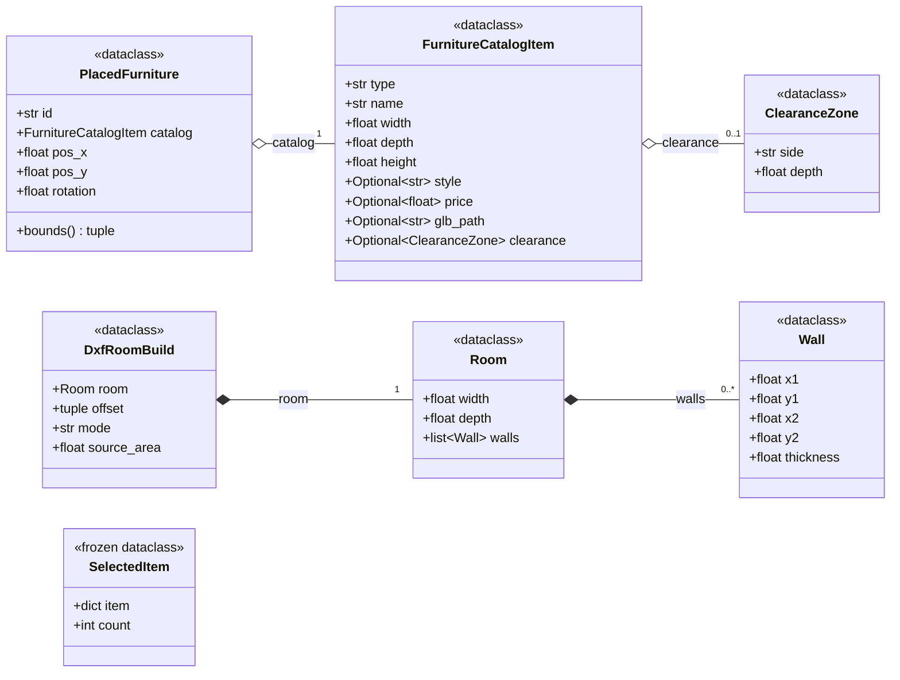
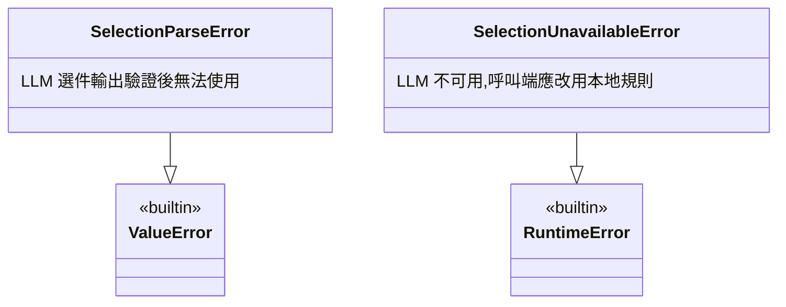
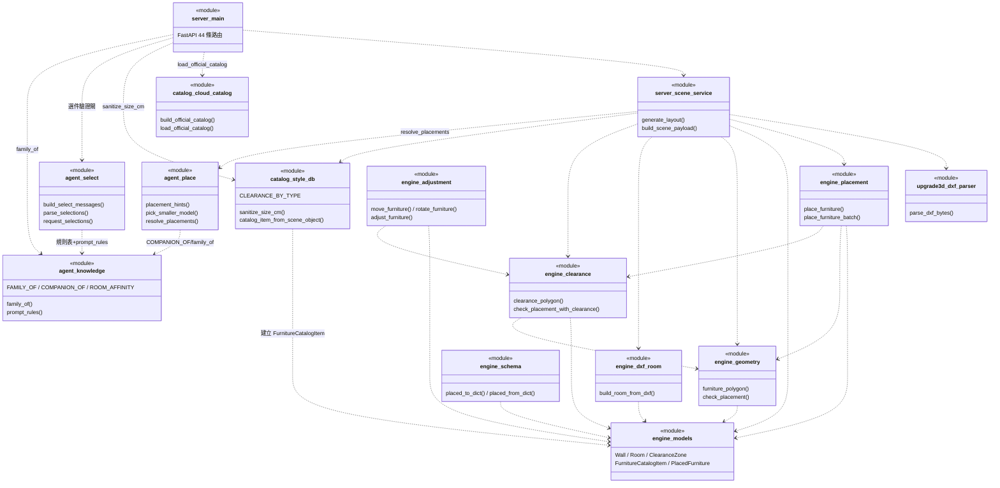

# 類別/元件關係文件 - RoomPilot-Agent

> 本文件由 VibeCoding 模板 10_class_relationships_template.md 導入 RoomPilot-Agent 生成 | 基準分支 bella-local-20260726 | 2026-07-26

> **版本:** v1.0 | **更新:** 2026-07-26 | **狀態:** 草稿

**範圍與讀法**:本文件盤點 `backend/engine/`(幾何擺放引擎)、`backend/agent/`(選件與擺位紀律)、`backend/catalog/`(型錄轉接層)的類別與模組關係,並標出 `backend/server/` 的消費點。本 repo 的架構特徵是「**類別只當資料結構與例外用,行為都在模組層函式**」——engine 七個模組、agent 三個模組、catalog 兩個模組全部沒有業務類別,只有 dataclass 與 Exception 子類。因此本文件分兩層畫:先畫真實存在的類別(dataclass/例外),再以「模組」為節點畫依賴關係。所有類別、行號、數字均經逐檔讀碼查證,未虛構。

---

## 核心類別圖

### 1. 資料結構(全部為 dataclass,單位一律公分)

出處(逐一查證):

| 類別 | 定義位置 | 備註 |
| :--- | :--- | :--- |
| `Wall` | `backend/engine/models.py:18` | `thickness` 預設 10.0 cm |
| `Room` | `backend/engine/models.py:28` | `walls` 用 `field(default_factory=list)` |
| `ClearanceZone` | `backend/engine/models.py:36` | `side` 取值 front/back/left/right |
| `FurnitureCatalogItem` | `backend/engine/models.py:48` | `height` 預設 80.0;`clearance=None` 表示無開合淨空需求 |
| `PlacedFurniture` | `backend/engine/models.py:62` | 唯一帶方法的 dataclass:`bounds()` 回未旋轉邊界 |
| `DxfRoomBuild` | `backend/engine/dxf_room.py:77` | `build_room_from_dxf()` 的回傳結果 |
| `SelectedItem` | `backend/agent/select.py:43` | `frozen=True`;`item` 是型錄 dict(agent 層不建型別化家具物件) |

關係判讀依據:
- `Room *-- Wall`:組合。`Wall` 清單由 `Room` 持有,在 `dxf_room._walls_from_ring()`(`dxf_room.py:63`)隨 Room 一起建立,生命週期綁定。
- `PlacedFurniture o-- FurnitureCatalogItem`:聚合。型錄物件可獨立於擺放結果存在(由 `catalog/style_db.catalog_item_from_scene_object()` 另行建立)。
- `FurnitureCatalogItem o-- ClearanceZone`:聚合。`CLEARANCE_BY_TYPE`(`backend/catalog/style_db.py:185`)是模組層共享實例,多件家具共用同一個 `ClearanceZone` 物件,非每件各持有一份。
- `DxfRoomBuild *-- Room`:組合。`Room` 在 `build_room_from_dxf()`(`dxf_room.py:85`)內建立並隨結果回傳。

### 2. 例外類別(唯一的繼承關係)

本三模組(engine/agent/catalog)內的繼承只有例外類別繼承 Python 內建例外;業務邏輯零繼承層級。

出處:`backend/agent/select.py:34`(`SelectionParseError`)、`backend/agent/select.py:38`(`SelectionUnavailableError`)。

參考:`backend/server/` 應用層另有同型態的例外與儲存類別(不在本文件主範圍,列出供對照):`ProjectVersionConflict(RuntimeError)`(`project_store.py:28`)、`WorkflowTooLargeError(ValueError)`(`project_store.py:36`)、`ProjectStore`(`project_store.py:77`,SQLite 持久化)、`QuestionnaireCatalogError(ValueError)`(`questionnaire_visuals.py:16`)、`QuestionnaireVisualStore`(`questionnaire_visuals.py:139`)、`RenderProviderUnavailable(RuntimeError)`(`render_service.py:25`)、`RenderProviderRejected(RuntimeError)`(`render_service.py:29`)。

### 3. 模組依賴圖(行為層;節點是模組不是類別)

節點對應檔案(模組名中的 `_` 讀作套件分隔):

| 圖中節點 | 實際檔案 |
| :--- | :--- |
| `agent_knowledge` / `agent_select` / `agent_place` | `backend/agent/knowledge.py`、`select.py`、`place.py` |
| `catalog_style_db` / `catalog_cloud_catalog` | `backend/catalog/style_db.py`、`cloud_catalog.py` |
| `engine_*` | `backend/engine/models.py`、`geometry.py`、`clearance.py`、`placement.py`、`adjustment.py`、`dxf_room.py`、`schema.py` |
| `server_scene_service` / `server_main` | `backend/server/scene_service.py`、`main.py` |
| `upgrade3d_dxf_parser` | `backend/upgrade3d/dxf_parser.py` |

依賴邊全部取自各檔案的 import 陳述(`scene_service.py:15-26`、`main.py:20-27` 等),逐條核對過。三個關鍵的「刻意不依賴」:

1. **`agent` 套件不 import `engine`**:`place.py` 只 import 標準庫與 `knowledge`;引擎重擺透過呼叫端注入的 `engine_place_fn` 進行(`place.py:16` 型別別名、`place.py:130` 參數)。`agent/__init__.py` docstring 明文宣告不碰網路、不依賴 `backend.server`。
2. **`engine/dxf_room.py` 不 import ezdxf/shapely**(檔頭 docstring 明言),因此可獨立匯入測試;engine 內 shapely 只有 `geometry.py`/`clearance.py` 使用(repo 其他層的 `server/scene_service.py` 與 `upgrade3d/dxf_parser.py` 另有自己的 shapely 依賴)。
3. **`agent_select` 的 LLM 呼叫器是注入的 `Complete` callable**(`select.py:24`),實際 OpenRouter 網路呼叫在 `backend/server/`(`scene_service.py` 的 `_openrouter_request`),agent 層零網路依賴。

---

## 類別職責

### 類別(dataclass / 例外)

| 類別/元件 | 核心職責 | 協作者 | 所屬層 |
| :--- | :--- | :--- | :--- |
| `Wall` | 一段有厚度的牆線段(碰撞判斷的輸入) | Room, geometry.wall_polygon | Domain(engine) |
| `Room` | 房間邊界(width/depth)+牆清單;原點在左下角、座標全正 | Wall, 所有 engine 運算模組 | Domain(engine) |
| `ClearanceZone` | 家具某一面的開合淨空需求(side+depth) | FurnitureCatalogItem, clearance 模組 | Domain(engine) |
| `FurnitureCatalogItem` | 型錄屬性(這是什麼家具),不含座標 | ClearanceZone, PlacedFurniture | Domain(engine) |
| `PlacedFurniture` | 擺放結果(pos_x/pos_y/rotation),`place_furniture`/`adjust_furniture` 的輸出 | FurnitureCatalogItem, geometry | Domain(engine) |
| `DxfRoomBuild` | DXF 解析結果轉 Room 的完整轉換結果(room/offset/mode/source_area,全公分) | Room | Domain(engine) |
| `SelectedItem` | 驗證通過的一筆選件(型錄 dict+數量),frozen 不可變 | select.parse_selections | Application(agent) |
| `SelectionParseError` | LLM 選件輸出驗證失敗的信號,觸發呼叫端本地規則 fallback | main.py 選件端點 | Application(agent) |
| `SelectionUnavailableError` | LLM 未注入/停用/呼叫失敗的信號 | main.py 選件端點 | Application(agent) |

### 行為模組(無類別,函式即介面)

| 模組 | 核心職責 | 關鍵知識/常數(實數) |
| :--- | :--- | :--- |
| `agent/knowledge.py` | 選件與擺位共用的宣告式知識,單一事實來源;不放幾何 | `FAMILY_OF` 12 種類型→族系、`COMPANION_OF` 5 組副件→主件、`ROOM_AFFINITY` 7 族系限房型、`ANCHOR_FAMILIES` 4 主件族系、`GROUP_OF` 10 族系→成組標籤 |
| `agent/select.py` | LLM 選件邊界:白名單驗證、數量夾限、族系唯一、必要主件檢查;使用者指定家具受保護 | `MAX_ITEMS_PER_ROOM=8`、`COUNT_MAX=6`、`REQUIRED_FAMILIES_BY_ROOM`(bedroom 必床、living_room 必沙發、dining_room 必餐桌+餐椅) |
| `agent/place.py` | 擺位失敗修復迴圈:讀引擎 `placement_failed` 標記後決定換小/移除/升級人工;絕不計算座標 | `max_rounds=3`;同品項失敗 2 次即移除;保護件只 escalate |
| `catalog/style_db.py` | 型錄 dict → 引擎 `FurnitureCatalogItem` 的轉接層;尺寸修補(DB 合理值>名稱內尺寸>類型預設) | `_SIZE_RULES` 40 種類型的合理範圍與預設值;`CLEARANCE_BY_TYPE` 只給 4 類(bookcase/sideboard 40、wardrobe/desk 50 cm 前方淨空) |
| `catalog/cloud_catalog.py` | 以雲端型錄+manifest 建立正式家具母集合,舊六風格型錄僅 enrichment;強制驗證數量/ID/上傳狀態/HTTPS URL | `OFFICIAL_CATALOG_COUNT=9350`、`READY_UPLOAD_STATUSES` 6 值白名單 |
| `engine/geometry.py` | Shapely 多邊形碰撞(支援旋轉):出界/穿牆/家具重疊;`check_placement()` 統一入口 | 回傳 `None`=合法,否則繁中原因字串 |
| `engine/clearance.py` | 淨空區運算與衝突檢查;`check_placement_with_clearance()` 是本體+淨空+反向淨空的總入口 | 檢查順序:淨空撞牆→撞他人本體→撞他人淨空→我的本體壓他人淨空 |
| `engine/placement.py` | 自動擺放:13 個偏移候選(step 95 cm)× 4 旋轉找第一個合法位置;另有覆蓋物/貼鄰擺放與批次版 | `place_furniture` / `place_overlay_on_furniture` / `place_adjacent_to_furniture`(gap 預設 12 cm)/ `place_furniture_batch` |
| `engine/adjustment.py` | 吃 Agent 拆解好的結構化指令(move 軸分離/rotate 失敗還原);自然語言不在此層 | 正式伺服器流程無呼叫點,現役使用者只有 `examples/demo_agent_flow.py` 與 `tests/test_placement.py`(grep 實查) |
| `engine/dxf_room.py` | dxf_parser 公尺輸出 → 公分 Room 的唯一單位邊界(×100、平移角落原點、環邊還原 Wall) | `DEFAULT_WALL_SEG_THICKNESS=6.0` cm;mode largest/plan,無封閉房間自動退 plan |
| `engine/schema.py` | 序列化(`placed_to_dict` schema_version 2.0/coordinate_unit cm)與 LLM tool 定義 | `PLACE_FURNITURE_TOOL`/`ADJUST_FURNITURE_TOOL` 自標 v0.1 草案,`backend/server` 無引用(grep 實查) |

---

## 關係說明

| 關係類型 | UML 符號 | 本 repo 實例 |
| :--- | :--- | :--- |
| 繼承 | `--\|>` | `SelectionParseError --\|> ValueError`、`SelectionUnavailableError --\|> RuntimeError`(select.py:34,38);業務類別無繼承 |
| 實現 | `..\|>` | 無。repo 內沒有 ABC/Protocol 正式介面,介面以 `Callable` 型別別名表達(見「介面契約」) |
| 組合 | `*--` | `Room *-- Wall`(walls 隨 Room 建立)、`DxfRoomBuild *-- Room`(轉換結果持有新建 Room) |
| 聚合 | `o--` | `PlacedFurniture o-- FurnitureCatalogItem`(型錄物件獨立存在)、`FurnitureCatalogItem o-- ClearanceZone`(CLEARANCE_BY_TYPE 共享實例) |
| 依賴 | `..>` | `agent_select ..> agent_knowledge`、`server_scene_service ..> agent_place`、`catalog_style_db ..> engine_models` 等(見模組依賴圖,全部取自 import) |

跨層資料流(擺位閉環,行號實查):

1. `scene_service.generate_layout()` 以 `catalog_item_from_scene_object()`(`scene_service.py:1281`)把場景 dict 轉成引擎型錄物件,逐件用 `check_placement_with_clearance` 驗證錨點候選,錨點全敗退 `place_furniture()`(`scene_service.py:1460`)。
2. 有任何 `placement_failed` 時,`scene_service.py:1752` 呼叫 agent 的 `resolve_placements()`,傳入 `replace_and_place` 閉包(`scene_service.py:1742`,內部重呼 `generate_layout`)作為 `engine_place_fn`——即「agent 決策、引擎重算座標」的迴圈,座標永遠只由引擎產生。
3. 座標契約:前端 position 為房間中心原點,引擎為角落原點(±half 平移);three.js 旋轉與引擎方向相反,進出引擎取負號(`scene_service.py:1053` `_scene_object_to_placed` docstring 與程式碼)。

---

## 設計模式

| 模式 | 應用場景 | 目的 |
| :--- | :--- | :--- |
| 依賴注入 | `Complete` LLM 呼叫器注入 `request_selections()`(select.py:24,282);`engine_place_fn` 注入 `resolve_placements()`(place.py:130) | agent 層不碰網路、不依賴 engine;可用假 callable 單測(main.py:2250 就用 lambda 假 complete 做伺服器端驗證) |
| 轉接器(Adapter) | `catalog_item_from_scene_object()`(style_db.py:193)、`build_room_from_dxf()`(dxf_room.py:85)、`_scene_object_to_placed()`(scene_service.py:1053) | 在單一邊界解決資料形狀、單位(公尺→公分)與座標系(中心原點↔角落原點)差異 |
| 外觀(Facade) | `geometry.check_placement()`(geometry.py:67)收攏出界/穿牆/重疊;`clearance.check_placement_with_clearance()`(clearance.py:89)再收攏本體+淨空+反向淨空;`adjust_furniture()`(adjustment.py:72)收攏 move/rotate | 呼叫端只面對一個檢查入口與一致的 `str \| None` 回傳約定 |
| 降級鏈(備援策略) | `POST /api/agent/furniture/select`(main.py:2220-2281):LLM 選擇驗證(`openrouter`)→ 本地規則(`local_rules`)→ 保留前 8 個候選(`local_rules_unvalidated`) | LLM 失敗不擋主流程;每層失敗以例外(`SelectionParseError`/`SelectionUnavailableError`)明確傳遞,不靜默 |
| 單一事實來源(宣告式知識表) | `knowledge.py` 的 FAMILY_OF/COMPANION_OF/ROOM_AFFINITY 同時餵 select(prompt+驗證)與 place(順序+成組清理) | 選件規則與擺位紀律不會各養一份表而互相漂移(非 GoF 模式,照實記錄) |

---

## SOLID 原則檢核

- [x] **S** 單一職責:engine 七個模組各管一事(models 資料/geometry 碰撞/clearance 淨空/placement 搜尋/adjustment 調整/dxf_room 單位轉換/schema 序列化);agent 三模組分「知識/選件/擺位紀律」;職責分界在 `agent/__init__.py` docstring 有明文(agent 決策、engine 算座標)。
- [x] **O** 開放封閉:擴充靠改宣告表不改邏輯——`FAMILY_OF` 未列出的類型原樣返回(knowledge.py:34-37)、`_SIZE_RULES`/`CLEARANCE_BY_TYPE` 加類型即生效(style_db.py);`resolve_placements` 的修復策略則是寫死的三種 action,新增策略需改函式本體。
- [ ] **L** 里氏替換:不適用——repo 內唯一繼承是例外類別繼承內建例外,無業務類別繼承層級可檢核。
- [x] **I** 介面隔離:沒有正式 interface,但事實上的介面都很小:`Complete` 一個 callable、`EnginePlaceFn` 一個 callable、引擎檢查函式統一 `str | None` 回傳;`SELECT_OUTPUT_SHAPE`(select.py:49)限定 LLM 輸出形狀。
- [ ] **D** 依賴反轉:部分符合——agent 層完全依賴注入的抽象 callable,不 import engine;但 `server/scene_service.py` 直接 import engine 具體函式(scene_service.py:15-26),server→engine 之間沒有抽象層。是否需要屬設計裁決,本文件僅記錄現狀。

---

## 介面契約

repo 內沒有 ABC/Protocol,以下是「事實上的介面」:型別別名、注入點與回傳約定。

### Complete(LLM 呼叫器,`backend/agent/select.py:24`)

型別:`Callable[[list[dict[str, str]]], Optional[tuple[str, dict[str, Any]]]]`

| 方法 | 前置條件 | 後置條件 |
| :--- | :--- | :--- |
| `complete(messages)` | messages 為 chat 格式(role/content) | 成功回 `(model_id, 解析後 JSON dict)`;未啟用或失敗回 `None`(由 `request_selections` 轉拋 `SelectionUnavailableError`) |

### EnginePlaceFn(擺位引擎注入點,`backend/agent/place.py:16`)

型別:`Callable[[list[dict[str, Any]]], list[dict[str, Any]]]`

| 方法 | 前置條件 | 後置條件 |
| :--- | :--- | :--- |
| `engine_place_fn(working_items)` | working_items 為型錄 dict 清單(公分尺寸) | 回傳含座標與 `placement_failed` 標記的場景物件清單;座標只可由此函式產生(正式流程注入 `scene_service.replace_and_place` 閉包,scene_service.py:1742) |

### 引擎檢查函式(`backend/engine/`)

| 方法 | 前置條件 | 後置條件 |
| :--- | :--- | :--- |
| `check_placement(item, room, others)`(geometry.py:67) | 皆為 engine dataclass,單位公分 | `None`=合法;否則繁中原因(「物件超出空間範圍」/「與牆體穿透」/「與「X」重疊」) |
| `check_placement_with_clearance(item, room, others)`(clearance.py:89) | 同上 | 本體檢查+淨空衝突+反向淨空(我的本體壓他人淨空)全過才回 `None` |
| `place_furniture(room, catalog_item, item_id, existing)`(placement.py:10) | catalog_item 尺寸為公分 | 回 `{"success": bool, "placed": PlacedFurniture \| None, "reason": str \| None}`;全候選失敗 reason=「找不到合法擺放位置」 |
| `build_room_from_dxf(parsed, mode, wall_seg_thickness)`(dxf_room.py:85) | parsed 含 `wall_polys`/`bbox`(公尺,dxf_parser 輸出) | 回公分制 `DxfRoomBuild`;largest 模式無封閉房間時 mode 標 `plan(fallback:無封閉房間)` |

### Agent 選件與修復(`backend/agent/`)

| 方法 | 前置條件 | 後置條件 |
| :--- | :--- | :--- |
| `request_selections(rooms, offers, style_id, complete, preselected, context)`(select.py:282) | offers 為各房候選白名單 | 無候選回 `({}, None)` 且不呼叫 LLM;complete 缺席/失敗拋 `SelectionUnavailableError`;成功回 `(驗證後選件, model_id)` |
| `parse_selections(raw, rooms, offers, preselected)`(select.py:158) | raw 為 LLM 輸出 dict | 強制白名單/數量 1..6/每房 8 種/族系唯一/房型適配/副件需主件;必要房型缺主件族系拋 `SelectionParseError`(不允許部分成功) |
| `resolve_placements(objects, items, pool, *, engine_place_fn, protected_ids, max_rounds=3)`(place.py:130) | objects 含引擎 `placement_failed` 標記 | 回 `(engine_objects, final_items, report)`;report 每筆 action 只會是 `replace`/`remove`/`escalate`(與 docs/contracts/AGENT_FRONTEND_BACKEND_CONTRACT.md 一致);保護件只 escalate 不自動替換 |

### 型錄載入(`backend/catalog/cloud_catalog.py`)

| 方法 | 前置條件 | 後置條件 |
| :--- | :--- | :--- |
| `build_official_catalog(cloud_catalog, style_enrichment, manifest_rows)`(cloud_catalog.py:134) | items 恰 9,350、ID 唯一、與 manifest ID 集合一致、upload_status 在白名單、delivery_url 為 https | 違反任一條件 raise `ValueError`;成功回 `(catalog, diagnostics)`,舊型錄只 enrichment 不新增家具 |

---

## 附註:已知落差與待辦

- `engine/schema.py` 的 `PLACE_FURNITURE_TOOL`/`ADJUST_FURNITURE_TOOL` 自標 v0.1 草案,`backend/server` 內無引用(grep 實查,僅 `examples/demo_app/agent_stub.py` 註解提及)——不得寫成現行 Agent function-calling 介面。
- `engine/adjustment.py` 在正式伺服器流程無呼叫點;F6 拖曳驗證實際走 `scene_service` 直呼 `check_placement_with_clearance`(scene_service.py:1202,1212)。adjustment 模組現役消費者只有 examples 與 tests。
- `agent/place.py` 的 `placement_hints()` 正式程式碼無呼叫點(僅 `tests/test_agent_place.py`);`main.py:748` 的 `"placement_hints"` 是另一概念——`_candidate_schema_fields()` 固定輸出空 dict 的候選 schema 保留欄位,`cloud_catalog._ENRICHMENT_FIELDS` 雖列同名欄位、但 `backend/catalog/data` 內無任何 JSON 實際帶此欄;函式輸出(priority/group)也沒有任何程式路徑寫入該欄位(grep 實查,兩者僅同名)。
- 本文件相關測試:`tests/` 對 agent+engine 兩模組共 6 個測試檔(`test_agent_knowledge`/`test_agent_place`/`test_agent_select`/`test_clearance`/`test_placement`/`test_dxf_room_units`)62 個測試,2026-07-26 查證時以 `.venv/bin/python -m pytest` 實跑 62 passed。
- `backend/catalog/` 無任何業務類別(僅模組函式),若未來 Postgres 遷主線後型錄改走 DB 存取層,本圖需增補對應類別。
