# 架構與設計文件 - RoomPilot-Agent

> **版本:** v1.0 | **更新:** 2026-07-25 | **狀態:** 草稿
>
> 本文件依 VibeCoding 模板 05（v2.0，C4 嚴格版）實例化，內容以《專案事實簡報》與原始碼實查為準。
> RoomPilot-Agent 是**純 Python CLI 專案**：無 Web 後端、無資料庫、無 REST API——模板中對應段落一律保留並標 N/A＋本專案對應物，不留空白。

---

## 第 1 部分：架構總覽

### 1.1 C4 模型（嚴格版）

#### 1.1.0 命名防呆（必填）

本專案有多組「層／尺／類」業務術語，極易與 C4 縮寫撞名。C4 章節內**一律使用全稱**（System Context / Container / Component），禁止裸寫 L1–L4：

| 術語 | 指什麼 | 勿混淆 |
| :--- | :--- | :--- |
| **C4 L1–L4** | 架構圖縮放層級（System Context → Container → Component → Code） | ≠ 下列任何業務分層 |
| **四層級辨識成功率** | Readme v2.15 的業務盤點維度：牆窗 → 門位 → 切割 → 命名 | 是**評測維度**，不是 C4 縮放層級 |
| **三層證據** | `floorplan2room.py:classify_rooms_cc` 的房型投票：語意佔比 → 相對多數票 → 圖示絕對面積 | 是**演算法內部策略**，不是架構分層 |
| **44 類 / 51 類** | CNN 輸出通道數（21 junction＋12 room＋11 icon＝44；原始 Furukawa 權重 51） | 是**模型輸出維度**，不是模組數 |
| **own 尺 / CubiCasa 尺** | 兩套評測量尺（GT 來源不同） | ≠ C4 層級、≠ 部署環境 |
| **C4 Context（System Context）** | 整個軟體系統相對外界 | ≠ DDD「限界上下文」（見 §1.2） |
| **C4 Container** | 可獨立啟動的 runtime 單位（本專案＝可獨立執行的 CLI process 或檔案儲存） | ≠ Python module、≠ Docker container（本專案不用 Docker 部署；`training/CubiCasa5k/Dockerfile` 是上游遺留） |
| **C4 Component** | **單一** Container 內的模組／函式群 | 禁止跨 Container 畫在同一張 Component 圖 |

#### 1.1.1 層級規則

沿用模板規則：System Context 只畫人與外部系統；Container 只畫 runtime；Component 一張圖對應且僅對應一個 Container；Code 層本專案省略（單體腳本，函式清單見 `scripts/README.md` 與各檔 docstring）。層級關係是樹狀 zoom-in，不是執行序列。

#### 1.1.2 Container 清單（必填）

本專案的「runtime 單位」＝各自可獨立以 `python xxx.py` 啟動的 CLI process，以及純檔案儲存。特別說明：`floorplan2room.py` 會以 **in-proc import** 借用兩條向量化管線的偵測函式（`detect_bw`/`detect_color`），同時它們又各自是可獨立啟動的 CLI——因此三者都列為 Container，箭頭協議標 `in-proc import`。

| Container | 類型 | 技術 | 何時啟用 | L3 圖 |
| :--- | :--- | :--- | :---: | :---: |
| 灰階向量化管線 | CLI process | Python/OpenCV/ezdxf，`scripts/floorplan2dxf.py`（約 1400 行）＋`config.ini` | 現行（**已凍結，不再修改**） | 表代圖（與彩色管線同構，見 §L3-B 註記） |
| 彩色向量化管線 | CLI process | Python/OpenCV/ezdxf，`scripts/floorplan2dxf_color.py`（約 1900 行）＋`config_color.ini` | 現行（開發主力） | ✅ §L3-B |
| 房型辨識管線 | CLI process | Python，`floorplan2room.py`（663 行，專案根） | 現行 | ✅ §L3-A |
| CubiCasa 推論器 | CLI process（被房型管線以 subprocess 呼叫） | PyTorch hourglass CNN，`scripts/infer_cubicasa.py` | 現行 | ✅ §L3-C |
| 櫃體設計入口 | CLI process | Python，`cabinet_designer.py`（專案根） | 現行（早期入口） | 略——早期雛形，內部尚未定型，成熟後補圖 |
| 評測守門 harness | CLI process 群 | Python，`scripts/eval_windows.py`、`eval_rooms_cc.py`、`eval_color_walls.py`、`eval_doors.py`、`eval_door_match.py`、`eval_cc_masks.py`、`score_compare.py` | 現行 | 表代圖——每支腳本＝一個獨立評分器，無內部分層，職責見 §3.3 |
| 標注工具鏈 | CLI process 群＋靜態頁 | Python，`scripts/fix_own_floor.py`、`fix_annotation_paths.py`、`rebuild_room_gt.py`、`make_annotation_drafts.py`、`sync_room_labels.py`；review.html 人工覆核頁 | 現行 | 表代圖——批次工具集合，工作流見 §3.4 說明 |
| 訓練管線 | CLI process（僅 GPU 機執行） | PyTorch，`training/CubiCasa5k/train.py`、`eval.py`、`floortrans/`＋`scripts/apply_cubicasa_patches.py`、`pack_finetune_data.py` | 現行（換機執行） | ✅ §L3-D |
| 分類探針 | CLI process | DINOv2 ViT-S/14 凍結骨幹＋線性頭，`scripts/extract_room_crops.py`、`probe_room_classifier.py` | 現行（探針階段）；接入融合層為未來項 | 表代圖——兩支腳本：裁切抽取 → 線性頭訓練/評分 |
| 符號/門庫 | CLI process 群＋模板庫檔案 | Python/OpenCV，`scripts/extract_symbol_lib.py`、`extract_door_lib.py`、`symbol_match.py`、`door_match.py`、`door_propose.py` | 現行 | 表代圖——模板比對工具集，被房型管線 `detect_symbols` in-proc 引用 |
| 資料資產（檔案儲存） | file storage | 檔案系統：`png/`、`color_png/`、`Identify_ans/`、`cubicasa/room/`、`json/`、`dxf_scale/`、`chk/`、`model_finetuned_v5.pkl` | 現行 | 無 internal component，資料模型見 §4.1 |
| 自研分割推論器（floortrans 替換） | CLI process | 自寫模型定義（技術選型待確認） | **未來**（長期待辦 7） | 略——尚未設計 |

**外部系統完整清單**（先列清單再畫圖，防 Partial Disclosure；五類覆蓋檢查）：

| 類別 | 外部系統 | 說明 |
| :--- | :--- | :--- |
| 資料源 | Zenodo（record 2613548） | CubiCasa5k 訓練資料集下載來源（5.6GB，本機清理後可重下） |
| 資料源／權重發佈 | GitHub Release（tag `weights-v5`） | `model_finetuned_v5.pkl`（200MB）發佈點；`_ensure_cc_weights` 自動下載＋SHA-256 校驗 |
| 運算委外 | GPU 訓練機（機器 A：RTX 3060／機器 B：GTX 1650） | 本機（Cody）無 GPU；`training/finetune_data.zip`（416MB）實體帶機訓練 |
| 標注協助 | VLM 盲標服務 | own 資料集擴充採「VLM 盲標＋人工把關」工作流（具體 VLM 供應商依當次作業，文件層級待確認） |
| 交易 | N/A | 無金流／交易——內部工具，無商業交易介面 |
| 推送 | N/A | 無推播——結果以檔案（chk/、json/、recognition_report.html）交付 |
| 備份 | Google Drive／隨身碟 | `finetune_data.zip`、權重等大檔不進版控，換機與備份走實體/雲碟搬運（`docs/HANDOVER_finetune_v5.md`） |
| 雲端 IaaS | N/A | 全部本地機器（WSL2／GPU 機），無雲端託管 |

> GitHub 的「版控 repo」角色屬開發工具，依規則不入 System Context；但 GitHub **Release** 是 runtime 依賴（權重下載端點），必須入圖。

#### 1.1.2.5 Future State（必填）

見下方〈L2 — Container（Target / Future State）〉獨立圖：DINOv2 分類頭接入房型辨識管線融合層、自研分割推論器替換 floortrans（解除 CC BY-NC 禁商用），全部實線呈現。

#### L1 — System Context

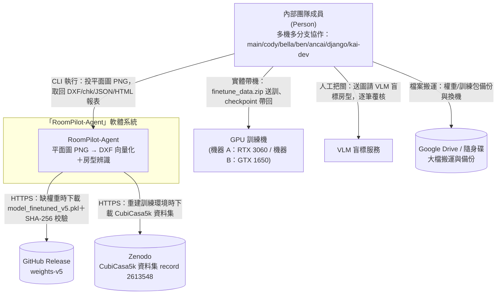

**L1 檢查清單**：
- [x] 邊界內**僅一個**系統節點
- [x] 無 GitHub repo／IDE／CI runner（GitHub 只以 **Release 權重端點**身分入圖）
- [x] 所有箭頭標協議＋動詞＋目的
- [x] 虛線＝尚未啟用 milestone（本圖無——所列外部互動全部現行）
- [x] 外部系統五類逐一盤點：資料源（Zenodo、GitHub Release）✔、交易 N/A（無金流）、推送 N/A（檔案交付）、備份（Google Drive/隨身碟）✔、雲端 IaaS N/A（全本地）——N/A 者已在 §1.1.2 表中附理由

> GPU 訓練機與 VLM 的互動主體是「人」（帶檔、覆核），非系統自動呼叫，故箭頭起點是使用者——這是刻意畫法，反映本專案無任何自動化遠端運算通道。

#### L2 — Container（Current）

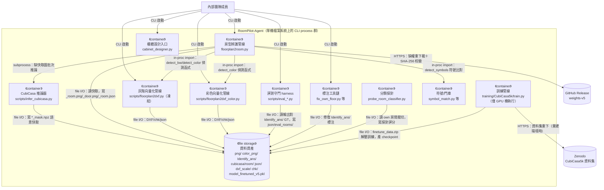

**L2 檢查清單**：
- [x] 邊界內所有 runtime container 都呈現（未來 container「自研分割推論器」因會**取代** infer，不疊畫進當前圖，改以 §1.1.2 表標記＋Future State 獨立圖呈現）
- [x] 跨 Container 箭頭都標 protocol（HTTPS / file I/O / in-proc import / subprocess / CLI）
- [x] Clean Architecture 分層不在本圖 subgraph 中（見 §1.3）
- [x] 不出現 module 名（檔名在此代表「可獨立啟動的 CLI process」身分，即 Container 本體，非其內部 module）

#### L2 — Container（Target / Future State）

所有 milestone 完成後（DINOv2 融合層接入＋floortrans 自寫替換＋商用授權淨空），**全部實線**：

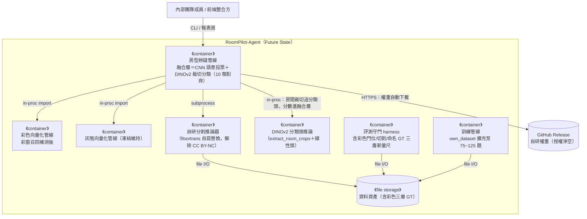

> 依 v2.16 定案：「DINOv2 接融合層」已降級為「新 GT 重評後再議」（v5 具名命中 0.788 已超 DINOv2 舊快照 0.730），但仍是 future state 的一部分——屆時須同步處理 10 類對齊（office/stair 目前未進評分與訓練）。

#### L3-A — Component（zoom: 房型辨識管線 `floorplan2room.py`）

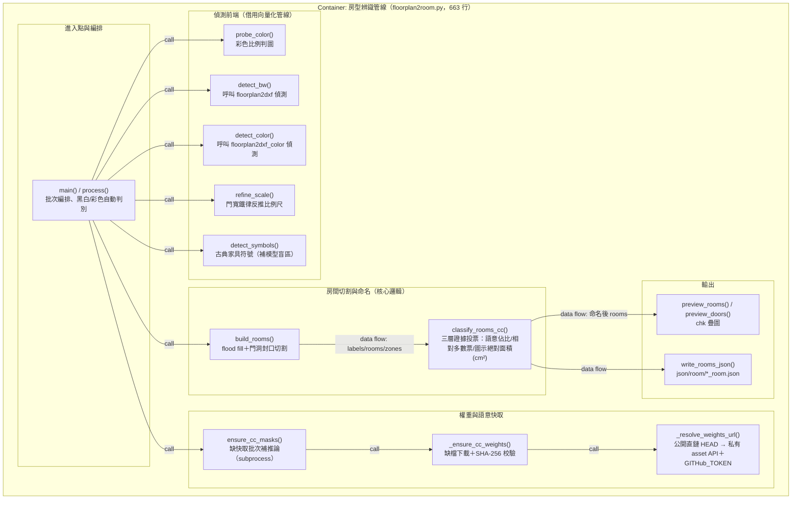

- 箭頭語意：`call`＝函式呼叫、`data flow`＝資料傳遞。
- 本圖不畫 infer_cubicasa（另一個 Container，subprocess 邊界見 System 的 Container 圖與 §3.4 sequence）。

#### L3-B — Component（zoom: 彩色向量化管線 `scripts/floorplan2dxf_color.py`）

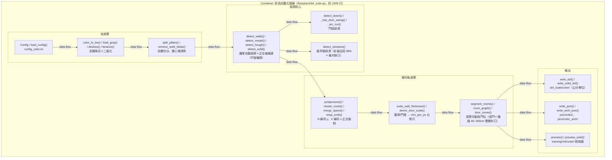

> 灰階向量化管線（`scripts/floorplan2dxf.py`）與本圖**同構**（相同函式骨架：load_gray→binarize→detect_morph/hough/solid→detect_doors/windows→postprocess→write_dxf/json/preview），已凍結不再修改，依 §1.1.2 表以本圖代表、不另出圖。輸出目錄隔離：灰階進 `training/chk/gray/`、`dxf_scale/gray/`、`json/gray/`、`json/arch/`；彩色進對應 color 子目錄，互不覆蓋。

#### L3-C — Component（zoom: CubiCasa 推論器 `scripts/infer_cubicasa.py`）

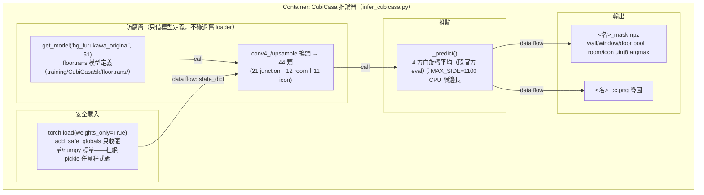

#### L3-D — Component（zoom: 訓練管線 `training/CubiCasa5k/`）

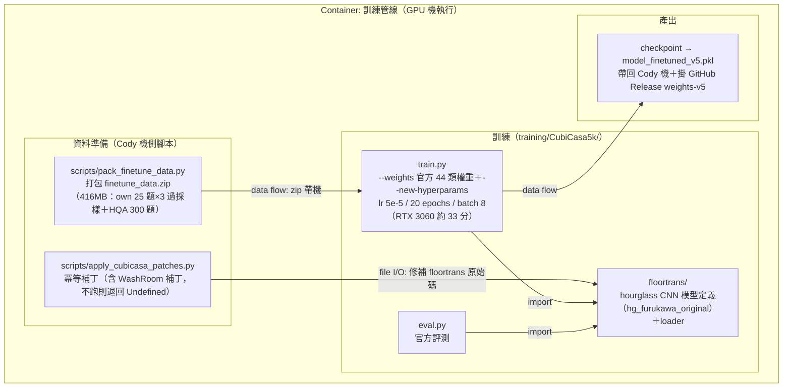

**L3 檢查清單**（四張圖逐一核過）：
- [x] 標題含父 Container
- [x] 不出現其他 Container 的內部（資料檔細節見 §4.1）
- [x] 核心邏輯（build_rooms/classify_rooms_cc、segment_rooms）無箭頭指向基礎設施模組（下載/檔案 IO 由編排層呼叫）
- [x] 箭頭語意明說（call / data flow / import / file I/O）
- [x] 虛線＝尚未實作（本四圖皆現行，無虛線；未來元件見 Future State 圖）

#### L3-X — 其他 Container 的揭露

| Container | 揭露方式 | 理由 |
| :--- | :--- | :--- |
| 灰階向量化管線 | 表代圖（§L3-B 代表） | 與彩色管線同構且已凍結 |
| 評測守門 harness | 表代圖（§3.3 職責表） | 每支 eval 腳本＝單一評分器，讀輸出、對 GT、寫 json 報表，無內部分層 |
| 標注工具鏈 | 表代圖（§3.3）＋工作流敘述 | 批次工具集合；「VLM 盲標＋人工把關」流程本質是人機工作流而非軟體結構 |
| 分類探針 | 表代圖（§3.3） | 兩支腳本一線串：extract_room_crops → probe_room_classifier |
| 符號/門庫 | 表代圖（§3.3） | 模板庫建置與比對工具集 |
| 櫃體設計入口 | 略 | 早期雛形，結構未定；定型後補圖 |
| 資料資產（檔案儲存） | 指向 §4.1 資料模型 | 純檔案儲存，components＝檔案佈局 |

#### L4 — Code

省略（單體 CLI 腳本，無類別階層可畫；`Config` dataclass 與函式簽名見各檔原始碼與 `scripts/README.md`）。類別關係詳見 [./10_class_relationships_template.md](./10_class_relationships_template.md)。

#### 1.1.3 C4 審查 Checklist（PR / milestone gate）

**結構**：
- [x] System Context／Container／Component 各至少一張圖，且一圖一層級
- [x] Component 每張圖對應且僅對應一個 Container（L3-A~D）
- [x] 每個 Container 都有對應 Component 圖或於 §1.1.2／§L3-X 說明跳過理由
- [x] 補充圖：Dynamic / Sequence Diagram 兩張（§3.4：推論含權重自動下載、訓練換機）
- [x] 補充圖：Deployment Diagram 含 Node 屬性（§5.1）

**完整性（避免 Partial Disclosure）**：
- [x] System Context 含所有外部系統（五類逐一盤點，N/A 附理由）
- [x] Container 圖含所有規劃 Container（未來項見 Future State 圖與 §1.1.2 表）
- [x] 有獨立 future state 圖
- [x] 所有 Container 與 §1.1.2 表雙向核對

**命名與語意**：
- [x] 無 C4 層級與業務層級名稱混用（§1.1.0 防呆表）
- [x] DDD 限界上下文圖箭頭採 Strategic Relationship（§1.2）
- [x] DDD 戰術元素對應表（§1.2.5）

**箭頭規範**：
- [x] 跨 Container／跨 Node 箭頭標 protocol＋動詞
- [x] Component 內部箭頭明說語意

**演進規則**：
- [x] 新增模組先決定屬哪個 Container 再畫進對應 Component 圖
- [x] 拆出新 process（如自研分割推論器）→ 先改 Container 圖，再新增 Component 圖
- [x] 架構變動同步更新結構（08）、依賴（09）、類別（10）、部署（14）——四份文件均已實例化，異動時依附錄一致性檢查表同步

---

### 1.2 DDD 戰略設計

> DDD **限界上下文** ≠ C4 **System Context**。本節上下文以「詞彙一致性邊界」劃分，與 Container 是多對多映射。

#### C4 Container ↔ DDD 限界上下文對應

| DDD 限界上下文 | 主要落在 C4 Container | 備註 |
| :--- | :--- | :--- |
| 幾何向量化上下文（牆/窗/門的像素幾何） | 灰階向量化管線、彩色向量化管線 | 詞彙：rects、T（牆厚）、mm_per_px、正交線 |
| 房型語意上下文（房間切割與命名） | 房型辨識管線、CubiCasa 推論器、分類探針、符號/門庫 | 詞彙：語意投票、三層證據、具名命中 |
| 標注/GT 上下文（人工答案的製作與守護） | 標注工具鏈、資料資產（Identify_ans/） | 詞彙：考卷、楔形 GT、盲標、逐張驗收 |
| 訓練上下文（微調與權重生命週期） | 訓練管線、GitHub Release（外部） | 詞彙：v1~v5、過採樣、驗收門檻 |
| 評測上下文（量尺與守門） | 評測守門 harness | 詞彙：own 尺/CubiCasa 尺、macro-F1、不得退化 |

#### 通用語言（術語詞彙表，必填）

| 術語 | 定義 |
| :--- | :--- |
| 考卷 | 待辨識的平面圖 PNG（`png/` 灰階、`color_png/` 彩色 29 題） |
| GT（人工答案） | `Identify_ans/` 下的人工標注：pngans/（牆窗像素 GT）、own_dataset/（訓練＋門位 GT）、own_eval/（保留評分集） |
| own 尺 / CubiCasa 尺 | 兩套房型評測量尺；v2.16 裁決目標域＝own 風格，own 尺為主尺 |
| 具名命中 | 房型命名對上 GT 具名類別的命中率（v5：0.788，52/66） |
| 門寬鐵律 | 室內門 80~95cm／雙門 160~190cm 的物理常數，`refine_scale()` 用以反推比例尺 |
| 語意快取 | `cubicasa/room/*_mask.npz`（137 檔）：CNN 推論結果快取，權重換版須全量重算 |
| 三層證據 | classify_rooms_cc 的投票策略：語意佔比→相對多數票→圖示絕對面積 |
| 盲標 | VLM 在不知 GT 的情況下標房型，人工逐筆覆核後才採用 |
| 驗收門檻 | 換預設權重的 gate：具名房型 recall 不得倒退（CubiCasa 尺基線 macro-F1 0.838） |
| 楔形 GT | 只覆蓋房間局部的標注多邊形，`rebuild_room_gt.py` 以其為標籤指針做幾何重建 |
| 過採樣 | own 25 題 ×3 重複進訓練集，對抗 HQA 300 題的數量壓制 |

#### 限界上下文圖（Strategic Context Map）

> 箭頭是 DDD Strategic Relationship，**不是** data flow / import。

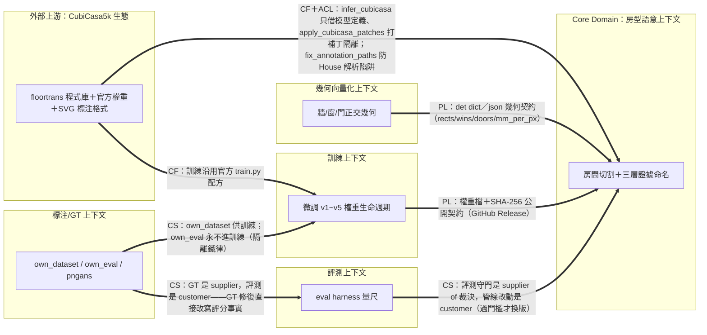

**標記縮寫**：PL＝Published Language、CS＝Customer-Supplier、ACL＝Anti-Corruption Layer、CF＝Conformist、SK＝Shared Kernel、OHS＝Open Host Service。

#### 1.2.5 DDD 戰術設計（必填）

| DDD 元素 | 程式碼位置 | 說明 |
| :--- | :--- | :--- |
| **Entity** | **缺席（刻意）** | 全管線是批次函數式轉換：PNG 進、檔案出，無「有身分且跨操作存續的可變物件」。跨執行的身分由**檔名 base**（floorXX）承擔，屬檔案系統慣例而非程式內 Entity |
| **Value Object** | `Config` dataclass（floorplan2dxf.py:34、floorplan2dxf_color.py:38）；`det` dict、rooms/zones 記錄 | 以值傳遞的偵測結果與設定；每張圖用 `replace(cfg, ...)` 產生新 copy，不共享可變狀態 |
| **Aggregate Root** | 單張圖的 `det`＋`labels`＋`rooms` 組（process() 範圍） | 一致性邊界＝一張考卷：比例尺、切割、命名必須基於同一次偵測結果 |
| **Domain Service** | `refine_scale()`、`build_rooms()`、`classify_rooms_cc()`、`segment_rooms()`、`derive_door_scale()` | 不屬單一物件的核心規則（門寬鐵律、封口切割、三層證據投票） |
| **Domain Event** | **缺席（刻意）**；最接近的是 `json/eval_rooms/*.json` 評測報表與 Readme 版次紀錄 | 無事件匯流排；「業務事實」以不可變報表檔＋版控歷史留存 |
| **Repository** | `_cc_path()`/`_cc_ok()`/`ensure_cc_masks()`（語意快取存取）；`Identify_ans/` 目錄約定 | 檔案系統即持久層；快取鍵＝圖檔 base 名 |
| **Anti-Corruption Layer** | `scripts/infer_cubicasa.py`（只借 floortrans 模型定義，不碰其過舊 lmdb/svg loader）；`scripts/apply_cubicasa_patches.py`（冪等補丁）；`scripts/fix_annotation_paths.py`（House 解析陷阱：get_polygon 尾空格、Inkscape transform 未烘焙） | 隔離 CubiCasa5k 上游程式庫與標注格式的缺陷／變動 |
| **Specification** | 門寬鐵律（80~95／160~190cm，`refine_scale`、`door_zones`）；牆縫封口 40~260cm；驗收門檻「具名 recall 不得倒退」；圖示證據閾值（toilet≥150cm² 等，classify_rooms_cc） | 集中的業務規則判斷，散落即 bug 之源 |

---

### 1.3 分層架構（Clean Architecture）

本專案是單體 CLI 腳本群，**無形式化分層框架**；下表是「邏輯視角」對應，供閱讀原始碼時定位，不代表實體目錄分層：

| 層 | 程式碼位置 | 職責 |
| :--- | :--- | :--- |
| **Domain Layer** | `build_rooms`/`classify_rooms_cc`/`refine_scale`（floorplan2room.py）；`segment_rooms`/`postprocess`/`derive_door_scale`（兩條 dxf 管線） | 幾何重建、切割、命名的核心規則——純計算，不碰網路 |
| **Application Layer** | 各檔 `main()`/`process()`/`run()`/`run_batch()`；`ensure_cc_masks()` 編排 | CLI 參數、批次迴圈、管線編排、快取決策 |
| **Infrastructure Layer** | `_ensure_cc_weights`/`_resolve_weights_url`（urllib 下載）；`write_dxf`/`write_json`/`preview_*`（ezdxf/OpenCV 檔案 IO）；`infer_cubicasa.py`（torch 載入推論） | 網路、檔案系統、模型 runtime 的外部互動 |

**關係與 C4**：Clean Arch 是邏輯分層，C4 Container 是物理 runtime——兩者不混畫（Container 圖無分層 subgraph；分層只出現在 Component 圖內作 zoom 輔助）。

### 1.4 技術選型

| 分類 | 選用技術 | 選擇理由 | 備選方案 | ADR |
| :--- | :--- | :--- | :--- | :--- |
| 語言/runtime | Python 3.10+ | 影像/DL 生態完整；團隊既有技能 | — | 未立 ADR（決策記於 Readme 版次） |
| 影像處理 | opencv-python ≥4.10,<5 | HoughLinesP、形態學齊備；**鎖 <5**：5.0 有 HoughLinesP shape 破壞性變更 | scikit-image（僅訓練側用） | requirements.txt 註記 |
| 數值 | numpy ≥2 | 生態基準 | — | — |
| DXF 輸出 | ezdxf ≥1.3 | 純 Python 寫 DXF，AutoCAD 可開，公分單位 | dxfwrite（停維護） | — |
| 語意分割 | PyTorch＋CubiCasa5k hourglass CNN（44 類） | 現成平面圖語意模型可微調；v5 own 尺 0.788 | 自研模型（future state，授權動機） | Readme v2.15「去 CubiCasa 路線」 |
| 房型分類探針 | DINOv2 ViT-S/14 凍結骨幹＋線性頭 | 131 張樣本即 0.730，資料效率高微調一個量級 | 全模型微調（資料量不足） | Readme v2.15 |
| 資料庫 | **N/A**——檔案系統即持久層 | 單機批次工具，無並發查詢需求；對應物＝`json/`、`Identify_ans/`、`cubicasa/room/` 目錄約定 | SQLite（無需求） | — |
| 快取 | `*_mask.npz` 檔案快取（cubicasa/room/，137 檔） | CPU 推論約 1 分/張，快取後既有考卷零成本 | 無 | — |
| 訊息佇列 | **N/A**——對應物＝`subprocess.run(check=True)` 同步呼叫 | 單機批次，無異步需求 | — | — |
| 容器編排 | **N/A**——直接 venv/系統 Python；`training/CubiCasa5k/Dockerfile` 為上游遺留，本專案不用 | 單機 CLI，Docker 徒增 GPU passthrough 複雜度 | Docker（訓練環境固化，未採） | — |
| 可觀測性 | `recognition_report.html`＋`json/eval_rooms/*.json`＋stdout 中文進度訊息 | 批次工具的「可觀測性」＝評測報表與檢核圖 | — | — |
| CI/CD | **N/A**——對應物＝人工評測守門流程（改動前後跑 eval_*.py）＋pytest（tests/ 6 檔） | 無遠端 CI runner；分支即機器的協作模式 | GitHub Actions（未採，權重/資料不在雲端） | — |

---

## 第 2 部分：需求摘要

> PRD 對應見 [./02_project_brief_and_prd.md](./02_project_brief_and_prd.md)（Epic A~C／US-001~US-006）；無 US 對應的 FR 改標 Readme 版次與待辦編號。

### 功能性需求

- FR-1: 灰階平面圖 PNG → DXF 向量圖（公分單位，牆/窗/門，AutoCAD 可開）（US-001；Readme、已凍結）
- FR-2: 彩色平面圖 PNG → DXF（現行開發重點；彩窗召回為最大缺口）（US-002；待辦 2）
- FR-3: 房間切割（flood fill＋門洞封口）＋房型命名（CNN 語意三層證據投票）（US-003；floorplan2room.py）
- FR-4: 權重缺檔自動下載＋SHA-256 校驗——部署機設 GITHUB_TOKEN 即 clone 後全自動（US-005；v2.16）
- FR-5: 品質檢核圖（training/chk/{gray,color,room}/*_chk.png）與 HTML 辨識報表（recognition_report.html）（US-001/US-003）
- FR-6: 評測守門——每次改動前後對 GT 跑分，防退化（.claude/rules 評測鐵律）
- FR-7: 標注製作/修復工具鏈（VLM 盲標＋人工把關）（US-004；待辦 4、5）
- FR-8: CubiCasa5k 微調訓練換機工作流（US-006；docs/HANDOVER_finetune_v5.md）
- FR-9: 櫃體設計入口（cabinet_designer.py，早期）

### 非功能性需求

| 分類 | 需求描述 | 目標值 |
| :--- | :--- | :--- |
| 性能 | CPU 語意推論（無 GPU 的 Cody 機） | 約 1 分/張（MAX_SIDE=1100 限邊長）；既有考卷走快取＝0 |
| 性能 | GPU 微調訓練 | RTX 3060 約 33 分鐘/20 epochs |
| 品質門檻 | 換預設權重 gate | 具名房型 recall 不得倒退（own 尺為主尺；現行 v5 具名命中 0.788） |
| 品質門檻 | chk/dxf 邏輯改動 gate | 先跑 `eval_windows.py` 對 pngans/ 評分，不得退化後覆蓋（現行灰窗 96%/96%、灰牆 F1 0.99） |
| 可擴展性 | own_dataset 擴充 | 50~100 題（VLM 盲標＋人工把關工作流） |
| 可用性 (SLA) | **N/A**——單機 CLI 無線上服務；對應物＝權重下載失敗時優雅降級（跳過語意辨識，房型退回面積規則，不 crash） | — |
| 安全性 | 秘密管理／供應鏈 | GITHUB_TOKEN 只走環境變數；權重 SHA-256 校驗；`torch.load(weights_only=True)` 防 pickle 任意程式碼；opencv 鎖 <5 |
| 合規 | 授權 | CubiCasa5k 系權重禁商用（CC BY-NC），商用部署前必須替換（見 §7.1） |

---

## 第 3 部分：系統設計

### 3.1 架構模式

- **模式**: 單機批次管線（pipeline of CLI processes）＋檔案系統契約。各 Container 以檔案（PNG/npz/json/DXF）為介面鬆耦合；房型辨識管線例外地以 in-proc import 重用偵測函式（避免重複實作偵測邏輯）、以 subprocess 隔離 torch runtime（floortrans 的 sys.path/chdir 副作用不污染主程序）。
- **選擇理由**: 使用者是內部團隊、輸入輸出皆檔案，無並發/服務需求；檔案契約讓每一段可獨立重跑、獨立評測（評測 harness 直接讀中間產物），也讓多機多分支協作只需 git＋大檔搬運。

### 3.2 系統元件圖

引用 §1.1 的 C4 圖，不重複貼。

### 3.3 元件職責

| 元件（Container） | 核心職責 | 技術 | 依賴 |
| :--- | :--- | :--- | :--- |
| 灰階向量化管線 | 黑白 PNG→DXF；正交線重建、牆厚自動偵測、窗/門符號偵測 | OpenCV/ezdxf | config.ini；資料資產 |
| 彩色向量化管線 | 彩色 PNG→DXF；color_to_bw 降灰後同構流程；輸出 color 子目錄隔離 | OpenCV/ezdxf | config_color.ini；資料資產 |
| 房型辨識管線 | 判黑白/彩色→偵測→門寬鐵律修比例尺→切割→三層證據命名→疊圖/JSON | Python | 兩條向量化管線（in-proc）、CubiCasa 推論器（subprocess）、符號/門庫、GitHub Release |
| CubiCasa 推論器 | PNG→44 類語意 argmax→*_mask.npz＋疊圖；4 向旋轉平均 | PyTorch＋floortrans 模型定義 | model_finetuned_v5.pkl、training/CubiCasa5k/floortrans/ |
| 評測守門 harness | 對 GT 評分防退化：eval_windows（牆窗）、eval_rooms_cc（切割/命名，--own-eval/--gt-seg）、eval_color_walls、eval_doors/eval_door_match（門位）、eval_cc_masks、score_compare | Python | Identify_ans/ GT、各管線輸出 |
| 標注工具鏈 | GT 製作/修復：路徑修復（transform 烘焙）、逐層修復、幾何重建、草稿產生、標籤同步、review.html 人工覆核 | Python/SVG | Identify_ans/ |
| 訓練管線 | 微調 v1~v5：補丁→打包→GPU 機訓練→checkpoint 帶回 | PyTorch（GPU） | finetune_data.zip、官方 44 類權重、Zenodo 資料集 |
| 分類探針 | 房間裁切→DINOv2 線性頭分類（具名 0.730）；去 CubiCasa 路線探針 | PyTorch/DINOv2 | own_dataset 131 房裁切 |
| 符號/門庫 | 家具/門符號模板庫建置與比對（door_propose 提名門位） | OpenCV | 資料資產 |
| 櫃體設計入口 | 櫃體設計（早期入口） | Python | 待確認（雛形階段） |
| 資料資產 | 考卷、GT、快取、報表、DXF/chk 輸出、權重的檔案佈局契約 | 檔案系統 | — |

### 3.4 關鍵使用者旅程（Dynamic Diagrams，必填）

#### Use Case 1：floorplan2room 推論流程（含權重自動下載）

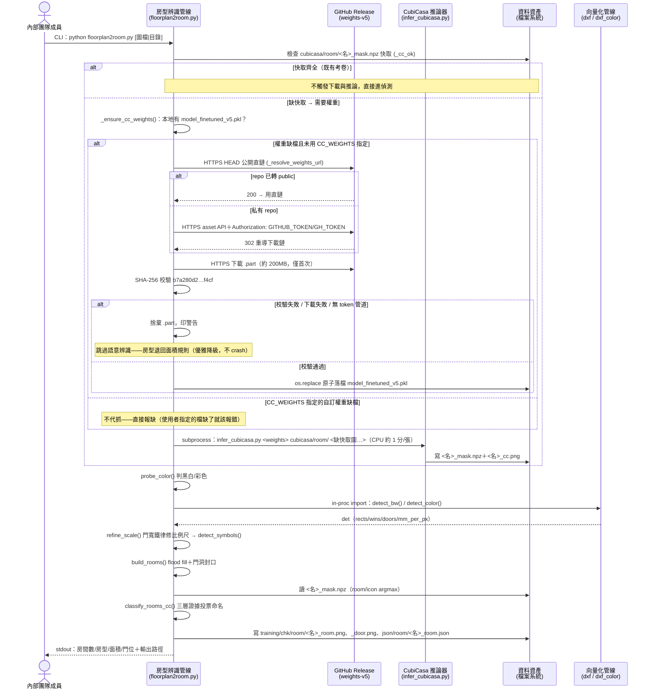

#### Use Case 2：微調訓練換機流程（Cody 機 ↔ GPU 機）

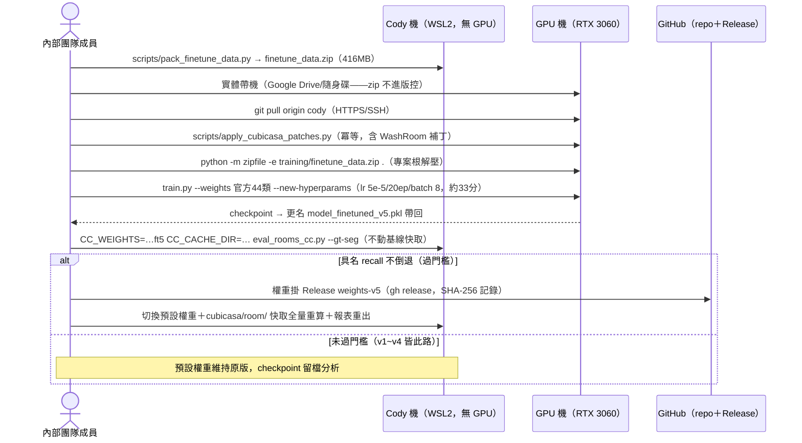

**規則核對**：每個 use case 一張圖 ✔；protocol／actor／sync-async（subprocess＝同步等待、下載＝阻塞式）標明 ✔；失敗分支以 `alt` 呈現 ✔。

---

## 第 4 部分：資料架構

### 4.1 資料模型（ER 圖）

無資料庫；「資料模型」＝檔案產物間的引用關係（鍵＝圖檔 base 名，如 floor01）：

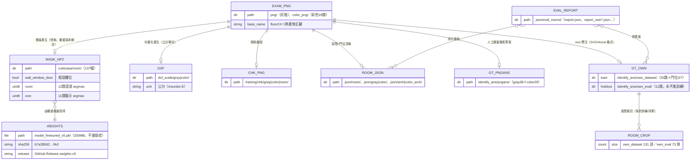

### 4.2 一致性策略

- **強一致（同步鐵律）**: ① 權重版本 ↔ 語意快取：換預設權重時 `cubicasa/room/` 137 檔**全量重算**，並同步重出四報表＋recognition_report.html（v2.16 已執行）；② 單張圖內比例尺/切割/命名必須出自同一次偵測（Aggregate 邊界，見 §1.2.5）；③ 下載落檔用 `.part`＋`os.replace` 原子替換，殺進程不留半檔。
- **最終一致（人工節奏）**: GT 修復 → 各評測報表重跑之間允許時間差（報表檔標注所用量尺與 GT 版本）；多機分支各自產出，經 main PR 匯流後對齊。
- **隔離鐵律**: `own_eval/` 12 題**永不進訓練集**（評測公正性）；灰階/彩色輸出目錄完全隔離不互相覆蓋。

### 4.3 資料分類與合規

- **PII**: 無個資——資料全為建築平面圖與幾何標注，無人名/地址欄位。
- **秘密**: `GITHUB_TOKEN`/`GH_TOKEN`（PAT，密碼等級）只以環境變數提供，程式碼與版控零出現（.claude/rules/security.md）。
- **授權合規（本專案最重合規項）**: CubiCasa5k repo CC BY-NC 4.0、資料集 CC BY-NC-SA 4.0——官方權重與微調 v1~v5 **全繼承禁商用**；`model_finetuned_v5.pkl` 只限內部使用，商用部署前必須完成去 CubiCasa 替換（§7.2 Phase 3）。
- **保留策略**: 大檔不進版控（gitignore `/model_finetuned_*.pkl`；GitHub 100MB 硬限）；可重下資產（CubiCasa5k 資料集 5.6GB）清理後以 Zenodo 為源復原；GT（Identify_ans/）進版控為單一事實來源。

---

## 第 5 部分：部署與基礎設施

### 5.1 部署視圖（C4 Deployment Diagram）

#### 5.1.1 當前環境 Deployment（推論：Cody 機／訓練：GPU 機）

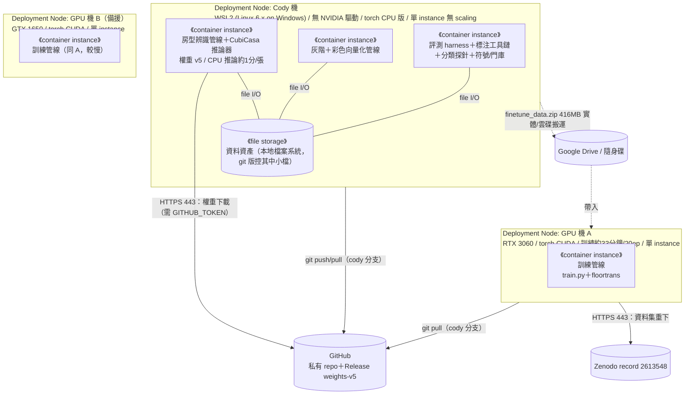

| 屬性 | 值 |
| :--- | :--- |
| Deployment 模式 | git clone＋pip install -r requirements.txt＋設 GITHUB_TOKEN → 首跑自動下權重（零手動佈署腳本） |
| 高可用 | N/A（單機批次工具）；GPU 機 A/B 互為訓練備援 |
| Backup | GT/程式碼走 git；權重走 GitHub Release；大檔（finetune_data.zip、資料集）走 Google Drive/隨身碟，training.zip 已於 2026-07-22 重打包（約 8.2GB） |
| 監控 | N/A 線上監控；對應物＝stdout 進度＋chk 檢核圖＋json/eval_rooms/ 報表＋recognition_report.html |

#### 5.1.2 目標環境 Deployment（對應 §1.1.2.5 Future State）

| 差異項 | 目標狀態 |
| :--- | :--- |
| 推論權重 | 自研分割推論器權重（授權淨空）掛 GitHub Release；repo 若轉 public，下載連 token 都不需要（`_resolve_weights_url` 直鏈路徑已就緒） |
| 推論節點 | 仍為單機 CLI；前端整合方 clone 即用（v2.16「前端 clone 即可用」已驗證此路徑），前端形態待確認 |
| 訓練節點 | GPU 機 A/B 不變；own_dataset 擴充後訓練資料包更大，搬運通道不變 |
| 分類頭 | DINOv2 線性頭權重極小（線性層），可直接進版控，無 Release 需求（待確認實際檔案大小） |

物理拓撲與 5.1.1 相同（無新增 Node），故不重複出圖——差異全在 instance 內容物，如上表。

#### 5.1.3 環境策略

| 環境 | Deployment | 用途 |
| :--- | :--- | :--- |
| Dev（＝各機工作分支） | Cody/bella/ben/ancai/django/kai-dev 各機一分支，本地檔案系統 | 開發與標注；**分支即機器** |
| Staging | **N/A**——對應物＝評測守門：改動在本機對 GT 跑分過門檻才可 PR | 防退化 gate |
| Production（＝main 分支） | main 經 PR 匯流；任何 clone＋GITHUB_TOKEN 即為可用部署 | 團隊共用的穩定版 |

### 5.2 CI/CD 流程

無遠端 CI/CD（N/A 理由：權重與大量資料不在雲端、評測需本地 GT）；對應物為**人工守門流程**：

| 階段 | 步驟 |
| :--- | :--- |
| Build | N/A（無編譯）；環境＝`pip install -r requirements.txt`（opencv 鎖 <5） |
| Test | ① pytest（tests/ 6 檔：conftest、test_cc_weights_download、test_eval_rooms_cc、test_eval_rooms_own、test_annotation_drafts、test_symbol_match）② 評測鐵律：改 chk/dxf 邏輯前後跑 `eval_windows.py` 對 pngans/，不得退化後覆蓋 ③ 換權重跑 `eval_rooms_cc.py --gt-seg` 過驗收門檻 |
| Deploy | main PR 匯流（WHY/WHAT/IMPACT commit 規範）→ 其他機器 git pull；權重換版＝掛 Release＋快取全量重算＋報表重出 |

### 5.3 成本估算

| 項目 | 月成本 | 備註 |
| :--- | :---: | :--- |
| 運算 | 0 元（自有硬體） | Cody 機＋GPU 機 A/B 皆既有設備；電費未列管 |
| 儲存/託管 | 0 元 | GitHub 私有 repo＋Release（免費額度內）；Google Drive 既有帳號 |
| 外部 API | 0 元 | Zenodo 免費；VLM 盲標成本依當次作業（47 筆覆核約 20 分鐘人工，API 費用待確認） |
| 最大隱性成本 | 人工 | 標注/覆核工時（own_dataset 擴充 50~100 題為主要投入） |

---

## 第 6 部分：跨領域考量

### 6.1 可觀測性

| 維度 | 工具 | 狀態 |
| :--- | :--- | :--- |
| 日誌 | stdout 中文進度訊息（判別/房間/輸出路徑/批次統計）；無結構化日誌框架 | 現行；批次結尾統計「成功/分割失敗/錯誤」 |
| 指標（SLI/SLO） | json/eval_rooms/*.json 評測報表＋recognition_report.html（四層級成功率盤點，支援深色模式） | 現行；門檻＝具名 recall 不倒退、eval_windows 不退化 |
| 追蹤 | N/A——單機同步管線無分散式追蹤需求；對應物＝chk/ 檢核疊圖（每階段視覺可追） | 現行 |
| 告警 | N/A——批次工具；對應物＝下載失敗/校驗失敗/分割失敗的 stdout 警告＋非零統計 | 現行 |

### 6.2 安全性

- **威脅模型**：主要面向供應鏈與秘密——(1) 權重檔投毒：SHA-256 硬編碼校驗＋`torch.load(weights_only=True)`＋`add_safe_globals` 白名單（只收張量/numpy 標量），杜絕 pickle 任意程式碼；(2) 依賴破壞性變更：opencv 鎖 `<5`；(3) token 洩漏：GITHUB_TOKEN 僅環境變數、勿進版控，暴露即輪換（.claude/rules/security.md）。
- **認證授權**：N/A 使用者層認證（單機 CLI）；對外僅 GitHub asset API 的 PAT Bearer 認證。
- **機密管理**：環境變數（GITHUB_TOKEN/GH_TOKEN）；`CC_WEIGHTS` 指定自訂權重時缺檔**不代抓**（防默默換檔）。
- **網路安全**：唯二對外連線＝GitHub Release（HTTPS，HEAD 探測＋302 重導控制 `_NoRedirect`）與 Zenodo（HTTPS，人工操作）；無入站連線。
- 輸入驗證：影像檔副檔名白名單（IMG_EXTS）；House/SVG 標注解析經 fix_annotation_paths 修復鏈防格式陷阱。

---

## 第 7 部分：風險與演進

### 7.1 風險登記

| 風險 | 可能性 | 影響 | 緩解策略 |
| :--- | :--- | :--- | :--- |
| **授權**：CubiCasa5k 系權重禁商用（CC BY-NC 繼承 v1~v5） | 確定（已實錘） | 商用即侵權 | 商用前必須替換：DINOv2 探針路線＋floortrans 自寫替換（待辦 7）；內部使用期間明示限制 |
| 彩窗召回 38%（全系統最低） | 確定（現況） | 彩色 DXF 窗件大量漏報 | 待辦 2：牆段配對 gap 與 covered 門檻的線寬適配調參；改前後 eval 守門 |
| opencv-python 5.0 破壞性變更（HoughLinesP shape） | 中 | 兩條向量化管線壞掉 | requirements 鎖 `>=4.10,<5`；升版須全量評測 |
| GitHub Release 私有下載依賴 GITHUB_TOKEN | 中 | 新部署機權重拉不下來 | 優雅降級（面積規則）＋清楚警告；repo 轉 public 即零設定；token 輪換 SOP |
| GT 缺口：彩色管線門位/切割/命名三層無 GT | 高 | 彩色管線改動無守門，退化不可見 | 待辦 5：沿 VLM 盲標＋人工把關低成本建集 |
| House 解析陷阱回歸（get_polygon 尾空格、transform 未烘焙） | 低（已修＋防回歸測試） | 標注隱形、訓練資料殘缺（v1~v4 教訓） | emitter 修正＋110 處補救＋tests 防回歸；新標注一律過 fix_annotation_paths |
| 單點資料資產（大檔不進版控） | 中 | 機器故障丟失 finetune_data/權重 | 權重掛 Release；zip 走雲碟；training.zip 已於 2026-07-22 重打包（約 8.2GB），換機前確認備份是否最新 |
| 門位精準率 0.576（118 候選 50 誤報） | 確定（現況） | 門位 JSON 下游可信度低 | 待辦 6；fused R 0.868 先保召回，逐步收精準 |

### 7.2 演進路線

| Phase | 範圍與目標 |
| :--- | :--- |
| Phase 1（現況收尾，v2.16 待辦 2/3/6） | 彩窗召回 38%→補洞（最大真實破口）；切割收尾（floor60 GT 牆補封、開放空間語意分界）；門位精準率 0.576 收斂 |
| Phase 2（資料放大，待辦 4/5＋降級項 1） | own_dataset 擴充 50~100 題＋彩色 30 題標注草稿人工修正；彩色門位/切割/命名 GT 建集；新 GT 重評後裁決 DINOv2 融合層是否接入（含 10 類對齊——office/stair 進評分與訓練） |
| Phase 3（授權淨空，長期待辦 7） | floortrans 解析自寫替換＋自研分割權重，解除 CC BY-NC 禁商用 → 達成 §1.1.2.5 Future State，開放商用部署與前端整合 |

---

## 第 8 部分：模組詳細設計

詳見 [./07_module_specification_and_tests.md](./07_module_specification_and_tests.md)（模組規格之單一事實來源；輔以 `scripts/README.md`＋各檔 docstring）。

### NFR 實現

- 性能: 語意快取（npz，一次推論終身重用）＋MAX_SIDE=1100 CPU 限邊長＋`torch.set_num_threads(cpu_count)`；批次一次 subprocess 補齊缺快取（省 torch 啟動成本）。
- 安全: SHA-256 校驗＋weights_only 載入＋token 環境變數化＋`.part` 原子落檔（詳 §6.2）。
- 可擴展: 檔案契約鬆耦合——新管線只需遵守目錄/JSON 約定即可接入評測 harness；`CC_WEIGHTS`/`CC_CACHE_DIR` 環境變數正交，多權重版本可並存評測互不污染。

---

## 變更紀錄

| 版本 | 日期 | 變更 |
| :--- | :--- | :--- |
| v1.0 | 2026-07-25 | 初版：依 v2.16 現況實例化（C4 全套、DDD 戰略/戰術、兩張 sequence、Cody/GPU 部署、future state） |

---

## 附錄：跨文件一致性檢查表

本文件變更後，**強制**檢查以下文件是否同步（編號＝VibeCoding 模板序，01~17 均已實例化）：

| 異動類型 | 應同步更新 |
| :--- | :--- |
| 新增 Container（如自研分割推論器落地） | 08（結構）、09（依賴）、14（部署）＋本文件 §1.1.2/§5.1 |
| 新增 module | 07（模組規格）、08（結構）、09（依賴）、10（類別） |
| 新增外部系統（如 VLM 供應商固定化） | 06（API/CLI 契約）、13（安全）、14（部署） |
| 變更 protocol（如權重改走 public 直鏈） | 06、13、14＋本文件 §3.4 sequence |
| 變更 DDD 限界上下文（如彩色 GT 三層量尺上線） | 02（PRD-Epic）、07（模組規格）＋本文件 §1.2 |
| 換預設權重 | 本文件 §4.2 強一致清單（快取全量重算＋報表重出）＋Readme 版次紀錄 |

**鐵律**：05 是架構契約——任何模組在 05 沒出現，等於不存在。若其他文件提到、05 沒提到 → **05 有 bug，不是其他文件多寫**。
