# 架構與設計文件 - RoomPilot-Agent

> 本文件由 VibeCoding 模板 05_architecture_and_design_document.md 導入 RoomPilot-Agent 生成 | 基準分支 bella-local-20260726 | 2026-07-26

> **版本:** v1.0 | **更新:** 2026-07-26 | **狀態:** 草稿
>
> **v2.0 模板修訂（2026-05-26）**：依「四層共振戰法 backtest_platform」實戰經驗回灌，補齊 C4 嚴格規則、命名防呆、Sequence/Deployment 必填、DDD 戰略+戰術雙層、跨文件一致性 checklist。
>
> 衝突時優先序（沿用 `docs/RoomPilot_現行版本總覽.md` 的規則）：自動化測試 > 可執行程式 > 正式契約（`docs/contracts/`）> 本文件。本文件任何敘述與程式碼不符時，以程式碼為準並回報修訂。

---

## ⚠️ 使用前須讀：常見地雷

新手套用本模板最常踩的坑（按嚴重程度排序）：

1. **C4 L1–L4 與業務 layer 撞名** — RoomPilot 的業務流程叫「十步驟 1–10」，與 C4 縮放層級 L1–L4 是兩套編號。**解法**：見 §1.1.0 命名防呆表
2. **L2 把 Python 檔當 Container** — `scene_service.py` 不是 Container。**Container = runtime / process，不是 module**
3. **L3 跨 Container** — 一張 L3 圖只准畫一個 L2 Container 的內部
4. **Partial Disclosure** — L1 缺 OpenRouter / 遠端渲染供應商 / unpkg CDN 等「不是主流程但會用到」的外部系統
5. **DDD 限界上下文圖箭頭畫成 data flow** — DDD Context Map 箭頭應是 Strategic Relationship（CS / ACL / SK / PL）
6. **缺 Sequence Diagram** — 文字流程不算 Dynamic Diagram
7. **Deployment 與 L2 混用** — Deployment 是 L2 的「實體化」，要含 Node 屬性與 instance 標記
8. **箭頭無 protocol 標籤** — 看不出是 HTTPS / SQL / file I/O
9. **跨文件不一致** — 本文件與 `docs/RoomPilot_現行版本總覽.md`、`docs/contracts/` 六份契約互相打臉時，依上方優先序處理
10. **沒有 future state** — 只畫當前，看不出 PostgreSQL 接入等 milestone 終點

---

## 第 1 部分：架構總覽

### 1.1 C4 模型（嚴格版）

#### 1.1.0 命名防呆（必填）

| 術語 | 指什麼 | 勿混淆 |
| :--- | :--- | :--- |
| **C4 L1–L4** | 架構圖縮放層級（情境 → 容器 → 元件 → 程式碼） | ≠ RoomPilot 業務「十步驟 1–10」（建立專案→…→AI 渲染） |
| **C4 Context（L1）** | RoomPilot-Agent 整體相對外界 | ≠ DDD「限界上下文」（§1.2 的六模組分工） |
| **C4 Container（L2）** | 可獨立執行的 runtime（uvicorn process、瀏覽器頁面、SQLite 檔、Vite dev server） | ≠ Python package（`backend/agent/` 等是 L3 Component） |
| **C4 Component（L3）** | **單一** L2 容器內的模組（對應 `backend/` 下的套件） | 禁止跨容器畫在同一張 L3 |
| **業務「步驟」** | `scene_workflow.js` 的 11 個內部步驟 / UI 的 10 顆按鈕 | ≠ C4 任何層級；本文件寫步驟時一律用步驟名（如 `layout_2d`），不裸寫數字 |

> **規則**：本文件 C4 章節提到層級一律寫全稱（`System Context` / `Container` / `Component`），業務流程一律寫步驟名。

#### 1.1.1 層級規則

| 層級 | 英文名 | 一張圖只回答 | 方塊必須是 | 禁止 |
| :---: | :--- | :--- | :--- | :--- |
| **L1** | System Context | 誰在用系統？與哪些外部系統互動？ | 人、本軟體系統（**一個**邊界）、外部系統 | 內部模組、檔名、GitHub/IDE 等開發工具 |
| **L2** | Container | 系統內有哪些 **runtime**？ | Process、DB、檔案儲存、排程服務、UI | 把 module 當容器；用抽象「資料平面」當 C4 元素 |
| **L3** | Component | **某一個** L2 容器內部怎麼拆？ | 模組 / package（對應 repo 路徑） | 跨容器 zoom；一張圖混多容器內部 |
| **L4** | Code | 類別 / 函式（可選） | class、function | 小專案可省略 |

**層級關係**：樹狀 zoom-in（父 → 子），**不是**執行序列。

#### 1.1.2 Container 清單（必填）

| Container | 類型 | 技術 | 何時啟用 | L3 圖 |
| :--- | :--- | :--- | :---: | :---: |
| FastAPI 應用伺服器 | Web 應用 process | Python ≥3.12、FastAPI ≥0.115、uvicorn ≥0.30；入口 `backend.server.main:app`（main.py:144，共 44 條路由） | 現行 | ✅ §L3-A |
| 瀏覽器十步驟前端 | 瀏覽器內 runtime | 原生 ES module、three 0.165.0（unpkg importmap）；`scene.html` + `scene_v2.js`（8,544 行）等 4 頁靜態頁 | 現行 | ✅ §L3-B |
| frontend3d DXF 檢視器 | 開發用前端 runtime（Vite dev server + 瀏覽器 R3F 應用） | React 18.3.1、@react-three/fiber 8、three 0.160.1、Vite 8.1.0；proxy `/api` → `http://localhost:8002` | 半退役：後端註解稱 retired，但對口路由存活；`npm install` 實測 ERESOLVE 失敗、依賴未裝，現況無法啟動（去留待裁決，見 12 §0） | 表代圖，見 §L3-X |
| 專案儲存 SQLite | 內嵌資料庫（同 process 檔案） | SQLite WAL；`.runtime/projects.sqlite3`（project_store.py:84、93） | 現行 | 表代圖 → §4.1 ER |
| 問卷視覺索引 SQLite | 內嵌查詢索引 | SQLite；`.runtime/indexes/questionnaire_visuals.sqlite3`（main.py 惰性建立）；資料來源是版控 JSON，索引可重建 | 現行 | 略（純索引，無業務 schema） |
| PostgreSQL `roompilot_db` | 資料庫 | PostgreSQL + pg_trgm；schema 見 `scripts/sql/roompilot_postgresql_schema.sql` | 資料工程階段；**執行期 API 未接**（main.py 不連 Postgres） | 表代圖 → §4.1 ER |
| 型錄匯入批次 | 批次 CLI process | `scripts/sql/import_official_catalog_to_postgres.py`（psycopg2、單一交易 UPSERT、`--dry-run`/`--prune-extra`） | 手動執行 | 略（單一腳本） |

**外部系統清單**（獨立列出，避免 partial disclosure）：

| 類別 | 外部系統 | 依據 |
| :--- | :--- | :--- |
| 資料源（3D 模型原始儲存） | AWS S3 bucket `roompilot-furniture-glb-prod-825555019055-ap-east-2-an`（區域 ap-east-2） | manifest CSV `backend/catalog/data/manifests/glb_upload_all_result.csv`（9,350 資料列，實測 9,351 行含表頭） |
| 遞送 CDN | AWS CloudFront `https://ddgsm1yg3xikc.cloudfront.net`（cloud_models.py:34；`ROOMPILOT_CLOUDFRONT_BASE_URL` 可覆寫） | GLB 唯一正式遞送管道，預設模式 `cloudfront` |
| 前端函式庫 CDN | unpkg（`scene.html` 與 `library.html` importmap 載入 three@0.165.0） | scene.html:787-788、library.html:164-165 |
| LLM 服務 | OpenRouter API（預設模型 `qwen/qwen3-32b:free`；intake 與場景規劃兩個獨立開關，見 §6.2） | intake_service.py、scene_service.py |
| 遠端渲染供應商 | `ROOMPILOT_RENDER_PROVIDER_URL` 指定之 HTTP 服務；未設定回 503 | render_service.py:42-44；契約 `docs/contracts/REMOTE_RENDER_CONTRACT.md` |
| 交易 | 無（本系統無金流；成本概算 `/api/cost/estimate` 用版控內台灣行情，不外呼） | main.py:2759 |
| 備份 | 離線 GLB 備援 zip（1,517 個 GLB，SHA-256 驗證腳本 `scripts/verify_ikea_offline_backup.py`）；屬本地備援非外部服務 | README.md L230-241 |
| 雲端 IaaS | AWS（僅 S3 + CloudFront；無自管 EC2 等運算資源）（未查證：AWS 帳務與其他資源） | manifest CSV |

#### 1.1.2.5 Future State（必填）

已知 milestone（依 `docs/RoomPilot_現行版本總覽.md` L158-165「尚未接入」清單與 `scripts/sql/` 現況）：

1. **PostgreSQL 接入執行期 API** — 現在只有離線 importer，伺服器執行期型錄仍從 JSON+CSV 載入記憶體
2. **遠端渲染供應商實際接通** — 契約與端點已就緒（202/502/503 行為已實作），供應商尚未設定
3. **`backend/spatial_data/` 實作** — 現為 `.gitkeep` 佔位，無任何程式
4. **`LAYOUT_EVALUATION_SCHEMA` 正式 API 化** — 契約已寫（`docs/contracts/LAYOUT_EVALUATION_SCHEMA.md` 自標「尚未完整接入 API」），現行 `/api/scene/validate` 只回 ok 與 reason

Future state 的 L2 圖見下方「L2 — Container（Target / Future State）」。

#### L1 — System Context

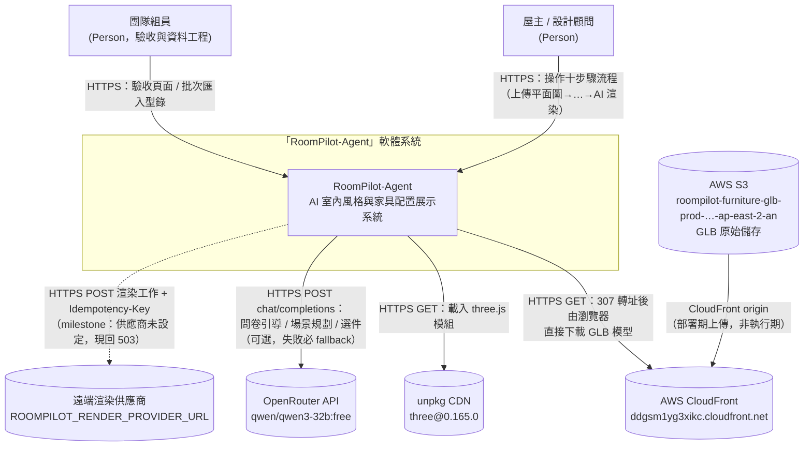

**L1 檢查清單**：
- [x] 邊界內**僅一個**系統節點
- [x] 無 GitHub / IDE / CI runner
- [x] 所有箭頭標協議 + 動詞 + 目的
- [x] 虛線 = 尚未啟用 milestone（遠端渲染供應商）
- [x] 外部系統覆蓋：資料源（S3）、交易（無，已註明）、遞送（CloudFront/unpkg）、備份（本地 zip，表列註明）、雲端 IaaS（AWS）

#### L2 — Container（Current）

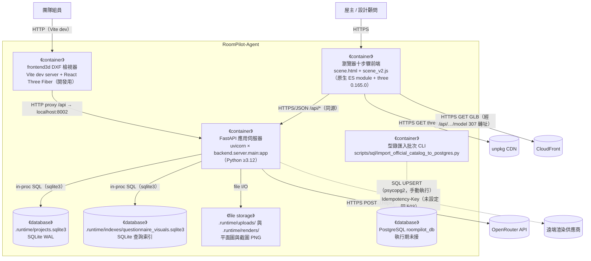

**L2 檢查清單**：
- [x] 邊界內所有 runtime container 都呈現（含執行期未接的 PostgreSQL，虛線箭頭）
- [x] 跨 Container 箭頭都標 protocol
- [x] Clean Architecture 分層不在 L2 subgraph 中（寫 §1.3）
- [x] 不出現 module 名（`backend/agent/` 等留給 L3）

補充事實（查證於 backend/server/）：全 `backend/` 無任何 CORS 或 middleware 設定（`grep -rn 'cors\|add_middleware'` 零命中）；瀏覽器前端與 API 同源（靜態頁由 FastAPI 直接掛載 `/static`），frontend3d 則靠 Vite proxy 避開跨域。

#### L2 — Container（Target / Future State）

所有 milestone 完成後（全部實線）：

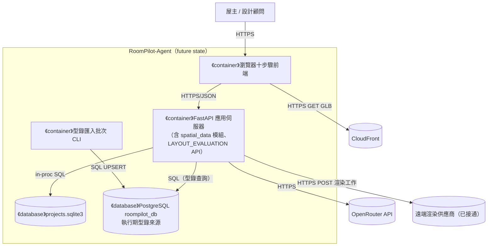

（future state 中 frontend3d 是否保留未裁決——後端 main.py:2072 已稱其 retired；圖中省略，裁決後回填。）

#### L3-A — Component（zoom: FastAPI 應用伺服器）

Component = `backend/` 下的 Python 套件（實測 `.py` 檔數：server 12、floorplan 19、upgrade3d 2、agent 4、catalog 3、engine 8；`spatial_data/` 僅 `.gitkeep` 無程式）。

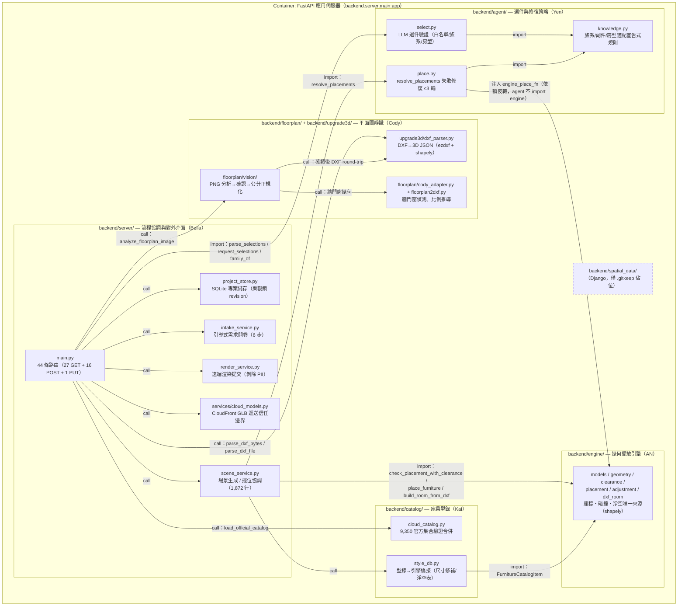

**L3-A 檢查清單**：
- [x] 標題含父 Container
- [x] 不出現其他 Container 的內部（SQLite schema 在 §4.1）
- [x] 箭頭語意明說（import / call）
- [x] 虛線 = 尚未實作（`spatial_data`）
- 依賴方向要點（皆經 grep import 實證）：`backend/agent/` 只 import stdlib + 自身 `knowledge`，不依賴 server/engine/網路；引擎重擺函式由 `scene_service.py` 以 `engine_place_fn` 閉包注入 `resolve_placements`（scene_service.py:1752）。實際 LLM 網路呼叫全部在 server 層（`intake_service.py`、`scene_service.py` 的 `_openrouter_request`）。

#### L3-B — Component（zoom: 瀏覽器十步驟前端）

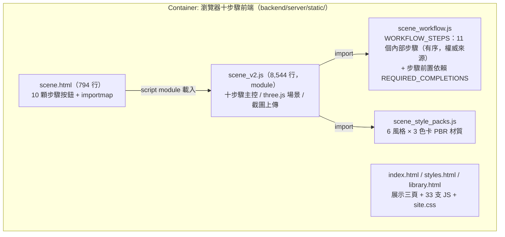

補充事實：步驟「順序」的唯一有序來源是 `scene_workflow.js:4-16`（11 步含 `calibration`；`recognition` 與 `calibration` 共用同一 `scale` 面板故 UI 只顯示 10 顆按鈕）；伺服器端 `main.py:113-125` 的 `WORKFLOW_STEPS` 是同名集合（無序），只驗步驟名不驗順序——**步驟前置檢查僅在前端強制**（風險見 §7.1）。

#### L3-X — 其他 Container 的揭露

| Container | L3 處理 | 理由 |
| :--- | :--- | :--- |
| frontend3d DXF 檢視器 | 表代圖 | 僅 6 個 src 檔共 960 行：`App.jsx`（狀態與 4 個 fetch）→ `Scene.jsx`（牆體 Extrude + X-ray shader）→ `Furniture.jsx`（GLB 擺放互動）→ `snap.js`（純 2D 吸附，無 three 依賴） |
| 專案儲存 SQLite | 表代圖 → §4.1 ER | DB 的 components = tables |
| 問卷視覺索引 SQLite | 略 | 可重建索引，資料真源是 `backend/server/data/questionnaire_visual_catalog.json` |
| PostgreSQL | 表代圖 → §4.1 ER | 同上 |
| 型錄匯入批次 CLI | 略 | 單一腳本（354 行），流程見 `scripts/sql/README.md` |

#### L4 — Code

省略。類別／函式層級請直接讀 `backend/engine/models.py`（座標契約 docstring）與 `docs/contracts/` 六份契約；類別關係文件見 `docs/vibecoding/10_class_relationships_template.md` 導入版。

#### 1.1.3 C4 審查 Checklist（PR / milestone gate）

**結構**：
- [x] L1–L3 各至少一張圖，一圖一層級
- [x] L3 每張圖對應且僅對應一個 L2 Container
- [x] 每個 L2 Container 都有對應 L3 或明確跳過理由（§L3-X）
- [x] 至少一張 Sequence Diagram（§3.4，三張）
- [x] Deployment Diagram 含 Node 屬性（§5.1）

**完整性**：
- [x] L1 含所有外部系統（§1.1.2 外部系統清單五類逐一核對）
- [x] L2 含所有規劃中的 Container（PostgreSQL 虛線）
- [x] 有獨立 future state 圖
- [x] 所有 L2 Container 對應 §1.1.2 Container 表（雙向核對）

**命名與語意**：
- [x] 無 C4 層級與業務層級名稱混用（§1.1.0）
- [x] DDD Context Map 箭頭採 Strategic Relationship（§1.2）
- [x] DDD 戰術元素對應表（§1.2.5）

**箭頭規範**：
- [x] 跨 Container / 跨 Node 箭頭標 protocol + 動詞
- [x] L3 內部箭頭明說語意（import / call）

**演進規則**：
- [ ] 新增模組：先決定屬哪個 Container → 再畫進對應 L3
- [ ] 拆出新 process → 先改 L2，再新增 L3
- [ ] 架構變動 → 同步更新結構（08）、依賴（09）、類別（10）、部署（14）對應文件（`docs/vibecoding/` 01–17 導入版皆已產出）

---

### 1.2 DDD 戰略設計

> DDD **限界上下文** ≠ C4 **System Context（L1）**。RoomPilot 的限界上下文即 README.md L9-16 的六人責任目錄分工。

#### C4 Container ↔ DDD 限界上下文對應

| DDD 限界上下文（負責人） | 主要落在 C4 Container | 備註 |
| :--- | :--- | :--- |
| 平面圖辨識（Cody：`backend/floorplan/` + `backend/upgrade3d/`） | FastAPI 應用伺服器 | PNG 視覺管線與 DXF 解析器兩條路，出口統一為公分制契約 |
| 家具型錄與遞送（Kai：`backend/catalog/`） | FastAPI 應用伺服器 + CloudFront/S3 + PostgreSQL（批次） | 正式集合 = 9,350 件，由 cloud catalog + manifest 一對一決定 |
| 空間資料（Django：`backend/spatial_data/`） | （未實作） | 僅 `.gitkeep` 佔位；房間尺寸計算現分散在辨識與引擎上下文 |
| 選件與修復策略（Yen：`backend/agent/`） | FastAPI 應用伺服器 | 只決定選品與修復策略，**絕不計算座標**（`__init__.py` docstring 明文） |
| 幾何擺位（AN：`backend/engine/`） | FastAPI 應用伺服器 | 座標、碰撞、淨空的唯一產生者 |
| 流程協調與展示（Bella：`backend/server/` + `frontend3d/`） | FastAPI 應用伺服器 + 瀏覽器前端 + frontend3d | 十步驟工作流、專案持久化、對外 API |

#### 通用語言（術語詞彙表，必填）

| 術語 | 定義 |
| :--- | :--- |
| 十步驟流程 | UI 的 10 顆步驟按鈕（scene.html:23-32）；內部實為 11 個步驟（`recognition` 與 `calibration` 共用面板），權威序列在 `scene_workflow.js:4-16` |
| 專案（project） | 一次設計案的持久化單位；SQLite `projects` 表一列，含 `workflow_json` 與 `revision` |
| revision（樂觀鎖） | 專案版本號；寫入需帶 `expected_revision`，不符回 409 `project_revision_conflict` |
| 平面圖確認 | `workflow.floorplan_confirmation.confirmed=true`；未確認前 `/floorplan/analyze` 回 409 |
| 公分制 | 全系統對外座標單位一律公分（cm）；引擎、場景 payload、平面圖契約皆同（`coordinate_unit='cm'`） |
| 原點差異 | 引擎原點 = 房間左下角；前端 `position_cm` 原點 = 房間中心；`rotation_y_deg` 與引擎旋轉方向相反，進出引擎取負號（scene_service.py `generate_layout` docstring） |
| 族系（family） | `knowledge.py FAMILY_OF` 把 12 種 `normalized_type` 摺疊後的分類（sofa、bed、dining-table…） |
| 主件 / 副件 | `ANCHOR_FAMILIES`（bed/sofa/dining-table/desk）為主件；`COMPANION_OF` 定義副件依附（如 bedside-table→bed），主件消失副件被清理 |
| 淨空（clearance） | 家具某面向外延伸的必留空間；`CLEARANCE_BY_TYPE` 只給 bookcase/sideboard/wardrobe/desk 四類設值 |
| 白模 / 色卡 | 白模 = 未套材質的 3D 場景；色卡 = 6 風格 × 3 色系共 18 張（`taiwan_style_cards.json`，實測 6 styles、18 cards） |
| Manifest | `glb_upload_all_result.csv`（9,350 資料列）；GLB 遞送 URL 的唯一信任來源，缺列即無模型 |
| 隔離區（quarantine） | 無法對映 CloudFront 的 1,514 筆舊型錄資料；執行期禁止載入 |
| browser_capture | 截圖 PNG 上傳的唯一合法 `provider` 值（POST `/api/projects/{id}/renders`） |
| 渲染供應商 | 遠端 AI 渲染服務；mode 僅 `palette_comparison` / `room_final` |

#### 限界上下文圖（Strategic Context Map）

> 箭頭為 DDD Strategic Relationship，不是 data flow / import。

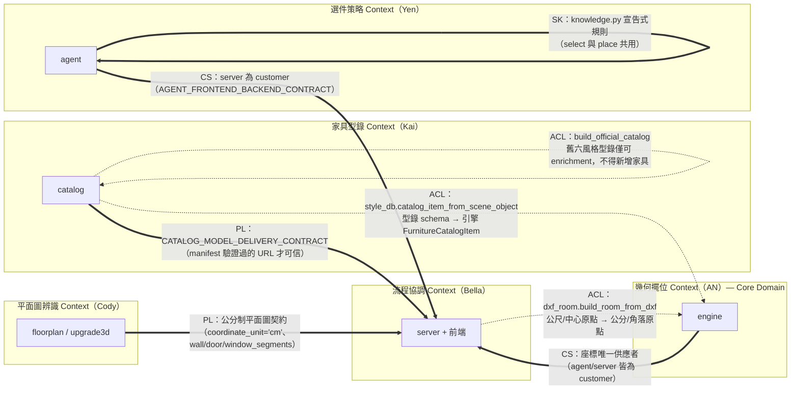

**標記縮寫**：**PL** = Published Language、**CS** = Customer-Supplier、**ACL** = Anti-Corruption Layer、**CF** = Conformist、**SK** = Shared Kernel、**OHS** = Open Host Service。

正式 PL 文本即 `docs/contracts/` 六份契約（AGENT_FRONTEND_BACKEND、CATALOG_MODEL_DELIVERY、FURNITURE_ENGINEERING_RULES、LAYOUT_EVALUATION_SCHEMA、REMOTE_RENDER、STYLEPACK_RENDERING，實測共 6 檔）。

#### 1.2.5 DDD 戰術設計（必填）

| DDD 元素 | 程式碼位置 | 說明 |
| :--- | :--- | :--- |
| **Entity** | `project_store.py` 的 project（`project_id` + 可變 `workflow_json`/`current_step`）；`engine/models.py PlacedFurniture`（id + 可變座標） | mutable state + identity |
| **Value Object** | `engine/models.py` 的 `Wall`、`Room`、`ClearanceZone`、`FurnitureCatalogItem`（dataclass，以值使用） | immutable 使用慣例，未強制 frozen |
| **Aggregate Root** | 專案（projects 一列 + 其 render_outputs + uploads 檔案）；invariant = `revision` 樂觀鎖與 `workflow_json` ≤2MB | 一致性邊界 |
| **Domain Service** | `engine`：`check_placement_with_clearance`、`place_furniture`、`adjust_furniture`；`agent`：`parse_selections`、`resolve_placements` | 不屬單一 Entity 的純邏輯 |
| **Domain Event** | **缺席**。狀態以 revision 遞增 + workflow JSON 快照整包覆寫保存，無事件流／事件溯源；現行單機規模下屬合理取捨 | 需明確說明缺席理由（本欄即是） |
| **Repository** | `project_store.py ProjectStore`（SQLite）；型錄以 `load_official_catalog` 啟動載入記憶體（唯讀，無寫入 Repository） | Aggregate 持久化抽象 |
| **Anti-Corruption Layer** | `engine/dxf_room.py`（單位/原點防腐）；`floorplan/vision/units.py canonicalize_analysis_cm`（公尺→公分唯一轉換點）；`catalog/style_db.py`（型錄→引擎橋接 + 尺寸修補）；`catalog/cloud_catalog.py`（舊型錄僅 enrichment）；`services/cloud_models.py`（僅回 manifest 驗證過的 URL） | 隔離外部/舊 schema 變動 |
| **Specification** | `agent/knowledge.py` 的 `ROOM_AFFINITY`、`COMPANION_OF`、`FAMILY_OF` 與 `agent/select.py` 的 `REQUIRED_FAMILIES_BY_ROOM`（宣告式規則表，`prompt_rules()` 同步生成 LLM 提示條文） | 集中的業務規則判斷 |

---

### 1.3 分層架構（Clean Architecture）

Repo 未按 Clean Architecture 目錄命名，以下為模組邊界到邏輯分層的**近似對應**（依 import 方向實證）：

| 層 | 程式碼位置 | 職責 |
| :--- | :--- | :--- |
| **Domain Layer** | `backend/engine/`（座標/碰撞/淨空規則；`dxf_room.py` 刻意零 ezdxf/shapely 依賴以利獨立測試）、`backend/agent/`（選件與修復策略，僅 stdlib） | 核心業務規則 |
| **Application Layer** | `backend/server/scene_service.py`（場景生成 use case、擺位協調、修復閉環）、`intake_service.py`、`render_service.py`、`main.py` 路由層（介面轉換與驗證）、`backend/floorplan/vision/analysis.py`（辨識管線編排） | 應用程式邏輯 |
| **Infrastructure Layer** | `project_store.py`（SQLite）、`questionnaire_visuals.py`（SQLite 索引）、`services/cloud_models.py`（CloudFront）、`render_service.py` 的 httpx 呼叫、`catalog/cloud_catalog.py`（JSON/CSV 載入）、`floorplan/` 的 OpenCV/ezdxf 實作 | 外部互動實現 |

**關係與 C4**：Clean Arch 是**邏輯分層**，C4 Container 是**物理 runtime**——本專案六個程式模組全部活在同一個 FastAPI process 內，分層靠 import 紀律維持（agent 不 import engine/server；engine 不 import server；已 grep 實證）。

### 1.4 技術選型

| 分類 | 選用技術 | 選擇理由 | 備選方案 | ADR |
| :--- | :--- | :--- | :--- | :--- |
| 後端框架 | FastAPI ≥0.115 + uvicorn ≥0.30（pyproject.toml `server` extra） | 單一 process 承載 44 條路由 + 靜態頁，團隊 Python 技能 | （未記錄） | 無 ADR 文件；決策散見 `docs/contracts/` 與 git log |
| 幾何運算 | shapely ≥2.1.2（唯一核心必裝依賴） | 多邊形碰撞/淨空（非包圍盒） | （未記錄） | 同上 |
| 執行期資料庫 | SQLite（WAL；projects + 問卷索引兩檔） | 單機 demo、零部署成本 | PostgreSQL（遷移中） | 同上 |
| 商用主資料庫 | PostgreSQL（pg_trgm；schema `scripts/sql/roompilot_postgresql_schema.sql`） | 型錄查詢/全文檢索；執行期尚未接 | — | `scripts/sql/README.md` 為近似決策記錄 |
| DXF 解析 | ezdxf ≥1.3 | DXF 實體攤平、$INSUNITS 讀取 | （未記錄） | 無 |
| 影像辨識 | OpenCV（`vision` extra：numpy/opencv-python） | 牆門窗偵測、Hough/distanceTransform | PaddleOCR（`ocr` extra，現行線上未啟用，`default_ocr_provider` 無呼叫者） | 無 |
| 3D 前端（主線） | three 0.165.0，unpkg importmap，原生 ES module（scene.html） | 免建置工具鏈、四頁靜態直出 | React Three Fiber（frontend3d，定位待裁決，見 12 §0） | 無 |
| 3D 前端（檢視器） | React 18.3.1 + @react-three/fiber 8 + three 0.160.1 + Vite 8.1.0 | 早期 DXF 白模檢視 | — | 無 |
| LLM | OpenRouter，預設 `qwen/qwen3-32b:free`；失敗必 fallback 本地規則 | 免費模型、可選能力 | — | `docs/contracts/AGENT_FRONTEND_BACKEND_CONTRACT.md` |
| GLB 遞送 | AWS CloudFront + S3（ap-east-2），manifest 驗證 | 9,350 件 GLB 不進 repo/不佔本機 | 本機 `local` 模式（fallback） | `docs/contracts/CATALOG_MODEL_DELIVERY_CONTRACT.md` |
| 套件管理 | uv（repo 根有 `uv.lock`；`uv sync --extra server`） | 鎖定重現環境 | — | 無 |
| 快取 | 無獨立快取服務；`@app.on_event("startup")` 預熱記憶體型錄 cache（main.py:2102-2108） | — | — | 無 |
| 訊息佇列 | 無 | 單機同步流程 | — | 無 |
| 容器編排 | 無（未容器化） | — | — | 無 |
| 可觀測性 | 無（見 §6.1） | — | — | 無 |
| CI/CD | 無（`.github/` 不存在，實測） | 手動 `uv run pytest` | — | 無 |

---

## 第 2 部分：需求摘要

### 功能性需求

對應 README.md L79-90 十步驟與程式碼實作（步驟名以 `scene_workflow.js` 為準）：

- FR-1 `project`：建立/續作專案，樂觀鎖防多分頁互蓋（POST `/api/projects`、PUT `/api/projects/{id}/workflow`）
- FR-2 `upload`：上傳平面圖，副檔名限 `.dxf/.png/.jpg/.jpeg`，影像經 PIL 驗證（POST `/api/projects/{id}/floorplan`）
- FR-3 `recognition` + `calibration`：牆門窗辨識（DXF 走 `dxf` 引擎、PNG/JPG 走 `cody` 引擎）與兩點公分尺度確認（POST `/api/projects/{id}/floorplan/analyze`；需先確認圖面否則 409）
- FR-4 `space_confirmation`：空間與結構確認（含人工修正閘門 `confirm_floorplan_analysis`）
- FR-5 `requirements`：需求問卷——Test2 視覺問卷（題庫版控於 `backend/server/data/questionnaire_visual_catalog.json`）+ 引導式 intake 6 步（space_type→occupants→needs→style→materials→constraints）
- FR-6 `layout_2d`：場景生成與 2D 家具配置——LLM 選件（驗證失敗降級本地規則）+ 幾何擺位 + 失敗修復閉環（POST `/api/scene/generate`、`/api/scene/layout`、`/api/scene/validate`、`/api/scene/decorate`）
- FR-7 `white_model_3d`：3D 白模（瀏覽器 three.js，GLB 經 CloudFront 307 轉址）
- FR-8 `realistic_3d`：即時寫實——6 風格 × 3 色卡 PBR 材質切換
- FR-9 `proposal_review`：方案鎖定——瀏覽器截圖 PNG（≤20MB、`provider=browser_capture`）存入專案（POST `/api/projects/{id}/renders`）
- FR-10 `ai_render`：AI 渲染——渲染工作送遠端供應商（202；mode 限 `palette_comparison`/`room_final`）
- FR-11 成本概算：POST `/api/cost/estimate`（版控內台灣行情）

### 非功能性需求

| 分類 | 需求描述 | 目標值 | 依據 |
| :--- | :--- | :--- | :--- |
| 性能 | API 延遲目標 | **未定義**（無 SLO 文件） | — |
| 資源上限 | 截圖 PNG 上限 | 20MB（超過 413） | main.py:112 `MAX_RENDER_BYTES` |
| 資源上限 | workflow JSON 上限 | 2MB（超過 413 `workflow_too_large`） | project_store.py:11 |
| 可用性 | LLM 失敗不得擋流程 | 必須本地 deterministic fallback | intake_service.py、`docs/contracts/AGENT_FRONTEND_BACKEND_CONTRACT.md` |
| 可用性 | 渲染供應商未設定 | 回 503，不得假成功 | render_service.py、REMOTE_RENDER_CONTRACT L71 |
| 逾時 | intake LLM 逾時 | 8 秒 | intake_service.py |
| 逾時 | 渲染供應商逾時 | 5–180 秒，預設 60 | `ROOMPILOT_RENDER_PROVIDER_TIMEOUT_SECONDS` |
| 一致性 | 併發寫入防護 | revision 樂觀鎖，衝突 409 附最新 project | project_store.py / main.py:1542 |
| 隱私 | 渲染工作送出前剝除 PII | name/phone/email/地址等 | render_service.py:12-22 `PRIVATE_KEYS` |
| 安全性 | 認證授權 | **無**（所有路由匿名可呼叫；風險見 §7.1） | grep 實證無 middleware |

---

## 第 3 部分：系統設計

### 3.1 架構模式

- **模式**: 模組化單體（modular monolith）+ 伺服器直出靜態前端
- **選擇理由**: 單一 uvicorn process 承載全部 44 條路由（無 APIRouter 拆分，全在 `main.py`）；六個 Python 模組以 import 紀律劃界（agent 不碰座標與網路、engine 不碰 server）；demo 與單機驗收場景下部署成本最低。取捨：main.py 已達 2,796 行，路由層肥大（見 §7.1）。

### 3.2 系統元件圖

引用 §1.1 的 C4 圖，不重複貼。

### 3.3 元件職責

| 元件 | 核心職責 | 技術 | 依賴 |
| :--- | :--- | :--- | :--- |
| `backend/server/main.py` | 44 條路由、驗證、錯誤碼、靜態掛載 | FastAPI | 其餘五模組 + server 內服務 |
| `backend/server/scene_service.py` | 場景 payload 組裝、擺位協調（錨點→引擎→網格三層 fallback）、修復閉環、OpenRouter 場景規劃 | Python + httpx | agent.place、engine、catalog.style_db |
| `backend/server/project_store.py` | 專案/渲染輸出持久化、revision 樂觀鎖、上傳與截圖檔案管理 | SQLite（WAL） | runtime_paths |
| `backend/server/intake_service.py` | 引導式問卷 6 步；LLM 失敗自動正則 fallback | httpx + OpenRouter（可選） | — |
| `backend/server/render_service.py` | 渲染工作驗證、PII 剝除、供應商提交（Idempotency-Key） | httpx | env 設定 |
| `backend/server/services/cloud_models.py` | GLB 遞送模式（cloudfront/local）、manifest 驗證 URL | — | manifest CSV |
| `backend/floorplan/`（含 vision/） | PNG 分析：牆門窗/房間/圖示/比例/空間報告/人工確認閘門，出口公分制 | OpenCV、numpy | upgrade3d（round-trip） |
| `backend/upgrade3d/dxf_parser.py` | DXF→3D JSON（圖層分類、牆體 buffer、比例決策 manual>$INSUNITS>正規化 12m） | ezdxf、shapely | — |
| `backend/agent/` | LLM 選件驗證（白名單/族系/房型/數量 1–6/每房 ≤8）、擺位失敗修復（replace/remove/escalate，≤3 輪） | 純 stdlib | knowledge.py |
| `backend/engine/` | 座標/碰撞/淨空唯一來源；擺放、微調、DXF→Room 轉換 | shapely | — |
| `backend/catalog/` | 9,350 官方型錄驗證合併（強制數量/ID 一致/URL https）、型錄→引擎橋接 | — | engine.models |
| 前端 `scene_v2.js` + `scene_workflow.js` | 十步驟狀態機、前置依賴檢查、3D 場景、截圖 | three 0.165.0 | `/api/*` |
| `frontend3d/` | DXF 白模檢視、GLB 手動擺放（開發用） | R3F | `/api/plans`、`/api/plan`、`/api/upload`、`/api/furniture` |

### 3.4 關鍵使用者旅程（Dynamic Diagrams，必填）

> 主流程步驟順序以 `backend/server/static/scene_workflow.js:4-16` 的 `WORKFLOW_STEPS` 為準（11 步）：`project → upload → recognition → calibration → space_confirmation → requirements → layout_2d → white_model_3d → realistic_3d → proposal_review → ai_render`。以下按 Container 邊界拆三張 sequence 圖。

#### 3.4.1 建案與平面圖辨識（project → upload → recognition/calibration → space_confirmation）

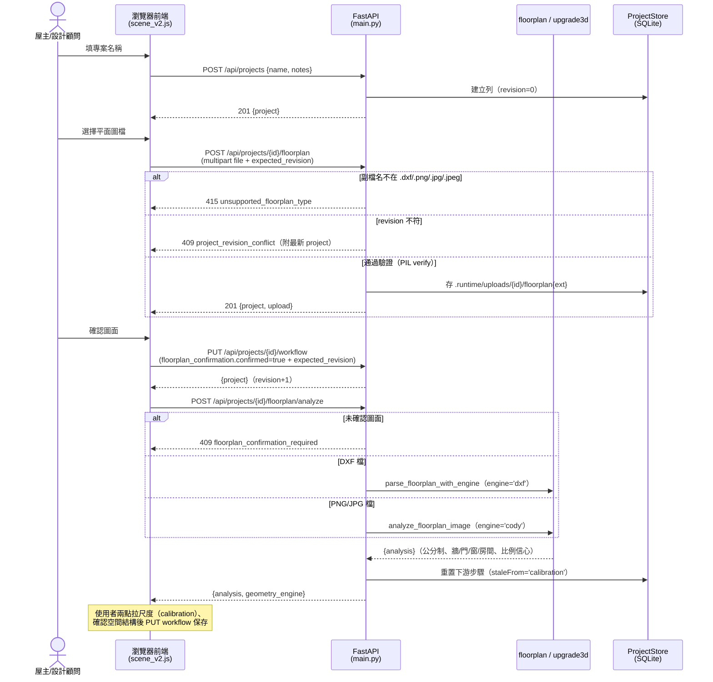

#### 3.4.2 需求問卷與場景生成（requirements → layout_2d）

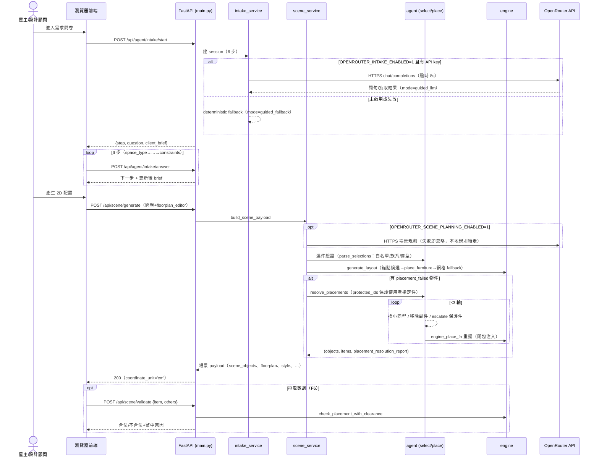

#### 3.4.3 3D 呈現與提案（white_model_3d → realistic_3d → proposal_review → ai_render）

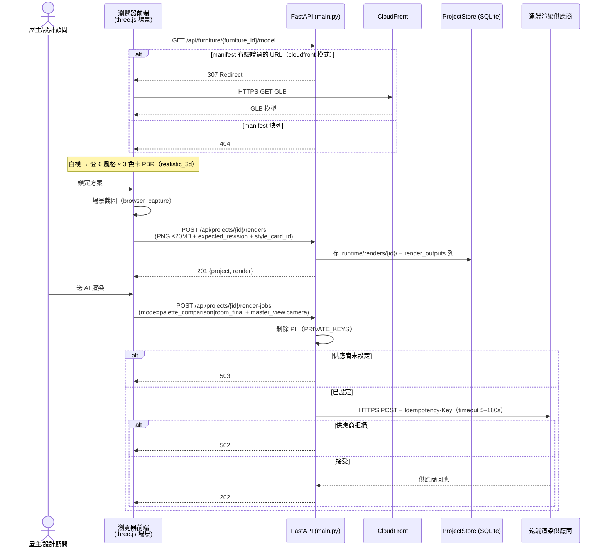

**規則核對**：每個 use case 一張圖；protocol 已標；同步呼叫為主（render-jobs 為 202 非同步提交）；失敗分支用 `alt`。

---

## 第 4 部分：資料架構

### 4.1 資料模型（ER 圖）

#### 執行期：SQLite `.runtime/projects.sqlite3`（project_store.py:100-140 實碼）

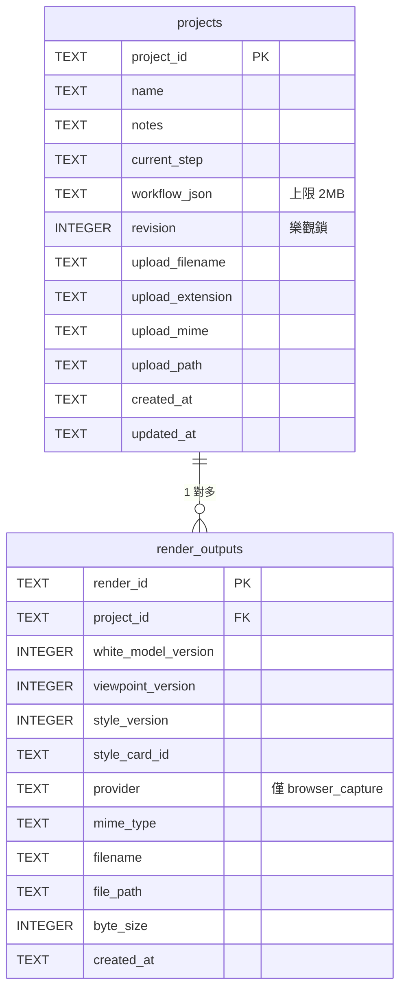

上傳檔與截圖 PNG 存檔案系統（`.runtime/uploads/{project_id}/`、`.runtime/renders/{project_id}/`），DB 只存路徑。`.runtime` 位置由 `runtime_paths.py` 決定 = repo 根（worktree 回溯主 repo）或環境變數 `ROOMPILOT_RUNTIME_DIR`。

#### 資料工程：PostgreSQL `roompilot_db`（scripts/sql/roompilot_postgresql_schema.sql 實碼；執行期未接）

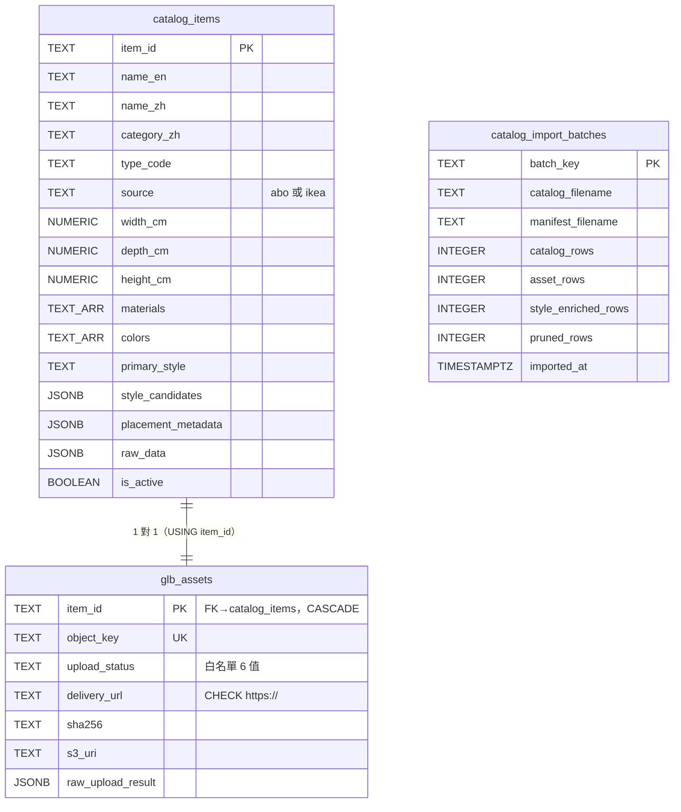

View `official_furniture_with_glb` = 兩表 JOIN + `is_active` + `upload_status` 白名單過濾；importer 匯入後驗證 view 計數必須恰為 9,350 否則 RuntimeError。

**重要**：DB 內部 table 細節只畫在這裡，L3 不重複。執行期型錄實際來源是 JSON+CSV 記憶體載入（`furniture_catalog_cloud_9350.json` 9,350 件 + `furniture_catalog_6styles_zh.json` 10,550 件 enrichment + manifest CSV），Postgres 是同一資料的批次落地。

### 4.2 一致性策略

- **強一致**: 專案讀寫——SQLite 單機交易 + `revision` 樂觀鎖（寫入必帶 `expected_revision`，衝突 409 並附最新 project 讓前端合併重放）
- **強一致（啟動時驗證）**: 型錄——`build_official_catalog` 強制 items 恰 9,350、ID 唯一、manifest 與 catalog ID 集合完全一致、URL 皆 https，任何違反直接 raise 不啟動
- **批次一致**: PostgreSQL 匯入——單一交易 UPSERT，預設非破壞（`--prune-extra` 才清除官方集合外資料），匯入後驗證 view 計數
- **最終一致**: 無分散式元件，不適用；前端 workflow 有 `replay_pending` 機制在衝突後重放（scene_workflow.js `shouldReplayPendingSave`）

### 4.3 資料分類與合規

- **PII**：渲染工作送出前剝除 `PRIVATE_KEYS`（name/phone/email/地址等，render_service.py:12-22）；問卷 `client_brief` 與專案資料留在本機 SQLite/檔案系統
- **加密**：靜態資料未加密（本機 SQLite/檔案）；對外呼叫皆 HTTPS
- **保留策略**：未定義（待補）；`.runtime/` 不進 git（.gitignore 實證）
- **機密管理**：API key 等一律環境變數／`.env`（repo 根或 `backend/server/.env`；`.env` 在 .gitignore）

---

## 第 5 部分：部署與基礎設施

### 5.1 部署視圖（C4 Deployment Diagram）

#### 5.1.1 當前環境（單機開發/驗收）Deployment

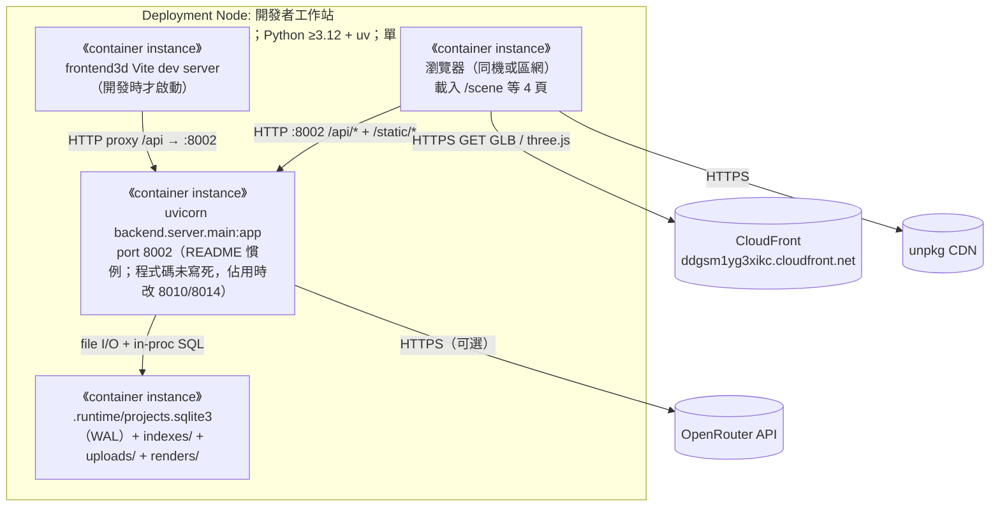

| 屬性 | 值 |
| :--- | :--- |
| Deployment 模式 | 單機單 process（`uv sync --extra server` 後 `uv run uvicorn backend.server.main:app --port 8002`，README.md L183-196） |
| 高可用 | 無 |
| Backup | git 版控 + 離線 GLB 備援 zip（SHA-256 驗證腳本）；`.runtime/` 無自動備份 |
| 監控 | 無 |

#### 5.1.2 目標環境 Deployment

未定義。已知既定方向（對應 §1.1.2.5 future state）：PostgreSQL 接入執行期、渲染供應商接通；目標主機/雲端規格無文件記載——**待補，需團隊裁決**。

#### 5.1.3 環境策略

| 環境 | Deployment | 用途 |
| :--- | :--- | :--- |
| Dev | 本機 uvicorn :8002 + `.runtime/` | 開發與組員驗收（README 驗收範例用 --port 8014） |
| Staging | 未建立 | — |
| Production | 未建立（8/20 發表以單機 demo 為準，未查證是否另有部署計畫） | — |

### 5.2 CI/CD 流程

| 階段 | 步驟 |
| :--- | :--- |
| Build | 無自動化（`.github/` 不存在，實測）；環境以 `uv sync --extra server` 重現 |
| Test | 手動 `uv run pytest`；tests/ 共 47 個 `test_*.py`，`--collect-only` 收集 392 個測試（收集數非通過數；本次導入未全量執行） |
| Deploy | 手動啟動 uvicorn；無部署管線 |

### 5.3 成本估算

| 項目 | 月成本 | 備註 |
| :--- | :---: | :--- |
| AWS S3 + CloudFront（9,350 GLB 儲存與流量） | 待補 | 帳務資訊不在 repo，未查證 |
| OpenRouter | 約 0 | 預設用 `qwen/qwen3-32b:free` 免費模型 |
| 遠端渲染供應商 | 待補 | 供應商未定 |

---

## 第 6 部分：跨領域考量

### 6.1 可觀測性

| 維度 | 工具 | 狀態 |
| :--- | :--- | :--- |
| 日誌 | uvicorn stdout（startup 預熱失敗僅印警告不擋啟動，main.py:2102-2108） | 無集中式日誌 |
| 指標（SLI/SLO） | 無 | 未建立 |
| 追蹤 | 無 | 未建立 |
| 告警 | 無 | 未建立 |
| 健康度端點 | `GET /api/catalog/status`（manifest 健康度）、`GET /api/scene/provider-status`（OpenRouter 狀態）、`GET /api/render-provider/status`（渲染供應商設定） | 現行可用，屬功能性自我回報而非監控系統 |

### 6.2 安全性

- **認證授權**：無。44 條路由皆匿名可呼叫，無 middleware、無 CORS 設定（grep 實證）；單機 demo 前提下接受，公開部署前必須補（§7.1 風險第一條）
- **輸入驗證**：上傳副檔名白名單 + PIL `Image.verify` + PNG magic bytes + 20MB 上限；workflow JSON 2MB 上限；DXF 檔名 `basename` 防路徑跳脫（`/api/plan`）；LLM 回覆經 `parse_selections` 白名單驗證（信任邊界在伺服器端，不信 LLM 輸出）
- **供應鏈信任邊界**：GLB URL 只信 manifest 驗證過的列（`cloud_models.py`）；舊型錄資料只可 enrichment 不可新增家具；隔離區 1,514 筆執行期禁載
- **機密管理**：環境變數 + `.env`（gitignore）；OpenRouter 需雙開關（key + `*_ENABLED=1`）才啟用
- **隱私**：渲染工作剝除 PII 後才出站（render_service.py）
- **威脅模型**：未正式建立——待補（公開部署前至少涵蓋：匿名寫入他人專案、上傳濫用、SSRF via 渲染 payload）

---

## 第 7 部分：風險與演進

### 7.1 風險登記

| 風險 | 可能性 | 影響 | 緩解策略 |
| :--- | :--- | :--- | :--- |
| 無認證授權：任何可連上 :8002 的人可讀寫所有專案 | 高（公開部署時必發生） | 高 | 公開部署前加認證；現階段限單機/區網 demo |
| 伺服器不驗步驟順序：`WORKFLOW_STEPS` 是 set 只驗名稱，前置依賴僅前端 `scene_workflow.js` 強制，任何 client 可跳步驟寫入 | 中 | 中 | 伺服器端補前置檢查，或明文接受（demo 取捨） |
| three.js 自 unpkg CDN 載入：離線或 CDN 故障時 `/scene` 頁面失效 | 中 | 高（demo 現場） | 發表前改 self-host 或準備離線 fallback |
| `main.py:2446` 引用 `/static/models/roompilot-curtain.glb`，但 `static/` 下實測無任何 `.glb`（find 零命中）——`/api/scene/decorate` 的窗簾軟裝會拿到 404 資源 | 高（該路徑必 404） | 低-中 | 補上檔案、改走型錄 GLB 或移除假想品項；前端已實證有兜底——`scene_viewer.js` 對 GLB 載入失敗會 catch 並以「同尺寸白色替代物」呈現（scene_viewer.js:2955-2957），場景不中斷 |
| `main.py:101` `DATASET_DIR` 指向 repo 根 `dataset/`（實測不存在），實際 GLB 在 `data/dataset/`——`local` 遞送模式本機 GLB 解析落空 | 低（預設 cloudfront 模式不受影響） | 低 | 修路徑或移除 local 模式殘路徑 |
| `surface_catalog.json` 的 style profiles 用 12 個舊風格 ID，與家具 6 風格體系不一致（查不到時 fallback scandinavian，main.py:426-428） | 中 | 低 | 6→12 映射補齊或收斂 |
| 資料庫雙軌：執行期 JSON+CSV 記憶體載入 vs 批次 PostgreSQL，兩邊可能漂移 | 中 | 中 | importer 匯入後 9,350 驗證已擋大錯；接入執行期 API 後收斂單源 |
| `main.py` 2,796 行、44 路由無拆分；`scene_v2.js` 8,544 行 | 已發生 | 中（維護成本） | 後續以 APIRouter/模組拆分；非本階段範圍 |
| `@app.on_event("startup")` 為 FastAPI 已棄用 API（pytest collect 出現 deprecation warning） | 低 | 低 | 改 lifespan handler |
| 渲染供應商未設定：`ai_render` 步驟現場只會拿到 503 | 高（現況） | 依 demo 腳本而定 | 發表前接通或 demo 腳本繞過 |

### 7.2 演進路線

| Phase | 範圍與目標 |
| :--- | :--- |
| Phase 1（現行） | 單機十步驟 demo 全通：辨識→問卷→配置→白模→色卡→截圖鎖定；型錄 9,350 件 CloudFront 遞送 |
| Phase 2 | PostgreSQL 接入執行期 API（importer 已就緒）；遠端渲染供應商接通（契約已就緒）；伺服器端步驟前置驗證 |
| Phase 3 | `backend/spatial_data/` 實作；`LAYOUT_EVALUATION_SCHEMA`（status/violations/warnings/score）API 化；frontend3d 去留裁決 |

（Phase 2/3 排序為本文件依「尚未接入」清單之整理，非團隊已裁決之 roadmap——以團隊會議為準。）

---

## 第 8 部分：模組詳細設計

模板 07 導入版已產出：`docs/vibecoding/07_module_specification_and_tests.md`（現況聚焦 backend/engine 碰撞與淨空檢查）。其餘模組的權威規格：

- 引擎與擺位紀律：`docs/contracts/FURNITURE_ENGINEERING_RULES.md`
- Agent 介面與 fallback：`docs/contracts/AGENT_FRONTEND_BACKEND_CONTRACT.md`
- 型錄遞送：`docs/contracts/CATALOG_MODEL_DELIVERY_CONTRACT.md`
- 渲染：`docs/contracts/REMOTE_RENDER_CONTRACT.md`、`docs/contracts/STYLEPACK_RENDERING_CONTRACT.md`

### NFR 實現

- 性能: 無明確目標值；型錄啟動預熱進記憶體、家具查詢分頁（page_size 1–80 預設 24）
- 安全: 輸入驗證 + 信任邊界（LLM 輸出白名單驗證、manifest 驗證 URL）+ PII 剝除；認證缺席為已登記風險
- 可擴展: 現為單機單 process；資料層已鋪 PostgreSQL 遷移路徑

---

## 變更紀錄

| 版本 | 日期 | 變更 |
| :--- | :--- | :--- |
| v1.0 | 2026-07-26 | 由 VibeCoding 模板導入，C4/DDD/Sequence/ER 全部以 `bella-local-20260726`@`e48cd67` 工作區實碼查證填寫 |

---

## 附錄：跨文件一致性檢查表

本文件變更後，**強制**檢查以下文件是否同步（編號 = `docs/vibecoding/` 對應導入版文件，01–17 皆已產出）：

| 異動類型 | 應同步更新 |
| :--- | :--- |
| 新增 Container | 08（結構）、09（依賴）、14（部署）；並同步 `docs/RoomPilot_現行版本總覽.md` |
| 新增 module | 07（模組規格）、08、09、10（類別）；並同步 README.md 責任目錄表 |
| 新增外部系統 | 06（API）、13（安全）、14；並同步本文件 §1.1.2 外部系統清單 |
| 變更 protocol | 06、13、14；並同步 `docs/contracts/` 對應契約 |
| 變更 DDD 限界上下文 | 02（PRD）、07；並同步 README.md 責任目錄表 |

**鐵律**：05 是架構契約——任何模組在 05 沒出現，等於不存在。若其他文件提到、05 沒提到 → **05 有 bug，不是其他文件多寫**。（與 repo 既有優先序並用：測試 > 程式 > `docs/contracts/` > 本文件。）
