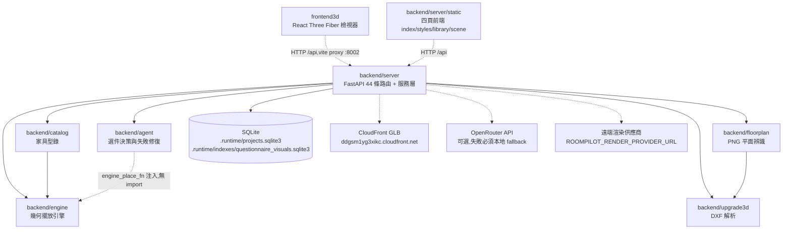

# 模組依賴關係分析 - RoomPilot-Agent

> 本文件由 VibeCoding 模板 09_file_dependencies_template.md 導入 RoomPilot-Agent 生成 | 基準分支 bella-local-20260726 | 2026-07-26

> **版本:** v1.0 | **更新:** 2026-07-26 | **狀態:** 草稿

---

## 依賴原則

| 原則 | 要點 | RoomPilot 實況(grep 逐檔查證) |
| :--- | :--- | :--- |
| **依賴倒置 (DIP)** | 高層依賴抽象,不依賴低層實現 | `backend/agent` 不 import `backend/engine`;座標計算以 `engine_place_fn` callable 由呼叫端注入(`backend/agent/place.py` 的 `resolve_placements`,注入點在 `backend/server/scene_service.py:1756`)。LLM 呼叫器同樣以 `complete` callable 注入(`backend/agent/select.py`) |
| **無循環依賴 (ADP)** | 依賴關係形成 DAG,禁止雙向 import | 現況為 DAG,**未發現循環依賴**(全 backend 五模組 import 逐行 grep 證實,見下方邊清單);無任何領域模組 import `backend.server`(grep 反查零命中) |
| **穩定依賴 (SDP)** | 依賴方向朝向更穩定的模組 | 依賴匯聚於葉模組:`backend/engine/models.py`(純 dataclass,engine 內 6 檔與 `backend/catalog/style_db.py` 都指向它)、`backend/upgrade3d/dxf_parser.py`(server 與 floorplan.vision 都指向它) |

---

## 架構分層依賴圖

以下每一條實線邊都對應實際 import 語句(檔名:行號見「模組間 import 邊清單」);虛線為 HTTP 或外部服務呼叫。

**規則(現況歸納,非事後設計)**:

1. `backend/server` 是唯一組合根:單向 import 其餘五個 backend 模組;反方向零 import(`grep -rn "backend.server" backend/agent backend/engine backend/catalog backend/floorplan backend/upgrade3d` 僅命中 `backend/agent/__init__.py:9` 的 docstring 文字,非程式依賴)。
2. `backend/catalog → backend/engine` 只取 dataclass(`style_db.py:10` import `ClearanceZone`、`FurnitureCatalogItem`),不呼叫引擎演算法。
3. `backend/floorplan → backend/upgrade3d` 只有一條邊(`vision/confirmation.py:11` import `parse_dxf_bytes`,用於確認後 DXF round-trip 驗證)。
4. `backend/agent`、`backend/engine`、`backend/upgrade3d` 三者互相之間、對其他 backend 模組均零 import,是依賴圖的葉層。
5. `frontend3d` 對 repo 其他部分零 import,純靠 HTTP `/api`(vite proxy 至 `http://localhost:8002`,`frontend3d/vite.config.js:8`)。

### 模組間 import 邊清單(grep 實證)

跨模組邊(下表共 12 列、對應 16 條 import 語句——engine 多檔匯入合併為一列,`grep -rnE "^\s*(import|from)\s" backend --include="*.py"` 過濾 stdlib 後逐條確認):

| 來源檔 | 目標模組 | 匯入符號 |
| :--- | :--- | :--- |
| `backend/server/main.py:20` | `backend.agent.knowledge` | `family_of` |
| `backend/server/main.py:21` | `backend.agent.select` | `SelectionParseError`, `SelectionUnavailableError`, `parse_selections`, `request_selections` |
| `backend/server/main.py:26` | `backend.catalog.style_db` | `sanitize_size_cm` |
| `backend/server/main.py:27` | `backend.catalog.cloud_catalog` | `load_official_catalog` |
| `backend/server/main.py:28-32` | `backend.floorplan.vision` | `analyze_floorplan_image`, `confirm_floorplan_analysis`, `infer_room_requirements` |
| `backend/server/main.py:33` | `backend.upgrade3d.dxf_parser` | `list_plans`, `parse_dxf_bytes`, `parse_dxf_file` |
| `backend/server/scene_service.py:15` | `backend.agent.place` | `resolve_placements` |
| `backend/server/scene_service.py:16` | `backend.catalog.style_db` | `catalog_item_from_scene_object` |
| `backend/server/scene_service.py:17-25` | `backend.engine`(clearance/dxf_room/geometry/models/placement) | `check_placement_with_clearance`, `build_room_from_dxf`, `furniture_polygon`, `PlacedFurniture`, `Room`, `Wall`, `place_furniture` 等 |
| `backend/server/scene_service.py:26` | `backend.upgrade3d.dxf_parser` | `parse_dxf_bytes` |
| `backend/catalog/style_db.py:10` | `backend.engine.models` | `ClearanceZone`, `FurnitureCatalogItem` |
| `backend/floorplan/vision/confirmation.py:11` | `backend.upgrade3d.dxf_parser` | `parse_dxf_bytes` |

模組內部邊(佐證各模組是自洽 DAG):

- `backend/engine` 內部:`models.py` 是葉;`geometry.py:11 → models`;`clearance.py:16-17 → models, geometry`;`placement.py:6-8 → models, clearance, geometry`;`adjustment.py:8-9 → models, clearance`;`dxf_room.py:32 → models`;`schema.py:13 → models`。`clearance.py:95` 另有一個函式內延遲 import `geometry.check_placement`,屬同模組內部,非跨模組循環。
- `backend/agent` 內部:`place.py:13` 與 `select.py:17` 只 import `.knowledge`;全套件無其他跨模組 import(stdlib 之外)。
- `backend/floorplan` 內部:`vision/analysis.py:17 → ..cody_adapter`;`cody_adapter.py:13 → . floorplan2dxf`;`vision/` 各檔互相以相對 import 串接(`analysis.py:18-26`)。
- `backend/server` 內部:`main.py:22-63` import 同層的 `questionnaire_visuals`、`scene_service`、`intake_service`、`cost_estimation`、`project_store`、`runtime_paths`、`render_service`、`style_cards`、`services.cloud_models`;`scene_service.py:27 → .style_cards`。

---

## 層級職責

| 層級 | 職責 | 程式碼路徑 |
| :--- | :--- | :--- |
| 介面層 | HTTP 路由(44 條,`grep -c "^@app\.(get\|post\|put)"` 實測,無 APIRouter 拆分)、靜態頁掛載(`main.py:163-164`)、multipart 上傳驗證、序列化 | `backend/server/main.py`(唯一含路由裝飾器的檔案) |
| 應用層 | 場景生成編排(選件→擺位→失敗修復)、引導式需求 intake、成本概算、遠端渲染代理 | `backend/server/scene_service.py`、`intake_service.py`、`cost_estimation.py`、`render_service.py` |
| 領域層 | 選件/修復決策(`agent`)、幾何碰撞與淨空(`engine`)、PNG 平面辨識(`floorplan`)、DXF 解析(`upgrade3d`)、型錄合併與尺寸修補(`catalog`) | `backend/agent/`、`backend/engine/`、`backend/floorplan/`、`backend/upgrade3d/`、`backend/catalog/` |
| 基礎設施層 | SQLite 專案持久化、問卷視覺 SQLite 索引、CloudFront GLB 信任邊界、OpenRouter HTTP 客戶端 | `backend/server/project_store.py`、`questionnaire_visuals.py`、`runtime_paths.py`、`services/cloud_models.py` |

注意:本專案的「基礎設施層」檔案實際放在 `backend/server/` 之下,與應用層同目錄;分層是職責上的,不是目錄上的。`backend/spatial_data/` 只有 `.gitkeep`,無任何程式引用(grep 全 repo 僅 README 與 docs 提及)。

### frontend3d 對後端 API 的依賴(HTTP,非 import)

| 呼叫點 | 端點 | 後端定義 |
| :--- | :--- | :--- |
| `frontend3d/src/App.jsx:26` | `GET /api/plans` | `backend/server/main.py:2661` |
| `frontend3d/src/App.jsx:30` | `GET /api/furniture`(只讀回應的 legacy `furniture` 鍵) | `backend/server/main.py:2018` |
| `frontend3d/src/App.jsx:53` | `POST /api/upload?thickness&height[&scale_m]`(multipart) | `backend/server/main.py:2682` |
| `frontend3d/src/App.jsx:56` | `GET /api/plan?name&thickness&height[&scale_m]` | `backend/server/main.py:2666` |
| `frontend3d/src/Furniture.jsx:10` | `GET /api/furniture/{name}`(`.glb` 結尾回實體檔;cloudfront 模式回 410) | `backend/server/main.py:2787` |

`backend/server/main.py:2656-2693` 區段註解明寫這批路由是自舊 `app/backend/main.py` 移植、供 frontend3d 使用;`_legacy_viewer_models` 的 docstring 自稱 retired R3F viewer——frontend3d 是否仍為現役入口(未查證,屬產品裁決)。

---

## 關鍵依賴路徑

**場景**: `POST /api/scene/generate`(問卷 → 完整場景 payload,貫穿全部五個領域模組)

1. `backend/server/main.py:2284` — 路由接收請求,組 questionnaire,呼叫 `build_scene_payload`(`main.py:2321`)。
2. `backend/server/scene_service.py:1674 build_scene_payload`(應用層)— 編排選件、擺位、風格。
3. `scene_service.py:1544 parse_floorplan_with_engine` → `backend/upgrade3d/dxf_parser.parse_dxf_bytes`(DXF→公尺幾何)→ `backend/engine/dxf_room.build_room_from_dxf`(公尺→公分、取最大封閉房間)。
4. `scene_service.py:1216 generate_layout` — 候選錨點逐一經 `backend/engine/clearance.check_placement_with_clearance` 驗證;錨點全敗退 `backend/engine/placement.place_furniture`;型錄品項經 `backend/catalog/style_db.catalog_item_from_scene_object` 橋接為引擎 dataclass。
5. 若有物件標 `placement_failed` → `scene_service.py:1752` 呼叫 `backend/agent/place.resolve_placements`,`engine_place_fn=replace_and_place` 閉包注入(`scene_service.py:1756`)— agent 決定換小/移除/升級人工,引擎重算座標,最多 3 輪。
6. 回傳含 `scene_objects`、`placement_resolution_report` 的場景 payload。

此路徑也是主流程步驟 6(layout_2d,2D 家具配置)的後端實作;完整步驟序以程式碼 `backend/server/static/scene_workflow.js:4-16` 的 `WORKFLOW_STEPS` 為準,共 11 個內部步驟(有序):project → upload → recognition → calibration → space_confirmation → requirements → layout_2d → white_model_3d → realistic_3d → proposal_review → ai_render(recognition 與 calibration 共用面板,UI 顯示 10 顆按鈕;伺服器端 `main.py:113-125` 的同名 set 只驗步驟名不驗順序)。

---

## 依賴風險管理

| 風險 | 解決策略 / 現況 |
| :--- | :--- |
| 循環依賴 | 現況無循環(上方邊清單構成 DAG)。維持手段:agent↔engine 以 callable 注入取代互相 import;共用 dataclass 集中在 `engine/models.py`。目前無 CI 工具強制檢查(repo 無 `.importlinter`/`setup.cfg`/`tox.ini`、`pyproject.toml` 無 import-linter 段、無 `.github/`,ls+grep 實測),依賴人工 review——待補自動檢查 |
| 不穩定外部依賴 | OpenRouter:`intake_service.py`(urllib,逾時 8 秒)與 `scene_service.py` 各有開關環境變數,失敗一律降級本地規則,不阻斷主流程。CloudFront:`services/cloud_models.py` 為信任邊界,只回 manifest 驗證過的 URL。遠端渲染:`render_service.py` 未設定回 503、供應商拒絕回 502,不假成功 |
| 路由單檔膨脹 | `main.py` 2796 行、44 條路由集中一檔,無 APIRouter 拆分;修改互相干擾風險隨檔案成長——是否拆分屬裁決事項,本文件只記錄現況 |
| 腳本式 import | `backend/floorplan/eval_doors.py:20` 用裸 `import floorplan2dxf as fp`(非套件相對 import);`eval_doors.py:19` 先把腳本所在目錄插入 `sys.path`,故任何 cwd 都可直接執行,但會產生與 `backend.floorplan.floorplan2dxf` 不同的重複模組實例;離線評測腳本專用,不影響伺服器 |
| 死碼殘留 | `backend/floorplan/vision/geometry.py` 的 `detect_geometry` 與 `ocr.py` 的 `default_ocr_provider` 全 repo 無呼叫者(grep 證實);`backend/engine/adjustment.py` 與 `schema.py` 的 tool 常數在 `backend/server` 無引用,只有 `examples/` 使用——文件與新人不應把它們當現行介面 |
| 前端資產斷鏈 | `main.py:2446` 引用 `/static/models/roompilot-curtain.glb`,但 `find backend/server/static -name "*.glb"` 零命中;404 時前端不會中斷——`scene_viewer.js:2953-2957` 對載入失敗的物件呼叫 `createFallbackFurnitureProxy`,以「同尺寸白色替代物」呈現並把原因寫入診斷;`main.py:101` 的 `DATASET_DIR` 指向 repo 根 `dataset/`(不存在,實際 GLB 在 `data/dataset/`),cloudfront 預設模式下不走本機路徑故未爆 |

---

## 外部依賴清單

依 `pyproject.toml`(sed 實測)與 `frontend3d/package.json`/`package-lock.json`(實測)整理。

### Python(`pyproject.toml`)

| 依賴 | 版本 | 用途(消費檔) | 風險 |
| :--- | :--- | :--- | :--- |
| shapely | >=2.1.2 | 唯一核心必裝:`engine/geometry.py`、`engine/clearance.py`、`server/scene_service.py`、`upgrade3d/dxf_parser.py` 的多邊形碰撞/聯集 | 低 |
| fastapi | >=0.115(extra `server`) | `server/main.py` 路由框架;`@app.on_event("startup")` 為已棄用 API,collect 時有 deprecation warning | 中 |
| uvicorn | >=0.30(extra `server`) | ASGI 伺服器,啟動指令 `uv run uvicorn backend.server.main:app --port 8002`(README.md:185) | 低 |
| pillow | >=10(extra `server`) | `main.py` 上傳影像 `Image.verify` 驗證 | 低 |
| ezdxf | >=1.3(extra `server` 與 `vision` 皆列) | `upgrade3d/dxf_parser.py`、`floorplan/floorplan2dxf.py`、`floorplan/vision/confirmation.py` 的 DXF 讀寫 | 中 |
| python-multipart | >=0.0.9(extra `server`) | FastAPI multipart 上傳 | 低 |
| httpx | >=0.28(extra `server` 與 dev group) | `server/render_service.py` 遠端渲染供應商呼叫;測試客戶端 | 低 |
| numpy / opencv-python | >=2.0 / >=4.10(extra `vision`) | `floorplan/` 全線視覺演算法 | 中 |
| paddleocr / paddlepaddle | >=3.0,<4(extra `ocr`) | `floorplan/vision/ocr.py` try-import;`default_ocr_provider` 全 repo 無呼叫者,線上實際不跑 | 低(未接線) |
| requests / selenium / webdriver-manager / tqdm / beautifulsoup4 | (extra `catalog`) | `scripts/` IKEA 爬取管線,非伺服器執行期 | 低 |
| sqlalchemy / psycopg2-binary | >=2.0 / >=2.9(extra `catalog`) | `scripts/sql/import_official_catalog_to_postgres.py` 匯入 PostgreSQL;伺服器執行期不連 Postgres | 中 |
| python-dotenv | >=1.2(extra `catalog`) | `server/services/cloud_models.py` try-import 讀 `.env`(缺套件時靜默略過) | 低 |

### JavaScript(`frontend3d/`,lock 鎖定版本)

| 依賴 | 版本(lock 實測) | 用途 | 風險 |
| :--- | :--- | :--- | :--- |
| three | 0.160.1 | 3D 渲染 | 低 |
| @react-three/fiber | 8.18.0 | React 對 three 綁定 | 低 |
| @react-three/drei | 9.122.0 | OrbitControls/Bounds/Grid/useGLTF | 低 |
| react / react-dom | 18.3.1 | UI | 低 |
| vite / @vitejs/plugin-react | 8.1.0 / 4.7.0(dev) | 建置與 dev proxy | 中(`node_modules` 未安裝;實測 `npm install` 與 `npm ci` 皆因 ERESOLVE 失敗——lock 的 vite 8.1.0 超出 `@vitejs/plugin-react@4.7.0` 的 peer 範圍 `^4.2.0 || ^5 || ^6 || ^7`,需 `--legacy-peer-deps` 才能安裝) |

另注意:主前端 `backend/server/static/scene.html:784-791` 的 importmap 自 unpkg CDN 載入 `three@0.165.0`,與 frontend3d 鎖定的 0.160.1 是兩套版本並存。

**更新策略**: Python 以 `uv.lock` 鎖定(repo 根實測存在)、JS 以 `package-lock.json` 鎖定;repo 無 `.github/` 目錄(ls 實測),故無 dependabot 等自動掃描——更新策略待補。

---

## 待辦

- [ ] 待補:依賴方向的自動化守門(如 import-linter 或 CI grep 規則),目前僅人工維持。
- [ ] 待補:外部依賴自動掃描(無 `.github/`,無 dependabot/renovate 設定)。
- [ ] 裁決事項:`main.py` 44 條路由是否拆 APIRouter;frontend3d 是否仍為現役入口;死碼(`detect_geometry`、`default_ocr_provider`、`engine/adjustment.py` 正式流程呼叫鏈)去留。
- [x] 已查證:`/static/models/roompilot-curtain.glb` 404 時,`scene_viewer.js:2953-2957` 以同尺寸白色替代物 fallback,渲染不中斷(見「依賴風險管理」)。
