# 模組依賴關係分析 - RoomPilot-Agent

> **版本:** v1.0 | **更新:** 2026-07-25 | **狀態:** 草稿

> 本文件描繪 RoomPilot-Agent（平面圖向量化與房型辨識管線）的真實 import／資料依賴 DAG。本專案為純 Python CLI，無 Web 分層架構；「層級」以管線角色劃分（入口層／管線層／模型層／資料層／評測層），而非傳統的介面層／應用層。與其他文件的詞彙對齊見 [./05_architecture_and_design_document.md](./05_architecture_and_design_document.md)。

---

## 依賴原則

| 原則 | 要點 | 本專案落實方式 |
| :--- | :--- | :--- |
| **依賴倒置 (DIP)** | 高層依賴抽象，不依賴低層實現 | `floorplan2room.py` **不直接 import** torch／floortrans；CNN 推論經 `subprocess` 呼叫 `scripts/infer_cubicasa.py`，結果以 `cubicasa/room/*_mask.npz` 快取檔為介面。快取命中時主管線完全不需要深度學習環境 |
| **無循環依賴 (ADP)** | 依賴關係形成 DAG，禁止雙向 import | 方向固定：入口層 → 管線層 → 模型層 → 資料層。`floorplan2dxf.py`（灰階管線）已**凍結**，只被 import、不再修改，天然成為穩定葉節點 |
| **穩定依賴 (SDP)** | 依賴方向朝向更穩定的模組 | 評測 harness（`scripts/eval_*.py`）依賴管線與 `Identify_ans/` GT，反向不成立；GT 進版控、只增不改，是全專案最穩定的節點 |

---

## 架構分層依賴圖

```mermaid
graph TD
    subgraph 入口層
        F2R[floorplan2room.py 專案根 663行<br/>房間切割＋房型命名]
        CAB[cabinet_designer.py<br/>櫃體設計入口]
    end

    subgraph 管線層 scripts/
        BW[floorplan2dxf.py 約1400行<br/>灰階管線 已凍結]
        COLOR[floorplan2dxf_color.py<br/>彩色管線 現行開發重點]
        SYM[symbol_match.py 符號比對]
        DLIB[extract_door_lib.py]
        DMATCH[door_match.py]
        DPROP[door_propose.py 門位候選]
    end

    subgraph 模型層
        INFER[scripts/infer_cubicasa.py<br/>subprocess 呼叫 非 import]
        FT[training/CubiCasa5k/floortrans/<br/>hourglass CNN 程式庫 CC BY-NC]
        W[model_finetuned_v5.pkl 200MB<br/>GitHub Release weights-v5<br/>SHA-256 b7a280d2…f4cf]
        DINO[torch.hub facebookresearch/dinov2<br/>probe_room_classifier.py]
    end

    subgraph 資料層
        CACHE[(cubicasa/room/*_mask.npz<br/>語意快取 137 檔)]
        GT[(Identify_ans/<br/>pngans gray38+color29<br/>own_dataset 25 own_eval 12)]
        CFG[(config.ini / config_color.ini)]
    end

    subgraph 評測守門層 scripts/
        EW[eval_windows.py]
        ECW[eval_color_walls.py]
        ERC[eval_rooms_cc.py]
        ED[eval_doors.py]
        EDM[eval_door_match.py]
        ECM[eval_cc_masks.py]
        REP[(json/eval_rooms/*.json)]
    end

    F2R --> BW
    F2R --> COLOR
    F2R --> SYM
    F2R -->|快取未命中時| INFER
    F2R --> CACHE
    INFER --> FT
    INFER --> W
    INFER --> CACHE
    BW --> CFG
    COLOR --> CFG
    DMATCH --> DLIB
    DMATCH --> SYM
    DPROP --> BW
    DPROP --> COLOR

    EW --> GT
    ECW --> COLOR
    ECW --> GT
    ERC --> BW
    ERC --> COLOR
    ERC -->|House GT 解析| FT
    ERC --> GT
    ED --> BW
    ED --> GT
    EDM --> GT
    ECM --> GT
    EW --> REP
    ERC --> REP
```

**規則**：入口層 → 管線層 → 模型層 → 資料層（單向）。評測守門層可依賴任何層但不被任何層依賴。`floortrans` 只允許三個入口觸碰：`infer_cubicasa.py`（推論）、`eval_rooms_cc.py` / `extract_room_crops.py`（House SVG GT 解析）、`training/CubiCasa5k/train.py`（訓練，GPU 機）。

---

## 層級職責

| 層級 | 職責 | 程式碼路徑 |
| :--- | :--- | :--- |
| 入口層 | CLI 進入點：彩色/灰階自動判別（HSV 飽和度 8% 門檻）、房間 flood fill 切割、CNN 語意投票融合、權重自動下載 `_ensure_cc_weights()` | `floorplan2room.py`、`cabinet_designer.py`（皆在專案根；`sys.path.insert` 掛入 `scripts/`） |
| 管線層 | PNG→DXF 向量化：牆厚偵測、正交線重建、窗/門符號偵測 | `scripts/floorplan2dxf.py`（凍結）、`scripts/floorplan2dxf_color.py`、`scripts/symbol_match.py`、`scripts/door_match.py`、`scripts/door_propose.py` |
| 模型層 | 深度學習推論與訓練：CubiCasa5k hourglass（44 類分割）、DINOv2 分類探針 | `scripts/infer_cubicasa.py`、`training/CubiCasa5k/floortrans/`、`scripts/probe_room_classifier.py`、`scripts/apply_cubicasa_patches.py` |
| 資料層 | GT 答案、語意快取、設定檔、權重 | `Identify_ans/`、`cubicasa/room/`、`config.ini`、`config_color.ini`、`model_finetuned_v5.pkl` |
| 評測守門層 | 改動前後跑分防退化（評測鐵律） | `scripts/eval_windows.py`、`eval_color_walls.py`、`eval_rooms_cc.py`、`eval_doors.py`、`eval_door_match.py`、`eval_cc_masks.py`、`score_compare.py`；報表 `json/eval_rooms/*.json` |
| 標注工具鏈 | own 資料集製作/修復（VLM 盲標＋人工把關） | `scripts/fix_own_floor.py`、`fix_annotation_paths.py`、`rebuild_room_gt.py`、`make_annotation_drafts.py`、`sync_room_labels.py` |

---

## 關鍵依賴路徑

**場景 A：彩色平面圖 → 房型命名（主流程）**

1. `floorplan2room.py`（入口層）→ `probe_color()` 判定彩圖（HSV 飽和度>60 且亮度>60 的像素 ≥8%）
2. `import floorplan2dxf_color as fp_c`（管線層）→ 牆偵測、房間分割
3. 查 `cubicasa/room/{名}_mask.npz` 快取（資料層）→ 命中則跳過 4~5
4. `_ensure_cc_weights()` → `model_finetuned_v5.pkl` 缺檔時從 GitHub Release `weights-v5` 下載（私有 repo 需 `GITHUB_TOKEN`/`GH_TOKEN`），SHA-256 `b7a280d2d7cf2dde580a947e1ebc7b4d12e53135c05581babb3b5797a166f4cf` 校驗失敗即捨棄
5. `subprocess` 呼叫 `scripts/infer_cubicasa.py` → `from floortrans.models import get_model`（模型層，此處才需要 torch）→ 寫回 `*_mask.npz`
6. flood fill 切割＋CNN 語意投票融合 → 房型命名 → `recognition_report.html`

**場景 B：改窗偵測邏輯 → 評測守門（評測鐵律）**

1. 修改 `scripts/floorplan2dxf.py` 前，先跑 `scripts/eval_windows.py`（預設讀 `Identify_ans/pngans/gray/` GT 對 `training/chk/gray/` 評分）記錄基線（現況 96%/96%）
2. 改動後重跑；退化則不得覆蓋 chk/dxf
3. 彩色對應 `eval_color_walls.py`（GT `Identify_ans/pngans/color/{名}_ans.png`）
4. 房型對應 `eval_rooms_cc.py --own-eval`（GT `Identify_ans/own_eval/` 12 題保留集；其 House SVG 解析依賴 `floortrans.loaders.house.rooms_selected` 與 `floortrans.loaders.svg_utils.get_polygon`）
5. `score_compare.py` 比對前後報表 `json/eval_rooms/*.json`

**場景 C：微調訓練（跨機依賴）**

1. `scripts/apply_cubicasa_patches.py` → 對 `training/CubiCasa5k/floortrans/` 打補丁（WashRoom 房型、numpy 2.x `np.matrix`→`np.array`、pandas 2.x 統計轉 float）
2. `scripts/pack_finetune_data.py` → 打包 `training/finetune_data.zip`（Cody 機無 GPU，須帶去 RTX 3060 / GTX 1650 機）
3. GPU 機 `training/CubiCasa5k/train.py` → 產出權重 → 上傳 GitHub Release（100MB 硬限，不進版控）→ 更新 `floorplan2room.py` 內 SHA-256 常數
4. 回本機以 v5 權重全量重算 `cubicasa/room/` 快取（137 檔）

---

## 依賴風險管理

| 風險 | 解決策略 |
| :--- | :--- |
| 循環依賴 | 現況無循環。`floorplan2room` → `floorplan2dxf`/`floorplan2dxf_color` 單向；管線層之間不互相 import（`floorplan2dxf_color` 不 import `floorplan2dxf`）。新增模組一律放 `scripts/` 並維持「入口→管線→模型→資料」方向 |
| 不穩定外部依賴（floortrans） | 以 `subprocess`＋`.npz` 快取隔離：主管線不直接依賴 torch；上游 API 變動只影響 `infer_cubicasa.py` 一個檔。上游相容性問題集中在 `apply_cubicasa_patches.py` 管理（已含 numpy 2.x／pandas 2.x 補丁），不直接改 vendored 程式碼 |
| opencv 5.0 破壞性變更 | `HoughLinesP` 回傳 shape 從 `(N,1,4)` 改為 `(N,4)`，門偵測會掛 → `requirements.txt` 雙鎖 `opencv-python<5` 與 `opencv-python-headless<5`（torch 生態會拉進 headless 版蓋掉 cv2，必須一起擋） |
| 授權污染（CC BY-NC） | `training/CubiCasa5k/` 程式碼 CC BY-NC 4.0、資料集 CC BY-NC-SA 4.0，官方權重與微調 v1~v5 **全繼承禁商用** → 商用前必須走「去 CubiCasa 路線」：DINOv2 探針（`scripts/probe_room_classifier.py`，具名正確率 0.730）＋長期 floortrans 解析自寫替換（待辦 #7） |
| 權重供應鏈 | 200MB 超過 GitHub 100MB 硬限 → 走 Release `weights-v5`；下載強制 SHA-256 校驗防篡改；`GITHUB_TOKEN` 為 PAT 密碼等級秘密，只放環境變數、勿進版控（見 `.claude/rules/security.md`） |
| GT 被退化結果覆蓋 | `Identify_ans/` 進版控且評測鐵律要求先評分後覆蓋；`own_eval/` 12 題永不進訓練，防資料洩漏 |
| 快取與權重版本錯配 | 換權重版本必須全量重算 `cubicasa/room/*_mask.npz`（v5 已重算 137 檔）；快取目錄可用 `CC_CACHE_DIR` 環境變數改指，避免多版本混寫 |

---

## 外部依賴清單

依 `requirements.txt` 逐條列出（版本欄含宣告約束與本機 `.venv` 實際安裝版）：

| 依賴 | 版本 | 用途 | 風險 |
| :--- | :--- | :--- | :--- |
| numpy | `>=2.0`（實裝 2.4.4） | 全管線陣列運算 | 低（floortrans 的 `np.matrix` 相容問題已由 `apply_cubicasa_patches.py` 修補） |
| opencv-python | `>=4.10,<5`（實裝 4.13.0） | 影像讀寫、形態學、`HoughLinesP` 直線偵測 | **高**：5.0 把 `HoughLinesP` 回傳 shape `(N,1,4)` 改成 `(N,4)`，門偵測會掛，上限必須鎖死 |
| opencv-python-headless | `<5` | torch 生態會拉進 headless 版，後裝者蓋掉 cv2 | **高**：同 opencv 5.0 風險，須與上列同鎖，否則鎖版形同虛設 |
| ezdxf | `>=1.3`（實裝 1.4.4） | DXF 向量圖輸出（公分單位，AutoCAD 相容） | 低 |
| lmdb | `>=1.4`（實裝 2.3.0） | CubiCasa `svg_loader` 依賴（標注解析/訓練資料打包） | 低 |
| scikit-image | `>=0.24`（實裝 0.26.0） | CubiCasa `svg_utils` 依賴 | 低 |
| svgpathtools | `>=1.6`（實裝 1.7.2） | CubiCasa `svg_utils` SVG 路徑解析（House 標注） | 中：曾踩 `get_polygon` 尾空格、Inkscape transform 未烘焙陷阱（已修，見 Readme v2.15 與 `scripts/fix_annotation_paths.py`） |

**requirements.txt 之外的實質依賴**（同樣必須管理）：

| 依賴 | 版本 | 用途 | 風險 |
| :--- | :--- | :--- | :--- |
| torch / torchvision | 實裝 2.13.0+cpu / 0.28.0+cpu（未列入 requirements.txt，各機自裝） | hourglass 推論、DINOv2 探針 | 中：Cody 機（WSL2 無 NVIDIA 驅動）只能裝 CPU 版；訓練須換 GPU 機。CPU/GPU wheel 差異由各機自理，未固定版本 |
| training/CubiCasa5k/（floortrans） | vendored（上游 CubiCasa5k repo；其自帶 requirements.txt 鎖 torch 1.0.0 等舊版，**不採用**，以根目錄 requirements＋補丁為準） | CNN 模型定義、House SVG GT 解析 | **高（授權）**：程式碼 CC BY-NC 4.0 禁商用；長期需自寫替換（待辦 #7） |
| CubiCasa5k 資料集＋官方預訓練權重 | — | 微調基底 | **高（授權）**：CC BY-NC-SA 4.0，微調產物 v1~v5 全繼承禁商用 |
| model_finetuned_v5.pkl | GitHub Release `weights-v5`（200MB） | 現行預設權重 | 中：私有 repo 下載需 `GITHUB_TOKEN`；SHA-256 校驗已內建；授權繼承同上 |
| torch.hub `facebookresearch/dinov2` | `dinov2_vits14`（執行期經網路下載） | 房間裁切分類探針（去 CubiCasa 路線） | 中：執行期網路依賴，離線環境會失敗；模型授權 Apache 2.0（可商用，正是替換動機）——授權條款以官方 repo 為準，標「待確認」 |
| GitHub Release / GITHUB_TOKEN | — | 權重發佈通道（100MB 硬限的繞道） | 中：token 為密碼等級秘密，僅環境變數；repo 轉 public 後直鏈自動生效、零設定 |
| pytest | 開發依賴（未列入 requirements.txt） | `tests/` 6 檔（conftest、test_cc_weights_download 等） | 低 |

**更新策略**: 本專案無 lock file 與自動掃描工具（`pip audit` 未納入流程，待確認是否導入）。現行守則：(1) 任何依賴升級前先跑完整評測 harness（`eval_windows.py` → `eval_color_walls.py` → `eval_rooms_cc.py`）與 `pytest tests/`，不退化才准合入；(2) opencv 兩件套的 `<5` 上限在 5.x API 適配完成前不得解除；(3) `training/CubiCasa5k/` vendored 程式碼一律透過 `scripts/apply_cubicasa_patches.py` 修補，禁止手改；(4) 依 `.claude/rules/security.md`，新增依賴前確認活躍維護、無已知漏洞、**授權相容**（本專案已有 CC BY-NC 教訓）。
