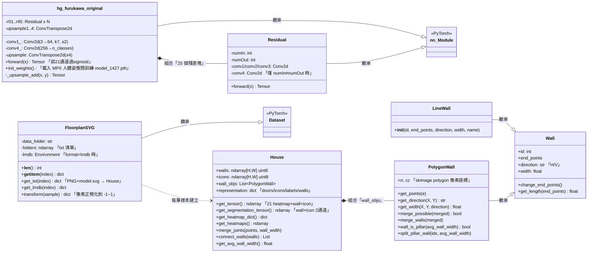
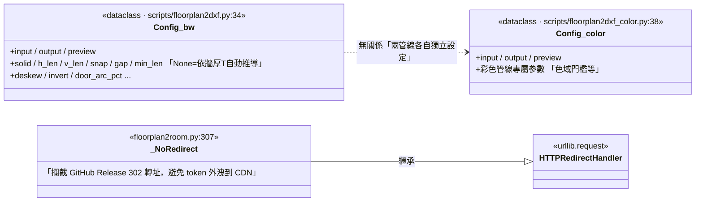
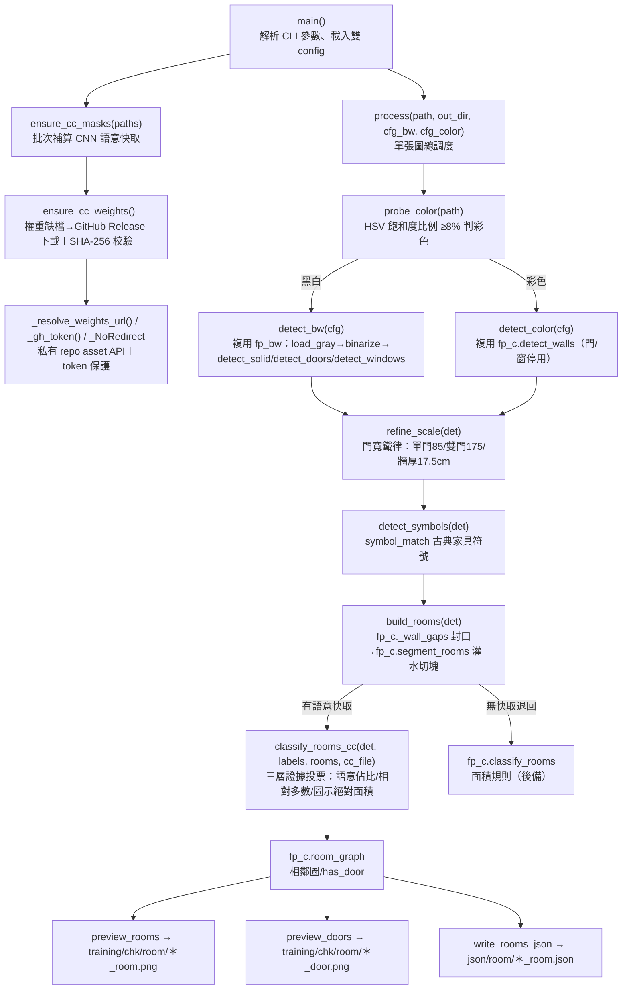

# 類別/元件關係文件 - RoomPilot-Agent

> **版本:** v1.0 | **更新:** 2026-07-25 | **狀態:** 草稿

---

## 閱讀前提：本專案的「類別」分佈實況

RoomPilot-Agent 是純 Python CLI 專案，**主管線刻意採函式式風格**（`floorplan2room.py` 663 行、`scripts/floorplan2dxf.py` 約 1400 行皆以 module-level 函式串接，只用少量 dataclass 承載設定）。真正的物件導向類別集中在**訓練子系統** `training/CubiCasa5k/floortrans/`（CubiCasa5k 上游程式碼，CC BY-NC 授權，微調 v1~v5 依賴它）。因此本文件分兩部分：

1. **類別圖**：訓練子系統的真實類別（CNN 模型、SVG 標注解析、Dataset 載入器）＋主管線的兩個 `Config` dataclass。
2. **函式式模組呼叫圖**：`floorplan2room.py` 的實際執行結構（不硬湊成類別）。

---

## 核心類別圖

### 1. 訓練子系統（training/CubiCasa5k/floortrans/）

### 2. 主管線的設定類別與下載輔助類別

> 兩個 `Config` 均由各自的 `load_config()` 從 `config.ini` / `config_color.ini` 讀入；`floorplan2room.py` 的 `process()` 以 `dataclasses.replace()` 為每張圖產生**不可變複本**（px 參數保持 None，逐圖依牆厚重推導），符合 `.claude/rules/coding-style.md` 的不可變性要求。

### 3. 函式式模組呼叫圖（floorplan2room.py 主結構）

`floorplan2room.py` 沒有領域類別——它以 dict（鍵：`rects/wins/doors/T/T_out/cm/bgr/thin/img_w/img_h/scale_info/cc_file/symbols`）作為管線間的統一資料契約。實際呼叫結構：

依賴的外部模組（`sys.path` 注入 `scripts/` 後 import）：`floorplan2dxf as fp_bw`（**凍結，只 import 不改**）、`floorplan2dxf_color as fp_c`、`symbol_match`。

---

## 類別職責

| 類別/元件 | 位置 | 核心職責 | 協作者 | 所屬層 |
| :--- | :--- | :--- | :--- | :--- |
| `hg_furukawa_original` | training/CubiCasa5k/floortrans/models/hg_furukawa_original.py:54 | 沙漏（hourglass）全卷積分割網路；輸出 44 通道（21 junction heatmap＋12 room＋11 icon，`train.py:74` 的 `input_slice=[21,12,11]`），前 21 通道過 sigmoid | `Residual`、`model_1427`（MPII 預訓練權重） | 訓練/推論（模型） |
| `Residual` | 同上 :7 | BN→ReLU→1×1/3×3/1×1 瓶頸殘差塊；輸入輸出通道不同時走 `conv4` 捷徑 | `hg_furukawa_original` | 訓練/推論（模型） |
| `House` | training/CubiCasa5k/floortrans/loaders/house.py:360 | 解析 CubiCasa `model.svg` 標注 → 牆/圖示分割張量＋21 類 junction heatmap；含牆合併、pillar 拆分、關節點合併等幾何後處理 | `PolygonWall`、`svg_utils` 函式群、`minidom` | 訓練（標注解析） |
| `Wall` / `LineWall` / `PolygonWall` | training/CubiCasa5k/floortrans/loaders/svg_utils.py:486/507/512 | 牆段幾何模型：端點、方向（H/V）、寬度；`PolygonWall` 從 SVG polygon 建像素遮罩並支援同向牆合併與基柱判斷（過短牆拋 `ValueError('small wall')` 由 `House` 捕捉略過） | `House` | 訓練（標注解析） |
| `FloorplanSVG` | training/CubiCasa5k/floortrans/loaders/svg_loader.py:11 | PyTorch `Dataset`：txt 模式讀 PNG＋`model.svg` 即時建 `House`；lmdb 模式讀預先 pickle 的樣本；像素正規化到 −1~1 | `House`、`lmdb`、`train.py` | 訓練（資料載入） |
| `Config`（灰階） | scripts/floorplan2dxf.py:34 | 灰階管線全部可調參數（dataclass）；未給值的 px 參數由 `detect_bw` 依自動牆厚 T 推導 | `fp_bw.load_config`、`floorplan2room.process` | 主管線（設定） |
| `Config`（彩色） | scripts/floorplan2dxf_color.py:38 | 彩色管線參數（dataclass），與灰階 Config 各自獨立、不共享 | `fp_c.load_config` | 主管線（設定） |
| `_NoRedirect` | floorplan2room.py:307 | 權重下載時攔 302 轉址，防止 `GITHUB_TOKEN` 帶到 CDN 網域 | `_ensure_cc_weights` | 主管線（基礎設施） |
| `process()`＋偵測/建房函式群 | floorplan2room.py | 單圖調度：判色→偵測→比例尺校正→切割→CNN 投票命名→三種輸出 | `fp_bw`、`fp_c`、`symbol_match`、語意快取 `cubicasa/room/*_mask.npz` | 主管線（函式式，非類別） |

---

## 關係說明

| 關係類型 | UML 符號 | 本專案實例 |
| :--- | :--- | :--- |
| 繼承 | `--\|>` | `Residual`/`hg_furukawa_original` --\|> `nn.Module`；`FloorplanSVG` --\|> `torch.utils.data.Dataset`；`LineWall`/`PolygonWall` --\|> `Wall`；`_NoRedirect` --\|> `urllib.request.HTTPRedirectHandler` |
| 實現 | `..\|>` | N/A——專案無自訂 abstract interface；「介面」以 PyTorch 基底類別的覆寫慣例（`forward`、`__getitem__`）與 dict 資料契約替代 |
| 組合 | `*--` | `hg_furukawa_original` *-- `Residual`（25 個殘差塊在 `__init__` 建立，生命週期同模型）；`House` *-- `PolygonWall`（`wall_objs` 隨 House 解析建立與銷毀） |
| 聚合 | `o--` | `FloorplanSVG` o-- lmdb 環境（外部資源，Dataset 銷毀不影響 lmdb 檔案） |
| 依賴 | `..>` | `FloorplanSVG.get_txt` ..> `House`（方法內建立）；`floorplan2room` ..> `fp_bw`/`fp_c`/`symbol_match`（module import，等同函式層級的依賴注入邊界） |

---

## 設計模式

| 模式 | 應用場景 | 目的 |
| :--- | :--- | :--- |
| 策略模式（函式版） | `probe_color()` 判別後選 `detect_bw` / `detect_color`；`build_rooms` 依快取有無選 `classify_rooms_cc`（辨識投票）或 `fp_c.classify_rooms`（面積規則後備） | 兩條偵測管線、兩套命名策略可互換，統一回傳 dict 契約 |
| 模板方法 | `nn.Module.forward`、`Dataset.__getitem__` 由子類覆寫 | 沿用 PyTorch 框架的擴充點 |
| 遷移學習初始化 | `hg_furukawa_original.init_weights()` 載入 MPII 人體姿態預訓練 `model_1427.pth`，`train.py:84-85` 再把 `conv4_`/`upsample` 換成 44 類輸出頭 | 小資料集（own_dataset 25 題）微調可收斂 |
| 快取旁路（cache-aside） | `_cc_path`/`_cc_ok`/`ensure_cc_masks`：CNN 推論結果存 `cubicasa/room/*_mask.npz`（137 檔），命中即跳過推論 | Cody 機無 GPU，CPU 推論昂貴，快取讓評測迭代可行 |
| 延遲取得＋完整性校驗 | `_ensure_cc_weights()`：`model_finetuned_v5.pkl`（200MB）缺檔時從 GitHub Release `weights-v5` 下載並比對 SHA-256（b7a280d2…f4cf） | 繞過 GitHub 100MB 限制；防權重被竄改/下載不完整 |
| 不可變設定複本 | `process()` 用 `dataclasses.replace(cfg, input=path, …)` 產生逐圖複本 | 批次處理時每張圖獨立推導參數，無隱藏副作用 |
| 防禦性代理 | `_NoRedirect` 攔 302，token 只送 api.github.com | 秘密不外洩（見 [./13_security_and_readiness_checklists.md](./13_security_and_readiness_checklists.md) 與 .claude/rules/security.md） |

---

## SOLID 原則檢核

- [x] **S** 單一職責：模組級分工清晰——`fp_bw`（灰階偵測，已凍結）/`fp_c`（彩色偵測＋切割工具）/`floorplan2room`（調度＋命名）/`floortrans.models`（網路）/`floortrans.loaders`（標注解析）。惟 `House.__init__` 約 230 行同時解析牆/窗/門/圖示/文字，單一職責偏弱（上游程式碼，列長期替換待辦第 7 項）。
- [x] **O** 開放封閉：`floorplan2dxf.py` 明文凍結「只 import 不改」，新行為一律加在 `floorplan2room.py`/`fp_c` 端；權重可經 `CC_WEIGHTS` 環境變數替換做 A/B 驗收，不改程式碼。
- [x] **L** 里氏替換：`LineWall`/`PolygonWall` 皆可當 `Wall` 使用；`hg_furukawa_original` 可替換任何 `nn.Module` 位置（`train.py` 以 `--arch` 選模型）。
- [ ] **I** 介面隔離：N/A（無自訂 interface）——本專案對應物是 `det` dict 契約與 `*_mask.npz` 快取格式；dict 契約未以 TypedDict/dataclass 固化，鍵拼錯只能在執行期發現（改進候選）。
- [ ] **D** 依賴反轉：主管線直接依賴具體模組（`import floorplan2dxf as fp_bw`），未經抽象層。以 CLI 工具的規模屬可接受取捨；但 `floortrans` 依賴（CC BY-NC 授權）已規劃自寫替換（待辦第 7 項），屆時等同補上一層自有抽象。

---

## 介面契約

本專案無 REST/abstract interface；以下為實際承擔「契約」角色的三份約定。

### `det` dict（floorplan2room.py 偵測結果契約）

| 鍵 | 前置條件 | 後置條件 |
| :--- | :--- | :--- |
| `rects` | `detect_bw`/`detect_color` 已執行 | 牆段矩形清單；彩色管線含基柱/灰度過濾結果 |
| `wins` / `doors` | 同上 | 灰階管線為偵測結果；**彩色管線恆為空 list**（門窗停用，封口全靠牆縫開口） |
| `T` / `T_out` / `cm` | 同上；`refine_scale` 後 `cm` 依門寬鐵律修正 | T=自動牆厚(px)、T_out=外牆厚、cm=每像素公分數 |
| `cc_file` | `process()` 已設 `_cc_path(path)` | 語意快取路徑；`_cc_ok` 驗證失敗則命名退回面積規則並印警告 |

### `House` 標注張量（訓練資料契約）

| 方法 | 前置條件 | 後置條件 |
| :--- | :--- | :--- |
| `get_segmentation_tensor()` | `model.svg` 可被 minidom 解析；height/width 與 PNG 一致 | 回傳 (2,H,W)：wall 通道（rooms_selected 12 類編碼）＋icon 通道 |
| `get_tensor()` | 同上 | 回傳 (23,H,W)：21 junction heatmap＋wall＋icon |
| 解析陷阱防禦 | `get_polygon` 尾空格、Inkscape transform 未烘焙（Readme v2.15、scripts/fix_annotation_paths.py 已修） | 過短牆拋 `ValueError('small wall')` 被 `House` 捕捉略過，其他錯誤重新拋出 |

### `_ensure_cc_weights()`（權重供應契約）

| 條件 | 行為 |
| :--- | :--- |
| `model_finetuned_v5.pkl` 已存在 | 直接使用，不重驗雜湊（`os.path.isfile` 短路）；SHA-256 僅於下載路徑校驗（現行預設權重，own 尺具名命中 0.788） |
| 缺檔＋公開 Release 可達 | 從 `weights-v5` tag 下載後校驗 |
| 缺檔＋私有 repo | 需 `GITHUB_TOKEN` 環境變數走 asset API；token 不隨 302 轉址外流（`_NoRedirect`） |
| 校驗失敗 | 視為失敗，不得以壞檔繼續（防供應鏈污染） |

---

## 相關文件

- 系統分解與容器職責：./02_project_brief_and_prd.md
- CLI/環境變數契約（API 對應物）：./06_api_design_specification.md
- 目錄結構：./08_project_structure_guide.md
