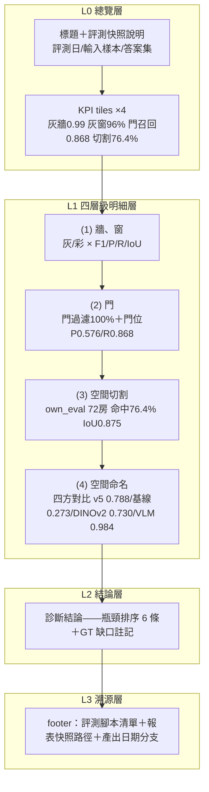
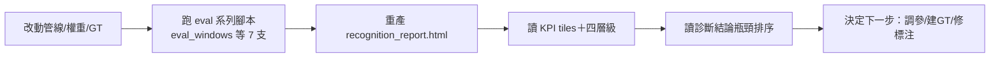
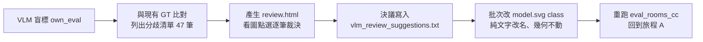

# 前端資訊架構規範 - RoomPilot-Agent

> **版本:** v1.0 | **更新:** 2026-07-25 | **狀態:** 草稿
> **相關文檔:** [PRD](./02_project_brief_and_prd.md) | [架構與設計文件](./05_architecture_and_design_document.md) | [專案結構指南](./08_project_structure_guide.md) | [前端架構 (12)](./12_frontend_architecture_specification.md)
>
> **MECE 邊界**：本文件**只談使用者/內容視角**（旅程、導航、頁面職責、路徑、跨頁資料模型）。技術視角（產生機制、評測腳本實作）見架構文件（05）與模組規格（07）。
>
> **本專案的特殊定位**：RoomPilot-Agent 是純 Python CLI 專案，**無 Web 前端、無 SPA、無路由器、無後端 API**。本專案「前端」的實體對應物共三個 HTML 實體，本文件涵蓋其中兩個產出頁：
>
> | 對應物 | 位置 | 性質 |
> |---|---|---|
> | `recognition_report.html` | 專案根目錄（進版控） | 四層級辨識成功率報表——內部團隊的品質儀表板，每輪評測後重產 |
> | `review.html` | 臨時檔（未進版控） | 標注覆核頁——VLM 盲標與 GT 分歧的人工看圖點選工具，決議落地後即淘汰 |
> | `cabinet_designer.py` 內嵌單頁應用 | 專案根（`ThreadingHTTPServer` 綁 `127.0.0.1:8765`） | 系統櫃設計器早期雛形——其 IA **不在本文件範圍**，技術盤點見 [./12_frontend_architecture_specification.md](./12_frontend_architecture_specification.md) |
>
> 本文件依模板結構撰寫這兩個頁面的資訊架構；純 SPA 專屬章節（URL 路由、認證、shared store）標 N/A 並給出本專案對應物與未來前端整合建議。

---

## 1. 目的與範圍

**目的**: 定義 RoomPilot-Agent 兩個 HTML 產物（辨識報表頁、標注覆核頁）的資訊架構，作為內部團隊關於「報表怎麼讀、覆核怎麼走」的單一真實來源 (SSOT)。

| 範圍 | 說明 |
| :--- | :--- |
| **包含** | 報表頁區塊層級與閱讀順序、覆核流程旅程、頁內導航、檔案路徑規範、跨產物資料流 |
| **不包含** | 評測腳本實作（→ [07](./07_module_specification_and_tests.md)）、視覺樣式細節（報表 CSS 已內嵌於 HTML）、管線架構（→ [05](./05_architecture_and_design_document.md)） |

**不適用聲明**：模板預設的「產品/設計/工程三方協作的多頁網站 IA」在本專案不存在。使用者是內部開發團隊（多台機器、多分支：main/cody/bella/ben/ancai/django/kai-dev），所有頁面以 `file://` 在本機瀏覽器開啟，無部署、無 SEO、無轉換率商業目標。

---

## 2. 設計原則（質化）

**核心價值主張:** 「一頁看懂四層級管線（牆窗→門→切割→命名）目前哪裡強、哪裡破、下一步修哪裡。」

### 資訊架構原則

| 原則 | 說明 |
| :--- | :--- |
| 簡化 | 保留: 四層級成功率＋瓶頸排序 / 移除: 逐題明細（留在 `json/eval_rooms/*.json` 與 `training/eval_rooms/chk/` 檢核圖）/ 專注: 「改動前後有沒有退化、下一個最值得修的破口是什麼」 |
| 認知負荷 | 單頁單目標——報表頁只回答品質現況；覆核頁只回答「這一房該叫什麼名」。先總覽（KPI tiles）再深入（各層級表格）最後結論（瓶頸排序） |
| 一致性 | 四個層級區塊共用同一套表格結構：項目｜指標｜數值｜0–100% 橫條；強弱一律用 `flag good`（綠）/ `flag crit`（紅）＋ ⚠️ 標記；GT 缺口一律以 `gap` 灰字註記在該層級 note 內 |
| 架構模式 | ☑ 層級化（單頁內 L0 總覽 → L1 四層級 → L2 診斷結論 → L3 資料來源）/ ☐ 扁平化 / ☐ 中心輻射 / ☐ 混合 |
| 漸進揭露 | 逐題數字不進報表頁——需要深挖時循 footer 指回 `json/eval_rooms/report_own*.json` 與 `git log json/eval_rooms/` 歷程 |
| 誠實原則（本專案特有） | 數字必須可溯源：每個指標旁標明樣本數與 GT 來源（如「38 題人工答案」「own_eval 72 房·標注修復後」）；有循環性的分數（VLM 0.984）必須明文標注「僅供上限參考」；假分數翻案（切割 38.4%→72.6%）記入 note |

> 報表頁支援深色模式（`prefers-color-scheme` 雙主題變數），無外部依賴、CSS 全內嵌——單檔即可離線開啟與跨機傳閱。

---

## 3. 資訊架構總覽

### 系統層次結構（recognition_report.html 單頁內層級）

四層級順序**與管線處理順序一致**（先向量化牆窗、再門、再切房、最後命名），讀者心智模型與系統資料流同構——上層失效會級聯到下層，因此由上往下讀即是因果排查順序。

### 頁面總覽

| # | 位置（非 URL，見 §7） | 頁面名稱 | 主要職責 | 使用者目標 | 層級 |
| :--- | :--- | :--- | :--- | :--- | :--- |
| 0 | `recognition_report.html`（專案根） | 四層級辨識成功率報表 | 呈現全管線品質現況與瓶頸排序 | 判斷改動是否退化、決定下一步修什麼 | 主頁（L0–L3 皆在頁內） |
| 1 | `review.html`（臨時檔，未進版控） | 標注覆核頁 | 逐筆呈現 VLM 盲標與 GT 的分歧房間（看圖點選定名） | 人工逐筆裁決房型名稱，產出覆核決議 | 工作頁（一次性） |
| 2 | `training/chk/{gray,color}/*_chk.png` | 品質檢核圖（輔助，非 HTML） | 單題向量化結果疊圖預覽 | 逐題目視驗收牆窗門偵測 | 輔助產物 |
| 3 | `training/eval_rooms/chk/<id>_{gt,pred,gtpred}.png` | 切割檢核三聯圖（輔助，非 HTML） | GT/預測/疊合三視圖 | 逐題目視驗收房間切割 | 輔助產物 |

**總計:** 2 個 HTML 頁面＋2 類圖片輔助產物。

> 每頁詳細規格 → §6。輔助產物（#2、#3）由管線與 `eval_rooms_cc.py` 自動輸出，無互動性，本文件不再展開。

---

## 4. 核心使用者旅程

### 旅程 A：評測盤點（報表頁的存在理由）

### 旅程 B：標注覆核（review.html 的存在理由，2026-07-23 實證：47 筆約 20 分鐘）

### 旅程映射表

| 階段 | 頁面/產物 | 使用者心理 | 設計目標 | 主要動作 | 成功判準（取代轉換率） |
| :--- | :--- | :--- | :--- | :--- | :--- |
| 盤點-總覽 | 報表 KPI tiles | 「這輪有沒有退化？」 | 4 個數字 10 秒內回答 | 掃視 tiles | 綠/紅 flag 即時判讀 |
| 盤點-深入 | 報表四層級區塊 | 「破口在哪一層？」 | 每層可獨立判讀、附樣本數 | 逐層對照橫條 | 定位到具體層級（現況：彩窗 R38% 全系統最低） |
| 盤點-決策 | 診斷結論區塊 | 「先修哪個？」 | 瓶頸已排序、附方向 | 讀排序清單 | 待辦與 Readme v2.16 優先序一致 |
| 覆核-裁決 | review.html | 「這房到底是什麼？」 | 一筆一圖一組候選、點選即決 | 看圖點選 | 47 筆/20 分鐘的節奏可持續 |
| 覆核-落地 | vlm_review_suggestions.txt → model.svg | 「決議別丟」 | 決議先落純文字檔再批次套用，可審計 | 批次改 class | 決議檔進版控（`Identify_ans/own_eval/vlm_review_suggestions.txt`），git 可追溯 |

> 本專案無商業轉換率；「成功判準」為工程判準。事件追蹤 N/A——無前端遙測，歷程追溯靠 git log（`json/eval_rooms/` 報表快照逐 commit 保留）。

---

## 5. 導航結構

### 主導航

N/A——兩頁皆為獨立單頁，無站內導航列、無跨頁連結（`file://` 開啟的本機檔案，互相以檔案總管/編輯器切換）。本專案對應物是**頁內線性閱讀順序**：

| 報表頁區塊（依序） | 錨定方式 | 顯示條件 |
| :--- | :--- | :--- |
| 標題＋評測快照說明 | 頁首 | 永遠顯示 |
| KPI tiles ×4 | 緊接頁首 | 永遠顯示 |
| (1) 牆、窗 → (2) 門 → (3) 空間切割 → (4) 空間命名 | `<h2>` 依管線順序 | 永遠顯示（GT 缺項以灰字 gap 註記，不隱藏區塊） |
| 診斷結論（瓶頸排序） | `<h2>` | 永遠顯示 |
| footer（資料來源/快照路徑/產出分支） | 頁尾 | 永遠顯示 |

### 輔助導航

- 麵包屑：N/A（單頁無層級跳轉）。對應物：頁首快照說明列明「評測日／輸入樣本數／答案集構成」，等效於告訴讀者「你在看哪一份快照」
- Footer 導航：報表 footer 列出 7 支評測腳本名（eval_windows.py、eval_color_walls.py、score_compare.py、eval_doors.py、eval_door_match.py、eval_rooms_cc.py、probe_room_classifier.py）與快照路徑 `json/eval_rooms/report_own*.json`——這是「深挖入口」，取代網站的 footer 連結
- 側邊欄：N/A（頁寬 980px 單欄，區塊數 6 個以內無需目錄）
- 返回機制：瀏覽器 back 即可（無頁內路由狀態可丟失）

**未來前端整合建議**：若日後將報表升級為 Web 服務（如歷次評測趨勢頁），建議維持「單頁四層級」為首頁 IA，新增的歷史趨勢/逐題明細以第二層頁面掛在各層級區塊之下（層級化擴展），而非改造首頁——現有閱讀動線已被團隊驗證有效。

---

## 6. 頁面規格

> **本節是兩個 HTML 頁面的單一真實來源**。

### 頁面: 四層級辨識成功率報表（recognition_report.html）

| 項目 | 內容 |
| :--- | :--- |
| **位置** | 專案根目錄 `recognition_report.html`（進版控，隨評測輪次整檔重產；181 行單檔，CSS 內嵌，支援深色模式） |
| **職責** | 單一職責：呈現四層級管線品質現況與瓶頸排序（不含逐題明細、不含操作功能） |
| **使用者目標** | 10 秒判斷有無退化；3 分鐘定位破口與下一步 |
| **資料需求** | 7 支評測腳本的產出——牆窗：eval_windows.py／eval_color_walls.py／score_compare.py 對 `Identify_ans/pngans/`（灰 38＋彩 29）評分；門：eval_doors.py／eval_door_match.py 對 26 題門位 GT；切割/命名：eval_rooms_cc.py（`--own-eval`／`--gt-seg`）對 own_eval 12 題 72 房；探針：probe_room_classifier.py。快照落地 `json/eval_rooms/report_own*.json` 後由人工/agent 彙整改寫 HTML（無自動產生器，屬「評測後同步更新」慣例——見 Readme v2.15「四報表＋recognition_report.html 同步」） |
| **主要內容焦點** | 一個：診斷結論的瓶頸排序（現況第 1 條：命名層 v5 已收割 0.273→0.788；最大真實破口：彩窗召回 38%） |
| **次要內容** | ≤3：KPI tiles 速覽、四層級明細表、GT 缺口註記（彩色管線門位/切割/命名三層無 GT） |
| **導航入口** | 檔案總管／`git pull` 後直接開啟；Readme changelog 提及處 |
| **導航出口** | footer → `json/eval_rooms/report_own*.json`（逐題數字）、`git log json/eval_rooms/`（歷程）；各層級 note → 對應 GT 目錄與待辦 |
| **空 / 錯誤狀態** | GT 缺項不留空——以灰字「彩色管線○○尚無 GT——缺口」明示，並在診斷結論給出建集路徑（VLM 盲標＋人工把關流程）；不可信分數（VLM 0.984 循環性）保留但標注警語 |

### 頁面: 標注覆核頁（review.html）

| 項目 | 內容 |
| :--- | :--- |
| **位置** | 臨時檔，**未進版控**——每輪覆核時臨時產生，決議落地後即可丟棄（重現方式：依 `Identify_ans/own_eval/vlm_review_suggestions.txt` 頭部說明的流程重建；產生腳本待確認，2026-07-23 該輪為一次性產出） |
| **職責** | 單一職責：逐筆呈現 VLM 盲標與現有 GT 的分歧房間，供人工看圖點選定名 |
| **使用者目標** | 每筆 ≤30 秒裁決房型（實證：47 筆約 20 分鐘，含 36 筆 Undefined 補名／10 筆錯名修正／1 筆降回） |
| **資料需求** | 分歧清單（VLM 建議 vs `Identify_ans/own_eval/floorXX/model.svg` 現有 class）＋對應房間裁切圖；房型候選為 own 量尺 10 類定案詞彙（kitchen/living/bed/bath/entry/storage/garage/outdoor＋office/stair，走道留 Undefined） |
| **主要行動（CTA）** | 一個：對當前這一筆點選正確房型 |
| **次要行動** | ≤3：維持原 GT、降回 Undefined、跳過待議 |
| **導航入口** | 旅程 B 的分歧清單產生後，本機開啟 |
| **導航出口** | 決議 → `Identify_ans/own_eval/vlm_review_suggestions.txt`（純文字、進版控、可審計）→ 批次改 model.svg class（**純文字改名、幾何不動**）→ 回旅程 A 重評 |
| **空 / 錯誤狀態** | 無分歧＝無需產生本頁；裁決不確定的筆留在 suggestions 檔標注待議，不強迫當場定案 |

**IA 設計要點（覆核頁）**：決議不直接寫回 SVG，而是先落純文字決議檔再批次套用——這是刻意的兩段式 IA：(1) 決議可 git diff 審計；(2) 套用只改 class 屬性不碰幾何，杜絕 Inkscape transform 之類的座標汙染（見 Readme v2.15 標注修復鏈教訓）。未來擴充 own_dataset 50~100 題時沿用同一流程。

---

## 7. URL 結構與路由（IA 真相）

N/A——無 Web 伺服器、無路由器，頁面以 `file://` 開啟。**本專案對應物是檔案路徑命名規範**（等效於 URL 規範的「語義化、可預測、可分享」目標，分享單位是 git repo 路徑）：

### 路徑命名規範（實際慣例）

- 報表快照：`json/eval_rooms/report*.json`——變體以底線後綴區分（`report_own.json`、`report_own_gtseg.json`、`report_gtseg_ft_v5.json`…），語義＝「量尺_域_權重版本」
- 檢核圖：`training/chk/{gray,color}/<題名>_chk.png`；切割三聯圖 `training/eval_rooms/chk/<id>_{gt,pred,gtpred}.png`——後綴即視圖身分
- 答案集：`Identify_ans/{pngans,own_dataset,own_eval}/`——目錄名即用途（像素答案／訓練教材／保留考卷）
- 灰彩隔離：`training/chk/{gray,color}/`、`dxf_scale/{gray,color}/`、`json/{gray,color}/`——雙管線輸出永不互相覆蓋
- 不在路徑洩密：權重下載走 GITHUB_TOKEN 環境變數，token 不出現在任何檔名/路徑/版控內容

### 路由表

| 路由 | 頁面 | 認證 | 角色 | 載入策略 |
| :--- | :--- | :--- | :--- | :--- |
| N/A | — | — | — | — |

「認證/角色」的本專案對應物：存取控制＝GitHub repo 權限（私有 repo，內部團隊）；`recognition_report.html` 進版控人人可見，`review.html` 僅存在於執行覆核者的本機。私有 repo 資產下載（權重 Release）需 GITHUB_TOKEN，屬部署契約非頁面認證（見 [06 API 設計規範](./06_api_design_specification.md) 的 CLI/環境變數契約）。

**未來前端整合建議**：若上 Web 化，建議路由直接映射現有檔案語義：`/report`（現報表頁）、`/report/history/:date`（git 歷程視覺化）、`/review/:batch`（覆核批次）、`/floor/:id/chk`（逐題檢核圖）——路徑詞彙沿用現有目錄名，團隊零學習成本。

---

## 8. 跨頁資料模型

> 本專案的「跨頁載體」全部是**檔案**（git 版控＝分享機制）。無 URL params、無 session store。

| 來源 | 目標 | 載體 | 資料內容 | 為何選此載體 |
| :--- | :--- | :--- | :--- | :--- |
| 7 支 eval 腳本 | 報表頁 | `json/eval_rooms/report*.json`（進版控） | 各層級指標與逐題明細 | 機器可讀、git 逐 commit 保留歷程、報表數字可溯源 |
| VLM 盲標＋GT 比對 | review.html | 分歧清單（臨時） | 房間 id、VLM 建議、現有 class、裁切圖 | 一次性工作資料，不值得版控 |
| review.html 裁決 | model.svg 批次改名 | `Identify_ans/own_eval/vlm_review_suggestions.txt`（進版控） | `floorXX#房序 → 房型` 決議清單 | 純文字可 git diff 審計；決議與套用解耦，可獨立 review/revert |
| 標注修復/覆核 | 切割與命名重評 | `Identify_ans/own_eval/floorXX/model.svg`（進版控） | 房間輪廓＋class 標籤 GT | SVG 是標注工具（Inkscape）與評測腳本的共同格式 |
| eval_rooms_cc.py | 逐題目視驗收 | `training/eval_rooms/chk/*_{gt,pred,gtpred}.png`（不進版控） | GT/預測/疊合三視圖 | 大量圖片屬本機工作區，可重生不備份 |
| 報表頁 | 團隊全機器 | git（`recognition_report.html` 進版控） | 整份報表快照 | 單檔自足（CSS 內嵌、無外部資源），pull 即讀，離線可開 |

### 載體選擇原則（本專案版）

- **要跨機器分享、要歷程可溯的 → 進版控**（報表 HTML、報表 JSON、決議 txt、GT SVG）
- **可由腳本重生的大量產物 → 不進版控**（檢核圖、語意快取以外的工作區輸出；>100MB 一律走 GitHub Release）
- **一次性工作頁 → 不留**（review.html 本體），但其**決議必須落版控純文字檔**——工具可拋棄，裁決不可拋棄

---

## 9. IA / 可用性檢查清單

### 資訊架構

- [x] 兩個頁面已定義單一職責與使用者目標（§6）
- [x] 兩條核心旅程已映射工程判準（§4；轉換率 N/A）
- [x] 報表頁內閱讀順序與管線因果順序同構（§3、§5）
- [x] 檔案路徑語義化、灰彩隔離、變體後綴可預測（§7）
- [x] 跨產物載體符合 §8 選擇原則（決議落版控、臨時頁可拋棄）
- [x] 存取控制已明確（repo 權限＋GITHUB_TOKEN 部署契約，§7）

### 可用性（質化）

- [x] 報表閱讀深度 ≤ 3 層（tiles → 層級明細 → JSON 快照）
- [x] 報表頁單一焦點：瓶頸排序；覆核頁單一 CTA：點選定名（§2 原則）
- [ ] 報表頁 `<h2>` 尚無錨點 id，長頁跳轉靠捲動——低優先，區塊僅 6 個（待確認是否值得加）
- [x] GT 缺口不留空白：灰字明示＋給建集路徑（等效於「空狀態有下一步 CTA」）
- [x] 漸進揭露：逐題明細不進報表首屏，循 footer 深挖
- [x] 不可信分數（VLM 循環性）與假分數翻案史（切割 38.4%→72.6%→76.4%）均明文標注——數字誠實優先於版面乾淨

### 本專案特有守則

- [ ] 每輪評測後報表與四份 JSON 快照**同步**更新（Readme 慣例；報表落後於 JSON 即視為文件債）
- [ ] review.html 決議未落 `vlm_review_suggestions.txt` 前不得直接改 model.svg
- [ ] 改 chk/dxf 邏輯前必先跑 eval_windows.py 對 `Identify_ans/pngans/` 評分，不得退化後覆蓋（評測鐵律）
