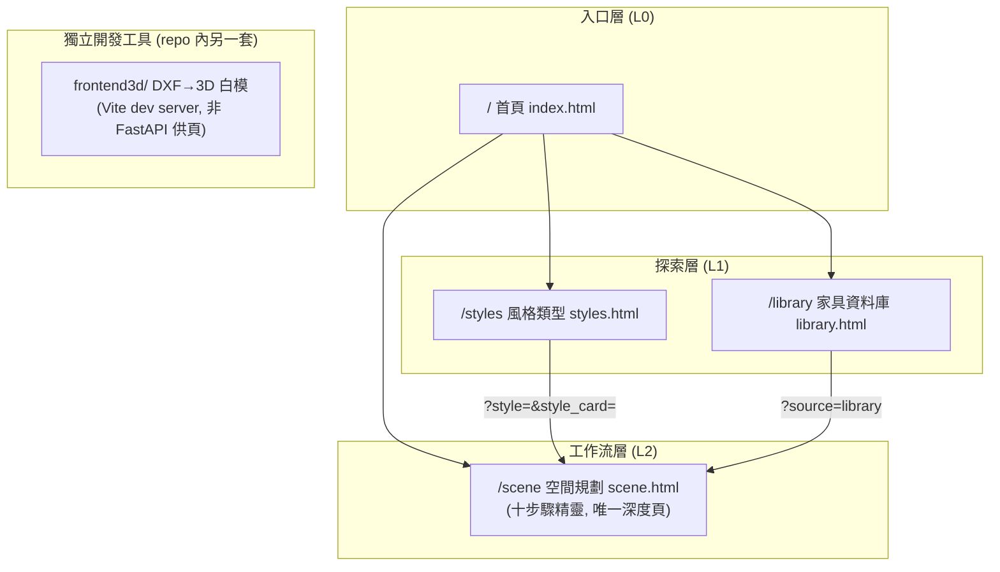
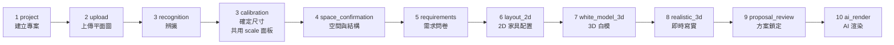

# 前端資訊架構規範 - RoomPilot-Agent

> 本文件由 VibeCoding 模板 17_frontend_information_architecture_template.md 導入 RoomPilot-Agent 生成 | 基準分支 bella-local-20260726 | 2026-07-26

> **版本:** v1.0 | **更新:** 2026-07-26 | **狀態:** 已發布(依現行程式碼逐條核對整理)
> **相關文檔:** [PRD](./02_project_brief_and_prd.md) | [API 設計規範 (06)](./06_api_design_specification.md) | [前端架構 (12)](./12_frontend_architecture_specification.md)
>
> **MECE 邊界**:本文件**只談使用者/內容視角**(旅程、導航、頁面職責、URL、跨頁資料模型)。
> 技術視角(框架選型、效能數字、a11y 標準、檔案組織)→ [12_frontend_architecture_specification.md](./12_frontend_architecture_specification.md)(已導入)。
>
> | 你想找的 | 看這份 |
> |---|---|
> | 哪些頁面存在、頁面層級結構 | 17(本檔)§3 |
> | 設計原則、認知負荷、架構模式 | 17(本檔)§2 |
> | 使用者旅程(十步驟主流程對應面板與 API) | 17(本檔)§4 |
> | 主導航、輔助導航、返回機制 | 17(本檔)§5 |
> | 單頁職責、CTA、導航入口/出口 | 17(本檔)§6 |
> | URL 命名規則、路由表 | 17(本檔)§7 |
> | 跨頁資料模型(URL params / localStorage / sessionStorage / 伺服器保存) | 17(本檔)§8 |
> | 後端 API 端點的完整規格(main.py 路由總數 44,其中 `/api/*` 40 條) | **06** |
> | 用什麼框架、效能數字、a11y 標準、元件分層 | **12** |

**現況說明**:RoomPilot 目前的主 UI 是 `frontend/` 下由 FastAPI 直接供應的 4 個靜態 HTML 頁面(無前端框架、無打包器,原生 ES module + Three.js importmap)。另有一個獨立的 Vite + React Three Fiber 子專案 `frontend3d/`(DXF 3D 白模檢視器),設計上經 `npm run dev` 啟動、不由 FastAPI 供頁——但 `node_modules` 未安裝且 `npm install` 因 ERESOLVE 依賴衝突直接失敗(2026-07-26 實測),現況無法啟動;後端 `main.py:2072` 的 `_legacy_viewer_models` docstring 稱其為 retired R3F viewer,但其 4 條對口 API 仍存活(定位待裁決,見 §6.5 與 12 §0)。

---

## 1. 目的與範圍

**目的**: 定義 RoomPilot Agent 前端的完整資訊架構,作為關於「頁面與旅程」的單一真實來源 (SSOT)。頁面名稱一律以檔案為準;主流程步驟順序一律以 `frontend/scene_workflow.js` 的 `WORKFLOW_STEPS` 為準(程式碼權威,不沿用舊文件順序)。

| 範圍 | 說明 |
| :--- | :--- |
| **包含** | 頁面職責、使用者旅程(十步驟工作流)、導航設計、URL 規範、跨頁資料模型、前端狀態與資料流 |
| **不包含** | 視覺設計細節、元件實作、效能數字、後端 API 完整規格(→ 06)、後端演算法 |

---

## 2. 設計原則(質化)

**核心價值主張:** 首頁 hero 文案(index.html:36-39):「匯入平面圖、選擇風格與家具需求,RoomPilot 會整合材質、家具資料庫與配置規則,產生可以即時瀏覽的 3D 室內提案,協助設計溝通更快聚焦。」

### 資訊架構原則(自現行程式碼歸納)

| 原則 | 說明 |
| :--- | :--- |
| 簡化 | 保留: 4 個頁面(首頁/風格/家具庫/場景工作流) / 移除: 舊 `/scene` 入口 scene.js 已被 scene_v2.js 取代(scene.html 只載入 scene_v2.js) / 專注: 全部深度功能集中在 `/scene` 單頁 |
| 認知負荷 | `/scene` 採線性精靈(wizard)模式:同一時間只顯示一個步驟面板(`.rp-step-panel` + `hidden`),頂部進度列 + 引導帶(`rp-guidance-band`)提示「目前要做的事」 |
| 一致性 | `/`、`/styles`、`/library` 共用同一 topbar 結構(brand + topnav + 「開始設計」CTA);`/scene` 刻意拿掉 topnav 防止中途跳頁(見 §5) |
| 架構模式 | 混合:入口三頁為扁平化(hub),`/scene` 內部為嚴格線性層級(11 個內部步驟,前置依賴由 `scene_workflow.js:43-105` `REQUIRED_COMPLETIONS` 強制) |
| 漸進揭露 | `/scene` 每一步完成才解鎖下一步;`/library` 進階篩選預設 `hidden`(library.html:95-99);問卷第 5 步內部再分 3 個子階段依序解鎖(scene.html:373-377) |

> 量化 UX 指標(LCP、a11y 對比度)→ 12 §4 §5;12 已核實專案未建立任何量測(無 web-vitals 收集程式碼、無 WCAG 承諾)。

---

## 3. 資訊架構總覽

### 系統層次結構



### 頁面總覽(頁面名稱以檔案為準)

| # | 路由 | 頁面檔案 | `<title>` | 主要職責 | 入口 script | 層級 |
| :--- | :--- | :--- | :--- | :--- | :--- | :--- |
| 0 | `/` | `frontend/index.html`(90 行) | RoomPilot \| AI 室內配置與 3D 預覽 | 行銷落地頁 + 功能導覽 | `home.js`(108 行) | L0 |
| 1 | `/styles` | `frontend/styles.html`(52 行) | 查看風格類型 | 6 風格 × 3 色系共 18 色卡瀏覽與選擇 | `styles.js`(1,243 行) | L1 |
| 2 | `/library` | `frontend/library.html`(171 行) | 家具資料庫｜RoomPilot | 家具型錄瀏覽 + 3D 檢視 + 方案清單 | `library.js`(754 行) | L1 |
| 3 | `/scene` | `frontend/scene.html`(794 行) | RoomPilot 空間規劃 | 十步驟空間規劃主工作流 | `scene_v2.js`(8,544 行) | L2 |
| — | (Vite dev,proxy 8002) | `frontend3d/index.html` | DXF → 3D 白模 | DXF 解析結果 R3F 檢視 + 家具手動擺放 | `src/main.jsx` → `App.jsx` | 獨立 |

**總計:** FastAPI 供應 4 頁(main.py:1432-1452)+ 1 個獨立 Vite SPA。

補充事實(實測):`static/` 頂層共 4 個 HTML + 33 個 JS + `site.css`;`scene_v2.js` 另以帶版本查詢參數(sha256 片段或日期標記)的相對路徑 import 17 個本地模組(`scene_workflow.js`、`scene_viewer.js`、`scene_layout2d.js`、`scene_questionnaire_test2.js` 等);`scene.js`(3,128 行)為舊版 `/scene` 入口,**現已無任何 HTML 載入**(grep 全部 4 個 HTML 證實);`viewer.js` 則仍被 `library.js:9` 使用,不是死碼。

> 每頁的詳細規格(資料、CTA、導航入出口)→ §6。

---

## 4. 核心使用者旅程

### 主要旅程(十步驟工作流,`/scene` 單頁內完成)

程式碼權威順序 = `frontend/scene_workflow.js:4-16` 的 `WORKFLOW_STEPS`,共 **11 個內部步驟**;其中 `recognition` 與 `calibration` 共用同一個 `scale` 面板(`WORKFLOW_PANEL_BY_STEP`,scene_workflow.js:18-30),因此 UI 進度列只有 **10 顆按鈕**(scene.html:22-33,`data-workflow-count="10"`)。



### 旅程映射表(步驟 → 面板 → 主要互動 → 主要 API)

每列均對照 scene.html 的 `data-panel` 區塊與 scene_v2.js 的實際 fetch 呼叫(行號為 2026-07-26 實測):

| UI 步 | 內部 step id | 面板 `data-panel` | 使用者要做的事 | 主要 CTA | 呼叫的 API(scene_v2.js 行號) |
| :--- | :--- | :--- | :--- | :--- | :--- |
| 1 | `project` | `project` | 輸入專案名稱與備註 | 建立專案並繼續 | `POST /api/projects`(897) |
| 2 | `upload` | `upload` | 選 DXF/PNG/JPG 圖檔並勾選「我已確認圖檔內容正確」(scene.html:92) | 確認並開始辨識 | `POST …/floorplan`(991)、`PUT …/workflow`、`POST …/floorplan/analyze`(1012) |
| 3 | `recognition` + `calibration` | `scale` | 在圖上拉兩點、輸入實際公分 | (輸入後自動前進) | `GET …/floorplan/source`(1249)、`POST /api/floorplan/analyze` 附 `calibration_json`(1256,僅非 DXF 圖) |
| 4 | `space_confirmation` | `space` | 逐一確認房間名稱與牆、門、窗、樑、柱 | 依面板內按鈕逐項確認 | (以前端幾何編輯為主,結果經 `PUT …/workflow` 保存) |
| 5 | `requirements` | `requirements` | 3 子階段:逐房需求與材質 → 全屋資料 → 逐房摘要 | 子階段逐段解鎖 | `GET /api/questionnaire/visual-catalog`(4495) |
| 6 | `layout_2d` | `layout-2d` | 檢視/調整俯視家具,可切方案 A/B、逐房重配 | 依需求重新配置 | `POST /api/scene/generate`(6145)、`POST /api/agent/furniture/select`(5473)、`POST /api/scene/layout`(5526)、`POST /api/scene/validate`(5783)、`POST /api/scene/decorate`(6784)、`GET /api/furniture`(5944,家具更換抽屜) |
| 7 | `white_model_3d` | `white-model-3d` | 3D 白模檢視(自由旋轉/正俯視/室內透視),走動或編輯家具 | — | (沿用第 6 步場景資料;調整經 workflow 保存) |
| 8 | `realistic_3d` | `realistic-3d` | 選色卡,即時同步牆面/地板/家具/燈光 PBR | — | (前端 style pack 套用;結果經 workflow 保存) |
| 9 | `proposal_review` | `proposal-review` | 核對方案 A/B、鎖定方案與色卡比較視角 | 鎖定 | (前端鎖定;經 workflow 保存) |
| 10 | `ai_render` | `ai-render` | 先建色卡比較圖,再逐房保存視角送遠端渲染 | 建立色卡比較任務 / 送出已保存的房間渲染 | `GET /api/render-provider/status`(7362)、`POST …/render-jobs`(7439) |

步驟前置依賴(例如進第 6 步必須已完成 project…requirements 共 6 步)只由前端 `REQUIRED_COMPLETIONS`(scene_workflow.js:43-105)強制;伺服器端 `main.py:113-125` 的 `WORKFLOW_STEPS` 是無序 set,只驗步驟名,**無法阻止跳步驟寫入**。

### 轉換率目標

無。全部前端程式碼 grep 無任何事件追蹤/分析套件(gtag、GA、mixpanel、posthog 等均零命中,2026-07-26 實測);專案未定義轉換率目標,待補(監控/事件追蹤技術現況 → 12 §8)。

---

## 5. 導航結構

### 主導航(topbar,`/`、`/styles`、`/library` 三頁共用)

| 項目 | 連結 | 顯示條件 | 備註 |
| :--- | :--- | :--- | :--- |
| RoomPilot(brand) | `/` | 永遠顯示 | |
| 探索功能 | `/` | 永遠顯示 | |
| 風格類型 | `/styles` | 永遠顯示 | ⚠️ library.html:19 的字樣是「風格模型」,與 index/styles 兩頁的「風格類型」不一致(實測) |
| 家具資料庫 | `/library` | 永遠顯示 | |
| 3D 場景展示 | `/scene` | 永遠顯示 | |
| 開始設計(CTA) | `/scene` | 永遠顯示 | library.html 版本文案為「開始設計 ✦」 |

### `/scene` 頁的導航(刻意不同)

- **無 topnav**:topbar 只剩 brand(`#exit-project`,「離開專案並返回首頁」)與專案保存狀態 + 重新開始按鈕(scene.html:10-19)。設計意圖:工作流中不提供跳往其他頁的入口。
- **步驟進度列**:`nav.rp-progress` 10 顆步驟按鈕即頁內導航;可回到已完成步驟,未完成的後續步驟由前端依 `REQUIRED_COMPLETIONS` 擋下。

### 輔助導航

- 麵包屑:無(全站未實作)。
- Footer 導航:無(四頁皆無 footer)。
- 側邊欄:`/library` 右側為家具 3D 檢視面板;`/scene` 各步驟面板內含 `rp-control-pane` 操作欄——皆屬頁內佈局,非跨頁導航。
- 返回機制:瀏覽器 back + brand 連結回首頁;`/scene` 內部步驟切換不寫入 history(只有 `history.replaceState`,scene_v2.js:906、8286、8522),故瀏覽器 back 會直接離開 `/scene` 而非回上一步。

---

## 6. 頁面規格

> **本節是各頁面的單一真實來源**。頁面名稱以檔案為準。

### 6.1 頁面: index.html(首頁)

| 項目 | 內容 |
| :--- | :--- |
| **路由** | `GET /`(main.py:1432-1434) |
| **職責** | 行銷落地:hero、5 張核心功能卡、互動式「如何開始?」流程卡 |
| **使用者目標** | 了解產品並進入 `/scene` 開始設計 |
| **資料需求** | `GET /api/home-data`(common.js `fetchHomeData`)→ `summary.total_furniture` 填入 `#metric-furniture` 家具數 |
| **主要 CTA** | 「開始設計」→ `/scene`(hero 與 topbar 各一) |
| **次要行動** | 「查看風格」→ `/styles` |
| **導航入口** | 直接進站、各頁 brand 連結 |
| **導航出口** | `/styles`、`/library`、`/scene` |
| **空 / 錯誤狀態** | 家具數載入失敗顯示 `-`(home.js:33-35) |
| **⚠️ 內容過時** | index.html:61「12 種風格條件」與 home.js:11「12 種室內風格」為舊口徑;現行為 6 風格 × 3 色系 = 18 色卡(styles.html:30 與 `taiwan_style_cards.json` 實測 18 張)。home.js 的流程卡也只列 5 步舊流程,與 `/scene` 十步驟不一致。待修正 |

### 6.2 頁面: styles.html(風格類型)

| 項目 | 內容 |
| :--- | :--- |
| **路由** | `GET /styles`(main.py:1437-1439) |
| **職責** | 呈現 6 種台灣住宅風格 × 3 色系(共 18 組色卡),讓使用者先選色調方向 |
| **使用者目標** | 選定一組色卡並帶入 3D 場景 |
| **資料需求** | `GET /api/styles`(common.js `fetchStylesData`;404 時退回 `GET /api/site-data`,common.js:23) |
| **主要 CTA** | 色卡上的進入場景動作 → `/scene?style=<scene_style_id>&style_card=<card_id>`(styles.js:664-665、736) |
| **次要行動** | 「選擇這組色調」(只記錄選擇不跳頁,styles.js:602-611) |
| **導航入口** | 首頁「查看風格」、topnav |
| **導航出口** | `/scene`(帶 query)、topnav 各頁 |
| **空 / 錯誤狀態** | 無 loading/錯誤 UI:styles.js 頂層 `await fetchStylesData()`(styles.js:3)無 try/catch,API 失敗時模組中止,`#style-tab-row` 與 `#taiwan-style-gallery` 兩個容器維持空白、只剩靜態標題(styles.html:36、44 實測);唯一兜底是 404 時退回 `/api/site-data`(common.js:18-27) |
| **⚠️ 交接斷點** | 選卡會寫 `sessionStorage["roompilot:selectedStyleCard"]`(styles.js:10、575-576)並以 query 跳轉,但現行 `/scene` 入口 scene_v2.js **只讀 `project_id` 一個 query 參數**(scene_v2.js:109),不讀 `style`/`style_card` query 也不讀該 sessionStorage key(grep 證實);這條交接只有舊版 scene.js 會消費。現況=風格頁的選擇傳不進場景工作流,待裁決/修復 |

### 6.3 頁面: library.html(家具資料庫)

| 項目 | 內容 |
| :--- | :--- |
| **路由** | `GET /library`(main.py:1442-1444) |
| **職責** | Mode 1 家具挑選:先選空間 → 選類型 → 篩選(搜尋/尺寸/顏色/材質)→ 分頁瀏覽 → 右欄 Three.js 3D 檢視 → 累積「本次方案清單」 |
| **使用者目標** | 挑出想用的家具並帶進 3D 場景 |
| **資料需求** | `GET /api/furniture`(分頁 + 篩選,common.js `fetchFurniturePage`);GLB 經 `item.model_url` 載入(cloudfront 模式為 CloudFront 直連 URL,否則 `/api/furniture/{id}/model`,main.py:596-602) |
| **主要 CTA** | 「帶著這些家具進入 3D 場景」→ `/scene?source=library`(library.js:362-369) |
| **次要行動** | 加入本次方案清單、加入並進入 3D 場景、清空清單、重設視角、自動旋轉 |
| **導航入口** | 首頁、topnav |
| **導航出口** | `/scene`、topnav 各頁 |
| **空 / 錯誤狀態** | 「載入家具中...」「正在準備家具候選...」「請先加入至少一件家具,再進入 3D 場景。」(library.html:102-107、library.js:363-365);只顯示已確認可載入的 GLB(library.html:103) |
| **⚠️ 交接斷點** | 進場前把方案清單寫入 `sessionStorage["roompilot:sceneProposal"]`(library.js:14、367),但該 key 只有舊版 scene.js 讀取(scene.js:14);scene_v2.js 不讀(grep 證實)。現況=方案清單傳不進場景工作流,待裁決/修復 |

### 6.4 頁面: scene.html(空間規劃,主工作流)

| 項目 | 內容 |
| :--- | :--- |
| **路由** | `GET /scene`,回應加 `Cache-Control: no-store`(main.py:1447-1452) |
| **職責** | 承載完整十步驟(11 內部步驟)空間規劃精靈;單頁內以面板切換 |
| **使用者目標** | 從建專案到送出 AI 渲染的完整設計流程 |
| **資料需求** | 見 §4 旅程映射表(專案 CRUD、平面圖分析、問卷型錄、場景生成/重排/驗證/軟裝、家具型錄、遠端渲染);Three.js 自 unpkg CDN importmap 載入 `three@0.165.0`(scene.html:784-791) |
| **主要 CTA** | 隨步驟變化,每面板一個 primary-action(§4 表) |
| **次要行動** | 步驟進度列回跳、`#reset-project` 重新開始、家具更換抽屜(`dialog#furniture-replacement-drawer`) |
| **導航入口** | 首頁/topnav/`/styles` 色卡/`/library` 方案清單;重開 `/scene?project_id=<id>` 續作 |
| **導航出口** | 僅 brand 連結回 `/`(`#exit-project`) |
| **空 / 錯誤狀態** | 引導帶 `#global-status` + 各面板 `.rp-field-error`(aria-live);revision 衝突(409)與離線時走 pending-save 補救(§8) |

### 6.5 頁面: frontend3d(獨立 Vite SPA,「DXF → 3D 白模」)

| 項目 | 內容 |
| :--- | :--- |
| **路由** | 無 FastAPI 路由;`npm run dev` 啟動 Vite,`/api` 代理到 `http://localhost:8002`(vite.config.js:8) |
| **職責** | 選擇/上傳 DXF → 後端解析 → R3F 呈現牆/窗/門/地板(X-ray 透牆)→ 手動擺放 GLB 家具(吸附、旋轉、刪除) |
| **資料需求** | `GET /api/plans`(App.jsx:26)、`GET /api/furniture`(App.jsx:30,只讀 legacy `furniture` 鍵)、`POST /api/upload`(App.jsx:53)、`GET /api/plan`(App.jsx:56)、`GET /api/furniture/{name}.glb`(Furniture.jsx `furnitureUrl`) |
| **狀態** | 純 React `useState` 共 15 個,全部集中於 App.jsx 頂層,props 下傳;無 Router、無狀態庫 |
| **現況註記** | 後端對口註解自述供「retired R3F viewer」使用(main.py:2072),但 4 條對口路由(main.py:2661、2666、2682、2787)與 CI 測試皆存活;`frontend3d/README.md` 內容過時(寫 port 8000,實際 proxy 8002);`node_modules` 未安裝且 `npm install` 因 ERESOLVE 依賴衝突失敗(2026-07-26 實測),`npm run dev` 現況無法直接啟動。定位(除役 vs 保留為 DXF 除錯工具)待裁決 → 12 §0 |

---

## 7. URL 結構與路由(IA 真相)

> 全站無前端 router:4 頁皆為伺服器路由直接回傳靜態 HTML;頁內狀態(如 `/scene` 的目前步驟)**不進 URL**。

### 命名規範(現況歸納)

- 頁面路由:小寫單字(`/styles`、`/library`、`/scene`),無巢狀、無資源 ID 路徑。
- 查詢參數:`snake_case`(`project_id`、`style_card`)。
- 靜態資產:`/static/*`(掛載於 frontend)與 `/docs-assets/*`(掛載於 static/moodboard_assets),main.py:163-164。
- 資產快取破壞:JS/CSS 引用附 `?v=<sha256 片段或日期>` 查詢參數(各 HTML 實測)。
- URL 不含機密:無 token;`project_id` 為伺服器產生的專案識別字(無認證保護,見下)。

### 路由表

| 路由 | 頁面/資源 | 認證 | 快取 | Query 參數(讀取方) |
| :--- | :--- | :--- | :--- | :--- |
| `/` | index.html | 無 | 預設 | — |
| `/styles` | styles.html | 無 | 預設 | — |
| `/library` | library.html | 無 | 預設 | — |
| `/scene` | scene.html | 無 | `no-store` | `project_id`(scene_v2.js:109 讀取,續作專案);`style`+`style_card`(styles.js 寫入,**現行入口不讀**);`source=library`(library.js 寫入,**現行入口不讀**) |
| `/static/*` | 靜態資產掛載 | 無 | 預設 | — |
| `/docs-assets/*` | moodboard 資產掛載 | 無 | 預設 | — |
| `/api/*` | 40 條 API(→ 06 文件;main.py 路由總數 44,含上列 4 個頁面路由) | 無 | — | — |

- **認證/角色**:全站無登入、無角色,所有路由任何人可存取(backend/ 無任何認證 middleware,grep 證實)。
- **載入策略**:無 lazy loading 概念;每頁一支入口 module script,scene_v2.js 再靜態 import 17 個模組。
- `/scene` 的 `project_id` 由 scene_v2.js 在建案/還原後以 `history.replaceState` 寫回 URL(scene_v2.js:906),重新開始時清成 `/scene`(8286、8522)。

---

## 8. 跨頁資料模型(狀態與資料流)

### 8.1 跨頁載體總表

| 來源頁面 | 目標頁面 | 載體 | 資料內容 | 現況 |
| :--- | :--- | :--- | :--- | :--- |
| `/scene` | `/scene`(重開/分享) | URL query `project_id` | 專案識別字 | ✅ 現行有效:重開網址即從伺服器還原專案(可書籤) |
| `/scene` | 伺服器(SQLite `.runtime/projects.sqlite3`) | `PUT /api/projects/{id}/workflow` | 全部工作流狀態(current_step + workflow JSON ≤ 2MB);版本防護:重放補送帶 `base_updated_at`(現行前端未使用伺服器另支援的 `expected_revision` 樂觀鎖,grep 全 static/ 零命中 → 12 §7.2) | ✅ 主要持久化路徑:每步 `scheduleSave` 保存 |
| `/scene` | `/scene`(離線/衝突補救) | `localStorage["roompilot.pending-save.<projectId>"]` | 未成功送達的 workflow payload + `base_updated_at` | ✅ 保存失敗時暫存,重進頁面依 `shouldReplayPendingSave`(scene_workflow.js:32-41)決定重播或丟棄 |
| `/scene` | `/scene` | `localStorage["roompilot.workflow.v2:<projectId>"]` | 前端 workflow 快照(schema v2) | ✅ `createWorkflow`/`restoreWorkflow` 讀寫(scene_workflow.js:2、107-108、321-331) |
| `/styles` | `/scene` | URL query `style`+`style_card` 與 `sessionStorage["roompilot:selectedStyleCard"]` | 選定的風格與色卡 | ⚠️ **斷裂**:只有舊版 scene.js 消費;scene_v2.js 不讀(§6.2) |
| `/library` | `/scene` | `sessionStorage["roompilot:sceneProposal"]` + URL query `source=library` | 本次方案家具清單 | ⚠️ **斷裂**:只有舊版 scene.js 消費;scene_v2.js 不讀(§6.3) |
| `/library` | `/library`(回訪) | `localStorage["roompilot-mode1-proposal-v1"]`、`localStorage["roompilot-mode1-favorites-v1"]` | 方案清單、收藏 | ✅ 頁內持久化(library.js:12-13、266-294) |

### 8.2 `/scene` 頁內狀態與資料流(單頁全域 state)

scene_v2.js 以單一模組層 `state` 物件(scene_v2.js:108 起)集中管理,無狀態庫:`projectId / project / workflow / analysis / confirmedFloorplan / calibrationPoints / rooms / structures{walls,doors,windows,beams,columns} / designSchemes(方案 A/B) / basicAnswers 與 visualAnswers(問卷) / roomRequirementModel / furniture2d / sceneData / surfaceState / activeStyleId` 等。

資料流方向:

```
使用者操作 → state 變更 → 面板重繪
          → workflow.complete(step, data)(scene_workflow.js)
          → scheduleSave → PUT /api/projects/{id}/workflow(重放補送帶 base_updated_at 做版本檢查;現行前端未帶 expected_revision)
              成功 → revision 前進
              失敗/離線 → localStorage pending-save → 下次載入重播
重開 /scene?project_id= → GET /api/projects/{id} → restoreWorkflow → 跳到 current_step 面板
```

### 8.3 載體選擇原則(現況歸納)

- **可書籤的只有 `project_id`**:工作流內容太大(workflow JSON 上限 2MB),全部走伺服器保存,URL 只留鑰匙。
- **localStorage 用於補救與快照**,不是真相來源;真相在伺服器 SQLite,revision 衝突時以伺服器版本為準(409 回應附最新 project)。
- **sessionStorage 用於一次性跨頁交接**——但現行兩條交接(styles→scene、library→scene)的消費端仍是舊版 scene.js,屬待修復的斷點。

---

## 9. IA / 可用性檢查清單

> 依模板清單逐項核對現況;✅=已符合、⚠️=有缺口、❌=未實作。

### 資訊架構

- [x] 所有頁面已定義單一職責與使用者目標(§6)
- [ ] ⚠️ 核心使用者旅程無轉換率目標與事件追蹤(§4,grep 證實無任何 analytics 程式碼)
- [ ] ⚠️ 導航結構大致一致,但 library.html topnav 字樣「風格模型」與其他頁「風格類型」不一致(§5)
- [x] URL 結構語義化(§7;無 SEO 需求聲明,meta 只有 viewport/charset)
- [ ] ⚠️ 跨頁資料載體有兩條斷裂交接:`/styles` 與 `/library` 到 `/scene` 的 handoff 只有舊版 scene.js 消費(§8.1)
- [x] 每個路由的認證/角色已明確:全站無認證,任何人可存取(§7)

### 可用性(質化)

- [x] 導航深度 ≤ 3 層(L0→L1→L2;`/scene` 內部步驟為線性面板非巢狀頁面)
- [x] 每個工作流面板一個 primary-action(§4)
- [ ] ❌ 無麵包屑(§5;`/scene` 以步驟進度列替代回溯)
- [ ] ⚠️ 無自訂 404 頁面:FastAPI 對未知路徑回 JSON `{"detail":"Not Found"}`(TestClient 實測 404),無引導返回主旅程;static/ 無自訂 404 頁、main.py 無任何 exception_handler(grep 證實)
- [x] 空狀態有下一步引導(`/library` 空清單提示加入方式、`/scene` 各面板引導帶)
- [x] 漸進揭露:`/scene` 步驟解鎖、`/library` 進階篩選預設隱藏(§2)

### 本檔盤點出的待辦(依據皆在上文)

1. **修復或移除兩條斷裂交接**:styles→scene 色卡交接、library→scene 方案清單交接,消費端仍是已不被載入的 scene.js;需在 scene_v2.js 補讀取或移除寫入端 UI。
2. **首頁內容過時**:index.html:61 與 home.js:11 的「12 種風格」舊口徑、home.js 5 步舊流程卡,與現行 6 風格 18 色卡、十步驟工作流不符。
3. **topnav 字樣統一**:library.html:19「風格模型」。
4. **`/scene` back 行為**:步驟切換不寫 history,瀏覽器 back 直接離開工作流;是否要攔截或提示,待裁決。
5. **frontend3d 定位裁決**:後端註解稱 retired,但路由、CI 測試與 SPA 原始碼皆存活,而 `npm install` 實測失敗、無法啟動;除役或保留需明文定案(→ 12 §0 裁決事項)。
