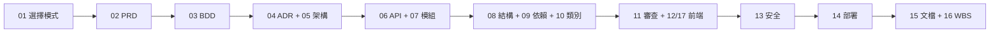

# RoomPilot-Agent VibeCoding 文件索引

> 本索引由 VibeCoding_Workflow_Templates/INDEX.md 導入 RoomPilot-Agent 生成 | 基準分支 bella-local-20260726 | 2026-07-26

> **版本:** v1.1 | **更新:** 2026-08-07

本資料夾為 `VibeCoding_Workflow_Templates/` 全套模板(01–17 + output_style)套用 RoomPilot-Agent 實況後的導入版:每份文件的路由、常數、數量、流程順序均以基準分支工作區程式碼實查填寫,查不到依據者標「(未查證)」或「待補」。跨文件共同事實(主流程 11 內部步驟/10 顆 UI 按鈕、六目錄負責人表、44 條路由、port 8002、公分制、6 風格 × 3 色卡 = 18 張、型錄 9,350 件)已於 2026-07-26 收尾時逐項對程式碼複核並統一。

---

## 目錄結構(2026-08-07 重整)

本資料夾已由「01–17 平鋪編號檔」改為對齊 `VibeCoding_Workflow_Templates/` 的六階段資料夾分類:

```text
docs/vibecoding/
├── _meta/            工作流、審查、文檔維護、Output Styles 導入(01、11、15、output_style)
├── 01_requirements/  PRD、BDD、WBS(02、03、16)
├── 02_ux_ui/         資訊架構、前端技術設計(17、12)
├── 03_architecture/  SAD、ADR(05、04)
├── 04_design/        API 規格、LLD 三件、模組規格(06、08、09、10、07)
├── 05_qa/            安全與生產準備(13)
├── 06_ops/           部署與運維(14)
└── INDEX.md
```

**編號 01–17 保留為穩定文件 ID,不隨檔名改變。** 各文件內文與本索引大量以編號互相指涉(例如「見 05 第 8 部分」「13 行動項 4」「16 3.2.3」),這些簡稱在重整後仍然有效;要由編號查實際路徑,以下方文件清單為準。

檔名沿用 `VibeCoding_Workflow_Templates/` 的模板詞彙(`prd`、`sad`、`adr`、`api_spec`、`lld_*`),與模板庫對照時以檔名為準,與既有討論對照時以編號為準。

---

## 文件清單

### 階段 0: 總覽與工作流

| # | 檔名 | 用途 |
| :---: | :--- | :--- |
| 01 | [workflow_manual.md](_meta/workflow_manual.md) | 開發流程使用說明書:模式 B(MVP)判定、主流程程式碼權威序、合併 Gate 與檢查清單 |

### 階段 1: 規劃 (02-03)

| # | 檔名 | 用途 |
| :---: | :--- | :--- |
| 02 | [prd.md](01_requirements/prd.md) | 專案簡報與 PRD:KPI、使用者故事與允收標準、待辦問題與既成決策 |
| 03 | [bdd_guide.md](01_requirements/bdd_guide.md) | BDD 指南:Gherkin 範本、主流程情境集、與 `tests/` 的落地對照表 |

### 階段 2: 架構與設計 (04-06)

| # | 檔名 | 用途 |
| :---: | :--- | :--- |
| 04 | [adr.md](03_architecture/adr.md) | ADR 空白模板 + 5 則已查證的既成決策(目錄統一、公分制、CloudFront、9,350 母集合、匯入硬化) |
| 05 | [sad.md](03_architecture/sad.md) | 架構與設計文檔:C4(L1–L3)、DDD 戰略+戰術、Sequence、ER、部署視圖、風險登記 |
| 06 | [api_spec.md](04_design/api_spec.md) | API 設計規範:44 條路由逐條核對、錯誤碼一覽、資料模型、座標與單位約定 |

### 階段 3: 詳細設計 (07-10)

| # | 檔名 | 用途 |
| :---: | :--- | :--- |
| 07 | [module_spec_engine.md](04_design/module_spec_engine.md) | 模組規格與測試案例(DbC):現況聚焦 `backend/engine` 碰撞與淨空檢查,含 9 個待補測試 |
| 08 | [lld_project_structure.md](04_design/lld_project_structure.md) | 專案結構指南:目錄樹、負責人表、命名慣例、`.gitignore` 白名單陷阱 |
| 09 | [lld_dependencies.md](04_design/lld_dependencies.md) | 模組依賴關係分析:import 邊清單、DAG 證明、外部依賴與風險 |
| 10 | [lld_class_relationships.md](04_design/lld_class_relationships.md) | 類別/元件關係文檔:dataclass 與例外類別 UML、模組依賴圖、介面契約 |

### 階段 4: 開發與品質 (11-12, 17)

| # | 檔名 | 用途 |
| :---: | :--- | :--- |
| 11 | [code_review_guide.md](_meta/code_review_guide.md) | 程式碼審查與重構指南:審查檢查點、commit 慣例、技術債 D-01~D-12 |
| 12 | [frontend_technical_design.md](02_ux_ui/frontend_technical_design.md) | 前端架構規範(技術視角):兩套前端現況、分層、效能/快取、前後端協作 |
| 17 | [information_architecture.md](02_ux_ui/information_architecture.md) | 前端資訊架構規範(使用者視角):頁面職責、十步驟旅程映射、URL、跨頁資料模型 |

### 階段 5: 安全與部署 (13-14)

| # | 檔名 | 用途 |
| :---: | :--- | :--- |
| 13 | [security_and_readiness.md](05_qa/security_and_readiness.md) | 安全與生產準備檢查清單:逐項程式碼實查、7 條行動項、生產就緒盤點 |
| 14 | [deployment_and_operations.md](06_ops/deployment_and_operations.md) | 部署與運維指南:啟動指令、環境變數全表、備份現況、Runbook 與故障排除 |

### 階段 6: 維護與管理 (15-16)

| # | 檔名 | 用途 |
| :---: | :--- | :--- |
| 15 | [documentation_and_maintenance.md](_meta/documentation_and_maintenance.md) | 文檔與維護指南:各文件 SSOT 角色、更新時機、已知待修文件清單 |
| 16 | [wbs_development_plan.md](01_requirements/wbs_development_plan.md) | WBS 開發計劃:按六模組負責人分解的任務、風險管理、里程碑 |

### 輔助

| 檔名 | 用途 |
| :--- | :--- |
| [output_style_guide.md](_meta/output_style_guide.md) | Claude Code Output Styles 導入指南:`.claude/output-styles/` 15 個樣式檔與模板對照 |

---

## 使用流程



---

## 依角色查找(專案實際負責人)

負責人與目錄歸屬出處:`README.md` 團隊目錄與合併規則(每人一個唯一主要目錄)。

| 負責人(主責範圍) | 常用文件 |
| :--- | :--- |
| 本顥(組長/整合者,文件與里程碑) | 01, 02, 04, 11, 15, 16 |
| Cody(`backend/floorplan/`、`backend/upgrade3d/`) | 03, 05, 07, 09 |
| Kai(`backend/catalog/`) | 05, 09, 13, 14 |
| Django(`backend/spatial_data/`,尚未實作) | 05, 08, 16 |
| Yen(`backend/agent/`) | 03, 07, 10 |
| AN(`backend/engine/`) | 07, 09, 10 |
| Bella(`backend/server/`、`frontend3d/`) | 06, 08, 12, 13, 14, 17 |

註:07 現況以 AN 的 `backend/engine`(碰撞/淨空)為範例模組;其餘模組規格的權威來源是 `docs/contracts/` 六份契約(見 05 第 8 部分)。

---

## 版本記錄

| 版本 | 日期 | 變更 |
| :--- | :--- | :--- |
| v1.0 | 2026-07-26 | 由 VibeCoding_Workflow_Templates 導入 RoomPilot 專案 |

---

## 待人工確認清單

以下為全套文件產出與收尾複核後仍無法由 repo/工具查證的事項,分四類。文內對應位置均已標「(未查證)」「待補」或「待議」,此處彙整供逐項銷案。

### A. 團隊/組織資訊(repo 內無紀錄,需口頭或外部來源補正)

1. 成果發表日 2026-08-20:全 repo(README + docs,排除 vibecoding 自引)grep 無任何紀錄,僅團隊口述(02 Q-005、16 里程碑 M4)。
2. 專案經理/整合者=本顥:repo 無記載(`PROJECT_HANDOFF.md` 不存在於本分支;16 §1)。
3. 總工期、各任務工時、整體與各 WBS 模組進度百分比:repo 無時程/追蹤文件(16)。
4. 各 ADR「決策者」的實際口頭拍板過程(commit 作者已證皆為 bellayang312-source);ADR-002 所提 7/7 週會決議 repo 查無紀錄;各 ADR「考量的選項」為依 commit 前後狀態回推,非當時實際討論紀錄(04)。
5. AWS 帳務與其他資源、S3+CloudFront 月成本:帳務資訊不在 repo(05 §1.1.2、§5.3)。
6. 8/20 發表用環境的部署形態(本機 demo 或雲端)、Production 是否另有部署計畫(05 §5.1.3、14)。
7. 團隊是否口頭規劃過 CI(repo 內已證無文字紀錄;14)、群組內是否另有緊急聯絡口頭約定(14 Runbook)。
8. 13 各行動項的審查人員與預計完成日;問卷 102 張 planned 選項圖的產圖負責人(16 3.6.5);遠端渲染供應商窗口與設定時程(16 6.1.1)。
9. 組員跨機驗收時 uvicorn `--host` 的實際操作方式(repo 文件無規定;13 D 節)。
10. 台灣個資法在課程情境的適用/豁免認定(法律問題;13 E 節)。
11. 資料分類文件是否存在於 repo 外(repo 內確認不存在;13 B 節)。

### B. 待團隊裁決(支撐事實已查證,決策本身未定)

1. Q-002/D-11:`surface_catalog.json` 12 個舊風格 profile 與 6 風格 ID 的映射是否有意設計——程式事實已全數查證(3 個同名命中、3 個落 fallback `scandinavian`,`main.py:428`),設計意圖待 Kai/Bella 裁決(02、11 D-11、16 3.2.3)。
2. ~~D-09:「舊有:/舊友:12種風格與JSON」重複目錄去留~~ **已結案(2026-08-04)**:「舊有:」目錄已不存在,無需裁決(11 D-09、16 3.2.2)。
3. frontend3d 最終定位(除役 vs 保留為 DXF 除錯工具)——程式證據兩面均已核實(docstring 稱 retired vs 路由/測試存活、`npm install` ERESOLVE 失敗),定性屬產品裁決(12 §0、17 §6.5、16 4.2.1)。
4. pytest-bdd 引入與否(事實前提已證:pyproject/uv.lock 零命中、無 `features/`;03)。
5. `main.py` 拆 APIRouter、死碼去留(`detect_geometry`、`default_ocr_provider`、`engine/adjustment.py` 鏈)——D-04 死碼是否被 repo 外系統(room_pilot2)使用無從 grep(09、11、16)。
6. CHANGELOG 建立與 commit 風格收斂、README 授權段、frontend3d/examples README 更新或標記淘汰、`VibeCoding_Workflow_Templates/` 目錄去留(15)。
7. 覆蓋率目標值(模板預設 80%+ 已核實為模板原文,本專案是否採納待訂;16 §4)、轉換率目標(專案無任何追蹤程式碼;17 §4)。
8. 效能專項審查流程(repo 內無既定流程與紀錄,「待補」屬如實陳述;11)。

### C. 技術驗證缺口(工具/環境限制,暫無法實測)

1. OpenRouter LLM 模式的實際線上呼叫(環境無 API key;僅驗證降級邏輯與環境變數條件的程式碼)。
2. CloudFront base URL 的網路可達性(僅驗證程式碼常數與 manifest,未打外網;文件未宣稱可達性)。
3. `npm run dev` / `npm run build` / `npm ci` 可行性(`npm install --dry-run` 已實測 ERESOLVE 失敗,依賴裝不起來,後續步驟無法驗證;12、14)。
4. static UI `innerHTML` 109 處是否每處都經 `escapeHtml` 跳脫(僅量測分佈,逐點審計=13 行動項 5)。
5. a11y 鍵盤導航/對比度/螢幕閱讀器系統性驗證(僅確認零星 aria 屬性存在;12 §5)。
6. S3 bucket AWS 端實際權限設定(kai 分支 KAI_progress.md 設計意圖已證,AWS 實況需向 Kai 確認=13 行動項 4)。
7. ezdxf 解析惡意 DXF 的資源消耗防護(屬 ezdxf 套件內部行為;13 C 節)。
8. 回滾到「無版號時代」前端讀 v2 workflow 資料的實際行為(v2 之前的程式無版號可比對;14 §6)。
9. 瀏覽器實機驗證:10 顆步驟按鈕已由 `scene.html:23-32` 標記實證(恰 10 顆 `data-step` 按鈕,標籤與各文件表一致),以及 17 §4 的操作敘述,均為靜態程式碼核對,未以瀏覽器實機走完十步驟。
10. 主流程表第 8(3D 白模)、10(方案鎖定)步的「主要結果」為 UI 行為概述,無對應伺服器端點可逐一驗證(02)。
11. `.claude/settings.local.json` 切換紀錄行為(官方文件聲明;repo 無此檔,未實際切換驗證;output_style)。

### D. 本批收尾已補查證(原列未查證,2026-07-26 完成)

1. 全量 pytest 重跑:389 通過 / 2 失敗 / 1 跳過(2 失敗均為 `tests/test_scene_v2_contract.py` 既有快取鍵紅燈);03 對照表引用的場景測試(`test_project_workflow_api`、`test_scene_layout_regions`)在其中全數通過。
2. manifest 9,350 列逐列複核:全為 `upload_status=uploaded`(白名單內);`GET /api/catalog/status` TestClient 實跑 200,`verified_model_count=9350`、`manifest_ready=true`。
3. `GET /docs` 與 `GET /openapi.json` TestClient 實測均回 200(15、output_style 已回寫)。
4. 窗簾 GLB 缺檔行為釐清:窗簾為固定假想品項(`main.py:2440-2450`)不經型錄查找、不觸發 409;409 `decor_model_missing` 屬燈/地毯/植栽等型錄角色查無 GLB 的路徑(`main.py:2409-2416`);前端對載入 404 已有白色替代物兜底(`scene_viewer.js:2955-2957`)——02/05/14/16 相關描述已統一修正。
5. 頁首引用註記已全數統一為「基準分支 bella-local-20260726 | 2026-07-26」,全資料夾 grep 確認無任何模板佔位殘字;程式基準 commit e48cd67 的說明保留於 13/14 內文。
