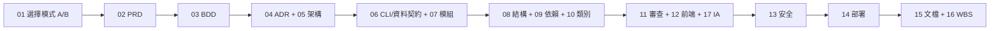
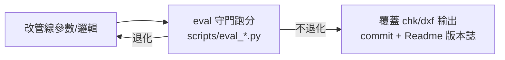

# RoomPilot-Agent VibeCoding 文件索引

> **版本:** v1.0 | **更新:** 2026-07-25 | **狀態:** 草稿
>
> 本目錄（`docs/vibecoding/`）是 `VibeCoding_Workflow_Templates/` 模板 **v3.1（2026-05-26）** 對 RoomPilot-Agent 專案的**實例化**：每份文件保留模板章節骨架，但內容已全部填入本專案真實事實（路徑、指標、決策），事實基準為 `Readme.md` v2.16（2026-07-25）與原始碼實查。閱讀時以本套文件為準；要看通用模板原文請回 `VibeCoding_Workflow_Templates/`。
>
> 專案一句話：建築平面圖 PNG → DXF 向量圖（牆/窗/門，公分單位）＋房間切割與房型命名＋品質檢核圖與 HTML 報表。純 Python CLI，無 Web 後端、無資料庫、無 REST API。

---

## 文件清單（每份一行摘要，指向實例化後內容）

### 階段 0: 總覽與工作流

| # | 檔名 | 本專案實例化內容 |
| :---: | :--- | :--- |
| 01 | [workflow_manual.md](./01_workflow_manual.md) | 開發流程說明書：模式 A（完整流程，換權重/授權/新容器級模組）vs 模式 B（研究迭代）、eval 守門 Gate 取代審查 Gate、「分支即機器」協作、RACI 角色的本專案對應 |

### 階段 1: 規劃 (02-03)

| # | 檔名 | 本專案實例化內容 |
| :---: | :--- | :--- |
| 02 | [project_brief_and_prd.md](./02_project_brief_and_prd.md) | 專案簡報與 PRD：定位（PNG→DXF＋房型辨識，下游是櫃體設計）、v2.16 現況指標（彩窗 P62/R38 為最大缺口、命名 own 尺 0.788）、去 CubiCasa 授權替換為商用前提 |
| 03 | [behavior_driven_development_guide.md](./03_behavior_driven_development_guide.md) | BDD 指南：Gherkin 範例全取自真實場景（灰階轉檔、彩窗偵測、權重缺檔自動下載＋SHA-256 校驗、eval 不退化）；`.feature` 定位為規格溝通文件，自動化由 pytest（`tests/` 6 檔）＋eval harness 兩層承接 |

### 階段 2: 架構與設計 (04-06)

| # | 檔名 | 本專案實例化內容 |
| :---: | :--- | :--- |
| 04 | [architecture_decision_record_template.md](./04_architecture_decision_record_template.md) | ADR 模板＋本專案既有重大決策回填為 ADR-001~006（依據 `Readme.md`、`docs/HANDOVER_finetune_v5.md` 等）；新決策複製模板附加於檔末 |
| 05 | [architecture_and_design_document.md](./05_architecture_and_design_document.md) | 架構與設計文件（模板 05 v2.0 C4 嚴格版）：命名防呆表（C4 層級 vs 四層級辨識成功率 vs 三層證據 vs 44 類）、Container 分解（灰階/彩色管線、房型辨識、評測 harness、訓練管線…）、DDD 戰略＋戰術雙層 |
| 06 | [api_design_specification.md](./06_api_design_specification.md) | REST API → N/A（無 HTTP 服務），轉寫為「**CLI 與資料契約規範**」：各腳本 argparse 契約、`config.ini`/`config_color.ini` 與環境變數（`CC_WEIGHTS`/`CC_CACHE_DIR`/`GITHUB_TOKEN`）、DXF 圖層與 `json/`、`.npz` 輸出 schema |

### 階段 3: 詳細設計 (07-10)

| # | 檔名 | 本專案實例化內容 |
| :---: | :--- | :--- |
| 07 | [module_specification_and_tests.md](./07_module_specification_and_tests.md) | 5 個核心模組的 DbC 規格與測試案例：`_ensure_cc_weights`（權重供應鏈）、`segment_rooms`（切割）、`classify_rooms_cc`（命名）、`eval_rooms_cc`（評分尺）、`detect_windows`（窗偵測）；每模組同時列單元層 TC 與評測層回歸門檻 |
| 08 | [project_structure_guide.md](./08_project_structure_guide.md) | 專案結構指南（根目錄實際盤點）：管線腳本在 `scripts/`、入口在根、資料即一級公民（`Identify_ans/`、`cubicasa/room/` 進版控）、gray/color 輸出隔離、凍結區與大檔不進 Git 原則 |
| 09 | [file_dependencies_template.md](./09_file_dependencies_template.md) | 模組依賴 DAG：入口層→管線層→模型層→資料層→評測層；DIP 落實方式＝`floorplan2room.py` 經 subprocess 呼叫 `scripts/infer_cubicasa.py`、以 `cubicasa/room/*_mask.npz` 快取為介面（快取命中即不需深度學習環境） |
| 10 | [class_relationships_template.md](./10_class_relationships_template.md) | 類別/元件關係：真實類別集中在訓練子系統 `training/CubiCasa5k/floortrans/`（hourglass CNN、SVG 標注解析、Dataset）；主管線為函式式風格，以「函式呼叫圖」如實呈現，不硬湊類別 |

### 階段 4: 開發與品質 (11-12, 17)

| # | 檔名 | 本專案實例化內容 |
| :---: | :--- | :--- |
| 11 | [code_review_and_refactoring_guide.md](./11_code_review_and_refactoring_guide.md) | 審查與重構指南：前置條件＝eval 守門通過（改 chk/dxf 邏輯前先對 `Identify_ans/pngans/` 建基線、不得退化）、凍結清單（`scripts/floorplan2dxf.py`、`own_eval/` 永不進訓練）、House 相容陷阱防禦（`scripts/fix_own_floor.py`） |
| 12 | [frontend_architecture_specification.md](./12_frontend_architecture_specification.md) | 前端架構：無 SPA 框架，盤點三個 HTML 實體——`recognition_report.html`（靜態報表，0 行 JS、支援深色模式）、`review.html`（標注覆核臨時工作檔）、`cabinet_designer.py` 內嵌單頁應用（`127.0.0.1:8765`）；N/A 段落附「未來前端整合建議值」 |
| 17 | [frontend_information_architecture_template.md](./17_frontend_information_architecture_template.md) | 前端資訊架構：`recognition_report.html` 報表頁與 `review.html` 覆核頁的 IA（單頁層級 L0~L3、旅程 A/B）、誠實原則（數字可溯源、循環分數標注）；與 12 號的分工＝12 談技術架構、17 談使用者/內容視角 |

### 階段 5: 安全與部署 (13-14)

| # | 檔名 | 本專案實例化內容 |
| :---: | :--- | :--- |
| 13 | [security_and_readiness_checklists.md](./13_security_and_readiness_checklists.md) | 安全與生產準備清單：重心放在兩大真實風險——**CubiCasa CC BY-NC 授權合規（禁商用）**與 **GITHUB_TOKEN（PAT）秘密管理**；權重供應鏈三層防禦（私有 repo 認證→SHA-256 校驗→pytest 鎖行為）；Web 安全項逐條標 N/A＋理由 |
| 14 | [deployment_and_operations_guide.md](./14_deployment_and_operations_guide.md) | 部署與運維：「部署」＝多機安裝同步（clone → pip install → 權重自動下載自 Release `weights-v5`）＋GPU 機訓練換機流程（`training/finetune_data.zip` 走實體媒介）；「監控」＝eval 守門報表（`json/eval_rooms/`）與 `recognition_report.html` 儀表板 |

### 階段 6: 維護與管理 (15-16)

| # | 檔名 | 本專案實例化內容 |
| :---: | :--- | :--- |
| 15 | [documentation_and_maintenance_guide.md](./15_documentation_and_maintenance_guide.md) | 文檔與維護指南：全部文檔資產盤點與 SSOT 分工——`Readme.md` 版本誌（v1.0~v2.16，兼輕量 ADR）、`scripts/README.md`（逐腳本用法）、`docs/HANDOVER_finetune_v5.md`（訓練交接）、`.claude/rules/` 八檔（流程規範） |
| 16 | [wbs_development_plan_template.md](./16_wbs_development_plan_template.md) | WBS 開發計劃：以 v2.16 待辦優先序展開真實工作分解（彩窗召回 38% 攻堅、切割收尾、own_dataset 擴充 50~100 題、門位精準率 0.576…），總工期約 10~14 週（估），授權替換列長期線 |

### 附錄

| # | 檔名 | 本專案實例化內容 |
| :---: | :--- | :--- |
| 附錄 | [output_style.md](./output_style.md) | Output Styles 標準作業提案（SDD/BDD/TDD 三種輸出風格），非 01~17 模板實例；內文交叉引用 03/05/07/11/12 |

---

## 使用流程

模板原流程圖保留，節點以本套實例化文件對應（12/17 分工邊界見兩份文件開頭的 MECE 說明）：

本專案日常最高頻的實際迴圈是（模式 B，研究迭代）：

---

## 依角色查找（本專案角色）

本專案無 PM/TL/ARCH/SEC/SRE 編制（內部小團隊、多機協作），角色依實際工作性質劃分：

| 角色 | 做什麼 | 常用文件 |
| :--- | :--- | :--- |
| **管線開發**（彩色管線調參、房型辨識融合） | 改 `scripts/floorplan2dxf_color.py`、`floorplan2room.py`，跑 eval 守門 | 01（模式與 Gate）、05（架構）、06（CLI/設定契約）、07（模組規格）、09（依賴）、11（審查與凍結清單） |
| **標注**（own 資料集/GT 製作與修復） | `Identify_ans/` 標注、VLM 盲標＋人工把關、`scripts/fix_own_floor.py` 修復 | 08（資料目錄分界）、11 §4（House 相容陷阱）、03（驗收場景）、15（標注文檔的 SSOT） |
| **訓練**（CubiCasa 微調、DINOv2 探針） | GPU 機跑 `training/CubiCasa5k/train.py`、打包 `finetune_data.zip`、發佈權重 Release | 04（決策紀錄）、10（floortrans 類別）、14（換機與權重發佈流程）、16（WBS 里程碑）、`docs/HANDOVER_finetune_v5.md` |
| **部署**（新機安裝、外部整合對接） | clone → pip install → 設 `GITHUB_TOKEN` 自動下載權重；對外交接 `json/` 契約 | 06（環境變數與輸出 schema）、13（token 與授權合規）、14（多機拓撲與安裝步驟）、12（未來前端整合介面） |
| **決策者**（repo owner） | 重大取捨裁決（如 v5 接管預設權重、目標域＝own） | 01（模式升級觸發）、02（目標與指標）、04（ADR）、16（優先序） |

---

## 版本記錄

| 版本 | 日期 | 變更 |
| :--- | :--- | :--- |
| v1.0 | 2026-07-25 | 初始版本：由 VibeCoding 模板 v3.1（2026-05-26）實例化為 RoomPilot-Agent 專屬文件套（01~17 共 17 份），事實基準 Readme.md v2.16 |
